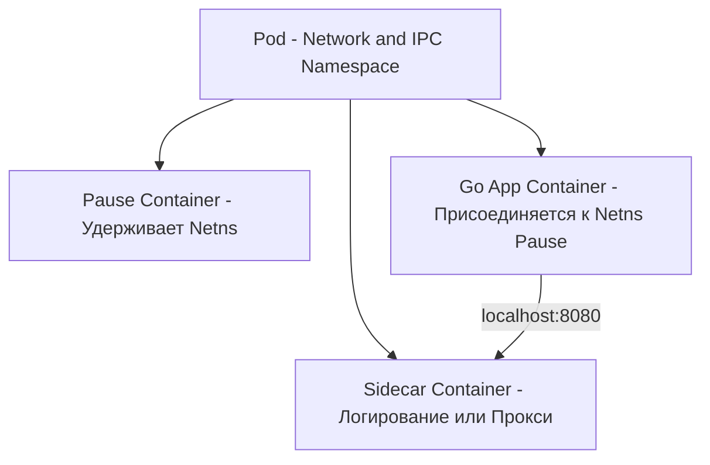
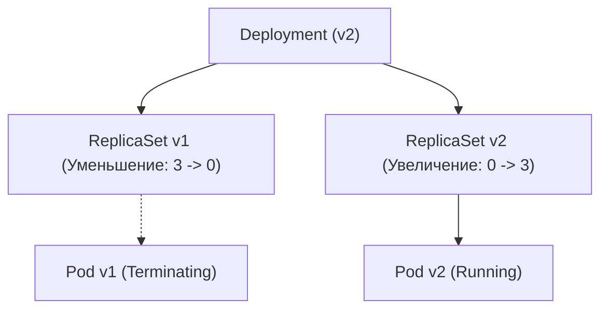
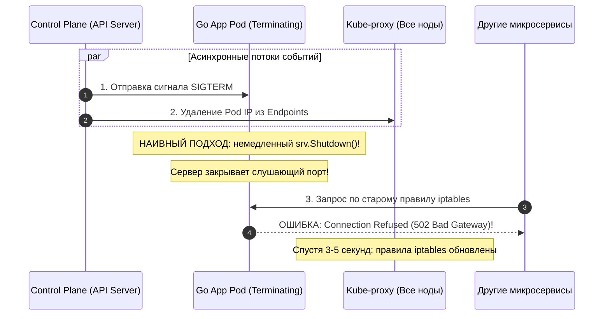

# Pod, Deployment и Service: Анатомия примитивов Kubernetes и Graceful Shutdown в Go

Разобрав архитектурный фундамент Kubernetes в лекции [[1. Kubernetes. Архитектура]], мы готовы спуститься на уровень базовых абстракций рабочей нагрузки (Workload API), с которыми бэкенд-инженер взаимодействует ежедневно.

Триада **`Pod`**, **`Deployment`** и **`Service`** — это краеугольный камень оркестрации в K8s. Понимание их взаимодействия, скрытой роли служебного контейнера `pause`, механики зондирования (Probes) и асинхронного выбывания из сетевой балансировки критически важно для развертывания высоконагруженных сервисов на Go с истинным нулевым временем простоя (**Zero-Downtime Deployment**).

---

## 1. Pod: Атомарная частица Kubernetes и контейнер Pause

В Docker базовой единицей изоляции выступает отдельный контейнер. В Kubernetes минимальной неделимой единицей планирования и развертывания является **Pod (Под)**.

Под — это не контейнер, а **группа из одного или нескольких тесно связанных контейнеров**, помещенных в единую изолированную среду (**Sandbox**). 

Все контейнеры внутри одного Пода:
1. **Разделяют общий Network Namespace:** У них один общий IP-адрес, единый диапазон сетевых портов и общий сетевой стек. Контейнеры внутри пода обращаются друг к другу через интерфейс локальной петли **`localhost`**.
2. **Разделяют общий IPC Namespace:** Могут взаимодействовать через высокоскоростную разделяемую память (POSIX Shared Memory, семафоры).
3. **Могут монтировать общие тома (Volumes):** Например, один контейнер генерирует файлы, а sidecar-контейнер передает их в S3.

### Под капотом: Роль служебного контейнера Pause
Каким образом Kubernetes гарантирует, что при аварийном падении вашего Go-бинарника сетевой IP-адрес пода не исчезнет, а открытые сетевые сокеты и правила маршрутизации останутся в сохранности?

Когда Kubelet создает Pod, он первым делом запускает скрытый инфраструктурный контейнер — **`pause`** (sandbox container):
* Бинарник `pause` написан на Си и скомпилирован статически; он весит считанные килобайты.
* Вся его задача — вызвать системный вызов `pause()`, который навсегда усыпляет процесс в ожидании сигналов ОС.
* Контейнер `pause` создает и удерживает пространства имен **Network** и **IPC**.

Когда стартует ваш основной Go-контейнер и вспомогательные контейнеры (Sidecars, например Envoy-прокси в Service Mesh или сборщик логов Fluentbit), они запускаются с директивой объединения пространств имен (`--net=container:pause`). Если ваш Go-сервер рухнет с паникой и Kubelet начнет перезапуск, сетевой интерфейс пода ни на микросекунду не отключится, потому что его надежно удерживает спящий процесс `pause`!



> [!warning] Ловушка / Gotcha: Конфликт сетевых портов внутри Пода
> Поскольку все контейнеры в Поде делят общий сетевой стек, они **категорически не могут слушать один и тот же порт**. 
> 
> Если ваше Go-приложение биндится на `:8080`, а sidecar-экспортер метрик Prometheus тоже попытается занять порт `8080`, системный вызов `bind()` немедленно вернет ошибку ядра:
> ```text
> bind: address already in use
> ```
> Всегда жестко разводите номера портов между основным приложением и вспомогательными sidecar-контейнерами.

---

## 2. Deployment: Управление жизненным циклом и репликацией

В продакшен-средах «голые» поды напрямую практически никогда не создаются вручную. Если физический сервер перезагрузится, одиночный Pod погибнет навсегда.

Управление жизненным циклом делегируется контроллеру **`Deployment`**:
1. Deployment описывает желаемое состояние: версию образа, стратегию выкатки и количество реплик.
2. Deployment создает и контролирует дочерний объект — **`ReplicaSet`**.
3. ReplicaSet гарантирует, что в кластере в любой момент времени запущено ровно `replicas` одинаковых подов.
4. При обновлении тега образа Deployment создает **второй ReplicaSet**, постепенно наращивая в нем число подов и синхронно уменьшая реплики в старом ReplicaSet (**Rolling Update**).



---

## 3. Пробы жизнеспособности (Probes): Симбиоз Kubelet и рантайма Go

Kubernetes не может знать внутреннее состояние вашего приложения, просто глядя на статус процесса в ОС. Процесс Go может не падать, но намертво зависнуть в бесконечном цикле или дедлоке мьютексов. 

Для проверки реального здоровья Kubelet использует три типа проб:

### 1. `startupProbe` (Проба запуска)
Предназначена для медленно инициализирующихся сервисов. Если ваш Go-бэкенд при холодном старте выполняет миграции БД, прогревает тяжелые кэши или вычитывает гигабайтные справочники в память, `startupProbe` дает ему запас времени (например, до 2 минут). Пока startup-проба не вернет статус `Success`, остальные пробы даже не запускаются.

### 2. `livenessProbe` (Проба живучести)
Проверяет, способен ли процесс выполнять работу в принципе. Если liveness-проба падает (например, 3 раза подряд вернула HTTP-код 500 или таймаут), Kubelet безжалостно **уничтожает Pod** сигналом `SIGTERM`, а затем `SIGKILL`, и перезапускает контейнер.

> [!warning] Ловушка / Gotcha: Каскадный блэкаут при внешней проверке в Liveness Probe
> **Никогда не проверяйте состояние внешних зависимостей (PostgreSQL, Redis, Kafka) внутри Liveness Probe!**
> 
> Если в вашем дата-центре кратковременно моргнет сеть до базы данных PostgreSQL, и эндпоинт `/healthz` вашего Go-сервиса начнет возвращать ошибку 503 из-за недоступности БД, Kubelet решит, что сломался сам сервис. Он начнет **одновременно перезапускать все 100 подов кластера**. 
> 
> Когда сеть до БД восстановится, база захлебнется от одновременного шквала входящих подключений (Thundering Herd) от сотен перезапускающихся сервисов. Liveness Probe обязана проверять **только внутреннее состояние Go-процесса** (отсутствие дедлока, работу локального рантайма).

### 3. `readinessProbe` (Проба готовности)
Проверяет, готов ли сервис принимать входящий пользовательский трафик в данный момент. Если readiness-проба возвращает ошибку, Kubernetes **не убивает контейнер**! Он просто временно **исключает IP-адрес этого пода из балансировщика Service**. Это идеальное место для проверки доступности БД и прогрева кэшей.

> [!info] Под капотом: Задержки распространения статуса Readiness
> Пробы выполняет Kubelet локально на ноде с интервалом `periodSeconds`. 
> 
> Когда readiness-проба падает, Kubelet не может мгновенно снять трафик со всех балансировщиков мира. Он отправляет обновление статуса в `kube-apiserver`, тот обновляет объект `Endpoints` в `etcd`, а демоны `kube-proxy` на всех 500 нодах кластера должны вычитать это событие и перестроить свои таблицы `iptables`/`IPVS`.
> 
> Этот распределенный конвейер занимает от 1 до 5 секунд.

---

## 4. Service: Стабильная точка входа в мире эфемерных подов

Поскольку поды постоянно пересоздаются, их IP-адреса непрерывно меняются. Чтобы клиенты могли стабильно обращаться к пулу бэкендов, Kubernetes предоставляет абстракцию **`Service`**.

Service объединяет поды с помощью строкового селектора меток (например, `selector: app=my-go-app`) и выделяет виртуальный неизменяемый адрес **ClusterIP** (VIP):

1. Выделяется стабильный виртуальный IP из специального диапазона кластера (ClusterIP).
2. Внутренний DNS-сервер **CoreDNS** создает запись:
   ```text
   my-go-app.default.svc.cluster.local
   ```
3. Демоны `kube-proxy` настраивают правила ядра (`iptables` или `IPVS`), перехватывающие запросы на ClusterIP и транслирующие их через DNAT на реальные IP-адреса здоровых подов.

В Go-коде межсервисное взаимодействие выглядит прямолинейно:
```go
// Обращение по символическому DNS-имени Сервиса
resp, err := http.Get("http://billing-service:8080/api/charge")
```

### Headless Service (clusterIP: None)
Если указать в манифесте `clusterIP: None`, сервис переходит в режим **Headless (Безголовый)**:
* K8s не выделяет виртуальный ClusterIP и не создает правила проксирования.
* DNS-сервер CoreDNS при запросе к такому сервису возвращает **список реальных IP-адресов всех запущенных подов (A-записи)**.

Это критически важно для развертывания распределенных Stateful-систем на Go (кластеры Raft, CockroachDB, Kafka, Cassandra), где узлам необходимо напрямую общаться с конкретными пирами, а не балансироваться случайным образом.

---

## 5. Самая страшная гонка: Анатомия Zero-Downtime Graceful Shutdown

Пожалуй, самая распространенная эксплуатационная ошибка, приводящая к появлению ошибок `502 Bad Gateway` и `Connection Refused` во время деплоя, — это неправильно реализованный **Graceful Shutdown** в Go.

### В чем суть распределенной гонки (Race Condition)?
Когда Kubernetes обновляет Deployment, для старого пода происходят два независимых асинхронных процесса:
1. **Процесс остановки пода:** Kubelet отправляет главному процессу контейнера сигнал **`SIGTERM`**.
2. **Процесс обновления сети:** API Server регистрирует удаление пода и рассылает события всем `kube-proxy` на всех воркер-нодах кластера для удаления IP-адреса пода из цепочек `iptables`/`IPVS`.



Если Go-разработчик наивно напишет:
```go
<-sigChan
srv.Shutdown(ctx) // Закрываем сокет НЕМЕДЛЕННО
```
то сервер мгновенно закроет слушающий порт `:8080`. Но в течение следующих 2–5 секунд `kube-proxy` на соседних серверах *еще не успеет обновить таблицы iptables ядра*! 

Внешние балансировщики и соседние микросервисы продолжат слать запросы на старый IP-адрес, получая в ответ немедленный сброс соединения (**TCP RST / Connection Refused**) и выбивая ошибки пользователям.

### Канонический паттерн Graceful Shutdown для Go в Kubernetes

Чтобы гарантировать 100% Zero-Downtime, Go-сервис обязан выдержать **паузу тишины (Draining Delay)** перед закрытием слушающего сокета:

```go
package main

import (
	"context"
	"errors"
	"log"
	"net/http"
	"os"
	"os/signal"
	"syscall"
	"time"
)

func main() {
	mux := http.NewServeMux()
	mux.HandleFunc("/healthz", func(w http.ResponseWriter, r *http.Request) {
		w.WriteHeader(http.StatusOK)
		w.Write([]byte("OK"))
	})
	mux.HandleFunc("/api/work", func(w http.ResponseWriter, r *http.Request) {
		time.Sleep(100 * time.Millisecond) // полезная работа
		w.Write([]byte("Done"))
	})

	srv := &http.Server{
		Addr:    ":8080",
		Handler: mux,
	}

	// 1. Контекст перехвата системных сигналов завершения
	ctx, stop := signal.NotifyContext(context.Background(), syscall.SIGTERM, syscall.SIGINT)
	defer stop()

	go func() {
		if err := srv.ListenAndServe(); err != nil && !errors.Is(err, http.ErrServerClosed) {
			log.Fatalf("HTTP server failed: %v", err)
		}
	}()

	log.Println("Service started on :8080")
	<-ctx.Done() // Ожидаем SIGTERM от Kubernetes

	log.Println("SIGTERM received, entering network drain pause...")

	// 2. КРИТИЧЕСКИ ВАЖНО: Спим 5-10 секунд, пока Kube-proxy вычищает наш IP из всех iptables!
	// Сервер ПРОДОЛЖАЕТ принимать и обрабатывать запросы в этот период.
	time.Sleep(10 * time.Second)

	log.Println("Shutting down HTTP server gracefully...")

	// 3. Штатный Shutdown: закрываем сокет на прием новых подключений,
	// но даем активным HTTP-обработчикам 15 секунд на завершение
	shutdownCtx, cancel := context.WithTimeout(context.Background(), 15*time.Second)
	defer cancel()

	if err := srv.Shutdown(shutdownCtx); err != nil {
		log.Printf("Server forced to shutdown: %v", err)
	}

	log.Println("Service exited cleanly")
}
```

> [!tip] Собеседование: Параметр terminationGracePeriodSeconds
> **Вопрос:** Как корректно настроить параметр `terminationGracePeriodSeconds` в спецификации Пода с учетом Graceful Shutdown в Go?
> 
> **Ответ:** 
> Директива `terminationGracePeriodSeconds` (по умолчанию 30 секунд) задает максимальный тайм-лимит, который Kubernetes выделяет Поду после отправки `SIGTERM`. По истечении этого таймера ядро Linux принудительно отправляет бескомпромиссный сигнал `SIGKILL`.
> 
> **Золотое уравнение таймингов:**
> $$\text{Задержка сети (Sleep)} + \text{Таймаут Shutdown} < \text{terminationGracePeriodSeconds}$$
> 
> Если в коде заложена пауза 10 секунд на слив iptables и 15 секунд на `http.Server.Shutdown`, их сумма составляет 25 секунд. В этом случае дефолтного значения `terminationGracePeriodSeconds: 30` достаточно. 
> Если же обработка очередей или длинных запросов требует 30 секунд, `terminationGracePeriodSeconds` в YAML-манифесте обязан быть увеличен до 45–60 секунд, иначе K8s убьет процесс по `SIGKILL`, оборвав клиентские транзакции на полуслове!

---

## Итог

1. **Под как песочница:** Контейнеры внутри Пода разделяют сеть через спящий процесс `pause` и общаются по `localhost`.
2. **Иерархия Deployment -> ReplicaSet -> Pod:** Гарантирует поддержание желаемого числа реплик и плавный Rolling Update.
3. **Строгое разделение проб:** `startupProbe` защищает медленный старт, `readinessProbe` управляет балансировкой трафика, а `livenessProbe` должна проверять только локальные дедлоки без внешних зависимостей.
4. **Service и CoreDNS:** Создают стабильный ClusterIP и имя хоста для пула подов, балансируя трафик через таблицы ядра `iptables`/`IPVS`.
5. **Draining Delay при остановке:** Асинхронное удаление IP из сети требует обязательной паузы (sleep 5–10с) в Go перед вызовом `srv.Shutdown()`, исключая ошибки 502 при обновлении кластера.

Наши сервисы запущены, защищены от сбоев и корректно завершают работу. Однако хардкодить параметры конфигурации и секретные ключи в образы недопустимо. В следующей статье мы разберем декларативное управление конфигурациями: [[3. ConfigMap и Secret]].