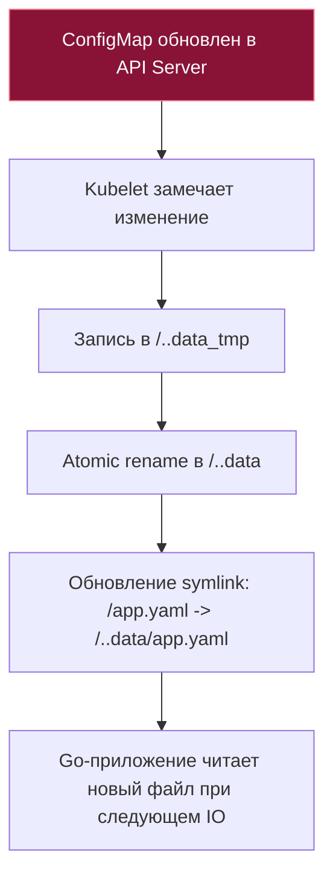

# ConfigMap и Secret в Kubernetes: От атомарных симлинков до горячей перезагрузки в Go

В предыдущей статье [[2. Pod, Deployment, Service]] мы изучили жизненный цикл подов и организацию сетевого взаимодействия. Однако жесткое зашивание конфигурационных параметров, адресов баз данных или токенов авторизации непосредственно в Docker-образы или бинарные файлы — верный путь к эксплуатационной катастрофе.

Согласно канонической методологии **Twelve-Factor App (III. Конфигурация)**, конфигурация обязана быть строго отделена от исполняемого кода приложения. Один и тот же скомпилированный Go-бинарник должен без пересборки запускаться как на локальной машине разработчика, так и в окружениях Staging и Production, меняя свое поведение исключительно под воздействием внешних настроек.

В Kubernetes эту задачу решают два фундаментальных примитива: **ConfigMap** (для открытых неконфиденциальных параметров) и **Secret** (для защищенных учетных данных). То, как именно оркестратор доставляет эти данные в адресное пространство вашего Go-процесса, определяет архитектуру конфигурационного слоя, безопасность и возможность обновления настроек без перезапуска сервиса (**Hot Reload**).

---

## 1. ConfigMap против Secret: Архитектурные различия и иллюзия шифрования

На уровне манифестов оба ресурса выглядят практически идентично: это распределенные словари формата «ключ-значение». Однако их внутреннее назначение и модель безопасности кардинально различаются:

1. **ConfigMap:** Хранит нечувствительные текстовые данные в открытом виде (UTF-8). Предназначен для настроек пулов соединений, URL-адресов микросервисов, таймаутов и флагов функциональности (**Feature Flags**).
2. **Secret:** Предназначен для хранения конфиденциальных данных: приватных TLS-ключей, паролей СУБД, OAuth-токенов и SSH-ключей. В манифесте YAML значения полей кодируются алгоритмом **Base64**.

> [!warning] Ловушка / Gotcha: Base64 — это НЕ шифрование!
> Самое распространенное и опасное заблуждение начинающих инженеров: считать, что `Secret` в Kubernetes автоматически шифрует данные.
> 
> **Base64 — это всего лишь обратимое текстовое кодирование бинарных данных, а не криптографическое шифрование!** 
> Любой пользователь или CI/CD скрипт, обладающий правами на чтение объекта `Secret` через `kubectl get secret -o yaml`, мгновенно декодирует ваш боевой пароль командой:
> ```bash
> echo "c3VwZXItc2VjcmV0LXBhc3M=" | base64 -d
> ```
> Более того: по умолчанию база данных `etcd` хранит объекты `Secret` на диске в открытом виде. 
> 
> Чтобы обеспечить реальную безопасность корпоративного уровня, администраторы кластера обязаны:
> 1. Включить шифрование на уровне самого `etcd` (**EncryptionConfiguration at Rest**) с интеграцией внешних KMS-провайдеров (AWS KMS, HashiCorp Vault, Google Cloud KMS).
> 2. Жестко ограничить права доступа к ресурсам Secret через ролевую модель RBAC.

---

## 2. Способы доставки конфигурации: Переменные окружения против Монтирования томов

Kubernetes предоставляет два принципиально разных механизма доставки данных из ConfigMap/Secret в запущенный контейнер Go:

### Метод 1: Переменные окружения (Environment Variables)
Ключи словаря транслируются в системные переменные окружения контейнера:

```yaml
env:
  - name: DB_HOST
    valueFrom:
      configMapKeyRef:
        name: app-config
        key: database_url
```

В Go-коде чтение выполняется прямолинейно через стандартную функцию `os.Getenv()`:
```go
dbHost := os.Getenv("DB_HOST")
```

> [!info] Под капотом: Статическая природа переменных окружения
> Переменные окружения передаются операционной системой дочернему процессу в момент вызова системного вызова `execve()`. Они фиксируются в структуре процесса ядра Linux и доступны через виртуальную файловую систему `/proc/<pid>/environ`.
> 
> **Критическое ограничение:** Если вы измените значение ключа в `ConfigMap`, переменная окружения внутри уже работающего Go-контейнера **никогда не обновится!** Чтобы применить новое значение, Pod необходимо принудительно перезапустить (например, через `kubectl rollout restart deployment`).

### Метод 2: Монтирование в виде файлов (Volume Mount)
Kubernetes создает виртуальную файловую систему и монтирует ее в указанный каталог контейнера (как мы разбирали в лекции [[5. Volumes и хранение данных]]). При этом каждый ключ ConfigMap становится именем файла, а значение ключа — содержимым этого файла:

```yaml
volumes:
  - name: config-volume
    configMap:
      name: app-config
```

---

## 3. Атомарное обновление и Горячая перезагрузка (Hot Reload) через Symlinks

Если `ConfigMap` или `Secret` смонтированы в контейнер как том (**Volume Mount**), Kubernetes наделяет их уникальным свойством: **он автоматически обновляет содержимое файлов внутри работающего контейнера при изменении манифеста в API Server без перезапуска Пода!**

Но как Kubelet обновляет файлы так, чтобы Go-сервис не прочитал файл в полузаписанном (поврежденном) состоянии в момент изменения?

Оркестратор использует изящный паттерн **атомарной подмены символических ссылок (Atomic Symlink Swapping)**:

1. Kubelet скачивает обновленные данные из API Server и записывает их в новый каталог со случайным временным именем, например `..data_tmp`.
2. Kubelet вызывает системный вызов ядра Linux **`rename()`**, переименовывая `..data_tmp` в скрытую директорию с версией `..data_<timestamp>`. (В файловых системах Linux операция `rename()` строго атомарна).
3. Создается промежуточная символическая ссылка `..data`, указывающая на свежий каталог с версией.
4. Файлы конфигурации в корне точки монтирования (например, `/app/config/app.yaml`) изначально являются мягкими ссылками, указывающими на `..data/app.yaml`. Kubelet атомарно переставляет указатель `..data`, и все файлы внутри контейнера мгновенно и без блокировок начинают указывать на новые данные!



---

## 4. Реактивная перезагрузка конфигурации в Go через fsnotify

Как научить ваш Go-сервис реагировать на изменения конфигурации на лету, не требуя рестарта процесса?

Для отслеживания событий файловой системы в Go применяется библиотека **`github.com/fsnotify/fsnotify`**, которая под капотом транслирует вызовы в системный механизм ядра Linux **`inotify`**.

### Подводный камень: Отслеживание inodes и symlinks
В Linux системный вызов `inotify` отслеживает не путь к файлу, а конкретный номер индексного дескриптора (**inode**) на диске. 
Поскольку Kubernetes при обновлении не модифицирует старый файл, а создает новый каталог и переставляет симлинк `..data`, отслеживание конкретного файла `/app/config/app.yaml` сломается после первого же обновления!

**Идиоматичное решение:** В Go необходимо подписываться на уведомления **родительской директории**, отлавливая события создания (`Create`) и записи (`Write`):

```go
package main

import (
	"log"
	"path/filepath"

	"github.com/fsnotify/fsnotify"
)

func watchConfigDirectory(configDir string, targetFileName string, reloadFn func(string)) {
	watcher, err := fsnotify.NewWatcher()
	if err != nil {
		log.Fatalf("Failed to initialize fsnotify watcher: %v", err)
	}
	defer watcher.Close()

	// ВАЖНО: Следим за всей директорией монтирования, а не за конкретным symlink-файлом!
	if err := watcher.Add(configDir); err != nil {
		log.Fatalf("Failed to add directory to watcher: %v", err)
	}

	log.Printf("Watching configuration changes in %s...", configDir)

	for {
		select {
		case event, ok := <-watcher.Events:
			if !ok {
				return
			}

			// K8s при атомарной смене симлинка ..data генерирует события Create и Write
			if event.Op&fsnotify.Create == fsnotify.Create || event.Op&fsnotify.Write == fsnotify.Write {
				// Проверяем, изменился ли целевой конфигурационный файл
				if filepath.Base(event.Name) == targetFileName {
					log.Printf("Detected atomic config update: %s, reloading...", event.Name)
					reloadFn(filepath.Join(configDir, targetFileName))
				}
			}

		case err, ok := <-watcher.Errors:
			if !ok {
				return
			}
			log.Printf("fsnotify watcher error: %v", err)
		}
	}
}
```

---

## 5. Безопасность (Security): Защита Секретов

Когда вы монтируете `Secret` в виде тома (**Volume Mount**), Kubernetes по умолчанию создает для него файловую систему в оперативной памяти — **`tmpfs`** (RAM-диск). 
Это гарантирует, что конфиденциальные данные никогда физически не сбрасываются на SSD/HDD ноды и мгновенно испаряются при остановке пода.

Если же вы передаете пароли и ключи через переменные окружения (`env`), вы подвергаете систему колоссальным рискам утечки:

> [!warning] Ловушка / Gotcha: Утечки секретов из переменных окружения в Go
> 1. **Стектрейсы при панике (Panic Dumps):** При возникновении неперехваченной паники рантайм Go выводит дамп состояния горутин со значениями аргументов функций. Если строковый пароль передавался параметром в конструктор сервиса, он гарантированно попадет в stdout и утечет в централизованную систему логирования (ELK, Loki).
> 2. **Утечка через отладочный доступ:** Любой инженер или злоумышленник с минимальными правами `kubectl exec` может выполнить команду `printenv` (или прочитать `/proc/1/environ`) и моментально завладеть всеми production-секретами кластера.
> 3. **Наследование дочерними процессами:** Если Go-приложение порождает подпроцессы через пакет `os/exec`, все переменные окружения родительского процесса автоматически наследуются дочерними утилитами.
> 
> **Enterprise Best Practice:** Всегда монтируйте чувствительные секреты **в виде файлов (Volumes)**. Считывайте их при старте в защищенный буфер, а по возможности используйте внешние хранилища секретов.

---

## 6. Неизменяемые ресурсы: Директива immutable

Начиная с Kubernetes 1.21+, в манифестах `ConfigMap` и `Secret` поддерживается флаг **`immutable: true`**:

```yaml
apiVersion: v1
kind: ConfigMap
metadata:
  name: app-config-v1
data:
  log_level: "info"
immutable: true
```

> [!tip] Собеседование: Оптимизация производительности Control Plane через immutable
> **Вопрос:** В чем заключается архитектурная выгода перевода ConfigMap и Secret в статус неизменяемых (`immutable: true`)?
> 
> **Ответ:** 
> Для поддержки автоматического обновления файлов Kubelet на каждой ноде кластера вынужден непрерывно отслеживать изменения всех смонтированных конфигураций через механизм **List-Watch**.
> 
> В масштабных кластерах с тысячами подов миллионы регулярных проверок создают колоссальную нагрузку на `kube-apiserver` и базу данных `etcd`.
> 
> Установка флага `immutable: true` сообщает оркестратору: этот объект никогда не будет изменен на месте.
> 1. Kubelet полностью **отключает отслеживание (Watch) этого ресурса**, мгновенно разгружая CPU Control Plane и сетевой трафик.
> 2. Защищает конфигурацию от случайных правок администраторов.
> 3. Для обновления применяется идиоматичный паттерн: создается новый ConfigMap с суффиксом версии (`app-config-v2`), ссылка на него обновляется в `Deployment`, и Kubernetes выполняет предсказуемый Rolling Update.

---

## 7. Интеграция с корпоративными хранилищами: HashiCorp Vault и CSI Driver

В зрелой корпоративной инфраструктуре хранение боевых секретов непосредственно в базе `etcd` Kubernetes часто запрещено политиками безопасности. 

Стандартом индустрии является использование выделенных защищенных сейфов — **HashiCorp Vault**, AWS Secrets Manager или Azure Key Vault в связке с **CSI Secrets Store Driver**:


* Драйвер CSI подключается к внешнему хранилищу Vault по протоколу mTLS, аутентифицирует Pod через сервисный аккаунт (`ServiceAccount`), запрашивает секрет и монтирует его в RAM-память контейнера как обычный локальный файл.
* Ваш Go-код даже не подозревает о существовании сложной инфраструктуры Vault — он просто открывает локальный файл `/etc/secrets/db_password` через стандартный вызов `os.ReadFile()`.

---

## Итог

1. **ConfigMap vs Secret:** `Secret` в базе закодирован в Base64, что не является шифрованием; для реальной защиты требуется активация EncryptionConfiguration в `etcd`.
2. **Переменные окружения vs Тома:** Переменные окружения статичны и не обновляются без рестарта; тома (Volumes) поддерживают динамическое обновление файлов без простоя.
3. **Атомарность через Symlinks:** Kubelet подменяет символические ссылки `..data` атомарно через системный вызов `rename()`, защищая Go-сервер от чтения половинчатых файлов.
4. **Горячая перезагрузка через fsnotify:** Для корректного Hot Reload в Go необходимо отслеживать родительскую директорию тома, реагируя на события смены inode.
5. **Флаг `immutable: true`:** Кардинально снижает нагрузку на `kube-apiserver`, отключая фоновые подписки List-Watch для неизменяемых конфигураций.
6. **Внешние хранилища:** Связка HashiCorp Vault и CSI Driver позволяет изолировать управление секретами от кода приложения.

Мы научились конфигурировать Go-сервисы и безопасно поставлять учетные данные. Теперь пришло время открыть двери внешнему трафику из публичного интернета. В следующей лекции мы детально изучим шлюз Ingress: [[4. Ingress]].