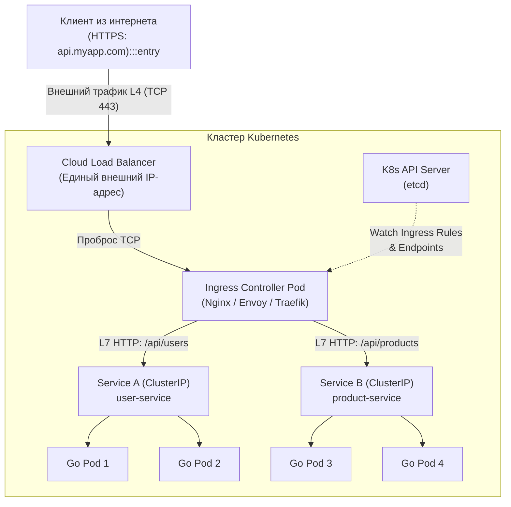
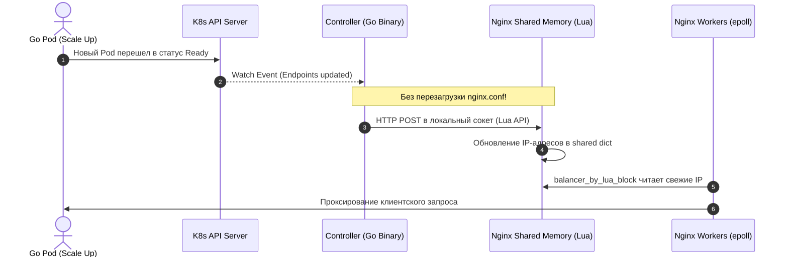
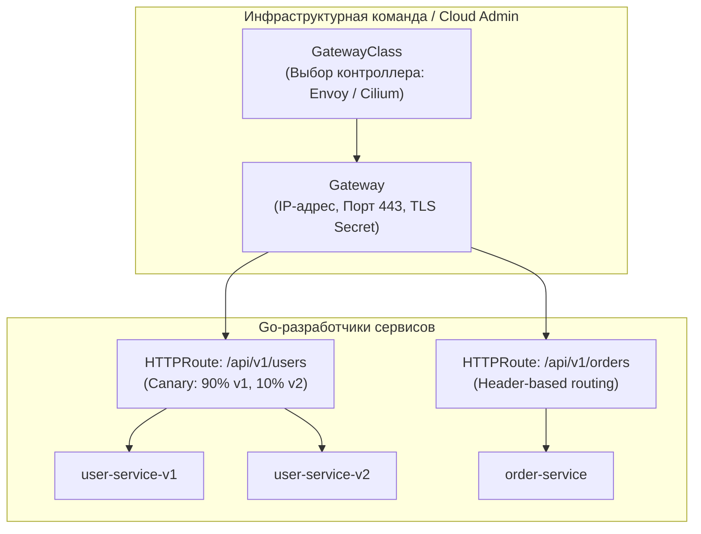

# 4. Ingress: Шлюз в мир и L7-маршрутизация

В предыдущих главах (в частности, в [[2. Pod, Deployment, Service]]) мы детально исследовали, как абстракция `Service` (в режиме `ClusterIP`) организует надежное внутреннее сетевое взаимодействие и балансировку нагрузки между подами. Однако внешний мир пока отрезан от нашего кластера. Как впустить миллионы пользователей из открытого интернета в работающие Go-микросервисы?

Первая наивная мысль — назначить каждому сервису тип `LoadBalancer`. Но в публичных облаках (AWS, GCP, Azure, Yandex Cloud) эта директива заставляет облачного провайдера выделить реальный аппаратный или виртуальный балансировщик (AWS NLB/ALB, Yandex Network Load Balancer). Если в вашей архитектуре 30 или 50 микросервисов, вы получите 50 отдельных балансировщиков, 50 публичных белых IP-адресов и астрономический счет в конце месяца. Кроме того, классические L4-балансировщики ничего не знают об HTTP-заголовках, куках и путях: они не способны отправить запрос по пути `/api/v1` или `/api/users` в Go-сервис, а `/admin` — в административный сервис.

В реальном мире для бизнес-центра не строят отдельную уличную дверь и турникет к каждому офисному кабинету. Вместо этого возводят просторный центральный вестибюль с консьерж-службой, турникетами и указателями: «На 3-й этаж — бухгалтерия, на 5-й — разработка». В Kubernetes роль такого умного парадного вестибюля выполняет **Ingress**.

---

## 1. Ingress: Декларативные правила против реального контроллера

Главный концептуальный барьер, о который спотыкаются многие инженеры: **Ingress сам по себе ничего не проксирует и не слушает порты**.

* **Ingress (Ресурс)** — это просто декларативная запись (Custom Spec) в базе данных `etcd`. Это архитектурный чертеж, закон, свод правил маршрутизации.
* **Ingress Controller (Исполнитель)** — это реально работающий в кластере софт (демон или Deployment), специализированный обратный прокси (Nginx, Envoy, Traefik, HAProxy, Istio Ingress Gateway), который читает эти чертежи и воплощает их в жизнь.

Если вы создадите манифест `kind: Ingress` в «голом» кластере без установленного Ingress Controller, Kubernetes покорно сохранит объект в `etcd`, но снаружи к кластеру никто не сможет подключиться: чертеж есть, а строителей нет.



Один-единственный внешний `LoadBalancer` принимает весь трафик и передает его пулу подов Ingress Controller. А уже контроллер разбирает HTTP-заголовки, TLS SNI, пути URL и отправляет запросы к целевым Go-приложениям.

---

## 2. Анатомия Nginx Ingress Controller: Что скрыто под капотом

Исторически и практически самым распространенным контроллером остается **Nginx Ingress Controller** (разрабатываемый сообществом Kubernetes). Давайте заглянем внутрь его пода.

Внутри пода Ingress Controller работают два ключевых компонента:
1. **Go-контроллер (Управляющий контур):** Бинарный процесс, написанный на Go. Он использует библиотеку `client-go` и механизм `Informer` с долгоживущим HTTP-соединением `Watch` к K8s API Server. Он непрерывно слушает создание, изменение и удаление объектов `Ingress`, `Service`, `Endpoints` и `Secret`.
2. **Прокси-сервер Nginx (Контур данных):** Классический мастер-процесс Nginx и пул воркеров на базе `epoll`.

Когда администратор применяет новый маршрут:
1. Вы выполняете `kubectl apply -f ingress.yaml`.
2. Go-процесс ловит событие через `Informer`.
3. Контроллер подставляет данные в Go-шаблон `text/template` и генерирует гигантский файл конфигурации `/etc/nginx/nginx.conf`.
4. Для применения новой конфигурации Go-процесс выполняет команду `nginx -s reload` (отправляет сигнал `SIGHUP` мастер-процессу Nginx).

> [!warning] Подводный камень: Дороговизна `nginx -s reload`
> Команда `nginx -s reload` — тяжелая операция для операционной системы. При перезагрузке мастер-процесс Nginx парсит конфигурацию, создает новые рабочие процессы (воркеры) и переводит старые в режим graceful shutdown (ожидание завершения текущих соединений).
> 
> Если в высоконагруженном кластере настроен агрессивный автоскейлинг подов или инженеры часто деплоят сервисы, `reload` может происходить каждые несколько секунд. Это приводит к:
> * Всплескам потребления CPU ядром Linux на контекстных переключениях.
> * Обрывам долгоживущих соединений (WebSockets, Server-Sent Events, gRPC-стримы), если старые воркеры принудительно завершаются по таймауту.
> * Накоплению сотен «умирающих» процессов Nginx в памяти.

---

## 3. Dynamic Configuration: Избавление от reload с помощью Lua

Чтобы решить проблему с частыми перезагрузками при обычном масштабировании подов (когда правила маршрутов не меняются, а лишь добавляются или удаляются IP-адреса бэкендов), сообщество внедрило в Nginx модуль **OpenResty Lua**.

В памяти Nginx выделяется разделяемый кольцевой сегмент (`lua_shared_dict`). Когда Go-контроллер видит изменение сетевых адресов (`Endpoints`) подов вашего Go-сервиса, он больше не переписывает `nginx.conf` и не дергает `nginx -s reload`!



Воркеры Nginx на стадии балансировки исполняют директиву `balancer_by_lua_block`. Они на лету считывают свежие IP-адреса подов напрямую из разделяемой памяти за наносекунды. Перезагрузка `nginx -s reload` требуется исключительно при изменении топологии: добавлении новых доменов, TLS-сертификатов, изменении путей или глобальных аннотаций.

---

## 4. Специфика Go: Ловушка двойного роутинга

Одна из самых коварных архитектурных ошибок при переезде Go-сервиса в Kubernetes — попытка дублировать маршрутизацию между L7-балансировщиком и кодом приложения.

Представьте манифест Ingress:
```yaml
# Ingress маршрутизирует /api/ на Go-сервис
apiVersion: networking.k8s.io/v1
kind: Ingress
metadata:
  name: shop-ingress
  annotations:
    # Опасная магия!
    nginx.ingress.kubernetes.io/rewrite-target: /
spec:
  rules:
  - host: api.myshop.com
    http:
      paths:
      - path: /api
        pathType: Prefix
        backend:
          service:
            name: go-api
            port:
              number: 8080
```

А внутри Go-сервиса (написанного с использованием популярного роутера Chi или Gin) разработчик наивно регистрирует обработчик:
```go
package main

import (
	"net/http"
	"github.com/go-chi/chi/v5"
)

func main() {
	r := chi.NewRouter()

	// Go-роутер ожидает полный URL-путь
	r.Get("/api/users", getUsers)
	r.Get("/api/products", getProducts)

	http.ListenAndServe(":8080", r)
}
```

Что произойдет?
1. Клиент посылает запрос: `GET /api/users`.
2. Ingress матчит префикс `/api`.
3. Директива `nginx.ingress.kubernetes.io/rewrite-target: /` безжалостно срезает префикс `/api` и отправляет в Go запрос `GET /users`.
4. Запрос прилетает в Go-приложение, роутер Chi ищет путь `/users`, но он ожидал `r.Get("/api/users", getUsers)`, не находит его и возвращает клиенту позорную ошибку `404 Not Found`.

Попытка «исправить» это, изменив роут в Go на `r.Get("/", ...)` приводит к тому, что сервис теряет контекст пути, путает вложенные эндпоинты, а локальное тестирование и запуск в Docker Compose превращаются в ад.

> [!tip] Архитектурное правило для собеседования: Принцип Single Responsibility в маршрутизации
> **Вопрос:** Как правильно организовать роутинг между Ingress и Go-приложением?
> **Ответ:** Следуйте принципу Single Responsibility. Nginx Ingress должен маршрутизировать трафик по доменам (`Host`) и базовым путям к разным *сервисам*. А внутренний роутинг (например, `/api/users` vs `/api/products`) должен полностью принадлежать Go-приложению. Не используйте `rewrite-target` без крайней необходимости. Ваш Go-сервис должен быть самодостаточным и независимым от инфраструктурных трансформаций URL.

---

## 5. Протоколы реального времени: WebSockets и gRPC

Стандартный HTTP/1.1 с парадигмой «запрос-ответ» работает через Ingress без дополнительных усилий. Однако в Go повсеместно используются двунаправленные протоколы: WebSockets (для real-time нотификаций и чатов) и gRPC (для высокоскоростного RPC-обмена).

### 5.1. Тонкости с WebSockets
WebSockets требуют от прокси-сервера процедуры апгрейда соединения (`Connection: Upgrade`, `Upgrade: websocket`). В Nginx Ingress это поддержано по умолчанию, но здесь вас подстерегает ловушка **таймаутов неактивности**.

По умолчанию Nginx обрывает любое проксируемое соединение, если в течение 60 секунд (`proxy_read_timeout`) по нему не передавались байты данных. Если ваши клиенты подключились к Go-серверу чата через WebSocket и просто читают сообщения (нет активного трафика), ровно через минуту Nginx принудительно разорвет TCP-соединение.

Решение: явная настройка таймаутов через аннотации Ingress:
```yaml
apiVersion: networking.k8s.io/v1
kind: Ingress
metadata:
  name: chat-ingress
  annotations:
    nginx.ingress.kubernetes.io/proxy-read-timeout: "3600"
    nginx.ingress.kubernetes.io/proxy-send-timeout: "3600"
spec:
  rules:
  - host: chat.myshop.com
    http:
      paths:
      - path: /ws
        pathType: Prefix
        backend:
          service:
            name: chat-service
            port:
              number: 8080
```
Параллельно в коде Go-клиента и сервера необходимо реализовать периодический обмен ping/pong фреймами (Heartbeat) каждые 15–30 секунд.

### 5.2. Специфика gRPC поверх HTTP/2
gRPC спроектирован поверх мультиплексированного транспорта HTTP/2. Если Nginx не предупредить заранее, он примет внешний запрос по HTTP/2, но к вашему Go-бэкенду обратится по устаревшему HTTP/1.1. В результате бинарный поток protobuf будет сломан, а клиент получит ошибку `transport: received the unexpected content-type "text/html"`.

Чтобы Nginx общался с Go-подом по HTTP/2, требуется обязательная аннотация:
```yaml
metadata:
  annotations:
    # Приказывает Nginx проксировать gRPC по протоколу HTTP/2
    nginx.ingress.kubernetes.io/backend-protocol: "GRPC"
```
При включении этой опции Nginx активирует модуль `grpc_pass`, сохраняя потоковую передачу данных и мультиплексирование каналов.

---

## 6. TLS Termination: SNI и Секреты

В подавляющем большинстве промышленных инсталляций именно Ingress берет на себя тяжелую математическую работу по шифрованию и расшифровке трафика (TLS Termination, подробно разобранный в [[4. TLS termination]]).

Сертификаты и приватные ключи хранятся в объектах K8s `Secret` (тип `kubernetes.io/tls`). Манифест Ingress декларативно связывает доменные имена и секреты:

```yaml
apiVersion: networking.k8s.io/v1
kind: Ingress
metadata:
  name: secure-ingress
spec:
  tls:
  - hosts:
    - api.myshop.com
    secretName: myshop-tls-secret
  - hosts:
    - admin.myshop.com
    secretName: admin-tls-secret
  rules:
  - host: api.myshop.com
    http:
      paths:
      - path: /
        pathType: Prefix
        backend:
          service:
            name: api-service
            port:
              number: 80
```

Как Nginx Ingress понимает, какой именно сертификат отдать браузеру, если на один и тот же публичный IP-адрес приходят клиенты и для `api.myshop.com`, и для `admin.myshop.com`?

На помощь приходит механизм **SNI (Server Name Indication)**. В самом начале рукопожатия TLS клиент отправляет имя целевого домена в открытом виде внутри пакета `ClientHello`. Контроллер Nginx считывает SNI до начала криптографических операций, находит в памяти сертификат из соответствующего K8s Secret и завершает рукопожатие с правильным ключом. Трафик между Ingress и внутренними Go-подами внутри кластерной сети передается уже в расшифрованном виде (чистый HTTP), избавляя процессорные ядра Go-сервисов от лишней нагрузки на шифрование.

---

## 7. Будущее: От ограничений Ingress к Kubernetes Gateway API

Несмотря на популярность, классический объект `Ingress` страдает от врожденных архитектурных дефектов, заложенных еще в ранние годы Kubernetes:
1. **Монолитность и смешение прав:** В одном YAML-файле смешиваются инфраструктурные настройки (порты, TLS-сертификаты, IP-адреса) и правила разработчиков (какой путь ведет на какой микросервис). В больших командах это приводит к конфликтам доступа.
2. **Засилье кастомных аннотаций:** Так как стандартная спецификация `Ingress` невероятно бедна (в ней нет даже нормального описания перенаправлений или канареечного деплоя), каждый контроллер оброс сотнями несогласованных аннотаций (`nginx.ingress.kubernetes.io/...`, `traefik.ingress.kubernetes.io/...`). Кочуя между облаками, инженер вынужден переписывать манифесты заново.
3. **Отсутствие поддержки не-HTTP протоколов:** Ingress не умеет нормально маршрутизировать чистый TCP, UDP или TLS passthrough.

Для преодоления этих проблем сообщество разработало официальный преемник — **Gateway API**.



Gateway API разделяет ответственность на независимые декларативные уровни:
* **GatewayClass:** Создается инфраструктурной командой (определяет тип балансировщика, например, Envoy Gateway или Cilium).
* **Gateway:** Описывает физическую точку входа (порты 80/443, привязка публичного IP, TLS-сертификаты).
* **HTTPRoute / GRPCRoute / TCPRoute:** Создаются разработчиками конкретных Go-сервисов. Здесь прямо из коробки поддерживаются взвешенная балансировка для канареечных релизов (Canary), маршрутизация по HTTP-заголовкам и cookie, фильтрация и модификация запросов без хаков с аннотациями.

---

## Резюме

1. **Ingress — это спецификация, а не процесс.** Для его работы необходим Ingress Controller (Nginx, Envoy, Traefik), работающий как обратный прокси.
2. **Механизм работы Nginx Ingress Controller:** Процесс на Go слушает события API Server через `client-go` и генерирует `nginx.conf`.
3. **Lua для нулевого даунтайма:** При изменении IP-адресов подов контроллер не делает `nginx -s reload`, а обновляет список бэкендов в разделяемой памяти Nginx через директиву `balancer_by_lua_block`.
4. **Разделение роутинга:** Ingress маршрутизирует трафик к сервисам. Go-роутер (`chi`, `gin`) разбирает внутренние пути приложения. Избегайте бездумного срезания путей через `rewrite-target`.
5. **Поддержка WebSocket и gRPC:** Для WebSockets необходимо увеличивать таймауты (`proxy-read-timeout`), а для gRPC — явно указывать аннотацию `backend-protocol: "GRPC"`.
6. **Эволюция в Gateway API:** Переход на модель `GatewayClass -> Gateway -> HTTPRoute` устраняет хаос аннотаций и позволяет разработчикам нативно управлять канареечными релизами и L7-правилами.

После того как внешний мир получил доступ к нашим сервисам, перед нами встает задача защиты от перегрузок и адаптации к скачкам трафика. В следующей лекции мы разберем горизонтальное и вертикальное масштабирование: [[5. Scaling и autoscaling]].