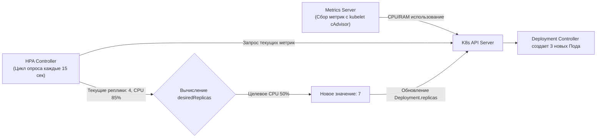
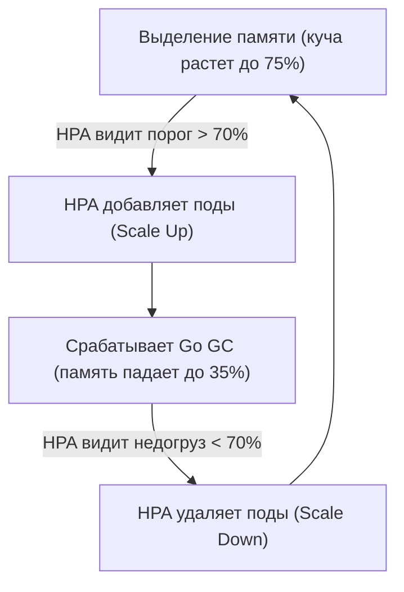
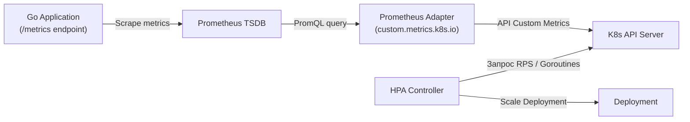
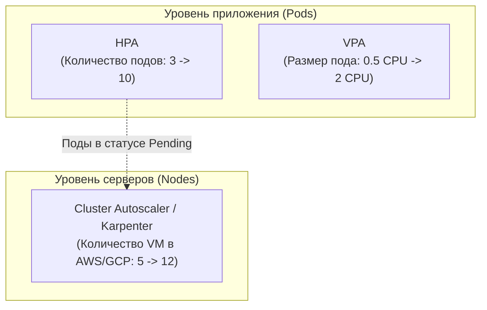

# 5. Масштабирование в Kubernetes: HPA, VPA, Cluster Autoscaler и Mechanical Sympathy в Go

В распределенных системах статическая нагрузка существует только в синтетических тестах. В реальном мире трафик подчиняется законам природы и социума: ночью сервисы погружаются в полудрему, а в «Черную пятницу» или во время утреннего всплеска поток заказов вырастает в сотни раз за считанные секунды. 

Держать серверный парк постоянно развернутым под пиковую нагрузку — финансовое самоубийство для бизнеса. Масштабировать сервисы вручную командой `kubectl scale --replicas=10` — медленно и ненадежно: дежурный инженер никогда не среагирует быстрее микросекундного всплеска трафика.

Kubernetes предлагает развитую трехуровневую систему автоматического масштабирования:
1. **Горизонтальное масштабирование подов (HPA — Horizontal Pod Autoscaler):** изменение количества реплик сервиса.
2. **Вертикальное масштабирование подов (VPA — Vertical Pod Autoscaler):** динамическое изменение вычислительных ресурсов (CPU/RAM) одного пода.
3. **Масштабирование физических узлов (Cluster Autoscaler / Karpenter):** заказ и выключение реальных серверов у облачного провайдера.

Однако без понимания рантайма Go автоматика способна не спасти сервис, а окончательно добить его. Давайте разберем математику, физику и скрытые ловушки масштабирования с точки зрения механического сочувствия к машине.

---

## 1. Horizontal Pod Autoscaler (HPA): Механика и математика

Контроллер **HPA** встроен в `kube-controller-manager`. Он функционирует как непрерывный управляющий контур с отрицательной обратной связью (период опроса по умолчанию — каждые 15 секунд):



### Математическая формула HPA

Алгоритм вычисления целевого числа реплик в исходном коде Kubernetes поразительно прост и элегантен:

$$\text{desiredReplicas} = \left\lceil \text{currentReplicas} \times \left( \frac{\text{currentMetricValue}}{\text{desiredMetricValue}} \right) \right\rceil$$

В кодовой базе K8s эта формула записывается как:
`desiredReplicas = ceil[ currentReplicas * ( currentMetricValue / desiredMetricValue ) ]`

**Наглядный расчет:**
Предположим, у нас развернуты 4 реплики Go-сервиса (`currentReplicas = 4`). Мы задали целевой уровень утилизации процессора в 50% (`desiredMetricValue = 50%`). Внезапно пошел наплыв пользователей, и текущее потребление достигло 85% (`currentMetricValue = 85%`).
Контроллер вычисляет:
`desiredReplicas = ceil[ 4 * (85 / 50) ] = ceil[ 6.8 ] = 7`.
Контроллер немедленно отправляет патч в спецификацию деплоймента, увеличивая число реплик с 4 до 7.

---

## 2. Ловушка CFS Throttling: Почему «душат» Go-процессы

Многие инженеры интуитивно настраивают HPA на метрику CPU и выставляют жесткие лимиты в манифесте:
```yaml
resources:
  requests:
    cpu: "200m"
    memory: "256Mi"
  limits:
    cpu: "500m"
    memory: "512Mi"
```

Здесь кроется фундаментальная архитектурная ловушка ядра Linux и Kubernetes.

Kubernetes реализует `limits.cpu` через механизм **CFS (Completely Fair Scheduler)** и подсистему `cpu.cfs_quota_us` в cgroups.
Лимит `limits: cpu: "500m"` означает, что процессу положено 0.5 процессорного ядра. Но ядро Linux не замедляет тактовую частоту процессора. Оно делит время на фиксированные окна (по умолчанию `cfs_period_us = 100ms`). 
Квота в 500m означает: за каждые 100 мс процессам пода разрешено суммарно работать на ядрах CPU не более 50 мс.

```mermaid
gantt
    title CFS Quota Throttling (Период 100 мс)
    dateFormat X
    axisFormat %s
    section Выполнение Go
    Работа горутин (4 потока M) :active, 0, 50
    CFS THROTTLING (Ядро замораживает процесс!) :crit, 50, 100
    Возобновление работы в новом окне :active, 100, 150
```



> [!warning] Подводный камень: CFS Throttling (Удушение процессора)
> Рантайм Go — высокопараллельный. Если у вас 4 потока ОС (`GOMAXPROCS=4`), и они одновременно начали обрабатывать пачку входящих JSON-запросов, они выжгут суммарную квоту в 50 мс всего за 12.5 мс физического времени!
> 
> На оставшиеся 87.5 мс текущего периода ядро Linux **принудительно усыпляет (freeze / throttle)** все потоки Go-приложения. Для клиента задержка (latency) мгновенно подскакивает до небес, соединение отваливается по таймауту. 
> 
> Самое ужасное: метрика, которую видит стандартный HPA, — это *процент утилизации от `requests`*, а не факт троттлинга! HPA «думает», что нагрузка умеренная, и поды не добавляет, пока сервис захлебывается в искусственном сне.
> 
> **Инженерный консенсус для Go:** В современных высоконагруженных Go-сервисах часто полностью **убирают CPU limits**, выставляя только адекватные `requests`, чтобы избежать искусственного CFS throttling и деградации p99 latency.

---

## 3. Mechanical Sympathy: Почему CPU и RAM обманывают HPA в Go

Стандартные шаблоны мониторинга предлагают масштабировать сервисы по CPU и RAM. Для стеков с синхронным вводом-выводом (Python WSGI, Ruby) это имеет смысл. Но для архитектуры Go это прямой путь к сбоям.

### 1. Проблема с CPU
Модель многозадачности Go основана на неблокирующем сетевом полинге (`netpoller`). Десятки тысяч горутин могут обслуживать клиентов, проводя 95% времени в ожидании ответа от базы данных или сокета. В этот момент загрузка CPU стремится к нулю. Сервис может находиться на грани исчерпания системных файловых дескрипторов или соединений к БД, а HPA не пошевелится. 

И наоборот: фоновый проход Garbage Collector или парсинг тяжелого XML кратковременно нагрузит ядра на 100% в течение 200 мс, провоцируя HPA на паническое и ненужное выделение новых подов.

### 2. Проблема с Memory (RAM)
Управление памятью в Go — дискретное. Рантайм не возвращает освобожденную память операционной системе мгновенно. 
По умолчанию сборщик мусора ориентируется на переменную `GOGC=100`: следующий цикл GC инициируется, когда размер рабочей кучи (heap) удваивается по сравнению с размером живых данных после предыдущей сборки.

В результате потребление памяти Go-сервисом выглядит как классическая **пила**:
1. Сервис работает, куча растет. Память доходит до 75% от лимита контейнера.
2. HPA, настроенный на порог в 70% RAM, видит превышение и немедленно отдает команду: «Скейлимся вверх, запускаем еще 5 реплик!».
3. В следующую секунду рантайм Go запускает GC: память очищается и падает до 35%.
4. HPA видит, что кластер недогружен, выжидает cooldown-интервал и начинает удалять поды (scale down).
5. Цикл повторяется по кругу.



Это деструктивное поведение называется **Flapping (Хлопанье)** — кластер непрерывно вводит и выводит реплики из эксплуатации, нагружая планировщик K8s и попутно сбрасывая кэши приложений.

> [!info] Архитектурная деталь: Стабилизация памяти через GOMEMLIMIT
> Начиная с версии Go 1.19, рантайм получил спасительную переменную окружения `GOMEMLIMIT`. Она задает мягкий лимит памяти для Go GC.
> 
> Установив `GOMEMLIMIT` на уровне 80–90% от Kubernetes `limits` памяти контейнера, вы приказываете GC запускаться чаще по мере приближения к опасной границе. Это сглаживает зубцы «пилы», защищает от внезапного OOM Kill (Out of Memory) и предотвращает ложные срабатывания HPA.

---

## 4. Кастомные метрики: Истинный Scaling для Go-бэкенда

Если аппаратные ресурсы — плохой индикатор здоровья Go-приложения, на что же должен опираться настоящий SRE-инженер? Ответ прост: на **бизнес-метрики и задержки (Latency/Queue Depth)**.

Для проброса прикладных метрик в управляющий контур K8s используется **Prometheus Adapter** (или KEDA — Kubernetes Event-driven Autoscaling). Адаптер опрашивает TSDB Prometheus по PromQL-запросам и регистрирует виртуальное API `custom.metrics.k8s.io`, доступное для HPA.



### Золотые метрики для автомасштабирования Go:
1. **RPS (Requests Per Second):** Количество запросов в секунду на один под. Зная из нагрузочного тестирования, что один pod гарантированно держит 1 000 RPS с идеальным SLA, мы выставляем целевое среднее значение в 800–1000 RPS.
2. **Goroutine Count (`runtime.NumGoroutine()`):** Количество параллельно исполняемых легковесных потоков. Если число горутин аномально растет (например, превысило 5 000 на инстанс), это прямой сигнал зависания на внешних вызовах или приближения к лимитам планировщика.
3. **Latency (p95 / p99):** Задержка обработки запросов. Если 99-й перцентиль времени отклика переваливает за 200 мс — кластер обязан расширяться до того, как клиенты начнут получать ошибки.

Манифест HPA на базе кастомной метрики `http_requests_per_second`:
```yaml
apiVersion: autoscaling/v2
kind: HorizontalPodAutoscaler
metadata:
  name: go-api-hpa
spec:
  scaleTargetRef:
    apiVersion: apps/v1
    kind: Deployment
    name: go-api
  minReplicas: 3
  maxReplicas: 50
  metrics:
  - type: Pods
    pods:
      metric:
        name: http_requests_per_second
      target:
        type: AverageValue
        averageValue: "1000" # Скейлимся, если на 1 под приходится более 1000 RPS
```

---

## 5. Cold Start и Readiness Пробы: Спасение старых подов от каскадного сбоя

Когда HPA принимает решение о масштабировании, новые поды не материализуются со скоростью света. Им требуется время:
1. Выгрузка Docker-образа с реестра на новую ноду (если образ не закэширован).
2. Выделение сетевого пространства (`ContainerCreating`).
3. Инициализация Go-рантайма, выделение пулов соединений к PostgreSQL/Redis (`sql.Open`, `pgxpool.New`).
4. Прогрев локальных кэшей данных.

Пока новый под находится в статусе `NotReady`, входящий шквал трафика продолжают принимать старые, уже задыхающиеся поды. Они начинают падать по тайм-аутам, провоцируя лавинообразный отказ (Cascading Failure).

> [!tip] Архитектурный паттерн для собеседования: Защита при холодном старте
> **Вопрос:** Как защитить кластер от каскадного сбоя во время резкого скейлинга (Cold Start), когда трафик убивает старые поды, пока новые еще не готовы?
> **Ответ:** Защита строится на комплексном эшелонировании:
> 1. **Корректные зонды (Probes):** Настройка `initialDelaySeconds` и использование `startupProbe` для тяжелых сервисов, чтобы Kubernetes не убивал медленно стартующий Go-бинарник раньше времени.
> 2. **Бюджет доступности (PodDisruptionBudget — PDB):** Защищает от деградации при одновременном обновлении и выселении подов.
> 3. **Превентивное отбрасывание нагрузки (Load Shedding / Rate Limiting):** На уровне Ingress/Envoy или с помощью middleware в Go настраивается лимитер запросов (Token Bucket). При запредельном всплеске сервис мгновенно возвращает код `429 Too Many Requests` (или перенаправляет в очередь отложенной обработки), не доводя инфраструктуру до падения.
> 4. **Предохранитель (Circuit Breaker):** Размыкание цепи при сбоях бэкендов спасает от напрасного расхода ресурсов на обреченные запросы.

---

## 6. VPA (Vertical Pod Autoscaler) и Cluster Autoscaler (CA)

Помимо HPA, инфраструктурный арсенал Kubernetes включает еще два типа автомасштабирования:



### 6.1. VPA (Vertical Pod Autoscaler)
VPA не трогает количество подов — он анализирует профиль потребления ресурсов и подбирает оптимальные значения `requests` и `limits`.
* **Режим `Off` (Рекомендательный):** Идеален для Go. VPA только выдает рекомендации дашбордам, позволяя инженерам точно калибровать манифесты без неожиданностей в проде.
* **Режим `Auto`:** Крайне опасен для stateless веб-сервисов! Чтобы изменить лимиты CPU/памяти контейнера, Kubernetes обязан **перезапустить Pod**. Это неизбежно вызывает микро-даунтаймы и разрыв сетевых сессий.
* **Конфликт HPA и VPA:** Никогда не используйте HPA и VPA на базе одной и той же метрики (например, CPU)! Возникнет паразитный резонанс: VPA увеличит лимит -> процент утилизации упадет -> HPA удалит «лишние» поды -> оставшиеся поды перегрузятся -> VPA снова поднимет лимит.

### 6.2. Cluster Autoscaler (CA)
Когда HPA создает новые поды, на существующих рабочих нодах может физически закончиться процессорная мощность или память. Планировщик `kube-scheduler` переводит поды в статус `Pending`.

Здесь подключается **Cluster Autoscaler** (или современный бессерверный планировщик узлов Karpenter):
1. Контроллер видит `Pending` поды, которым не хватает ресурсов.
2. Он обращается к API облачного провайдера (AWS ASG — Auto Scaling Groups, GCP MIG — Managed Instance Groups, Yandex Cloud Compute Groups) и запускает новые виртуальные машины.
3. Когда пик спадает, и поды удаляются, Cluster Autoscaler находит недозагруженные ноды, аккуратно выселяет оставшиеся поды (процедура **Drain**) и удаляет пустые серверы, снижая расходы на облако до нуля.

---

## Резюме

1. **Математика HPA:** Вычисляет реплики по формуле `desiredReplicas = ceil[ currentReplicas * ( currentMetricValue / desiredMetricValue ) ]`.
2. **CFS Throttling:** Жесткие `limits: cpu` в Linux приводят к усыплению параллельных горутин Go на десятки миллисекунд. В Go-сервисах отдавайте предпочтение честным `requests`.
3. **Память и Flapping:** Из-за циклов `GOGC=100` масштабирование по RAM приводит к паразитному хлопанью подами. Для контроля используйте `GOMEMLIMIT` на уровне 80–90% от лимита.
4. **Кастомные метрики (Prometheus Adapter):** Настоящее масштабирование бэкенда строится на RPS (`http_requests_per_second`), времени отклика (Latency p99) и числе горутин (`runtime.NumGoroutine()`).
5. **Cold Start:** Для защиты подов во время старта используйте `startupProbe`, PDB и техники Rate Limiting / Load Shedding (`429 Too Many Requests`).
6. **VPA и CA:** VPA в Go безопасен преимущественно в режиме `Off`, а Cluster Autoscaler решает проблему нехватки нод для `Pending` подов.

Горизонтальное масштабирование без состояния (Stateless) просто и прозрачно: поды можно уничтожать и плодить сотнями. Но что делать, если нашему сервису требуется хранить петабайты данных на диске, сохранять постоянные сетевые имена и соблюдать строгий кворум? В следующей лекции мы погрузимся в мир постоянства данных: [[6. Stateful приложения]].