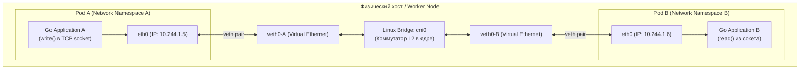
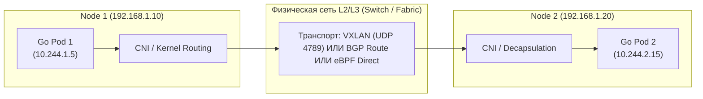
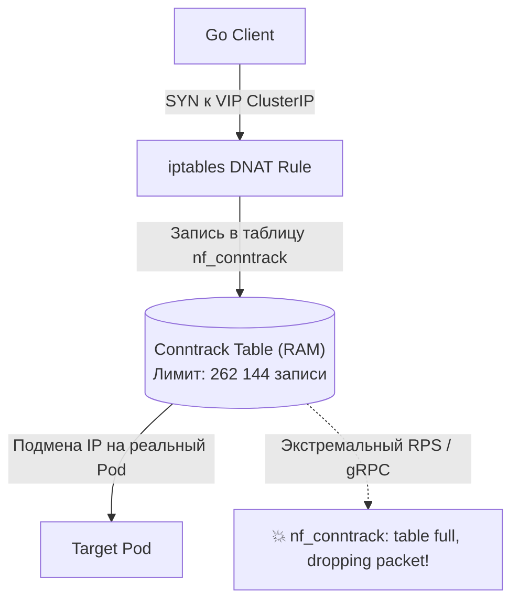

# 7. Сетевой стек Kubernetes: CNI, путь пакета, eBPF и сетевые ловушки в Go

В главах, посвященных Linux и Docker, мы детально препарировали изоляцию сетевых пространств имен (`network namespaces`) и виртуальные пары интерфейсов (`veth`). На одном сервере все это выглядит стройно и прозрачно. Но когда мы объединяем в единый вычислительный пул сотни физических серверов и тысячи контейнеров, сетевая инженерия превращается в сложнейшую распределенную паутину.

Сеть в Kubernetes — это не просто возможность отправить TCP-байт из одного угла дата-центра в другой. Это динамический фундамент для Service Discovery, балансировки трафика без единой точки отказа, нулевого доверия (Zero Trust) и криптографической изоляции. 

Для инженера, пишущего на Go, понимание пути сетевого пакета от сокета в горутине до сетевой карты хоста — это разница между паническим поиском причин «загадочных задержек в 5 секунд» и мгновенным точечным исправлением одной строчки в конфигурации.

---

## 1. Три священных правила сети Kubernetes

Архитекторы Kubernetes (опираясь на опыт внутренней системы Google Borg) сознательно отказались от динамического NAT (Port Mapping в Docker), сделав ставку на модель «плоской сети». 

Сетевая модель K8s покоится на трех фундаментальных аксиомах:
1. **IP-per-Pod (У каждого пода — уникальный адрес):** Каждый под в кластере получает свой собственный маршрутизируемый IP-адрес из диапазона Pod CIDR. Контейнеры внутри одного пода делят единый сетевой стек и единый IP-адрес (через служебный инфраструктурный `pause` контейнер).
2. **Свободная связь внутри ноды (No NAT on host):** Любой под на рабочем узле может отправить пакет любому другому поду на том же узле напрямую, без трансляции сетевых адресов (NAT).
3. **Свободная связь между нодами (No NAT across cluster):** Любой под на ноде A может общаться с любым подом на ноде B напрямую по его Pod IP без NAT. Адрес отправителя, который видит принимающий под, должен в точности совпадать с реальным IP пода-источника.

---

## 2. Путь пакета: Pod-to-Pod на одной ноде

Как байты, отправленные вашей функцией `http.Post` в Go, физически добираются до соседнего пода на том же сервере?



1. Go-приложение вызывает системный вызов `write()` в дескриптор TCP-сокета.
2. Сетевой стек ядра внутри изолированного сетевого пространства имен пода (`Network Namespace`) формирует IP-пакет.
3. Пакет выходит через интерфейс `eth0`. Но `eth0` — это всего лишь один конец виртуального кабеля (`veth pair`).
4. Второй конец кабеля — `veth0-A` — находится в корневом пространстве имен хоста и подключен к виртуальному программному коммутатору ядра — мосту `cni0` (Bridge).
5. Мост `cni0` анализирует Ethernet-фрейм, заглядывает в свою CAM-таблицу MAC-адресов и перенаправляет фрейм в интерфейс `veth0-B`.
6. Пакет мгновенно поднимается через спаренный `eth0` прямо в сетевой стек Pod B, где проснувшаяся горутина считывает байты вызовом `read()`.

Весь процесс происходит внутри памяти ядра Linux через структуры `sk_buff` без копирования данных через физическую сеть.

---

## 3. Межузловой трафик и архитектура CNI-плагинов

Что происходит, если Pod A на ноде 1 отправляет запрос поду Pod C на ноде 2? Мост `cni0` видит, что MAC-адрес получателя отсутствует в локальной таблице, и выталкивает пакет в таблицу маршрутизации хоста (`default route`).

Здесь ядро встает перед вопросом: *«Как доставить пакет с частным адресом 10.244.2.15 через физическую сеть дата-центра, которая ничего не знает про внутренние IP подов?»*

Ответ на этот вопрос дает **CNI (Container Network Interface)** — стандарт сетевых плагинов, конфигурирующих маршрутизацию в Kubernetes.



### 3.1. Overlay-сети (VXLAN) — Flannel
Классический подход «сети поверх сети». Пакет пода целиком заворачивается в стандартный UDP-пакет (инкапсуляция по протоколу VXLAN) и летит по физической сети хостов на порт 4789.
* **Плюсы:** Работает везде — в любом облаке, в гетерогенных сетях, не требует настройки физических коммутаторов.
* **Минусы:** Заметный оверхед CPU на упаковку/распаковку пакетов ядром. Дополнительные 50 байт оверхеда на заголовки, что снижает эффективный размер MTU (с 1500 до 1450 байт) и может вызывать фрагментацию пакетов в высокоскоростных Go-сервисах.

### 3.2. Нативная маршрутизация (BGP) — Calico
Calico превращает каждый физический сервер кластера в полноценный BGP-маршрутизатор (Border Gateway Protocol). Демон Calico анонсирует подсети подов на физические коммутаторы стойки (Top-of-Rack Switches).
* **Плюсы:** Пакеты летят с физической скоростью проводов (Native Routing) без малейшей инкапсуляции и без потерь MTU. Минимальная утилизация CPU хоста.
* **Минусы:** Требует тесной интеграции с сетевыми администраторами ЦОД и поддержки BGP в физической сети.

### 3.3. Новая эра: eBPF — Cilium
Современный золотой стандарт высоконагруженной инфраструктуры. Cilium полностью переосмысливает сетевую парадигму Linux, отказываясь от устаревших подсистем `iptables` и медленных цепочек ядра.

> [!info] Под капотом: Революция eBPF и обход сетевого стека
> В классическом сетевом стеке Linux каждый входящий и исходящий пакет вынужден проходить сквозь дебри Netfilter (сотни правил `iptables`), механизм Connection Tracking (`conntrack`), вычисление маршрутов и фильтрацию сокетов. Это тысячи строк процессорных инструкций на каждый сетевой фрейм!
> 
> Cilium компилирует специализированные C-программы в байткод **eBPF**, который загружается напрямую в ядро Linux на сетевые хуки `XDP` (eXpress Data Path) или `tc` (Traffic Control). Пакет перехватывается прямо на сетевой карте в момент прихода прерывания и пересылается в сокет целевого пода за субмикросекунды. Для Go-сервисов с миллионами RPS задержки p99 сокращаются на 30–50%!

---

## 4. Сервисы и Kube-proxy: Ловушка Conntrack

Как мы знаем из [[2. Pod, Deployment, Service]], виртуальные адреса `ClusterIP` сервисов в реальности не существуют на сетевых интерфейсах. Трафик к ним перехватывается демоном `kube-proxy`.

Исторически `kube-proxy` работает в режиме **iptables**. Для каждого Service и каждого Pod Endpoint создаются правила трансляции сетевых адресов (DNAT). А чтобы ядро Linux знало, какому клиенту вернуть ответный пакет, оно использует системную таблицу состояний соединений — **Conntrack** (`nf_conntrack`).



> [!warning] Ловушка / Gotcha: Переполнение Conntrack в Highload
> Таблица `nf_conntrack` имеет фиксированный размер в оперативной памяти хоста (задается через `sysctl net.netfilter.nf_conntrack_max`). 
> 
> Когда Go-микросервисы открывают тысячи короткоживущих TCP-соединений или гоняют гигантский поток gRPC-запросов, таблица conntrack молниеносно переполняется. В системном логе ядра `dmesg` появляются роковые строки:
> `nf_conntrack: table full, dropping packet.`
> 
> В этот момент ядро начинает молча выбрасывать пакеты в черную дыру. Ваши Go-сервисы получают случайные таймауты подключения (`i/o timeout`) или ошибки `connection refused`.
> 
> **Лечение в Production:** 
> 1. Перевод `kube-proxy` в режим **IPVS** (использует быстрые хэш-таблицы с масштабируемостью $O(1)$ вместо линейного перебора $O(N)$ в iptables).
> 2. Полный отказ от kube-proxy в пользу **Cilium eBPF Host-Routing**, который маршрутизирует трафик сервисов в обход iptables и conntrack.

---

## 5. Специфика Go в Kubernetes: DNS и HTTP/2 Connection Pooling

Две самые распространенные сетевые проблемы Go-бэкендов в K8s скрываются внутри стандартной библиотеки Go.

### 5.1. Проклятие `ndots:5` в DNS-резолвере Go
Взгляните на файл `/etc/resolv.conf`, который Kubernetes автоматически генерирует для каждого пода:
```conf
nameserver 10.96.0.10
search default.svc.cluster.local svc.cluster.local cluster.local
options ndots:5
```

Что означает `options ndots:5`? Если доменное имя содержит меньше 5 точек, резолвер обязан сначала последовательно подставить все поисковые суффиксы из строки `search`.

По умолчанию в Go при сборке без Cgo (`CGO_ENABLED=0`) используется чистый Go DNS-резолвер. Когда ваш код обращается к сервису `billing`:
```go
resp, err := http.Get("http://billing/api/status")
```
В имени `billing` — ноль точек (меньше 5). Go-резолвер начинает мучительный перебор через CoreDNS:
1. `billing.default.svc.cluster.local.` -> NXDOMAIN (если сервис в другом namespace).
2. `billing.svc.cluster.local.` -> NXDOMAIN.
3. `billing.cluster.local.` -> NXDOMAIN.
4. И лишь в самом конце — `billing.` -> 200 OK.

Каждый исходящий HTTP-запрос порождает до 4–8 лишних UDP-пакетов к CoreDNS, добавляя **сотни миллисекунд** к первой задержке и создавая шторм запросов на CoreDNS.

**Решения проблемы:**
* Обращаться по полному FQDN-имени с завершающей точкой: `billing.prod.svc.cluster.local.`.
* Добавлять точку к одиночному имени: `billing.`.
* Переопределить `ndots` в манифесте пода через секцию `dnsConfig`:
```yaml
spec:
  dnsConfig:
    options:
      - name: ndots
        value: "1" # Резолвить сразу внешние имена, если есть хотя бы 1 точка
```

### 5.2. HTTP/2 и вечные мертвые соединения в пуле
Клиент `net/http` в Go невероятно эффективен: он кэширует открытые TCP-сокеты в пуле соединений (`Keep-Alive`). Для протокола HTTP/2 все запросы к сервису мультиплексируются в **одно-единственное долгоживущее TCP-соединение**.

Но представьте, что целевой Deployment сервиса обновился: старый под был удален, и на его месте запустился новый под с совершенно новым IP-адресом. 

Go-клиент ничего об этом не знает! Он продолжает держать открытый сокет к старому IP. Все запросы сотен горутин летят в умерший сокет и зависают, пока операционная система через десятки секунд не выдаст таймаут или ядро не пришлет `TCP RST`.

> [!tip] Рецепт надежности в Go
> Для микросервисного общения в Kubernetes всегда явно калибруйте сетевой транспорт:
> ```go
> transport := &http.Transport{
>     IdleConnTimeout:       30 * time.Second, // Закрывать соединения при простое
>     ResponseHeaderTimeout: 5 * time.Second,
>     ForceAttemptHTTP2:     true,
> }
> ```
> Регулярно закрывайте простаивающие соединения через методы `Transport.CloseIdleConnections()` или задавайте параметр `Transport.IdleConnTimeout`. А для gRPC-клиентов настраивайте клиентский keepalive с периодической отправкой PING-фреймов (`grpc.WithKeepaliveParams`), чтобы своевременно детектировать исчезнувшие поды.

---

## 6. Network Policies: Безопасность в плоской сети

По умолчанию плоская сеть Kubernetes полностью открыта: любой под из тестового контура может отправить запрос в продакшен-базу PostgreSQL, если знает ее IP. При компрометации любого внешнего пода злоумышленник получает полную свободу горизонтального перемещения по кластеру (Lateral Movement).

Для изоляции сервисов на уровне сети применяется объект **NetworkPolicy**. Вы можете декларативно заявить: «Подам с лейблом `app=api` разрешено ходить на порт 5432 только к подам с лейблом `app=postgres`».

```yaml
apiVersion: networking.k8s.io/v1
kind: NetworkPolicy
metadata:
  name: allow-api-to-postgres
  namespace: prod
spec:
  podSelector:
    matchLabels:
      app: postgres
  ingress:
  - from:
    - podSelector:
        matchLabels:
          app: api # Разрешаем доступ только подам с лейблом app=api
    ports:
    - protocol: TCP
      port: 5432
```

Критически важный нюанс: **NetworkPolicy — это чистая спецификация**. Сам Kubernetes API Server не фильтрует пакеты. Исполнение правил NetworkPolicy целиком возложено на ваш **CNI-плагин**. 
* Если в кластере установлен базовый Flannel, создание NetworkPolicy будет молча проигнорировано — сеть останется открытой!
* Calico и Cilium компилируют эти правила в правила файрвола (iptables, ipset или eBPF-карты), гарантируя изоляцию на уровнях L3/L4 (а Cilium — вплоть до L7 HTTP-методов и путей).

---

## Резюме

1. **Три правила сети K8s:** IP-per-Pod (через `pause` контейнер), отсутствие NAT внутри ноды и между нодами кластера.
2. **Локальный трафик:** Пакеты бегают между подами через виртуальные пары `veth` и сетевой мост `cni0` в памяти ядра Linux.
3. **Эволюция CNI:** Overlay (Flannel VXLAN) прост, но имеет оверхед по CPU и MTU. BGP (Calico) обеспечивает нативную скорость. eBPF (Cilium) — вершина производительности, обходящая классический Netfilter ядра.
4. **Опасность Conntrack:** Нагруженный трафик через `kube-proxy` в режиме iptables переполняет таблицы отслеживания соединений. Решение — переход на IPVS или Cilium eBPF.
5. **DNS и ndots:5 в Go:** Чистый резолвер Go перегружает CoreDNS лишними запросами из-за суффиксов поиска. Используйте FQDN, точку в конце или `ndots:1` в `dnsConfig`.
6. **NetworkPolicy:** Необходимы для изоляции периметров, но требуют CNI с поддержкой сетевой безопасности (Calico, Cilium).

Мы завершили фундаментальное исследование базовых кирпичиков инфраструктуры: Linux, Nginx, Docker и Kubernetes. Впереди нас ждет финальный практический рубеж — объединение всего этого стека в единый процесс автоматизированной доставки кода: [[1. CI_CD и деплой]].