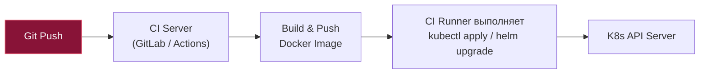
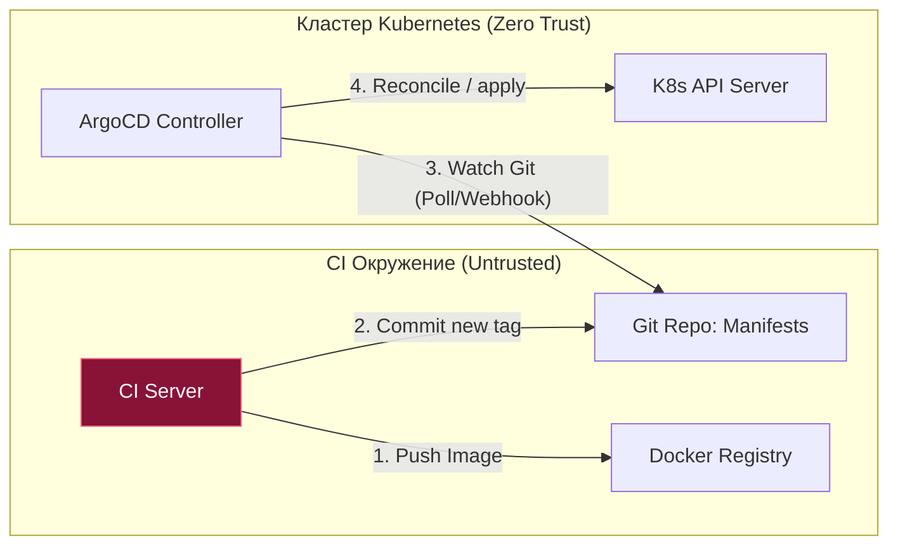

# 1. CI/CD и деплой: Инженерия непрерывной доставки Go-приложений

Разделы, посвященные Linux, Nginx, Docker и Kubernetes, заложили прочный инженерный фундамент. Но вся эта сложнейшая инфраструктура остается мертвым грузом без регулярного, надежного и безопасного процесса доставки свежего Go-кода на рабочие серверы. Пропасть между коммитом инженера в Git-репозиторий и стабильно работающим бинарником в продакшене — это именно то место, где рождается большинство фатальных инцидентов и даунтаймов.

CI/CD (Continuous Integration / Continuous Delivery) — это не просто набор разрозненных bash-скриптов для GitLab CI или GitHub Actions. Это строгая инженерная дисциплина, обеспечивающая воспроизводимость сборки, криптографическую целостность артефактов, многоуровневый контроль качества и автоматизированную выкатку без участия человека. 

Для распределенного бэкенда на Go пайплайн непрерывной интеграции и доставки обладает уникальными свойствами, напрямую проистекающими из архитектуры компилятора и рантайма языка.

---

## 1. Преимущество Go: Архитектура компилятора и скорость сборки

Если вы пришли в Go из мира C++ или Java, вы привыкли к тому, что компиляция сложного проекта — это законный повод пойти выпить кофе или отправиться на обед. Шаблоны C++ и заголовки `#include` порождают чудовищные объемы промежуточных данных, а тяжеловесные этапы оптимизации байт-кода JVM заставляют CI-раннеры пыхтеть десятками минут.

В Go компилятор работает молниеносно. Это осознанное архитектурное решение Кена Томпсона и Роба Пайка:
1. **Строгая грамматика и отсутствие циклических зависимостей:** Компилятор читает исходные файлы, мгновенно строит AST (Abstract Syntax Tree), проверяет типы и сразу генерирует машинно-ориентированное промежуточное представление (SSA — Static Single Assignment).
2. **Прямая генерация машинного кода:** Go минует промежуточные ассемблерные стадии и виртуальные машины.
3. **Эффективный кэш пакетов:** Пакеты компилируются параллельно по графу зависимостей.

Такая скорость сборки фундаментально меняет инженерную культуру команды: разработчики коммитят чаще, пайплайны отрабатывают за 2–3 минуты, а обратная связь (feedback loop) становится мгновенной.

---

## 2. Этапы CI: Проверка качества и статический анализ

Любой промышленный пайплайн Go начинается с фазы Continuous Integration — проверки качества исходного кода до этапа сборки бинарника.

```mermaid
flowchart LR
    classDef process  fill:#1e293b,stroke:#38bdf8,stroke-width:1px,color:#f8fafc
    classDef success  fill:#064e3b,stroke:#34d399,stroke-width:1px,color:#f8fafc
    classDef error    fill:#7f1d1d,stroke:#f87171,stroke-width:1px,color:#f8fafc
    classDef warning  fill:#78350f,stroke:#fbbf24,stroke-width:1px,color:#f8fafc
    classDef entry    fill:#1e3a5f,stroke:#38bdf8,stroke-width:2px,color:#f8fafc
    classDef aux      fill:#334155,stroke:#64748b,stroke-width:1px,color:#f8fafc
    classDef system   fill:#312e81,stroke:#a78bfa,stroke-width:1px,color:#f8fafc
    classDef data     fill:#132d29,stroke:#2dd4bf,stroke-width:1px,color:#f8fafc
    classDef network  fill:#881337,stroke:#fb7185,stroke-width:1px,color:#f8fafc
    classDef accent   fill:#1e1b4b,stroke:#818cf8,stroke-width:1px,color:#f8fafc
    Commit["Git Push\n(Feature branch):::process"] --> Lint["Линтинг\n(golangci-lint)"]
    Lint --> Vuln["Аудит CVE\n(govulncheck)"]
    Vuln --> Test["Тесты + Race\n(go test -race)"]
    Test --> Build["Сборка образа\n(Docker BuildKit)"]
```



### 1. Линтеры (`golangci-lint`)
В стандартной библиотеке Go нет универсального всеобъемлющего линтера, но в индустрии де-факто закрепился стандарт — **`golangci-lint`**. Это сверхбыстрый металинтер, выполняющий параллельный анализ исходников десятками независимых анализаторов.

Обязательный минимум линтеров для продакшена:
* `staticcheck`: Глубокий статический анализ логики. Находит тонкие баги, которые компилятор пропускает (например, бессмысленный `return` после вызова `os.Exit` в `main`, незакрытые тела HTTP-ответов `resp.Body.Close()`).
* `errcheck`: Контролирует обработку всех возвращаемых ошибок. Любое подавление ошибки через пустой идентификатор `_ = err` должно быть осознанным и обоснованным.
* `govet`: Официальный анализатор toolchain Go. Выявляет теневые переменные (shadowing), несовпадение спецификаторов форматирования в `fmt.Printf` и опасную передачу мьютексов по значению.

### 2. Тестирование с Race Detector
Конкурентность — ключевое достоинство Go. Но с ней рука об руку идут состояния гонки (**Data Races**). Это самые опасные баги в распределенных системах: они не воспроизводятся на локальной машине разработчика и стреляют только под экстремальной нагрузкой в продакшене.

Флаг `-race` подключает встроенный в компилятор детектор гонок (основанный на алгоритме ThreadSanitizer от Google). Он инструментирует каждое чтение и запись в память:

```bash
go test -race -coverprofile=coverage.out ./...
```

> [!warning] Подводный камень: Накладные расходы Race Detector
> Инструментация памяти компилятором замедляет выполнение кода в 2–10 раз и увеличивает потребление оперативной памяти контейнером в 5–10 раз.
> 
> **Категорически запрещено запускать бинарники с флагом `-race` в продакшене!** Этот инструмент предназначен исключительно для прогона юнит- и интеграционных тестов в CI. Кроме того, помните: детектор гонок ловит конфликты доступа *только в тех ветках кода, которые были реально затронуты исполняемыми тестами*. Он не гарантирует математическое отсутствие гонок в непротестированных участках.

### 3. Проверка уязвимостей (`govulncheck`)
Начиная с версии Go 1.18+, сообщество Go представило официальный анализатор уязвимостей — `govulncheck`.

В отличие от примитивных сканеров безопасности (которые просто ищут совпадение версий в `go.mod`), `govulncheck` строит **граф вызовов функций (call graph)** вашего приложения. Если в сторонней зависимости найдена критическая уязвимость (CVE), но ваш код физически никогда не вызывает скомпрометированную функцию, `govulncheck` не будет поднимать ложную тревогу, блокируя релиз. Он сообщает только о тех CVE, вызовы к которым реально достижимы из вашего исходного кода.

---

## 3. Этап CD: Сборка артефакта и кэширование в Docker BuildKit

Времена передачи бинарников по SSH через SCP канули в Лету. Канонический артефакт современного Go-бэкенда — это минималистичный OCI/Docker-образ (как мы подробно разбирали в [[3. Multi stage build]]). 

Однако на CI-раннерах каждый запуск часто происходит в чистой одноразовой виртуальной машине. Повторное скачивание всех внешних зависимостей (`go mod download`) и компиляция десятков модулей превращают 30-секундную сборку в 5-минутное ожидание.

Решение: использование возможностей **Docker BuildKit Cache Mounts**.

```dockerfile
# syntax=docker/dockerfile:1.4
# === ЭТАП 1: Компиляция с монтированием кэша хоста ===
FROM golang:1.22-alpine AS builder

WORKDIR /app

# Сначала копируем только файлы зависимостей
COPY go.mod go.sum ./

# Монтируем кэш модулей Go из CI-раннера!
RUN --mount=type=cache,target=/go/pkg/mod \
    go mod download

# Копируем исходный код
COPY . .

# Монтируем кэш скомпилированных пакетов Go build cache
RUN --mount=type=cache,target=/root/.cache/go-build \
    --mount=type=cache,target=/go/pkg/mod \
    CGO_ENABLED=0 GOOS=linux go build \
    -ldflags="-s -w" \
    -trimpath \
    -o /myapp .

# === ЭТАП 2: Финальный дистрибутив ===
FROM alpine:3.19
RUN apk --no-cache add ca-certificates tzdata
WORKDIR /app
COPY --from=builder /myapp /app/myapp
USER 10001:10001
ENTRYPOINT ["/app/myapp"]
```

Директивы `--mount=type=cache` приказывают BuildKit сохранять каталоги `/go/pkg/mod` и `/root/.cache/go-build` на физическом диске CI-сервера между сборками. Сам итоговый образ получается кристально чистым (без мусора и исходников), а время повторной сборки сокращается до нескольких секунд!

---

## 4. Стратегии деплоя: Push vs. Pull (GitOps)

Когда Docker-образ собран, протегирован SHA-хэшем коммита и опубликован в защищенный Registry (Docker Hub, GitHub Packages, AWS ECR, Harbor), встает главный архитектурный вопрос: **кто и как применит изменения в кластере Kubernetes?**

### 4.1. Push-модель (Классическая)
В традиционной push-схеме CI-система (GitLab CI Runner, GitHub Actions) берет на себя роль активного администратора.



* **Механика:** CI-раннер подставляет новый тег в манифест и выполняет команды вроде `kubectl set image` или `kubectl apply` / `helm upgrade`.
* **Архитектурный порок безопасности:** Чтобы раннер мог выполнить `kubectl apply`, ему необходимо передать приватные административные ключи доступа в кластер (`kubeconfig`). Если злоумышленник скомпрометирует репозиторий или зависимость в CI-пайплайне, он получит полный административный доступ к production-кластеру. Кроме того, при наличии десятков кластеров управление ключами превращается в кошмар.

### 4.2. Pull-модель (GitOps)
Современный стандарт безопасного развертывания — **GitOps** (реализованный инструментами **ArgoCD** или **Flux**).



Принцип работы GitOps:
1. CI-система вообще не имеет сетевого доступа в Kubernetes-кластер! Она лишь собирает образ и отправляет Git-коммит с новым тегом в специальный репозиторий инфраструктурных манифестов.
2. Внутри кластера работает специализированный оператор (**ArgoCD**).
3. ArgoCD непрерывно следит (Watch) за Git-репозиторием манифестов. Обнаружив коммит, он применяет изменения локально через внутренний API Server.

> [!tip] Вопрос для собеседования: Преимущества GitOps
> **Вопрос:** В чем главное преимущество GitOps (Pull-модели) перед классической Push-моделью?
> **Ответ:** 
> 1. **Безопасность (Zero Trust):** Продакшен-кластер закрыт от внешнего мира. Никакие внешние CI-раннеры не хранят мастер-ключи от Kubernetes.
> 2. **Единый источник истины (Single Source of Truth):** Текущее состояние кластера всегда на 100% зафиксировано в истории коммитов Git.
> 3. **Борьба с дрейфом конфигураций (Configuration Drift):** Если дежурный инженер вручную изменит параметры деплоймента через `kubectl edit`, ArgoCD мгновенно зафиксирует расхождение и вернет кластер к состоянию, описанному в Git.
> 4. **Мгновенный откат (Rollback в 1 клик):** Откат релиза — это обычный `git revert`.

---

## 5. Mechanical Sympathy: Акт деплоя и Graceful Shutdown

Обновление микросервиса в Kubernetes — это стресс-тест для сетевого стека. При обновлении Deployment планировщик запускает новые поды и уничтожает старые. 

Как мы подробно выяснили в [[2. Pod, Deployment, Service]], обновление сетевых таблиц ядра Linux (`iptables`/`IPVS`) и DNS-кэшей происходит асинхронно. Между моментом, когда API Server отдает сигнал на удаление пода, и моментом, когда Ingress и прокси уберут его IP-адрес из маршрутов, проходит от 2 до 10 секунд.

Если процесс просто завершится по сигналу `SIGTERM`, все запросы клиентов, летящие в этот под в течение этих нескольких секунд, завершатся ошибками `502 Bad Gateway` или обрывами соединений.

### Золотой стандарт безопасного деплоя в манифесте:
```yaml
apiVersion: apps/v1
kind: Deployment
metadata:
  name: go-api
spec:
  replicas: 5
  template:
    spec:
      containers:
      - name: api
        image: registry.example.com/go-api:v1.2.3
        lifecycle:
          preStop:
            exec:
              # Даем kube-proxy время вычистить IP из таблиц маршрутизации!
              command: ["/bin/sleep", "10"]
```

В самом Go-приложении обязательно реализуется перехват сигналов `os.Interrupt` / `syscall.SIGTERM` с вызовом `server.Shutdown(ctx)` для плавного завершения текущих запросов.

---

## Резюме

1. **Скорость Go:** Быстрая компиляция компилятором прямо в машинный код сокращает время выполнения пайплайна и ускоряет цикл разработки.
2. **Качество в CI:** Триада `golangci-lint`, `govulncheck` и `go test -race` гарантирует выявление логических ошибок, реальных CVE и опасных Data Races до выкатки.
3. **BuildKit Cache:** Использование `--mount=type=cache` для `/go/pkg/mod` и build cache ускоряет сборку Docker-образов в разы, сохраняя финальный контейнер легковесным.
4. **GitOps (Pull-модель):** ArgoCD и Flux устраняют необходимость передавать `kubeconfig` в CI-систему, защищают от Configuration Drift и делают Git единственным источником правды.
5. **Деплой и Graceful Shutdown:** Для предотвращения 502 ошибок при деплое необходима связка `preStop: sleep 10` и корректного завершения HTTP-сервера в Go.

Простое удаление старых подов и создание новых (Recreate) ведет к простою сервиса. Каким образом обновлять распределенные Go-сервисы с нулевым даунтаймом под непрерывным потоком запросов? В следующей статье мы разберем стратегии скользящего обновления: [[2. Rolling updates]].