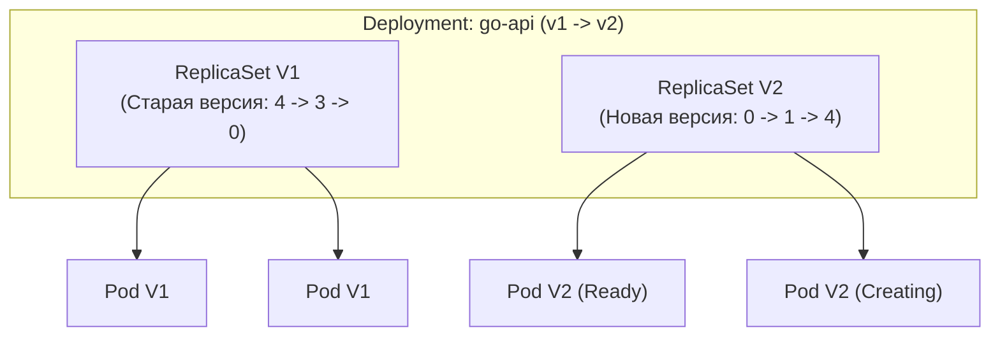
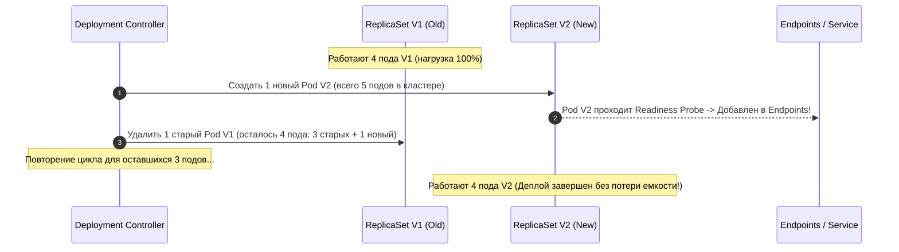
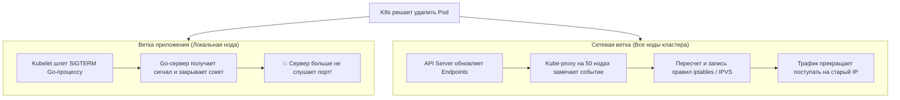

# 2. Rolling Updates: Анатомия плавного обновления без даунтайма

В предыдущей статье ([[1. CI_CD и деплой]]) мы построили конвейер непрерывной интеграции, собирающий кристально чистые Docker-образы и доставляющий свежие манифесты в кластер Kubernetes. Но что физически происходит внутри серверов в момент, когда новый манифест применяется контроллером?

Наивный подход к развертыванию — стратегия `Recreate`: выключить старую версию сервиса, дождаться ее полного завершения и запустить новую. В эпоху монолитов на выделенных серверах это было привычным делом: пользователям показывали заглушку «Технические работы на 15 минут». В современном мире микросервисов и глобальной доступности даже 5 секунд даунтайма оборачиваются миллионными убытками, потерей корзин покупателей и разорванными банковскими транзакциями.

Индустриальным стандартом для обновления stateless-приложений в Kubernetes является стратегия **Rolling Update (Плавное скользящее обновление)**. На бумаге она выглядит элементарно: по очереди заменяем один старый под на один новый. Но за этой видимой простотой скрываются сложнейшие гонки сетевого стека ядра Linux, о которых обязан знать каждый бэкенд-инженер.

---

## 1. Как работает Rolling Update под капотом

Фундаментальный принцип Kubernetes гласит: **Поды иммутабельны (неизменяемы)**. Вы не можете «на лету» заменить бинарный файл внутри работающего контейнера или подменить его образ. 

Когда вы обновляете образ контейнера в объекте `Deployment`, контроллер `kube-controller-manager` не модифицирует существующие поды. Вместо этого он создает совершенно **новый объект ReplicaSet**, который начинает постепенно разворачивать поды версии V2, одновременно отдавая команды на плавное сворачивание старого ReplicaSet версии V1.



Темпом и безопасностью этой рокировки управляют два критически важных параметра в блоке `strategy.rollingUpdate`:
* `maxSurge`: Сколько подов разрешено создать **сверх** целевого количества реплик на время обновления (в абсолютных числах или процентах).
* `maxUnavailable`: Сколько старых подов разрешено вывести из строя (сделать недоступными) в процессе деплоя.

```yaml
apiVersion: apps/v1
kind: Deployment
metadata:
  name: go-api
spec:
  replicas: 4
  strategy:
    type: RollingUpdate
    rollingUpdate:
      maxSurge: 25%       # Разрешено создать +1 под сверх лимита (25% от 4)
      maxUnavailable: 0   # Строгий запрет на уменьшение доступных подов!
```

### Математика Rolling Update

Представьте кластер под высокой нагрузкой: `replicas: 4`, `maxSurge: 1` (25%), `maxUnavailable: 0`.

Параметр `maxUnavailable: 0` дает железную гарантию: в любой момент времени кластер обязан иметь **не менее 4** полностью работоспособных подов. Параметр `maxSurge: 1` ограничивает максимальный размер пула **не более чем 5** подов одновременно.



1. Контроллер отдает команду `ReplicaSet V2` создать 1 новый под. В кластере становится 5 подов (4 старых + 1 новый).
2. Новый под стартует, инициализирует Go-рантайм и успешно отвечает на `Readiness Probe`. Только после этого контроллер включает его IP в список `Endpoints` сервиса.
3. Контроллер отдает команду `ReplicaSet V1` уничтожить 1 старый под. В кластере снова 4 пода (3 старых, 1 новый).
4. Шаги циклически повторяются до тех пор, пока `ReplicaSet V1` не сожмется до 0, а `ReplicaSet V2` не вырастет до 4.

> [!info] Под капотом: Почему maxUnavailable: 0 критичен для продакшена
> Если в погоне за скоростью вы выставите `maxUnavailable: 25%` (1 под из 4), Kubernetes сначала принудительно убьет один старый под, и лишь затем начнет создавать новый.
> В этот промежуток времени ваш сервис будет работать всего на 3 подах (75% от необходимой емкости). Оставшиеся три пода получат на 33% больше входящего трафика. Если они и без того работали на грани лимитов, мгновенно сработает CFS Throttling процессора, вырастут очереди запросов и начнется лавинообразный каскадный отказ. Для публичных API `maxUnavailable: 0` — закон.

---

## 2. Самая страшная сетевая гонка: Откуда берутся 502 ошибки?

Большинство разработчиков считают: «Если я выставил `maxUnavailable: 0` и реализовал graceful shutdown в Go, потеря трафика математически невозможна». Это опаснейшая иллюзия.

Дело в том, что Kubernetes — это **асинхронная распределенная система**. В ней нет глобальной распределенной транзакции, которая могла бы одновременно сказать и приложению: «Завершайся», и сетевой подсистеме: «Перестань слать туда трафик».

Когда планировщик решает уничтожить старый под, запускаются два совершенно независимых параллельных процесса:



> [!warning] Ловушка / Gotcha: Временной лаг iptables и обрыв соединений
> Сетевая ветка требует физического времени. Демоны `kube-proxy` на десятках нод опрашивают API Server, пересчитывают цепочки правил и синхронизируют их в ядре Linux. Это занимает **от 2 до 10 секунд**!
> 
> Если ваше Go-приложение при получении сигнала `SIGTERM` сразу закрывает слушающий HTTP-сокет (`srv.Close()`), оно мгновенно перестает принимать новые TCP-пакеты. Но балансировщики Ingress и другие микросервисы еще в течение нескольких секунд *продолжают слать входящий трафик на старый IP*!
> 
> Ядро Linux на ноде с умирающим подом видит приходящий пакет на закрытый порт и отвечает безжалостным пакетом `TCP RST`. Клиенты в браузере получают ошибки `502 Bad Gateway` или `Connection Refused`.

### Спасительный рецепт: preStop Hook + Плавное завершение

Чтобы победить эту сетевую гонку, мы обязаны искусственно задержать смерть Go-процесса, дав сетевому стеку Linux фору на вычищение таблиц маршрутизации.

#### 1. Спецификация пода в манифесте Deployment:
```yaml
apiVersion: apps/v1
kind: Deployment
metadata:
  name: go-api
spec:
  template:
    spec:
      containers:
      - name: api
        image: registry.example.com/go-api:v2.0.0
        lifecycle:
          preStop:
            exec:
              # КРИТИЧЕСКИ ВАЖНО: спим 10 секунд, пока iptables обновляется на всех нодах!
              command: ["/bin/sh", "-c", "sleep 10"]
      # Даем достаточно времени на preStop (10с) + честный Go shutdown (15с)
      terminationGracePeriodSeconds: 30
```

#### 2. Промышленная реализация Graceful Shutdown в Go:
```go
package main

import (
	"context"
	"errors"
	"log"
	"net/http"
	"os"
	"os/signal"
	"syscall"
	"time"
)

func main() {
	mux := http.NewServeMux()
	mux.HandleFunc("/api/v1/ping", func(w http.ResponseWriter, r *http.Request) {
		w.WriteHeader(http.StatusOK)
		w.Write([]byte("pong"))
	})

	srv := &http.Server{
		Addr:    ":8080",
		Handler: mux,
	}

	// Запускаем сервер в фоновой горутине
	go func() {
		if err := srv.ListenAndServe(); err != nil && !errors.Is(err, http.ErrServerClosed) {
			log.Fatalf("listen error: %v", err)
		}
	}()

	// Подписываемся на сигналы завершения ОС
	// ВАЖНО: SIGTERM придет в контейнер только ПОСЛЕ того, как отработает preStop hook (sleep 10)!
	ctx, stop := signal.NotifyContext(context.Background(), syscall.SIGTERM, syscall.SIGINT)
	defer stop()

	<-ctx.Done() // Блокируемся до получения сигнала от Kubelet
	log.Println("Получен сигнал завершения. Начинаем плавную остановку...")

	// Создаем контекст с таймаутом на доработку активных запросов
	shutdownCtx, cancel := context.WithTimeout(context.Background(), 15*time.Second)
	defer cancel()

	// Shutdown перестает принимать новые соединения и ждет завершения текущих горутин
	if err := srv.Shutdown(shutdownCtx); err != nil {
		log.Printf("Принудительное завершение сервера по таймауту: %v", err)
	} else {
		log.Println("Все активные запросы успешно завершены. Сервер чисто остановлен.")
	}
}
```

Благодаря связке `preStop: sleep 10` и `srv.Shutdown()` сетевые таблицы гарантированно обновятся до того, как Go-сервер закроет сокет. Ноль потерянных клиентских запросов!

---

## 3. Mechanical Sympathy: Ресурсный голод при обновлении

Параметр `maxSurge` требует свободных аппаратных ресурсов. Если у вас было 4 пода с запросом `requests: cpu: "2"`, то в момент обновления `maxSurge: 1` потребует от кластера суммарно не 8, а **10 ядер CPU**!

Если все физические серверы в кластере уже утилизированы на 100%, планировщик Kubernetes (`kube-scheduler`) не сможет назначить новый под ни на один узел. Под застрянет в мучительном статусе **`Pending`**.

Что произойдет с деплоем? Он намертво зависнет!
* Старые поды не будут удаляться (ведь действует директива `maxUnavailable: 0`).
* Новый под не может запуститься (не хватает процессорных ресурсов).
* Инженеры смотрят на зависший CI/CD пайплайн.

> [!tip] Вопрос для собеседования: Деплой при нехватке ресурсов
> **Вопрос:** Как безопасно обновить Go-сервис, если в кластере нет свободных ресурсов для `maxSurge`?
> **Ответ:** 
> 1. Наивный путь: использовать стратегию `Recreate` или временно разрешить `maxUnavailable: 1`, но это приведет либо к простою сервиса, либо к риску перегрузки оставшихся подов.
> 2. Промышленный путь: использовать **Cluster Autoscaler (CA)** или **Karpenter**. Планировщик видит под в статусе `Pending`, Cluster Autoscaler мгновенно запрашивает у облачного провайдера дополнительную виртуальную машину (Node), под разворачивается на ней, деплой успешно финиширует, а затем пустая старая нода аккуратно удаляется.

---

## 4. Rollback: Мгновенный откат при сбоях

Даже самый качественный CI-пайплайн с тестами и линтерами не гарантирует 100% отсутствие багов. Что делать, если новая версия Go-бинарника падает с паникой из-за непредвиденного формата входящих данных?

### Автоматическая защита Kubernetes
Если новые поды версии V2 падают при старте или не могут пройти `Readiness Probe`, Deployment Controller немедленно останавливает обновление! Он никогда не убьет оставшиеся здоровые поды версии V1. Кластер продолжит обслуживать трафик на старой стабильной версии.

### Ручной откат в один клик
Kubernetes бережно сохраняет историю предыдущих объектов ReplicaSet (по умолчанию глубина истории `revisionHistoryLimit: 10`). Для мгновенного отката на предыдущую версию достаточно выполнить команду:

```bash
kubectl rollout undo deployment/go-api
```

Kubernetes мгновенно запустит обратный процесс Rolling Update. Поскольку образы старой стабильной версии уже закэшированы на дисках серверов, откат происходит за считанные секунды без необходимости повторной сборки и скачивания образов.

---

## Резюме

1. **Иммутабельность подов:** Rolling Update обновляет приложение не модификацией контейнеров, а плавным созданием нового ReplicaSet параллельно со сворачиванием старого.
2. **Параметры `maxSurge` и `maxUnavailable`:** Для критических публичных API всегда используйте `maxUnavailable: 0`, чтобы не допустить просадки пропускной способности кластера.
3. **Победа над 502 ошибками:** Сетевые таблицы `iptables`/`IPVS` обновляются с задержкой в несколько секунд. Для ликвидации гонки соединений обязательно используйте `preStop: sleep 10` в связке с `srv.Shutdown()` в Go.
4. **Ресурсный баланс:** Всегда учитывайте потребность `maxSurge` в свободных мощностях кластера или настраивайте Cluster Autoscaler для динамического заказа нод при зависании подов в `Pending`.
5. **Rollback:** Защита от сбоев встроена в K8s по умолчанию, а команда `kubectl rollout undo` обеспечивает мгновенный возврат к предыдущей рабочей ревизии.

Стратегия Rolling Update идеальна, когда новая версия обратно совместима со старой. Но что делать, если вы кардинально переписали API, изменили контракты данных или хотите проверить новую версию всего на 5% пользователей перед полным релизом? В следующей статье мы разберем продвинутые техники: [[3. Canary и blue green deploy]].