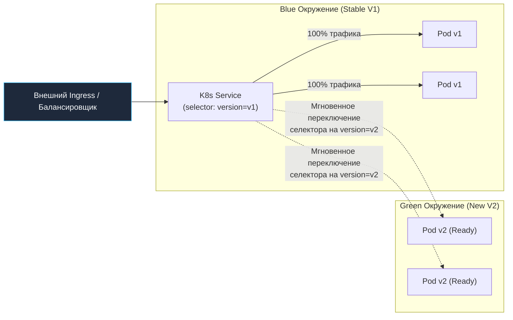
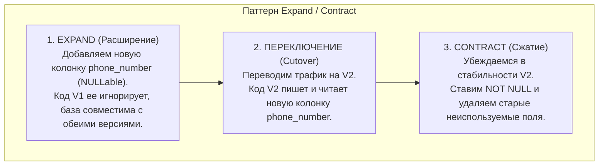
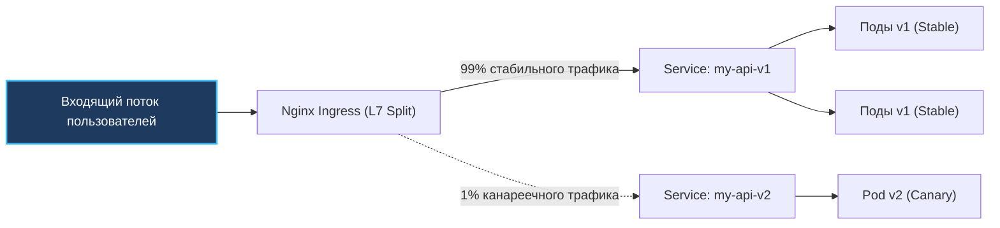

# 3. Продвинутые стратегии деплоя: Blue-Green, Canary и управление рисками в Go

В предыдущей статье ([[2. Rolling updates]]) мы детально исследовали механику скользящего обновления `RollingUpdate`. Это прекрасный рабочий инструмент для 80% повседневных релизов, однако у него есть фундаментальная предпосылка: он исходит из того, что новая версия приложения на 100% обратно совместима (backward compatible) со старой версией и с существующей схемой базы данных.

В реальной жизни бэкенд-разработчика наступают моменты радикальных тектонических сдвигов:
* Полная переработка архитектуры критического финансового модуля.
* Изменение структуры реляционной базы данных (миграции сотен миллионов строк).
* Переход на новый протокол сериализации или замена сетевых библиотек.

Выкатывать такие изменения «вслепую» через Rolling Update — все равно что прыгать с парашютом, который укладывал незнакомец. Если в новом коде кроется незаметная утечка памяти, ломающая сервис под нагрузкой через 20 минут, или деструктивный баг в обработке транзакций, вы рискуете уронить 100% клиентского трафика.

Для безопасного управления рисками в индустрии выработаны две ключевые стратегии: **Blue-Green Deployment** (мгновенная замена окружений) и **Canary Release** (канареечный запуск на малой доле реальных пользователей).

---

## 1. Blue-Green Deployment: Мгновенная рокировка окружений

Идея Blue-Green (сине-зеленого) развертывания предельно наглядна и элегантна: в кластере одновременно сосуществуют **два независимых, абсолютно идентичных производственных окружения**.

* **Blue (Синее):** Текущий работающий продакшен (версия V1), принимающий 100% пользовательских запросов.
* **Green (Зеленое):** Новая версия (V2), полностью развернутая рядом в том же кластере, но пока изолированная от внешнего трафика.



### Пошаговый протокол переключения (Cutover):
1. Вы разворачиваете деплоймент `app-v2` рядом с `app-v1`. Поды версии V2 стартуют, выделяют память, подключаются к базе данных, прогревают локальные кэши и успешно отвечают на `Readiness Probe`.
2. Инженеры QA или синтетические тесты могут проверить работоспособность Green-окружения через специальный внутренний тестовый сервис.
3. **Момент Cutover (Переключение):** Администратор или CI/CD обновляет поле `selector` в манифесте Service с `version: v1` на `version: v2`.
4. Kubernetes мгновенно обновляет IP-адреса в объекте `Endpoints`. Весь входящий трафик за миллисекунды перенаправляется на Green-поды.
5. **Откат (Rollback):** Если в продакшене внезапно взлетает график 500-х ошибок, селектор Service меняется обратно на `version: v1`. Откат занимает доли секунды, ведь старое Blue-окружение не уничтожалось и продолжает мирно работать в памяти.

> [!info] Под капотом: Механика селекторов в K8s
> Чтобы архитектура Blue-Green работала в Kubernetes, оба Deployment (`app-v1` и `app-v2`) обязаны иметь общий группирующий лейбл приложения и уникальный лейбл версии:
> ```yaml
> # В Pod Template обоих деплойментов:
> metadata:
>   labels:
>     app: my-api       # Общий идентификатор
>     version: v1       # (или v2 для Green)
> ```
> Переключение сервиса — это патч одной строчки: `kubectl set selector service/my-api version=v2`. Никаких рестартов подов, никаких долгих пересчетов: Kube-proxy обновляет правила iptables/IPVS за миллисекунды.

---

## 2. Ахиллесова пята Blue-Green: Базы данных и паттерн Expand/Contract

Казалось бы, Blue-Green идеален. В чем подвох? 
Подвох кроется в состоянии (**State**) — в общей базе данных.

Представьте: версия V2 требует нового поля в таблице пользователей. Если ваш Go-код при старте выполняет `ALTER TABLE ADD COLUMN`, база данных изменится:
```sql
ALTER TABLE users ADD COLUMN phone_number VARCHAR(20) NOT NULL;
```
И здесь наступает катастрофа:
1. Синее окружение (версия `app-v1`) еще активно работает и принимает реальные запросы.
2. Go-код версии V1 выполняет привычный запрос: `SELECT * FROM users;`.
3. Драйвер базы данных натыкается на неожиданную новую колонку, не может смапить ее в существующую Go-структуру и выдает фатальную ошибку.
4. Вы не можете безопасно откатиться назад: откат приложения на `app-v1` уже не спасет, так как схема базы данных безвозвратно изменена!



### Спасение: Паттерн Expand/Contract (Parallel Run)
Для поддержки бесшовного Blue-Green деплоя все изменения баз данных разбиваются на три фазы:
1. **Expand (Расширение схемы):** В БД добавляются новые таблицы или колонки со статусом `NULLable` или дефолтными значениями. Старая версия `v1` продолжает работать, не замечая изменений.
2. **Переключение (Cutover):** Трафик переводится на `v2`. Приложение начинает заполнять новые поля.
3. **Contract (Сжатие схемы):** Только после того, как версия `v2` отработала в проде несколько дней, и риск отката сведен к нулю, отдельной миграцией накладываются строгие ограничения (`NOT NULL`) и удаляются устаревшие рудименты.

---

## 3. Canary Deployment: Проверка боем на живых пользователях

Название «Канареечный релиз» отсылает к исторической традиции шахтеров: спускаясь в забой, они брали с собой клетку с канарейкой. Птицы исключительно чувствительны к метану и угарному газу. Если канарейка начинала проявлять беспокойство или засыпала, шахтеры немедленно эвакуировались на поверхность до того, как газ достигнет смертельной для человека концентрации.

В программной инженерии **Canary Release** — это техника, при которой новая версия бинарника (v2) раскатывается не на всех, а лишь на крошечный срез пользователей (например, 1%, 5% или 10%), в то время как 90–99% аудитории продолжают обслуживаться проверенной стабильной версией v1.



Инженеры непрерывно анализируют телеметрию канарейки: если 1% пользователей не сталкивается с ростом 5xx-ошибок и задержек, доля трафика плавно повышается: 5% -> 25% -> 50% -> 100%.

---

## 4. Реализация Canary через Nginx Ingress: Магия аннотаций

Если в вашей инфраструктуре еще не развернут тяжелый Service Mesh (Istio или Linkerd), проще и эффективнее всего реализовать канареечную маршрутизацию средствами стандартного **Nginx Ingress Controller**.

Для этого создаются два независимых манифеста `Ingress`, указывающие на один и тот же домен и путь, но имеющие разные бэкенды:

### 1. Стабильный Ingress (Основной трафик):
```yaml
apiVersion: networking.k8s.io/v1
kind: Ingress
metadata:
  name: my-api-stable
spec:
  rules:
  - host: api.example.com
    http:
      paths:
      - path: /api
        pathType: Prefix
        backend:
          service:
            name: my-api-v1
            port:
              number: 8080
```

### 2. Канареечный Ingress (1% трафика):
```yaml
apiVersion: networking.k8s.io/v1
kind: Ingress
metadata:
  name: my-api-canary
  annotations:
    # Включаем канареечный режим
    nginx.ingress.kubernetes.io/canary: "true"
    # Задаем ровно 1% входящего трафика
    nginx.ingress.kubernetes.io/canary-weight: "1"
spec:
  rules:
  - host: api.example.com
    http:
      paths:
      - path: /api
        pathType: Prefix
        backend:
          service:
            name: my-api-v2
            port:
              number: 8080
```

> [!warning] Ловушка / Gotcha: Семантика соединений против запросов в gRPC
> Nginx Ingress Controller распределяет трафик с помощью модуля ядра Nginx `split_clients` (опираясь на IP-адрес клиента или случайное распределение сокетов).
> 
> В мире чистого REST/HTTP/1.1 это работает идеально: каждый запрос открывает новое соединение или переиспользует сокет в пул. 
> Но если ваши Go-сервисы общаются по **gRPC поверх HTTP/2**, клиент создает **одно-единственное долгоживущее TCP-соединение**, внутри которого мультиплексирует миллионы RPC-вызовов!
> 
> В итоге Nginx применит вес 1% к *TCP-соединению*. Если клиент попадет в этот 1%, он направит абсолютно **все 100% своих gRPC-запросов** в канарейку! Для честной L7-балансировки потоков gRPC требуется Envoy Gateway или полноценный Service Mesh.

### Точный таргетинг (A/B Testing и внутренний Dogfooding)
Вместо случайного процентного разделения трафика вы можете направить на канарейку конкретную когорту пользователей — например, сотрудников вашей компании (практика *dogfooding*):

```yaml
metadata:
  annotations:
    nginx.ingress.kubernetes.io/canary: "true"
    nginx.ingress.kubernetes.io/canary-by-header: "X-Canary"
    nginx.ingress.kubernetes.io/canary-by-header-value: "true"
```

Если Go-клиент или мобильное приложение передаст HTTP-заголовок `X-Canary: true`, запрос гарантированно попадет на новую версию `v2`. Все обычные пользователи пойдут на стабильную `v1`.

---

## 5. Mechanical Sympathy: Подводные камни Canary в рантайме Go

Параллельная работа двух разных версий одного и того же Go-сервиса порождает специфические эффекты в распределенной памяти.

### 1. Проблема кэшей (Cache Incoherence)
Если ваш Go-сервис использует распределенный кэш (Redis), Canary-деплой может вызвать «мерцание» данных.
Представьте, что v1 кладет в кэш структуру `User{Name: "Ivan"}`, а v2 добавила поле `IsAdmin: false`.
1. Запрос идет в v2, она кладет в кэш новую структуру.
2. Следующий запрос того же пользователя балансировщиком уходит в v1.
3. v1 десериализует кэш.

В Go стандартный пакет `encoding/json` по умолчанию просто игнорирует неизвестные поля JSON при десериализации, что спасает приложение от паники. Однако если вы используете строгие валидаторы (`DisallowUnknownFields()`) или бинарные протоколы (Protobuf/MessagePack без обратной совместимости номеров тегов), сервис V1 упадет с ошибкой парсинга.

**Золотое правило для распределенного кэша:**
Всегда версионируйте префиксы ключей в Redis при несовместимых изменениях: `user:123:v2` вместо `user:123`.

### 2. Observability: Вы не можете улучшить то, что не видите
Выкатить 1% канарейку и смотреть на общий дашборд сервиса — бесполезно: всплеск ошибок на 1% потока просто утонет в шуме общих 99% трафика.

В Prometheus метрики вашего Go-приложения (например, `http_request_duration_seconds`) обязаны иметь лейбл `version` или `image_tag`:
```go
package metrics

import "github.com/prometheus/client_golang/prometheus"

var HttpRequestDuration = prometheus.NewHistogramVec(
	prometheus.HistogramOpts{
		Name:    "http_request_duration_seconds",
		Help:    "Время обработки HTTP запросов",
		Buckets: prometheus.DefBuckets,
	},
	// Метка version или image_tag критически важна для отделения Canary от Stable!
	[]string{"method", "path", "status", "version"},
)
```

Только построив в Grafana два независимых графика: `p99 latency (version="v1")` против `p99 latency (version="v2")`, вы сможете объективно подтвердить успех релиза.

> [!tip] Вопрос для собеседования: Canary vs Feature Flags
> **Вопрос:** В чем архитектурное отличие между Canary Release и Feature Flags (Флагами функций)?
> **Ответ:** 
> * **Feature Flags (Переключатели функций):** Управляют поведением *внутри единого исполняемого файла*. Вы деплоите один и тот же бинарник на все 100% серверов, а логику переключаете динамически через внешнюю конфигурацию (LaunchDarkly, Unleash или etcd). Плюс: мгновенное включение без перезапуска. Минус: код обрастает ветвлениями `if/else`, а фатальный баг (паника или утечка памяти) положит весь под целиком.
> * **Canary Release:** Изоляция на уровне *процессов и контейнеров*. Вы запускаете физически разные бинарники в независимых подах. Если канарейка падает в OOM Kill или пожирает 100% CPU, она изолирована в своих cgroups и не затронет стабильный кластер.

---

## Резюме

1. **Blue-Green:** Обеспечивает мгновенное переключение трафика на уровне Service Selector и мгновенный откат, но требует двойного запаса вычислительных мощностей.
2. **Expand/Contract:** Обязательный паттерн миграции баз данных при Blue-Green релизах, исключающий поломку старых реплик из-за изменений DDL.
3. **Canary Release:** Минимизирует бизнес-риски, направляя 1–5% пользователей на новую версию с непрерывным контролем метрик.
4. **Nginx Ingress Canary:** Реализует канареечное разделение через аннотации `canary: "true"` и `canary-weight`, а также поддерживает A/B-тестирование по заголовку `X-Canary`.
5. **gRPC Caveat:** Из-за мультиплексирования HTTP/2 Nginx Ingress балансирует TCP-соединения, а не отдельные gRPC-вызовы. Для стримов gRPC необходим Envoy / Service Mesh.
6. **Метрики и кэш в Go:** Обязательно добавляйте лейбл `version` во все векторы метрик Prometheus и версионируйте ключи Redis (`user:123:v2`).

Чтобы канареечный релиз приносил пользу, инженеры должны непрерывно видеть состояние здоровья серверов, контейнеров и рантайма. В следующей статье мы погрузимся в телеметрию низкого уровня: [[4. Мониторинг инфраструктуры]].