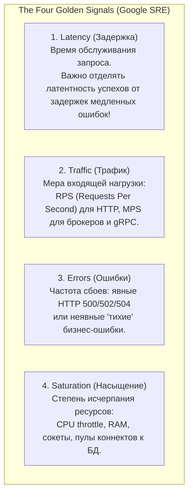
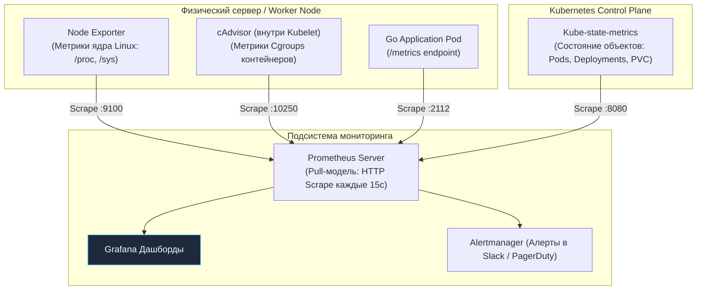

# 4. Мониторинг инфраструктуры: Четыре золотых сигнала, Prometheus, cAdvisor и метрики Go-рантайма

В предыдущих главах мы детально настраивали деплой, горизонтальное масштабирование и сетевую маршрутизацию. Однако слепая вера в то, что развернутый кластер работает идеально только потому, что HTTP-запросы возвращают код 200, — самый короткий путь к ночным дежурствам и катастрофическим инцидентам в продакшене.

Мониторинг инфраструктуры — это не просто набор красочных графиков в Grafana для успокоения менеджмента. Это **Mechanical Sympathy (механическое сочувствие к машине)** в чистом инженерном выражении: способность видеть сквозь абстракции контейнеризации и понимать, как ядро Linux, подсистема Cgroups, планировщик Kubernetes и рантайм Go делят между собой физические такты процессора, страницы оперативной памяти и очереди дисковых накопителей.

---

## 1. Концепция: The Four Golden Signals

Прежде чем бросаться собирать терабайты метрик, необходимо определить метрический фундамент. В классической библии надежности *Google SRE Book* сформулирована концепция **четырех золотых сигналов** (The Four Golden Signals), позволяющая мгновенно оценить состояние любой распределенной системы:



1. **Latency (Задержка):** Время, затраченное на обработку запроса. Инженеры часто совершают ошибку, усредняя латентность. Важно измерять перцентили (p95, p99) и строго разделять задержку успешных ответов и задержку ошибок. Медленно падающий с таймаутом запрос гораздо опаснее быстрого ответа `500 Internal Server Error`.
2. **Traffic (Трафик):** Количественная мера спроса на систему. Для HTTP-бэкенда это RPS (Requests Per Second), для gRPC или брокеров очередей — MPS (Messages Per Second) или байты в секунду.
3. **Errors (Ошибки):** Интенсивность отказов. Сюда входят как явные системные ошибки (HTTP 500/502/503/504, сетевые сбросы соединений), так и коварные неявные сбои (когда сервис возвращает статус `200 OK`, но с пустым или битым JSON внутри).
4. **Saturation (Насыщение):** Насколько система близка к своему физическому пределу (утилизация очередей ядра, пула потоков, памяти, дискового IO). **Насыщение предсказывает проблемы задолго до того, как они ударят по Latency и вызовут Errors.**

---

## 2. Архитектура наблюдаемости в Kubernetes: Трехуровневый пирог

Невозможно поставить один универсальный агент и собрать исчерпывающую телеметрию. Мониторинг кластера Kubernetes строится как многослойный пирог из трех независимых источников данных:



Каждый слой решает строго определенную задачу и смотрит на мир под своим углом.

---

## 3. Слой 1: Нода (Node Exporter)

**Node Exporter** — это специализированный демон (DaemonSet в K8s), написанный на Go. Он ничего не знает о концепциях Kubernetes, подах или контейнерах. Его цель — раскрыть физическое состояние операционной системы Linux и аппаратного сервера.

Node Exporter добывает метрики путем прямого парсинга псевдо-файловых систем ядра:
* `/proc/stat` — тики процессорного времени, прерывания (interrupts), переключения контекста (**context switches**).
* `/proc/meminfo` — детальная раскладка RAM: анонимная память, Swap, Page Cache, буферы и slabs ядра.
* `/sys/class/block/` — глубина дисковых очередей, время операций чтения/записи (IOPS, iostat).
* `/proc/net/dev` — сетевой трафик, отброшенные пакеты (drops), ошибки контроллера (errors).

> [!info] Под капотом: Context Switches и планировщик Go
> В метриках Node Exporter критически важно отслеживать всплески **Context Switches**.
> В модели рантайма Go (G-M-P) каждая системная нить `M` (OS Thread) конкурирует за физические ядра с другими потоками хоста. Если планировщик ядра Linux перегружен десятками тысяч потоков сторонних процессов, число переключений контекста взлетает до сотен тысяч в секунду. Процессор тратит до 30% времени на сброс регистров и L1-кэшей, а горутины вашего сервиса простаивают в очереди на выполнение (Run Queue).

### Mechanical Sympathy: Анализ iowait и steal
При исследовании метрик процессора опытный инженер смотрит глубже базовых процентов `user` и `system`:
* **`iowait`:** Процент процессорного времени, в течение которого ядра бездействовали в ожидании ответа от медленных накопителей (SSD/HDD). Высокий `iowait` сигнализирует, что потоки Go-приложения заблокированы в ядре на блокирующих системных вызовах `read/write` (как мы выяснили в [[3. Файловая система Linux]]), и рантайм вынужден создавать новые потоки `M`.
* **`steal`:** Процент процессорных квантов времени, физически «украденных» гипервизором облачного провайдера в пользу других виртуальных машин. Если метрика `steal` превышает 3–5%, ваш сервис страдает от проблемы шумных соседей (**Noisy Neighbors**). Единственное решение — миграция виртуальной машины или аренда Dedicated/Bare-metal инстансов.

---

## 4. Слой 2: Контейнер (cAdvisor)

Откуда Kubernetes узнает, сколько памяти или процессора потребил конкретный Docker-контейнер? Он опрашивает контроллер **cAdvisor (Container Advisor)**, встроенный прямо в демон `kubelet`. cAdvisor также написан на Go и считывает сырые данные из виртуальной файловой системы Cgroups (`/sys/fs/cgroup`).

```mermaid
flowchart LR
    classDef process  fill:#1e293b,stroke:#38bdf8,stroke-width:1px,color:#f8fafc
    classDef success  fill:#064e3b,stroke:#34d399,stroke-width:1px,color:#f8fafc
    classDef error    fill:#7f1d1d,stroke:#f87171,stroke-width:1px,color:#f8fafc
    classDef warning  fill:#78350f,stroke:#fbbf24,stroke-width:1px,color:#f8fafc
    classDef entry    fill:#1e3a5f,stroke:#38bdf8,stroke-width:2px,color:#f8fafc
    classDef aux      fill:#334155,stroke:#64748b,stroke-width:1px,color:#f8fafc
    classDef system   fill:#312e81,stroke:#a78bfa,stroke-width:1px,color:#f8fafc
    classDef data     fill:#132d29,stroke:#2dd4bf,stroke-width:1px,color:#f8fafc
    classDef network  fill:#881337,stroke:#fb7185,stroke-width:1px,color:#f8fafc
    classDef accent   fill:#1e1b4b,stroke:#818cf8,stroke-width:1px,color:#f8fafc
    Cgroup["/sys/fs/cgroup/cpu,memory\n(Ядро Linux):::system"] --> cAdv["cAdvisor (Go daemon)"]
    cAdv -->|"Prometheus Format"| Kubelet["Kubelet API (:10250/metrics/cadvisor)"]
    Kubelet --> Prom["Prometheus Server"]
```



> [!warning] Ловушка / Gotcha: container_cpu_cfs_throttled_periods_total
> Самая частая головная боль Go-разработчиков в Kubernetes — скрытое удушение процессов планировщиком ядра, отражаемое метрикой `container_cpu_cfs_throttled_periods_total`.
> 
> Как мы подробно выяснили в [[5. Scaling и autoscaling]], лимит `resources.limits.cpu: "500m"` принудительно включает CFS (Completely Fair Scheduler). Контейнеру выделяется квота в 50 мс на каждые 100 мс системного периода.
> 
> Если 4 горутины в Go-сервисе параллельно выполняют тяжелый парсинг JSON или сработал цикл сборщика мусора (GC), суммарная процессорная квота в 50 мс исчерпывается за считанные миллисекунды. **На оставшуюся часть 100-мс периода ядро Linux принудительно усыпляет контейнер!**
> 
> На мониторинге это выглядит как необъяснимый всплеск задержек (p99 latency вырастает ровно на 80–100 мс). Если вы видите рост графика `cfs_throttled` — немедленно увеличивайте лимиты, убирайте CPU limits вовсе либо настраивайте переменную `GOMEMLIMIT`, чтобы сгладить пики аллокаций.

---

## 5. Слой 3: Объекты Kubernetes (Kube-state-metrics)

Демон **Kube-state-metrics** не измеряет байты и герцы. Он подключается к K8s API Server через библиотеку `client-go` и транслирует в метрики Prometheus само **декларативное состояние объектов кластера**:
* Запрошенное количество реплик Deployment против реально доступных (`kube_deployment_status_replicas_available`).
* Поды, застрявшие в циклах перезапусков (`CrashLoopBackOff` или `OOMKilled`).
* Дисковые тома PersistentVolumeClaim, зависшие в статусе `Pending`.
* Статус готовности нод кластера (`kube_node_status_condition`).

> [!tip] Вопрос для собеседования: cAdvisor против Kube-state-metrics
> **Вопрос:** В чем принципиальная разница между метриками cAdvisor и Kube-state-metrics?
> **Ответ:** 
> * **cAdvisor отвечает на вопрос «КАК? (Ресурсы)»:** Какова физическая утилизация контейнера? Сколько байт оперативной памяти занято? Сколько периодов CPU было задушено?
> * **Kube-state-metrics отвечает на вопрос «ЧТО? (Состояние)»:** В каком статусе находится оркестрация? Находится ли Pod в статусе Ready? Сколько реплик запущено? Не упал ли под в `CrashLoopBackOff`?
> 
> В грамотном мониторинге вы настраиваете критические алерты (P1) на данные Kube-state-metrics (если под упал или не готов), а упреждающие алерты (P2/P3) — на данные cAdvisor (если сервису скоро перестанет хватать памяти).

---

## 6. Prometheus: Архитектура Pull-модели и Service Discovery

Индустриальным стандартом сбора метрик в облачной инфраструктуре является **Prometheus**. В отличие от классических систем с Push-моделью (StatsD, Graphite, Datadog), где приложения сами обязаны отправлять метрики на центральный сервер, Prometheus реализует **Pull-модель (Scrape)**: он сам периодически приходит по HTTP на порт каждого инстанса.

### Почему Pull-модель идеальна для инфраструктуры?
1. **Надежное обнаружение отказов (Deadlock Detection):** В push-системе, если Go-приложение намертво зависло в дедлоке или упало вместе с нодой, оно просто перестает слать пакеты. Push-сервер видит пустоту и считает: «Нет ошибок — значит, всё спокойно». Prometheus же при очередном опросе не получает HTTP 200 и немедленно генерирует системный алерт **`TargetDown`**.
2. **Динамический Service Discovery:** Prometheus тесно интегрирован с API Kubernetes. Ему не нужно прописывать статические IP-адреса: он автоматически обнаруживает новые поды по аннотациям (например, `prometheus.io/scrape: "true"`) и меткам селекторов, удаляя исчезнувшие инстансы из списка опроса.

---

## 7. Интеграция Go: Метрики рантайма под микроскопом

Официальный SDK `github.com/prometheus/client_golang` при вызове стандартного хэндлера `promhttp.Handler()` автоматически подключает коллектор `collectors.NewGoCollector()`. Он раскрывает глубокие внутренности среды исполнения Go без написания единой строчки прикладного кода!

```go
package main

import (
	"log"
	"net/http"

	"github.com/prometheus/client_golang/prometheus/promhttp"
)

func main() {
	// Стандартный эндпоинт, отдающий метрики рантайма Go и кастомные метрики
	http.Handle("/metrics", promhttp.Handler())

	log.Println("Сервер метрик Prometheus слушает на порту :2112...")
	if err := http.ListenAndServe(":2112", nil); err != nil {
		log.Fatalf("ошибка запуска метрик: %v", err)
	}
}
```

### Критически важные runtime-метрики Go:
1. **`go_goroutines`:** Текущее количество активных горутин в памяти. Рост графика горутин при стабильном входящем RPS — классический симптом утечки горутин (**goroutine leak**), зависших на незакрытых каналах или сокетах.
2. **`go_gc_duration_seconds`:** Гистограмма длительности фаз сборки мусора (Stop-The-World и Concurrent phases). Всплески длительности сигнализируют о сильной фрагментации кучи или нехватке памяти.
3. **`go_memstats_heap_inuse_bytes`:** Объем оперативной памяти, занятый живыми объектами в куче. В здоровом сервисе график имеет строгий пилообразный вид (рост аллокаций сменяется резким обрывом после прохода GC). Монотонный непрерывный рост без падений — стопроцентный признак утечки памяти (Memory Leak).

> [!warning] Подводный камень: Память контейнера vs Память Go
> Начинающие инженеры часто путают метрику приложения `go_memstats_heap_inuse_bytes` и метрику контейнера `container_memory_working_set_bytes`.
> 
> Если Go-приложение рапортует об использовании 1 ГБ кучи, а cAdvisor показывает 1.6 ГБ, это не баг! 
> Разницу составляют:
> * Системный стек горутин (по 2–8 КБ на каждую).
> * Пул свободных страниц рантайма (Go не отдает освобожденную память ядру ОС мгновенно, а удерживает ее в `mcache`/`mcentral` для будущих аллокаций).
> * Страничный кэш ядра (**Page Cache**) при операциях с файлами.
> 
> Системный OOM Killer ядра Linux ориентируется именно на метрику `working_set_bytes` из cgroups. Поэтому для предотвращения падений анализируйте поведение обеих метрик совместно!

---

## Резюме

1. **Four Golden Signals:** Дашборды и системы оповещения должны строиться вокруг задержки (Latency), нагрузки (Traffic), сбоев (Errors) и степени насыщения (Saturation).
2. **Node Exporter:** Читает `/proc` и `/sys`. Следите за количеством переключений контекста (`context switches`), блокировками на диске (`iowait`) и украденными тактами гипервизора (`steal`).
3. **cAdvisor:** Извлекает метрики Cgroups. Рост `container_cpu_cfs_throttled_periods_total` указывает на опасный троттлинг процессора ядром Linux.
4. **Kube-state-metrics:** Мониторит жизненный цикл и расхождения между желаемым и реальным состоянием кластера K8s (`CrashLoopBackOff`, `Pending`).
5. **Pull-модель Prometheus:** Позволяет обнаруживать зависшие сервисы с помощью алертов `TargetDown` и обеспечивает нативный Service Discovery подов.
6. **Go Runtime:** Автоматический коллектор `collectors.NewGoCollector()` дает прозрачный контроль за утечками горутин (`go_goroutines`), здоровьем сборщика мусора (`go_gc_duration_seconds`) и размером кучи.

Метрики дают точный ответ на вопросы: *«Где сломалось?»* и *«Когда сломалось?»*. Однако они бессильны объяснить глубинную причину: *«Что именно произошло?»*. Чтобы восстановить детальный контекст инцидента, необходима вторая опора наблюдаемости — централизованное логирование. В следующей главе мы разберем сбор логов инфраструктуры: [[5. Логи инфраструктуры]].