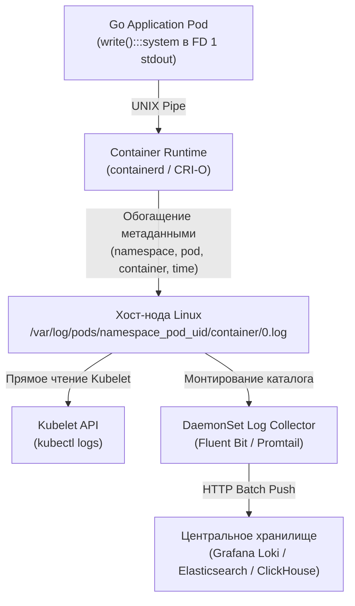
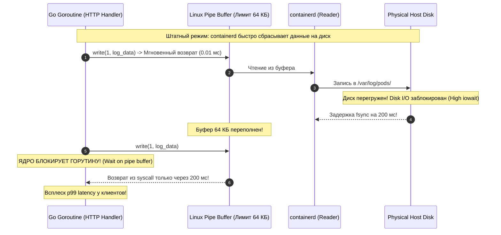
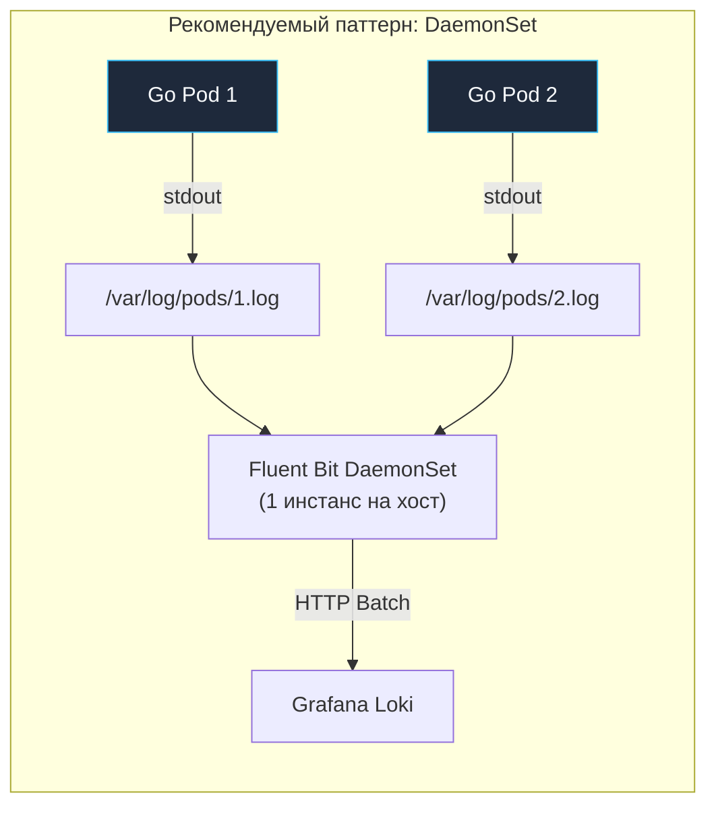

# 5. Логирование инфраструктуры: Потоки ввода-вывода, Disk Pressure, containerd и structured slog в Go

В предыдущей главе ([[4. Мониторинг инфраструктуры]]) мы научились опрашивать числовые метрики. Метрики — это высокоуровневый компас инженера: они мгновенно показывают *«Что именно сломалось и в какую секунду»*. Но когда графики заливаются красным цветом, метрики бессильны объяснить глубинную причину: *«Какая конкретно ошибка привела к падению?»*. Здесь на сцену выходит журналирование событий — логи.

В старом мире монолитов на физических серверах логирование казалось тривиальной задачей: приложение открывало локальный файл `/var/log/app.log`, дописывало в него строки, а системный демон `logrotate` по ночам упаковывал старые файлы в `gzip`. 

В эфемерной вселенной контейнеров и Kubernetes этот подход терпит сокрушительный крах. Поды живут в изолированных слоях файловой системы `OverlayFS`. Если контейнер упал с паникой и был перезапущен демоном `containerd`, все файлы, записанные им во внутреннее дисковое пространство, уничтожаются ядром Linux без возможности восстановления.

Инфраструктурное логирование в Kubernetes требует фундаментальной смены парадигмы: **отказ от локальных файлов в пользу бесконечных потоков данных (Streaming I/O) и централизованной агрегации**.

---

## 1. Философия Unix: Всё есть поток (Stream I/O)

Один из основополагающих принципов операционной системы Unix гласит: *«Программа должна читать из стандартного ввода и писать в стандартный вывод, ничего не зная о том, куда направлен этот поток»*.

В Linux любой процесс при старте получает три открытых системных файловых дескриптора:
* `FD 0`: `stdin` (стандартный ввод);
* `FD 1`: `stdout` (стандартный вывод);
* `FD 2`: `stderr` (стандартный поток ошибок).

Docker и Kubernetes превратили этот принцип в абсолютный стандарт (Двенадцатый фактор методологии 12-Factor App). Ваше Go-приложение больше не создает файлов на диске! Когда вы вызываете `fmt.Println`, `log.Printf` или структурированный `slog.Info`, рантайм Go выполняет системный вызов `write(1, data)`.



Среда исполнения контейнеров (**containerd** через CRI) перехватывает этот поток байтов, оборачивает каждую строку в JSON-конверт с метаданными (временная метка ISO 8601, маркер `stdout/stderr`) и атомарно дописывает в файл на физическом диске хоста.

> [!info] Под капотом: Где физически лежат логи в K8s?
> В Kubernetes путь к лог-файлам строго стандартизирован:
> `/var/log/pods/<namespace>_<pod-name>_<pod-uid>/<container-name>/<restart-count>.log`
> 
> Когда дежурный инженер выполняет команду `kubectl logs my-pod`, запрос не идет к API Server'у за потоком данных. API Server лишь перенаправляет вызов на агент `kubelet` нужной ноды, а `kubelet` просто открывает этот локальный файл на диске хоста и стримит его обратно по HTTP. Это объясняет, почему `kubectl logs` работает молниеносно даже в гигантских кластерах.

---

## 2. Опасность неограниченных логов: Ловушка Disk Pressure

По умолчанию классический лог-драйвер Docker `json-file` не имеет встроенных лимитов на размер файлов. Если в вашем Go-коде закрался бесконечный цикл, спамящий ошибками через `log.Printf`:
```go
for {
    log.Printf("failed to connect to database: %v", err)
}
```
Такой контейнер способен за считанные часы выплюнуть на диск хоста сотни гигабайт текстового мусора.

Когда физический диск сервера заполняется до 85–90%, ядро Linux и Kubernetes включают защитные механизмы, оборачивающиеся катастрофой:
1. **Состояние `DiskPressure`:** Планировщик Kubernetes помечает ноду флагом `DiskPressure` и запрещает запуск новых подов на этом узле.
2. **Падение Kubelet:** Демон `kubelet` не может создавать временные сокеты и обновлять чекпоинты. Сервер выпадает из кластера в статус **`NotReady`**.
3. **Краш базы данных etcd:** Если на этом узле развернут контроллер кластера, база метаданных `etcd` падает с фатальной ошибкой: она не может выполнить системный вызов `fsync` для сброса WAL-журнала на переполненный диск.

### Решение: Настройка ротации логов в Kubelet
На каждом сервере кластера в файле конфигурации Kubelet (`/var/lib/kubelet/config.yaml`) обязательно должны быть зафиксированы жесткие квоты ротации:
```yaml
containerLogMaxSize: "50Mi"    # Максимальный размер одного лог-файла до ротации
containerLogMaxFiles: 5        # Сколько архивных копий хранить (всего не более 250 МиБ)
```
Как только объем логов достигает 50 МБ, `containerd` мгновенно ротирует файл (`0.log` -> `0.log.1`) и создает чистый файл, защищая диск сервера от переполнения.

---

## 3. Mechanical Sympathy: Блокировка на системном вызове write (Blocking Writes)

Это одна из самых коварных ловушек логирования в высоконагруженных Go-сервисах, которую практически невозможно диагностировать обычными профилировщиками CPU.

По умолчанию системный вывод `stdout` в Unix-системах — это **блокирующий анонимный канал (UNIX Pipe)**. Когда Go-приложение вызывает `slog.Info()`, рантайм вызывает системный вызов ядра:
```bash
write(1, "request processed\n", 18)
```
В Linux буфер пайпа между процессом Go и процессом `containerd` имеет фиксированный размер — **всего 64 КБ** (`F_SETPIPE_SZ`).



> [!warning] Ловушка / Gotcha: Деградация сервиса из-за чужого дискового ввода-вывода
> Представьте: на той же ноде соседний контейнер (например, бэкап базы данных) начал интенсивно заливать диск гигабайтами данных. Дисковая очередь хоста забилась (`iowait` подскочил).
> 
> Демон `containerd` не успевает сбрасывать логи из памяти на перегруженный диск. В результате системный буфер пайпа размером 64 КБ переполняется за миллисекунды.
> 
> В эту секунду ядро Linux **принудительно усыпляет системный вызов `write(1, data)`** в вашем Go-приложении! Горутина, которая должна была мгновенно обработать платеж за 2 миллисекунды, намертво виснет на 200–500 мс в ожидании освобождения буфера логов. Задержки (tail latency) у клиентов взлетают, хотя CPU и память Go-сервиса простаивают!
> 
> **Лечение в кодовой базе:** При экстремальных нагрузках (>10 000 RPS) никогда не пишите логи в `stdout` синхронно внутри критического пути обработки запроса. Используйте асинхронные буферизованные логгеры (кольцевые буферы в памяти с каналом `chan []byte`), отбрасывающие низкоприоритетные логи (`Drop on overflow`) при возникновении затора.

---

## 4. Архитектура агрегации логов: DaemonSet vs Sidecar

Чтобы логи попали в Grafana Loki или Elasticsearch, их нужно собрать с нод. В K8s есть два паттерна:

### 1. DaemonSet (Стандарт индустрии)
На каждой ноде запускается один Pod с агентом сбора (Fluent Bit, Promtail, Filebeat). Он монтирует `/var/log/pods` хоста и читает логи всех контейнеров напрямую.
* **Плюсы:** Минимальный оверхед (1 агент на ноду), не требует изменений в ваших Deployment'ах.
* **Минусы:** Агент не знает метаданных K8s (имя Deployment, неймспейс). Ему приходится обращаться к API Server, чтобы обогатить логи лейблами.

### 2. Sidecar (Для изоляции)
В каждый Pod вашего приложения добавляется контейнер с логгером (например, `fluentd`). Ваше Go-приложение пишет логи в локальный файл (shared Volume между контейнерами Пода), а Sidecar их читает и отправляет.
* **Плюсы:** Идеальная изоляция (можно парсить логи специфичным для сервиса образом), логи не теряются при падении сети на ноде.
* **Минусы:** Колоссальный расход ресурсов (CPU/RAM). Если у вас 100 Подов, у вас работает 100 агентов `fluentd`. Это антипаттерн для микросервисов.



---

## 5. Специфика Go: Структурированное логирование с log/slog

До релиза Go 1.21 стандартный пакет `log` умел генерировать лишь неструктурированные текстовые строки:
`2024/05/10 12:00:00 User 42 bought item 100`

Для систем агрегации логов (Loki, ELK) парсинг такого текста с помощью регулярных выражений превращается в вычислительный ад и сжигает процессорные мощности сборщиков логов.

С выходом Go 1.21 в стандартную библиотеку был внедрен пакет **`log/slog`**, сделавший высокоскоростное JSON-логирование стандартным языковым идиоматическим решением:

```go
package main

import (
	"log/slog"
	"net/http"
	"os"
)

func main() {
	// Настраиваем структурированный JSON-обработчик для K8s инфраструктуры
	opts := &slog.HandlerOptions{
		Level: slog.LevelInfo,
	}
	logger := slog.New(slog.NewJSONHandler(os.Stdout, opts))
	slog.SetDefault(logger)

	http.HandleFunc("/api/v1/order", func(w http.ResponseWriter, r *http.Request) {
		// Лог автоматически сериализуется в валидный плоский JSON
		slog.Info("обработка заказа",
			slog.String("path", r.URL.Path),
			slog.Int("user_id", 42),
			slog.String("trace_id", r.Header.Get("X-Trace-ID")),
		)
		w.WriteHeader(http.StatusOK)
	})

	slog.Info("HTTP сервер запущен на порту :8080")
	http.ListenAndServe(":8080", nil)
}
```

Контейнер выведет в `stdout` чистую валидную JSON-строку:
```json
{"time":"2026-09-18T12:00:00Z","level":"INFO","msg":"обработка заказа","path":"/api/v1/order","user_id":42,"trace_id":"a1b2c3d4"}
```
Агент Fluent Bit мгновенно парсит эти поля за наносекунды без тяжелых регулярок, автоматически превращая `user_id` и `trace_id` в фильтруемые индексы в Loki или OpenSearch!

> [!tip] Вопрос для собеседования: Проблема многострочных стектрейсов (Multiline Logs)
> **Вопрос:** Как Fluent Bit/Loki корректно склеивает многострочный стектрейс (multiline logs) при панике в Go?
> **Ответ:** Это классическая боль. Если Go-приложение паникует, оно выплевывает 20-30 строк стектрейса. По умолчанию агент логирования каждую строку (с новым `\n`) интерпретирует как отдельный лог-энтри.
> При использовании `log/slog` в формате JSON проблема решается магией: вся паника (включая переносы строк) экранируется в одно строковое поле JSON-объекта (`"msg":"runtime error...\\n goroutine 1...\\n"`). Парсер JSON во Fluent Bit понимает, что это один объект, и сохраняет стектрейс целиком. Это еще один аргумент за JSON-логирование в Go.

---

## 6. Безопасность: Секреты в логах

В статье [[3. ConfigMap и Secret]] мы подробно изучили, как безопасно хранить пароли, API-ключи и сертификаты. Однако самая частая причина утечки закрытых данных в продакшене — банальная неосторожность разработчика при логировании:

```go
// ОПАСНО ДЛЯ ЖИЗНИ: случайная запись паролей и токенов в открытый лог!
slog.Info("попытка авторизации", slog.Any("body", req))
```

Если сериализовать объект запроса `req` целиком, конфиденциальный пароль пользователя попадет в `/var/log/pods`, оттуда через Fluent Bit перелетит в центральное хранилище логов, где станет доступен любому сотруднику компании с доступом к Grafana.

### Правила безопасности логов в Go:
1. **Никогда не логируйте тела HTTP-запросов (Request Body) целиком:** Логируйте только идентификаторы сущностей (`user_id`, `order_id`), но не чувствительное содержимое (пароли, номера кредитных карт).
2. **Используйте типы-обертки для конфиденциальных данных:** Скрывайте значение при форматировании (например, переопределение метода `String()`).
3. **Фильтрация на уровне агентов:** На уровне Fluent Bit используйте фильтры `grep` или `parser` для маскирования полей, выглядящих как кредитные карты (PCI DSS) или токены.

---

## Резюме

1. **Иммутабельность и эфемерность:** Поды не хранят логи на внутренних дисках. Всё логирование строится как непрерывный поток данных в дескрипторы `stdout` (FD 1) и `stderr` (FD 2).
2. **Kubelet и пути:** Логи физически хранятся на хосте в `/var/log/pods/`. Утилита `kubectl logs` читает их напрямую через `kubelet`.
3. **Борьба с Disk Pressure:** Неограниченный поток логов способен убить ноду и etcd. Настраивайте `containerLogMaxSize` и `containerLogMaxFiles` в конфигурации Kubelet.
4. **Mechanical Sympathy:** Запись в `stdout` идет через системный буфер пайпа в 64 КБ. При перегрузке диска хоста вызов `write(1, data)` блокирует горутины Go, взвинчивая задержки.
5. **DaemonSet — выбор продакшена:** Сбор логов агентом Fluent Bit по модели DaemonSet экономит гигабайты оперативной памяти по сравнению с Sidecar.
6. **Пакет `log/slog`:** Стандартизирует структурированные логи в формате JSON, избавляя сборщики от дорогого парсинга регулярками и решая проблему многострочных стектрейсов паники.

Метрики сигнализируют о масштабе пожара, логи указывают на загоревшийся модуль. Но когда инцидент уже случился, и серверы задыхаются прямо сейчас, инженеру требуется четкий, хладнокровный протокол поиска неисправностей. В следующей статье мы разберем комплексный траблшутинг продакшена: [[6. Troubleshooting продакшена]].