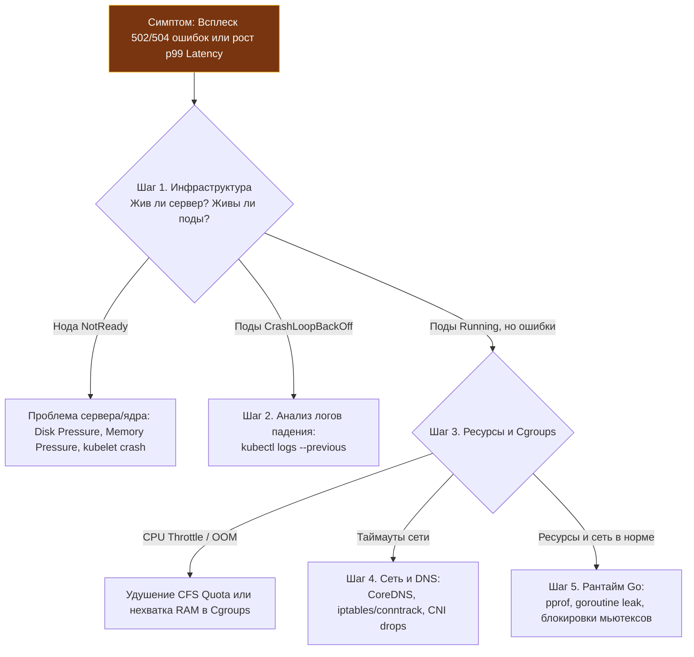

# 6. Траблшутинг продакшена: Методология воронки, OOM Killer, CPU Throttling, Ephemeral Containers и bpftrace в Go

Как бы тщательно мы ни тестировали сервисы в CI/CD, какие бы строгие линтеры ни настраивали и сколько бы канареечных релизов ни проводили, в реальном продакшене рано или поздно наступает кризис. Внезапный всплеск трафика пробивает лимиты, сеть кратковременно теряет пакеты, а в параллельном коде на Go срабатывает редчайшая гонка данных, которую не поймал `-race` на синтетических тестах.

В критический момент аварии (когда дашборды полыхают красным, а в чате инцидентов требуют немедленного ответа) худшее, что может сделать инженер — это поддаться панике и начать лихорадочно менять строчки в коде или случайным образом перезагружать серверы.

Поиск и устранение неисправностей (**Troubleshooting**) в распределенных системах — это не мистическое искусство и не шаманство. Это строгая, хладнокровная научная методология, опирающаяся на глубокое понимание слоев абстракции: от прикладных горутин в Go до сетевого стека ядра Linux и аппаратных контроллеров.

---

## 1. Метод воронки: От симптома к первопричине

Главная ловушка начинающего инженера при возникновении 500-х ошибок — сразу бросаться в IDE и перечитывать код бизнес-логики. В современных облачных системах код — лишь верхушка айсберга. Если под упал из-за переполнения диска на ноде или нехватки файловых дескрипторов, ковыряние в коде отнимет драгоценные часы.

Промышленный стандарт расследования инцидентов — **Метод Воронки (Funnel Triage)**: мы начинаем с самого широкого инфраструктурного уровня и последовательно сужаем область поиска до конкретного системного вызова или строки кода.



Давайте разберем четыре самых коварных инцидента, с которыми сталкивается каждый Go-разработчик в продакшене.

---

## 2. Кейс 1: Убийца OOM (Out of Memory) и ярость SIGKILL

**Симптомы:** Поды вашего Go-сервиса неожиданно исчезают и перезапускаются. На графиках памяти виден плавный рост, резкий обрыв в ноль и новый подъем.

### Диагностика
1. Выполняем команду детального осмотра пода: `kubectl describe pod <name>`. В событиях (Events) внизу ищем `OOMKilled`. В K8s это означает, что процесс превысил лимит памяти, заданный в `resources.limits.memory`.
2. Смотрим логи `kubectl logs --previous`. При OOM Kill процесс умирает от `SIGKILL` (сигнал 9), который нельзя перехватить. Логов от самого приложения не будет — оно убито ядром.

> [!info] Под капотом: Механика OOM Killer в ядре Linux
> Когда вы задаете `limits.memory: 512Mi`, Kubernetes настраивает Cgroup для этого Пода. 
> Если аллокатор памяти Go пытается запросить у ядра хотя бы один дополнительный байт сверх этого лимита, ядро Linux отказывает в выделении и немедленно активирует **OOM Killer**. 
> 
> OOM Killer оценивает «вину» процессов (`oom_score`) и отправляет процессу-нарушителю безапелляционный сигнал **`SIGKILL` (сигнал 9)**. Сигнал `SIGKILL` обрабатывается исключительно ядром: его невозможно перехватить, заблокировать или обработать в коде. Рантайм Go уничтожается мгновенно, не успевая выполнить ни один `defer`, ни одну функцию `slog.Error()`.

### Решение (Go-специфика)
Если приложение действительно требует больше памяти, не спешите просто увеличивать лимит! Возможно, проблема в Garbage Collector.

Исторически сборщик мусора Go (GC) ориентировался на удвоение кучи (`GOGC=100`) и ничего не знал об искусственных ограничениях Cgroups. Он ленился запускать сборку мусора, пока размер кучи не удваивался, и с размаху врезался в потолок лимита контейнера.

Начиная с версии Go 1.19, обязательно задавайте переменную окружения `GOMEMLIMIT`. Установите `GOMEMLIMIT=450MiB` (чуть меньше лимита K8s в 512Mi):
```yaml
env:
- name: GOMEMLIMIT
  value: "450MiB" # Задаем мягкий лимит на 10-15% ниже K8s limits.memory (512Mi)
```
Увидев, что использование кучи приближается к 450 МиБ, рантайм Go проактивно инициирует интенсивные циклы сборки мусора, очищая память и гарантированно удерживая контейнер в безопасной зоне.

---

## 3. Кейс 2: Призрачная задержка (CFS CPU Throttling)

**Симптомы:** Графики среднего потребления процессора (Average CPU) показывают скромные 30–40%. Серверы не перегружены. Но 99-й перцентиль времени отклика (p99 Latency) у клиентов периодически взлетает с нормальных 5 мс до чудовищных 150–200 мс.

### Диагностика
Открываем Prometheus и вычисляем процент троттлинга подов:
```promql
sum(rate(container_cpu_cfs_throttled_periods_total[5m])) by (pod) 
/ 
sum(rate(container_cpu_cfs_periods_total[5m])) by (pod) * 100
```
Если это значение превышает 0% (а порой достигает 30–50%), ваш сервис пал жертвой планировщика CFS (Completely Fair Scheduler).

```mermaid
gantt
    title Иллюзия низкой нагрузки: Как 40% среднего CPU убивают latency
    dateFormat X
    axisFormat %s
    section Квант 100 мс
    Параллельная работа 4 горутин (выжигание квоты) :active, 0, 40
    ЯДРО УСЫПЛЯЕТ GO-ПРОЦЕСС (CFS THROTTLE) :crit, 40, 100
```



> [!warning] Ловушка / Gotcha: Математика CFS Quota
> Вы указали в манифесте `limits.cpu: "1"` (1000 millicores). Kubernetes настраивает квоту ядра: период 100 мс, разрешенное время работы — 100 мс.
> 
> Но в многопоточном рантайме Go работают 4 ядра (`GOMAXPROCS=4`). Если все 4 потока одновременно бросились парсить тяжелый JSON-документ, они потратят разрешенные 100 мс процессорного времени всего за **25 мс физического времени** (25 мс $\times$ 4 потока = 100 мс квоты)!
> 
> На оставшиеся 75 миллисекунд текущего окна ядро Linux **принудительно усыпляет все потоки процесса**. Все горутины замирают, а клиенты ждут ответов. Средний CPU за секунду при этом покажет всего 25% утилизации!

### Решение
Для высоконагруженных бэкендов на Go, чувствительных к Latency, **лучше вообще убрать `cpu limits`**, оставив только `requests`. Планировщик K8s (на основе `requests`) гарантирует процессу минимум CPU, а без `limits` он сможет потреблять свободные такты на ноде (burst) без штрафов. Это стандартная практика для Google и многих крупных компаний.

---

## 4. Кейс 3: Сетевые таймауты и ДНС

**Симптомы:** Go-сервис при межсервисных вызовах периодически выплевывает в логи ошибки `context deadline exceeded` или сетевые сбои `i/o timeout`.

### Диагностика (Уровень ОС)
В соответствии с лучшими практиками безопасности наши Go-образы собираются на базе `distroless` или `scratch` (в них нет ни командного процессора bash, ни утилит `curl`, `ping`, `netstat`). Команда `kubectl exec` беспомощна: внутри контейнера нечего запускать.

Начиная с Kubernetes 1.25, спасением стали **Ephemeral Containers (Эфемерные контейнеры отладки)**:
```bash
kubectl debug -it <failing-pod> --image=busybox --target=<container-name>
```
Эта команда на лету внедряет в работающий под временный отладочный контейнер с утилитами `busybox`. Он разделяет с вашим Go-приложением единое сетевое пространство имен (`Network Namespace`) и таблицу процессов!

Теперь вы можете проверить сетевую доступность от лица самого Go-сервиса:
```bash
# Проверка DNS-резолвинга через CoreDNS
nslookup billing-service

# Проверка TCP-связности
wget -qO- --timeout=2 http://billing-service:8080/healthz

# Трассировка маршрута
traceroute billing-service
```

> [!tip] Вопрос для собеседования: i/o timeout против Dial timeout
> **Вопрос:** Ваш Go-сервис логирует ошибку `i/o timeout` при подключении к базе данных PostgreSQL. Как определить, упала ли сеть между подами или сама база данных перегружена?
> **Ответ:** Обращайте внимание на фазу, в которой возник таймаут:
> 1. **Таймаут на стадии Dial (Handshake timeout):** Ошибка происходит при попытке открыть TCP-сокет. Если пакет `SYN` отправлен, но ответный `SYN-ACK` не возвращается в течение 2–5 секунд, это однозначно сетевая проблема (пакеты отбрасываются из-за переполнения таблицы `conntrack`, сетевые фильтры NetworkPolicy блокируют порт или сбоит оверлейная сеть CNI).
> 2. **Таймаут после установления соединения (Read/Write timeout):** TCP-рукопожатие завершилось успешно (сеть в порядке, ядро ноды БД приняло соединение в системный backlog), но Go-сервис не получает байты ответа на SQL-запрос. Это симптом перегрузки самой СУБД: нехватка соединений в пуле, долгие блокировки таблиц (deadlocks) или тяжелый seq scan.
> 
> Для глубокого анализа сетевых пакетов на ноде запускают утилиту `tcpdump` через привилегированный отладочный контейнер ноды: `kubectl debug node/<node-name> -it --image=nicolaka/netshoot`.

---

## 5. Кейс 4: Утечка горутин (Goroutine Leak) и спасительный SIGQUIT

**Симптомы:** Потребление оперативной памяти сервисом монотонно и непрерывно ползет вверх. Сервис не падает по OOM, но через несколько дней непрерывной работы начинает потреблять гигабайты памяти. Метрика `go_goroutines` демонстрирует непрерывную восходящую прямую.

### Диагностика (Уровень Go)
В коде образовалась утечка горутин — потоки запустились, но зависли в ожидании ответа из небуферизованного канала, в который никто никогда ничего не запишет, или на HTTP-вызове без настроенного контекста `context.WithTimeout`.

Для спасения системы нам необходим полный дамп стеков горутин.

#### Вариант А: Стандартный pprof
Если внутри пода открыт порт профайлера:
```bash
kubectl port-forward <pod-name> 6060:6060
curl http://localhost:6060/debug/pprof/goroutine?debug=2 > goroutines.txt
```
В файле `goroutines.txt` вы увидите список всех горутин, сгруппированных по строке кода, на которой они заблокированы.

#### Вариант Б: Экстренный дамп через SIGQUIT в боевом проде
В жестких корпоративных средах порт 6060 закрыт политиками сетевой безопасности, а pprof вырезан из бинарника. Как заглянуть в память процесса?

На помощь приходит системный сигнал ядра **`SIGQUIT` (сигнал 3)**!
```bash
kubectl exec <pod-name> -- kill -SIGQUIT 1
```
По умолчанию среда исполнения Go перехватывает сигнал `SIGQUIT` и выполняет экстренное аварийное действие: **выводит полные стектрейсы абсолютно всех активных горутин в поток `stderr`**!

Открываем логи:
```bash
kubectl logs <pod-name>
```
И перед нами раскрывается исчерпывающая анатомия утечки:
```text
goroutine 4512 [chan receive, 48 hours]:
main.worker(0xc0000a4000)
    /app/worker.go:42 +0x3a
```
Вы сразу видите: 4 500 горутин уже двое суток ждут чтения из канала в файле `worker.go` на строке 42!

> [!warning] Ловушка / Gotcha: Побочный эффект SIGQUIT
> Помните: по стандарту POSIX сигнал `SIGQUIT` после генерации дампа аварийно **завершает процесс**! Используйте этот метод только тогда, когда вы готовы к мгновенному перезапуску пода (убедитесь, что в манифесте задан параметр `restartPolicy: Always`). Для безопасного съема профилей на лету без падения процесса подключайте пакет `runtime/pprof` к служебным эндпоинтам приложения.

---

## 6. eBPF и bpftrace: Хирургическая точность на уровне ядра

Иногда случаются аномалии, перед которыми пасуют и логи, и внутренние профилировщики Go. Например: прикладной код отрабатывает мгновенно, но периодически системный вызов открытия файла или сокета `openat` зависает на 50 миллисекунд. Традиционный `strace` в продакшене использовать смертельно опасно: он перехватывает контекст каждого вызова через `ptrace`, замедляя приложение в 10–50 раз.

Современный золотой стандарт низкоуровневого траблшутинга — технология **eBPF** и консольный трассировщик **`bpftrace`**.

```mermaid
flowchart LR
    classDef process  fill:#1e293b,stroke:#38bdf8,stroke-width:1px,color:#f8fafc
    classDef success  fill:#064e3b,stroke:#34d399,stroke-width:1px,color:#f8fafc
    classDef error    fill:#7f1d1d,stroke:#f87171,stroke-width:1px,color:#f8fafc
    classDef warning  fill:#78350f,stroke:#fbbf24,stroke-width:1px,color:#f8fafc
    classDef entry    fill:#1e3a5f,stroke:#38bdf8,stroke-width:2px,color:#f8fafc
    classDef aux      fill:#334155,stroke:#64748b,stroke-width:1px,color:#f8fafc
    classDef system   fill:#312e81,stroke:#a78bfa,stroke-width:1px,color:#f8fafc
    classDef data     fill:#132d29,stroke:#2dd4bf,stroke-width:1px,color:#f8fafc
    classDef network  fill:#881337,stroke:#fb7185,stroke-width:1px,color:#f8fafc
    classDef accent   fill:#1e1b4b,stroke:#818cf8,stroke-width:1px,color:#f8fafc
    BPF["bpftrace Script\n(Kernel Space):::system"] -->|"Attach probe"| Trace["tracepoint:syscalls:sys_enter_openat"]
    Trace -->|"Безопасное измерение времени в ядре (наносекунды)"| Map[("eBPF BPF-Map\n(Гистограмма latency)")]
    Map --> Output["Вывод гистограммы задержек в консоль инженера"]
```



Скрипт `bpftrace` компилируется в безопасный байткод eBPF, загружается в ядро Linux и с наносекундной точностью замеряет задержки дискового ввода-вывода конкретного Go-процесса:

```c
tracepoint:syscalls:sys_enter_openat { @start[tid] = nsecs; }
tracepoint:syscalls:sys_exit_openat /@start[tid]/ {
    @ns[pid, comm] = hist(nsecs - @start[tid]);
    delete(@start[tid]);
}
```

Вы мгновенно увидите гистограмму распределения времени: если основная масса файлов открывается за 2 микросекунды, но 1% операций виснет на 80 мс — проблема локализована: аппаратный сбой или деградация дискового массива EBS в облаке AWS, а не ошибка в Go-коде.

---

## Резюме

1. **Метод воронки:** Расследуйте инциденты поэтапно: Физический сервер -> Поды (`CrashLoopBackOff`) -> Ресурсы Cgroups -> Сеть и DNS -> Рантайм Go.
2. **OOM Killer (`SIGKILL`):** Убивает процесс без логов и без выполнения `defer`. Для предотвращения задавайте мягкий лимит кучи `GOMEMLIMIT` на 10–15% ниже лимита контейнера.
3. **CFS CPU Throttling:** Жесткие квоты CPU усыпляют многопоточные сервисы на десятки миллисекунд, взвинчивая p99 Latency. Избегайте директивы `limits.cpu` в критических Go-бэкендах.
4. **Ephemeral Containers:** Команда `kubectl debug` с образом `busybox` позволяет дебажить сеть и DNS в защищенных контейнерах без шелла.
5. **Диагностика Dial vs Read Timeout:** Таймаут на фазе `Dial` — это отвал сети/файрвола. Таймаут на фазе `Read` — симптом перегрузки базы данных.
6. **Сигнал `SIGQUIT`:** Мгновенный способ получить дамп всех горутин в `stderr` при поиске Goroutine Leaks в проде.
7. **eBPF / bpftrace:** Позволяет проводить глубокий аудит системных вызовов ядра без накладных расходов.

Мы изучили архитектуру операционной системы, сетевой фабрики, контейнеризации и методы спасения систем под огнем. В финальной главе нашего инфраструктурного эпоса мы обобщим все полученные знания в сводный инженерный манифест надежности: [[7. Итоги раздела. Production окружение]].