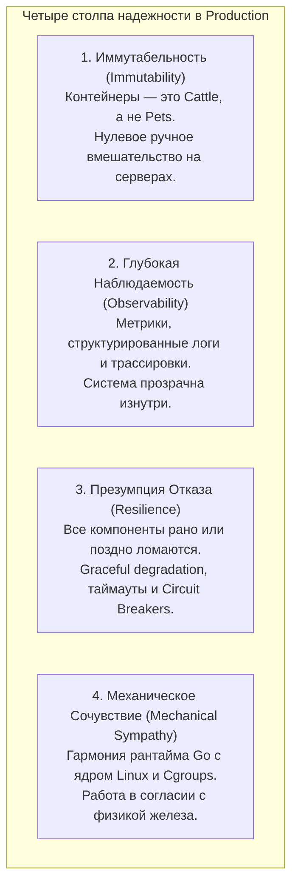
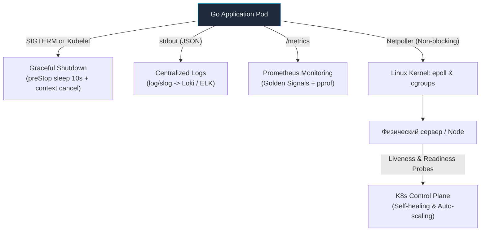

# 7. Итоги раздела: Архитектурный манифест Production-окружения для Go-инженера

Мы преодолели грандиозный путь: от физических транзисторов кремниевого кристалла, прерываний процессора и системных вызовов ядра Linux до сборки многослойных Docker-образов, L7-маршрутизации в Ingress, оркестрации кластеров Kubernetes и хладнокровного траблшутинга аварий в продакшене.

Этот масштабный модуль был посвящен среде обитания, в которой рождается, живет, масштабируется и умирает ваш Go-код.

В современной инженерной культуре разделение на «я просто пишу код на Go» и «пусть DevOps настраивает серверы» безнадежно устарело. Для инженера уровня Senior или Staff/Principal инфраструктура — это не чужая территория за забором. Это прямое физическое продолжение вашего программного кода. 

Вы не можете проектировать высоконагруженные сетевые сервисы, не понимая, как сетевой полиллер Go (`netpoller`) взаимодействует с системным вызовом `epoll` ядра Linux. Вы не можете гарантировать соблюдение SLA по задержкам, не зная, почему безобидный параметр `cpu limits` в манифесте Kubernetes способен принудительно заморозить все горутины вашего сервиса на 50 миллисекунд.

Давайте обобщим пройденный материал и сформулируем фундаментальные инженерные принципы построения отказоустойчивых Production-Ready систем на языке Go.

---

## 1. Четыре столпа надежности Production-Ready систем

Любая распределенная система, способная выдерживать миллионы запросов и не будить дежурную команду по ночам, опирается на четыре незыблемых архитектурных столпа:

### 1. Иммутабельность (Immutability): Cattle, not Pets
Серверы, виртуальные машины и контейнеры — это не любимые домашние питомцы (**Pets**), которым дают ласковые имена и лечат индивидуально. Это взаимозаменяемое поголовье на ферме (**Cattle**).

Если в работающем контейнере обнаружен баг, критическая уязвимость безопасности или утечка памяти, в промышленной среде действует **строжайший запрет на вход по SSH** с целью ручного редактирования файлов или перезапуска демонов!
Любое исправление — это:
1. Коммит в репозиторий.
2. Прогон полного цикла тестов и линтеров в CI.
3. Сборка нового неизменяемого Docker-образа.
4. Автоматизированная раскатка нового пода через GitOps (ArgoCD).

Язык Go с его статической компоновкой и отсутствием внешних динамических зависимостей идеально воплощает эту парадигму: скомпилированный бинарник — это и есть законченный, самодостаточный, неизменяемый артефакт.

### 2. Наблюдаемость (Observability): Прозрачность сквозь слои
Как мы досконально разобрали в главах [[4. Мониторинг инфраструктуры]] и [[5. Логи инфраструктуры]], распределенный микросервисный кластер принципиально невозможно отлаживать примитивными вызовами `println`. 

Продакшен-система обязана транслировать свое внутреннее состояние наружу через триединую телеметрию:
* **Метрики (Prometheus):** Непрерывный пульс системы — RPS входящего трафика, перцентили p95/p99 Latency, уровень насыщения процессора и счетчик активных горутин `go_goroutines`.
* **Логи (Grafana Loki / ELK):** Детальный контекст инцидентов — строго структурированный JSON через библиотеку `log/slog` с обязательной фиксацией идентификаторов пользователей и трассировок.
* **Трассировки (OpenTelemetry / Jaeger):** Полный сквозной путь отдельного HTTP/gRPC запроса через десятки микросервисов и баз данных.

> [!warning] Ловушка / Gotcha: Смерть синдрома «У меня локально всё работает»
> В эпоху оркестрации контейнеров фраза «У меня на ноутбуке всё работало» считается верхом непрофессионализма. Если бинарник падает в кластере, причина всегда кроется в тонкостях окружения:
> * Контейнер превысил лимиты Cgroups и был уничтожен системным `OOM Kill`.
> * Ядро Linux задушило процесс через `CFS Throttling`.
> * В минималистичном образе `distroless` забыли примонтировать доверенные корневые CA-сертификаты, и HTTPS-запросы завершаются ошибкой `x509: certificate signed by unknown authority`.
> * Резолвер Go наткнулся на задержки из-за директивы `ndots:5` в DNS.

### 3. Отказоустойчивость (Resilience): Проектирование под сбои
В реальном мире любая инфраструктура враждебна. Сетевые коммутаторы теряют пакеты, каналы связи моргают, базы данных кратковременно деградируют под наплывом аналитических отчетов, а физические серверы неожиданно обесточиваются.

Отказоустойчивая архитектура исходит из **презумпции гарантированного отказа любого компонента**:
* **На уровне Kubernetes:** Зонды `readinessProbe` и `livenessProbe` защищают от направления трафика на зависшие поды, а `RestartPolicy: Always` обеспечивает мгновенное самоисцеление упавших процессов.
* **На уровне сетевого взаимодействия:** Использование предохранителей (**Circuit Breakers**), предотвращающих лавинообразное выжигание ресурсов при падении нижележащих бэкендов, и обязательная передача контекста с жесткими таймаутами (`context.WithTimeout`) на абсолютно каждый внешний сетевой вызов.
* **На уровне деплоя:** Корректный **Graceful Shutdown** — перехват системного сигнала `SIGTERM`, искусственная задержка `preStop: sleep 10` для синхронизации сетевых таблиц `iptables` и плавный сброс активных соединений через вызов `server.Shutdown()`.

### 4. Mechanical Sympathy: Симбиоз Go и операционной системы
Ключевой вывод, красной нитью проходящий сквозь все 31 лекцию нашего модуля: **высокоуровневые программные абстракции не существуют в вакууме — они опираются на законы физики и архитектуру ОС**.

* Понимание примитивов синхронизации `sync.Mutex` в Go неполно без знания о том, как рантайм использует быстрые пользовательские мьютексы `futex` в ядре Linux, избегая переключения контекста при отсутствии конкуренции.
* Управление кучей сборщика мусора Go через флаг `GOMEMLIMIT` бессмысленно без осознания того, как подсистема Cgroups считает `working_set_bytes` и в какой момент системный OOM Killer ядра Linux отправляет процессу безжалостный сигнал `SIGKILL`.
* Написание высокоскоростных сетевых серверов на Go опирается на знание того, как внутренний `netpoller` прячет мультиплексирование дескрипторов через системный вызов `epoll` за спинами тысяч легковесных горутин.

> [!info] Под капотом: Истинное сочувствие к машине
> Промышленный код — это код, который живет в гармонии с операционной системой. Задавая лимит `GOMEMLIMIT`, инженер не просто ставит флаг: он помогает планировщику сборщика мусора координировать свои действия с лимитами ядра Linux, предотвращая внезапную смерть сервиса. В этом и заключается суть концепции Mechanical Sympathy.

---

## 2. Эволюция мышления инженера

Разница в квалификации инженера заключается не в количестве выученных библиотек, а в масштабе и глубине мышления:

* **Инженер начального уровня (Junior/Middle):** Фокусируется на синтаксисе и локальной логике: *«Как написать цикл, смапить JSON и вернуть HTTP 200»*.
* **Зрелый архитектор (Senior/Lead/Staff):** Мыслит категориями надежности распределенной среды: *«Как эта система поведет себя при отказе сети? Сколько тактов CPU сожжет сериализация? Не вызовет ли деплой всплеск 502 ошибок? Как локализовать баг в 3 часа ночи по графикам метрик?»*.

Современный промышленный сервис на Go, спроектированный зрелым инженером — это процесс, который:
1. Компилируется в микроскопический, кристально чистый образ на базе **`scratch`** без внешних зависимостей и без CGO.
2. Запускается в Kubernetes под непривилегированным пользователем (Non-root) с доступной только на чтение корневой файловой системой (`readOnlyRootFilesystem: true`).
3. Безупречно обрабатывает сигналы операционной системы (`SIGTERM`), обеспечивая скользящее обновление с нулевым даунтаймом.
4. Раскрывает наружу детальные метрики рантайма (`collectors.NewGoCollector()`) и структурированные JSON-логи для автоматического мониторинга.
5. Изящно деградирует (Graceful Degradation) при пиковых перегрузках, защищая инфраструктуру от каскадного обрушения.

---

## Итог и мост в будущее

Инфраструктура — это не безликий фон и не чужая забота. Это фундамент, на котором возводится вся архитектура современного программного обеспечения. Глубокое понимание этого фундамента превращает программиста в настоящего системного инженера — специалиста, способного создавать сервисы бескомпромиссной надежности, которым доверяют миллионы пользователей.

На этом мы ставим победную точку в исследовании физического железа, архитектуры ядра Linux, веб-серверов и распределенной оркестрации контейнеров. 

Наш инфраструктурный вычислительный контур полностью развернут, масштабирован и защищен. Однако бэкенд не исчерпывается лишь исполняемым машинным кодом — его истинная ценность заключается в **данных**. 

В следующих главах нашей энциклопедии мы шагнем на территорию персистентности: погрузимся в устройство реляционных и распределенных баз данных, внутренние структуры дисковых B-деревьев и LSM-деревьев, изоляцию транзакций ACID и математику распределенного консенсуса. До встречи в мире надежного хранения данных!