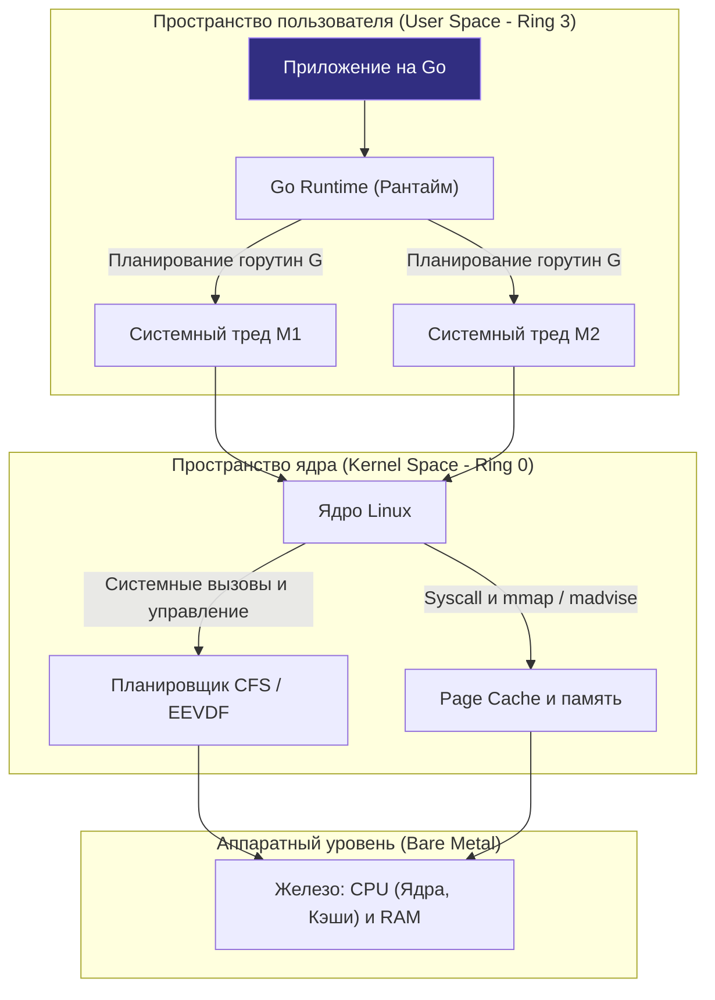

Если вы переходите на Go с таких языков, как PHP, Java, C# или Python, первое, что вас поразит и, возможно, обескуражит, — это полное отсутствие спасительной «магии». 

В мире Java есть тяжелая виртуальная машина JVM со сложнейшим JIT-компилятором и десятками флагов тюнинга скрытых пулов потоков. В Python есть интерпретатор с глобальной блокировкой GIL. В PHP жизненный цикл запроса изолирован моделью Shared-Nothing, скрывающей саму концепцию многопоточности. 

В Go ничего этого нет. Go — это современный C XXI века с чистым синтаксисом высокого уровня, сборщиком мусора и первоклассной встроенной конкурентностью. Скомпилированная программа на Go — это монолитный статический исполняемый файл формата ELF, который операционная система запускает непосредственно на физическом процессоре. Go дает инженеру беспрецедентный контроль над ресурсами машины, но взамен требует глубокого и бескомпромиссного понимания того, что происходит под капотом операционной системы.

Этот раздел нашей энциклопедии посвящен операционной системе не как скучному академическому пособию по системному администрированию, а как **фундаментальной инженерной платформе для высоконагруженного бэкенда на Go**. Мы разберем, как рантайм Go сотрудничает с ядром Linux, как распределяются кванты времени процессора, где возникают скрытые заторы ввода-вывода и почему системное понимание ОС — это главный водораздел между рядовым разработчиком и ведущим инженером (Senior / Staff / Lead).

---

### ОС как слой абстракции и диспетчер ресурсов

Современная операционная система (и в первую очередь Linux, ставший де-факто мировым стандартом серверного бэкенда) решает одну критическую задачу: **справедливое и безопасное мультиплексирование ограниченных физических ресурсов оборудования между сотнями независимых, изолированных и потенциально сбойных процессов**.

Вспомним физический мир, который мы изучили в первом разделе:
- Количество физических ядер CPU строго фиксировано;
- Память подчинена жесткой пирамиде задержек (регистры $\to$ L1/L2/L3 кэши $\to$ DRAM $\to$ NVMe SSD/HDD);
- Сетевые интерфейсы и дисковые контроллеры обладают конечной полосой пропускания и ненулевым временем отклика (latency).

Операционная система скрывает колоссальную сложность аппаратуры за элегантными программными абстракциями:
1. **Процессы и Потоки (Processes & Threads)** — изолированные контексты исполнения для изоляции сбоев и параллельных вычислений.
2. **Виртуальная память (Virtual Memory)** — иллюзия для каждого процесса, будто он является единственным и полновластным хозяином терабайтного адресного пространства RAM.
3. **Виртуальная файловая система (VFS)** — великий унифицированный интерфейс Unix: файлы, сетевые сокеты, межпроцессные каналы (пайпы) и устройства представлены единой абстракцией файловых дескрипторов.
4. **Системные вызовы (Syscalls)** — строго контролируемый аппаратный мост между непривилегированным кодом пользователя (`User Space`) и всемогущим ядром (`Kernel Space`).

> [!info] Под капотом
> Рантайм Go не пытается изолироваться от операционной системы или строить над ней собственный виртуальный мир. Он тесно интегрируется с ядром Linux. Когда вы запускаете бинарник, ядро через системный вызов `execve` выделяет виртуальную память, настраивает стек процесса и передает управление точке входа `_rt0_amd64_linux`.  
> В этот момент рантайм Go инициализирует фундаментальные структуры: считывает системную переменную `GOMAXPROCS`, создает логические процессоры `P`, поднимает системные треды ядра `M`, аллоцирует пул горутин `G` и инициализирует сетевой поллер `netpoller`. Все они работают в пространстве пользователя, но их жизнь ежесекундно синхронизирована с системными вызовами ядра Linux.

---

### Механическое сопереживание (Mechanical Sympathy) в Go

Концепция **Mechanical Sympathy** в контексте операционной системы означает способность разработчика видеть, в какие системные вызовы ядра и аппаратные прерывания превращается казалось бы невинная строчка кода на Go.

Язык Go построен на тонких инженерных компромиссах между выразительностью и производительностью:

| Абстракция Go | Что под капотом (OS / Hardware) | Влияние на производительность |
|---|---|---|
| `goroutine` | Легковесный пользовательский поток управления (корутина со стеком от 2 КБ), мультиплексируемый на `M` (системный тред ОС) | Переключение контекста между `M` в ядре ОС стоит ~1000–2000 тактов CPU. Для минимизации драк за ядра параметр `GOMAXPROCS` должен быть согласован с доступными ядрами CPU. |
| `channel` | Структура данных `hchan` (кольцевой буфер + мьютекс ожидания) + `netpoller` (epoll/kqueue) + атомарные операции рантайма | Небуферизованный канал (размер 0) работает через прямую передачу и переключение горутин. Буферизованный канал использует кольцевой буфер в памяти процесса и системные примитивы синхронизации. |
| `gc` (Garbage Collector) | Конкурентный трехцветный сборщик мусора, триггеры аллокатора `mheap`, взаимодействие с системными вызовами `brk` и `mmap`, оптимизация через `madvise` | GC в Go конкурентный, но выделение страниц опирается на физическую RAM ядра. Настройки `GOGC` и мягкий лимит `GOMEMLIMIT` напрямую управляют частотой пауз и хвостовыми задержками (tail-latency). |
| `net/http` сервер | Сетевой поллер `netpoller` поверх `epoll` (Linux) / `kqueue` (BSD) + флаг сокета `SO_REUSEPORT` | Неблокирующий ввод-вывод (`O_NONBLOCK`) позволяет одному системному потоку обслуживать десятки тысяч одновременных соединений без создания тяжелых пулов потоков ОС. |

> [!tip] Собеседование
> **Вопрос:** Почему в высоконагруженном Go-приложении нельзя просто взять и выставить `GOMAXPROCS = 1024` в надежде получить тысячекратный параллелизм?
> **Ответ:** Переменная `GOMAXPROCS` управляет количеством активных логических процессоров `P`, за каждым из которых закрепляется настоящий системный поток ядра операционной системы `M`, а не легковесные горутины.  
> Если мы выставим `GOMAXPROCS > N_CPU` (где `N_CPU` — число физических ядер машины), в операционной системе начнется тяжелая пробуксовка (**thrashing**). Планировщик ядра Linux будет вынужден непрерывно вытеснять одни потоки `M` и загружать другие. Процессор потратит львиную долю тактов на переключение контекста (`Context Switch`), сбросы конвейера и инвалидацию кэш-линий CPU вместо полезной работы. Планировщик Go лишь запрашивает у ядра исполнение своих `M`, а физическим распределением квантов времени безраздельно командует планировщик ОС.

---

### Сравнение с другими языками и почему это важно

В отличие от классической Java, где каждый поток долгое время был тяжелым потоком операционной системы со стеком по умолчанию в 1 МБ, или PHP, где каждый входящий HTTP-запрос традиционно обрабатывается отдельным изолированным процессом (PHP-FPM), Go использует легковесные кооперативно-вытесняющие горутины. 

Это дает фантастическую плотность (сотни тысяч конкурентных задач в одном процессе), но переносит ответственность за понимание системных компромиссов непосредственно на плечи инженера.

Глубокое понимание операционной системы необходимо бэкендеру по четырем ключевым причинам:

1. **Диагностика и расследование аварий (Root Cause Analysis)**:  
   Системные сигналы падения `SIGSEGV` (обращение по невалидному адресу памяти) и `SIGPIPE` (запись в закрытый сокет), неконтролируемые утечки горутин (`goroutine leak`) и виртуальной памяти — всё это невозможно распутать без понимания того, как рантайм запрашивает память через системный вызов `mmap`, что такое аппаратный `Page Fault` и как ядро убивает процессы через механизм `OOM Killer`.
2. **Оптимизация хвостовых задержек (Tail Latency)**:  
   В высоконагруженных распределенных системах микросекунды определяют успех бизнеса. Грамотное использование системного селектора `epoll`, исключение лишнего копирования через `Zero Copy` (`sendfile`), управление сродством процессоров (`CPU Affinity`) и учет топологии `NUMA` позволяют писать код, который бережно относится к процессорным кэшам и не захлебывается в очередях ввода-вывода.
3. **Cloud-Native и контейнерная среда**:  
   Go — родной язык современной облачной инфраструктуры (Docker, Kubernetes, containerd написаны на Go). Механизмы контрольных групп `cgroups v2`, пространства имен `namespaces` и трассировка ядра `eBPF` — это фундаментальные кирпичи, из которых строятся изоляция, лимитирование ресурсов и мониторинг микросервисов в облаке. Без этих знаний невозможно спроектировать по-настоящему надежную контейнерную систему.
4. **Информационная безопасность (AppSec)**:  
   Четкое разграничение привилегий `user space` и `kernel space`, механизм гранулярных прав `capabilities`, политики безопасности `SELinux`/`AppArmor` и системные лимиты дескрипторов `ulimit` — это первая и главная линия обороны ваших API от атак на отказ в обслуживании (DoS) и атак с повышением привилегий.

---

### Дорожная карта раздела

Мы построили изучение операционной системы как строгое, последовательное инженерное восхождение — от момента включения питания сервера до передовых технологий контейнеризации и eBPF:

1. **Фундамент и старт ядра (Лекции 1–11):** Как рождается операционная система, инициализация `BIOS/UEFI`, первичный загрузчик `bootloader`, старт ядра Linux, архитектуры ядер (монолитные vs микроядра), жизненный цикл процессов, системные вызовы `fork/exec`, потоки, планировщики ядра (`CFS` и современный `EEVDF`), цена переключения контекста и приоритеты `nice`.
2. **Управление памятью и адресация (Лекции 12–21):** Виртуальная память процесса, таблицы страниц, кэш `TLB`, анатомия работы `malloc` под капотом (аллокаторы `ptmalloc`, `jemalloc`, `tcmalloc` и связь с `mcache` в Go), механизм `Copy-On-Write (COW)`, подкачка `Paging` и `Swapping`, системный вызов `mmap`, сегменты памяти (`Stack`, `Heap`, `Data`, `Text`) и аппаратная защита от переполнения стека.
3. **Системные вызовы, файлы и синхронизация (Лекции 22–34):** Врата ядра через системные вызовы, диагностика через `strace`/`ltrace`, философия «всё есть файл», файловые дескрипторы, каналы `Pipe` и `Named Pipe`, сетевые Unix Domain Sockets, демонизация процессов, менеджер `systemd`, механизмы IPC, разделяемая память `Shared Memory`, ядровые примитивы `futex`, примитивы `mutex/semaphore` на уровне ядра и анатомия блокировок (`Deadlock`, `Livelock`, `Starvation`).
4. **Ввод-вывод, сети и файловые системы (Лекции 35–51):** Блокирующий и асинхронный ввод-вывод, эволюция мультиплексирования от `select` и `poll` к `epoll`, `kqueue` и `IOCP`, архитектура сетевого поллера Go (`netpoller`), анатомия записи на диск, структуры `inode`, `dentry`, `superblock`, журналирование в ext4/xfs, системный `Page Cache`, прямой доступ `Direct IO` и `Zero Copy`, RAID и LVM, жизненный цикл TCP-сокета, очереди `SYN Queue` и `Accept Queue`, состояния `TIME_WAIT` и тонкости DNS на уровне ОС.
5. **Изоляция, безопасность, eBPF и интеграция с Go (Лекции 52–63):** Лимиты `ulimit`, контрольные группы `cgroups v2`, пространства имен `namespaces`, магия контейнеризации, гипервизоры и виртуальные машины, дискреционные права доступа, `capabilities`, профили `SELinux` и `AppArmor`, анализ дампов памяти `Core Dump`, инструменты профилирования `perf`, `top`, `vmstat`, `iostat`, революция `eBPF`, глубокое взаимодействие рантайма Go (компонентов `runtime`, `gc`, `scheduler` и `netpoller`) с ядром Linux и итоговый системный синтез.

> [!warning] Ловушка / Gotcha
> Никогда не путайте логическую многозадачность (конкурентность горутин) с физическим параллелизмом (исполнением на ядрах CPU)!  
> Рантайм Go позволяет легко породить миллион горутин, но в каждый конкретный физический такт времени на машине могут одновременно исполняться ровно столько горутин, сколько потоков `M` запланировано ядром ОС на доступных процессорных ядрах (`GOMAXPROCS`). Все остальные горутины мирно спят в очередях планировщика или припаркованы в системном поллере `netpoller`. Понимание этой фундаментальной границы — ключ к созданию высоконагруженных систем без скрытых заторов.

---

### Итог

Операционная система — это не враг и не темный лабиринт абстракций. Это мудрый, надежный партнер вашего Go-сервиса. Понимая правила, по которым ядро распределяет память, планирует потоки и обрабатывает сетевые события, вы научитесь писать код, который работает в идеальном согласии с операционной системой.

Готовы сделать первый шаг и увидеть границу между двумя мирами? 

Переходим к базовым архитектурным определениям ядра и разделению привилегий: [[2. Что такое операционная система. Ядро, user space и kernel space]].