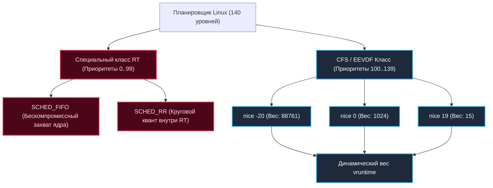

## Зачем бэкендеру понимать приоритеты процессов

> *«Грамотно спроектированная система при перегрузке деградирует плавно и достойно. Плохо спроектированная — попросту рушится под тяжестью собственных амбиций».*    
> — Принцип устойчивости распределенных систем

В реальном мире ресурсы любого сервера конечны: такты процессора, пропускная способность шины памяти и объемы кэшей L1/L2 имеют физические пределы. Когда десятки микросервисов, фоновые воркеры сжатия логов, сборщики метрик и демоны резервного копирования сходятся в схватке за ядра CPU, операционная система обязана выступать беспристрастным судьей.

Представьте себе международный аэропорт с одной взлетно-посадочной полосой. 
Большинство рейсов — это регулярные пассажирские и грузовые самолеты (обычные процессы CFS). Они подчиняются правилам взаимной вежливости: если один лайнер задержался, другой получает полосу чуть раньше. Именно отсюда происходит историческое название утилиты Unix — `nice` («быть вежливым»). Процесс с высоким значением `nice` вежливо говорит соседям: *«Пожалуйста, проходите вперед, мое фоновое сжатие логов подождет»*.

Но вдруг на горизонте появляется санитарный борт санавиации с экстренным пациентом (Real-Time процесс). Диспетчер немедленно приказывает всем остальным лайнерам зайти на второй круг и удерживать высоту. Пока экстренный борт не освободит полосу, ни один пассажирский самолет не сдвинется с места. А что произойдет, если пилот санитарного вертолета заглушит двигатель прямо посреди полосы? Весь аэропорт будет парализован.

Понимание модели приоритетов в Linux критично для бэкенд-инженера по четырем причинам:
- **Гарантирование низкой задержки (Latency SLA):** Сервисы, отвечающие пользователю (API Gateways), не должны простаивать из-за фонового парсинга аналитики.
- **Предотвращение starvation (голодания):** Защита критических рабочих очередей от полного исчерпания ресурсов.
- **Правильная настройка контейнеров:** Управление квотами в Kubernetes (QoS classes, cgroups, CPU isolation).
- **Диагностика аномалий:** Понимание ситуаций, когда утилита `top` показывает 100% CPU, но приложение не отвечает на запросы из-за того, что процессор монополизирован сторонней задачей.

---

## Модель приоритетов в Linux: nice vs Real-Time

В ядре Linux существует строгая иерархия из **140 уровней приоритета** (от 0 до 139). Все планируемые задачи разделены на два фундаментально непересекающихся пространства:

```
            ОБЩАЯ ШКАЛА ПРИОРИТЕТОВ ЯДРА LINUX (0 .. 139)
 ┌─────────────────────────────────────────────────────────────┐
 │ 0                     99 │ 100                          139 │
 │    REAL-TIME (RT)        │         NORMAL / FAIR (CFS)      │
 │  SCHED_FIFO / SCHED_RR   │         nice: -20 ... +19        │
 └──────────────────────────┴──────────────────────────────────┘
  ▲ Высший приоритет          ▲ Базовый nice=0 (120)  Низший ▲
```

1. **Обычные процессы (CFS — Completely Fair Scheduler / EEVDF):**
   - Внутренние приоритеты ядра: от **100** до **139**.
   - Пользовательский диапазон `nice`: от **`-20`** (наивысший приоритет в классе обычных задач) до **`19`** (минимальный приоритет, максимальная «вежливость»).
   - Значение по умолчанию для новых процессов: `nice = 0` (в ядре соответствует приоритету 120).
   - Планировщик CFS не выделяет процессам фиксированные миллисекунды. Он рассчитывает виртуальное время `vruntime` на основе веса задачи (`load.weight`). Чем выше `nice` (ниже приоритет), тем быстрее растет `vruntime`, и тем чаще планировщик переключается на другие процессы.
   - Приоритеты в классе CFS **относительны**: они определяют долю процессорного пирога при конкуренции, но если система свободна, процесс с `nice = 19` утилизирует все 100% ядра CPU без искусственных ограничений.

2. **Процессы реального времени (Real-Time, RT):**
   - Диапазон приоритетов: от **`1`** (минимальный RT) до **`99`** (максимальный RT). Внутри ядра они занимают уровни с 0 по 99.
   - **Абсолютное доминирование:** Любой RT-процесс с приоритетом даже 1 ВСЕГДА вытесняет любой обычный CFS-процесс (даже с `nice = -20`).
   - Основные политики планирования RT:
     - `SCHED_FIFO` (First-In, First-Out): Процесс захватывает ядро CPU и исполняется до тех пор, пока сам не заблокируется на I/O, не уступит процессор через `sched_yield` или пока не появится более высокоприоритетный RT-процесс.
     - `SCHED_RR` (Round Robin): Аналогичен FIFO, но задачам с одинаковым приоритетом выделяется фиксированный круговой квант времени (timeslice).



> [!warning] Ловушка / Gotcha: Несовместимость пространств
> Нельзя смешивать эти пространства! Механизм `nice` не работает для RT-процессов. 
> Если вы попытаетесь установить `nice = -10` для процесса с политикой `SCHED_FIFO`, ядро Linux просто проигнорирует команду или вернет системную ошибку `EINVAL`. Назначение RT-политик требует специальных системных вызовов (`sched_setscheduler`) и прав суперпользователя (`CAP_SYS_NICE`).

---

## Под капотом: Как ядро хранит приоритеты

В ядре Linux каждый исполняемый поток представлен дескриптором `task_struct`. Внутри него находятся ключевые поля, определяющие политику планирования:

- `static_prio`: Базовый приоритет процесса, заданный при создании или измененный через системные вызовы `nice` / `renice` или `sched_setscheduler`. Для обычных задач вычисляется по формуле: $static\_prio = 120 + nice$.
- `prio`: Текущий эффективный приоритет задачи. Именно его проверяет планировщик `schedule()`. Ядро может динамически повышать его во избежание взаимных блокировок (например, при наследовании приоритетов PI-futex).
- `rt_priority`: Число от 1 до 99 для задач классов `SCHED_FIFO` и `SCHED_RR`.
- `sched_entity`: Суб-структура внутри `task_struct`, хранящая метрики `vruntime` и `load.weight` для CFS-дерева.

Для планирования задач реального времени ядро использует выделенную очередь `rt_rq`. Алгоритм планировщика тривиален и безжалостен: перед тем как взглянуть на красно-черное дерево CFS, ядро **всегда проверяет очередь `rt_rq`**. Если в ней есть хотя бы один готовый поток, ни один CFS-процесс в системе не получит ни одного такта CPU!

### Как изменить приоритет в Go на практике

В стандартной библиотеке Go нет несуществующего метода `debug.SetPriority` (иногда ошибочно упоминаемого начинающими). Настройка приоритетов в Go осуществляется через прямой системный вызов ядра `syscall.Setpriority` или пакет `golang.org/x/sys/unix`:

```go
package main

import (
	"fmt"
	"os"
	"syscall"
)

func setProcessNice(priority int) error {
	// syscall.PRIO_PROCESS: меняем приоритет процесса
	// 0: для текущего PID
	// priority: значение от -20 (максимум) до 19 (минимум)
	// Для установки отрицательных значений nice требуются права root или CAP_SYS_NICE
	err := syscall.Setpriority(syscall.PRIO_PROCESS, 0, priority)
	if err != nil {
		return fmt.Errorf("ошибка вызова setpriority: %w", err)
	}
	return nil
}

func main() {
	// Понижаем приоритет фонового воркера до nice = 10
	if err := setProcessNice(10); err != nil {
		fmt.Fprintf(os.Stderr, "Не удалось установить приоритет: %v
", err)
		os.Exit(1)
	}
	fmt.Println("Приоритет процесса успешно обновлен через syscall.Setpriority")
}
```

---

## Go-рантайм и приоритеты: Важные нюансы

Здесь кроется фундаментальная архитектурная граница, о которой обязан помнить каждый бэкенд-разработчик: **планировщик Go (`runtime.schedule`, `runtime.gosched`) и планировщик ОС Linux работают на совершенно разных уровнях абстракции!**

1. **Горутины не имеют приоритетов:**  
   В рантайме Go все горутины (`G`) абсолютно равноправны. Не существует способа вызвать условный `go with_priority(1)`. Все горутины попадают в локальные и глобальные очереди процессоров `P`, а системные потоки `M` забирают их по алгоритму Work-Stealing.
2. **Приоритет применяется к потоку ОС (`M`), а не к горутине (`G`):**  
   Когда вы меняете nice-значение через системный вызов (в отличие от гипотетических функций вроде `debug.SetPriority`), вы меняете приоритет системного треда Linux (`task_struct`). Это ускорит или замедлит **все** горутины, которые будут исполняться на этом треде `M`.
3. **Опасность RT-приоритетов для Go:**  
   Попытка перевести Go-приложение в класс Real-Time (`chrt -f 50 ./my-app`) может катастрофически разрушить работу рантайма Go. Рантайм Go критически полагается на внутренние таймеры, фоновые проверки сетевого поллера (`epoll_wait`) и системный поток `sysmon`.  
   Если поток `M` с максимальным RT-приоритетом уйдет в плотный бесконечный цикл вычислений, он заблокирует переключение ядра на другие потоки. В Linux это приводит к явлению **инверсии приоритетов (priority inversion)** или полному зависанию демонов ОС!

> [!tip] Собеседование
> **Вопрос 1:** Можно ли задавать приоритеты отдельным горутинам в языке Go?  
> **Ответ:** Нет, нативный рантайм Go не поддерживает приоритеты горутин. Это осознанное дизайнерское решение создателей языка (Роб Пайк, Кен Томпсон): приоритеты в пользовательском пространстве порождают проблему инверсии приоритетов и усложняют планировщик.  
> Если бизнес-логика требует приоритизации задач, применяют архитектурные паттерны:
> - Разделение на независимые пулы воркеров (High-Priority Worker Pool и Low-Priority Worker Pool).
> - Использование внешних очередей сообщений с поддержкой приоритетов (RabbitMQ, Redis Priority Queues).
> - Конструкции `select` с приоритетным опросом критичного канала.
> 
> **Вопрос 2:** Чем в этом отношении Go отличается от Java и C++?  
> **Ответ:** 
> - В Java метод `Thread.setPriority()` исторически транслируется в системные приоритеты ОС, однако реальное поведение зависит от реализации JVM и ОС (многие JVM просто игнорируют его).
> - В C++ системный вызов `pthread_setschedparam()` позволяет вручную настраивать политики `SCHED_FIFO`/`RR` для каждого потока `std::thread`, требуя ручного контроля deadlocks.
> - Go сознательно абстрагирует планирование на уровне горутин, защищая разработчика от гонок и блокировок планировщика ядра.

---

## Практика: когда и как использовать

### 1. `nice` / `renice` для балансировки фоновой нагрузки

Утилиты `nice` и `renice` — прекрасный инструмент для сглаживания пиков нагрузки:

```bash
# Запуск сервиса генерации отчетов с пониженным приоритетом
nice -n 10 ./report-generator

# Динамическое изменение приоритета уже запущенного процесса с PID 12345
renice -n 5 -p 12345
```

*Золотое правило:* Понижайте приоритет (`nice > 0`) для тяжелых фоновых задач: парсинг больших файлов, бэкапы базы данных, индексация логов. Никогда не занижайте приоритет latency-critical микросервисов (API Gateway, сервисы авторизации).

### 2. Политики Real-Time (RT)
Назначение политик реального времени требует системных привилегий `CAP_SYS_ADMIN` или `SYS_NICE`:

```bash
# Запуск процесса с политикой SCHED_FIFO и RT-приоритетом 50
chrt -f 50 ./my-realtime-app
```

**Когда оправдан RT-режим?**  
Только в узкоспециализированных низкоуровневых сценариях: софт для управления робототехникой, высокочастотный трейдинг (HFT), обработка студийного аудио/видео в реальном времени. Для обычных сетевых бэкендов на Go (HTTP REST, gRPC) RT-приоритеты не нужны и опасны.

### 3. Взаимодействие с Docker и Kubernetes

В облачной инфраструктуре Kubernetes вы не используете `nice` вручную. Вместо этого задействуются механизмы ядра Linux cgroups:

- **Классы обслуживания Kubernetes QoS (Quality of Service):**
  - `Guaranteed`: Под гарантированно получает запрошенные ядра (requests == limits).
  - `Burstable`: Запросы ниже лимитов (requests < limits), под может потреблять свободные ресурсы хоста.
  - `BestEffort`: Запросы не указаны; такие поды первыми выселяются при нехватке ресурсов (eviction).
- **Изоляция ядер (CPU Manager & CPUsets):**  
  Для сервисов, чувствительных к задержкам, Kubernetes выделяет изолированные физические ядра (`CPUsets`), исключая влияние соседних контейнеров.
- **cgroups v2 и параметр `cpu.weight`:**  
  В современной версии контрольной группы cgroups v2 параметр `cpu.weight` (в диапазоне от 1 до 10000, где 100 — базовый вес) выступает точным контейнерным аналогом шкалы `nice`.

---

## Механика и производительность

С точки зрения кремния и микроархитектуры CPU изменение приоритета влечет глубокие физические последствия:

1. **Кэш-локальность и Cache Warm-up:**  
   Высокоприоритетный поток реже вытесняется с ядра CPU, сохраняя свои данные и структуры в быстрых кэшах L1/L2. Это радикально снижает процент промахов кэша (`cache miss rate`). Напротив, процесс с низким приоритетом при каждом возвращении на CPU наталкивается на холодный кэш и тратит миллионы тактов на его разогрев (`cache warm-up`).
2. **Влияние на сборщик мусора Go (GC Pacer):**  
   Сборщик мусора Go запускает фоновые воркеры очистки памяти (GC Dedicated Workers), которые активно работают с кэш-линиями процессора. Если Go-процесс работает с заниженным nice-приоритетом на перегруженной ноде, потоки сборщика мусора будут вытесняться планировщиком ядра, что приведет к катастрофическому росту времени фазы Stop-The-World (STW) и паузам GC.
3. **TLB Thrashing:**  
   Беспорядочная борьба потоков с разными приоритетами за одно и то же ядро приводит к лавинной инвалидации буфера трансляции адресов (**TLB**), вызывая задержки при любых обращениях к оперативной памяти.

> [!info] Под капотом
> Когда процесс временно лишается CPU из-за низкого приоритета, его системные дескрипторы `thread_info` и `task_struct` остаются в оперативной памяти ядра RAM. Однако строки процессорного кэша безжалостно затираются соседями. При возврате на CPU требуется повторный прогрев кэша (cache warm-up). В Go это критически бьет по аллокациям: если рантайм вытесняется во время выделения памяти в mcache, задержка ответа клиенту вырастает в сотни раз.

---

## Резюме для собеседования

- Шкала `nice` (от `-20` до `19`) управляет поведением планировщика CFS/EEVDF, определяя относительный вес процесса в формуле расчета `vruntime`. Высокий `nice` означает низкий приоритет.
- Приоритеты реального времени (RT от 1 до 99) используют политики `SCHED_FIFO` и `SCHED_RR`. RT-задачи абсолютно доминируют над любыми CFS-процессами.
- В языке Go приоритеты применяются исключительно к системным потокам ОС (`M`), а не к горутинам (`G`). Все горутины в рантайме равноправны.
- Установка RT-приоритетов для Go-бинарника опасна: она ломает балансировку Work-Stealing рантайма и может спровоцировать взаимную блокировку или инверсию приоритетов.
- В современных контейнерах Docker и Kubernetes для приоритизации используют квоты `cgroups v2` (`cpu.weight`), классы QoS и привязку ядер `CPUsets`, а не утилиту `nice`.

Мы детально разобрались с тем, как ядро распределяет приоритеты между задачами. Но на современных многоядерных процессорах распределение времени — лишь половина дела. Не менее важно то, **на каком именно физическом ядре** исполняется код. В следующей статье мы разберем привязку задач к кремнию: [[11. CPU Affinity и NUMA]].
