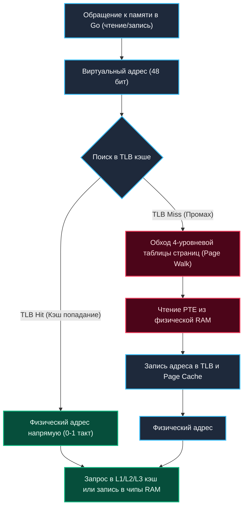

## Виртуальная память: Почему каждому процессу кажется, что у него своя RAM

> *"All problems in computer science can be solved by another level of indirection."*  
> — Дэвид Уилер

Каждая запущенная программа на вашем компьютере живет в блаженном неведении: она искренне убеждена, что является единственным полновластным хозяином всей оперативной памяти машины. 

Когда вы запускаете `go run main.go`, ваш процесс без колебаний оперирует указателем на адрес вроде `0x00007fffffffe000`. В ту же самую наносекунду рядом в соседнем окне терминала работает скрипт на Python или браузер, который обращается к ровно такому же адресу `0x00007fffffffe000`. Но почему они не затирают данные друг друга? Почему ошибка в чужой программе не разрушает стек вашего сервиса?

Более того: на современных 64-битных системах Linux ядро выделяет каждому процессу виртуальное адресное пространство размером в **128 Терабайт** ($2^{47}$ байт, а при 5-уровневой адресации — до 4 Петабайт!), хотя на материнской плате вашего сервера может быть установлено всего 16 или 32 Гигабайта физической RAM.

Как процессор и операционная система управляют этим грандиозным пространством, не вызывая аварийного `OutOfMemory` на пустом месте и сохраняя абсолютную изоляцию?

Ответ кроется в величайшей иллюзии вычислительной техники — **виртуальной памяти (Virtual Memory)**. Это похоже на нумерацию комнат в гостиничной сети: номер 302 в отеле в Лондоне и номер 302 в отеле в Токио имеют одинаковую табличку на двери, но гости в Токио никогда не обнаружат чужие чемоданы из Лондона в своем шкафу.

---

## Аппаратный фундамент: MMU и таблица страниц

Виртуальная память — это не чисто программная надстройка операционной системы. Программная проверка каждого обращения к памяти сделала бы компьютеры в сотни раз медленнее. Поэтому в основе лежит кремниевый аппаратный узел внутри кристалла процессора — **MMU (Memory Management Unit)**.

Блок MMU работает на аппаратной скорости конвейера CPU и прозрачно для прикладного кода преобразует **виртуальные адреса** (которые генерирует ваш скомпилированный машинный код Go) в реальные **физические адреса** (которые выставляются на контакты шины памяти к чипам DRAM).

```
         ПРОЦЕСС GO                                  ЧИПЫ DRAM
 ┌─────────────────────────┐               ┌─────────────────────────┐
 │ Виртуальный адрес       │               │ Физический фрейм        │
 │ 0x7FFF_FFFF_E000        │               │ 0x0000_12A4_0000        │
 └────────────┬────────────┘               └────────────▲────────────┘
              │                                         │
              ▼                                         │
 ┌─────────────────────────┐               ┌────────────┴────────────┐
 │  MMU (Внутри ядра CPU)  │ ── Поиск в ──>│  Таблица страниц        │
 │  Трансляция за 0-1 такт │    TLB / PT   │  (PML4 -> PDPT -> PTE)  │
 └─────────────────────────┘               └─────────────────────────┘
```

Преобразование адресов не вычисляется по простой математической формуле со смещением, потому что физическая память фрагментирована. Вместо этого ядро и MMU оперируют дискретными блоками фиксированного размера — **страницами (Pages)**, обычно по **4 Килобайта** (4096 байт).

Связь между виртуальными страницами процесса и физическими блоками памяти (фреймами) фиксируется в специальной древовидной структуре данных — **Таблице страниц (Page Table)**.

> [!info] Под капотом: Иерархия таблиц страниц
> На современных 64-битных x86-64 архитектурах используется 4-уровневая иерархия страниц:
> `PML4 -> PGD -> PUD -> PMD -> PTE` (в терминологии Linux: Page Map Level 4 $	o$ Page Global Directory $	o$ Page Upper Directory $	o$ Page Middle Directory $	o$ Page Table Entry).
> 
> 48-битный виртуальный адрес разбивается на четыре 9-битных индекса (по 512 записей на уровень) и 12-битное внутристраничное смещение:
> - **Листовой узел (PTE):** Содержит 40-битный физический базовый адрес фрейма в RAM и набор системных флагов:
>   - `Present (P)`: загружена ли страница в физическую память прямо сейчас.
>   - `Read/Write (R/W)`: права на запись (защита от несанкционированной модификации кода).
>   - `User/Supervisor (U/S)`: доступна ли страница коду User Space (Ring 3) или только ядру (Ring 0).
>   - `Dirty (D)`: была ли произведена запись в страницу (критично для сборщика мусора и сброса кэша на диск).
>   - `Accessed (A)`: читалась ли страница недавно (используется алгоритмами вытеснения страниц LRU).
>   - `NX (No-Execute)`: запрет исполнения машинного кода в областях данных и стека.

---

## Трансляция адреса и цена промаха

Когда ваш Go-код читает значение переменной или обращается к элементу слайса `data[i]`, процессор не может мгновенно прочесть байт из DRAM. MMU должен транслировать адрес.

Если бы процессору приходилось на каждое чтение памяти делать 4 последовательных обращения к таблицам страниц в медленной RAM, скорость работы упала бы в 4–5 раз!

Чтобы этого избежать, процессор использует специализированный сверхбыстрый ассоциативный аппаратный кэш — **TLB (Translation Lookaside Buffer)**.

- **TLB Hit (Попадание в кэш):** Трансляция виртуального адреса в физический происходит за **0–1 такт CPU**. Процессор мгновенно отправляет физический адрес в кэш L1d.
- **TLB Miss (Промах кэша):** Если страницы нет в TLB, специальный блок процессора (Page Miss Handler) начинает пошаговый обход дерева (Page Table Walk), запрашивая таблицы страниц из памяти. Это занимает от 10 до 50 наносекунд (сотни тактов).



---

## Page Fault: Когда "своей" памяти нет

Виртуальное адресное пространство процесса в момент запуска почти полностью заполнено виртуальными «заглушками». Когда процесс выделяет гигабайт памяти, ядро не бросается резервировать гигабайт кремниевых ячеек.

Если процесс обращается по виртуальному адресу, для которого в PTE сброшен бит `Present` (страница отсутствует в физической памяти), блок MMU генерирует аппаратное прерывание процессора — **Page Fault** (ошибка страницы, исключение вектора #14 в x86). Процессор замирает и передает управление обработчику ядра Linux `do_page_fault()`.

> [!warning] Ловушка / Gotcha: Page Fault — это штатная механика, а не краш
> Слово *Fault* пугает начинающих инженеров, но в 99.9% случаев Page Fault — это абсолютно штатный механизм динамической аллокации памяти в Linux. 
> 
> Существует два принципиально разных типа Page Fault:
> 1. **Minor Page Fault (Мягкая ошибка):** Физическая страница уже находится в оперативной памяти (например, в системном дисковом кэше Page Cache или готова к аллокации как нулевая страница), но в локальной таблице страниц процесса запись еще не была связана. Ядро просто прописывает физический адрес в PTE и разрешает исполнение. Задержка минимальна — **доли микросекунды**.
> 2. **Major Page Fault (Тяжелая ошибка):** Нужных данных физически нет в оперативной памяти (страница вытеснена на SSD в раздел подкачки Swap или считывается из файла на диске через `mmap`). Ядро переводит процесс в состояние непрерываемого сна (`TASK_UNINTERRUPTIBLE`), инициирует дисковое I/O и ждет завершения чтения. Задержка чудовищна — **от 1 до 10 миллисекунд** (миллионы тактов процессора!).

---

## Go Runtime и политика выделения памяти

В классических программах на Си библиотека `glibc` исторически управляла кучей через системные вызовы `brk`/`sbrk`, сдвигая указатель границы непрерывной памяти (`break pointer`).

Среда выполнения Go полностью отказалась от `brk` и строит всю работу с памятью исключительно поверх системного вызова **`mmap`**.

Почему архитекторы Go приняли такое решение?
Потому что `mmap` оперирует страницами произвольного размера и позволяет Go зарезервировать гигантские диапазоны виртуальной памяти (сотни гигабайт аренами по 64 МБ) **за считанные наносекунды**, не расходуя ни единого байта физической RAM! Физическая память привязывается ядром Linux только в момент первой записи в страницу. Эта стратегия называется **Demand Paging (выделение по требованию)**.

```go
package main

import (
	"fmt"
	"syscall"
)

// allocateVirtualMemory иллюстрирует концепцию отложенного выделения (Demand Paging),
// лежащую в основе работы рантайма Go (runtime.sysAlloc / runtime.mmap).
func allocateVirtualMemory(size int) ([]byte, error) {
	// 1. Запрашиваем виртуальное адресное пространство.
	// Флаги MAP_ANON | MAP_PRIVATE: анонимная память, не связанная с файлом на диске.
	// Флаг PROT_NONE резервирует адресное пространство без выделения физической памяти!
	ptr, err := syscall.Mmap(
		-1,
		0,
		size,
		syscall.PROT_NONE,
		syscall.MAP_ANON|syscall.MAP_PRIVATE,
	)
	if err != nil {
		return nil, fmt.Errorf("mmap failed: %w", err)
	}

	// 2. Включаем права чтения и записи для требуемого фрагмента (mprotect)
	// В реальном рантайме это делает sysMap / runtime.madvise
	err = syscall.Mprotect(ptr, syscall.PROT_READ|syscall.PROT_WRITE)
	if err != nil {
		return nil, fmt.Errorf("mprotect failed: %w", err)
	}

	// 3. Подсказываем ядру через madvise о предстоящем использовании памяти
	// MADV_WILLNEED рекомендует ядру заранее подгрузить страницы в RAM
	_ = syscall.Madvise(ptr, size, syscall.MADV_WILLNEED)

	// На этом этапе физическая память еще НЕ выделена целиком!
	// Только когда мы запишем первый байт (ptr[0] = 42), блок MMU сгенерирует
	// Minor Page Fault, и ядро Linux выделит реальный физический 4 КБ фрейм в RAM.
	return ptr, nil
}
```

---

## Mechanical Sympathy и влияние на производительность

Понимание механики виртуальной памяти на уровне железа позволяет избежать скрытых деградаций производительности:

1. **TLB Pressure и огромные массивы:**  
   Кэш TLB первого уровня вмещает всего 64–128 записей (от 256 КБ до 512 КБ адресуемой памяти). При обходе гигантских хэш-таблиц или слайсов на миллионы элементов процессор непрерывно ловит промахи TLB.  
   *Оптимизация:* Локализация данных, переиспользование буферов через `sync.Pool`, выравнивание структур по границам кэш-линий и применение Huge Pages (страниц по 2 МБ, о которых речь пойдет в следующих лекциях).
2. **Иллюзия нулевой памяти (Zero-page trick):**  
   Когда процесс запрашивает новую память, ядро обязано гарантировать, что процесс не прочитает чужие пароли или секретные ключи, оставшиеся от других приложений. Поэтому ядро обнуляет страницы.  
   Но чтобы не тратить время, ядро изначально маппит все анонимные страницы на одну-единственную глобальную **Zero Page** в физической RAM в режиме Read-Only. Чтение из такой нетронутой памяти мгновенно возвращает нули. Реальная аллокация и копирование происходят только при первой записи (Copy-On-Write).
3. **Борьба за RSS: madvise(MADV_DONTNEED) в Go:**  
   Когда сборщик мусора `runtime.GC()` освобождает неиспользуемые объекты, рантайм Go не вызывает тяжелый `munmap` на каждый блок. Вместо этого фоновый поток вызывает системный вызов `madvise(addr, size, syscall.MADV_DONTNEED)`.  
   Это сообщает ядру Linux: *«Эти физические страницы нашему сервису больше не нужны, можешь немедленно забрать фреймы RAM и обнулить счетчики RSS»*. Виртуальный адрес остается зарезервированным, но физическая память освобождается для операционной системы!

> [!tip] Собеседование: Почему Go использует mmap, а не brk?
> **Вопрос:** Почему рантайм Go строит аллокатор памяти вокруг `mmap`, а не классического `brk`? Как это связано со сборщиком мусора?
> 
> **Ответ архитектора:**
> 1. **Фрагментация и возврат памяти:** Вызов `brk` расширяет память процесса строго непрерывно в одном направлении. Если в самом начале кучи останется живой объект размером 16 байт, вы не сможете вернуть ОС ни одного мегабайта памяти выше него! В противоположность этому `mmap` позволяет выделять и освобождать память произвольными независимыми блоками в любом месте адресного пространства.
> 2. **Эффективное освобождение через madvise:** Рантайм Go тесно интегрирован с ядром через `madvise(MADV_DONTNEED)`. После цикла GC неиспользуемые страницы мгновенно отдаются ядру, сбрасывая Resident Set Size (RSS), чего невозможно добиться с помощью `brk`.
> 3. **Многопоточность:** Вызов `brk` глобален для всего процесса и требует жесткой синхронизации. `mmap` позволяет выделять память параллельно из независимых потоков `M` в изолированные арены без взаимных блокировок.

---

## Сравниваем подходы

| Характеристика | Рантайм Go | Классический C/C++ (glibc) | Виртуальная машина Java (JVM) |
|---|---|---|---|
| **Базовый системный API** | `mmap` + `munmap` | `brk` / `sbrk` (малые блоки), `mmap` (большие) | `mmap` |
| **Стратегия аллокации** | Demand Paging, арены по 64 МБ | Непрерывный рост арены кучи | Generational Heap (резервирование при старте через `-Xms/-Xmx`) |
| **Возврат памяти ОС** | Регулярный возврат через `madvise(MADV_DONTNEED)` | Практически невозможен без ручного вызова `malloc_trim` | Зависит от GC (G1/ZGC умеют ужимать кучу, старый CMS/Parallel — нет) |
| **Изоляция и фрагментация** | Высокая (независимые страницы и спаны) | Высокий риск фрагментации | Внутренняя изоляция внутри пространства кучи JVM |

---

## Итог

1. **Виртуальная память** дарит каждому процессу иллюзию владения изолированным непрерывным адресным пространством размером до **128 ТБ**, защищая память приложений от взаимного повреждения.
2. **MMU (Memory Management Unit)** выполняет преобразование адресов на уровне кремния в связке со сверхбыстрым кэшем **TLB**. Промахи TLB сбрасывают процессор на медленный 4-уровневый обход таблиц страниц.
3. **Demand Paging и Page Fault:** Выделение памяти в ОС происходит «лениво». Физические фреймы оперативной памяти привязываются ядром только при первой реальной записи через механизм Minor Page Fault.
4. **Рантайм Go** всецело полагается на связку системных вызовов `mmap` и `madvise(MADV_DONTNEED)`, что позволяет сборщику мусора эластично отдавать неиспользуемую память ядру ОС и удерживать минимальный RSS.
5. Задержки памяти в высоконагруженных Go-сервисах часто вызваны промахами TLB и вытеснением страниц. Мониторьте метрики ядра с помощью утилит `vmstat` и профилировщика `perf`.

В следующей статье мы заглянем под микроскоп и изучим внутреннее устройство самих таблиц: [[13. Страничная организация памяти. Page Tables, TLB, Page Fault.md]].
