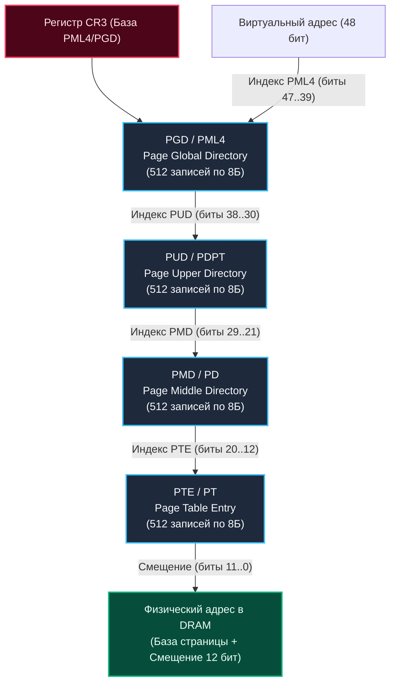

## Введение: Физика и логика разделения памяти

> *«Память похожа на городскую сетку улиц. Если бы каждый житель непременно требовал себе непрерывный десятимильный бульвар, город бы рухнул. Но дайте каждому карту и лифт — и хаос обретет порядок».*    
> — Архитектурный принцип адресации

В предыдущей статье [[12. Виртуальная память. Почему процессу кажется, что у него своя память]] мы познакомились с великой иллюзией операционных систем: каждый процесс видит собственное непрерывное виртуальное пространство до 128 ТБ. 

Но как ядро операционной системы гарантирует, что сотни независимых процессов не перезапишут данные друг друга? И как физически упаковать эти терабайты виртуальных адресов в скромные планки оперативной памяти (DRAM) на материнской плате?

Представьте огромный почтовый склад с 10 000 пронумерованных ячеек (физическая память). Если бы каждый клиент требовал выделить ему строго непрерывный ряд из 100 соседних ячеек, начальник склада быстро сошел бы с ума. Через пару часов после закрытия нескольких заказов склад превратился бы в швейцарский сыр: дыр много, а 100 свободных ячеек подряд нет нигде (**внешняя фрагментация**).

Эту проблему решает **Paging (Страничная организация памяти)**:
1. **Победа над внешней фрагментацией:** Свободные блоки физической памяти могут быть разбросаны как угодно. Paging позволяет разместить страницы одного процесса в любых физических фреймах RAM, сохраняя для процесса иллюзию строгой непрерывности.
2. **Эффективность по требованию (Demand Paging):** Процессу не нужно выделять физическую память под все 128 ТБ сразу. Физические кремниевые ячейки подгружаются только в момент первого реального обращения к адресу.

---

## Иерархия Page Table и механизм трансляции

Процессор физически не способен выполнить инструкцию по виртуальному адресу: шина адреса DRAM требует реальных координат ячеек кремния. Преобразованием `Virtual Address -> Physical Address` ведает встроенный аппаратный узел процессора — **MMU (Memory Management Unit)**.

На современной 64-битной архитектуре x86-64 используется 4-уровневая иерархическая структура — **[[Page Table]]** (в Linux: PGD $	o$ PUD $	o$ PMD $	o$ PTE, либо в терминах Intel: PML4 $	o$ PDPT $	o$ PD $	o$ PT).

Каждый уровень представляет собой таблицу указателей на таблицу следующего уровня. 48-битный виртуальный адрес разбивается на строго выверенные битовые поля:

```
 63          47       38       29       20       11          0
 ┌──────────┬────────┬────────┬────────┬────────┬────────────┐
 │ Знак-расш│ PML4/  │ PUD/   │ PMD/   │ PTE/   │ Внутри-    │
 │ (16 бит) │ PGD    │ PDPT   │ PD     │ PT     │ страничное │
 │          │ (9 бит)│ (9 бит)│ (9 бит)│ (9 бит)│ смещение   │
 └──────────┴────────┴────────┴────────┴────────┴────────────┘
             512 запр 512 запр 512 запр 512 запр   4096 байт
```



Каждая запись на листовом уровне — **[[Page Table Entry]] (PTE)** — занимает ровно 8 байт (64 бита) и содержит:
* **Present/Absent (P, бит 0):** Если бит равен 1 — страница загружена в RAM. Если 0 — процессор останавливает исполнение и генерирует аппаратное прерывание `Page Fault`.
* **Read/Write (R/W, бит 1):** Права доступа (0 = только чтение, 1 = чтение и запись).
* **User/Supervisor (U/S, бит 2):** Защита привилегий (доступно ли из Ring 3 или только для Ring 0).
* **Accessed (A, бит 5) и Dirty (D, бит 6):** Отметки о чтении и модификации страницы, критичные для алгоритмов LRU ядра и работы сборщиков мусора.
* **Физический базовый адрес фрейма:** 40-битный физический адрес в чипах RAM.

> [!info] Математическая гармония: Почему именно 4 уровня по 9 бит?
> Каждая запись [[Page Table Entry]] занимает ровно 8 байт.  
> 9 бит индекса дают $2^9 = 512$ записей в таблице.  
> Умножим: `512 * 8 = 4 КБ` (ровно одна физическая страница, 512 записей по 8 байт = 4096 байт)!
> Таблица любого уровня занимает **ровно одну стандартную физическую страницу**. Ядру Linux никогда не приходится решать проблему фрагментации для самих таблиц страниц: они аллоцируются и выгружаются абсолютно такими же стандартными 4-килобайтными блоками.

---

## Размер страницы и Huge Pages

Стандартный размер страницы на процессорах архитектур x86-64 и ARM64 составляет **4 КБ** (4096 байт). Этот размер — результат многолетнего инженерного компромисса:
* **Если сделать страницу меньше (например, 512 байт):** Размер таблиц [[Page Table]] вырастет в разы. На каждые 4 КБ данных вам придется хранить сотни байт служебных дескрипторов PTE, а кэш трансляций TLB моментально переполнится.
* **Если сделать страницу больше (например, 64 КБ везде):** Возникнет **внутренняя фрагментация (Internal Fragmentation)**. Если приложению требуется сохранить строку из 20 байт, ядро выделит 64 КБ, из которых 99.9% памяти превратятся в мертвый груз.

### Huge Pages (2 МБ и 1 ГБ)

Для высоконагруженных баз данных (PostgreSQL, Redis) и высокопроизводительных Go-сервисов, оперирующих гигабайтными кэшами в оперативной памяти, стандартные 4 КБ страницы становятся узким местом из-за промахов кэша TLB.

Процессор x86-64 аппаратно поддерживает **Huge Pages (большие страницы)**:
1. **Страницы 2 МБ:** Если в записи уровня PMD (Page Middle Directory) выставить бит `Page Size (PS = 1)`, процессор **полностью пропускает уровень PTE**! Младшие 21 бит адреса становятся прямым внутристраничным смещением ($2^{21} = 2	ext{ МБ}$). 
   - Одна запись в TLB вместо 4 КБ теперь покрывает сразу 2 Мегабайта памяти (в 512 раз больше!).
2. **Страницы 1 ГБ:** Бит PS выставляется на уровне PUD/PDPT. Младшие 30 бит служат смещением ($2^{30} = 1	ext{ ГБ}$).

> [!warning] Ловушка / Gotcha: Фрагментация физической памяти при Huge Pages
> Для выделения Huge Page ядру Linux требуется **строго непрерывный физический блок памяти** (2 МБ или 1 ГБ неразрывных адресов в кремнии). 
> 
> Если сервер работает неделями под хаотичной нагрузкой, физическая память фрагментируется. Попытка выделить Huge Page в рантайме завершится системной ошибкой `ENOMEM`, даже если суммарно на сервере свободно 40 ГБ памяти! 
> 
> *Решение:* Резервировать пул Huge Pages заранее при загрузке ОС:
> ```bash
> # Выделение пула из 1024 страниц по 2 МБ (2 ГБ памяти)
> echo 1024 > /proc/sys/vm/nr_hugepages
> ```
> В Go для работы с большими страницами применяют системный вызов `mmap` с флагом `MAP_HUGETLB` или диагностическую настройку аллокатора `GODEBUG=pagealloc=1`.

---

## Page Faults: Minor vs Major

Когда процессор декодирует инструкцию чтения/записи по виртуальному адресу, блок MMU проверяет бит `Present` в соответствующем [[Page Table Entry]]:

1. **Page Hit (Попадание):** Бит `Present = 1`. MMU берет физический адрес фрейма, прибавляет 12-битное смещение и передает команду на шину памяти. Процесс работает на максимальной аппаратной скорости.
2. **Page Fault (Отказ страницы):** Бит `Present = 0`. Процессор немедленно приостанавливает конвейер, сохраняет регистры в стек ядра и генерирует исключение процессора (#14). Управление переходит в функцию ядра Linux `do_page_fault`.

Ядро анализирует причину сбоя и разделяет их на два типа:

```
                   СИСТЕМНЫЙ ВЫЗОВ do_page_fault
                                 │
                   Данные есть в оперативной памяти?
                                 │
                 ┌───────────────┴───────────────┐
                 ▼                               ▼
       ДА (Minor Page Fault)           НЕТ (Major Page Fault)
 ┌─────────────────────────────┐ ┌─────────────────────────────┐
 │ Страница в Page Cache или   │ │ Данные вытеснены в Swap или │
 │ ожидает первой привязки RAM │ │ лежат в файле на NVMe/диске │
 ├─────────────────────────────┤ ├─────────────────────────────┤
 │ Скорость: 0.5 - 2 мкс       │ │ Скорость: 1 - 10 мс         │
 │ Задержка: минимальна        │ │ Задержка: катастрофична     │
 └─────────────────────────────┘ └─────────────────────────────┘
```

- **Minor Page Fault:** Данные физически уже находятся в памяти (например, нулевая страница, разделяемая библиотека или страница в кэше ядра Page Cache), но в таблице страниц текущего процесса флаг `Present` еще не был взведен. Ядро связывает PTE с существующим физическим фреймом. Это занимает доли микросекунды.
- **Major Page Fault:** Физических данных в RAM нет вообще: страница была выгружена на диск в раздел подкачки (Swap) или читается из файла через `mmap`. Ядро переводит вызывающий поток в состояние непрерываемого сна (`TASK_UNINTERRUPTIBLE`), инициирует медленное чтение с накопителя и ждет завершения ввода-вывода миллисекунды.

> [!info] Под капотом: Lazy Allocation в рантайме Go
> Рантайм Go активно эксплуатирует механику Minor Page Faults. При запуске сервиса вызов `runtime.mmap` резервирует гигантские виртуальные арены кучи (сотни мегабайт и гигабайт). 
> 
> Реальная физическая память выделяется ядром по схеме **Lazy Allocation (отложенное выделение)**: только когда горутина впервые пытается записать байт по новому адресу, срабатывает Minor Page Fault, и ядро Linux привязывает физический 4 КБ фрейм из пула свободных страниц.

---

## Go Runtime и управление памятью на уровне страниц

Архитектура менеджера памяти языка Go напрямую согласуется со страничной моделью операционной системы.

### 1. Резервирование vs Коммит

Go никогда не использует устаревший вызов `brk` для управления кучей. Вместо этого `runtime.mmap` вызывает системный вызов `mmap` с флагами `MAP_PRIVATE | MAP_ANONYMOUS`. 

Этот вызов **резервирует** диапазоны виртуальных адресов, не расходуя физическую оперативную память. Страницы коммитятся (привязываются к реальной RAM) только по мере фактической надобности.

### 2. Архитектура аллокатора: mheap -> mcache -> span

Аллокатор памяти Go (основанный на идеях TCMalloc) разбивает виртуальное пространство на дискретные блоки:
- **`span` (или `spans` / `mspan`):** Базовая единица управления памятью в Go. Представляет собой непрерывную группу физических страниц (обычно от 1 до 16 страниц, т.е. от 4 КБ до 64 КБ), нарезанных на объекты одинакового размера.
- **`mcache`:** Локальный потокобезопасный кэш, привязанный к каждому логическому процессору `P`. Позволяет горутинам аллоцировать малые объекты мгновенно без мьютексов.
- **`mcentral`:** Централизованный пул спанов фиксированного класса размеров, доступный всем процессорам.
- **`mheap`:** Глобальный координатор памяти рантайма. Именно `mheap` запрашивает новые арены страниц у ядра Linux через `mmap` и освобождает их.

### 3. Возврат памяти ОС (GC и madvise)

Когда сборщик мусора Go освобождает объекты, рантайм не спешит вызывать `munmap` — это разрушило бы виртуальные арены и вызвало дорогой TLB Shootdown. 

Вместо этого Go помечает спан как свободный (`MHeapMap_SpanInUse = 0`). При срабатывании триггеров сборщика мусора (настраиваемых параметром `GOGC` и `GOMEMLIMIT`) фоновый скавенджер рантайма вызывает:
```c
madvise(addr, len, MADV_DONTNEED);
```
Системный вызов `madvise(addr, len, MADV_DONTNEED)` сообщает ядру Linux: *«Данные в этом диапазоне адресов нашему приложению больше не нужны. Можешь немедленно освободить физические страницы фреймов и вернуть их в свободный пул ОС»*. 

Виртуальное адресное пространство процесса сохраняется, но счетчик реальной физической памяти процесса (**Resident Set Size — RSS**) мгновенно снижается! При повторном обращении к этой памяти ядро просто выделит новый чистый фрейм через Minor Page Fault.

```go
package main

import (
	"fmt"
	"syscall"
	"unsafe"
)

// releaseUnusedPages демонстрирует низкоуровневое освобождение физических страниц
// без разрушения виртуального адресного пространства (паттерн scavenge в Go).
func releaseUnusedPages(addr uintptr, length int) error {
	// Системный вызов madvise с флагом MADV_DONTNEED указывает ядру Linux,
	// что страницы можно отвязать от физической RAM прямо сейчас
	_, _, errno := syscall.Syscall(
		syscall.SYS_MADVISE,
		addr,
		uintptr(length),
		uintptr(syscall.MADV_DONTNEED),
	)
	if errno != 0 {
		return fmt.Errorf("madvise MADV_DONTNEED failed: %w", errno)
	}
	return nil
}
```

---

## Mechanical Sympathy: Влияние на производительность

### TLB и Page Table Walk
Процессор кэширует недавние результаты трансляций адресов в сверхбыстром кэше **TLB (Translation Lookaside Buffer)**:
* **TLB Hit:** Трансляция занимает всего **0.5–1 такт CPU**.
* **TLB Miss:** Процессор вынужден исполнять процедуру **Page Table Walk** — делать 4 последовательных чтения из оперативной памяти DRAM. Стоимость промаха составляет **50–100+ тактов**!

**Как паттерны Go влияют на TLB:**
* Хаотичная аллокация миллионов мелких объектов в куче приводит к размазыванию данных по тысячам несвязанных страниц 4 КБ. Это создает шквал промахов TLB и снижает эффективность аппаратного предвыборщика данных (`prefetching`).
* *Решение:* Переиспользование буферов через `sync.Pool`, уплотнение структур данных (Struct Packing), учет выравнивания полей (`alignof`) и локализация работы горутин внутри одного логического процессора `P`.

### NUMA и распределение памяти
На многопроцессорных NUMA-серверах ядро аллоцирует физические страницы в том сокете, на котором исполнялся поток в момент первого касания страницы (First Touch Policy). 

Хотя рантайм Go не управляет NUMA напрямую, локальные кэши `mcache` каждого процессора `P` стараются держать память ближе к выполняющемуся коду. На высоконагруженных нодах Go-бинарники запускают с жесткой изоляцией через `numactl --cpunodebind=0 --membind=0`.

---

## Производительность и оптимизация

1. **Контроль за размером буферов:**  
   При работе с сетевыми протоколами и файлами аллоцируйте буферы размером, кратным размеру страницы (4 КБ, 8 КБ, 64 КБ), либо используйте `bytes.Buffer` с методом `Grow()`.
2. **Диагностика Page Faults:**  
   Всплески Minor Page Faults естественны при запуске сервиса и выделении новых арен памяти. Но если растут Major Page Faults — ваш сервер ушел в swap! Проверяйте статус командами:
   ```bash
   vmstat 1
   cat /proc/meminfo | grep -i swap
   ```
3. **Escape Analysis и нагрузка на страницы:**  
   Переменные, уходящие со стека в кучу (Escape to Heap), требуют страниц из пула `mheap`. Используйте `sync.Pool`, чтобы уменьшить частоту аллокаций и снизить оверхед на системные вызовы `madvise`.

> [!tip] Собеседование
> **Вопрос 1:** Почему Go Runtime использует `mmap`, а не традиционный `brk` для роста кучи?  
> **Ответ:** Системный вызов `brk` расширяет память процесса непрерывно и глобально для всех потоков. Он не позволяет возвращать память ОС из середины кучи (вызовы `sbrk(0)` или `malloc_trim` неэффективны при фрагментации). `mmap` позволяет выделять и возвращать произвольные несвязанные диапазоны страниц в любом месте адресного пространства, поддерживает флаги `MAP_ANONYMOUS` и вызовы `madvise(MADV_DONTNEED)`, что идеально согласуется с моделью сборщика мусора Go.
> 
> **Вопрос 2:** Что происходит в Go-сервисе при возникновении Major Page Fault?  
> **Ответ:** Системный поток ОС (`M`) мгновенно блокируется в ядре Linux, ожидая считывания блока данных со swap-раздела или диска. Планировщик Go замечает заблокированный тред и старается отсоединить логический процессор `P`, перенеся остальные горутины на свободные потоки `M`. Однако частые Major Page Faults приводят к лавине переключений контекста ОС и взрывному росту задержки сервиса (latency p99).

---

## Итог

1. **Страничная адресация (Paging)** делит виртуальное и физическое пространство на стандартизированные блоки по **4 КБ**, устраняя внешнюю фрагментацию RAM.
2. **Page Table** — 4-уровневая древовидная структура. Каждый ее уровень (PGD, PUD, PMD, PTE) занимает ровно одну 4 КБ страницу благодаря упаковке 512 записей по 8 байт.
3. **Huge Pages (2 МБ и 1 ГБ)** пропускают нижние уровни таблицы страниц, разгружая аппаратный кэш **TLB** в сотни раз для больших массивов данных.
4. **Demand Paging и Minor Page Fault:** Физическая память связывается ядром лениво, только в момент первой записи в страницу.
5. **Рантайм Go** строит кучу на спанах из страниц через `mmap`, а сборщик мусора возвращает неиспользуемые страницы ядру через `madvise(MADV_DONTNEED)`, эффективно снижая RSS.

Мы выяснили, как виртуальные адреса раскладываются по 4-килобайтным блокам. Но почему промах мимо аппаратного кэша трансляций столь болезненно бьет по задержкам микропроцессора? В следующей статье мы разберем аппаратную физику кэша адресов: [[14. TLB и стоимость промаха по таблице страниц]].
