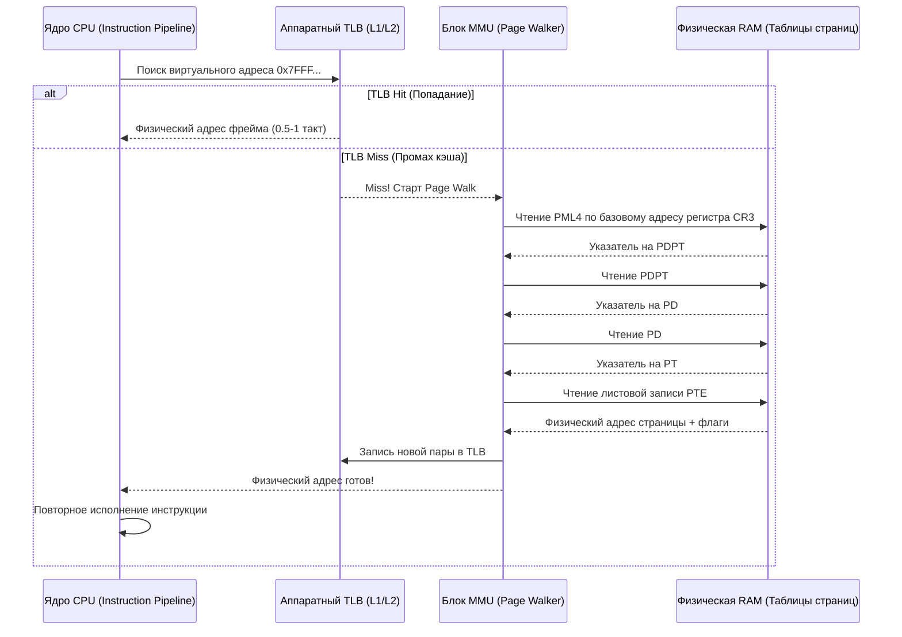

## Почему виртуальная память тормозит: проблема адресного преобразования

> *"Caching is the ultimate admission that memory is too far away, and physics is non-negotiable."*  
> — Инженерный закон иерархии памяти

Если бы каждое обращение процессора к оперативной памяти требовало полного четырехкратного обхода таблиц страниц в DRAM, ваш новенький сервер с тактовой частотой 4.5 ГГц мгновенно замедлился бы до скорости музейного компьютера 1990 года.

Представьте, что вам нужно найти значение незнакомого слова в гигантском многотомном энциклопедическом словаре. Если для слова «кот» вам придется:
1. Подойти к шкафу 1 и открыть Фолиант 1 (PML4), чтобы узнать номер нужного книжного стеллажа.
2. Пройти к стеллажу и открыть Фолиант 2 (PDPT), чтобы узнать номер полки.
3. Открыть Фолиант 3 (PD) на этой полке, чтобы узнать номер коробки с карточками.
4. Достать картотеку Фолианта 4 (PT) и найти там номер страницы.
5. И только потом открыть саму книгу на нужной странице...

Чтение одного предложения заняло бы у вас полчаса! 

Именно эту мучительную процедуру процессор обязан совершать при трансляции виртуального адреса в физический. Чтобы спасти вычислительные мощности человечества от библиотечного коллапса, инженеры кремния изобрели один из самых совершенных кэшей на кристалле процессора — **TLB (Translation Lookaside Buffer)**.

---

## Что такое TLB? Аппаратный кэш трансляций

**TLB (Translation Lookaside Buffer, буфер ассоциативной трансляции)** — это специализированный сверхбыстрый аппаратный кэш прямо внутри кремниевого ядра CPU (расположенный на одном уровне с кэшами L1/L2), который хранит недавно вычисленные сопоставления:
$$	ext{Виртуальная страница} \longrightarrow 	ext{Физический фрейм}$$

```
                ВИРТУАЛЬНЫЙ АДРЕС (От конвейера CPU)
                                 │
                                 ▼
                    ┌─────────────────────────┐
                    │    ПОИСК В КЭШЕ TLB     │
                    │   (Ассоциативный поиск) │
                    └────────────┬────────────┘
                                 │
                 ┌───────────────┴───────────────┐
                 ▼                               ▼
       TLB HIT (Попадание)             TLB MISS (Промах)
 ┌─────────────────────────────┐ ┌─────────────────────────────┐
 │ Трансляция за 0.5 - 1 такт  │ │ Аппаратный Page Walk        │
 │ Мгновенный доступ в L1d RAM │ │ 4 чтения из памяти (RAM)    │
 ├─────────────────────────────┤ ├─────────────────────────────┤
 │ Задержка: ~0.5 - 1 нс       │ │ Задержка: ~50 - 150 нс      │
 └─────────────────────────────┘ └─────────────────────────────┘
```

Механизм работает на аппаратном уровне кристалла абсолютно прозрачно для программиста:
1. Конвейер процессора генерирует виртуальный адрес для инструкции чтения или записи.
2. Блок MMU параллельно опрашивает ячейки TLB.
3. **TLB Hit (Попадание):** Соответствие найдено! MMU мгновенно формирует физический адрес и обращается к кэшу данных L1d за **0.5–1 такт CPU**.
4. **TLB Miss (Промах):** В кэше нет трансляции для этой страницы. Процессор вынужден остановить конвейер и запустить аппаратную процедуру **Page Walk** («прогулку по таблицам страниц»).

---

## Page Walk: Что происходит при промахе по TLB?

При возникновении промаха процессор не зовет операционную систему: обработка Page Walk реализована аппаратно в микрокоде процессора (Hardware Page Table Walker). 

На классической 64-битной архитектуре x86-64 процессор начинает пошаговый обход 4-уровневого дерева:



1. Процессор берет базовый физический адрес корневой таблицы PML4 из системного регистра `CR3`.
2. Читает из памяти запись PML4 и извлекает указатель на PDPT.
3. Читает запись PDPT и извлекает указатель на PD.
4. Читает запись PD и извлекает указатель на таблицу страниц PT.
5. Наконец, читает листовую запись PTE (Page Table Entry) и получает физический адрес страницы в RAM.
6. Записывает свежую трансляцию в кэш TLB, чтобы последующие инструкции не повторяли этот путь.
7. Возобновляет приостановленную инструкцию.

> [!info] Под капотом: Иерархия TLB в современных процессорах
> Аппаратный TLB в современных CPU (Intel Sapphire Rapids / AMD EPYC Zen 4) организован иерархически:
> - **L1 dTLB (Data TLB):** Сверхбыстрый кэш на 64–96 записей для 4 КБ страниц. Задержка: ~1 такт.
> - **L1 iTLB (Instruction TLB):** Кэш трансляций инструкций кода на 64–128 записей.
> - **L2 STLB (Shared/Second-level TLB):** Вместительный объединенный кэш на 1536–2048 записей. Задержка: ~7–12 тактов.
> - **Page Walk Cache (PWC):** Аппаратный кэш промежуточных указателей (PML4/PDPT/PD), позволяющий при промахе L2 TLB пропустить первые 2–3 уровня и прочитать из RAM только последний уровень PTE!
> 
> Если активная рабочая память программы (Working Set) укладывается в пределы емкости TLB (~2048 страниц по 4 КБ = **всего 8 Мегабайт!**), процессор работает на пиковой скорости. Но если приложение активно ворочает сотнями мегабайт, начинается мучительный «дребезг» — **TLB Thrashing**.

---

## Стоимость промаха по TLB (TLB Miss Cost)

Промах по TLB — это не просто крошечная задержка. Для микропроцессора это целая цепь аппаратных потерь:

1. **Page Walk Latency:** 4 последовательных обращения к оперативной памяти DRAM. При типичной латентности DDR4/DDR5 в ~60–100 нс полный обход дерева отнимает **от 150 до 400 наносекунд** процессорного времени!
2. **Сброс конвейера (Pipeline Stalls):** Инструкции, зависимые от загружаемых данных, замирают в очередях резервирования (Reservation Stations). Процессор сжигает сотни тактов впустую.
3. **TLB Shootdown при смене контекста:** Когда ядро Linux переключает процесс или освобождает страницы через `munmap`, процессор обязан сбросить соответствующие записи TLB. На многоядерных машинах процессор шлет межъядерные аппаратные прерывания (IPI — Inter-Processor Interrupts) всем остальным ядрам, требуя от них синхронной очистки кэшей TLB (**TLB Shootdown**). Эта процедура может стоить от 10 000 до 30 000 тактов CPU!

```bash
# Примерная стоимость трансляции адреса в тактах CPU (x86-64):
# TLB Hit (L1 dTLB):           ~1 такт
# TLB Hit (L2 STLB):           ~7-12 тактов
# TLB Miss (Page Walk из RAM): ~50-200+ тактов
# Context Switch + TLB Flush:  ~10,000 - 25,000 тактов
```

---

## Как это влияет на Go-разработчика? Mechanical Sympathy

В повседневной работе Go-разработчик абстрагирован от физических адресов: мы не настраиваем регистры `CR3` и не пишем страничные преобразователи. Но именно то, как ваш Go-код размещает данные в памяти, определяет: работает ли процессор с горячим TLB или задыхается в бесконечном Page Walk.

### 1. Heap Allocation и локальность данных

Аллокатор памяти Go запрашивает память у ядра Linux крупными непрерывными блоками через системный вызов `mmap` (аренами по 64 МБ).

Если ваш бэкенд обрабатывает поток запросов и на каждый чих аллоцирует мелкие объекты в куче через `new()` или интерфейсные боксинги, сборщик мусора GC начинает рассеивать связанные данные по сотням несвязанных 4-килобайтных страниц. 

Когда алгоритм обходит коллекцию таких объектов, каждое разыменование указателя бьет по новой странице, вызывая каскад TLB Misses.

```go
package main

import (
	"sync"
)

// Плохой паттерн: миллион независимых аллокаций в куче.
// Объекты размазываются по разным физическим страницам RAM.
// Это порождает шквал промахов TLB и заставляет GC непрерывно сканировать страницы.
func badPattern() {
	for i := 0; i < 1_000_000; i++ {
		data := make([]byte, 256)
		_ = data
	}
}

// Отличный паттерн: переиспользование буферов через sync.Pool.
// Память буферов удерживается в одних и тех же горячих страницах.
// Маппинги в TLB остаются активными, давление на MMU падает практически до нуля!
var bufPool = sync.Pool{
	New: func() any {
		return make([]byte, 256)
	},
}

func goodPattern() {
	for i := 0; i < 1_000_000; i++ {
		buf := bufPool.Get().([]byte)
		// полезная работа с буфером buf...
		bufPool.Put(buf)
	}
}
```

### 2. Context Switch и Goroutines

Планировщик Go (`runtime.scheduler`) мультиплексирует тысячи горутин (`G`) поверх системных потоков ядра (`M`). 

Когда горутина блокируется на канале или сетевом сокете, встроенный сетевой поллер `netpoller` сохраняет поток `M` в живых и сразу отдает его другой горутине. Поскольку все горутины живут в едином виртуальном адресном пространстве процесса, переключение горутин **вообще не затрагивает регистр `CR3` и не сбрасывает TLB!** 

Однако если код совершает блокирующий системный вызов (чтение с диска или CGO), системный поток `M` засыпает в ядре, провоцируя честный переключение контекста ОС с вымыванием записей TLB.

> [!warning] Ловушка / Gotcha: Блокировки и TLB-дребезг
> Если профилировщик `pprof` показывает подозрительно высокий процент времени в функциях `runtime.schedule` или `runtime.wakep`, это прямой сигнал: ваши горутины непрерывно будят системные потоки `M` из-за тяжелых блокировок на мьютексах или синхронных системных вызовах. Это дестабилизирует кэши L1/L2 и непрерывно вытесняет рабочие строки TLB.

### 3. NUMA и удаленная память

На многопроцессорных серверах NUMA память разделена между сокетами. Если Go-процесс аллоцировал страницу памяти на одном NUMA-узле, а поток `M` мигрировал на соседний сокет, промах по TLB на удаленной ноде заставляет Page Walker считывать таблицы страниц через межпроцессорную шину UPI / Infinity Fabric. Задержка Page Walk возрастает в 2.5–3 раза!  
*Решение:* Привязывайте критичные сервисы к NUMA-домену через `numactl --cpunodebind=0 --membind=0`.

> [!tip] Собеседование
> **Вопрос 1:** Почему включение Huge Pages (больших страниц) может ускорить высоконагруженный Go-сервис на 15–25%?  
> **Ответ:** Стандартная страница 4 КБ покрывает малый объем памяти. Если кэш TLB вмещает 1024 записи, он способен покрыть всего $1024 	imes 4	ext{ КБ} = 4	ext{ МБ}$ рабочей памяти! Если объем активных данных сервиса (кэш в памяти, хэш-таблицы) составляет 2 ГБ, процессор обречен непрерывно промахиваться мимо TLB.  
> Использование Huge Pages по **2 МБ** позволяет тем же 1024 записям TLB покрыть сразу $1024 	imes 2	ext{ МБ} = \mathbf{2\ Гигабайта}$ памяти! Hit rate кэша TLB взлетает почти до 100%, полностью устраняя накладные расходы на Page Walk.  
> В Linux это можно активировать через прозрачные большие страницы:  
> `echo always > /sys/kernel/mm/transparent_hugepage/enabled` (или в режиме `madvise`).
> 
> **Вопрос 2:** Влияет ли сборщик мусора (GC) в Go на эффективность TLB?  
> **Ответ:** Да, причем существенно. Во время маркинга GC сканирует всю кучу. Если куча фрагментирована, сканирование заставляет процессор обращаться к тысячам разрозненных страниц, выбивая из TLB рабочие страницы бизнес-логики. Кроме того, фоновый возврат памяти через `madvise(MADV_DONTNEED)` заставляет ядро отвязывать физические фреймы, провоцируя последующие Minor Page Faults.

---

## Оптимизация: Как писать TLB-friendly код на Go

1. **Обеспечивайте плотную локальность данных (Data Locality):**  
   Группируйте связанные поля в плоские структуры (`struct`). Избегайте разреженных конструкций вида `map[string]*BigObject`. Отдавайте предпочтение слайсам значений `[]T` или `[]byte` вместо слайсов указателей `[]*T`. Слайс значений лежит в памяти компактным непрерывным монолитом и занимает минимум страниц TLB!
2. **Используйте пулы объектов (`sync.Pool`):**  
   Переиспользование выделенных буферов через `sync.Pool` удерживает память в одних и тех же горячих страницах RAM, гарантируя постоянное присутствие их трансляций в TLB.
3. **Профилируйте аллокации через pprof:**  
   Анализируйте приложение утилитой `go tool pprof -alloc_objects`. Чем меньше мелких объектов рождается и умирает в секунду, тем стабильнее работает аппаратный кэш трансляций процессора.
4. **Huge Pages для памяти:**  
   Для приложений с большими кэшами в оперативной памяти используйте Transparent Huge Pages (THP) в режиме `madvise` или выделяйте память напрямую под Huge Pages.

---

## Итог

1. **TLB** — жизненно важный аппаратный кэш трансляций виртуальных адресов в физические. Без него виртуальная память парализовала бы процессор.
2. **TLB Miss** запускает аппаратную процедуру **Page Walk**: четыре последовательных обращения к оперативной памяти DRAM с задержкой в сотни тактов CPU.
3. **Huge Pages (2 МБ и 1 ГБ)** увеличивают емкость покрытия TLB в 512 раз, полностью устраняя накладные расходы на Page Walk для больших рабочих наборов данных.
4. **В языке Go** переключение горутин происходит внутри одного адресного пространства и не сбрасывает TLB. Однако блокирующие системные вызовы потоков ядра вызывают системный TLB Flush.
5. Пишите TLB-friendly код: применяйте `sync.Pool`, отдавайте предпочтение слайсам значений перед слайсами указателей и избегайте фрагментации кучи.

Мы разобрались, как процессор аппаратно кэширует адреса страниц. Но откуда сама операционная система берет память, когда приложение запрашивает новый блок? В следующей статье мы заглянем в сердце системных аллокаторов: [[15. malloc под капотом. Откуда ОС берет память]].
