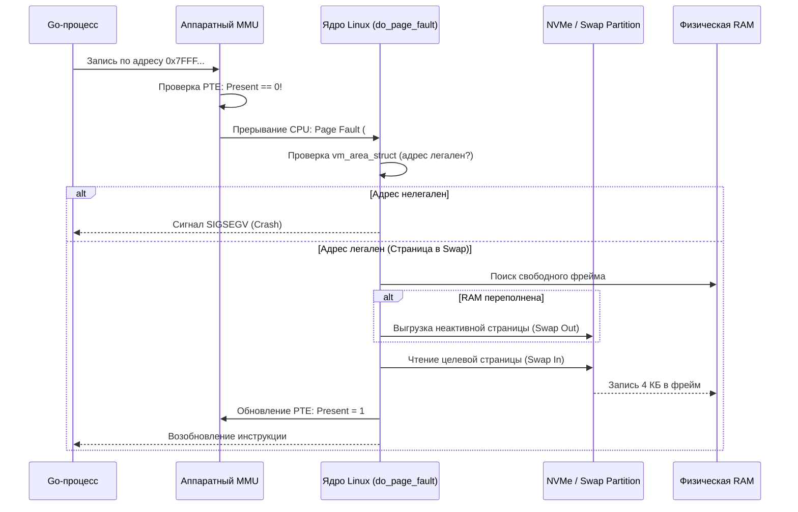

## Виртуальная память: от абстракции к страницам

> *«Компьютер похож на рабочий стол: физическая память — это его столешница, а своп — картотека в подвале. Если вы вместо работы весь день бегаете вверх и вниз по лестнице — поздравляем, вы открыли для себя трэшинг».*    
> — Физическая модель иерархии хранения

В предыдущей статье [[16. Copy On Write. Почему fork не копирует всю память сразу]] мы увидели, как виртуальная память дарит каждому процессу иллюзию единоличного владения всем адресным пространством компьютера.

Но что происходит, когда реальные процессы начинают требовать больше физической оперативной памяти, чем распаяно на материнской плате сервера? Как операционная система управляет этой нехваткой на аппаратном уровне, не позволяя системе рухнуть в первую же секунду?

Ответ лежит в двух взаимосвязанных механизмах ядра: **Paging (Постраничная организация памяти)** и **Swapping (Механизм подкачки страниц на диск)**.

Для бэкенд-инженера на Go понимание этой механики — граница между стабильным сервисом с предсказуемым p99 latency и ночным кошмаром, когда приложение внезапно перестает отвечать на сетевые запросы, а утилита `top` показывает 100% загрузку дискового ввода-вывода при нулевом полезном CPU.

---

## Paging: Механизм разбивки памяти

Страничная адресация (**Paging**) — это фундаментальный архитектурный принцип, разделяющий как виртуальное адресное пространство процесса, так и физическую оперативную память на стандартизированные блоки фиксированного размера:
- Физическая память делится на **кадры (Frames)**.
- Виртуальное пространство процесса делится на **страницы (Pages)**.

На распространенных архитектурах x86-64 и ARM64 базовый размер страницы составляет **4 Килобайта** (4096 байт). Современные серверные процессоры также аппаратно поддерживают **Huge Pages** (большие страницы размером 2 МБ и 1 ГБ), которые радикально сокращают размер таблиц страниц и снижают нагрузку на кэш TLB.

Золотое правило страничной адресации: **виртуальная страница не обязана быть непрерывно привязана к физическому кадру RAM**. Она может отображаться на любой свободный фрейм в памяти, либо временно находиться в состоянии «отсутствия» (not present), располагаясь на NVMe-диске в swap-разделе.

> [!info] Под капотом
> Почему именно 4 КБ? Это компромисс между эффективностью использования памяти и размером таблиц страниц. При размере страницы 4 КБ таблица страниц для 64-битного процесса (теоретически) занимала бы петабайты. Именно поэтому используются многоуровневые таблицы страниц (4-level или 5-level page tables), которые мы разберем в [[13. Страницы памяти и Page Table]].

---

## Page Table и аппаратное преобразование адресов

Когда процессор исполняет машинную инструкцию, обращающуюся по виртуальному адресу, блок **MMU (Memory Management Unit)** на кристалле CPU преобразует его в физический адрес.

Виртуальный адрес математически разбивается на две части:
1. **VPN (Virtual Page Number):** Индекс в иерархической таблице страниц процесса.
2. **Offset (Смещение):** Младшие 12 бит адреса ($2^{12} = 4096$), указывающие точное смещение байта внутри целевой 4-килобайтной страницы.

```
       ВИРТУАЛЬНЫЙ АДРЕС (48 бит)
 ┌──────────────────────────────────────┬──────────────────────┐
 │ VPN: Индекс в таблице страниц (PTE)   │ Offset: 12 бит (0..4095)
 └──────────────────┬───────────────────┴──────────┬───────────┘
                    │                              │
                    ▼                              │
         ┌─────────────────────┐                   │
         │ Таблица страниц PTE │                   │
         │ Physical Frame #    │                   │
         └──────────┬──────────┘                   │
                    │                              │
                    ▼                              ▼
 ┌──────────────────────────────────────┬──────────────────────┐
 │ Physical Frame Number                │ Offset (Без изменений)
 └──────────────────────────────────────┴──────────────────────┘
       ФИЗИЧЕСКИЙ АДРЕС В ОПЕРАТИВНОЙ ПАМЯТИ DRAM
```

MMU находит запись в таблице страниц — **Page Table Entry (PTE)**. Запись PTE хранит:
- **Physical Frame Number:** Базовый физический адрес кремниевой ячейки в RAM.
- **Битовые флаги состояния:**
  - `Present`: находится ли страница в физической RAM прямо сейчас.
  - `R/W`: флаг прав доступа (0 — Read-Only, 1 — Read/Write).
  - `U/S`: уровень привилегий (User-mode Ring 3 или Kernel-mode Ring 0).
  - `Accessed`: выставляется процессором при любом чтении страницы (используется алгоритмами LRU ядра).
  - `Dirty`: выставляется процессором при любой модификации данных (сигнал ядру, что страницу нужно сбросить на диск перед выселением).

Если бит `Present` равен `0`, процессор не может продолжить операцию и генерирует исключение — **Page Fault**.

> [!tip] Собеседование: Разница между Page Table и TLB
> **Вопрос:** Чем принципиально отличается Page Table от TLB?
> 
> **Ответ архитектора:**  
> - **Page Table (Таблица страниц):** Это полновесная древовидная структура данных, хранящаяся в **оперативной памяти (DRAM)**. Она содержит исчерпывающее отображение всех виртуальных страниц процесса на физические кадры. Обход таблицы страниц процессором требует от 50 до 150 наносекунд.
> - **TLB (Translation Lookaside Buffer):** Это миниатюрный аппаратный кэш на кристалле кремния внутри CPU (уровня L1/L2), хранящий всего несколько сотен или тысяч недавно вычисленных трансляций. Поиск в TLB происходит параллельно за **0.5–1 такт CPU**.  
> Промах по TLB (TLB Miss) приводит к аппаратному обходу таблицы страниц в RAM (Page Walk). Но даже это в сотни раз быстрее, чем считывание страницы с диска!

---

## Page Fault: Когда страница «теряется»

Прерывание **Page Fault** (исключение вектора #14 в архитектуре x86) — это не аварийный сбой программы, а штатный диспетчерский механизм виртуальной памяти ядра.

Ядро классифицирует сбои страниц на три типа:

1. **Valid Page Fault (Soft / Minor Page Fault):**  
   Страница легально выделена процессу, но физический фрейм еще не привязан (отложенная аллокация Demand Paging в Go) либо данные уже находятся в памяти в системном дисковом кэше Page Cache. Ядро просто прописывает физический адрес в PTE и ставит бит `Present = 1`. Задержка: **доли микросекунды**.
2. **Invalid Page Fault (Hard Page Fault / Ошибка сегментации):**  
   Процесс попытался прочитать или записать по невалидному адресу (разыменование `nil`, выход за границы аллокации). Ядро не находит соответствующей структуры `vm_area_struct` и немедленно прибивает процесс сигналом аварийной остановки `SIGSEGV` (Segmentation Violation).
3. **Protection Fault:**  
   Попытка записи в страницу, доступную только для чтения (константные строки, сегмент кода `.text`, страницы CoW при `fork()`). Ядро либо инициирует копирование страницы (CoW), либо завершает нарушителя.



---

## Swapping: Вытеснение на диск

Когда приложения требуют больше физической оперативной памяти, чем доступно в системе, фоновый демон ядра `kswapd` активирует механизм вытеснения — **Swapping**.

Ядро делит страницы памяти на активные и неактивные (через очереди LRU: Active List и Inactive List). Неактивные анонимные страницы процесса (куча, стек) сбрасываются на накопитель в специальный раздел или файл подкачки — **Swap (Pagefile)**, а освободившиеся фреймы RAM отдаются более активным задачам.

### Почему Swap убивает производительность бэкенда?

Взгляните на физические задержки оборудования:
- **Чтение из RAM:** $\sim 60	ext{--}100	ext{ нс}$ (наносекунд).
- **Чтение с быстрого NVMe SSD:** $\sim 50	ext{--}100	ext{ мкс}$ (микросекунд, в 1 000 раз медленнее!).
- **Чтение со старого HDD:** $\sim 5	ext{--}10	ext{ мс}$ (миллисекунд, в 100 000 раз медленнее!).

Когда поток обращается к странице, вытесненной в swap, процессор останавливается, а ядро переводит поток в непрерываемый сон (`TASK_UNINTERRUPTIBLE`). 

Для высоконагруженного Go-сервиса, обрабатывающего тысячи запросов в секунду, даже несколько сотен таких вызовов в секунду приводят к **катастрофическим задержкам (p99/p999 spikes)**, накоплению очередей и каскадному падению всего кластера.

> [!warning] Ловушка / Gotcha: Swap — это не спасательный круг
> Swap не является «дополнительной бесплатной памятью». 
> Если сервер испытывает системный дефицит RAM, включенный swap лишь продлевает агонию: вместо быстрого и чистого падения одного пода с понятной ошибкой OOM-Killer и его мгновенного перезапуска в Kubernetes, вся нода погружается в кому на десятки минут.
> 
> В современных высокопроизводительных окружениях swap либо полностью отключают командой `swapoff -a`, либо жестко ограничивают агрессивность сброса через системный параметр `vm.swappiness`.

---

## Thrashing: Когда память превращается в узкое место

**Thrashing (Трэшинг памяти)** — это катастрофическое состояние операционной системы, когда ядро тратит 99% всего времени процессора и шины ввода-вывода на непрерывное перекладывание страниц из RAM на диск и обратно, при этом полезная работа приложений падает практически до нуля.

### Симптомы наступления Thrashing:
1. В утилите `vmstat 1` счетчики страниц подкачки `si` (swap in) и `so` (swap out) исчисляются тысячами и непрерывно растут.
2. В утилите `iostat -x 1` процент утилизации диска `%util` подскакивает до 100%, а задержка ввода-вывода `await` вырастает с 0.5 мс до сотен миллисекунд.
3. Метрика Load Average подскакивает до десятков единиц, но утилизация процессора приложениями стремится к 0%: ядра заблокированы в очереди I/O Wait.

---

## Go и Paging/Swapping: Специфика рантайма

Среда выполнения Go спроектирована с глубоким пониманием механики виртуальной памяти:

1. **Выделение кучи через `mmap`:**  
   Рантайм Go не использует устаревшие вызовы `brk`/`sbrk`. Он резервирует виртуальные арены через системный вызов `mmap` блоками по 64 МБ. Поэтому виртуальный размер процесса (VSS/VSZ) может быть колоссальным, в то время как реально используемый объем физической памяти (RSS) остается небольшим.
2. **Сборщик мусора GC исторически ничего не знает о swap:**  
   Сборщик мусора Go триггерится соотношением выделенной кучи (параметр `GOGC=100`), но он не может знать, что ядро Linux уже вытеснило половину неактивной кучи в swap-файл!  
   Если GC начнет сканировать выгруженные страницы кучи, он спровоцирует лавину Major Page Faults, и сборка мусора растянется с 1 миллисекунды до нескольких секунд.
3. **`GOMEMLIMIT` (Введено в Go 1.19+):**  
   Это главный ответ создателей языка на проблемы Paging и OOM-киллера. Параметр `GOMEMLIMIT` задает мягкий потолок памяти. Сборщик мусора начинает работать проактивно и агрессивно ужимать кучу по мере приближения к лимиту контейнера, предотвращая вытеснение страниц в swap и защищая сервис от фатального убийства ядром по OOM.

```go
package main

import (
	"fmt"
	"runtime/debug"
)

func setupMemoryLimits() {
	// Устанавливаем мягкий лимит памяти в 2 ГБ через debug.SetMemoryLimit.
	// Это заставляет GC Pacer Go агрессивно очищать память при приближении
	// к порогу, исключая деградацию в swap и вылет по OOM-killer!
	const memoryLimit = 2 * 1024 * 1024 * 1024 // 2 GiB
	debug.SetMemoryLimit(memoryLimit)

	// Проверяем текущее значение лимита
	fmt.Printf("Go runtime Memory Limit: %d bytes
", debug.MemoryLimit())
}

func main() {
	setupMemoryLimits()
	// Основная логика высоконагруженного бэкенда...
}
```

> [!tip] Собеседование: Динамический стек горутин и Paging
> **Вопрос:** Как рантайм Go распределяет память между горутинами и как это связано со страничной организацией памяти?
> 
> **Ответ:** Каждая горутина создается со стеком размером всего **2 КБ** (меньше одной стандартной 4 КБ страницы!).  
> При вызове функций компилятор вставляет проверку пролога стека (`morestack`). Если стек переполняется, рантайм Go аллоцирует новый непрерывный блок памяти в два раза большего размера в куче, копирует старый стек и обновляет указатели.  
> Это избавляет Go от необходимости резервировать 8 МБ под каждый поток ОС, как это делает libc, и защищает ядро от напрасной траты страниц памяти и накладных расходов на `perf` и `strace`.

---

## Как мониторить и контролировать swap в продакшене

Для Senior/Lead инженера контроль swap и страничных отказов — обязательная часть метрик Service Level Objective (SLO).

### 1. Системные команды и procfs:
```bash
# Просмотр оперативной памяти и swap в человекочитаемом виде
free -h

# Просмотр активных разделов подкачки
swapon -s

# Проверка коэффициента склонности ядра к свопингу (0..100 или 0..200 в новых ядрах)
cat /proc/sys/vm/swappiness

# Полное отключение swap на production-ноде Kubernetes (требует root)
sudo swapoff -a
```

### 2. Метрики Prometheus и node_exporter:
В системах мониторинга отслеживают счетчики:
- `node_vmstat_pswpin` / `node_vmstat_pswpout`: скорость подкачки страниц в секунду. Любое ненулевое значение под нагрузкой — тревожный сигнал.
- `node_vmstat_pgfault` / `node_vmstat_pgmajfault`: соотношение Minor и Major Page Faults. Всплеск Major Faults всегда коррелирует с просадкой p99 latency.

### 3. Диагностика в Go:
Внутри приложения метрики памяти проверяются через `runtime.ReadMemStats()`:
- Разрыв между `runtime.ReadMemStats().Sys` (объем виртуальной памяти, запрошенной у ядра) и `runtime.ReadMemStats().HeapAlloc` (реально занятой объектами) показывает степень фрагментации и объем пулов арены.
- В контейнерах Kubernetes лимиты задаются через `resources.limits.memory`. При превышении лимита ядро Linux посылает контейнеру бескомпромиссный сигнал `SIGKILL` (OOMKilled).
- **Huge Pages и оптимизация:** Для latency-critical сервисов (торговые системы, базы данных) включают Huge Pages через вызов `madvise` с флагом `MADV_HUGEPAGE` или запускают процесс с привязкой через `numactl`, снижая TLB misses на 10-30%.

> [!warning] Ловушка / Gotcha: RSS vs VSZ
> Никогда не ориентируйтесь на показатель **VSZ (Virtual Size)** в утилите `ps`!  
> `VSZ` включает все зарезервированные диапазоны `mmap`, динамические библиотеки и файлы.  
> Реальный физический объем потребляемой процессом оперативной памяти отражает только **`RSS` (Resident Set Size)**!  
> Если `VSZ` Go-сервиса равен 10 ГБ, а `RSS` составляет всего 120 МБ — процесс совершенно здоров: он просто зарезервировал виртуальное адресное пространство аренами через `mmap` с флагами `MAP_ANONYMOUS | MAP_PRIVATE`.

---

## Итог

1. **Paging** делит физическую память на кадры, а виртуальное пространство — на страницы по **4 КБ**, устраняя внешнюю фрагментацию RAM.
2. **Page Table** связывает виртуальные страницы с физическими фреймами, а блок **MMU** кэширует трансляции в сверхбыстром аппаратном кэше **TLB**.
3. **Swapping** выгружает неактивные анонимные страницы на диск. Из-за колоссальной разницы в задержках между DRAM и SSD активный свопинг неизбежно ввергает систему в **Thrashing**.
4. **В продакшене** на серверах баз данных и узлах Kubernetes swap отключают (`swapoff -a`), либо жестко лимитируют через `vm.swappiness`.
5. **В языке Go** всегда настраивайте мягкий лимит памяти через переменную окружения `GOMEMLIMIT` или вызов `debug.SetMemoryLimit`, а в метриках мониторинга отслеживайте счетчики `pswpin/pswpout` и Major Page Faults.

Мы разобрали, как ядро оперирует страницами и свопом. Но как прикладные программы создают произвольные отображения файлов на память и делят адресное пространство без системных вызовов read/write? В следующей статье мы разберем мощнейший инструмент POSIX: [[18. mmap. Отображение файлов и памяти]].
