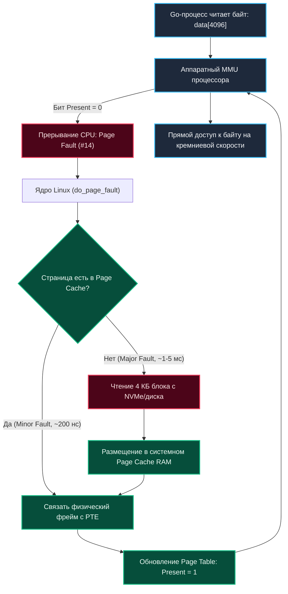

## Что такое mmap и зачем это нужно

> *"The fastest I/O is the I/O you never perform. The next fastest is letting the hardware MMU do the reading for you."*  
> — Золотое правило высокопроизводительных систем хранения

Традиционный ввод-вывод в Unix через системные вызовы `read()` и `write()` напоминает заказ книги через курьера:
1. Вы вызываете `read(fd, buf, len)`, и процессор совершает тяжелый переход из User Space в ядро (Ring 0).
2. Драйвер файловой системы считывает блок с диска в системный буфер ядра (**Page Cache**).
3. Затем ядро физически копирует эти байты из памяти ядра в пользовательский буфер `buf` вашей программы.
4. Процессор переключается обратно в Ring 3.

Для чтения миллиона записей вам придется совершить миллион системных вызовов и дважды скопировать каждый байт через шину памяти!

Механизм **`mmap` (Memory-Mapped Files, отображение файлов в память)** предлагает радикально иное решение. Он ломает стену между файлом на диске и памятью процесса: вместо копирования данных `mmap` отображает файл напрямую в виртуальное адресное пространство вашей программы.

Программа начинает работать с файлом на диске точно так же, как с обычным срезом байт в оперативной памяти: `data[42] = 0xAA`.

Для Senior/Lead бэкенд-инженера `mmap` — это фундамент уровня `System Design`:
- **Высоконагруженные встраиваемые базы данных:** BoltDB (`bbolt`), LMDB, SQLite, RocksDB используют `mmap` для прямого O(1) чтения B-деревьев и WAL-журналов без выделения памяти в куче.
- **Межпроцессное взаимодействие (Zero-Copy IPC):** Несколько независимых процессов могут отобразить один и тот же файл через флаг `MAP_SHARED` и обмениваться данными со скоростью оперативной памяти.
- **Обработка гигантских датасетов:** Загрузка логов, индексных деревьев или моделей машинного обучения на 100 ГБ на сервере с 16 ГБ RAM без страха перед OOM.

---

## Как mmap работает под капотом

Когда процесс вызывает системный вызов `mmap()`, ядро Linux **не загружает файл в оперативную память немедленно**. 

Вместо этого ядро совершает быструю мета-операцию: оно выделяет структуру `vm_area_struct` (VMA) в виртуальном адресном пространстве процесса и привязывает ее к дескриптору открытого файла `struct file`. Таблица страниц (`Page Table`) заполняется пустыми записями с флагом `Present = 0`.



> [!info] Под капотом
> В Linux структура `vm_area_struct` описывает отображение. Флаг `VM_FILE` указывает, что backing store — это `struct file`. При первом обращении к адресу происходит **Page Fault**. Ядро ловит его, находит соответствующий блок файла в `[[42. Буферизация IO и Page Cache]]`, загружает страницу (обычно 4 КБ) в физическую память и обновляет `Page Table`. Последующие обращения к этой странице выполняются за несколько тактов CPU без участия дисковой подсистемы.

---

## Идиоматичное использование в Go

В среде разработчиков Go нередко циркулирует заблуждение о существовании абстрактного метода `os.File.Mmap`. Однако стандартная библиотека языка Go (`os.File`) намеренно **не содержит** встроенного метода `os.File.Mmap`. Создатели языка посчитали этот механизм слишком платформенно-зависимым и вынесли его в низкоуровневые пакеты.

Для промышленной работы с `mmap` в Go используются системные пакеты `syscall` и `golang.org/x/sys/unix`, либо проверенные библиотеки уровня `github.com/edsrzf/mmap-go`:

```go
package main

import (
	"bytes"
	"fmt"
	"log"
	"os"
	"syscall"
)

func main() {
	// 1. Создаем тестовый файл с данными
	f, err := os.CreateTemp("", "mmap-demo-*")
	if err != nil {
		log.Fatalf("create temp error: %v", err)
	}
	defer os.Remove(f.Name())
	defer f.Close()

	initialData := []byte("Hello, mmap under the hood! Zero-copy is awesome.")
	if _, err := f.Write(initialData); err != nil {
		log.Fatalf("write error: %v", err)
	}

	// 2. Отображаем файл в память через системный вызов
	// PROT_READ | PROT_WRITE: разрешаем чтение и запись
	// MAP_SHARED: изменения синхронизируются с файлом на диске и видны другим процессам
	mmapData, err := syscall.Mmap(
		int(f.Fd()),
		0,
		len(initialData),
		syscall.PROT_READ|syscall.PROT_WRITE,
		syscall.MAP_SHARED,
	)
	if err != nil {
		log.Fatalf("mmap error: %v", err)
	}
	defer func() {
		// Обязательно освобождаем отображение при завершении работы!
		if err := syscall.Munmap(mmapData); err != nil {
			log.Printf("munmap error: %v", err)
		}
	}()

	// 3. Читаем данные напрямую как срез байт ([]byte)
	fmt.Printf("Original content: %s
", string(mmapData))

	// 4. Модифицируем файл напрямую через срез в памяти БЕЗ вызова write()!
	copy(mmapData[7:], []byte("world! Overhead: 0 syscalls."))

	fmt.Printf("Modified content: %s
", string(mmapData))

	// 5. Принудительный сброс измененных dirty-страниц на диск (msync)
	// В фоне ядро сбрасывает страницы асинхронно через pdflush/flusher threads,
	// но для надежности баз данных (WAL, транзакции) вызов MS_SYNC обязателен!
	_, _, errno := syscall.Syscall(
		syscall.SYS_MSYNC,
		uintptr(unsafe.Pointer(&mmapData[0])),
		uintptr(len(mmapData)),
		uintptr(syscall.MS_SYNC),
	)
	if errno != 0 {
		log.Fatalf("msync failed: %v", errno)
	}
}
```

> [!tip] Собеседование: Обертки mmap и системные флаги
> **Вопрос:** Чем гипотетический `os.File.Mmap` отличается от низкоуровневого `golang.org/x/sys/unix.Mmap`?
> 
> **Ответ:** Стандартный пакет `os` не включает API маппинга, чтобы не связывать руки разработчикам платформенными ограничениями (например, Win32 `CreateFileMapping` vs POSIX `mmap`).  
> Пакет `golang.org/x/sys/unix` (или обертка `github.com/edsrzf/mmap-go`) дает абсолютный контроль над системными флагами ядра:
> - `MAP_SHARED`: запись изменяет файл на диске и видна всем процессам (основа IPC и баз данных).
> - `MAP_PRIVATE`: режим Copy-On-Write (COW). Запись не меняет исходный файл на диске, а выделяет локальную копию страницы в RAM.
> - `MAP_ANONYMOUS`: выделение чистой памяти ядра без привязки к файлу (используется аллокатором Go для кучи).
> - `PROT_EXEC`: разрешение исполнения машинного кода (используется JIT-компиляторами).

---

## Механика и производительность (Mechanical Sympathy)

### Page Faults и реальная стоимость доступа
`mmap` не является серебряной пулей. Стоимость чтения байта зависит от того, где находится страница:
1. **Cache Hit (Страница в Page Cache):** Прямое чтение из физической RAM со скоростью процессорного кэша: **~5–10 наносекунд**.
2. **Minor Page Fault:** Страница уже в памяти, но не привязана к PTE: **~200–500 наносекунд**.
3. **Major Page Fault:** Данных в оперативной памяти нет. Поток блокируется в ядре, инициируя аппаратное чтение с накопителя: **~50–100 микросекунд** на NVMe или **~5–10 миллисекунд** на классическом HDD!

Если вы мапите файл размером 500 ГБ на машине с 16 ГБ RAM и начинаете хаотично читать случайные байты (Random Access), система утонет в **Thrashing** — процессор будет непрерывно простаивать в ожидании дисковых прерываний.

### Влияние на процессорный кэш и TLB
- `mmap` оперирует стандартной дискретностью в **4 КБ** (или большими страницами `hugepages` по 2 МБ/1 ГБ при флаге `MAP_HUGETLB`).
- Случайный доступ по огромному отображению мгновенно выбивает горячие строки из аппаратного кэша трансляций **TLB**. Потери от частых промахов TLB могут снизить общую производительность на 15–20%.

### Взаимодействие со сборщиком мусора Go (GC)
Области памяти, полученные через `mmap`, находятся **за пределами управляемой кучи Go (Heap)**: они не аллоцируются через внутренний аллокатор `malloc` / `mallocgc` рантайма Go и полностью исключены из дерева объектов GC. 
- **Плюс:** Сборщик мусора Go полностью игнорирует эти гигабайты памяти при сканировании корней, не создавая накладных расходов на фазы STW (Stop-The-World).
- **Минус:** Рантайм Go не может автоматически освободить эту память. Если ваш сервис не вызовет `Munmap`, память будет удерживаться до завершения процесса.

---

## Ловушки и граничные кейсы

> [!warning] Ловушка / Gotcha: Четыре смертельных ловушки mmap
> 1. **Сигнал `SIGBUS` при усечении файла:**  
>    Если другой процесс или скрипт усечет файл (`ftruncate`) в тот момент, когда ваша Go-программа попытается прочитать байты за пределами новой длины файла, ядро Linux не вернет ошибку Go — оно отправит процессу смертоносный сигнал **`SIGBUS` (Bus Error)**, моментально убивающий всё приложение!
> 2. **Сигнал `SIGSEGV` при выходе за границы:**  
>    Попытка чтения за пределами размера отображения приводит к классическому `SIGSEGV`. `mmap` никогда не расширяет файлы автоматически при записи.
> 3. **Неявная синхронизация и потеря данных:**  
>    Вызов `msync()` не требуется для немедленной видимости изменений другим процессам. Однако ядро сбрасывает грязные страницы на диск асинхронно. Если сервер внезапно потеряет питание, данные, записанные в память за последние несколько секунд, испарятся! Для финансовых транзакций и WAL-журналов вызов `MS_SYNC` строго обязателен.
> 4. **Лимиты виртуальной памяти:**  
>    Отображение файла на 100 ГБ моментально увеличивает показатель `Virtual Memory` процесса на 100 ГБ. Если на сервере установлен лимит `ulimit -v`, вызов `mmap` завершится ошибкой `ENOMEM`.

---

## Сравнение с read/write и альтернативы

| Критерий | Традиционные `read()` / `write()` | Системный вызов `mmap()` |
|---|---|---|
| **Количество системных вызовов** | Высокое (системный вызов на каждый буфер) | Всего один вызов `mmap` и один `munmap` |
| **Копирование данных в RAM** | Двойное: Диск $	o$ Page Cache $	o$ User Buffer | **Zero-Copy**: Прямой доступ к Page Cache |
| **Случайный доступ (Random Access)** | Катастрофически медленный (`lseek` + `read`) | Идеальный: $O(1)$ по смещению указателя |
| **Потребление оперативной памяти** | Строго контролируемый фиксированный буфер | Эластичный Page Cache (риск Major Page Fault) |
| **Нагрузка на Garbage Collector Go** | Создает аллокации буферов в куче | **0% нагрузки на GC** (память вне кучи Go) |

Для последовательного потокового чтения огромных лог-файлов связка `read()` с пакетом `bufio` часто оказывается быстрее и безопаснее благодаря линейной предвыборке ОС (readahead). Но если вам требуется произвольный случайный доступ к терабайтной базе данных — альтернатив `mmap` в архитектуре POSIX не существует.

---

## Вопросы с собеседований

> [!tip] Собеседование: Вопросы по mmap уровня Senior
> **Q1: Как `mmap` влияет на производительность Go-приложения по сравнению с вызовом `ioutil.ReadFile` / `os.ReadFile`?**  
> **A:** `os.ReadFile` (ранее `ioutil.ReadFile`) выделяет в куче Go буфер под полный размер файла и копирует в него данные через системный вызов `read`. Для файла размером 2 ГБ это вызовет огромный скачок RSS и колоссальную нагрузку на сборщик мусора. `mmap` исключает промежуточное копирование (Zero-Copy) и не нагружает GC. Однако если файл не помещается в RAM, `ReadFile` работает предсказуемо, тогда как `mmap` может спровоцировать шторм Major Page Faults.
> 
> **Q2: Почему `mmap` с флагом MAP_SHARED нестабильно работает на сетевых файловых системах (NFS, SMB)?**  
> **A:** `mmap` опирается на локальный страничный кэш ядра VFS. Сетевые файловые системы не могут обеспечить мгновенную аппаратную когерентность страниц памяти между независимыми физическими серверами без огромных сетевых задержек.
> 
> **Q3: Как освободить память mmap без закрытия файла?**  
> **A:** Вызовом `file.Munmap(buf)` (или системным вызовом `syscall.Munmap`). Это удаляет отображение из `Page Table`, освобождая виртуальные адреса. Сами физические страницы могут еще некоторое время удерживаться ядром в Page Cache для ускорения будущих обращений.
> 
> **Q4: В чем кардинальная разница между `MAP_SHARED` и `MAP_PRIVATE`?**  
> **A:** `MAP_SHARED` транслирует любые записи в отображение напрямую в underlying-файл на диске и делает их мгновенно видимыми всем процессам. `MAP_PRIVATE` реализует семантику **Copy-On-Write (COW)**: файл используется только как исходный шаблон для чтения, а при первой же записи ядро создает приватную копию страницы в RAM, защищая файл на диске от изменений.

---

## Итог

1. **`mmap`** превращает файл на диске в плоский массив байт в памяти, исключая двойное копирование через системные вызовы `read()` и `write()`.
2. Под капотом механизм опирается на структуры `vm_area_struct`, страничный кэш ядра Linux (**Page Cache**) и аппаратные прерывания **Page Fault**.
3. Память `mmap` находится вне кучи Go, не нагружая сборщик мусора GC, что делает ее идеальной базой для сверхбыстрых хранилищ данных (BoltDB, RocksDB, LMDB).
4. Остерегайтесь усечения файлов другими процессами: выход за реальные физические границы файла карается мгновенным падением процесса от сигнала `SIGBUS`.
5. Для надежной фиксации данных на диске всегда используйте синхронизацию через `msync(MS_SYNC)`.

Мы досконально изучили отображение файлов и памяти. Но как эти виртуальные страницы складываются в общую анатомию процесса? Где заканчивается стек, где начинается куча и как они сосуществуют? В следующей статье мы разберем: [[19. Сегментация памяти процесса. Stack, Heap, Data, Text]].
