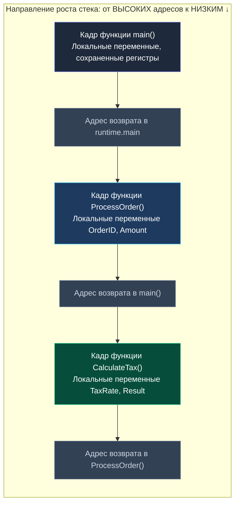
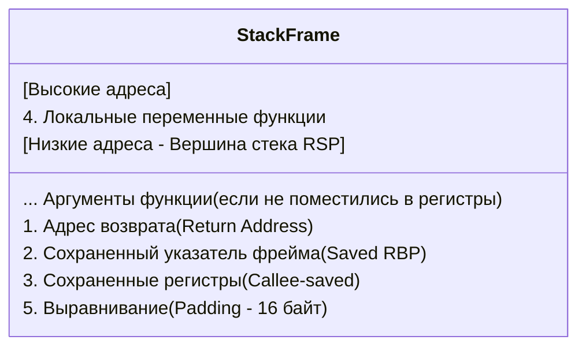
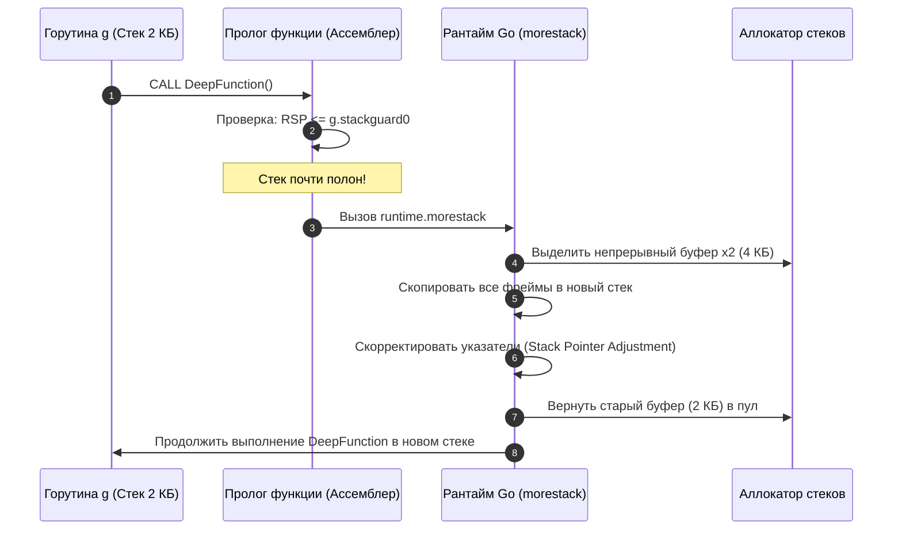

Начнем с фундаментального механизма, без которого невозможно понимание ни работы процессора, ни планировщика горутин, ни даже обычного `panic`. Стек вызовов — это не абстракция языка, а физический регион памяти, управляемый напрямую CPU и ядром ОС.

> *"Программирование — это управление сложностью. А стек — это самый изящный способ управлять сложностью вложенных вычислений, придуманный человечеством."*

Если оперативную память процесса представить как огромный склад, то куча (Heap) — это беспорядочные стеллажи долгосрочного хранения, а стек вызовов (Call Stack) — это блокнот инженера, где каждая новая страница кладется поверх предыдущей, а при завершении дела немедленно отрывается и выбрасывается. Здесь нет пауз на уборку мусора и нет поиска свободных блоков: память выделяется и освобождается ровно за один такт процессора.

---

## 📚 1. Что такое стек вызовов и зачем он нужен

Стек вызовов (Call Stack) — это область оперативной памяти, организованная по принципу LIFO (Last In, First Out — последним пришел, первым ушел). Его главная задача — отслеживать активные функции в программе и передавать управление между ними.

Когда функция вызывает другую, текущее состояние сохраняется в **кадре функции** (Stack Frame), указатель стека сдвигается, и управление передается новой функции. При возврате кадр удаляется, и управление возвращается туда, где оно было прервано.

В Go это особенно важно, потому что каждая горутина (`g`) имеет свой собственный стек, который динамически растет и сжимается. В отличие от C или Java, где стек треда фиксирован, Go использует сегментированный стек (исторически split stacks, а сегодня — динамически расширяемый непрерывный стек), что кардинально меняет подход к рекурсии, памяти и профилированию.



---

## 🧱 2. Устройство кадра функции (Stack Frame)

Каждый кадр функции содержит строго упорядоченные данные. Расположение полей зависит от ABI (Application Binary Interface), но для x86_64 Linux (System V ABI) структура выглядит так:



1. **Адрес возврата (Return Address)** — куда прыгать после завершения функции. Инструкция `CALL` неявно заносит этот 8-байтный адрес в стек перед прыжком к коду вызываемой функции.
2. **Аргументы функции** — передаются через регистры (`RDI`, `RSI`, `RDX`, `RCX`, `R8`, `R9`), а при их нехватке — через стек. В современном Go (начиная с Go 1.17+ с регистровым ABIInternal) аргументы также передаются в регистрах общего назначения (`RAX`, `RBX`, `RCX`, `RDI`, `RSI`, `R8`, `R9` и др.), снижая нагрузку на стек.
3. **Локальные переменные** — выделяются в нижней части кадра.
4. **Сохраненные регистры (Callee-saved)** — `RBX`, `RBP`, `R12-R15`, `RSP` (в некоторых случаях). По соглашению вызовов, если функция намерена использовать эти регистры, она обязана сохранить их исходные значения в своем стеке и восстановить перед выходом.
5. **Выравнивание (Padding)** — для кэш-линий (обычно 16 байт) и выравнивания стека к границе 16 байт (требуется для SSE/AVX инструкций).

> [!info] Под капотом
> В Go компилятор (`gc`) активно оптимизирует кадр функции. Если локальная переменная не покидает функцию, она может быть вынесена в регистры процессора (`RAX`, `RSP`, `RBP` и др.). Если переменная должна "эскейпить" на кучу (например, возвращается указатель), компилятор генерирует вызов `runtime.newobject` и убирает аллокацию из стека.

---

## ⚙️ 3. Под капотом: x86_64, регистры и инструкция CALL/RET

На уровне процессора стек растет вниз (от высоких адресов к низким). Указатель на вершину стека хранится в регистре `RSP`. Рамка кадра часто отслеживается через `RBP` (Frame Pointer), но в Go по умолчанию используется оптимизация `-fomit-frame-pointer` (хотя в современных версиях рантайма `RBP` сохраняется для поддержки внешних профилировщиков вроде Linux `perf` и eBPF).

При вызове функции в Go компилятор генерирует ассемблерный код, который можно увидеть через `go build -gcflags="-S"`. Базовый сценарий:

```asm
; Вызов функции
CALL func_name          ; 1. PUSH адрес возврата в RSP
                        ; 2. JMP на func_name

; Внутри func_name
SUBQ $16, RSP           ; Выделяем 16 байт под локальные переменные
MOVQ $0, 8(RSP)         ; Инициализация локальной переменной
...
ADDQ $16, RSP           ; Освобождаем кадр
RET                     ; POP адрес возврата, JMP на него
```

**Mechanical Sympathy:** Каждый `SUBQ`/`ADDQ` — это запись в L1/L2 кэш. Если стек "прыгает" по разным кэш-линиям, возникает cache miss. Вот почему компиляторы стараются держать часто используемые переменные в регистрах. Переключение контекста внутри стека (вызов/возврат) обходится в ~5-15 тактов CPU, что значительно дешевле системного вызова, но критично в горячих путях.

Благодаря тому, что текущий стек почти всегда горяч и прогрет в L1d кэше процессора, чтение и запись локальных переменных занимают всего 1–3 такта (доли наносекунды).

---

## 🚀 4. Go и его уникальный подход к стеку

В C/C++ или Java размер стека треда фиксирован (обычно 1-8 МБ). Переполнение приводит к `Stack Overflow` или `SIGSEGV`.

В Go стек горутин (`g.stack`) **динамический**. Он стартует с малого размера (например, 2-4 КБ на 64-битной системе) и автоматически растет при вызове функций. Если места не хватает, планировщик выделяет новый, больший блок памяти и копирует туда данные. Это позволяет Go запускать сотни тысяч горутин без краша.



### Escape Analysis: кто остается на стеке, а кто идет в кучу?
Компилятор Go проводит строгий статический анализ побега (Escape Analysis), решая, безопасно ли оставить объект в стековом фрейме.

```go
package main

import "fmt"

// Эта функция НЕ вызывает эскейп-анализ, локальные переменные остаются в стеке
func stackLocal() {
	var buffer [1024]byte
	fmt.Println(len(buffer))
}

// Эта функция ВЫЗЫВает эскейп-анализ. Указатель на локальную переменную
// уходит за пределы функции, поэтому компилятор переместит её в кучу.
func heapEscape() []byte {
	var buffer [1024]byte
	return buffer[:]
}

func main() {
	stackLocal()
	heapEscape()
}
```

Запустите `go build -gcflags="-m" main.go` и вы увидите:
```text
main.heapEscape: leaking params: buffer to heap
```

Компилятор видит, что срез `buffer[:]` возвращается вызывающей стороне. Если бы буфер остался на стеке функции `heapEscape`, то сразу после инструкции `RET` его память была бы перезаписана следующим вызовом, что привело бы к повреждению памяти (Use-After-Free). Поэтому компилятор перемещает его в управляемую кучу.

> [!warning] Ловушка / Gotcha
> В Go нет гарантированной оптимизации хвостовой рекурсии (Tail Call Optimization). Компилятор `gc` не делает её автоматически. Глубокая рекурсия в Go все еще может съесть память, так как каждый вызов может спровоцировать рост стека. При достижении лимита (обычно 1 ГБ на горутина в современных версиях) произойдет `fatal error: stack overflow`. Это не SIGSEGV, а контролируемое завершение через panic.

---

## 📊 5. Сравнение с другими языками и ловушки

| Аспект | C / C++ | Java / .NET | Go |
|--------|---------|-------------|-----|
| **Размер стека** | Фиксирован (указан при создании треда) | Фиксирован (`-Xss`) | Динамический, растет/сжимается автоматически |
| **Переполнение** | `SIGSEGV` (краш процесса) | `StackOverflowError` (runtime exception) | `fatal error: stack overflow` (panic + goroutine dump) |
| **Frame Pointer** | Часто отключен (`-fomit-frame-pointer`) | Включен по умолчанию для отладки | Отключен по умолчанию для скорости. Включается через `GOEXPERIMENT=framepointer` |
| **Хвостовая рекурсия** | Опционально (`-O2`, `-O3`) | Не поддерживается | Не поддерживается |

> [!tip] Собеседование
> **Вопрос:** Почему в Go по умолчанию отключен frame pointer (`RBP`), и как это влияет на профилирование стека?
> **Ответ:** Отключение `RBP` освобождает регистр для использования и позволяет компилятору лучше оптимизировать выравнивание и аллокации. Однако это ломает классический способ разворачивания стека (walk stack via `RBP chain`). Go использует собственный механизм: в начале кадра сохраняется заголовок `stkblk`, который содержит ссылки на предыдущие кадры. Для отладки или `pprof` включается `GOEXPERIMENT=framepointer`, который восстанавливает цепочку `RBP` программно.

---

## 🎯 Итоги для Go-разработчика

1. **Стек — это не магия**, а физическая память, регистры CPU и ABI. Понимание `RSP`/`RBP` и порядка передачи аргументов критично для отладки `SIGSEGV` и `panic` трассировок.
2. **Динамический непрерывный стек:** Go использует динамический сегментированный стек для горутин. Это снимает проблему `Stack Overflow` на микроуровне, но вводит лимиты на рост (обычно ~1 ГБ).
3. **Escape Analysis решает судьбу аллокаций:** Escape Analysis решает, что лежит в стеке, а что в куче. Понимание этого критично для производительности: аллокации в стеке бесплатны (просто сдвиг `RSP`), аллокации в куче требуют работы GC.
4. **Профилирование стеков:** Фрейм-поинтер в Go часто отключен. Для анализа стека используйте `runtime.Stack()`, `pprof` или `GOEXPERIMENT=framepointer`, а не надейтесь на нативный `RBP chain`.
5. **Защита памяти:** В следующей статье мы разберем [[21. Переполнение стека и защита памяти]], где поговорим о guard pages, ASLR и том, как ОС физически защищает вас от случайного уничтожения стека.
