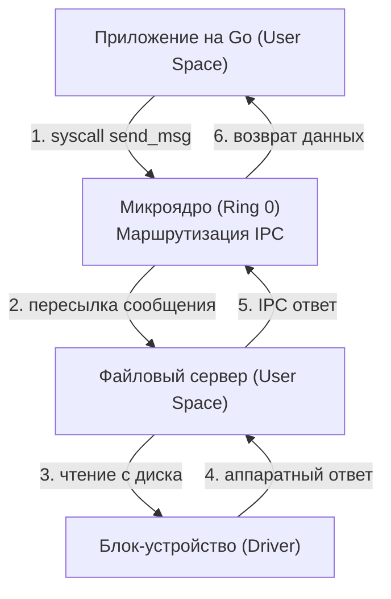

## Почему архитектура ядра определяет границы производительности

В январе 1992 года в сетевой телеконференции Usenet `comp.os.minix` разгорелся один из самых знаменитых и судьбоносных споров в истории компьютерных наук — спор между профессором Эндрю Таненбаумом и молодым финским студентом Линусом Торвальдсом.

Таненбаум, автор академической операционной системы Minix и признанный классик теории ОС, безапелляционно заявил: *«Linux устарел в день своего рождения. Проектировать монолитное ядро в 1991 году — фундаментальная ошибка. Будущее принадлежит микроядрам»*.  
Торвальдс парировал с обезоруживающей практичностью: *«Микроядра теоретически элегантны, но на практике чудовищно неэффективны из-за накладных расходов на передачу сообщений. Монолитное ядро дает максимальную скорость на реальном кремнии»*.

Прошло более трех десятилетий. Сегодня Linux управляет подавляющим большинством серверов мира, суперкомпьютеров из списка Top-500 и облачных дата-центров, на которых развернуты наши Go-микросервисы. Однако фундаментальные архитектурные развилки никуда не исчезли.

Ядро операционной системы — это не просто «драйвер для материнской платы». Это верховный менеджер ресурсов, определяющий, кто, когда и какой ценой получит доступ к процессорным ядрам, виртуальной памяти и сетевым шинам. 

Для Go-разработчика архитектура ядра целевой платформы напрямую диктует:
* Стоимость каждого системного вызова;
* Задержки переключения контекста;
* Внутреннее поведение примитивов синхронизации `sync.Mutex`;
* Работу сетевого поллера `netpoller` под нагрузкой в сотни тысяч соединений;
* Саму возможность легковесной контейнеризации в Docker и Kubernetes.

Рассмотрим три базовые парадигмы проектирования ядер: **Монолитную**, **Микроядерную** и **Гибридную**. Разберем, где физически живут системные службы, как они общаются и почему бэкенд на Go пустил столь глубокие корни именно в монолите Linux.

---

## Монолитное ядро (Monolithic Kernel)

В монолитной архитектуре **абсолютно все** ключевые подсистемы операционной системы скомпилированы в единый адресный образ и функционируют в привилегированном режиме процессора (**Ring 0 / Kernel Space**):
* Управление физической и виртуальной памятью;
* Планировщик потоков и процессов;
* Драйверы физических устройств;
* Диспетчер файловых систем (VFS, `ext4`, XFS, Btrfs);
* Полный сетевой стек `TCP/IP` и маршрутизация.

**Яркие представители:** Linux, FreeBSD, OpenBSD.

```
АРХИТЕКТУРА МОНОЛИТНОГО ЯДРА (LINUX):
+---------------------------------------------------------------+
| User Space (Ring 3): [Go App]  [Postgres]  [Nginx]            |
+-------------------------------+-------------------------------+
                                | (Единый переход: syscall)
+-------------------------------v-------------------------------+
| Kernel Space (Ring 0): Единое адресное пространство           |
|  +----------------------------------------------------------+ |
|  | VFS (ext4, xfs) <--- Прямой вызов функции ---> Драйвер   | |
|  |     |                                              ^     | |
|  |     v                                              |     | |
|  | Сетевой стек TCP/IP <--- Вызовы C ---> Планировщик CFS/EEVDF|
|  |     |                                              |     | |
|  |     +---------> Управление памятью (MMU/VM) <------+     | |
|  +----------------------------------------------------------+ |
+---------------------------------------------------------------+
| Hardware: CPU, RAM, NVMe SSD, Сетевая карта (NIC)             |
+---------------------------------------------------------------+
```

### Как это работает под капотом

Когда приложению нужно прочитать данные с диска через системный вызов `read()` из файловой системы `ext4` или установить сетевое соединение вызовом `tcp_connect()`, ядро не создает отдельных процессов. 

Все компоненты ядра находятся в одном виртуальном адресном пространстве. Вызов подсистемы `ext4` к драйверу NVMe или вызов стека `TCP/IP` к сетевому драйверу — это **обычный прямой вызов функции языка Си в памяти** (`call` на уровне ассемблера)! Никаких переключений контекста, никаких блокировок межпроцессного взаимодействия (IPC) и никакого копирования данных между пространствами.

> [!info] Под капотом
> В Linux понятие «монолитное ядро» вовсе не означает монолитную статическую кодовую базу. Ядро Linux модульное: оно поддерживает динамическую загрузку модулей ядра во время работы с помощью команд `insmod` и `modprobe`. Драйверы устройств и сетевые протоколы компилируются в отдельные файлы с расширением `.ko` (Kernel Object).  
> Однако принципиальный нюанс в том, что после загрузки модуль `.ko` **встраивается прямо в общее адресное пространство ядра в Ring 0** и получает прямой доступ ко всем внутренним структурам и указателям ОС.

**Преимущества:**
* **Максимальная производительность (Raw Speed)**: Нулевые накладные расходы на коммуникацию между подсистемами. Пакет из сетевой карты обрабатывается драйвером, TCP-стеком и сокетом в рамках единого непрерывного контекста прерывания.
* **Глубокая сквозная трассировка**: Единое пространство позволяет легко профилировать ядро инструментами `ftrace`, `kdump`, `perf` и `eBPF`.
* **Всесторонняя поддержка оборудования**: Три десятилетия развития превратили монолит Linux в абсолютного чемпиона по поддержке серверного железа.

**Недостатки:**
* **Отсутствие изоляции сбоев**: Любая ошибка, разыменование некорректного указателя или деление на ноль в любом стороннем драйвере видеокарты или контроллера диска приводит к немедленной фатальной панике ядра (`panic in kernel`). Сервер падает целиком, унося с собой все запущенные Go-сервисы.
* **Колоссальная сложность кодовой базы**: Ядро Linux насчитывает десятки миллионов строк кода в общем адресном пространстве.

---

## Микроядро (Microkernel)

Философия микроядерной архитектуры проповедует радикальный минимализм: **в пространстве ядра (Ring 0) должно оставаться только то, без чего компьютер физически не может функционировать**.

Все, что может быть вынесено за пределы Ring 0, выносится в пространство пользователя (**User Space, Ring 3**) в виде отдельных, изолированных процессов-серверов:
* Драйверы устройств (NVMe, USB, Wi-Fi, Ethernet);
* Файловые системы;
* Сетевой стек TCP/IP;
* Менеджеры окон и прав.

Само микроядро в Ring 0 выполняет только три примитивные задачи:
1. Низкоуровневое планирование потоков;
2. Минимальное управление отображением виртуальных страниц памяти;
3. Механизм передачи сообщений между серверами (**IPC — Inter-Process Communication**).

**Яркие представители:** QNX, Minix, микроядра семейств L4 и **seL4** (широко применяются в авионике, космических аппаратах, медицинских приборах и автомобильных блоках управления).



### Как это работает под капотом

Представьте, что ваша программа на Go хочет прочитать 4 КБ из файла. 
В микроядре разворачивается настоящая эстафета контекстов:
1. Приложение формирует сообщение и совершает системный вызов `send_msg` к микроядру;
2. Процессор переключает контекст: Ring 3 $\to$ Ring 0;
3. Микроядро копирует сообщение в буфер процесса `fs-server` (файлового сервера) и переключает планировщик;
4. Процессор переключает контекст: Ring 0 $\to$ Ring 3 (контекст `fs-server`);
5. `fs-server` понимает команду и отправляет новое IPC-сообщение процессу-драйверу диска (снова через Ring 0!);
6. Драйвер считывает блок и возвращает данные по цепочке обратно.

**Преимущества:**
* **Абсолютная отказоустойчивость (Fault Tolerance)**: Если драйвер сетевой карты или файловая система падает с ошибкой segfault, система не погибает! Микроядро просто перезапускает упавший процесс `fs-server` за доли секунды. Сервер продолжает жить.
* **Математическая верификация безопасности**: Микроядро seL4 насчитывает менее 10 000 строк кода. Оно стало первым в мире ядром, чья математическая корректность и устойчивость к переполнениям буфера доказаны формальными математическими методами.

**Недостатки:**
* **Огромные накладные расходы на IPC**: Каждая банальная операция ввода-вывода превращается в череду контекстных переключений между кольцами защиты и вымывает кэши процессора. Для высоконагруженного веб-бэкенда с миллионами сетевых пакетов в секунду классическое микроядро создает непреодолимое бутылочное горлышко.

---

## Гибридное ядро (Hybrid Kernel)

Гибридная архитектура — это прагматичный компромисс между чистотой концепции микроядра и бескомпромиссной скоростью монолита.

В гибридных ядрах архитектурная структура напоминает микроядро, однако критически важные для производительности службы (сетевой стек, графическая подсистема, драйверы шин) принудительно возвращены внутрь защищенного пространства ядра (**Ring 0**).

**Яркие представители:** Windows NT, macOS XNU.

### Как это работает под капотом

* **Windows NT**: Изначально проектировалась как модульная система. Однако в Windows NT 4.0 графическая подсистема GDI и драйверы дисплея (`win32k.sys`) были перенесены из пространства пользователя прямо в Ring 0, так как IPC-сообщения на каждый клик мыши и перерисовку окна делали систему невыносимо медленной. Сетевой стек Windows (**NDIS/TCP/IP**) также работает целиком в ядре.
* **macOS XNU**: Архитектурный гибрид. Его ядром выступает модифицированное микроядро **Mach** (отвечающее за потоки, IPC и виртуальную память), над которым надстроен монолитный слой **BSD** (предоставляющий стандартный сетевой стек, сокеты, файловые системы и `POSIX API`), работающий в Ring 0 вместе с объектно-ориентированным фреймворком драйверов IOKit.

**Преимущества:**
* Высокая скорость на горячих путях ввода-вывода (`Hot Paths`);
* Сохранение модульной архитектуры и поддержка развитых абстракций.

**Недостатки:**
* Потеря ключевого преимущества микроядра: сбой в драйвере из Ring 0 по-прежнему обрушивает всю систему (синий экран `BSOD` в Windows или `Kernel Panic` в macOS).

---

## Механика под капотом: IPC, контекстные переключения и память

С точки зрения Mechanical Sympathy архитектура ядра диктует **стоимость системной коммуникации**.

### 1. Стоимость IPC и контекстного переключения

В микроядре каждое обращение к сетевой карте или файловой системе — это межпроцессное взаимодействие (IPC).  
На современных процессорах x86-64 и ARM64 полное переключение контекста между процессами:
* Смена колец защиты (Ring 3 $\leftrightarrow$ Ring 0);
* Перезагрузка регистра таблицы страниц `CR3` и очистка буфера `TLB` (`TLB shootdown`);
* Сохранение и восстановление регистрового файла;
* Вымывание кэшей L1i/L1d.

Такое переключение обходится процессору в **1 000 – 3 000 тактов**. При неоптимальном IPC система теряет до 5–10 микросекунд на каждый системный вызов `read`/`write`!

В монолитном ядре Linux внутри ядра используется **Zero-Copy IPC**:
1. Сетевой драйвер помещает принятый пакет в ядровую структуру `sk_buff` (socket buffer);
2. Сетевой стек `TCP/IP` разбирает заголовки по прямым указателям в памяти ядра;
3. А системные вызовы `syscalls` просто копируют полезные байты в буфер Go-программы за один прямой проход (`copy_from_user` / `copy_to_user`). Никаких промежуточных процессов!

### 2. Память и изоляция

* **В монолите:** Все подсистемы делят общее виртуальное пространство ядра. Если в драйвере возникнет утечка памяти, она исчерпает область памяти ядра `vmalloc` или повредит системные пулы `slab/slub`, спровоцировав неустранимую `kernel panic`.
* **В микроядре:** Каждый сервер изолирован в собственном адресном пространстве под защитой блока MMU. Ошибка изолирована, но частая смена таблиц страниц на многосокетных серверах с памятью `NUMA` приводит к деградации производительности.

> [!warning] Ловушка / Gotcha
> Бытует упрощенное заблуждение, что микроядра «всегда безнадежно медленны». Современные исследовательские микроядра (семейств L4, seL4) используют экстремальные оптимизации IPC: передачу коротких сообщений через свободные регистры CPU без обращения к RAM, разделяемые страницы памяти (`Shared Memory`) и быстрые пути в ассемблере, снижая накладные расходы до скромных ~100–200 тактов.  
> Однако для серверных систем масштаба бэкенда, где миллионы TCP-пакетов в секунду должны проходить сквозь файрволы, сокеты и фильтры, монолитный сетевой стек Linux по-прежнему обеспечивает недостижимую для микроядер пропускную способность.

---

## Влияние архитектуры на Go Runtime и бэкенд-разработку

Рантайм языка Go исторически развивался в неразрывном симбиозе с монолитным ядром Linux. Понимание этого союза объясняет, почему многие низкоуровневые примитивы Go устроены именно так:

### 1. `sync.Mutex` и системный примитив futex

В монолитном ядре Linux синхронизация построена вокруг механизма **futex (Fast Userspace Mutex)**:
* Если мьютекс свободен, захват блокировки происходит на 100% в пространстве пользователя (User Space) с помощью быстрой атомарной инструкции процессора `CMPXCHG` без единого системного вызова!
* Лишь при возникновении реальной конкуренции (контеншена) рантайм Go обращается к системному вызову `futex`, погружая спящую горутину в ядровую очередь ожидания. 

В микроядерной среде реализация `futex` потребовала бы постоянного дорогого IPC к серверу синхронизации.

### 2. Сетевой поллер `netpoller` и механизм epoll

Для обработки сетевых сокетов Go опирается на высокопроизводительные подсистемы ядра: `epoll` в Linux и `kqueue` в BSD/macOS.  
В монолитном ядре `epoll` тесно переплетен с сетевым стеком. Когда сетевая карта генерирует аппаратное прерывание, стек ядра Linux по внутренним указателям-коллбэкам мгновенно помечает дескриптор сокета в таблице `epoll` как готовый к чтению. 

Рантайм Go вызывает системные вызовы `epoll_pwait` или `epoll_create` напрямую, обслуживая сотни тысяч TCP-соединений силами небольшого пула потоков `M`. На микроядре вынесение сетевого стека в User Space сделало бы архитектуру сетевого поллера Go значительно более сложной и медленной.

### 3. Контейнеризация: cgroups и namespaces

Практически весь современный Go-бэкенд исполняется внутри контейнеров Docker и подов Kubernetes.  
Контейнеризация в Linux возможна исключительно благодаря монолитной природе ядра:
* **namespaces** изолируют процессы, сетевые интерфейсы, точки монтирования и идентификаторы пользователей;
* **cgroups (контрольные группы)** строго лимитируют потребление CPU и физической памяти.

Ядро выступает единым всевидящим дирижером ресурсов. Для микроядра сама идея контейнеризации в ее современном виде потребовала бы кардинально другой, куда более сложной архитектуры.

> [!tip] Собеседование
> **Вопрос:** Почему рантайм Go настолько тесно привязан к монолитным ядрам (в первую очередь к Linux), и что произошло бы с производительностью сервиса, если бы мы перенесли наш микросервис на чистое микроядро?
> **Ответ:** Архитектура рантайма Go опирается на фундаментальные системные вызовы ядра Linux: `epoll`/`epoll_pwait` (для асинхронной сети), `futex` (для примитивов синхронизации), `mmap` и `madvise` (для арены аллокатора памяти `mheap`), а также системный вызов `getcpu` для привязки к процессорам.  
> В микроядерной архитектуре эти интерфейсы либо отсутствуют, либо вынесены в отдельные пользовательские серверы, требующие дорогостоящего обмена IPC-сообщениями на каждый чих. Рантайму Go пришлось бы радикально переписать архитектуру сетевого поллера и планировщика, что неизбежно снизило бы производительность критических горячих путей бэкенда. Именно монолитная архитектура Linux обеспечивает Go максимальную плотность и скорость исполнения.

---

## Итог

Подведем инженерные итоги нашего анализа архитектур ядер:

1. **Монолитные ядра (Linux, BSD)** объединяют все службы, сетевой стек и драйверы в едином адресном пространстве Ring 0, обеспечивая рекордную скорость системных вызовов за счет отказа от накладных расходов IPC.
2. **Микроядра (QNX, seL4)** минимизируют код в Ring 0, гарантируя непревзойденную отказоустойчивость ценой снижения производительности из-за накладных расходов на переключение контекстов и передачу сообщений.
3. **Гибридные ядра (Windows NT, macOS XNU)** комбинируют модульность с размещением критических сервисов в Ring 0 для сохранения отзывчивости.
4. **Выбор экосистемы Go**: Рантайм языка Go идеально оптимизирован под монолитную архитектуру Linux (`epoll`, `futex`, `mmap`, `cgroups`), что сделало связку Go + Linux абсолютным стандартом современной серверной индустрии.

Мы выяснили, как устроено ядро операционной системы изнутри. Но откуда само ядро берется в памяти компьютера при старте сервера? Как кремниевые микросхемы материнской платы оживают при нажатии кнопки питания и передают бразды правления ядру Linux?

В следующей лекции мы проследим путь от подачи первого электрического импульса до запуска процесса инициализации: [[4. Загрузка компьютера. BIOS, UEFI, Bootloader и старт ядра]].