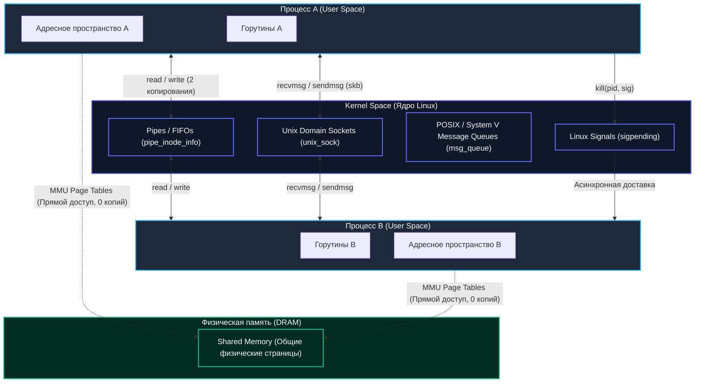
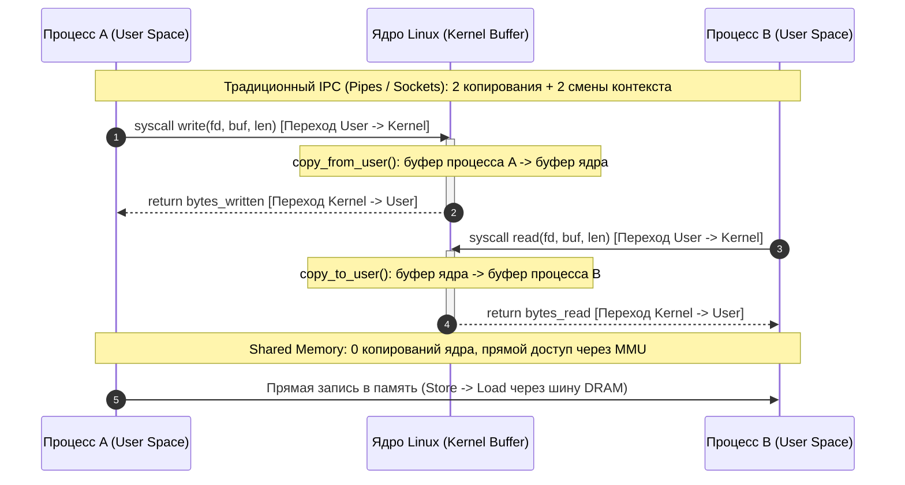
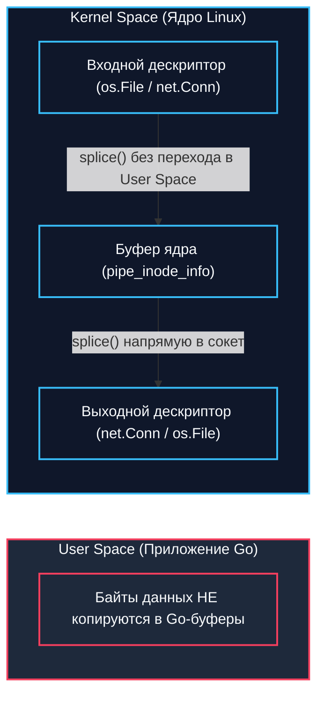

## Введение

В повседневной разработке на Go мы привыкли чувствовать себя как в уютной мастерской: создаем `goroutine`, связываем их через `channel`, передаем отмену через `context`. Эти прекрасные инструменты работают в тепличных условиях — в рамках **одного процесса**, разделяя общее виртуальное адресное пространство и чутко опекаемые планировщиком Go рантайма. Внутри одного процесса передать указатель на структуру данных стоит ровно столько, сколько стоит скопировать 8 байт адреса в регистр процессора.

Однако настоящая промышленная архитектура редко помещается в уютную коробку единственного бинарника. Рано или поздно перед нами встают задачи иного порядка:
- **Отказоустойчивость и изоляция:** падение воркера с `panic` или segmentation fault не должно уносить с собой весь веб-сервер.
- **Многоязычные системы:** высоконагруженный шлюз на Go должен мгновенно передавать кадры видео или тензоры в процесс инференса на C++ или Python.
- **Архитектура плагинов:** динамическая загрузка стороннего кода без риска компрометации основного процесса (вспомним модель HashiCorp go-plugin).
- **Graceful Zero-Downtime Reload:** перезапуск бинарника демона с сохранением открытых сетевых соединений.

Здесь вступает в свои права фундаментальный принцип архитектуры Unix: строить сложные системы из небольших, независимых программ, каждая из которых делает одну вещь хорошо, и соединять их надежными каналами связи. Когда виртуальные адресные пространства процессов разделены железным заслоном MMU (Memory Management Unit), им требуется **Межпроцессное взаимодействие (Inter-Process Communication, IPC)**. 

Для Go-инженера понимание IPC — это не просто академический интерес к устройству ядра Linux. Это умение трезво сопоставить накладные расходы: сколько тактов CPU отнимет переход в пространство ядра, сколько раз байты скопируются в оперативной памяти и не вызовет ли наивный доступ к разделяемому участку лавину инвалидаций процессорных кэшей.



---

## Основные механизмы IPC в Linux

Ядро Linux развивалось десятилетиями, аккумулируя стандарты POSIX, наследие System V и Berkeley BSD. В результате мы имеем богатый арсенал IPC, где каждый инструмент создавался под строго определенный инженерный компромисс между скоростью, сложностью синхронизации и семантикой передачи данных.

### 1. Pipes и Named Pipes (FIFO)
`pipe()` создает неименованный двунаправленный канал между родительским и дочерним процессом. Данные передаются через буфер в ядре. В классическом понимании канал однонаправлен, данные передаются как непрерывный поток байтов через кольцевой буфер в ядре.
`mkfifo()` создает именованный канал, который существует в файловой системе как обычный файл. Любые процессы могут открыть его для чтения/записи.

### 2. Unix Domain Sockets (UDS)
Бинарный аналог TCP, но работающий без сетевого стека. Создается через `socket(AF_UNIX, SOCK_STREAM, 0)` или датаграммный сокет. Поддерживает двустороннюю передачу данных, **передачу файловых дескрипторов** (`SCM_RIGHTS`) и аутентификацию по правам доступа к сокету.

### 3. Shared Memory (SHM)
Прямое отображение одного и того же физического участка RAM в виртуальные адресные пространства нескольких процессов. Самый быстрый механизм, но **не содержит примитивов синхронизации**. Данные нужно синхронизировать вручную через `semaphore` или `mutex`.

### 4. Signals
Асинхронные сообщения ограниченного размера (только номер сигнала и optional `errno`). Используются для управления жизненным циклом (`SIGTERM`, `SIGKILL`, `SIGUSR1`), а не для передачи бизнес-данных.

---

## Под капотом: Ядерные структуры и передача данных

Когда процесс вызывает IPC-функцию, происходит переход в **Kernel Space**. Ядро Linux использует специфичные структуры для каждого механизма:

| Механизм | Ядерная структура | Механизм передачи данных |
|----------|-------------------|--------------------------|
| `pipe()` / `fifo` | `pipe_inode_info` | Копирование через `copy_from_user` / `copy_to_user` в буфер ядра |
| `AF_UNIX` socket | `unix_sock` | Копирование в `skb` (socket buffer), обход IP/TCP стека |
| `shmget()` | `shmid_kernel` | Маппинг страниц через `mm_struct` обоих процессов |
| `msgget()` | `msg_queue` | Ядерный список сообщений, блокировка `spinlock` при доступе |



> [!info] Под капотом
> При записи в `pipe` данные не копируются напрямую в целевой процесс. Они сначала помещаются в буфер ядра (`pipe_buf`), затем ядро вызывает `copy_to_user` для целевого процесса. Это **два контекстных переключения** (User -> Kernel -> User) и **две копирования памяти** на каждый `write`/`read`.

### Передача файловых дескрипторов через UDS
Ключевая фича Unix Domain Sockets — передача дескрипторов файлов между процессами без открытия файла заново. В ядре это реализуется через `SCM_RIGHTS` в `struct cmsghdr`. Ядро инкрементирует `f_count` дескриптора и встраивает его в ancillary data (вспомогательные данные) пакета. Получатель вызывает `recvmsg` и извлекает дескриптор. Это **zero-copy** для самого файла, но требует осторожности с lifecycle-дескрипторами.

---

## Go-реализация и идиомы

Go предоставляет высокоуровневые обертки над системными вызовами IPC. Важно понимать, что **goroutine не заменяет IPC**. Если вам нужна изоляция памяти, отказоустойчивость или взаимодействие с внешним миром, используйте процессы.

### Unix Domain Sockets (Сервер/Клиент)
```go
package main

import (
	"fmt"
	"net"
	"os"
)

func startUDSServer(addr string) error {
	// Удаляем старый сокет, если он существует
	if _, err := os.Stat(addr); err == nil {
		os.Remove(addr)
	}

	ln, err := net.Listen("unix", addr)
	if err != nil {
		return fmt.Errorf("listen unix: %w", err)
	}
	defer ln.Close()

	fmt.Println("UDS server started at", addr)

	for {
		conn, err := ln.Accept()
		if err != nil {
			return fmt.Errorf("accept: %w", err)
		}
		// Обработка в отдельной горутине
		go handleConn(conn)
	}
}

func handleConn(c net.Conn) {
	defer c.Close()
	buf := make([]byte, 4096)
	n, err := c.Read(buf)
	if err != nil {
		return
	}
	fmt.Printf("Received %d bytes\n", n)
}
```

Клиент подключается к такому сокету через стандартный диалер:
```go
conn, err := net.Dial("unix", "/tmp/app.sock")
if err != nil {
	panic(err)
}
defer conn.Close()
```

### Shared Memory через `syscall.Mmap`
```go
package main

import (
	"fmt"
	"os"
	"syscall"
	"unsafe"
)

func createSharedMem(size int) ([]byte, error) {
	// shmget аналог в Go отсутствует в stdlib, используем syscall.Mmap с /dev/zero
	fd, err := syscall.Open("/dev/zero", syscall.O_RDWR, 0)
	if err != nil {
		return nil, fmt.Errorf("open /dev/zero: %w", err)
	}
	defer syscall.Close(fd)

	data, err := syscall.Mmap(fd, 0, size, syscall.PROT_READ|syscall.PROT_WRITE, syscall.MAP_SHARED)
	if err != nil {
		return nil, fmt.Errorf("mmap: %w", err)
	}
	return data, nil
}

func main() {
	// Размер должен быть кратен странице (обычно 4KB)
	mem, err := createSharedMem(4096)
	if err != nil {
		panic(err)
	}
	// Безопасная запись
	copy(mem, []byte("Hello from SHM"))
	fmt.Println("Shared memory created")
}
```
> [!warning] Ловушка / Gotcha
> `syscall.Mmap` возвращает `[]byte`. При записи в разделяемую память вы **не контролируете** момент, когда другой процесс увидит данные. Без синхронизации (атомарных операций или мьютексов в пространстве ядра) вы получите **race condition** на уровне кэш-линий CPU.

---

## Mechanical Sympathy: Стоимость и оптимизация

Для Senior/Lead инженера выбор IPC — это баланс между изоляцией и производительностью.

### 1. Context Switch & Copy Overhead
Каждый `read`/`write` через pipe или UDS вызывает:
- Переход `User Space -> Kernel Space` (около 1000-2000 тактов CPU).
- Копирование данных из пользовательского буфера в буфер ядра.
- Копирование из буфера ядра в целевой пользовательский буфер.
- Переключение планировщика горутин (если процесс блокируется на `read`).

**Оптимизация:** Используйте `sendfile()` или `splice()` для передачи данных между файлами/сокетами без возврата в user space. В Go это скрыто в `io.Copy` при работе с `os.File` и `net.Conn` на Linux.



### 2. Cache Coherency и Shared Memory
При использовании разделяемой памяти процессы часто работают на разных физических ядрах. Архитектура x86 использует протокол **MESI** для поддержания согласованности кэш-линий.
- Если процесс A пишет в кэш-линию, а процесс B читает с другого ядра, ядро отправит `IPI` (Inter-Processor Interrupt) для инвалидации кэша B.
- **Cost:** ~100-300 нс на инвалидацию кэш-линии. При высокой частоте записи/чтения это убивает производительность.
- **Fix:** Выравнивайте данные по границе кэш-линии (`align 64`), используйте `sync/atomic` или разделяйте данные на `read-only` и `write-only` секции.

### 3. UDS vs TCP для localhost
UDS быстрее TCP на 20-40% на одном хосте, потому что:
- Нет TCP handshake (`SYN`/`SYN-ACK`/`ACK`).
- Нет проверки контрольных сумм (checksum offloading).
- Нет маршрутизации через `netfilter` и `conntrack`.
- Нет блокировок `TCP backlog` и `SYN queue`.

> [!tip] Собеседование
> **Вопрос:** Когда вы выберете Unix Domain Socket вместо Named Pipe?
> **Ответ:** Когда нужна двусторонняя передача данных, аутентификация по правам доступа к файлу, или необходимость передавать файловые дескрипторы (`SCM_RIGHTS`) между процессами. Pipes односторонние и не поддерживают передачу FD.

---

## Итог

1. **IPC** необходимо для изоляции, отказоустойчивости и взаимодействия с внешними системами.
2. **Pipes/FIFO** просты, но односторонни. **UDS** универсальны, быстры и поддерживают передачу дескрипторов. **Shared Memory** требует ручной синхронизации и опасна race conditions.
3. **Стоимость IPC** измеряется в контекстных переключениях и копировании памяти. Используйте `splice`/`sendfile` для обхода user space.
4. **Shared Memory** на мульти-Core системах вызывает cache-line bouncing (MESI). Используйте выравнивание и атомарные операции.
5. В Go IPC реализуется через `os.Pipe`, `net.Dial("unix", ...)` и `syscall.Mmap`. Горутины не заменяют процессы.

Мы разобрали, как процессы обмениваются данными. Следующим логичным шагом будет глубокое погружение в самый быстрый, но и самый опасный механизм: `[[32. Shared Memory и race condition между процессами]]`, где мы разберем ядерные примитивы синхронизации и как Go рантайм взаимодействует с разделяемой памятью.
