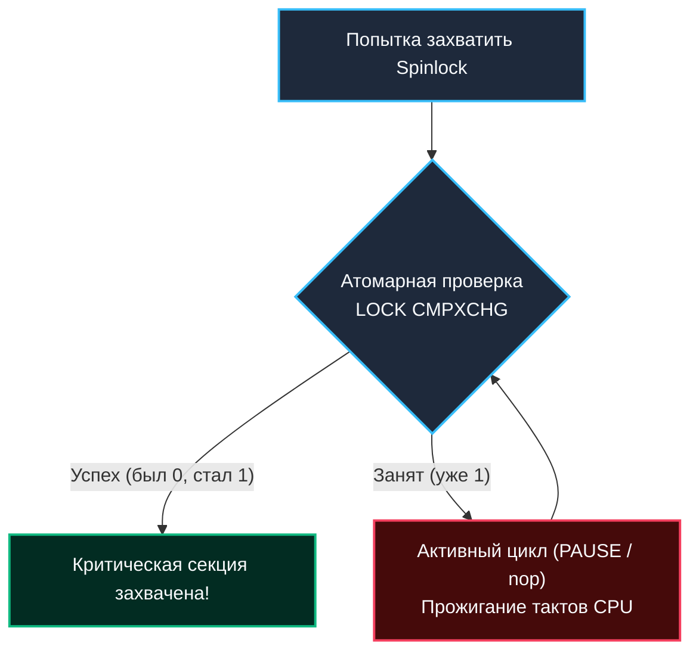
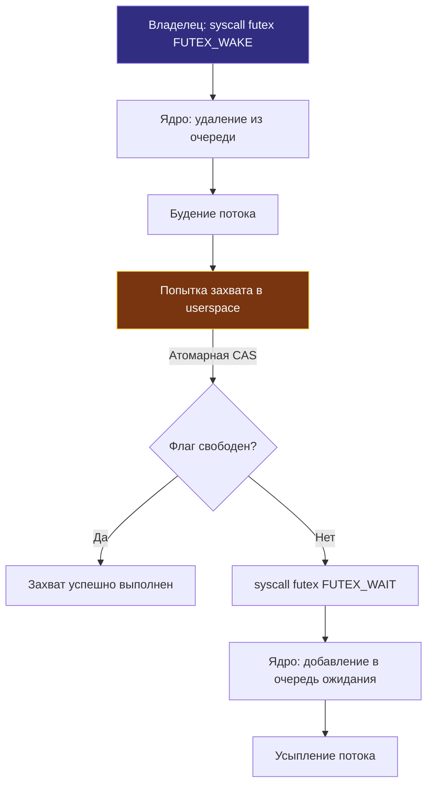
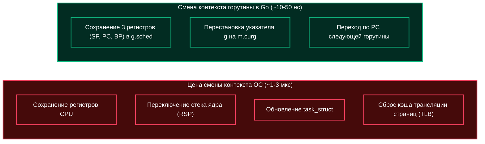
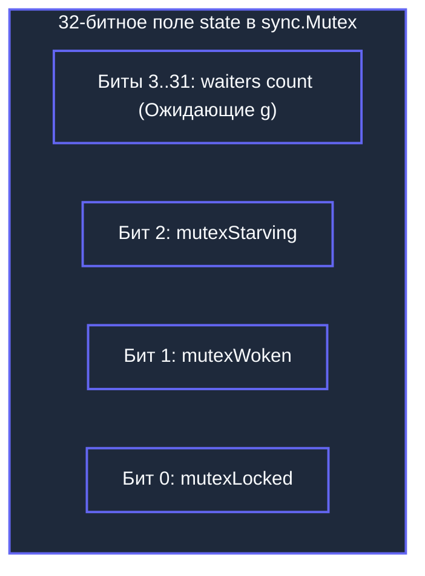

## Введение: Эволюция от блокировок к примитивам

В предыдущих разделах мы подробно исследовали, как операционная система жонглирует памятью, переключает контексты процессов и обрабатывает системные прерывания. Но как только несколько потоков или процессов начинают одновременно претендовать на один и тот же участок памяти, мы неизбежно сталкиваемся с фундаментальной дилеммой Computer Science: **как гарантировать взаимное исключение (Mutual Exclusion), не превращая высокопроизводительный процессор в бесполезную печку?**

В повседневной разработке на Go программист привычно пишет:
```go
mu.Lock()
defer mu.Unlock()
```
Эта конструкция выглядит обманчиво просто — словно мы повернули механический ключ в замочной скважине. Однако за этой строчкой скрывается сложнейший и элегантный танец между userspace, ядром Linux и аппаратной когерентностью процессорных кэшей. Чтобы не платить за каждое обращение к разделяемому ресурсу колоссальную цену системного вызова и полного context switch, инженеры создали три ключевых примитива синхронизации: `Spinlock`, `Mutex` и `Semaphore`.

Понимание их внутреннего устройства на уровне транзисторов, инструкций CPU и структур ядра критично для проектирования надежных highload-сервисов и успешного прохождения глубоких архитектурных интервью.

---

## Spinlock: Busy-waiting и цена cache coherency

**Spinlock** (блокировка с активным ожиданием) — это самый простой и прямолинейный примитив синхронизации. Он не усыпляет вызывающий поток и не просит ядро о помощи. Вместо этого поток входит в плотный цикл, непрерывно проверяя состояние флага в памяти с помощью атомарных процессорных инструкций:

```c
// Классический концептуальный цикл спинлока
while (!trylock(&lock)) {
    // Ждем в активном цикле, прожигая такты CPU
}
```

Житейская аналогия проста: представьте кабинку, у двери которой стоит человек и каждые полсекунды дергает ручку двери. Если человек внутри зашел буквально на две секунды помыть руки, такое поведение оправдано: дергающий сэкономит время на возвращение за свой рабочий стол. Но если человек внутри решил принять часовую ванну, дергающий ручку потратит 100% своих сил впустую, мешая всем вокруг.



### Под капотом: Атомарность и MESI

В современных многопроцессорных системах (SMP) каждое ядро хранит данные в своих локальных кэшах L1/L2. Когда ядро хочет атомарно изменить переменную блокировки, оно должно гарантировать, что ни одно другое ядро не прочитает устаревшее значение. Это аппаратное требование обеспечивается протоколом **MESI** (Modified, Exclusive, Shared, Invalid).

Для реализации Spinlock процессор использует инструкцию `LOCK CMPXCHG` (Compare-And-Swap). 
1. Префикс `LOCK#` исторически блокировал системную шину памяти, а в современных CPU захватывает монопольное владение строкой кэша в состоянии *Exclusive* / *Modified*.
2. Если флаг свободен (0), процессор атомарно меняет его на 1 и передает управление в критическую секцию за доли наносекунды.
3. Если флаг занят (1), ядро продолжает крутиться в бесконечном цикле `while !trylock()`.

> [!warning] Ловушка / Gotcha
> **Cache Thrashing (пинг-понг кэш-линий):** При высокой конкуренции кэш-линия, содержащая флаг, постоянно переходит в состояние `Invalid` на ядрах, которые не владеют блокировкой. Это убивает производительность. Spinlock эффективен только при:
> 1. Крайне коротких критических секциях (< 100 инструкций).
> 2. Низкой конкуренции.
> 3. Одноядерных средах (где переключение контекста дороже, чем спин) или в коде ядра, где поток вообще нельзя усыплять (обработчики аппаратных прерываний).

---

## Блокирующий Mutex и архитектура futex

Если критическая секция длинная (например, запись на диск, сетевой вызов или сложная перестройка хэш-таблицы), сжигать миллионы тактов процессора в активном спинлоке — непозволительное расточительство. 

Блокирующий `Mutex` (Mutual Exclusion) решает эту проблему радикально: если ресурс занят, вызывающий поток добровольно засыпает, освобождая процессорное ядро для выполнения других полезных задач.

В ранних версиях Unix каждый вызов мьютекса требовал безусловного обращения к ядру через системный вызов. Это было крайне медленно: даже когда на мьютекс никто не претендовал, программа платила сотни наносекунд за смену колец привилегий. Революция произошла в ядре Linux 2.6 с появлением подсистемы **futex** (Fast Userspace Mutex), спроектированной Франком ван де Веном, Расти Расселом и Ульрихом Дреппером.

### Как работает futex (пошагово)

Фундаментальный принцип futex — **разделить путь без конкуренции (Fast Path) и путь с конфликтом (Slow Path)**:

1. **Userspace Fast Path:** Программа пытается захватить мьютекс атомарной инструкцией `CMPXCHG` прямо в пользовательском пространстве. Если блокировка свободна (никто не держит ресурс), значение меняется с 0 на 1 за одну машинную инструкцию (~10–15 нс). Никаких системных вызовов, никакого перехода в кольцо Ring 0!
2. **Slow Path:** Если флаг уже занят, userspace-код понимает, что без ожидания не обойтись, и выполняет системный вызов `futex()` с флагом `FUTEX_WAIT`. Ядро Linux находит соответствующий хэш-бакет, создает внутреннюю очередь ожидания (`waitqueue`) и переводит вызывающий поток из состояния `TASK_RUNNING` в спящее состояние `TASK_UNINTERRUPTIBLE`, паркуя его.
3. **Wake Up:** Когда владелец критической секции освобождает ресурс, он сбрасывает счетчик в userspace. Если он видит, что за мьютекс боролись другие потоки, он выполняет `syscall futex` с флагом `WAKE_OP` (или `FUTEX_WAKE`). Ядро будит поток из очереди ожидания, переводит его обратно в `TASK_RUNNING` и планировщик ОС возвращает ему управление.



> [!info] Под капотом
> В ядре Linux структура `futex` хранится в `fs/futex.c`. Очередь ожидания — это стандартный `wait_queue_head_t`. Переход из `TASK_RUNNING` в `TASK_UNINTERRUPTIBLE` требует полного контекстного переключения, что стоит ~1000-10000 CPU-тактов.
> 
> Потоки идентифицируются адресом переменной в виртуальной памяти. Если память общая (`MAP_SHARED`), один и тот же `futex` может усыплять и будить потоки из **разных процессов**!

---

## Semaphore: Обобщение mutex

Если `Mutex` — это замок, рассчитанный строго на одного владельца (бинарный семафор с емкостью 1), то **Semaphore** (семафор Дейкстры) — это примитив с внутренним целочисленным счетчиком ($N$) и очередью ожидания. Он разрешает одновременный доступ не более чем $N$ конкурентным потокам:

- `Wait` (исторически операция `P` от нидерландского *proberen* — пробовать / уменьшать): уменьшает счетчик на 1. Если счетчик был равен 0, вызывающий поток блокируется до тех пор, пока кто-то не освободит слот.
- `Post` (исторически операция `V` от нидерландского *verhogen* — увеличивать): увеличивает счетчик на 1 и пробуждает один ожидающий поток из очереди.

Как это устроено на разных уровнях:
* **Linux:** Системные вызовы `sem_wait()` / `sem_post()` работают с объектами ядра через системные вызовы `semop()` (в System V) или через мультиплексирование `futex` (в POSIX `libpthread`).
* **Go:** В стандартной расширенной библиотеке Go пакет `sync/semaphore` (начиная с Go 1.21 и в `golang.org/x/sync/semaphore`) реализует взвешенные семафоры. Внутренне он опирается на структуру `semaRoot` с двусвязным списком (`next`, `prev`) для очередей ожидания (`g` структур), полностью обходясь без системных вызовов ядра, если конкуренция мала.

---

## Mechanical Sympathy: CPU, кэш-линии и контекстные переключения

Для Senior/Lead инженера критично понимать реальную физическую стоимость операций на современном оборудовании:

| Примитив | Механизм блокировки | Стоимость при конкуренции | Влияние на CPU |
|----------|---------------------|--------------------------|----------------|
| Spinlock | Атомарный цикл (CAS) | Низкая (если contention < 10%) | Высокий (busy-wait, кэш-линии в MESI) |
| Mutex (futex) | userspace CAS + kernel sleep | Средняя/Высокая | Низкий (поток спит, CPU свободен) |
| Semaphore | Счетчик + очередь | Зависит от N и contention | Аналогично Mutex |

**Ключевой инсайт:** Контекстный switch в Linux требует смены стека ядра, обновления `task_struct`, инвалидации TLB и переключения `CSR` (Control Status Register). Это не "бесплатно". Go runtime минимизирует эту стоимость за счет **адаптивного спиннинга** и **мультиплексирования горутин**.



---

## Go-реализация: Почему мы не используем OS-мьютексы?

В традиционных языках (C++, Java, Rust) `std::mutex` или `ReentrantLock` часто напрямую оборачивают вызовы `pthread_mutex` или POSIX `futex`. В мире Go это было бы катастрофой из-за уникальной модели планировщика **`M-P-G`** (Machine-Processor-Goroutine).

### Внутреннее устройство `sync.Mutex`

В рантайме Go структура `sync.Mutex` предельно компактна:
```go
type Mutex struct {
    state int32
    sema  uint32
}
```

Поле состояния `mutex` в структуре `sync.Mutex` — это 32-битная битовая маска:
* **Бит 0 (mutexLocked):** заблокировано
* **Бит 1 (mutexWoken):** взведен флаг пробуждения (горутина уже проснулась и пытается захватить лок)
* **Бит 2 (mutexStarving):** режим голодания (Starvation Mode, если ожидание превысило 1 мс)
* **Старшие 29 бит:** количество ожидающих горутин (`waiters`)



При вызове `Lock()` рантайм Go выполняет умный трехступенчатый алгоритм:
1. **Fast Path:** Атомарно проверяет флаг с помощью `atomic.CompareAndSwapInt32(&m.state, 0, mutexLocked)`. Если мьютекс свободен — захватывает и моментально возвращает управление.
2. **Адаптивный Spinlock:** Если мьютекс занят, но мы работаем на многоядерной машине, планировщик пытается выполнить короткий `SpinLock` (до ~4 итераций инструкции `PAUSE`), пока `waiters` равны 0. Если критическая секция владельца крошечная, мы успеем забрать лок без усыпления!
3. **Slow Path:** Если спин не удался, вызывается функция `runtime_SemacquireMutex()`, которая:
   * Добавляет структуру текущей горутины `g` в очередь ожидания (двусвязный список).
   * Горутина переходит в состояние `_Gwaiting` и снимается с системного потока `m`. Поток `m` берет на исполнение **другую готовую горутину**!
   * Если свободных горутин нет вообще, тред `m` может сделать `syscall futex` для усыпления.
   * При освобождении мьютекса разблокированная горутина проверяет, действительно ли она получила блокировку (защита от ложных пробуждений — spurious wakeup).

> [!tip] Собеседование
> **Вопрос:** Почему `sync.Mutex` не использует системный `pthread_mutex` напрямую?
> 
> **Ответ:** Системный мьютекс блокирует ОС-поток (`m`). Если горутине нужно ждать, а она привязана к `m`, все остальные горутины на этом `m` останавливаются (thread parking). 
> 
> Go реализует свой мьютекс в userspace, который будит именно легкую структуру `g` из очереди ожидания планировщика, а не `m`. Поток операционной системы остается активным и немедленно берет в работу соседние горутины. Это спасает сервер от тысяч заблокированных потоков ОС и экономит гигабайты оперативной памяти.

---

## Ловушки, corner-case и вопросы с собеседований

### 1. Lock Convoying (Конвой блокировок)
Когда множество горутин борются за один и тот же `Mutex`, они выстраиваются в длинную очередь. Если критическая секция занимает даже скромные несколько десятков микросекунд, конвой начинает расти лавинообразно. Время удержания блокировки складывается со временем пробуждения, резко повышая 99-й перцентиль задержки (p99 latency).

**Решение:** 
- Используйте `sync.RWMutex` для сценариев, где чтений многократно больше, чем записей (read-heavy workload).
- Дробите гранулярность блокировок (Striping / Sharding, как сделано в высоконагруженных concurrent cache).
- Используйте `sync/semaphore` с пулом разрешений `N > 1` для параллельного доступа.

### 2. Priority Inversion (Инверсия приоритетов)
Классическая беда многопоточности: низкоприоритетный поток захватывает мьютекс. Поток со средним приоритетом вытесняет его на CPU. В это время высокоприоритетный поток пытается взять мьютекс и блокируется. В итоге высокоприоритетная задача ждет среднюю, к которой вообще не имеет отношения!

**В Go:** Планировщик не имеет жестких приоритетов в классическом понимании, но `sync.Mutex` внедряет механизм защиты от голодания (Starvation Mode) через очередь `waitq`. Если горутина ждет мьютекс дольше 1 миллисекунды, мьютекс переключается в режим *starvation*: владение передается строго по очереди первой ожидающей горутине, а вновь прибывшие горутины лишаются права вклиниваться через спиннинг.

### 3. Gotcha: `sync.Mutex` не реентерабельный
В отличие от `std::recursive_mutex` в C++ или мониторов в Java, `sync.Mutex` в Go **не является реентерабельным**. Если горутина, уже владеющая мьютексом, попытается вызвать `mu.Lock()` повторно в той же цепочке вызовов, она заблокирует сама себя навсегда. Это моментальный взаимный тупик (Deadlock). 

Дизайнеры Go пошли на это осознанно: реентерабельные мьютексы маскируют архитектурные ошибки, затрудняя рассуждения о неизменяемости инвариантов критической секции. Если вам нужна координация условий — используйте комбинацию `sync.Mutex` и `sync.Cond` либо пересмотрите декомпозицию функций.

### 4. Сравнение с другими языками
* **PHP / Java (классический Threading):** Используют потоки операционной системы и системные мьютексы. Блокировка мьютекса = блокировка потока ОС. Высокая стоимость переключения при сильной конкурентности.
* **Go:** Green threads (горутины) + собственный планировщик в пространстве пользователя + кастомный гибридный мьютекс на базе спиннинга и очередей горутин. Стоимость блокировки в 10–100 раз ниже на высоких параллельных нагрузках.
* **C++:** `std::mutex` чаще всего прямо транслируется в вызовы `pthread_mutex`. Максимальная скорость в простых сценариях, но отсутствие встроенного мультиплексирования легких потоков.

---

## Итоги

1. **Spinlock** эффективен только при крайне коротких критических секциях и низкой конкуренции. Он избегает затрат на context switch, но сжигает ресурсы процессора и порождает лавину инвалидаций кэш-линий по протоколу **MESI**.
2. **Mutex (futex)** — признанный золотой стандарт системной синхронизации. Он блестяще сочетает Fast Path в userspace через инструкцию `CMPXCHG` с медленным путем засыпания в ядре (`FUTEX_WAIT` / `TASK_UNINTERRUPTIBLE`).
3. **Semaphore** обобщает концепцию взаимного исключения до $N$-конкурентных слотов. В Go `sync/semaphore` организован через `semaRoot` с двусвязным списком очередей горутин `g`.
4. **Go не использует системные мьютексы ОС напрямую**, поскольку парковка потока ядра `m` парализовала бы все остальные горутины, назначенные на этот поток.
5. **Инженерное правило:** Никогда не оптимизируйте блокировки вслепую. Снимайте профили блокировок через `pprof` (блок `block` и `mutex`), заменяйте простые счетчики на `sync/atomic` и держите критические секции предельно компактными.

Мы детально разобрали, как примитивы синхронизации балансируют между пользовательским пространством и ядром. Однако неправильное использование этих примитивов порождает опаснейшие аномалии многопоточных систем. В следующей лекции мы разберем главных врагов конкурентного программирования: `[[34. Deadlock, Livelock, Starvation.md]]`.
