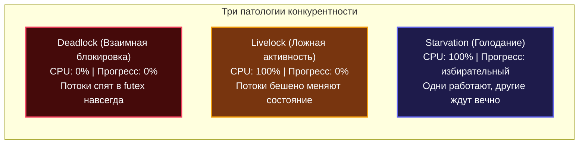
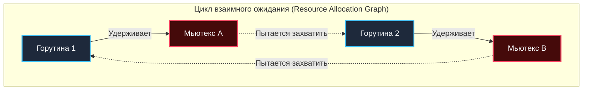
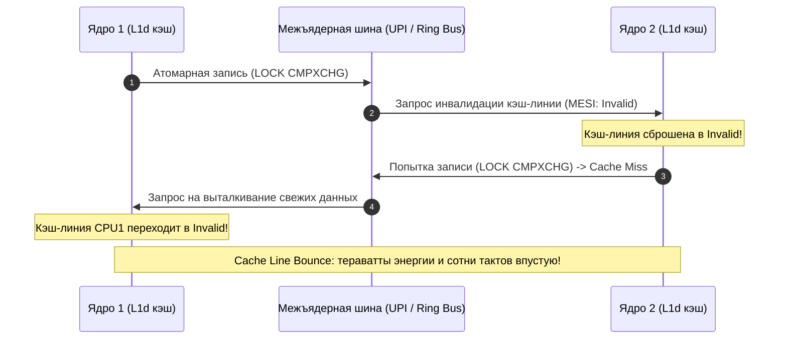
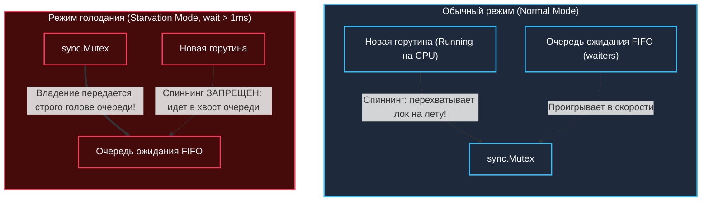

## Введение: Три состояния паралича конкурентности

В мире многопоточного программирования разработчики привыкли больше всего опасаться состояния гонки (`race condition`). И это понятно: гонки данных коварны, но они хотя бы заявляют о себе явно — бросают паники рантайма, приводят к повреждению памяти или отлавливаются встроенным детектором `go run -race`.

Куда более опасными и разрушительными для реальных производственных систем являются три «тихих убийцы» распределенных и параллельных программ: **`deadlock`**, **`livlock`** и **`starvation`**. Они не роняют процесс с громким crash dump. Вместо этого они парализуют систему: сервис перестает отвечать на запросы, деградирует по задержкам или превращается в «зомби», потребляя 100% мощности процессора без единого байта полезной работы.



Для инженера, пишущего на Go, глубокое понимание этих явлений особенно критично: **Go runtime не защищает вас от логических ошибок архитектуры синхронизации**. Вы оперируете легковесными горутинами (`g`), которые засыпают на уровне системного вызова `futex`, и средой исполнения, которая жонглирует системными тредами (`m`) и логическими процессорами (`p`). Любой архитектурный просчет моментально масштабируется: взрывная нагрузка на планировщик при раздувании `GOMAXPROCS`, шторм кэш-промахов и истощение системных ресурсов.

> [!tip] Собеседование
> **Вопрос:** В чем фундаментальное отличие deadlock от livelock с точки зрения состояния горутины в Go runtime?
> 
> **Ответ:** При `deadlock` горутина переходит в спящее состояние `Gwaiting` или `Gdead` и не требует процессорного времени. Взаимно заблокированные потоки просто спят в очереди ядра или рантайма. 
> 
> При `livlock` горутина непрерывно находится в активном состоянии `Grunning` или готовом `Grunnable`. Она совершает частые переключения контекста, потребляет 100% CPU, непрерывно изменяет переменные, но алгоритм в целом не совершает полезной работы. Это делает livelock в Go особенно коварным: мониторинг видит высокую загрузку CPU, не сигнализирует об остановке, но клиенты получают таймауты. Вдобавок это способно привести к аварийному завершению из-за неконтролируемого выделения памяти (`OOM`) или аппаратному троттлингу процессора.

---

## Deadlock (Взаимная блокировка)

**Deadlock** возникает тогда, когда две или более горутин взаимно блокируют друг друга, удерживая ресурсы, необходимые партнеру, и бесконечно ожидая освобождения встречных ресурсов.

Классическая житейская аналогия: два предельно вежливых господина подошли к узкому мостику с противоположных сторон. Каждый настаивает: «Только после вас!». Ни один не делает шага вперед, пока не пройдет второй. Оба застывают на мосту навсегда.

В коде на Go deadlock чаще всего вызывают:
- Несогласованный порядок захвата примитивов `sync.Mutex` и `sync.RWMutex`.
- Небуферизованные каналы с размером буфера `0`.
- Ожидание в конструкции `select` без секции `default`.
- Захват блокировки повторно из той же горутины (нереентерабельность `sync.Mutex`).



### Под капотом: как Go блокирует горутину

Когда горутина вызывает `mutex.Lock()`, рантайм Go выполняет трехфазную процедуру захвата:

1. **Spin phase**: Рантайм пытается захватить мьютекс атомарно с помощью инструкции `atomic.CompareAndSwapInt32`. Если мьютекс свободен, горутина остается в состоянии `Grunning`, а мьютекс помечается как захваченный за десяток наносекунд.
2. **Futex wait**: Если мьютекс занят и короткий цикл активного ожидания не дал результата, горутина вызывает внутреннюю функцию `runtime_Semacquire`. Это низкоуровневая обертка рантайма над системным вызовом ядра `futex` (fast userspace mutex). Планировщик Go переводит текущую `g` в состояние `Gwaiting`, извлекает ее из очереди выполнения и **не выделяет CPU**. Системный поток ОС `m` освобождается и берет на исполнение другую горутину.
3. **Wake-up**: Когда текущий владелец вызывает `Unlock()`, рантайм вызывает `runtime_Semrelease`, который через `futex` будит одну из ожидающих горутин (`Gwaiting` -> `Grunnable`).

Если цикл ожидания замкнут (Горутина 1 ждет Горутину 2, а та ждет Горутину 1), `futex` будет спать вечно. С точки зрения ядра Linux всё абсолютно законно: потоки просто ждут внешнего события, которое никогда не произойдет.

> [!warning] Ловушка / Gotcha
> **Каналы ≠ гарантия от deadlock.**
> Отправка в канал с буфером `0` блокирует отправляющую горутину, пока получатель не сделает `recv`. Если получатель тоже ждет отправки в тот же канал (или в другой, зависящий от первого) — вы получили классический `deadlock`. 
> 
> Встроенный в Go рантайм-детектор паникует с сообщением `all goroutines are asleep - deadlock!`, но только если **все** горутины в процессе уснули! Если вы запустили программу без `GOMAXPROCS=1`, и где-то в фоне крутится хотя бы одна горутина (например, тикер метрик или сетевой poll-сервер с `GOMAXPROCS > 1`), глобальный детектор deadlock'ов не сработает! Часть сервиса повиснет намертво, а процесс продолжит жить, вводя операторов в заблуждение.

### Как предотвращать и детектить

Для предотвращения deadlock необходимо разрушить хотя бы одно из четырех условий Коффмана (Coffman conditions):
1. **Фиксированный порядок захвата (Lock Ordering)**: Если нескольким горутинам требуются мьютексы A и B, абсолютно весь код в кодовой базе обязан захватывать их в строгой последовательности: всегда сначала A, затем B. Это гарантированно ломает цикл ожидания.
2. **Таймауты и контекст**: Никогда не блокируйтесь бесконечно. Используйте `context.WithTimeout` и `select` для ограничения времени ожидания.
3. **Инструменты диагностики**:
   - `go tool pprof -goroutine http://host/debug/pprof/goroutine` — снимок всех горутин покажет точные строки кода, где они застряли в `sync.runtime_Semacquire`.
   - `GODEBUG=asyncpreempt=1` — включает асинхронную преэмпцию планировщика, которая позволяет ядру посылать сигналы прерывания зависшим горутинам (но не лечит логические дедлоки).

```go
// Идиоматичный паттерн захвата мьютекса с таймаутом через канал
func acquireWithTimeout(ctx context.Context, mu *sync.Mutex) error {
    ch := make(chan struct{})
    go func() {
        mu.Lock()
        close(ch)
    }()
    select {
    case <-ch:
        return nil // Успех: мьютекс успешно захвачен
    case <-ctx.Done():
        // Мьютекс не захвачен вовремя. 
        // Важно: не вызывать Unlock(), так как мы его не взяли!
        return ctx.Err()
    }
}
```

---

## Livelock (Ложная активная блокировка)

**Livelock** возникает, когда участники параллельного взаимодействия не заблокированы и не спят в ядре, но непрерывно меняют свое состояние в ответ на действия других участников, не продвигаясь в выполнении бизнес-задачи ни на шаг.

Аналогия из жизни: двое вежливых людей столкнулись лицом к лицу в узком коридоре. Человек А делает шаг влево, чтобы пропустить встречного. Человек Б одновременно делает шаг вправо — они снова загораживают друг другу путь! Человек А шагает вправо, Человек Б шагает влево. Они мечутся из стороны в сторону, обливаясь потом и расходуя массу энергии, но никто не может пройти вперед.

### Механика и отличие от deadlock

В отличие от `deadlock`, при лайвлоке нет ожидания в системном вызове `futex`. Горутины бодрствуют, находятся в статусе `Grunning` или `Grunnable`, выполняют машинные команды, делают `yield` планировщику или непрерывно перезапускают логику обработки.

В Go лайвлок чаще всего провоцируют:
- Неаккуратные циклы повторных попыток (retry loops), где несколько горутин пытаются захватить ресурс, при неудаче синхронно отступают, ждут фиксированный интервал времени и одновременно набрасываются на него снова.
- Конструкции `select` с небуферизованными каналами, где отправители и получатели непрерывно «подталкивают» друг друга.
- Бесконечные CAS-циклы (Compare-And-Swap), в которых десятки параллельных ядер непрерывно затирают атомарный указатель, заставляя друг друга начинать заново.

### Под капотом: Cache Coherence (MESI) и стоимость спина

Когда несколько горутин, запущенных на разных логических процессорах (`p`), непрерывно читают и модифицируют одни и те же общие переменные (например, разделяемый флаг или указатель в CAS-цикле), на аппаратном уровне включается протокол когерентности кэшей **MESI** (Modified, Exclusive, Shared, Invalidated):



1. Ядро CPU1 модифицирует кэш-линию данных (`L1d`), переводя ее в состояние *Modified*.
2. Через шину межъядерного взаимодействия (QPI/UPI на Intel или Infinity Fabric на AMD) ядро рассылает широковещательный запрос и инвалидирует копию в кэше CPU2.
3. При следующем чтении с CPU2 немедленно возникает `Cache Miss`, и ядро вынуждено по шине запрашивать актуальные данные из L1 CPU1.
4. **Стоимость катастрофы:** феномен `Cache Line Bounce` съедает от 20 до 50 тактов CPU на каждый раунд согласования шины. В плотном цикле активного спина это нагревает процессор и парализует пропускную способность шины памяти быстрее, чем любой «тяжелый» `syscall`.

> [!info] Под капотом
> Go не использует чистые spinlocks по умолчанию. Стандартный `sync.Mutex` после короткой адаптивной фазы спина (обычно до 4 итераций инструкции `PAUSE`) обязательно уходит в `futex` и паркует поток. 
> 
> Но если вы вручную проектируете lock-free алгоритм на циклах `atomic.Load/Store` или вызываете `runtime.Gosched()` в бесконечном цикле без задержек — вы собственноручно создаете разрушительный livelock на уровне протокола MESI и шины памяти.

### Как предотвращать

1. **Exponential Backoff with Jitter**: Добавление случайного разброса задержки (Random Jitter через `rand.Intn()`) гарантированно ломает синхронность ретраев между конкурирующими узлами или потоками.
2. **Yield без busy-wait**: Вызов `runtime.Gosched()` отдает текущий квант времени планировщику Go. Это позволяет другим горутинам продвинуться вперед, не перегружая системные ядра ОС.
3. **Балансировка нагрузки**: Убедитесь, что переменная `GOMAXPROCS` соответствует доступным физическим ядрам машины, чтобы планировщик мог эффективно распределять логические процессоры `p`.

```go
// Паттерн безопасного retry с экспоненциальным бэкоффом и jitter
func retryWithJitter(ctx context.Context, maxRetries int, fn func() error) error {
    var err error
    for i := 0; i < maxRetries; i++ {
        err = fn()
        if err == nil {
            return nil
        }
        // Jitter предотвращает синхронный ретрай всех инстансов
        delay := time.Duration(rand.Intn(100)) * time.Millisecond
        select {
        case <-ctx.Done():
            return ctx.Err()
        case <-time.After(delay):
            // Ждем, не блокируя тред ОС полностью
        }
    }
    return fmt.Errorf("max retries reached: %w", err)
}
```

---

## Starvation (Голодание)

**Starvation** — патологическое состояние, при котором одна или несколько горутин технически готовы к исполнению, но хронически не могут получить доступ к необходимому ресурсу (квантам CPU или разделяемому мьютексу), потому что другие, более «наглые» горутины непрерывно монополизируют этот ресурс.

В Go различают два основных типа голодания:
1. **CPU Starvation**: Горутина не получает квант процессорного времени из-за монопольных вычислений других задач или отсутствия точек кооперативной преэмпции.
2. **Lock Starvation**: Горутина бесконечно простаивает в очереди к `sync.Mutex`, потому что вновь прибывающие горутины перехватывают мьютекс прямо у нее перед носом (эффект конвоя блокировок — convoy effect).

### Под капотом: Work-Stealing и режим голодания мьютекса

Планировщик Go построен на алгоритме **Work-Stealing**. Каждый логический процессор `p` владеет локальной очередью готовых горутин (`runq` на 256 элементов). Если `p` опустошает свою очередь, он пытается «украсть» половину горутин из очереди соседнего процессора `p`. Это обеспечивает великолепную общую утилизацию ядер, но само по себе не дает математических гарантий абсолютной справедливости (fairness).

Чтобы защитить долго ждущие горутины от вечного голодания, начиная с **Go 1.9** в структуру `sync.Mutex` был добавлен инновационный **Starvation Mode (режим голодания)**:



- **Обычный режим:** вновь пришедшая горутина исполняется на процессоре и уже держит в кэше L1 данные. Поэтому ей разрешено попытаться перехватить освобождающийся мьютекс через spinlock, опередив спящую горутину, которую рантайм только начал будить. Это дает максимальную общую пропускную способность, но может вызвать голодание.
- **Режим голодания:** если горутина ожидает мьютекс дольше **1 миллисекунды**, мьютекс принудительно переключается в режим Starvation.
- В этом режиме вновь прибывающие горутины вообще не пытаются захватить лок и не крутятся в спинлоке: они сразу встают в хвост очереди ожидания. Право владения мьютексом передается строго по цепочке первой ожидающей `g`.
- Мьютекс выходит из режима голодания только тогда, когда очередь ожидания полностью опустеет или разбуженная горутина ждала меньше 1 мс.

> [!warning] Ловушка / Gotcha
> **Голодание стека (Stack Starvation)**: Если вы запускаете бесконечный цикл без блокирующих операций (`for { doWork() }`), горутина не делает `yield`. На одном `p` она будет монополизировать CPU, пока не произойдет `preemption` (каждые ~10мс по умолчанию). Это создает иллюзию starvation для других горутин на том же `p`. Решение: `GOMAXPROCS >= 2` или явный `runtime.Gosched()` в долгих циклах.

### Как предотвращать

1. **Fair Scheduling**: Используйте буферизованные каналы или примитивы `sync.WaitGroup` вместо самодельных spin-очередей.
2. **Context Preemption**: Регулярно опрашивайте канал завершения `context.WithCancel` внутри вычислительных циклов.
3. **Профилирование**: Используйте профилировщик `pprof` (`pprof/mutex` и `pprof/block`), чтобы увидеть реальное время ожидания горутин на блокировках.

```go
// Идиоматичное предотвращение lock starvation через select + context
func fairLockAcquire(ctx context.Context, mu *sync.Mutex) error {
    for {
        if mu.TryLock() { // Доступно только в тестах или через unsafe, в продакшене используем канал-сигнал
            return nil
        }
        select {
        case <-ctx.Done():
            return ctx.Err()
        case <-time.After(1 * time.Millisecond):
            // Yield к планировщику, чтобы другие p могли украсть горутину
            runtime.Gosched()
        }
    }
}
```

---

## Сравнение подходов: Go vs C++ vs Java vs PHP

| Характеристика | Go | C++ / Java | PHP |
|----------------|----|------------|-----|
| **Блокировка** | `sync.Mutex` (futex + spin) | `std::mutex` (OS pthread) / `synchronized` (Monitor) | Отсутствует (до Swoole/ReactPHP) |
| **Голодание мьютекса** | Встроенный режим (Go 1.9+) | Зависит от реализации (POSIX `PTHREAD_MUTEX_DEFAULT` не гарантирует fairness) | N/A |
| **Планировщик** | М-н-1 / М-н-М, Work-Stealing, асинхронная преэмпция | OS Thread Scheduler (N:M часто эмулируется) | Single-threaded event loop (Swoole) |
| **Ловушка** | `GOMAXPROCS` = 1 убивает конкурентность CPU-bound задач | `std::thread` тяжелый (2MB stack). Deadlock детектируется слабо | Livelock редок, но race condition в расширениях част |

---

## Ловушки и вопросы с собеседований

> [!tip] Собеседование
> **Вопрос:** Как Go runtime предотвращает deadlock? Можно ли его отключить?
> 
> **Ответ:** Go runtime **не предотвращает** deadlock автоматически. Он только детектирует его при завершении программы, если все `g` находятся в `Gwaiting` или `Gdead`. Отключить детект можно через `runtime.GOMAXPROCS(0)` и запуск в фоновом режиме, но это не лечит проблему. Правильный ответ: deadlock лечится архитектурно (таймауты, порядок захвата, `context`).

> [!tip] Собеседование
> **Вопрос:** В чем разница между `sync.Mutex` и `sync.RWMutex` с точки зрения голодания?
> 
> **Ответ:** `RWMutex` имеет две очереди: для читателей и для писателей. Если писатели приходят непрерывно, читатели могут голодать (Writer Starvation). Если читатели непрерывны, писатели голодают. Go не гарантирует fairness в `RWMutex` по умолчанию, поэтому в высоконагруженных системах рекомендуются `sync.Mutex` или специализированные очереди.

> [!warning] Ловушка / Gotcha
> **Контекст не останавливает CPU-bound задачи.**
> `ctx.Done()` в `select` не прервет горутину, которая делает `for { atomic.AddInt64(&counter, 1) }`. Она будет работать вечно, потребляя CPU. Это классическая CPU starvation. Всегда добавляйте `runtime.Gosched()` или делайте периодические блокирующие вызовы.

---

## Итог

1. **Deadlock, Livelock и Starvation** — три фундаментальных паралича параллельных систем. Deadlock усыпляет потоки навсегда (0% CPU), Livelock заставляет их метаться вхолостую (100% CPU), а Starvation оставляет одни потоки без ресурсов из-за эгоизма других.
2. Под капотом Go опирается на быстрый `futex` ядра Linux и адаптивный спиннинг. Если мьютекс занят, горутина переводится в `Gwaiting`, освобождая поток ОС для полезной работы.
3. Аппаратный протокол **MESI** наказывает за наивный lock-free спиннинг эффектом Cache Line Bouncing, расходуя полосу пропускания межъядерной шины.
4. Встроенный **Starvation Mode** в `sync.Mutex` спасет от конвоя блокировок, гарантируя передачу лока ожидающей горутине, если задержка превысила 1 миллисекунду.
5. Главная линия защиты инженера: строго фиксированный порядок захвата мьютексов (Lock Ordering), случайный Jitter при ретраях и профилирование блокировок через `pprof`.

Мы завершили исследование системных вызовов, файловых дескрипторов и межпроцессного взаимодействия. В следующей статье мы перейдем к фундаментальному разделению IO-моделей: [[35. Асинхронный IO и блокирующий IO.md]], чтобы понять, как Go рантайм превращает блокирующие системные вызовы в неблокирующие горутины через `netpoller`.
