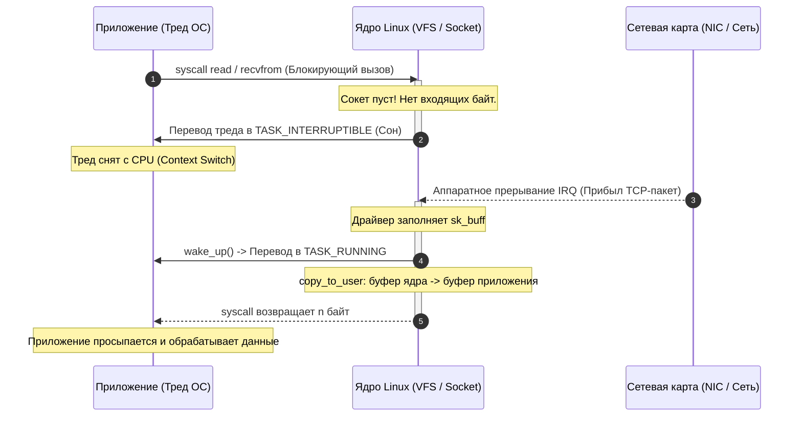
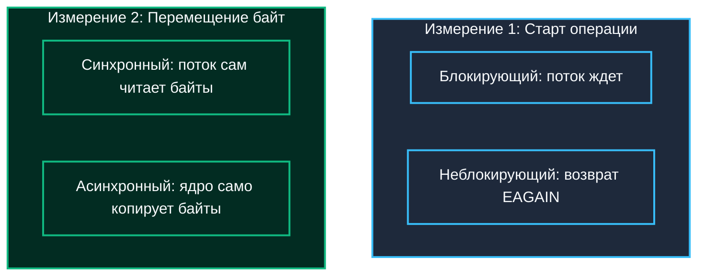
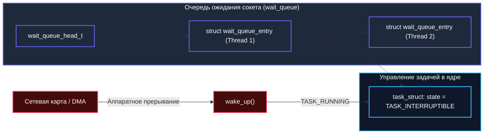

## Разрыв между скоростью CPU и скоростью I/O

В инженерной практике бэкенд-разработки львиная доля времени уходит не на математические расчеты, а на томительное ожидание внешних данных. Процессор совершает миллиарды элементарных тактов в секунду, в то время как чтение сектора с твердотельного накопителя, приход сетевого пакета от клиента или ответ от базы данных требуют микросекунд, миллисекунд, а порой и целых секунд. Отношение скорости процессора к скорости дискового или сетевого ввода-вывода легко достигает `10^6` и выше.

Чтобы ощутить эту физическую пропасть, полезно прибегнуть к наглядной человеческой модели: если один такт современного CPU (0.3 наносекунды) приравнять к **одной секунде** нашей жизни, то:
- Обращение к кэшу L1 (1 нс) займет **3 секунды** (протянуть руку к блокноту на столе).
- Обращение к оперативной памяти RAM (50–100 нс) займет **3–5 минут** (спуститься на первый этаж выпить кофе).
- Чтение блока с быстрого NVMe SSD (20 мкс) займет **почти сутки** непрерывного ожидания.
- Сетевой ping между дата-центрами (20–50 мс) превратится в **от 2 до 5 лет** ожидания!

```mermaid
flowchart LR
    subgraph CPUSpeed["Мир процессора (Такты CPU)"]
        direction TB
        L1["L1 Cache: ~1 нс (3 сек)"]
        RAM["RAM: ~60 нс (3 мин)"]
    end

    subgraph IOSpeed["Мир ввода-вывода (Диск и Сеть)"]
        direction TB
        NVMe["NVMe SSD: ~20 мкс (1 сутки)"]
        Net["Сетевой RTT: ~50 мс (5 лет!)"]
    end

    CPUSpeed <==|"Пропасть задержек: x10^6"|==> IOSpeed

    classDef cpu fill:#022c22,stroke:#10b981,stroke-width:2px,color:#f8fafc;
    classDef io fill:#450a0a,stroke:#f43f5e,stroke-width:2px,color:#f8fafc;

    class CPUSpeed,L1,RAM cpu;
    class IOSpeed,NVMe,Net io;
```

Архитектура подсистемы ввода-вывода определяет, как именно операционная система и среда исполнения справляются с этим колоссальным разрывом. В Go мы привычно пишем лаконичный `conn.Read(buf)` и не задумываемся о внутренней механике. Но именно здесь решается судьба масштабируемости проекта: почему один скромный Go-процесс играючи держит `100k` открытых веб-сокетов, в то время как классический сервис на PHP или традиционной Java свалится в `OOM` или намертво упрется в системные лимиты потоков операционной системы.

---

## Блокирующий I/O: Классический подход

В классической модели **Блокирующий I/O (Blocking I/O)** вызов функции ввода-вывода (например, `read`, `recv`, `os.ReadFile`) полностью останавливает дальнейшее выполнение текущего потока операционной системы до момента физического завершения операции.

```go
func processRequest(conn net.Conn) {
    buf := make([]byte, 4096)
    // Вызов блокирует системный тред (M) до прихода данных
    n, err := conn.Read(buf)
    if err != nil {
        // обработка ошибки
        return
    }
    handle(buf[:n])
}
```



### Что происходит на уровне ОС?

Когда программа делает блокирующий вызов:
1. Пользовательский код вызывает системный вызов `recvfrom` (или `read`). Происходит переключение привилегий процессора из Ring 3 в Ring 0.
2. Ядро проверяет состояние сокета. Если буфер приема пуст, ядро переводит процесс в состояние ожидания (`TASK_INTERRUPTIBLE` в Linux).
3. **Контекстный смен (Context Switch)**: планировщик ОС сохраняет все регистры текущего треда в его структуре ядра, снимает тред с исполнения на процессорном ядре и загружает другой тред.
4. Процессор переключается на другую задачу. За время выполнения чужого кода кэши L1/L2 процессора полностью вымываются (феномен Cache Cold).
5. Наконец сетевая карта получает пакет из физического кабеля, генерирует аппаратное прерывание (IRQ). Драйвер забирает пакет по DMA в буфер ядра (`sk_buff`), передает его в стек TCP/IP и вызывает пробуждение спящего треда.
6. Тред переходит в состояние `TASK_RUNNING`, данные копируются из памяти ядра в пользовательский буфер `buf`, и системный вызов возвращает количество прочитанных байт.

> [!warning] Ловушка / Gotcha
> В классических языках (C, PHP, Java до версий 17) каждый блокирующий I/O требует отдельного системного треда ОС. Треды ОС «тяжелые»: по умолчанию `1-2 МБ` стека на тред, дорогие аллокации в ядре, частые контекстные смены. 
> 
> Попытка завести 50 000 параллельных тредов в Linux неминуемо приведет к исчерпанию оперативной памяти (50 000 * 2 МБ = 100 ГБ одной только памяти под стеки!), а планировщик ядра CFS/EEVDF будет тратить 90% времени CPU исключительно на переключение регистров между тредами. Это фундаментальный барьер проблемы C10K/C100K.

---

## Неблокирующий I/O: Отказ от сна

Идея **Неблокирующего I/O (Non-blocking I/O)** заключается в отказе от усыпления вызывающего потока: если запрашиваемые данные еще не поступили, системный вызов не засыпает, а немедленно возвращает управление в пространство пользователя со специальным кодом ошибки: `EAGAIN` или `EWOULDBLOCK`.

Чтобы включить такой режим, на файловый дескриптор сокета через вызов `fcntl` устанавливается флаг `O_NONBLOCK`:

```go
import (
    "os"
    "syscall"
)

func setNonblocking(fd int) error {
    // Устанавливаем флаг O_NONBLOCK на файловый дескриптор
    flags, err := syscall.FcntlInt(uintptr(fd), syscall.F_GETFL, 0)
    if err != nil {
        return err
    }
    flags |= syscall.O_NONBLOCK
    return syscall.FcntlInt(uintptr(fd), syscall.F_SETFL, flags)
}
```

Однако если приложение просто начнет в цикле непрерывно опрашивать сокет:
```go
for {
    n, err := syscall.Read(fd, buf)
    if err == syscall.EAGAIN {
        continue // Не заснули, но сжигаем 100% ядра процессора!
    }
    break
}
```
Мы получаем катастрофический **busy-waiting** (активный холостой опрос), который мгновенно загрузит все ядра процессора на 100% и разогреет сервер. 

Поэтому неблокирующий режим сокетов никогда не применяется в изоляции. Он всегда работает в тандеме с механизмом **мультиплексирования ввода-вывода (I/O Multiplexing)** — системными селекторами `select`, `poll`, `epoll` или `kqueue`, которые позволяют одному системному потоку эффективно и без сжигания CPU наблюдать за готовностью сотен тысяч дескрипторов одновременно.

---

## Синхронный vs Асинхронный: Терминологическая ловушка

На собеседованиях и в профессиональных дискуссиях термины «асинхронный» и «неблокирующий» нередко ошибочно используют как синонимы. Между тем, в классической классификации Ричарда Стивенса (UNIX Network Programming) это два совершенно независимых ортогональных измерения:

1. **Блокирующий vs Неблокирующий** — определяет поведение вызова **в момент инициации**: ждет ли системный вызов в ядре, пока данные появятся, или возвращает управление в программу немедленно.
2. **Синхронный vs Асинхронный** — определяет способ **передачи данных и уведомления о завершении**: происходит ли фактическое чтение данных в контексте вызывающего потока (синхронно), или ядро само наполняет пользовательский буфер и уведомляет приложение постфактум через callback/сигнал (асинхронно).



| Модель | Блокирующий вызов | Уведомление о завершении | Примеры из реального мира |
|:---|:---|:---|:---|
| **Sync Blocking** | Ждет готовности данных | В том же потоке | PHP (FPM), классическая Java (Thread-per-Request), стандартный C `read` |
| **Sync Non-blocking** | Возвращает `EAGAIN` | Опрос (`poll`/`select`) | C с `epoll` + `O_NONBLOCK`, Nginx (worker loop) |
| **Async Blocking** | Ждет завершения IO | Callback / сигнал | POSIX `aio_*` (на практике почти не применяется из-за накладных расходов) |
| **Async Non-blocking** | Возвращает управление сразу | Event loop / Scheduler | Windows `IOCP`, Linux `io_uring`, среда Node.js, рантайм Go (`netpoll`) |

> [!tip] Собеседование
> **Вопрос:** «Является ли Go асинхронным языком программирования?»
> 
> **Ответ:** С точки зрения архитектуры рантайма — **Go использует синхронный неблокирующий ввод-вывод**.
> Для прикладного разработчика вызов `conn.Read()` выглядит как абсолютно синхронный блокирующий код: функция не принимает callback'ов, не возвращает Promise/Future, а последовательно возвращает прочитанные байты или ошибку.
> 
> Однако под капотом рантайм Go переводит все сетевые сокеты в неблокирующий режим `O_NONBLOCK`. При попытке чтения, если данных нет, системный тред операционной системы `M` не блокируется! Горутина бережно паркуется рантаймом в спящее состояние, а тред `M` немедленно берет на исполнение другую горутину. Когда ядро уведомляет Go о прибытии пакета, планировщик пробуждает спящую горутину. Это элегантное сочетание синхронного стиля кода для человека и асинхронного мультиплексирования для операционной системы!

---

## Под капотом ОС: Состояния процесса и очереди ожидания

Когда тред ОС блокируется на операции ввода-вывода, ядро Linux не просто выключает ему процессор. Внутри подсистемы планирования ядра разворачивается четкий сценарий:



1. **Аллокация структуры ожидания**: Ядро инициализирует структуру `struct wait_queue_entry` и прикрепляет ее к очереди ожидания сокета `wait_queue`.
2. **Смена состояния**: Ядро устанавливает флаг `task->state = TASK_INTERRUPTIBLE`. Планировщик Linux видит, что процесс заблокирован ожиданием внешнего события, и исключает его из очередей исполнения (runqueue).
3. **Пробуждение**: При поступлении пакета от аппаратного контроллера сетевой стек выполняет функцию `wake_up()` на соответствующей очереди `wait_queue`. Ядро находит связанный дескриптор задачи `task_struct`, возвращает флаг `TASK_RUNNING` и возвращает процесс в очередь планировщика.

Это объясняет, почему традиционная модель `fork` или «один тред ОС на одно сетевое соединение» принципиально не способна масштабироваться до миллионов клиентов: каждый ожидающий поток держит структуру `task_struct`, стек ядра и запись в очередях `wait_queue`. При `100k` открытых сокетов это превращается в сотни мегабайт служебных структур ядра и паралич планировщика.

---

## Go Runtime: Как горутина «не блокирует» тред

Go преодолевает эти ограничения благодаря встроенному сетевому поллеру — **netpoller** — и знаменитой трехуровневой модели планировщика **`M-P-G`** (Machine-Processor-Goroutine).

Когда прикладной код на Go вызывает `conn.Read()`:
1. **Неблокирующая попытка:** Сокет под капотом обернут в структуру `netFD` и находится в режиме `O_NONBLOCK`. Go делает системный вызов `read`. Если данные уже в буфере ядра — они моментально читаются, и горутина продолжает исполнение без малейших задержек.
2. **Парковка горутины:** Если данных нет и ядро возвращает ошибку `EAGAIN`, горутина `G` не переводит системный поток `M` в состояние сна. Рантайм меняет статус горутины с `_Grunning` на `_Gwaiting` и регистрирует дескриптор сокета в системном селекторе `netpoll` (в Linux — `epoll`).
3. **Освобождение системного треда M:** Системный поток операционной системы `M` не засыпает в ядре! Он выполняет процедуру `M-park` только если в системе нет работы, либо берет другую готовую к выполнению горутину из локальной очереди логического процессора `P`. Тред продолжает непрерывно молотить полезный код!
4. **Пробуждение через netpoller:** В фоне специальный поток планировщика (или любой свободный `M` во время поиска работы) периодически вызывает неблокирующий `netpoll` (вызов `epoll_wait`). Как только ядро сообщает, что в сокете появились байты, netpoller переводит ожидающую горутину `G` обратно в состояние `_Grunnable` и отправляет ее в очередь на исполнение.

```go
// Концептуальный псевдокод логики сетевого поллера Go
func netpoll(block bool) []g {
    events := epoll.Wait(&ev, 64, timeout) // syscall epoll_wait
    var ready []g
    for _, ev := range events {
        if ev.Events&EPOLLIN != 0 {
            // Сокет готов к чтению
            g := pollCache.get(ev.Fd)
            ready = append(ready, g)
        }
    }
    return ready
}
```

> [!info] Под капотом
> В операционной системе Linux сетевой поллер Go использует `epoll` в бескомпромиссном режиме **`EPOLLET` (Edge-Triggered)**. 
> 
> В отличие от Level-Triggered режима, событие Edge-Triggered генерируется ядром *ровно один раз* — в момент перехода из состояния «нет данных» в состояние «появились данные». Сетевой поллер рантайма и внутренняя абстракция `netFD` обязаны в цикле вычитывать все доступные байты до получения ошибки `EAGAIN`, иначе оставшиеся байты застрянут в сокете без повторных уведомлений.
> 
> На платформах BSD и macOS рантайм Go точно так же прозрачно опирается на `kqueue`, а в Windows — на порты завершения ввода-вывода `IOCP`. Все они решают одну ключевую задачу: асинхронное уведомление планировщика о готовности данных без усыпления потоков ОС.

---

## Сравнение подходов: Go vs PHP / Java / Node.js

| Характеристика | PHP (FPM) | Java (Virtual Threads / NIO) | Node.js | Go |
|:---|:---|:---|:---|:---|
| **Базовая модель** | Process per request | Thread per request (или VThreads) | Single-threaded Event Loop | Multi-threaded Scheduler |
| **Блокировка I/O** | Блокирует процесс | Блокирует тред ОС | Не блокирует (async/await) | Блокирует горутину, не тред |
| **Масштабирование** | Ограничено `ulimit` процессов | `OOM` / Context Switch overhead | Callback hell / Event loop contention | Легко держит `100k+` горутин на процесс |
| **Стоимость контекста** | Очень высокая (`fork`/`exec`) | Высокая (kernel thread switch) | Низкая (JS stack) | Минимальная (~10-20 нс в userspace) |

Go не стал изобретать сложные для восприятия callback-модели или вводить в язык ключевые слова вроде `async`/`await`. Вместо этого язык соединил проверенную временем простоту классического синхронного кода с невероятной производительностью неблокирующего ядра операционной системы.

> [!warning] Ловушка / Gotcha
> **CPU Bound vs IO Bound:** Горутины экономят память и контекстные смены *только* при ожидании I/O. Если горутина делает тяжелые вычисления (шифрование, сжатие видео, сортировка миллиардов чисел в памяти), она монополизирует системный тред `M`. 
> 
> В таких сценариях netpoller бессилен: если все ваши `M` заняты чистыми вычислениями, сетевой поллер просто не сможет найти свободный тред для запуска разбуженных горутин! Для специфичных системных вызовов, требующих привязки к конкретному системному потоку, используют вызов `runtime.LockOSThread()`, а тяжелые CPU-bound вычисления балансируют с учетом доступных ядер или выносят в изолированные фоновые процессы.

---

## Итог

1. **Блокирующий I/O** усыпляет системный поток ОС в состоянии `TASK_INTERRUPTIBLE`, приводя к дорогому контекстному переключению ядра и вымыванию процессорных кэшей L1/L2.
2. **Неблокирующий I/O** возвращает управление немедленно с кодом `EAGAIN`, но требует селекторов мультиплексирования (`epoll`, `kqueue`) во избежание сжигания CPU в цикле busy-waiting.
3. **Синхронный vs Асинхронный** — это различие в способе уведомления о завершении операций, а не в факте немедленного возврата вызова.
4. **Go реализует синхронный неблокирующий ввод-вывод:** программист пишет простой последовательный код `conn.Read()`, в то время как рантайм Go через `netpoller` паркует легкую горутину `G`, освобождая системный тред `M` для других задач.
5. Феноменальная способность Go обслуживать свыше `100k+` одновременных сетевых соединений базируется на исключении тяжелых системных тредов ОС и переносе управления блокировками в легковесный планировщик.

Мы разобрались с тем, как операционная система переводит потоки в режим ожидания и почему наивный опрос не работает. В следующей лекции мы детально проследим историю борьбы за масштабируемость и эволюцию системных селекторов ядра Linux: `[[36. select, poll и epoll.md]]`.
