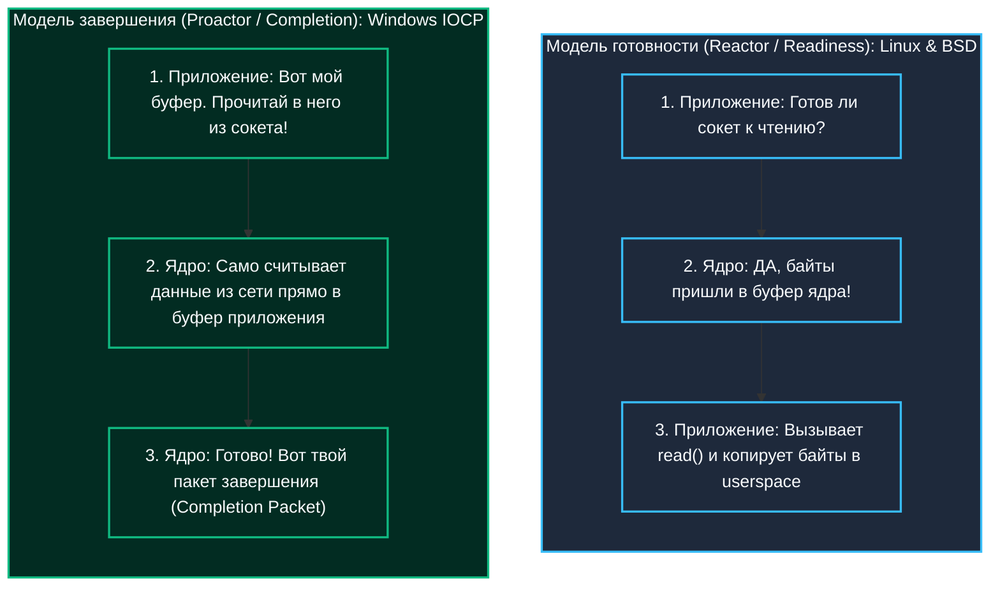
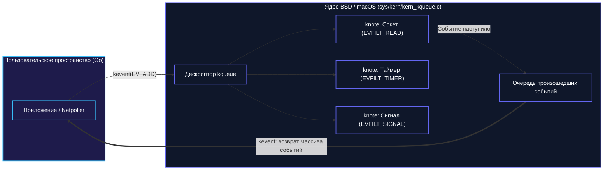
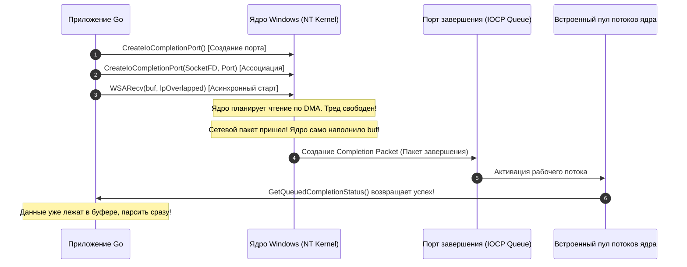
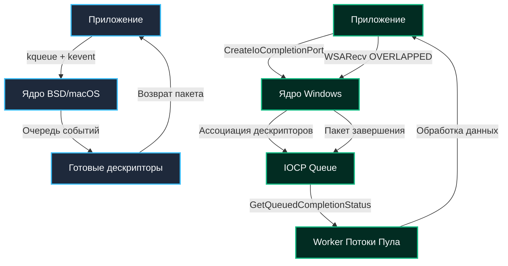
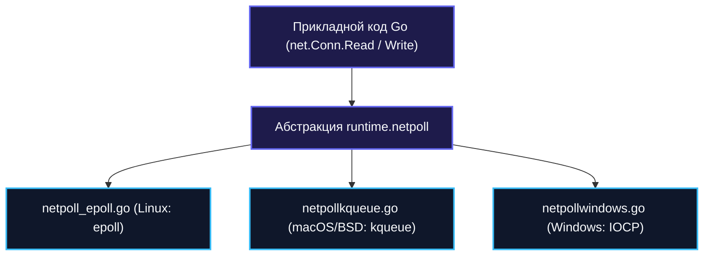

## Введение: Разные философии I/O

В современной серверной разработке Linux занимает доминирующее положение. Однако компилятор и рантайм языка Go создавались как бескомпромиссно кроссплатформенная среда: один и тот же исходный код обязан с максимальной производительностью работать на ноутбуках разработчиков под управлением macOS, в промышленных кластерах под FreeBSD или в корпоративной инфраструктуре под управлением Windows Server.

Каждая из этих операционных систем пришла к высоконагруженному сетевому вводу-выводу своим собственным историческим путем. За внешне одинаковым поведением сетевого пакета `net/http` и планировщика горутин скрываются принципиально разные архитектурные философии:
- **Linux** сделал ставку на `epoll` — модель уведомления о готовности (Readiness Model / Reactor).
- **BSD-семейство (FreeBSD, macOS, OpenBSD)** создало **`kqueue`** — универсальную декларативную событийную шину ядра (Event Notification).
- **Windows** пошла по принципиально иному пути, создав **`IOCP` (I/O Completion Ports)** — архитектуру уведомления о завершении операций (Completion Model / Proactor).

Для Senior Go-инженера понимание разницы между `kqueue` и `IOCP` — это не академическая экзотика. Это ключ к профилированию сетевых задержек, предотвращению скрытых утечек дескрипторов и пониманию того, как единый `netpoller` в рантайме Go связывает воедино несовместимые механизмы ядра.



---

## kqueue: Декларативная модель событий BSD/macOS

В 2000 году Джонатан Лемон (Jonathan Lemon) представил в FreeBSD 4.1 подсистему **kqueue** (Kernel Queue), которая впоследствии стала стандартом де-факто во всех современных BSD-системах, включая macOS и iOS. 

Главное архитектурное достоинство `kqueue` перед Linux-овым `epoll` — его потрясающая **ортогональность и универсальность**. В то время как `epoll` создавался исключительно под файловые дескрипторы (сокеты, пайпы), `kqueue` изначально проектировалась как всеобъемлющая событийная шина операционной системы.

### Устройство под капотом

В отличие от `epoll`, где вы создаете единый контекст и добавляете туда дескрипторы, `kqueue` работает на уровне **очередей событий**. Процесс вызывает системный вызов `kqueue()` и получает новый дескриптор очереди. Далее через системный вызов `kevent()` вы регистрируете гибкие фильтры:
- `EVFILT_READ` / `EVFILT_WRITE` — готовность сокета или файла к чтению/записи.
- `EVFILT_TIMER` — аппаратные таймеры ядра с точностью до наносекунд (заменяет `timerfd`).
- `EVFILT_SIGNAL` — получение сигналов ядра без традиционных хрупких signal handler (заменяет `signalfd`).
- `EVFILT_PROC` — мониторинг жизненного цикла других процессов (`fork`, `exec`, `exit`).
- `EVFILT_VNODE` — отслеживание изменений в файловой системе (удаление, переименование, запись файлов — аналог Linux `inotify`).

```c
#include <sys/event.h>
int kqueue(void);
int kevent(int kq, const struct kevent *changelist, int nchanges,
           struct kevent *eventlist, int nevents, const struct timespec *timeout);
```



Каждый зарегистрированный фильтр привязывается к конкретному дескриптору. Ядро создает внутренние структуры (обычно это хеш-таблицы с цепочками и связными списками внутри `sys/kern/kern_kqueue.c`), которые отслеживают состояние. Когда событие происходит, ядро помещает пакет `kevent` в очередь, связанную с дескриптором. Приложение вызывает `kevent()` с нулевым timeout, и ядро возвращает только те события, которые действительно произошли.

> [!info] Под капотом
> Внутреннее представление `kqueue` в ядре FreeBSD/macOS опирается на структуру `kqueue` (ядро) и `knote` (привязка к дескриптору). При регистрации фильтра ядро создает `knote` и добавляет его в список зависимостей. Это позволяет реализовать сложные сценарии: например, автоматическую регистрацию `EVFILT_WRITE` при открытии сокета в состоянии `LISTEN`. 
> 
> Стоимость регистрации события близка к O(1), а стоимость получения готовых событий — O(n), где n — количество изменившихся дескрипторов за период ожидания.

---

## IOCP: Модель завершения операций Windows

Инженеры операционной системы Windows NT под руководством легендарного Дэйва Катлера (Dave Cutler) пошли совершенно иным путем. Windows не использует `epoll` или `kqueue`. Вместо этого она реализует **I/O Completion Ports** (IOCP). Это механизм, основанный на парадигме **completion notification** (уведомление о завершении), а не опросе состояния.

В модели Linux/BSD сетевой поллер ждет, пока сокет станет *готов* к чтению, после чего пользовательский поток выполняет системный вызов `read` и ждет, пока байты скопируются из памяти ядра. В Windows приложение передает указатель на свой пользовательский буфер ядру **заранее**: *«Ядро, читай в этот буфер, а когда закончишь — дай знать»*.

### Устройство под капотом

Архитектура IOCP строится вокруг четкого четырехэтапного протокола:



1. **Создание порта:** Вызов `CreateIoCompletionPort()` возвращает дескриптор порта завершения.
2. **Ассоциация дескрипторов:** Вызовите `CreateIoCompletionPort()` повторно, передав файловый дескриптор или сокет. Ядро привязывает его к порту.
3. **Запуск асинхронного I/O:** Вы используете `ReadFile` / `WSARecv` с флагом `OVERLAPPED`. Вместо того чтобы блокировать поток, ядро планирует операцию и возвращает управление немедленно.
4. **Получение результата:** Приложение вызывает `GetQueuedCompletionStatus()`. Если операция еще не завершена, поток блокируется внутри ядра. Как только I/O заканчивается, ядро создает **Completion Packet** (пакет завершения) и помещает его в очередь порта. Блокированный поток пробуждается, забирает пакет и обрабатывает данные.

Ключевая особенность IOCP — **встроенный пул потоков ядра**. При создании порта вы можете указать лимит одновременно исполняемых потоков (Concurrency Value, обычно равный числу логических ядер процессора). Ядро Windows отслеживает состояние потоков: если один из потоков пула заблокировался (например, на мьютексе или страничном сбое), ядро немедленно будит следующий поток. Это предотвращает создание "thundering herd" (лавинного пробуждения потоков) и минимизирует смену контекстов CPU.

> [!warning] Ловушка
> IOCP не работает с классическим `select` или `poll`. Если вы попытаетесь использовать стандартные POSIX-функции ожидания на Windows, они будут эмулированы через `GetQueuedCompletionStatus` с таймаутом, что приведет к серьезным потерям производительности и ложным срабатываниям. 
> 
> Попытка перенести сетевую библиотеку с Linux на Windows путем слепой подстановки `select` превратит масштабируемый сервер в неповоротливого монстра.

---

## Архитектурное сравнение: BSD vs Windows

| Характеристика | kqueue (BSD/macOS) | IOCP (Windows) |
|---|---|---|
| **Парадигма** | Event Notification (опрос готовых дескрипторов) | Completion Notification (ожидание завершения операций) |
| **Модель потоков** | Приложение само опрашивает очередь (`kevent`) | Ядро само пробуждает потоки из пула при завершении I/O |
| **API сложность** | Высокая (структуры `kevent`, флаги `EV_ADD/EV_DELETE`) | Средняя (абстракция `OVERLAPPED` + Completion Packets) |
| **Масштабирование** | Ограничено количеством дескрипторов и syscall overhead | Высокое за счет внутреннего ядра-пула потоков |
| **Таймеры** | `EVFILT_TIMER` с точностью до наносекунд | Отдельные механизмы (Timer Queue API) или `WaitForSingleObjectEx` |



---

## Как Go Runtime абстрагирует эти механизмы

Язык Go избавляет разработчика от необходимости писать платформо-зависимые ветвления `#ifdef` или дублировать логику под разные ОС. Пакет `runtime` содержит единую внутреннюю подсистему `netpoll`, которая элегантно инкапсулирует фундаментальные различия между readiness- и completion-моделями:



### На macOS/BSD (`netpollkqueue.go`):
1. При старте рантайма Go создает один глобальный дескриптор `kqueue`.
2. При открытии сетевого соединения Go регистрирует фильтры вызовом `kevent` с масками `EVFILT_READ | EV_ADD` и `EVFILT_WRITE | EV_ADD`.
3. В цикле планировщика функция `runtime.netpoll` периодически вызывает `kevent` с нулевым timeout. Как только ядро возвращает готовый дескриптор, Go находит ассоциированную структуру горутины, переводит ее в состояние `runnable` и пробуждает планировщик.

### На Windows (`netpollwindows.go`):
1. Go создает один глобальный порт завершения вызовом `CreateIoCompletionPort`.
2. Все открытые сетевые сокеты связываются с этим портом.
3. Поскольку Windows требует запустить операцию заранее, Go выделяет служебную структуру `runtime.netpollLink` (или `netpollLink`) и передает ее в вызовы `WSARecv` / `ReadFile` через указатель `lpOverlapped`.
4. Функция `runtime.netpoll` вызывает системную функцию `GetQueuedCompletionStatus`. Когда ядро сообщает о завершении асинхронного чтения, Go извлекает указатель на `netpollLink`, находит связанную горутину и переводит её в состояние `runnable`.

> [!tip] Собеседование
> **Вопрос:** Почему реализация `netpoll` на Windows концептуально сложнее, чем на Linux или macOS?
> 
> **Ответ:** Linux (`epoll`) и BSD (`kqueue`) работают по модели готовности (Readiness): они сообщают сокету, что данные *можно прочитать*. Сам системный вызов чтения Go делает уже после пробуждения горутины.
> 
> Windows (`IOCP`) работает по модели завершения (Completion): она требует инициировать операцию чтения *до* того, как горутина уснет. Go вынужден выделять структуры памяти под операцию (`lpOverlapped` / `netpollLink`), удерживать буферы заблокированными в памяти и полагаться на планировщик IOCP ядра для обработки завершений. Это делает рантайм Go под Windows архитектурно иным внутри, но сохраняет единый публичный API для программиста.

---

## Ловушки и архитектурные нюансы

1. **Различия в TCP стеке:** Сетевой стек Windows NT разрабатывался независимо от классического стека BSD. Особенности закрытия соединений, длительность фазы `TIME_WAIT` и семантика сокетных опций вроде `SO_REUSEADDR` имеют тонкие платформенные различия. Это проявляется при высоконагруженном перезапуске сервисов (graceful shutdown) и повторном открытии локальных портов.
2. **Управление памятью дескрипторов в macOS:** Таймеры `EVFILT_TIMER` в `kqueue` жестко привязаны к дескриптору очереди. При закрытии очереди таймеры мгновенно аннулируются ядром. Рантайм Go обязан с ювелирной точностью координировать жизненный цикл системных структур, предотвращая утечки ресурсов.
3. **Производительность пула потоков IOCP:** В Windows-окружении пропускная способность сервера критически зависит от глубины пула завершения. При некорректно подобранных лимитах потоки начинают бороться за ядро, вызывая пробуксовку `GetQueuedCompletionStatus`. Go нивелирует этот риск с помощью внутренней координации планировщика через вызовы `runtime.gopark` и асинхронного пробуждения горутин.
4. **Кроссплатформенное тестирование:** Автотесты, которые безупречно проходят на локальном MacBook разработчика (где работает `kqueue`), могут спотыкаться на CI-серверах под Linux (`epoll`) или Windows (`IOCP`) из-за микросекундных различий в гранулярности таймеров и порядке доставки пакетов в очередях событий.

---

## Итог

1. **`kqueue` (BSD/macOS)** и **`IOCP` (Windows)** воплощают две различные инженерные парадигмы: модель уведомления о готовности (Reactor) против модели уведомления о завершении (Proactor).
2. **`kqueue`** выделяется широтой охвата: через единый дескриптор очереди и структуры `knote` она мониторит сокеты, таймеры, сигналы ОС и файловые события `vnode`.
3. **`IOCP`** перекладывает бремя мультиплексирования на ядро Windows: приложение передает буфер заранее через структуру `OVERLAPPED`, а ядро по завершении DMA-чтения пробуждает рабочий поток из внутреннего пула.
4. В рантайме Go обе архитектуры гармонично скрыты внутри сетевого поллера (`netpollkqueue.go` и `netpollwindows.go`), позволяя приложению использовать чистый синхронный синтаксис `conn.Read()` без потери наносекунд производительности.

В следующей статье мы заглянем в самое сердце сетевого поллера Go: `[[38. Как netpoller Go использует epoll и kqueue.md]]`, где детально разберем внутренние структуры данных рантайма, координацию с системным монитором `sysmon` и то, как исключаются взаимные блокировки при сетевых вызовах.
