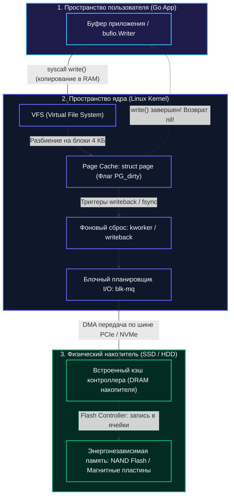
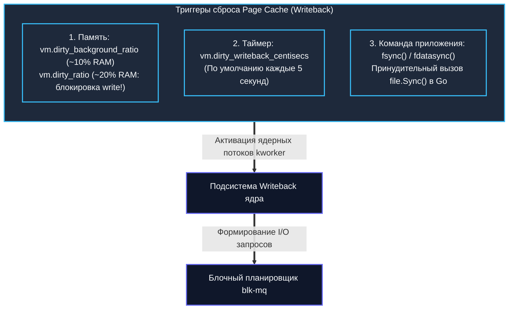

## Прерывая иллюзию мгновенной записи

Когда в коде на Go функция `os.WriteFile()` или метод `bufio.Writer.Flush()` возвращает `nil`, подавляющее большинство программистов подсознательно считает задачу выполненной: байты в безопасности, файл надежно сохранен.

Это одна из самых опасных и коварных иллюзий в компьютерных науках. 

В современной операционной системе успешное завершение системного вызова `write()` означает ровно одно: **ядро Linux приняло ваши байты и скопировало их в оперативную память (DRAM)**. И только! Физическое попадание данных на магнитные пластины жесткого диска или в ячейки памяти твердотельного накопителя (NAND Flash) произойдет позже — асинхронно, через секунды или даже десятки секунд, с переупорядочиванием, объединением блоков и риском мгновенной потери при внезапном сбое электропитания.

Для Senior-разработчика и архитектора понимание истинного пути байта от пользовательского буфера до кремния критично: оно определяет архитектуру баз данных, движков логов (WAL), очередей сообщений и компромисс между задержкой (latency), пропускной способностью (throughput) и надежностью хранения (durability).



---

## Виртуальная файловая система и Page Cache

Когда пользовательская программа вызывает системный вызов `write()`, управление переходит в **VFS (Virtual File System)** — абстрактный уровень ядра Linux, унифицирующий интерфейс к самым разным файловым системам: ext4, XFS, Btrfs, ZFS, NFS или псевдо-ФС вроде `tmpfs`.

VFS проверяет дескриптор файла, валидирует права доступа, переводит файловые смещения в номера логических блоков и передает данные главному диспетчеру дисковой памяти — подсистеме **Page Cache**.

Page Cache — это сердце механизма буферизации ввода-вывода операционной системы. Память современных серверов исчисляется десятками и сотнями гигабайт. Заставлять процессор ждать миллисекунды механического диска или контроллера SSD при каждой мелкой записи было бы безумием. Поэтому Linux использует всю свободную оперативную память как гигантский кэш дисковых блоков:
- **Read-ahead (опережающее чтение):** если программа читает файл последовательно, ядро заранее загружает в память следующие страницы, сводя к нулю будущие задержки.
- **Write-back (отложенная запись):** системный вызов `write()` мгновенно копирует байты из пользовательского пространства в страницу Page Cache и немедленно возвращает управление. Для приложения операция завершена за микросекунды!

> [!info] Под капотом
> В ядре Linux данные в Page Cache представлены фундаментальной структурой `struct page`. Каждая физическая страница (традиционно 4 КБ) содержит:
> - `mapping` — указатель на структуру `address_space` (представляет конкретный файл в кэше ядра).
> - `private` — указатель на вспомогательную структуру `buffer_head` (связывает страницу с конкретными блоками на блочном устройстве).
> - `flags` — битовая маска статусов страницы: `PG_dirty` (страница изменена в RAM, но еще не записана на диск), `PG_uptodate` (данные в странице актуальны), `PG_locked` (страница заблокирована операцией ввода-вывода).
> 
> Когда программа вызывает `write()`, ядро находит страницу в дереве радикса (XArray/Radix Tree), копирует байты из буфера приложения функцией `copy_from_user()`, помечает страницу флагом `PG_dirty` и инкрементирует системный счетчик `mapping->dirty_pages`. Физический накопитель в этот момент даже не знает о том, что данные изменились!

---

## Асинхронный writeback и планировщик

«Грязные» страницы не могут оставаться в памяти бесконечно. Рано или поздно их необходимо сбросить на долговременный носитель (процедура *Flushing / Writeback*).

В ядре Linux существует три независимых триггера, инициирующих выталкивание данных:



1. **Переполнение лимита памяти:** если объем «грязных» страниц превышает параметр `vm.dirty_background_ratio` (обычно 10% оперативной памяти), ядро в фоне запускает сброс. Если же поток записи настолько интенсивен, что объем dirty страниц достигает жесткого предела `vm.dirty_ratio` (около 20%), ядро принудительно **блокирует пишущие процессы**, заставляя их самих сбрасывать свои страницы на диск!
2. **Таймер старения:** системный пул потоков ядра `kworker` (ранее известный как `pdflush` и `flush-x:y`) регулярно просыпается каждые 5 секунд (параметр ядра `vm.dirty_writeback_centisecs`) и сбрасывает страницы, чей возраст превысил `vm.dirty_expire_centisecs` (по умолчанию 30 секунд).
3. **Требование прикладной программы:** явный вызов системных функций `fsync()`, `fdatasync()` или метода `file.Sync()` в языке Go.

Сформированные блочные запросы поступают в современный многоочередной планировщик блочного ввода-вывода ядра — **`blk-mq`** (Multi-Queue Block Layer). Планировщик объединяет смежные секторы (coalescing), сортирует запросы по физическому LBA-адресу на накопителе и передает их аппаратному драйверу через DMA.

---

## Журналирование: цена консистентности

Что произойдет, если в сервер внезапно ударит молния или оператор случайно выдернет шнур питания, пока гигабайты данных находятся в состоянии `PG_dirty`?

Данные в оперативной памяти испарятся мгновенно. Но куда страшнее другое: файл может оказаться записан частично, а служебные структуры файловой системы (указатели на блоки, свободные иноды, суперблок) окажутся в рассинхронизированном, поврежденном состоянии. Исторически после такого краша приходилось часами ждать выполнения утилиты `fsck`, которая сканировала терабайты диска в поисках битых ссылок.

Для решения этой проблемы современные файловые системы (ext4, XFS) используют **журналирование (Journaling)**:
- Перед тем как вносить изменения в основные таблицы метаданных, файловая система атомарно записывает компактную транзакцию в специальную кольцевую область диска — **журнал (Journal / WAL)**.
- После фиксации транзакции в журнале (Journal Commit) данные и метаданные не спеша переносятся на свои постоянные места.
- При аварийном рестарте ядро просто просматривает журнал: незавершенные транзакции отбрасываются, завершенные — донакатываются за доли секунды.

> [!warning] Ловушка / Gotcha
> Журналирование защищает файловую систему от **структурной несогласованности (corruption)**, но по умолчанию не защищает ваши пользовательские данные от **потери**!
> 
> В стандартном режиме ext4 (`data=ordered`) в журнал записываются **только метаданные** файла (размер, владелец, права, адреса блоков). Если вы записали 100 МБ данных, `write()` вернул `nil`, а через секунду сервер потерял питание — вы потеряете все 100 МБ, хотя сама файловая система останется идеально целой и не потребует запуска `fsck`. 
> Это фундаментальное различие между *Durability* (долговечностью сохранения информации) и *Consistency* (внутренней непротиворечивостью служебных структур ФС).

---

## Принудительная синхронизация и обход кэшей

Если вы разрабатываете базу данных, WAL-журнал, финансовый реестр или очередь сообщений уровня Kafka, полагаться на милость таймера ядра `kworker` категорически запрещено. Вы обязаны принудительно заставить ядро вытолкнуть данные на физический диск:

| Механизм | Поведение и область действия | Накладные расходы |
|----------|------------------------------|-------------------|
| **`fsync(fd)`** | Принудительно выталкивает из Page Cache на накопитель как само тело файла, так и все его метаданные (размер файла, время модификации `mtime`, права доступа). Блокирует вызывающий поток. | Высокие (требует как минимум двух дисковых I/O: запись данных + запись метаданных в журнал). |
| **`fdatasync(fd)`** | Выталкивает только страницы с телом файла. Метаданные сбрасываются только если они критичны для чтения данных (например, увеличился размер файла). | Заметно быстрее `fsync`, так как исключает лишние коммиты метаданных в журнал ФС. |
| **`O_SYNC` / `O_DSYNC`** | Флаги при открытии файла (`os.O_SYNC`). Заставляют абсолютно каждый системный вызов `write()` немедленно блокироваться до подтверждения от диска. | Катастрофически низкая производительность. Подходит только для редких микро-записей. |
| **`O_DIRECT`** | Полный обход Page Cache. Байты копируются контроллером DMA напрямую из буфера в userspace на накопитель. | Нулевой overhead на кэш ядра, но требует строгого выравнивания буферов по границе 4096 байт. |

```go
package main

import (
	"bufio"
	"log"
	"os"
)

func main() {
	// Идиоматичный подход: буферизация в userspace + явная синхронизация
	file, err := os.OpenFile("data.bin", os.O_CREATE|os.O_WRONLY|os.O_APPEND, 0644)
	if err != nil {
		log.Fatalf("open: %v", err)
	}
	defer file.Close()

	// bufio.Writer работает в памяти userspace, не дергая системные вызовы на каждый чих
	bw := bufio.NewWriterSize(file, 64*1024)
	
	if _, err := bw.WriteString("Критически важная транзакция
"); err != nil {
		log.Fatalf("write: %v", err)
	}
	
	// 1. Принудительно сбрасываем пользовательский буфер в ядро Linux (системный вызов write)
	if err := bw.Flush(); err != nil {
		log.Fatalf("flush: %v", err)
	}

	// 2. Принудительно заставляем ядро вытолкнуть Page Cache на физический накопитель
	// Вызывает fsync(fd) под капотом
	if err := file.Sync(); err != nil {
		log.Fatalf("sync: %v", err)
	}
	
	log.Println("Данные гарантированно записаны на энергонезависимый носитель!")
}
```

---

## Mechanical Sympathy: Путь байта до NAND-ячеек

Для глубокого понимания физики процесса Senior-инженеру необходимо проследить путь байта до кремниевых кристаллов:

1. **CPU Cache Coherency:** Из регистров процессора данные попадают в кэш L1d/L2/L3. При вызове `write()` ядро копирует данные в оперативную память. Контроллер памяти процессора может буферизовать операцию в store buffer.
2. **DMA Engine (Direct Memory Access):** Процессор не занимается ручным переносом байтов на диск. Контроллер накопителя по шине PCIe через интерфейс NVMe напрямую считывает физические страницы памяти через DMA. Чтобы контроллер диска прочитал актуальные данные, ядро обеспечивает согласованность кэшей (инструкции `clflush` или `wbinvd`).
3. **Disk Controller Cache:** Любой современный корпоративный SSD или HDD оснащен собственной энергозависимой памятью DRAM (Write-back cache). Контроллер диска может радостно отрапортовать операционной системе: «Я записал данные!», хотя байты все еще находятся в его внутренней микросхеме DRAM. Если на диске нет конденсаторов резервного питания (Power Loss Protection, PLP), авария обесточивания сотрет эти данные! Поэтому честный `fsync()` посылает накопителю специальную аппаратную команду — **Flush Cache** (SYNCHRONIZE CACHE в SCSI/SATA или Flush в NVMe).
4. **NAND Flash & Wear Leveling:** Флеш-память не умеет перезаписывать байты на месте: блок ячеек (1–8 МБ) нужно сначала стереть высоким напряжением, и только потом записать страницы (4–16 КБ). Контроллер SSD непрерывно распределяет запись (Wear Leveling) и выполняет сборку мусора (Garbage Collection). Это порождает непредсказуемые хвостовые задержки (p99 latency) при интенсивной дисковой записи.

> [!tip] Собеседование
> **Вопрос:** Почему системный вызов `fsync()` может быть в 100–1000 раз медленнее, чем системный вызов `write()`?
> 
> **Ответ:** Системный вызов `write()` — это ультрабыстрое копирование байт из одного участка оперативной памяти в другой (`copy_from_user` в Page Cache ядра со скоростью десятков гигабайт в секунду, измеряемое наносекундами).
> 
> Вызов `fsync()` выполняет тяжелейшую комплексную операцию:
> 1. Находит все dirty страницы в Page Cache и ставит их в очередь DMA.
> 2. Блокирует поток приложения до физического подтверждения от контроллера накопителя.
> 3. Обновляет метаданные файловой системы (размер, временные метки) и фиксирует транзакцию в дисковом журнале ФС.
> 4. Отправляет контроллеру диска аппаратную команду очистки внутреннего кэша (NVMe Flush), заставляя его физически прошить плавающие затворы NAND-ячеек. На обычном SSD это занимает миллисекунды (в сотни тысяч раз дольше, чем обращение к RAM!).

---

## Go-идиомы и производительность

В языке Go взаимодействие с этой сложной цепочкой опирается на выверенные идиомы:

- **Разделяйте буферы:** Тип `os.File` делает прямой системный вызов `syscall.Write` на каждый метод `Write()`. Если писать по 10 байт в цикле, программа утонет в смене контекстов между User Space и Kernel Space. Всегда оборачивайте файл в `bufio.NewWriterSize()`.
- **Осторожно с `file.Sync()`:** Вызов `file.Sync()` в Linux вызывает `fsync(fd)` (а для диапазона страниц — системный вызов `sync_file_range`). Не вызывайте его на каждый HTTP-запрос! Используйте групповой коммит (Group Commit, как в PostgreSQL или BadgerDB): накапливайте транзакции от нескольких горутин и сбрасывайте их одним вызовом `Sync()`.
- **Флаг `O_DIRECT` для баз данных:** Высоконагруженные СУБД используют `O_DIRECT`, чтобы исключить двойное кэширование (данные кэшируются в пуле СУБД и дублируются в Page Cache ядра) и защитить ядро от вымывания полезного кэша.

> [!warning] Ловушка / Gotcha
> Использование флага `O_DIRECT` требует жесточайшей дисциплины: адреса буферов в памяти, размеры порций данных и файловые смещения обязаны быть строго кратны размеру сектора диска или страницы памяти (обычно 4096 байт). 
> 
> Если буфер в Go выделен стандартным `make([]byte, 4096)`, он не выровнен по границе страницы! Попытка сделать прямой вызов `syscall.Write` с невыровненным слайсом завершится системной ошибкой **`EINVAL` (Invalid argument)**. Для создания выровненных буферов используют специальное выделение памяти через `syscall.Mmap` или вспомогательные функции выравнивания, а также проверяя поддержку через `file.Readdir(0)` или пробный `syscall`.

---

## Итог и переход

1. **`write()` не сохраняет данные на диск:** Успешный возврат означает лишь то, что ядро Linux скопировало данные в **Page Cache** в оперативной памяти и выставило флаг **`PG_dirty`**.
2. **Асинхронный Writeback:** Ядерные потоки **`kworker`** сбрасывают измененные страницы в фоне по таймеру (`vm.dirty_writeback_centisecs`) или при достижении лимитов оперативной памяти (`vm.dirty_background_ratio`).
3. **Журналирование ФС** защищает служебные метаданные от разрушения при падении питания, но не гарантирует сохранность свежезаписанных пользовательских данных без принудительной синхронизации.
4. **Гарантия надежности (Durability)** достигается только явными вызовами `file.Sync()` (`fsync` / `fdatasync`), которые заставляют контроллер диска пролить данные в физические ячейки NAND Flash.
5. Для предотвращения просадок производительности комбинируйте пользовательскую буферизацию (`bufio`), пакетную фиксацию (Group Commit) и выравнивание буферов при работе с `O_DIRECT`.

Мы разобрали абстрактный путь байтов через VFS и механизмы кэширования операционной системы. Теперь настало время заглянуть в фундамент самой файловой системы и понять, как файлы физически размещаются на диске, как работают жесткие и символические ссылки и из чего состоит мета-информация файла.

В следующей лекции мы детально разберем внутреннюю анатомию файловых систем: `[[40. Устройство файловых систем. inode, dentry, superblock.md]]`.
