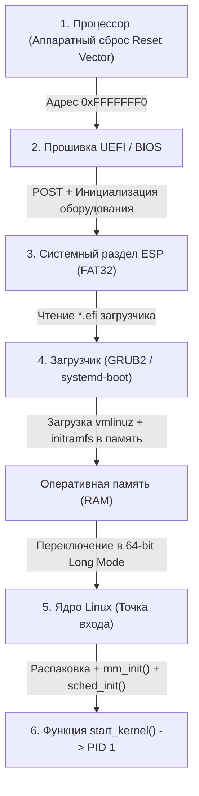

## От нажатия кнопки питания до `start_kernel()`

Пока ваш микросервис на Go непринужденно запускается в легковесном Docker-контейнере или в бессерверной функции AWS Lambda, за каждым таким «холодным стартом» (**cold start**) стоит строгая, выверенная десятилетиями инженерная эстафета системных переходов. На физическом сервере этот путь занимает от нескольких секунд до минут, а в оптимизированных виртуальных машинах (вроде Firecracker) укладывается в считанные миллисекунды.

Понимание того, как кремний оживает от первого электрического импульса до передачи управления функции `main()`, критически важно для любого старшего инженера:
1. **Оптимизация задержек холодного старта (Cold Start)** в Serverless, Kubernetes и бессерверных средах;
2. **Аппаратная безопасность и доверенная загрузка** (технология **Secure Boot**, защита от руткитов на уровне прошивки);
3. **Глубокая диагностика сбоев инфраструктуры**, когда нода кластера не может смонтировать корневую файловую систему из-за нехватки драйверов в раннем окружении;
4. **Осознанный тюнинг параметров ядра** на этапе `cmdline` для серверов баз данных и bare-metal инстансов.

Разберем этот увлекательный путь: как процессор из состояния полного кремниевого покоя последовательно переключает поколения вычислительных режимов, распаковывает ядро Linux и подготавливает операционную систему к исполнению прикладного кода.

---

## Эра BIOS и MBR: Лимиты 1980-х

На заре эры IBM PC архитекторы заложили основы загрузки, которые верой и правдой служили индустрии почти тридцать лет.

**BIOS (Basic Input/Output System — Базовая система ввода-вывода)** — это специализированная низкоуровневая микропрограмма, зашитая в микросхему постоянной памяти (ROM / Flash) на материнской плате.

Когда вы нажимаете кнопку питания:
1. Блок питания стабилизирует напряжение и подает на материнскую плату сигнал `Power Good`.
2. Процессор x86-64 просыпается по аппаратному сбросу (Reset Vector) в архаичном 16-битном реальном режиме (**Real Mode**), эмулируя оригинальный процессор Intel 8086 из 1978 года! В этом режиме процессору доступен всего 1 Мегабайт оперативной памяти, а регистр инструкций `CS:IP` жестко указывает на физический адрес **`0xFFFFFFF0`** — фиксированную точку входа в прошивку BIOS.
3. **POST (Power-On Self-Test)**: BIOS проводит экспресс-тестирование жизненно важных узлов материнской платы, опрашивает контроллер оперативной памяти RAM, инициализирует шины PCIe, USB и контроллеры дисков.
4. **Поиск загрузочного сектора**: BIOS последовательно опрашивает накопители в порядке, заданном в настройках BIOS Setup, в поисках первого сектора с сигнатурой загрузки `0x55AA`.
5. **MBR (Master Boot Record)**: Тот самый первый физический сектор диска размером ровно **512 байт**. В этот микроскопический объем инженеры умудрялись втиснуть первичный машинный код загрузчика (Stage 1 Bootloader, 446 байт) и таблицу разделов диска (Partition Table, 64 байта на 4 раздела).
6. **Перехват управления**: BIOS копирует эти 512 байт по адресу `0x7C00` в RAM и безусловно передает туда управление.

> [!warning] Ловушка / Gotcha
> Жесткий лимит первого сектора MBR в **512 байт** стал настоящим проклятием системного программирования.  
> В 446 байт невозможно уместить код драйвера для чтения сложных современных файловых систем. Поэтому разработчикам ранних загрузчиков приходилось изобретать многостадийные костыли: первая стадия в MBR знала только точные номера секторов на диске, где лежала вторая стадия, которая уже монтировала отдельный раздел `/boot` с примитивной файловой системой `ext2`. Кроме того, таблица MBR принципиально не поддерживала диски объемом более 2 Терабайт и ограничивала систему четырьмя первичными разделами.

---

## UEFI и GPT: Современный стандарт

На смену античному BIOS пришел современный индустриальный стандарт — **UEFI (Unified Extensible Firmware Interface)**, разработанный консорциумом ведущих технологических компаний для преодоления архитектурных барьеров XX века.

Ключевые революционные отличия UEFI:
* **GPT (GUID Partition Table)**: Заменила MBR. Поддерживает до 128 разделов по умолчанию и накопители емкостью в миллиарды терабайт (до $9.4 \times 10^{21}$ байт). Заголовок и таблица разделов дублируются в начале и в самом конце диска для защиты от случайного повреждения.
* **EFI System Partition (ESP)**: Выделенный независимый раздел диска, отформатированный в стандартной файловой системе **FAT32**. Прошивке UEFI больше не нужны «магические секторы»: она сама умеет читать файлы!
* **Нативный 32- и 64-битный защищенный режим**: UEFI стартует сразу в защищенном режиме. В прошивку встроен собственный графический движок, полноценный сетевой стек (IPv4/IPv6, DHCP, PXE-загрузка по сети) и среда исполнения исполняемых файлов формата **PE/COFF** (файлы с расширением `*.efi`).
* **Secure Boot (Доверенная загрузка)**: Неразрывная криптографическая цепочка доверия:
  $$\text{Root Key (Ключ вендора в чипе)} \longrightarrow \text{KЕК} \longrightarrow \text{DB (Ключ загрузчика)} \longrightarrow \text{Подпись ядра Linux}$$
  Если ядро или модуль загрузчика модифицированы руткитом или подпись не сходится с доверенной базой ключей в NVRAM материнской платы, процессор на аппаратном уровне блокирует старт системы.

> [!info] Под капотом
> Прошивка UEFI архитектурно функционирует как миниатюрная специализированная операционная система. Драйверы дисковых контроллеров, графические адаптеры и сетевые интерфейсы упакованы в виде независимых UEFI-приложений (`*.efi`). Они компилируются в машинный код и динамически подгружаются в оперативную память. Это обеспечивает модульность и гибкость, но существенно увеличивает размер кода прошивки (до десятков мегабайт) и время фазы аппаратной инициализации (POST).

---

## Bootloader: GRUB, systemd-boot и загрузка ядра

Когда прошивка UEFI завершает инициализацию оборудования, она считывает конфигурационные переменные из NVRAM, находит на системном разделе ESP файл загрузчика (например, `/EFI/BOOT/BOOTX64.EFI`) и передает ему управление.

Современные загрузчики (**GRUB2**, **systemd-boot**, **rEFInd**) берут на себя важнейшую подготовительную работу:

1. **Загрузка сжатого образа ядра (`vmlinuz`)**: Загрузчик считывает с диска монолитный исполняемый файл ядра Linux и размещает его в оперативной памяти.
2. **Загрузка виртуального диска initramfs**: Загружает в память файл начальной файловой системы RAM (`initramfs` / `initrd`), содержащий необходимые модули ядра.
3. **Переключение процессора в 64-битный режим**: Загрузчик переводит процессор из Protected Mode в полноценный режим длинных адресов — **Long Mode** архитектуры x86-64 (активируя бит `LME` в системном регистре `EFER` и настраивая базовые 4-уровневые таблицы страниц PML4).
4. **Передача командной строки параметров ядра (`cmdline`)**: Строка конфигурационных параметров (`root=UUID=... rw quiet console=ttyS0 kvm=off`) упаковывается в память, а указатель на нее передается в регистрах CPU (традиционно через регистр `rsi` на стеке).

---

## Старт ядра Linux: От `head.S` до `start_kernel()`

Образ ядра Linux на диске — это не простой ELF-файл, а сложный самораспаковывающийся контейнер, собранный по спецификации **multiboot**. Процесс его инициализации строго разделен на фазы:

### 1. Ранняя стадия загрузки Early Boot (`arch/x86/boot/head.S`)

* Входная ассемблерная подпрограмма запускает процедуру декомпрессии ядра (**`decompress_kernel`**). Сжатый gzip/zstd образ ядра разворачивается в физическую память.
* Ядро с чистого листа инициализирует базовые процессорные структуры: таблицу дескрипторов прерываний (**IDT**), глобальную таблицу дескрипторов (**GDT**) и сегмент состояния задачи (**TSS**).
* Происходит первичное включение блока управления памятью **MMU**: настраиваются предварительные таблицы страниц памяти, и ядро переходит к выполнению чистого 64-битного кода на языке Си.
* **Важнейший нюанс**: На этом раннем этапе операционной системы еще не существует! Нет динамических аллокаторов памяти, нет очередей процессов, нет концепции изоляции процессов. Работает суровый низкоуровневый ассемблерный код.

### 2. Запуск многопроцессорности (SMP Startup)

Серверы не работают на одном ядре. Но старт системы всегда происходит на одном выделенном процессоре — **Boot CPU (Bootstrap Processor, BSP)**:
* Запустившись, Boot CPU подготавливает системные структуры и отправляет остальным физическим ядрам процессора (Application Processors, AP) специальный аппаратный межпроцессорный сигнал — **IPI (Inter-Processor Interrupt)**.
* Проснувшиеся вторичные ядра исполняют функцию `start_secondary()`, инициализируют свои персональные локальные структуры данных для каждого ядра (**`percpu`**), настраивают свои регистры `CR3` и рапортуют о готовности.

### 3. Сердце системы: `start_kernel()` и `rest_init()`

Управление переходит в главную функцию ядра на языке Си — `start_kernel()` (исходный файл `init/main.c` в исходниках Linux):
* Инициализируются базовые подсистемы: 
  * `mm_init()` — подсистема управления физической памятью и страничный аллокатор;
  * `sched_init()` — планировщик задач ядра (CFS / EEVDF);
  * `irq_init()` — обработчики аппаратных прерываний;
  * `pid_hash_init()` — хэш-таблица идентификаторов процессов.
* Процессор создает нулевой процесс — **PID 0 (idle task / swapper)**, который крутится на ядрах тогда, когда полезной работы нет.
* Затем вызывается завершающая процедура `rest_init()`:
  1. Она создает системный процесс ядра **`kthreadd` (PID 2)**, который берет на себя порождение всех системных фоновых потоков ядра (`kworker`, `ksoftirqd`).
  2. Через специализированный внутренний вызов `kernel_thread()` порождается **PID 1 (первичный процесс пространства пользователя — `kernel_init`)**.
  3. Процесс PID 1 монтирует временную файловую систему `initramfs`, загружает драйверы контроллеров диска, осуществляет переключение на настоящую корневую файловую систему (`rootfs`) и запускает системный диспетчер служб: **/sbin/init** (в современном Linux это менеджер **systemd**).

> [!info] Под капотом
> Каждый процесс в ядре описывается фундаментальной структурой `task_struct`. В ней есть поле `state` (отражающее состояние задачи: активна `TASK_RUNNING`, ждет `TASK_UNINTERRUPTIBLE` и т.д.).  
> До момента отработки функции `sched_init()` этой структуры в памяти просто не существует! Именно поэтому ни один классический системный вызов (`syscall`) физически не может быть выполнен до тех пор, пока функция `start_kernel()` не завершит инициализацию базовых структур ядра.

---

## Почему это важно для Go-разработчика?

Казалось бы: зачем бэкенд-разработчику на Go, пишущему микросервисы для обработки JSON, знать про `head.S` и `initramfs`? 

Понимание процесса загрузки радикально меняет подход к проектированию надежной и быстрой серверной архитектуры:

1. **Борьба за Cold Start в облаке и бессерверных средах (Serverless / AWS Lambda)**:  
   Цепочка инициализации:
   $$\text{Старт VM} \longrightarrow \text{Загрузка ядра} \longrightarrow \text{init} \longrightarrow \text{containerd} \longrightarrow \text{Go Runtime} \longrightarrow \text{main()}$$
   Каждое звено вносит вклад в задержку отклика. Оптимизация `initramfs`, использование легковесных образов и технологий вроде `eBPF` для быстрого сетевого подключения напрямую определяют время прогрева. Именно поэтому современные cloud-native среды отказываются от тяжелых BIOS/UEFI в пользу специализированных гипервизоров (Firecracker, Cloud-Hypervisor), которые загружают ядро Linux напрямую за 5 миллисекунд, минуя стадию прошивки!
2. **Тайны функций `init()` в Go**:  
   В Go функции `init()` в пакетах выполняются автоматически при старте бинарника до вызова функции `main()`. Если разработчик наивно помещает в `init()` тяжелые сетевые запросы к сервису конфигураций или инициализирует глобальные мьютексы, сервис рискует упасть при рестарте контейнера: сеть на уровне операционной системы или DNS-резолвер внутри пода Kubernetes могут быть еще не готовы. Инициализацию всегда надежнее делать явной и контролируемой через `sync.Once`.
3. **Системные лимиты ядра (`sysctl` и `cmdline`)**:  
   Настройки, передаваемые ядру при загрузке или настраиваемые через `/etc/sysctl.conf`, определяют потолок производительности Go-бэкенда:
   * `vm.max_map_count`: максимальное количество областей памяти `mmap`. Если лимит занижен, аллокатор Go упадет с ошибкой `out of memory` при выделении виртуальных арен памяти.
   * `fs.file-max`: системный лимит файловых дескрипторов. При его исчерпании Go-сервер начнет сыпать ошибками `too many open files`.
   * `net.core.somaxconn`: размер очереди входящих TCP-соединений. Заниженное значение приведет к потере сетевых пакетов и ошибкам `connection reset by peer` под высокой нагрузкой.
4. **Ограничения Secure Boot и CGO**:  
   В защищенных корпоративных контурах с активным `Secure Boot` ядро Linux работает в режиме строгой изоляции (`Lockdown Mode`). Это блокирует прямую отладку через `/dev/mem`, инспекцию памяти процессов и загрузку неподписанных модулей ядра (`insmod`), что может неожиданно сломать сборку Go-приложений с CGO или инструменты глубокого профилирования.

---

> [!tip] Собеседование
> **Вопрос 1:** Чем принципиально отличается механизм создания процесса PID 1 от создания любого обычного пользовательского процесса через системный вызов `fork()`?  
> **Ответ:** Вызов `fork()` требует, чтобы в системе уже функционировали абсолютно все механизмы управления памятью (дескриптор `mm_struct`), структуры планировщика (`runqueue`) и таблицы файловых дескрипторов (`files_struct`).  
> На раннем этапе загрузки ядра Linux этих структур в оперативной памяти попросту нет. Поэтому процесс PID 1 создается вручную низкоуровневой функцией `kernel_thread()`, которая аллоцирует сырую структуру `task_struct`, вручную настраивает стек режима ядра и передает управление функции `kernel_init` через ассемблерный возврат `ret_from_fork()`. Обычные же процессы в пространстве пользователя создаются через вызов `copy_process()`, полностью клонирующий существующие структуры родителя.
> 
> **Вопрос 2:** В чем фундаментальная разница между старым механизмом `initrd` и современным `initramfs`?  
> **Ответ:** Исторический `initrd` (initial ramdisk) представлял собой эмуляцию блочного устройства в оперативной памяти, отформатированного в файловую систему `ext2`. Для работы с ним ядру требовался встроенный драйвер блочного устройства и файловой системы, а операции записи проходили через дисковый кэш, дублируя данные в RAM.  
> Современный `initramfs` — это легковесный архив формата **cpio**, сжатый алгоритмом gzip или zstd. Ядро Linux просто распаковывает этот архив напрямую в память быстрой виртуальной файловой системы **tmpfs**. Это происходит в разы быстрее, не требует блочных драйверов и экономит оперативную память, что критически важно для мгновенного холодного старта в облаке.

---

## Итог

Подведем инженерные итоги нашего знакомства с цепочкой загрузки компьютера:

1. **Прошивка (BIOS/UEFI)** инициализирует аппаратные контроллеры материнской платы, проверяет память в тесте POST и по криптографическим сертификатам Secure Boot передает управление доверенному загрузчику.
2. **Загрузчик (Bootloader)** размещает в оперативной памяти образ ядра `vmlinuz` и архив драйверов `initramfs`, переводит физический процессор в 64-битный режим Long Mode и передает параметры конфигурации `cmdline`.
3. **Ранний старт ядра (`head.S`)** декомпрессирует ядро, включает блок управления памятью MMU, инициализирует локальные структуры ядер `percpu` и переходит в главную функцию `start_kernel()`.
4. **Рождение пространств**: Функция `start_kernel()` настраивает подсистемы памяти, прерываний и планировщика, запускает системный процесс `kthreadd` (PID 2) и создает через `kernel_thread()` первичный процесс пространства пользователя — **PID 1 (`systemd`)**.
5. **Контекст для Go**: Ваш сервис на Go стартует на фундаменте полностью прогретого ядра, но конфигурация системных лимитов (`sysctl`), порядок инициализации пакетов `init()` и особенности виртуализации напрямую определяют надежность и задержки сервиса в production.

Мы увидели, как ядро Linux берет под контроль физический компьютер и порождает самый первый процесс в системе. 

Но как ядро управляет миллионами последующих процессов? Какие состояния проходит процесс от момента рождения до естественной смерти? Что такое зомби-процессы и процессы-сироты?

В следующей лекции мы детально изучим жизненный цикл процесса в Linux: [[5. Процессы. Жизненный цикл процесса в ОС]].