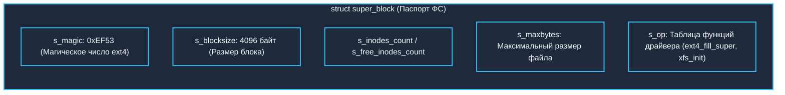
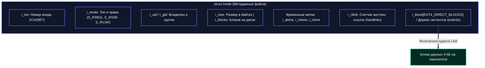
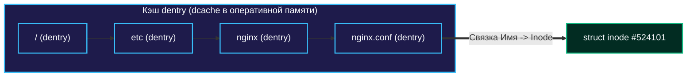

## Виртуальная файловая система (VFS) и абстракция

Когда в коде на Go вы вызываете `os.Open("/etc/nginx/nginx.conf")`, среда исполнения не просто «открывает файл». Она делегирует этот запрос ядру Linux, которому предстоит совершить увлекательное путешествие по графу метаданных в оперативной памяти и на физическом накопителе, чтобы сопоставить текстовую строку пути с реальными блоками данных на диске. 

В операционной системе Linux этот путь полностью абстрагирован через **VFS (Virtual File System)**. 

```mermaid
flowchart TD
    subgraph Userspace["Пользовательское пространство (Go App)"]
        GoApp["os.Open("/etc/nginx/nginx.conf")"]
    end

    subgraph VFS_Layer["Ядро Linux: Слой VFS"]
        direction TB
        VFS["VFS API: open, read, write, stat, unlink"]
        DentryCache["Кэш путей: dcache (dentry)"]
        InodeCache["Кэш метаданных: icache (inode)"]
        SuperBlock["Суперблоки смонтированных ФС (super_block)"]
    end

    subgraph FS_Drivers["Драйверы конкретных файловых систем"]
        EXT4["ext4"]
        XFS["xfs"]
        Btrfs["btrfs"]
        NFS["NFS (сетевая ФС)"]
        TmpFS["tmpfs (in-memory)"]
    end

    GoApp --> VFS
    VFS --> DentryCache
    VFS --> InodeCache
    VFS --> SuperBlock
    SuperBlock --> EXT4
    SuperBlock --> XFS
    SuperBlock --> Btrfs
    SuperBlock --> NFS
    SuperBlock --> TmpFS

    classDef user fill:#1e1b4b,stroke:#38bdf8,stroke-width:2px,color:#f8fafc;
    classDef vfs fill:#0f172a,stroke:#6366f1,stroke-width:2px,color:#f8fafc;
    classDef fs fill:#022c22,stroke:#10b981,stroke-width:2px,color:#f8fafc;

    class Userspace,GoApp user;
    class VFS_Layer,VFS,DentryCache,InodeCache,SuperBlock vfs;
    class FS_Drivers,EXT4,XFS,Btrfs,NFS,TmpFS fs;
```

VFS — это универсальный полиморфный слой ядра, который позволяет вашим программам использовать абсолютно одинаковый системный API (`open`, `read`, `write`, `stat`) независимо от того, где физически расположены данные: на локальном разделе `ext4`, корпоративном массиве `xfs`, снимке `btrfs`, сетевом диске `NFS` или виртуальной памяти `tmpfs`.

Для реализации этой элегантной абстракции ядро Linux оперирует тремя фундаментальными структурами данных в оперативной памяти: **`super_block`**, **`inode`** и **`dentry`**. Понимание их внутреннего устройства критично для диагностики дисковых задержек, эффективной работы с hardlink/symlink и предотвращения скрытых ловушек файловой подсистемы.

---

## Superblock: Паспорт смонтированной файловой системы

Объект `superblock` (суперблок) — это глобальный реестр метаданных для **всей смонтированной файловой системы**. Он не привязан к конкретным пользовательским файлам, а описывает параметры, геометрию и правила игры для всего дискового тома.



> [!info] Под капотом
> В ядре Linux суперблок представлен структурой `struct super_block`. На физическом носителе он записывается в начале раздела, а также дублируется в нескольких резервных группах блоков (для спасения данных при повреждении секторов накопителя). При выполнении системного вызова `mount` ядро считывает суперблок в память и инициализирует контекст тома.

**Ключевые поля структуры:**
*   `s_magic` — уникальная числовая сигнатура файловой системы (например, `0xEF53` для ext4). Ядро проверяет ее при монтировании, чтобы убедиться, что тип ФС определен верно.
*   `s_blocksize` — базовый размер блока (обычно 4096 байт). Любые дисковые операции ввода-вывода и выделение пространства выравниваются строго по этому размеру.
*   `s_inodes_count`, `s_free_inodes_count` — суммарное и оставшееся количество доступных инодов. Если свободные иноды закончились, диск перестанет принимать новые файлы, даже если на нем свободно 500 ГБ места!
*   `s_maxbytes` — максимально допустимый размер одного файла (определяется архитектурой адресации блоков).
*   `s_op` — таблица указателей на системные функции конкретного драйвера файловой системы (`ext4_fill_super`, `xfs_init` и т.д.).

Если суперблок поврежден, ядро Linux переводит ФС в защитный режим только для чтения `ro` (read-only) либо наотрез отказывается монтировать раздел. В коде на Go попытка открыть файл на таком диске вернет ошибку вызовов `fs.ReadStat` или `os.Stat` с системным кодом ошибки `EBADF` или `EIO`.

---

## Inode: ДНК файла (и почему там нет имени)

**`inode`** (index node / information node) — это главная структура метаданных **конкретного файла или каталога**. 

Самое главное открытие для любого программиста, изучающего Unix: **имя файла в inode не хранится!** Имя файла — это лишь метка на двери, а не сам файл. Это фундаментальное архитектурное отличие философии Unix от систем вроде Windows NTFS или классической FAT.



> [!info] Под капотом
> В исходном коде ядра Linux структура `struct inode` содержит:
> - `i_ino` — глобально уникальный номер инода в рамках данной файловой системы.
> - `i_mode` — битовая маска типа файла (`S_IFREG` для регулярного файла, `S_IFDIR` для директории, `S_IFLNK` для символической ссылки) и прав доступа (rwxrwxrwx).
> - `i_uid` и `i_gid` — идентификаторы владельца и группы.
> - `i_size` — логический размер файла в байтах.
> - `i_blocks` — реальное количество занятых 512-байтных секторов на диске.
> - `i_atime`, `i_mtime`, `i_ctime` — временные метки доступа, изменения данных и изменения метаданных.
> - `i_nlink` — счетчик жестких ссылок (hardlink count).
> - Массив `i_block[EXT4_DIRECT_BLOCKS]` или современное B-дерево экстентов (extents), связывающее логические смещения файла с физическими блоками диска.

**Ключевые поля и нюансы:**
*   `i_mode`: Разграничивает типы объектов VFS: обычный файл (`S_IFREG`), каталог (`S_IFDIR`) или символическая ссылка (`S_IFLNK`).
*   `i_nlink`: Количество жестких ссылок (имен в каталогах), которые ссылаются на этот инод. Файл физически удаляется с диска только тогда, когда `i_nlink` падает до нуля **И** ни один работающий процесс не держит этот файл открытым.
*   `i_mtime` (Modification Time): Время последнего изменения *содержимого* файла (когда выполнялся `write`).
*   `i_ctime` (Change Time): Время последнего изменения *метаданных* файла (права, владелец, количество ссылок). **Коварная ловушка:** если вы выполнили команду `chmod`, `mtime` не изменится, но `ctime` обновится немедленно!

---

## Dentry: Кэш имен и директорий

Если в иноде нет имени файла, то где же оно живет? Имя живет в **каталоге**, а каталог в Unix — это самый обычный файл специального типа (`S_IFDIR`), тело которого состоит из списка бинарных записей формата:
`[длина имени][имя][inode номер]`.

Чтобы ядру Linux не приходилось при каждом открытии файла сканировать диск в поисках нужной строки, в памяти создается высокопроизводительный кэш — **`dentry` (directory entry)**.

`dentry` связывает между собой имя пути и соответствующий объект `inode`. 



> [!warning] Ловушка / Gotcha
> Поиск файла по пути — это не мгновенная магия, а последовательный обход графа каталогов. Если промежуточные звенья пути отсутствуют в оперативной памяти, ядро вынуждено совершать синхронное чтение блоков с физического диска. 
> 
> На глубоких путях с тысячами каталогов это приводит к ощутимым миллисекундным задержкам!

Для ускорения доступа ядро использует структуру **dcache** (directory entry cache). При обращении по пути `/home/user/file.txt`:
1. Ядро проверяет `dentry` для каталога `/home`. Если запись найдена в хэш-таблице (Cache Hit) — мгновенно переходит к следующему элементу пути.
2. Если записи нет в памяти (Cache Miss) — ядро читает блок каталога с диска, находит запись с именем `user`, создает новый объект `dentry`, помещает его в dcache и запрашивает соответствующий `inode`.

Объект `dentry` остается в памяти до тех пор, пока на него ссылаются процессы или пока ядро не вытеснит его под давлением памяти. При удалении файла через системный вызов `unlink` (или команду `rm`) ядро удаляет запись `dentry` из кэша, но сам `inode` продолжает жить в памяти до тех пор, пока счетчик жестких ссылок `i_nlink` не станет равен 0 и счетчик открытых файловых дескрипторов `i_count` не обнулится!

---

## Разрешение пути: Как ОС находит файл

Когда приложение на Go вызывает `os.Open("/etc/nginx/nginx.conf")`, под капотом выполняется системный вызов `openat` или `openat2`. Процедура разрешения пути выглядит как строгий обход графа:

```mermaid
flowchart TD
    A["Go: os.Open("/etc/nginx/nginx.conf")"] -->|syscall openat2| B["Linux VFS: Path Resolution"]
    B --> C{"Проверка dcache"}
    C -->|Hit| D["Быстрый возврат inode из icache"]
    C -->|Miss| E["Чтение дискового блока каталога"]
    E --> F["Parse корневой записи /"]
    F --> G["Parse каталога etc (Проверка права 'x')"]
    G --> H["Parse каталога nginx (Проверка права 'x')"]
    H --> I["Parse файла nginx.conf"]
    I --> J["Возврат inode и валидация прав ('r')"]
    J --> K["Выделение struct file и файлового дескриптора"]

    classDef app fill:#1e1b4b,stroke:#38bdf8,stroke-width:2px,color:#f8fafc;
    classDef vfs fill:#0f172a,stroke:#6366f1,stroke-width:2px,color:#f8fafc;
    classDef step fill:#1e293b,stroke:#10b981,stroke-width:2px,color:#f8fafc;

    class A app;
    class B,C,D,E vfs;
    class F,G,H,I,J,K step;
```

**Критический закон Unix:** Каждый переход между промежуточными каталогами требует проверки бита права на исполнение — **`execute` (`x`)**! Если у пользователя нет права `x` на родительский каталог `nginx`, файл `nginx.conf` будет абсолютно недоступен, даже если на сам файл выставлены максимальные права на чтение `r` (права 0666 или 0777).

---

## Влияние на Go-приложения и производительность

В стандартной библиотеке Go взаимодействие с файловой подсистемой сосредоточено в пакете `os`, который является оберткой над системными вызовами `openat2`, `statx`, `readlink`, `open` и `read`.

Понимание механики `inode` и `dentry` спасает от классических архитектурных антипаттернов:

1. **Глубокая вложенность каталогов:** Каждый дополнительный уровень слэша `/` заставляет ядро выполнять отдельный lookup в dcache. При десятках тысяч параллельных горутин это порождает эффект `dcache thrashing` (постоянное вымывание кэша имен), взрывной рост задержек и конкуренцию за блокировки каталогов.
2. **Антипаттерн «миллион файлов в одной папке»:** Поиск записи в каталоге с миллионом файлов превращается в медленный перебор. При системном вызове `readdir` ядро считывает десятки мегабайт структуры каталога в память, перегружая CPU и Page Cache. 
3. **Hardlink vs Symlink:** Системный вызов `os.Link` создает новую запись в каталоге (dentry), указывающую на уже существующий `inode`. Жесткие ссылки не могут указывать на каталоги и не могут пересекать границы файловых систем. Вызов `os.Symlink` создает полноценный независимый файл (`S_IFLNK`), хранящий строку пути. Символические ссылки универсальны, но требуют повторного разрешения пути при каждом обращении.

Посмотрим, как в Go получить прямой доступ к структуре `inode`:

```go
package main

import (
	"fmt"
	"log"
	"os"
	"syscall"
	"time"
)

func inspectFile(path string) {
	// Используем syscall.Stat для прямого доступа к метаданным inode
	// без дополнительных аллокаций памяти, которые производит стандартный os.Stat
	var stat syscall.Stat_t
	if err := syscall.Stat(path, &stat); err != nil {
		log.Fatalf("syscall.Stat failed: %v", err)
	}

	// Оборачиваем syscall.Stat_t в os.FileInfo для совместимости
	fileInfo := os.FileInfo(&osStatWrapper{stat})

	fmt.Printf("Путь к файлу:   %s
", path)
	fmt.Printf("Номер Inode:    %d
", stat.Ino)
	fmt.Printf("Hardlinks:      %d
", stat.Nlink)
	fmt.Printf("Размер:         %d байт
", stat.Size)
	fmt.Printf("Блоков (512B):  %d
", stat.Blocks)
	fmt.Printf("Права доступа:  %o
", fileInfo.Mode().Perm())
	fmt.Printf("Тип файла:      %s
", fileInfo.Mode().Type())
	fmt.Printf("Время mtime:    %v
", time.Unix(stat.Mtim.Sec, int64(stat.Mtim.Nsec)))
	fmt.Printf("Время ctime:    %v
", time.Unix(stat.Ctim.Sec, int64(stat.Ctim.Nsec)))
}

type osStatWrapper struct {
	syscall.Stat_t
}

func (w *osStatWrapper) Name() string       { return "" }
func (w *osStatWrapper) Size() int64        { return w.Stat_t.Size }
func (w *osStatWrapper) Mode() os.FileMode  { return os.FileMode(w.Stat_t.Mode) }
func (w *osStatWrapper) ModTime() time.Time { return time.Unix(w.Stat_t.Mtim.Sec, int64(w.Stat_t.Mtim.Nsec)) }
func (w *osStatWrapper) IsDir() bool        { return w.Mode().IsDir() }
func (w *osStatWrapper) Sys() interface{}   { return &w.Stat_t }

func main() {
	inspectFile("/etc/hostname")
}
```

> [!note] Примечание
> Структура `syscall.Stat_t` доступна в среде Linux и Unix. Для строго кроссплатформенного кода используйте `os.Stat`. Однако в hot-path высоконагруженных сетевых прокси или брокеров сообщений прямой вызов `syscall.Stat` через пакет `syscall` или `unsafe` позволяет полностью избежать аллокаций в куче Go, выигрывая ценные микросекунды.

---

## > [!tip] Собеседование

**Вопрос 1:** Что хранится в inode? Почему имя файла не хранится там?
**Ответ:** В inode хранятся права, владелец, размеры, время модификации (atime/mtime/ctime) и указатели на физические блоки данных. Имя не хранится, потому что один и тот же inode может иметь множество имен (hardlink). Имя — это свойство каталога (dentry), а не файла.

**Вопрос 2:** Чем `ctime` отличается от `mtime`? Почему `stat` показывает странный `ctime`?
**Ответ:** `mtime` обновляется при записи данных. `ctime` обновляется при изменении *любой* метадаты (права, владелец, inode номер). Если вы сделали `chmod`, `mtime` останется старым, а `ctime` обновится. Это частая ловушка при мониторинге изменений конфигурационных файлов.

**Вопрос 3:** Что произойдет с файлом, если удалить все hardlink, но процесс держит его открытым?
**Ответ:** `i_nlink` упадет до 0, и ядро пометит inode как свободный (не сможет быть пересоздан). Однако данные на диске не удалятся, пока счетчик ссылок `i_count` (активные дескрипторы) не станет 0. Файл станет «невидимым» для файловой системы, но продолжает занимать место, пока процесс не закроет дескриптор.

**Вопрос 4:** Как `dentry cache` влияет на производительность Go-сервиса?
**Ответ:** При высокой нагрузке на чтение файлов по длинным путям или в глубоких деревьях кэш может вытесняться (dcache thrashing). Это приводит к увеличению количества disk I/O и context switch. Оптимизация: плоская структура каталогов, использование `tmpfs` для часто читаемых конфига/кешей, настройка `sysctl vm.vfs_cache_pressure`.

---

## Итог

1. **VFS** абстрагирует любые файловые системы через три ключевые структуры ядра: **`super_block`**, **`inode`** и **`dentry`**.
2. **Superblock** — паспорт смонтированного тома, определяющий размер блока, магическое число и общее количество инодов.
3. **Inode** — паспорта конкретного файла со всеми метаданными, правами и указателями на блоки. Имя файла в иноде принципиально отсутствует.
4. **Dentry** — кэшированная связка имени файла с номером инода, ускоряющая разрешение путей по графу каталогов.
5. **Для Senior Go-разработчика:** Избегайте глубоких путей и раздутых директорий с миллионами файлов во избежание деградации `dcache`. Помните, что удаленный файл (`unlink`/`rm`) физически освободит место на диске только после того, как все процессы закроют его открытые дескрипторы.

Мы разобрали внутреннюю архитектуру хранения метаданных в файловых системах. Теперь настало время понять, как файловые системы обеспечивают целостность этих структур при катастрофах и сбоях питания. В следующей лекции мы детально исследуем механизм транзакций файловых систем: `[[41. Журналируемые файловые системы]]`.
