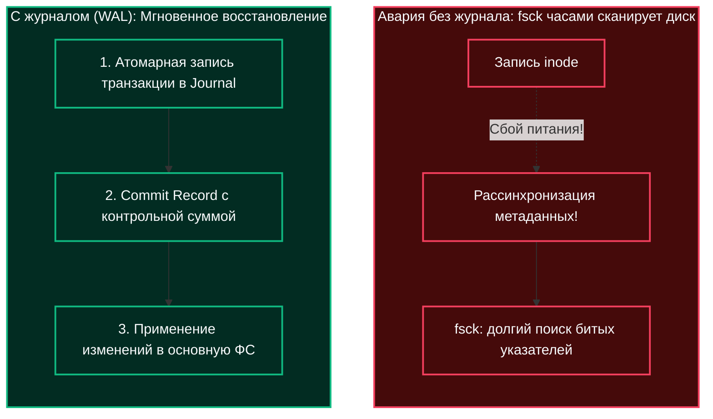
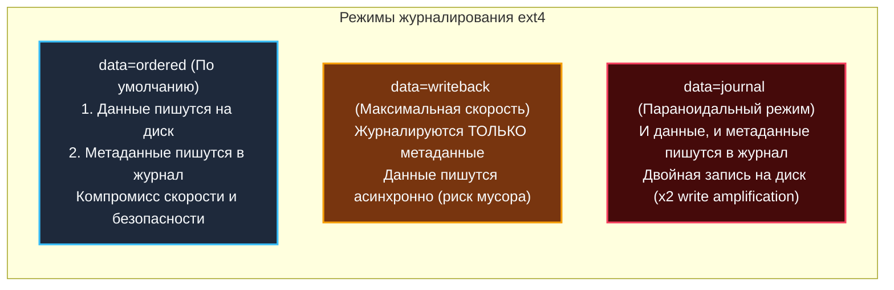
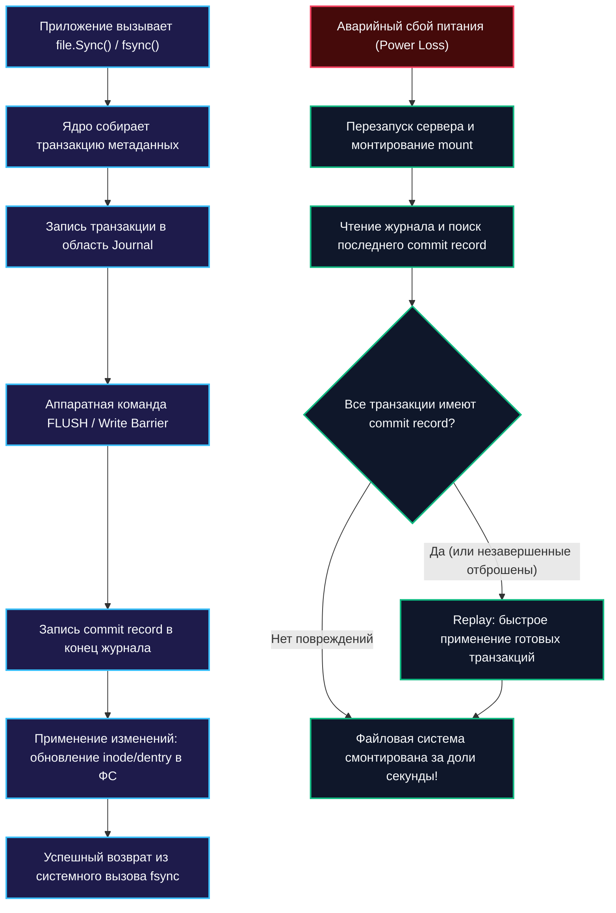

## Проблема согласованности и цена «смерти» диска

В предыдущей статье мы подробно исследовали, как VFS связывает текстовые пути с физическими блоками через структуры `[[40. Устройство файловых систем. inode, dentry, superblock]]`. Но здесь кроется фундаментальная инженерная дилемма: современные накопители оснащены собственными энергозависимыми буферами, а операционная система активно применяет отложенную запись через `[[42. Буферизация IO и Page Cache]]`. 

Когда в приложении на Go вы вызываете метод `Write()` (или `os.WriteFile`), байты данных не попадают на физический диск мгновенно. Они оседают в Page Cache ядра Linux, а затем выталкиваются на накопитель в произвольном порядке, продиктованном оптимизациями планировщика ввода-вывода (I/O scheduler).

Что произойдет, если в момент сложной дисковой операции — например, когда ядро успело обновить указатель в структуре `inode`, но еще не записало физический блок с новыми данными — внезапно пропадет питание сервера?

Файловая система окажется в катастрофическом **несогласованном состоянии (Inconsistent State)**:
- Метаданные `inode` будут указывать на секторы, в которых физически лежат старые или случайные мусорные байты.
- Битовая маска свободных блоков будет считать блок занятым, хотя ни один файл на него не ссылается (утечка дискового пространства).
- Указатели дерева каталогов окажутся разорваны, превращая файлы в сиротские объекты в папке `lost+found`.

В эпоху раннего Unix после каждого аварийного отключения питания администраторам приходилось часами ждать выполнения системной утилиты `fsck` (file system check). На дисках объемом в десятки терабайт полный линейный аудит всех структур мог занимать целые сутки простоя сервиса!

Чтобы раз и навсегда устранить эту уязвимость, компьютерные инженеры создали элегантную технологию — **Журналируемые файловые системы (Journaling File Systems)**.



---

## Что такое журналируемая файловая система?

Журнал файловой системы — это выделенная кольцевая область на диске (отдельный набор блоков или выделенное быстрое блочное устройство), которая хранит **примитивные транзакции изменений** до их фактического применения к основной файловой системе.

Этот подход полностью повторяет проверенный десятилетиями принцип **Write-Ahead Logging (WAL)**, лежащий в основе надежности СУБД (PostgreSQL, MySQL InnoDB, SQLite, Redis AOF):
1. Любое структурное изменение файловой системы (создание нового файла, изменение размера, удаление `dentry`, перераспределение блоков) сначала формируется как атомарная транзакция.
2. Транзакция последовательно записывается в конец журнала.
3. Только после успешной фиксации записи в журнале (Journal Commit) файловая система разрешает перенос изменений в основные таблицы метаданных и блоков.
4. При аварийном рестарте серверу больше не нужно сканировать весь диск: ядро просто проигрывает журнал (Journal Replay) за пару сотен миллисекунд!

> [!info] Под капотом
> Журнал — это не «резервная копия» файлов. Это **очередь отложенных операций**. Рантайм ФС (например, драйвер ext4 или XFS в ядре Linux) пишет в журнал последовательный поток байт. 
> 
> При чтении он парсит эту последовательность и применяет изменения к `inode` и `dentry` кэшу. Журнал имеет фиксированный размер и работает как кольцевой буфер (ring buffer): старые транзакции, изменения которых уже надежно записаны в основное дерево ФС (фаза Checkpointing), помечаются свободными и перезаписываются новыми.

---

### Основные режимы журналирования

Файловые системы Linux (EXT4, XFS, Btrfs) поддерживают три режима журналирования, каждый из которых представляет собой классический инженерный компромисс между **гарантиями долговечности (durability)** и **скоростью записи (performance)**:



1. **`data=ordered` (стандартный режим по умолчанию в ext4 и XFS)**
    *   Метаданные транзакции записываются в журнал, но ядро накладывает строгое аппаратное ограничение: **перед тем как зафиксировать транзакцию метаданных в журнале, ядро гарантирует, что все затронутые блоки пользовательских данных уже физически записаны на диск**.
    *   Это защищает от самой неприятной аномалии: появления файлов-призраков, заполненных нулями или чужими данными после перезагрузки.
    *   Превосходный баланс: данные не дублируются в журнале, а метаданные защищены.
2. **`data=writeback` (режим максимальной скорости)**
    *   Журналируются **только метаданные**. Пользовательские данные пишутся в основную ФС полностью асинхронно и могут попасть на физический носитель как *до*, так и *после* коммита метаданных.
    *   **Подводный камень:** Если питание пропадет, вы можете получить валидный с точки зрения ФС файл, внутри которого окажется мусор из освобожденных страниц памяти (stale data).
    *   **Область применения:** Временные файлы компиляции, кэши, директории очередей метрик, где потеря свежих данных некритична по сравнению с выигрышем в IOPS.
3. **`data=journal` (режим полной защиты)**
    *   Абсолютно всё — и метаданные, и пользовательские данные — сначала полностью пишется в журнал, и лишь затем копируется в основные блоки файловой системы.
    *   Максимальная надежность, но **катастрофическая просадка производительности**: каждый байт физически записывается на накопитель **дважды** (двукратный Write Amplification). Применяется крайне редко (например, в критичных банковских хранилищах со специальными NVRAM-накопителями).

---

## Как журнал работает внутри: процесс коммита и восстановления

Когда прикладное приложение на Go вызывает метод `file.Sync()` или низкоуровневый системный вызов `fsync()` (или `sync()`), ядро не просто сбрасывает Page Cache. Оно инициирует строгий протокол **Journal Commit**:

1. **Захват транзакции:** Ядро Linux собирает все измененные в оперативной памяти структуры `dentry`, `inode` и привязанные блоки данных в единую атомарную транзакцию.
2. **Запись в журнал:** Блоки транзакции последовательно записываются в область журнала файловой системы. На уровне блочного устройства эта запись всегда атомарна блоками (традиционно по 4 КБ).
3. **Flush кэша контроллера диска:** Ядро выполняет операцию `flush`, требуя от накопителя немедленно сбросить свои внутренние микросхемы DRAM на энергонезависимые ячейки. В этот момент включается аппаратный барьер записи — **Write Barrier** (`WRITE BARRIER`), запрещающий контроллеру диска менять порядок выполнения команд.
4. **Метка коммита (Commit Record):** Только после подтверждения сброса блоков транзакции ядро записывает в конец журнала специальный блок — **`commit record`** с уникальным идентификатором транзакции и контрольной суммой CRC32. Транзакция официально считается зафиксированной!
5. **Применение (Checkpointing):** Только теперь ядро разрешает обновить постоянные структуры `inode` и `dentry` в основной файловой системе.



> [!warning] Ловушка / Gotcha
> **Write Barriers и SSD:** Контроллеры современных твердотельных накопителей агрессивно переставляют порядок записи блоков для оптимизации сборки мусора и выравнивания износа (wear leveling). 
> 
> Если вы пишете транзакцию в журнал, а следом данные в основную ФС, контроллер SSD без аппаратного барьера может записать данные основной ФС *раньше*, чем зафиксирует блок журнала! При падении питания целостность структуры рассыплется.
> 
> Ядро Linux отправляет контроллеру команду **`FLUSH`** или выставляет **`WRITE BARRIER`** через подсистемы `libata` или `nvme`, принуждая диск строго соблюдать очередность. Некоторые администраторы в погоне за красивыми бенчмарками монтируют файловые системы с параметром `barrier=0`. Это дает видимый прирост скорости на графиках, но превращает продакшн-сервер в пороховую бочку: первый же сбой питания гарантированно разрушит файловую систему.

---

## Влияние на бэкенд и Go: fsync и durability

Для бэкенд-инженера понимание механики журналирования имеет прямое финансовое и эксплуатационное значение: от него зависит сохранность платежных транзакций и производительность баз данных под нагрузкой.

### `os.File.Sync()` vs `syscall.Fsync()`

В стандартной библиотеке Go метод `os.File.Sync()` (или `file.Sync()`) транслируется напрямую в системный вызов `fsync()` (а на некоторых платформах вызывает внутренний вызов `syscall.Fsync()`). Он заставляет ядро вытолкнуть на физический носитель **абсолютно всё**: тело файла, дескрипторы `inode` и обновленное время изменения `mtime`.

Если же файл не изменялся в размерах, а обновлялись только байты данных, обновление временных меток и метаданных в журнале ФС является избыточным накладным расходом. В этом сценарии на помощь приходит системный вызов `fdatasync()`:

```go
package main

import (
	"log"
	"os"
	"syscall"
)

func writeWithDsync(path string, data []byte) error {
	// Открываем файл для бинарной записи
	f, err := os.OpenFile(path, os.O_CREATE|os.O_WRONLY|os.O_TRUNC, 0644)
	if err != nil {
		return err
	}
	defer f.Close()

	// 1. Быстрая запись в Page Cache ядра (асинхронно)
	if _, err := f.Write(data); err != nil {
		return err
	}

	// 2. Принудительный сброс ТОЛЬКО данных на физический накопитель.
	// Системный вызов fdatasync() пропускает запись несущественных метаданных
	// (например, mtime или прав), если размер файла не изменился.
	// Это исключает лишний цикл Journal Commit, работая ощутимо быстрее Sync()!
	if err := syscall.Fdatasync(int(f.Fd())); err != nil {
		return err
	}

	return nil
}
```

### Почему `fsync` — это узкое место производительности?

1. **Блокировка контекста выполнения:** Системный вызов `fsync` блокирует горутину и ее системный тред до тех пор, пока накопитель не пришлет физический сигнал подтверждения. На классических HDD это занимает 5–15 миллисекунд, на быстрых корпоративных NVMe SSD — от 100 до 500 микросекунд. По меркам процессора (где такт занимает 0.3 нс) это астрономическая пропасть!
2. **Write Amplification (износ накопителя):** Журналируемая ФС записывает транзакцию дважды, расходуя ресурс ячеек NAND Flash.
3. **Идиома пакетной фиксации (Group Commit):** Если ваш сервис вызывает `Sync()` на каждый входящий HTTP-запрос, производительность сервера рухнет до нескольких сотен запросов в секунду. Промышленные движки на Go (например, BadgerDB, etcd, CockroachDB) никогда не сбрасывают диск вслепую: они накапливают пачку транзакций от сотен горутин в памяти и сбрасывают их одним общим вызовом `file.Sync()`.

> [!tip] Собеседование
> **Вопрос:** Почему современные СУБД (PostgreSQL, MySQL, Redis, BadgerDB) ведут собственный WAL-журнал, а не полагаются на встроенное журналирование файловой системы Linux?
> 
> **Ответ:** Журнал файловой системы оперирует абстрактными блоками диска (по 4 КБ) и системными метаданными (`inode`, `dentry`). Он ничего не знает о границах бизнес-транзакций, индексах B-Tree или версиях строк MVCC.
> 
> Если СУБД обновляет строку размером 50 байт, файловая система вынуждена журналировать весь 4-килобайтный блок. Более того, при аварии журнал ФС гарантирует лишь структурную целостность дисковых блоков, но не целостность распределенной бизнес-транзакции. 
> 
> Собственный WAL-журнал базы данных оптимизирован под логику движка: он хранит компактные дельты изменений, понимает семантику фиксации (`commit()`) и обеспечивает согласованность данных на уровне бизнес-логики (**Crash Consistency**), используя файловую систему лишь как надежное хранилище байт.

---

## Сравнение подходов: Go vs Классические ООП-языки

*   **Java / C#:** В корпоративной Java стандартным решением является метод `FileChannel.force(true)` (эквивалент `fsync`) или `force(false)` (эквивалент `fdatasync`). Однако JVM держит собственные буферы и скрывает детали системных вызовов. В Go вызов `os.Open` возвращает файловый дескриптор напрямую, а вызов `file.Sync()` транслируется в чистый `syscall` без накладных расходов виртуальной машины.
*   **PHP:** В классическом PHP программист почти не имеет прямого контроля над синхронизацией диска. Функция `file_put_contents` полностью полагается на буферизацию libc и сброс при закрытии дескриптора. При падении PHP-FPM воркера данные могут потеряться. Для надежности разработчики вынуждены делегировать запись СУБД с вызовом транзакционного `commit()` или сбрасывать состояние в Redis через команду `SAVE`.
*   **Go:** Предоставляет разработчику абсолютную полноту власти над ядром. Вы можете открыть файл напрямую через `os.OpenFile` с флагами `O_SYNC` или `O_DSYNC`, заставляя ядро синхронизировать каждый системный вызов `Write`, либо управлять процессом через горутины, контролируя компромисс между пропускной способностью и задержкой записи (**write latency**).

---

## Итог

1. **Журнал файловой системы (Journal)** — это реализация концепции Write-Ahead Logging (WAL) на уровне ядра ОС, защищающая структуры метаданных от повреждений при внезапных сбоях питания.
2. **Режимы журналирования:** `data=ordered` обеспечивает оптимальный баланс защиты и скорости, `data=writeback` подходит для временных кэшей, а `data=journal` гарантирует максимальную надежность ценой двукратного износа диска.
3. **Write Barrier:** Критически важная аппаратная команда `FLUSH`, запрещающая контроллеру диска переставлять порядок записи страниц в энергонезависимую память. Отключение барьеров (`barrier=0`) категорически недопустимо в продакшене.
4. **Оптимизация fsync в Go:** Системный вызов `os.File.Sync()` (или `syscall.Fsync()`) физически блокирует поток. Для максимальной производительности объединяйте транзакции в пакеты (Group Commit) или используйте `fdatasync()`.

Мы подробно изучили, как файловые системы защищают метаданные от катастроф. Но что происходит, когда эти данные только начинают свой путь в оперативной памяти? В следующей лекции мы погрузимся в самый производительный компонент ядра ОС: `[[42. Буферизация IO и Page Cache]]`.
