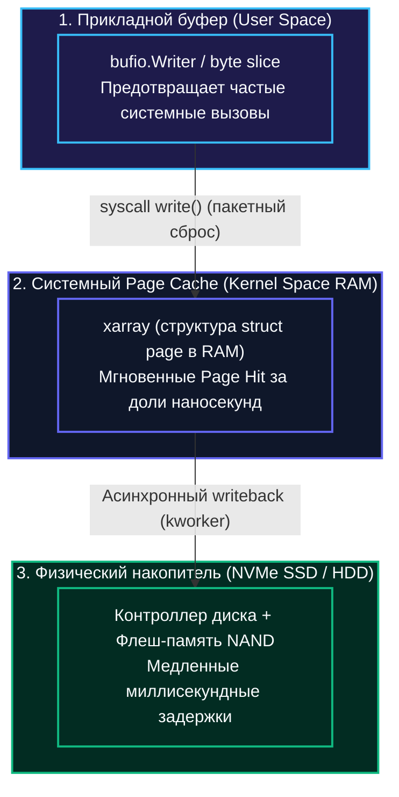
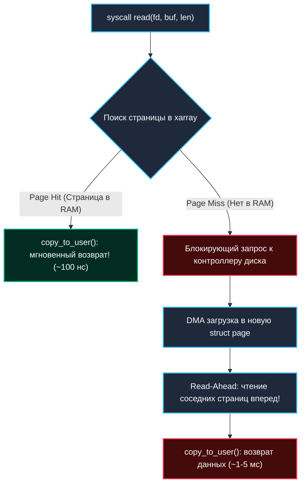
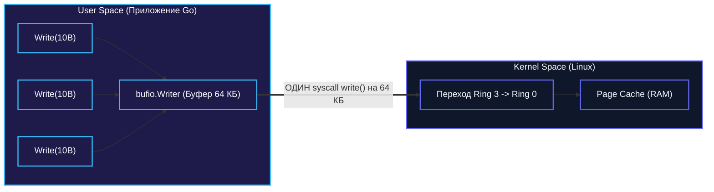

## Почему диск — узкое горлышко современной системы

Для бэкенд-разработчика, привыкшего измерять производительность сервисов в микросекундах и наносекундах, фундаментальное правило архитектуры компьютеров остается незыблемым: **любые операции с дисковыми накопителями на 3–4 порядка медленнее, чем прямое обращение к оперативной памяти**. 

Даже современные серверные накопители NVMe SSD с интерфейсом PCIe 4.0/5.0 не способны нарушить законы физики полупроводников. Именно поэтому операционная система Linux никогда не читает и не записывает данные на физический диск при каждом вызове прикладной программы. Вместо этого ядро выстраивает мощный защитный барьер — **Page Cache (кэш страниц)**, превращающий всю незанятую оперативную память сервера в сверхбыстрый интеллектуальный буфер дискового ввода-вывода.

Понимание того, как устроена буферизация на уровне ОС, критически важно для Go-инженера. Оно определяет выбор между `bufio` и прямым системным вызовом `syscall`, влияние операций `fsync` на 99-й перцентиль задержки (p99 latency), поведение микросервисов под пиковой нагрузкой и причины внезапных просадок производительности процессора.



---

## Page Cache: Первый рубеж защиты от медленного железа

Когда ваше приложение вызывает функцию `os.ReadFile()` или метод `file.Write()`, данные не отправляются на диск немедленно. Они проходят через многоуровневую систему кэширования в оперативной памяти ядра.

> [!info] Под капотом
> В ядре Linux кэш страниц реализован через массив структур `struct page`. Каждая страница (стандартный размер 4 КБ) индексируется в иерархической структуре `xarray` (ранее известной как `radix tree`) по составному ключу: `устройство (major:minor) + файл (inode) + смещение (offset)`. 
> 
> Когда процесс вызывает системный вызов `read()`, ядро сначала делает ультрабыстрый поиск в `xarray`. Если страница уже присутствует в оперативной памяти — фиксируется **Page Hit**, и данные копируются в буфер Go без единого дискового обращения. Если страницы в памяти нет — возникает **Page Miss**: ядро блокирует горутину (или тред ОС), отправляет блочный запрос контроллеру накопителя и терпеливо ждет завершения ввода-вывода.



### Механизмы чтения и записи: Hit, Miss и Dirty Pages

**Чтение (Read): Упреждающий алгоритм Read-Ahead**
ОС не ограничивается пассивным ожиданием. Если ядро видит, что процесс последовательно считывает страницу за страницей, планировщик I/O включает алгоритм **Read-Ahead**: он превентивно считывает следующие 16–32 страницы с диска в Page Cache еще до того, как ваше приложение вызовет следующий `Read()`. Для программы чтение превращается в непрерывную череду мгновенных Page Hit!

**Запись (Write): Отложенная буферизация Write-Back**
Запись работает по принципу **Write-Back**. Когда вы вызываете системный вызов `write()`, ядро выделяет страницу в Page Cache, копирует туда байты приложения через `copy_from_user` и выставляет в структуре страницы флаг `dirty` (грязная). 

Физическая запись на накопитель откладывается. Этим занимаются выделенные фоновые потоки ядра (`kworker`, ранее известные как `flush` и `pdflush`), которые в фоновом режиме упорядочивают грязные страницы и пакетно сбрасывают их на диск.

> [!warning] Ловушка / Gotcha
> У ядра Linux есть строгие системные лимиты на максимальный объем грязных страниц: `vm.dirty_background_ratio` (по умолчанию около 10% от свободной RAM) и `vm.dirty_ratio` (около 20%). 
> 
> Если ваше приложение пишет терабайты логов быстрее, чем дисковая подсистема физически способна их прожечь, объем грязных страниц переваливает за `vm.dirty_ratio`. В этот момент ядро переходит в аварийный режим: **процесс принудительно блокируется прямо внутри системного вызова `write()`**, пока объем грязных страниц не снизится! В вашем микросервисе наступают необъяснимые секундные паузы, визуально похожие на Stop-The-World в GC, хотя процессор абсолютно свободен.

> [!tip] Собеседование
> **Вопрос:** В чём принципиальная разница между системными вызовами `write()` и `fsync()`?
> 
> **Ответ:** Системный вызов `write()` лишь копирует байты из буфера программы в Page Cache оперативной памяти и возвращает управление за наносекунды. Данные физически еще не существуют на накопителе! 
> 
> Системный вызов `fsync()` (или метод `Sync()` у объекта `os.File` в Go) принудительно выталкивает все грязные страницы файла на физический накопитель, обновляет журнал метаданных ФС и ожидает подтверждения от контроллера диска (Flush Cache). Это блокирующая дисковая операция, которая прерывает фоновый write-back цикл и может выполняться миллисекунды.

---

## Два уровня буферизации: Прикладной vs Системный

В архитектуре Go буферизация выстроена на двух независимых уровнях. Понимание границы между ними позволяет избежать грубых архитектурных ошибок.

| Уровень | Инструмент | Физическая локация | Что делает и от чего защищает |
|:---|:---|:---|:---|
| **Прикладной** | `bufio`, `io.Writer` | User Space (память процесса Go) | Накапливает мелкие порции данных в памяти приложения, сокращая число переключений контекста CPU и системных вызовов `write()`. |
| **Системный** | Page Cache (ядро ОС) | Kernel Space (оперативная память RAM) | Кэширует дисковые блоки в структуре `struct page`, маскируя физические задержки накопителей. |



Если вы вызываете метод `file.Write()` с крошечными кусочками по 10–20 байт без обертки `bufio`, вы на каждой итерации платите:
1. За переключение контекста процессора между User Space и Kernel Space.
2. За копирование байтов в память ядра функцией `copy_from_user` (а при чтении — `copy_to_user`).
3. За блокировку внутренних структур VFS ядра.

Page Cache ядра не спасает от этих затрат: он защищает только от медленного диска, но не от накладных расходов на системные вызовы!

---

## Управление кэшированием в Go: Идиомы и инструменты

Стандартная библиотека Go и системные пакеты предоставляют богатую палитру инструментов для управления дисковым вводом-выводом.

### 1. `bufio` — стандартный подход

```go
package main

import (
	"bufio"
	"os"
)

func writeLogs() error {
	f, err := os.OpenFile("log.txt", os.O_APPEND|os.O_CREATE|os.O_WRONLY, 0644)
	if err != nil {
		return err
	}
	defer f.Close()

	// NewWriterSize создает буфер нужного размера в куче Go
	w := bufio.NewWriterSize(f, 64*1024) // 64 КБ
	defer w.Flush() // Принудительный сброс остатка буфера в системный вызов write()

	_, err = w.Write([]byte("data"))
	if err != nil {
		return err
	}
	return nil
}
```

> [!tip] Собеседование
> **Вопрос:** Когда конструктор `bufio.NewWriter` начинает аллоцировать память в куче?
> 
> **Ответ:** Конструктор `bufio.NewWriter` (или вызов `NewWriterSize`) возвращает указатель `*bufio.Writer`. 
> 
> Если буфер мал и компилятор Go в процессе Escape Analysis доказывает, что созданный объект не покидает стек текущей функции, память под буфер может быть выделена на стеке. Однако в 99% реальных сценариев (возврат `w` наружу, передача в интерфейсы `io.Writer` или размер буфера более 32–64 КБ) происходит побег в кучу (Heap Escape). Для горячих путей в высоконагруженных шлюзах буферы `bufio` переиспользуют через `sync.Pool`.

### 2. `os.O_DIRECT` — обход Page Cache

Иногда кэш операционной системы не помогает, а откровенно вредит. Классический пример — ядро СУБД (PostgreSQL, ScyllaDB, RocksDB) или видеостриминг терабайтных файлов:
- Данные уже закэшированы во внутреннем буферном пуле СУБД.
- Дублирование их в Page Cache ядра приводит к нерациональной трате RAM.
- Потоковое чтение гигантских файлов вымывает из кэша ядра полезные страницы других сервисов.

Флаг `os.O_DIRECT` заставляет контроллер DMA передавать данные напрямую между пользовательским буфером в оперативной памяти и накопителем, полностью минуя Page Cache:

```go
package main

import (
	"os"
)

func directWrite() error {
	// Открываем файл с системным флагом O_DIRECT
	f, err := os.OpenFile("data.bin", os.O_RDWR|os.O_CREATE|os.O_DIRECT, 0644)
	if err != nil {
		return err
	}
	defer f.Close()

	// ОЧЕНЬ ВАЖНО: адрес памяти и размер слайса для O_DIRECT 
	// обязаны быть строго выровнены по размеру страницы (обычно 4096 байт)
	buf := make([]byte, 4096) 
	_, err = f.Write(buf)
	if err != nil {
		return err
	}
	return nil
}
```

> [!warning] Ловушка / Gotcha
> Флаг `O_DIRECT` требует жесточайшего выравнивания адресов памяти, смещений и размеров порций данных по границе сектора диска или страницы памяти (4096 байт). 
> 
> Стандартный вызов Go `make([]byte, 4096)` не гарантирует выравнивание адреса слайса по границе страницы! Попытка записи вернет системную ошибку **`EINVAL` (Invalid argument)**. Кроме того, данные, записанные через `O_DIRECT`, не кэшируются: последующий `Read()` вызовет честный дисковый Page Miss.

### 3. `mmap` — маппинг файла в память

Системный вызов `mmap` проецирует дисковый файл прямо в виртуальное адресное пространство процесса. Это позволяет работать с файлом как с гигантским слайсом байтов, а ядро само подгружает страницы в Page Cache по мере физического обращения к ним (ленивая загрузка через механизм Page Fault):

```go
package main

import (
	"os"
	"golang.org/x/sys/unix"
)

func mmapRead(path string) ([]byte, error) {
	f, err := os.Open(path)
	if err != nil {
		return nil, err
	}
	defer f.Close()

	stat, err := f.Stat()
	if err != nil {
		return nil, err
	}

	// Маппинг только для чтения (PROT_READ) в режиме MAP_SHARED
	data, err := unix.Mmap(int(f.Fd()), 0, int(stat.Size()), unix.PROT_READ, unix.MAP_SHARED)
	if err != nil {
		return nil, err
	}

	// data теперь доступен как обычный []byte.
	// Страницы загружаются ядром в Page Cache прозрачно при чтении data[i]!
	return data, nil
}
```

---

## Mechanical Sympathy: Влияние на CPU, GC и память

1. **Копирование памяти и кэши процессора:** При классическом вызове `write()` данные преодолевают маршрут: `Буфер Go в userspace -> Буфер сокета/VFS -> Page Cache -> DRAM накопителя`. Это требует системных операций копирования (`copy_from_user` и `copy_to_user`), нагружая кэш процессора L1/L2 и шину памяти.
2. **Давление на сборщик мусора (GC):** Необдуманное создание временных буферов `bufio` размером по 64–256 КБ на каждое сетевое соединение раздувает кучу и создает постоянную работу для GC. Используйте `sync.Pool` для переиспользования буферов.
3. **Давление на память (Memory Pressure):** Если свободной памяти в операционной системе становится мало, ядро начинает агрессивно вытеснять чистые страницы Page Cache и форсировать сброс dirty страниц на диск. Это выражается в неожиданных скачках latency дисковых операций в метриках Go-сервиса.
4. **Сравнение с PHP и Java:** В классическом PHP функция `file_put_contents()` сбрасывает данные мелкими порциями через буфер libc. В Java класс `FileOutputStream` также требует явной обертки `BufferedOutputStream`. Go дает разработчику бескомпромиссную прозрачность: вы можете филигранно выбрать между удобством `bufio`, экстремальной скоростью `O_DIRECT` или ленивой проекцией `mmap`.

---

## Итоги

1. **Page Cache** — краеугольный камень производительности ОС, превращающий оперативную память в прозрачный кэш страниц дисковых блоков (по 4 КБ), индексируемый через дерево `xarray`.
2. **Write-Back и Dirty Pages:** Записи буферизуются в памяти. Достижение порога `vm.dirty_ratio` приводит к принудительной блокировке пишущих процессов прямо в вызове `write()`.
3. **`bufio` решает другую задачу:** Он уменьшает число переходов контекста CPU между пространством пользователя и ядром, не заменяя Page Cache, а дополняя его.
4. **`fsync()` стоит дорого:** Он принудительно останавливает поток до физического подтверждения от диска.
5. **`O_DIRECT` и `mmap`** позволяют обойти стандартное копирование в Page Cache, требуя строгого выравнивания буферов и понимания физики накопителей.

---

## Следующая статья

Мы детально исследовали, как операционная система буферизует ввод-вывод в оперативной памяти. Но что делать, если мы хотим вообще исключить процессор из цепочки перекладывания байтов между файлами и сетевыми сокетами? В следующей статье мы разберем механизмы обхода кэша и аппаратного ускорения: `[[43. Direct IO и Zero Copy]]`.
