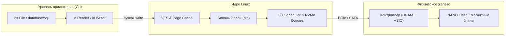
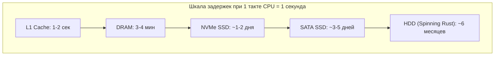
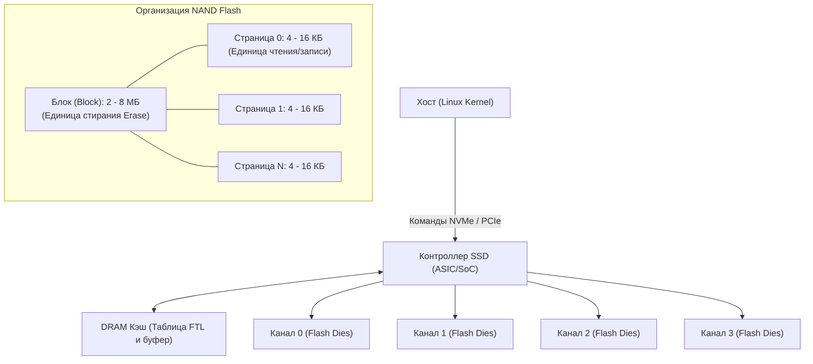
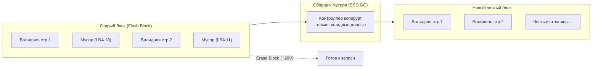
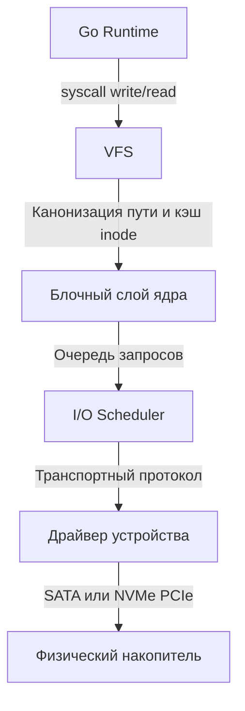
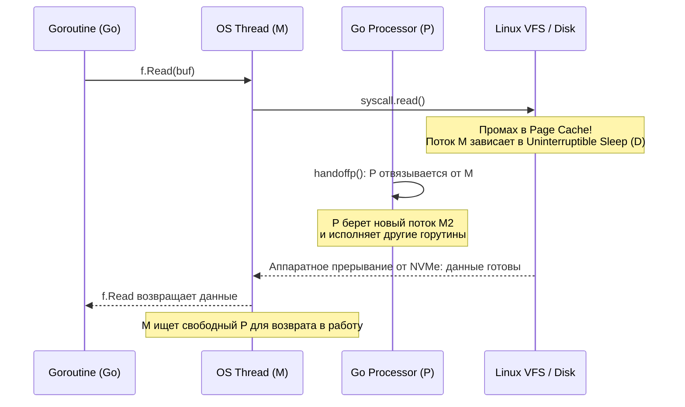

# 44. Диски и устройства хранения: HDD, SSD, NVMe

> *«Цель вычислений — понимание, а не числа; а система хранения — это физический якорь, благодаря которому это понимание должно пережить щелчок выключателя питания».*    
> — Свободная парафраза Ричарда Хэмминга в инженерном контексте

---

## Введение: За пределами абстракций

В повседневной разработке на Go мы привыкли укрываться за уютными высокоуровневыми интерфейсами стандартной библиотеки: `io.Reader`, `os.File`, `database/sql`. Мы вызываем `f.Write(data)` или выполняем SQL-транзакцию, и рантайм языка вместе с ядром Linux заботливо берут на себя всю рутину по перемещению байтов. Создается соблазнительная иллюзия: накопитель — это бесконечный, одномерный и практически бесплатный массив байтов.

Но когда высоконагруженный сервис начинает обрабатывать сотни тысяч запросов в секунду или ворочать терабайтные базы данных, эта абстракция начинает безжалостно «протекать». Внезапные 50-миллисекундные задержки на казалось бы тривиальном сохранении записи, необъяснимые просадки пропускной способности (throughput) или деградация производительности при 5% загрузке CPU — все это редко бывает вызвано ошибками в алгоритмах. Настоящая причина кроется в неумолимой физике кремния, магнитных полей и контроллеров дисковой подсистемы.



Глубокое понимание дисковой подсистемы необходимо инженеру для:
- Осознанного выбора между буферизированным I/O ядра, отображением файлов в память (`mmap`) и прямым бескэшевым доступом (`O_DIRECT`).
- Диагностики и объяснения нерегулярных задержек (latency spikes) в логах приложения, которые на самом деле происходят на SSD-контроллере при фоновой сборке мусора.
- Проектирования надежных хранилищ данных (LSM-деревья, WAL-журналы, B-деревья), где I/O становится главным узким местом системы.

---

## 1. Эволюция и типы накопителей

Физика хранения данных диктует фундаментальные ограничения для программного обеспечения. Чтобы осознать масштаб изменений, представьте, что один такт современного процессора (0.3 нс) длится ровно 1 секунду. В таком масштабе:
- Обращение к регистрам CPU и L1-кэшу займет **1–2 секунды** (взглянуть в блокнот на столе).
- Чтение из оперативной памяти (DRAM) — **3–4 минуты** (дойти до кофемашины на кухне).
- Чтение страницы из быстрого NVMe SSD — **1–2 дня** (съездить на выходные в соседний город).
- Чтение случайного сектора с механического HDD — **от 4 до 9 месяцев** (кругосветное путешествие под парусом в ожидании, пока головка переместится на нужную дорожку вращающегося блина!).

| Тип накопителя | Механизм хранения | Средняя задержка | IOPS (случайный read/write) | Пропускная способность | Интерфейс и шина |
|---|---|:---:|:---:|:---:|:---:|
| **HDD** (SATA/SAS) | Магнитные пластины + головка | 5–10 мс | 100–200 | 100–250 МБ/с | SATA 3 (6 Гбит/с) / SAS |
| **SSD** (SATA) | NAND Flash (SLC/MLC/TLC/QLC) | 50–150 мкс | 50k–100k | 500–550 МБ/с | SATA 3 (AHCI) |
| **NVMe** (PCIe) | NAND Flash + параллельные каналы | 10–100 мкс | 500k–1M+ | 3–7 ГБ/с (Gen4/5) | PCIe 4.0/5.0 x4 |



Механический жесткий диск (**HDD**) — это триумф прецизионной механики. Алюминиевый или стеклянный диск вращается со скоростью 7200 или 15000 об/мин, а электромагнитная головка парит на воздушной подушке в считанных нанометрах от поверхности. Случайный доступ требует физического перемещения привода (seek time) и ожидания проворота пластины (rotational latency). Из-за этого HDD превосходно читает последовательные данные (streaming I/O), но задыхается при конкурентном случайном доступе (не более 150-200 операций в секунду).

Твердотельный накопитель (**SSD**) избавился от механики. Данные хранятся в полупроводниковых ячейках энергонезависимой памяти NAND. Первые поколения SSD использовали интерфейс SATA и протокол AHCI, унаследованные от жестких дисков. AHCI разрабатывался под один вращающийся шпиндель и имел всего одну очередь команд глубиной 32 запроса.

Стандарт **NVMe** (Non-Volatile Memory Express) произвел революцию: он подключил память напрямую к системной шине PCIe и создал протокол, рассчитанный на тысячи параллельных очередей (до 64 000 очередей глубиной до 64 000 команд каждая), идеально ложащихся на многоядерную архитектуру современных CPU.

> [!warning] Ловушка / Gotcha
> Задержка (latency) и пропускная способность (throughput) — принципиально разные метрики. Маркетологи любят заявлять «7000 МБ/с», но для большинства бэкенд-сервисов и СУБД критична именно задержка при случайном доступе небольшими блоками (4 КБ). Даже самый совершенный NVMe-накопитель не сможет ответить на 100 000 независимых синхронных запросов `ReadAt` быстрее, чем позволяет физика распространения сигнала в шине и контроллере (10–50 мкс на запрос). Высокая пропускная способность достижима только при глубокой очереди (queue depth) и параллельном асинхронном I/O!

---

## 2. Под капотом SSD: NAND, контроллер и Garbage Collection

Современный SSD — это вовсе не пассивная планка памяти, а полноценный специализированный компьютер со своей многоядерной ARM/RISC-V SoC, мегабайтами собственной оперативной памяти (DRAM кэш) и сложнейшей операционной системой реального времени — **FTL** (Flash Translation Layer).



### Анатомия Flash-памяти: Асимметрия чтения и записи
Ячейка NAND хранит биты в виде электрического заряда на плавающем затворе (Floating Gate) или в ловушке заряда (Charge Trap). Типы ячеек различаются плотностью:
- **SLC (Single-Level Cell):** 1 бит на ячейку. Феноменальная надежность (до 100 000 циклов P/E), минимальная задержка, космическая цена.
- **MLC (Multi-Level Cell):** 2 бита на ячейку (~10 000 циклов).
- **TLC (Triple-Level Cell):** 3 бита на ячейку (1 000–3 000 циклов). Золотой стандарт серверных и потребительских SSD.
- **QLC (Quad-Level Cell):** 4 бита на ячейку (~500–1 000 циклов). Очень высокая плотность, но низкая скорость записи и скромный ресурс.

Главный парадокс NAND Flash заключается в физической асимметрии:
1. **Чтение и Запись** производятся **страницами** (обычно 4–16 КБ).
2. **Стирание** возможно только целыми **блоками** (от 128 до 1024 страниц, то есть 2–8 МБ).
3. **Нельзя перезаписать страницу поверх!** Чтобы записать новые данные в страницу, ячейки предварительно должны быть переведены в стертое состояние (все биты равны `1`). А для этого нужно стереть весь блок, подав на него высоковольтный импульс (~20 В).

Представьте, что вы пишете несмываемым маркером в блокноте. Вы можете заполнять страницы одну за другой. Но если вы захотите исправить одно слово на странице 5, вы не можете воспользоваться ластиком. Вам придется сжечь огнеметом всю главу из 200 страниц и переписать ее заново!

### Flash Translation Layer (FTL) и Out-of-Place Writes
Чтобы обойти это ограничение, FTL использует трюк с перенаправлением (Out-of-Place Writes):
- Когда ОС перезаписывает сектор с логическим адресом LBA 42, SSD не трогает старую страницу.
- Он записывает новые данные в совершенно свободную чистую страницу в другом блоке, а в таблице FTL (LBA-to-PBA) обновляет указатель.
- Старая страница помечается как **«невалидная» (stale/dirty)**.

Со временем свободные блоки заканчиваются, а накопитель заполняется блоками, наполовину состоящими из валидных данных, а наполовину — из мусора. В игру вступают ключевые механизмы FTL:

1. **Wear Leveling (Выравнивание износа):** Ячейки выдерживают ограниченное число циклов записи/стирания (P/E cycles). Контроллер равномерно распределяет операции стирания по всему кристаллу. Если на диске лежат неизменяемые данные (read-only библиотеки), контроллер принудительно переносит их на «изношенные» блоки, освобождая свежие блоки для горячих записей.
2. **TRIM (`blkdiscard`):** Традиционные файловые системы при удалении файла просто помечают его inode как свободный, не уведомляя блочное устройство. В результате SSD считает все эти блоки валидными и вынужден бесконечно копировать их. Команда TRIM передает SSD список освободившихся LBA-диапазонов, позволяя FTL мгновенно пометить соответствующие страницы невалидными.
3. **SSD Garbage Collection (Сборка мусора):** Фоновый процесс контроллера. Он находит блок с наибольшим количеством «мертвых» страниц, вычитывает оставшиеся валидные страницы во внутренний DRAM-буфер, дописывает их в новый блок, а старый блок целиком стирает высоковольтным импульсом, делая его вновь готовым к записи.



> [!info] Под капотом: Write Amplification и Latency Spikes
> Копирование валидных страниц туда и обратно приводит к явлению, известному как **write amplification** (коэффициент усиления записи): чтобы записать со стороны ОС 4 КБ данных, накопителю порой приходится физически перезаписать 16–32 КБ во флэш-памяти.
> 
> Хуже того: стирание блока занимает в 10–20 раз больше времени, чем чтение или программирование страницы (до 2–5 мс на блок). Если в момент интенсивной записи со стороны приложения свободные чистые блоки иссякнут, контроллер встанет на паузу и запустит синхронную сборку мусора. Все входящие I/O операции зависнут в очереди на десятки миллисекунд (до 10–50 мс на одном SSD).  
> В высоконагруженном Go-сервисе это выглядит как внезапный и необъяснимый «затуп» `db.Exec()` или зависание вызова `io.ReadFull()`, хотя графики CPU и сети абсолютно спокойны.

---

## 3. Как ОС видит диск: VFS, блочный слой и очередь запросов

Операционная система Linux строит над физическими накопителями многослойную пирамиду абстракций, превращая сырые блоки в стройную иерархию файлов и каталогов.



Разберем обязанности каждого уровня:
1. **VFS (Virtual File System):** Абстрагирует разные файловые системы (ext4, xfs, btrfs). Предоставляет единый POSIX API (`open`, `read`, `write`, `close`, `stat`), отвечает за трансляцию путей, проверку прав и кэширование метаданных inode.
2. **Блочный слой (Block Layer):** Представляет диск как последовательность блоков (обычно 512 или 4 КБ). Оперирует структурой `struct bio`, объединяет соседние запросы (I/O merging) и преобразует байтовые смещения в линейные номера секторов.
3. **I/O Scheduler (Планировщик ввода-вывода):** Раньше был критически важен для HDD (сортировка запросов для уменьшения seek time с помощью лифтовых алгоритмов вроде CFQ). Для современных SSD контроллеры сами оптимизируют порядок запросов, поэтому планировщики ядра (`noop`, `mq-deadline`) стали менее значимыми. В современных ядрах для NVMe по умолчанию часто выбирается режим `none` (минимальная задержка, прямая передача в аппаратную очередь).
4. **Очередь запросов:** В устаревшем AHCI поддерживалась всего 1 очередь глубиной 32 команды со спинлоком. В NVMe поддерживается до 64k очередей с глубиной 4096 (и вплоть до 64k), что позволяет параллелизировать I/O на уровне железа и распределять потоки по ядрам CPU без взаимных блокировок.

---

## 4. Mechanical Sympathy: Влияние на CPU и Go-рантайм

Термин «Mechanical Sympathy» (механическое сочувствие), популяризованный Мартином Томпсоном, гласит: программное обеспечение работает быстрее и надежнее всего тогда, когда разработчик понимает принципы работы лежащего в основе железа.

Когда Go вызывает `syscall.write`, данные не летят сразу на диск. Они копируются в **Page Cache** ядра (буфер в RAM). Только при вызове `fsync` (или `sync`) либо при переполнении кэша dirty-страниц данные сбрасываются на устройство в ходе фонового writeback.



**Влияние дискового ввода-вывода на процессор и Go-рантайм:**
1. **CPU Stalls и поведение планировщика Go:** Обычные дисковые файлы в Linux не поддерживаются селектором epoll (в отличие от сетевых сокетов). Если приложение блокируется на `io.Read`, `sync` или `fsync`, поток ОС `M` уходит в системный вызов ядра и зависает в состоянии ожидания (I/O wait, статус `D` в `ps`). Горутина переходит в состояние ожидания (`waiting for semaphore` или ожидание сисколла) и снимается с планирования. Процедура Go `handoffp()` отвязывает логический процессор `P` от заблокированного потока `M`, чтобы продолжить выполнение других горутин на свободном потоке. Однако, если дисковый I/O медленный или завис, количество потоков ОС `M` начинает расти, а CPU простаивает в ожидании шины (CPU Stalls).
2. **Кэш-линии и выравнивание:** Запросы к диску должны быть выровнены по размеру страницы (обычно 4 КБ). Невыровненный I/O заставляет контроллер выполнять read-modify-write, удваивая фактическую нагрузку на SSD.
3. **TLB Misses:** При работе с `mmap` на медленных устройствах или при интенсивном случайном доступе частые page faults приводят к промахам в TLB (Translation Lookaside Buffer), что замедляет доступ к памяти и вызывает межъядерные TLB Shootdowns.

> [!tip] Собеседование
> **Вопрос:** Почему `mmap` может быть медленнее прямого чтения при работе с большими файлами на SSD?
> 
> **Ответ:** `mmap` загружает страницы в Page Cache ядра по требованию (`demand paging`). При случайном доступе это вызывает множество page faults, которые обрабатываются в контексте процесса. Кроме того, при записи через `mmap` ядро помечает страницы как dirty и откладывает сброс на диск (`writeback`). Если SSD занят фоновым GC, это вызывает latency spikes.  
> Дополнительно на многопоточных серверах структуры виртуальной памяти процесса защищены ядерной блокировкой `mmap_lock` (бывший `mmap_sem`), конкуренция за которую резко снижает параллелизм. Прямой I/O (`O_DIRECT`) или асинхронные вызовы (`io_uring`) позволяют обойти Page Cache и управлять очередями запросов явно, предсказывая поведение системы.

---

## 5. Прямой I/O vs Буферизированный доступ в Go

В Go можно явно управлять обходом кэша ядра через флаг `O_DIRECT` (через пакет `syscall` или `os.OpenFile` с соответствующими флагами). Это полезно для высоконагруженных сервисов, баз данных (LSM-движки, WAL) и хранилищ, где буферизация ОС создает непредсказуемые задержки, неконтролируемые сбросы dirty-страниц или дублирует данные в оперативной памяти.

```go
package main

import (
	"fmt"
	"os"
	"syscall"
	"unsafe"
)

const (
	// Размер блока для выравнивания буфера под O_DIRECT
	BlockSize = 4096
)

// alignedBuffer гарантирует выравнивание базового адреса слайса по 4096 байт для O_DIRECT.
// В рантайме Go функция make([]byte, size) возвращает слайс, выровненный только по 8/16 байт,
// поэтому мы аллоцируем с запасом и сдвигаем срез до ближайшей границы 4096 байт.
func alignedBuffer(buf []byte, size int) []byte {
	if len(buf) < size+BlockSize {
		buf = make([]byte, size+BlockSize)
	}
	addr := uintptr(unsafe.Pointer(&buf[0]))
	offset := (uintptr(BlockSize) - (addr & uintptr(BlockSize-1))) & uintptr(BlockSize-1)
	return buf[offset : offset+uintptr(size)]
}

func main() {
	filePath := "data.bin"

	// Открываем файл с флагом прямого I/O (syscall.O_DIRECT)
	f, err := os.OpenFile(filePath, os.O_RDWR|os.O_CREATE|syscall.O_DIRECT, 0644)
	if err != nil {
		panic(fmt.Errorf("open failed: %w", err))
	}
	defer f.Close()
	defer os.Remove(filePath)

	// Проверяем информацию о файле и файловой системе через os.File.Stat() и syscall.Statfs()
	fi, err := f.Stat()
	if err != nil {
		panic(fmt.Errorf("stat failed: %w", err))
	}
	_ = fi

	var statFs syscall.Statfs_t
	if err := syscall.Statfs(filePath, &statFs); err == nil {
		fmt.Printf("Файловая система оптимальный размер блока: %d байт
", statFs.Bsize)
	}

	// Буфер должен быть выровнен по размеру страницы (обычно 4096)
	bufSize := 4096
	rawBuf := make([]byte, bufSize+BlockSize)
	// В продакшене используйте sync.Pool для переиспользования выровненных буферов
	buf := alignedBuffer(rawBuf, bufSize)

	// Заполняем буфер данными
	for i := range buf {
		buf[i] = byte('A' + (i % 26))
	}

	// Запись без участия Page Cache ядра
	n, err := f.WriteAt(buf, 0)
	if err != nil {
		panic(fmt.Errorf("write failed: %w", err))
	}
	fmt.Printf("Written %d bytes directly to disk
", n)
}
```

> [!warning] Ловушка / Gotcha
> `O_DIRECT` требует строгого выравнивания буфера в памяти по размеру блока ФС и устройства (обычно 512 или 4096 байт). Кроме того, размер данных и смещение в файле должны быть кратны размеру блока. Нарушение этих требований приводит к немедленной ошибке ядра `EINVAL` (Invalid argument) или некорректному поведению. Всегда проверяйте выравнивание через `os.File.Stat()` и `syscall.Statfs()`.  
> Не забывайте, что `O_DIRECT` отключает кэширование и Read-Ahead ядра: читать файл через `O_DIRECT` крошечными порциями по 100 байт приведет к катастрофическому падению производительности.

---

## Итог

Дисковые накопители прошли путь от механических устройств с миллисекундными задержками до параллельных NVMe-контроллеров с микросекундной латентностью. Однако физика NAND Flash (стирание блоками, wear leveling, фоновый GC) создает неочевидные пики задержек, которые могут обрушить SLA высоконагруженного сервиса.

В Go понимание этой физики позволяет:
- Осознанно выбирать между буферизацией ОС и прямым I/O.
- Правильно настраивать буферы и выравнивание для `O_DIRECT`.
- Отличать проблемы приложения от проблем storage-подсистемы.

Мы разобрали физическую основу хранения. Но как ядро Linux организует и управляет потоком запросов к этим устройствам, чтобы избежать конкуренции и гарантировать fairness? Об этом в следующей статье: `[[45. Scheduler диска и очередь запросов]]`.
