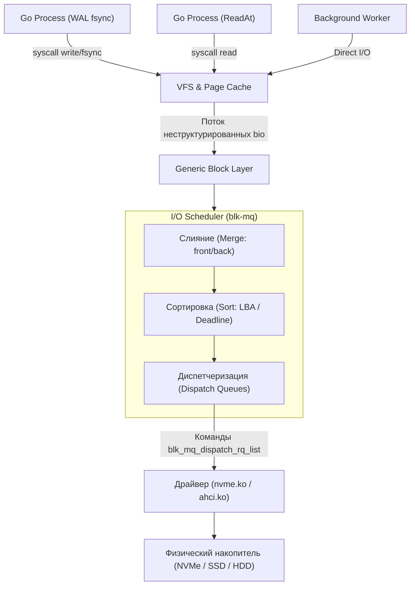
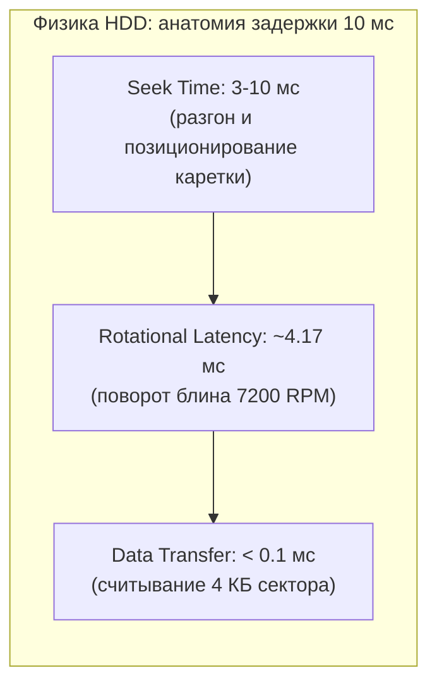
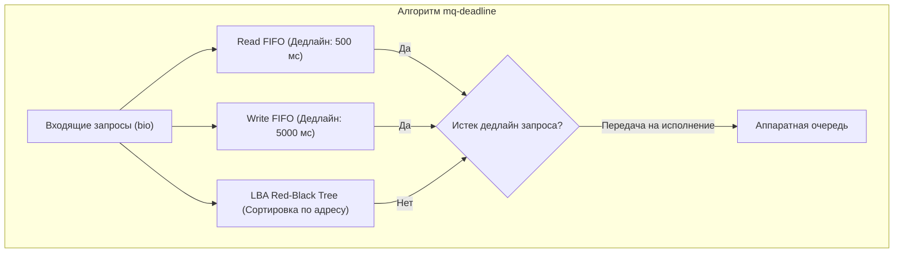
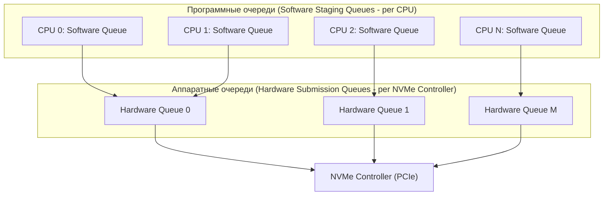
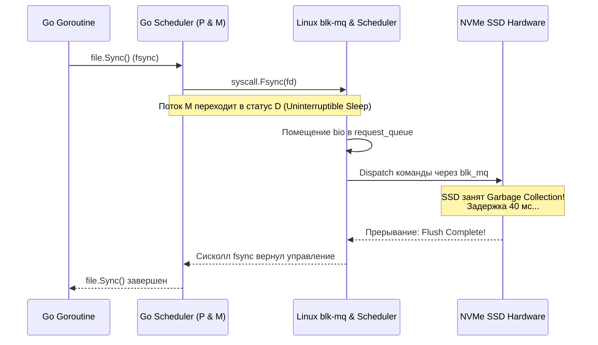

# 45. Scheduler диска и очередь запросов: blk-mq, mq-deadline и io_uring

> *«Лифт, обслуживающий пассажиров строго в порядке вызова, весь день проносится между подвалом и крышей, не перевезя толком почти никого».*    
> — Классический принцип планирования дискового лифта (SCAN)

---

## Роль планировщика в стеке ввода-вывода

В предыдущей статье мы исследовали физическое устройство накопителей [[44. Диски и устройства хранения]]. Если операционная система будет передавать команды `READ` и `WRITE` на контроллер накопителя в строгом порядке их поступления от приложений (наивный FIFO), производительность сервера рухнет до уровня 1990-х годов.

Причина проста: сотни процессов и горутин генерируют хаотичный, перемежающийся поток системных вызовов. Один поток читает логи, другой сбрасывает транзакционный журнал (WAL), третий делает случайную выборку из B-дерева базы данных. 

Именно здесь вступает в игру **Планировщик ввода-вывода (I/O Scheduler)** — критический компонент блочного слоя ядра Linux. Его задача — преобразовать разрозненный шквал запросов в упорядоченную, оптимальную последовательность команд, сглаживая физические задержки накопителей и распределяя полосу пропускания между процессами.



Для Go-разработчика понимание работы планировщика напрямую отвечает на животрепещущие вопросы эксплуатации:
- Почему системный вызов `fsync()` на SSD иногда занимает 100 микросекунд, а иногда внезапно замирает на 10–100 мс?
- Обходит ли прямой ввод-вывод (`O_DIRECT` или `syscall.O_DIRECT`) планировщик ядра?
- Как подружить планировщик Go с современным механизмом асинхронного блочного ввода-вывода `io_uring`?

---

## Физика HDD: почему случайный доступ убивает производительность

Исторически алгоритмы дисковых планировщиков создавались в эпоху механических жестких дисков (HDD). Механика накладывала жесткие физические ограничения, где каждый лишний миллиметр движения головки карался катастрофическим падением пропускной способности.

Для HDD существуют два непреодолимых физических фактора задержки:
1. **Seek Time (Время наводки):** Физическое перемещение каретки с головками чтения/записи на нужный радиальный цилиндр (track). Для серверов это типично 3–10 мс.
2. **Rotational Latency (Вращательная задержка):** Ожидание проворота шпинделя, пока требуемый сектор окажется точно под считывающим элементом. Для диска 7200 RPM один полный оборот длится 8.33 мс, а средняя задержка составляет ~4.17 мс (для 15000 RPM — около 2 мс).



Суммарно **случайный доступ к HDD занимает ~10 мс**. Это означает, что при строгом поочередном чтении диск способен выдать в лучшем случае всего **100 IOPS**! Если бы ядро не оптимизировало эти запросы, механический диск превратился бы в непреодолимое «бутылочное горлышко» всей операционной системы.

Классический планировщик Linux работал по **алгоритму лифта (Elevator Algorithm / SCAN)**: вместо того чтобы метаться между крайними дорожками 1, 99, 2, 85, головка плавно движется от внешнего края диска к внутреннему (по возрастанию номеров секторов LBA), попутно обслуживая все встречные запросы, а затем совершает обратный ход.

> [!info] Под капотом: NCQ (Native Command Queuing)
> В современных жестких дисках с интерфейсом SATA/SAS контроллер накопителя сам реализует аппаратную технологию **NCQ (Native Command Queuing)**. Хост отправляет на диск пачку до 32 команд, а встроенный микроконтроллер винчестера сам переупорядочивает их с учетом текущей угловой позиции головки над блином.  
> Ядерный планировщик Linux и NCQ работают согласованно: ядро объединяет смежные секторы и группирует запросы, а контроллер NCQ выполняет микрооптимизацию на уровне оборотов шпинделя.

### А что же SSD и NVMe?
В твердотельных накопителях физические головки и шпиндели отсутствуют — случайный доступ к ячейке flash занимает 20–100 мкс независимо от ее адреса. Однако планировщик не потерял актуальности:
- Накопители имеют ограниченный ресурс циклов перезаписи (P/E cycles).
- Внутренний сборщик мусора SSD страдает от фрагментированной записи, вызывающей **write amplification**.
- Потоки на запись могут полностью заблокировать критически важные синхронные операции чтения, приводя к starvation (голоданию) транзакций.

---

## Алгоритмы планирования в Linux

Ядро Linux позволяет выбирать алгоритм планирования для каждого блочного устройства индивидуально через псевдофайловую систему sysfs: `/sys/block/sdX/queue/scheduler`.

В современных дистрибутивах Linux доступны четыре основных планировщика архитектуры `blk-mq`:

| Планировщик | Архитектура и алгоритм | Для каких задач предназначен | Поведение при пиковой нагрузке |
|---|---|---|---|
| `mq-deadline` | Двухуровневая очередь: сортировка по LBA + жесткие тайм-ауты (дедлайны) | Реляционные СУБД (PostgreSQL, MySQL), WAL, базы данных, чувствительные к p99-задержке | Гарантирует отсутствие голодания (starvation); отдает безусловный приоритет операциям чтения |
| `bfq` (BFQ) | Budget Fair Queueing: распределение полосы пропускания пропорционально весам процессов | Настольные системы, интерактивные сервера, смешанная нагрузка (видео + компиляция) | Высокая отзывчивость интерактивных задач, но ощутимый оверхед на CPU при высоких IOPS |
| `kyber` | Latency-oriented: мониторинг задержек чтения/записи и динамическое дросселирование очередей | Быстрые NVMe, облачные виртуальные машины, высоконагруженные API-шлюзы | Держит целевую задержку (target latency), динамически ограничивая фоновые сбросы записи |
| `none` (noop) | Чистый FIFO: запросы направляются напрямую в аппаратные очереди устройства без сортировки | Современные серверные NVMe накопители с десятками аппаратных очередей | Нулевой расход тактов CPU хоста; всю логику берет на себя мощный контроллер NVMe |



> [!warning] Ловушка / Gotcha
> На быстрых NVMe накопителях администраторы часто ставят планировщик `none`, полагаясь на аппаратный параллелизм SSD. Однако на смешанных базах данных с тяжелыми фоновыми записями (например, сброс чекпоинта PostgreSQL или сжатие SSTable в RocksDB/BadgerDB) режим `none` может привести к многократному росту p99-задержки пользовательских запросов `SELECT`.  
> В таких сценариях `mq-deadline` оказывается предпочтительнее: он отдает приоритет чтению (тайм-аут по умолчанию 500 мс) над записью (тайм-аут 5000 мс), защищая критические пользовательские запросы от лавины фонового сброса dirty pages.

---

## Эволюция: от единой очереди к blk-mq и NVMe

В классических ядрах Linux (до версии 4.8) блочный слой ядра использовал архитектуру с **единой очередью запросов (Single Queue Block Layer)**. Все процессорные ядра сервера при выполнении дискового ввода-вывода конкурировали за один глобальный спинлок очереди: `q->queue_lock`.

В эпоху, когда сервер имел 2 или 4 ядра, а диск отдавал 150 IOPS, этой блокировки никто не замечал. Но с появлением серверов на 64–256 процессорных ядер и NVMe-накопителей, выдающих миллион IOPS, глобальный спинлок стал катастрофой. Процессоры проводили до 80% времени в холостом вращении вокруг `q->queue_lock` (spin contention), ожидая своей очереди поставить команду в стек!

В ядре Linux произошла масштабная архитектурная революция — переход на **blk-mq (Multi-Queue Block Layer)**.



### Принципы архитектуры blk-mq:
1. **Software Staging Queues (Программные очереди):** Создаются независимо для каждого процессорного ядра (`nr_cpu_ids`). Когда поток на CPU 3 выполняет запись, он кладет запрос в программную очередь CPU 3 без межпроцессорных блокировок.
2. **Hardware Dispatch Queues (Аппаратные очереди):** Напрямую отображаются на аппаратные submission queues контроллера NVMe. Ядро балансирует программные очереди по аппаратным каналам с учетом топологии NUMA.
3. **Линейная масштабируемость:** Нагрузка идеально распараллеливается по всем ядрам, позволяя выжимать миллионы IOPS без единой глобальной блокировки.

Инспектировать состояние очередей `blk-mq` в рабочей системе можно через интерфейс sysfs:

```bash
# Посмотреть лимит глубины очереди для устройства sda
cat /sys/block/sda/queue/nr_requests

# Посмотреть текущий активный планировщик
cat /sys/block/sda/queue/scheduler
# Пример вывода: none [mq-deadline] kyber bfq

# Проверить аппаратные очереди blk-mq (для nvme устройств)
ls /sys/block/sda/mq/ 2>/dev/null || ls /sys/block/nvme0n1/mq/
```

---

## Под капотом: очередь запросов и слияние

Когда приложение на Go вызывает системный вызов `write()` или `fsync()`, запрос не попадает на диск мгновенно. Он проходит через строгий конвейер трансформаций блочного слоя ядра:


1. **Page Cache (`struct page`):** Если не установлен флаг `O_DIRECT`, данные копируются из пользовательского буфера в страницы оперативной памяти ядра, а страница помечается как dirty.
2. **Bio (Block I/O — `struct bio`):** Базовая единица блочного ввода-вывода. Структура `struct bio` описывает операцию: тип (`READ` или `WRITE`), целевое блочное устройство, начальный сектор диска и массив физических страниц памяти (`bi_io_vec`).
3. **Request Queue (`struct request`):** Планировщик формирует структуру запроса, выполняя две критические оптимизации:
   - **Merge (Слияние):** Если новый `bio` примыкает к уже существующему в очереди запросу (Back Merge или Front Merge), ядро объединяет их в один крупный `struct request`. Вместо четырех запросов по 4 КБ на контроллер уходит один запрос на 16 КБ. Это кардинально снижает накладные расходы на шину.
   - **Sort (Сортировка):** Запрос упорядочивается в красно-черном дереве (LBA Red-Black Tree) по физическому адресу сектора.
4. **Dispatch:** Диспетчер планировщика передает готовые пачки запросов в функцию драйвера `blk_mq_dispatch_rq_list`, которая записывает дескрипторы команд в DMA-кольцо контроллера.

> [!tip] Собеседование
> **Вопрос:** Что конкретно делает системный вызов `fsync()` на уровне ядра Linux и планировщика ввода-вывода?
> 
> **Ответ:** Вызов `fsync()` находит в Page Cache все страницы `struct page`, ассоциированные с данным дескриптором файла, и принудительно инициирует их сброс (writeback). Ядро формирует из них `struct bio` с флагами синхронизации (REQ_SYNC | REQ_PREFLUSH / REQ_FUA), передает их через планировщик в драйвер диска и вызывает ядерную функцию `sync_inode`.  
> Вызывающий поток ОС (и горутина Go) **блокируется в непрерываемом сне (Uninterruptible Sleep, статус `D`)** до тех пор, пока контроллер накопителя не выставит аппаратное прерывание о завершении DMA-транзакции и не гарантирует сброс внутренних кэшей накопителя (Cache Flush). В отличие от `fsync()`, родственный вызов `fdatasync()` сбрасывает данные, но избегает синхронизации метаданных inode (например, `atime`/`mtime`), если размер файла не изменился, что экономит лишний проход головки или цикл FTL.

---

## Влияние на Go-приложения и бэкенд-разработку

В сетевом программировании рантайм Go ведет себя почти безупречно благодаря сетевому поллеру (`netpoller`), который превращает асинхронные события `epoll` в удобную блокирующую модель горутин.

Однако дисковый ввод-вывод — темная сторона системного программирования. Системные вызовы `write()`, `WriteAt`, `sync`, `fsync` и `fdatasync` в Linux **всегда блокируют поток операционной системы (`M`)**. Если очередь ввода-вывода накопителя переполняется или диск испытывает задержки, фоновый монитор Go `sysmon` вынужден запускать новые потоки ОС через `handoffp()`. Это может привести к взрывному росту числа потоков в процессе, деградации кэшей процессора и чудовищному latency p99.



### 1. `O_DIRECT` и обход планировщика?
Распространенное заблуждение среди разработчиков гласит: *«Если я использую `syscall.O_DIRECT`, мои запросы летят прямо в контроллер диска в обход ядра»*.

Это неправда. Флаг `O_DIRECT` обходит **только Page Cache** (оперативную память ОС). Запросы все равно заворачиваются в структуры `struct bio`, попадают в программные очереди `request_queue` планировщика `blk-mq` и проходят проверку лимитов глубины очередей. Если очередь переполнена, поток с `O_DIRECT` точно так же зависнет в ожидании свободного слота в очереди ядра.

### 2. `io_uring` и асинхронный I/O
Механизм `io_uring` (появившийся в Linux 5.1+) стал фундаментальным прорывом для I/O в Linux. Вместо блокирующих системных вызовов `io_uring` организует два кольцевых буфера в разделяемой между ядром и процессором памяти:
- **Submission Queue (SQ):** Приложение помещает дескрипторы I/O операций в очередь без единого системного вызова.
- **Completion Queue (CQ):** Ядро асинхронно обрабатывает запросы через `blk-mq` и рапортует об успехе.

Для Go это означает возможность совершать дисковый ввод-вывод со скоростью сетевого сокета: горутины не блокируют системные потоки `M`, рантайму не нужно привлекать `sysmon` для создания аварийных тредов, а ядра CPU не тратят такты на переключение контекста.

### 3. Настройка для production

В производственной среде высоконагруженные серверы баз данных требуют осознанной калибровки параметров блочной подсистемы:

```bash
#!/usr/bin/env bash
# Оптимальная настройка блочной очереди для SSD / NVMe под СУБД (PostgreSQL / BadgerDB)

DEV="nvme0n1"

# 1. Выбор планировщика:
# mq-deadline защищает от голодания чтений при тяжелых сбросах WAL/чекпоинтов
echo "mq-deadline" > /sys/block/${DEV}/queue/scheduler

# 2. Увеличение глубины очереди запросов (по умолчанию 128 или 256)
# Позволяет сглаживать пиковые всплески транзакционной нагрузки
echo "256" > /sys/block/${DEV}/queue/nr_requests

# 3. Индикация типа накопителя (0 = Non-rotational SSD/NVMe, 1 = Вращающийся HDD)
# Ядро обычно определяет это автоматически, но в виртуальных средах полезно зафиксировать явно
echo "0" > /sys/block/${DEV}/queue/rotational

# 4. Отключение сбора энтропии для /dev/random блочным устройством (снижает оверхед CPU)
echo "0" > /sys/block/${DEV}/queue/add_random
```

> [!warning] Ловушка / Gotcha: Head-of-Line Blocking
> Никогда не увеличивайте глубину очереди `nr_requests` без предварительного нагрузочного тестирования!  
> Слишком длинная очередь на SSD порождает эффект **Head-of-Line Blocking**: если во главе очереди контроллера встанет тяжелая операция стирания блока flash или массивный последовательный сброс, десятки мелких легковесных запросов на чтение окажутся запертыми позади него. Высокий throughput обернется катастрофическим разлетом p99.9-задержки. Контролируйте утилизацию очередей с помощью утилит `iostat` (параметры `aqu-sz` и `await`) и трассировщика `blktrace`.

---

## Итог

1. **Планировщик I/O** — это регулировщик дорожного движения блочного слоя Linux. Он защищает физический накопитель от захлебывания, сливает смежные запросы и гарантирует баланс между чтением и записью.
2. **HDD vs SSD**: Для магнитных дисков планировщик спасал систему от медлительности механического привода с помощью лифтовых алгоритмов. Для SSD/NVMe он обеспечивает многоочередную параллелизацию и предотвращает деградацию задержек из-за фоновых сбросов.
3. **Архитектура blk-mq**: Ликвидировала единый спинлок ядра `q->queue_lock`, внедрив программные очереди на каждое процессорное ядро и аппаратные очереди к шине PCIe, обеспечив линейное масштабирование миллионов IOPS.
4. **Go и системные вызовы**: Вызовы `fsync()`, `fdatasync()` и `write()` неизбежно блокируют поток ОС `M`. Флаг `O_DIRECT` обходит только Page Cache, но остается клиентом планировщика `blk-mq`. Современный путь для максимальной производительности в Linux — это безблокировочный асинхронный интерфейс `io_uring`.
5. **Инженерия эксплуатации**: Настройка алгоритмов (`mq-deadline`, `kyber`, `none`) и размера очередей `nr_requests` должна строго опираться на метрики `iostat` и специфику прикладного профиля нагрузки.

Мы изучили, как операционная система управляет очередями одного накопителя. Но в реальных production-системах диски редко работают поодиночке. В следующей главе мы разберем, как операционная система объединяет физические диски в отказоустойчивые массивы и гибкие логические разделы: [[46. RAID, LVM и логические тома]].
