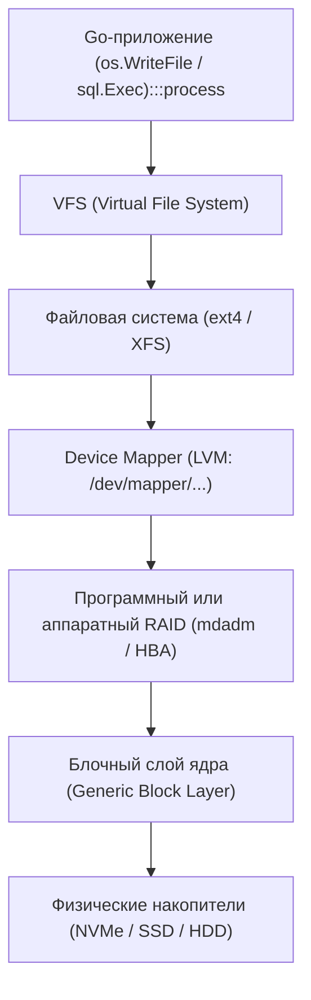
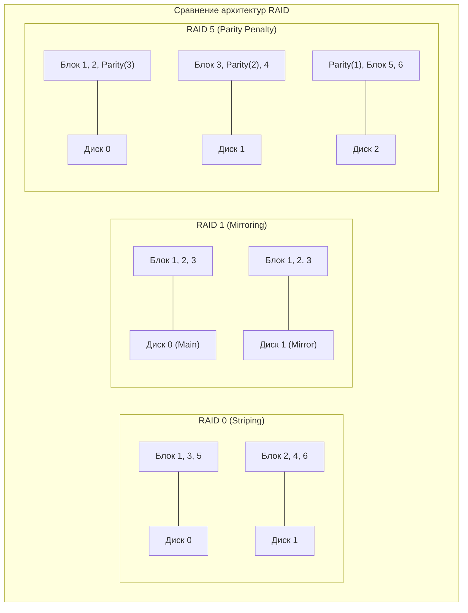
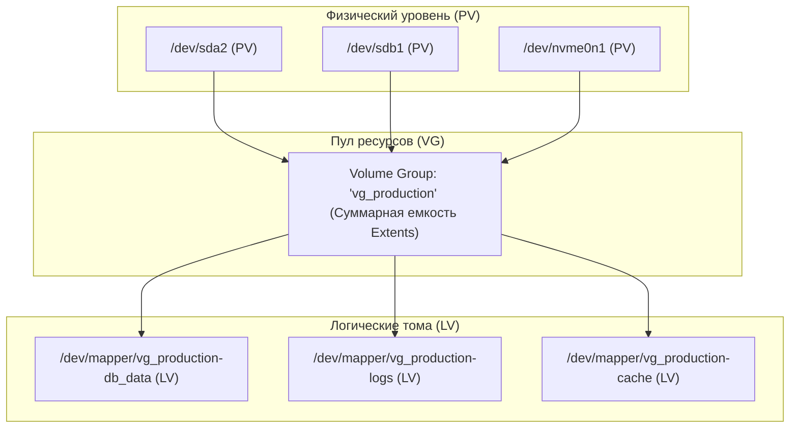
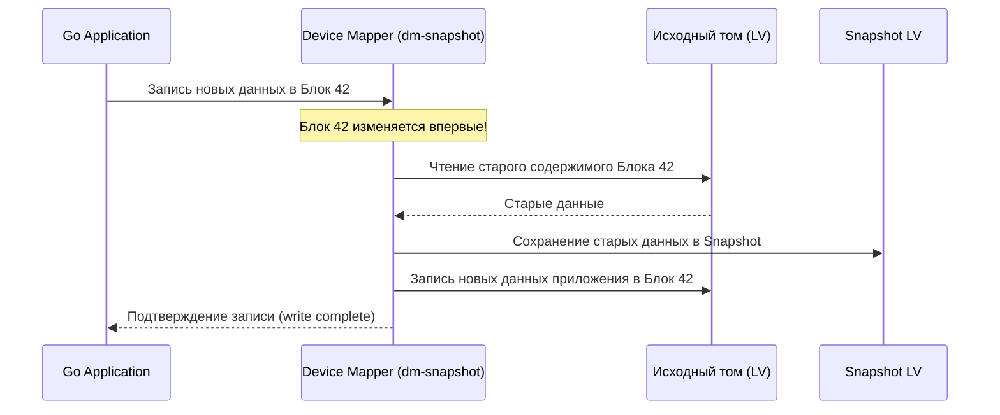
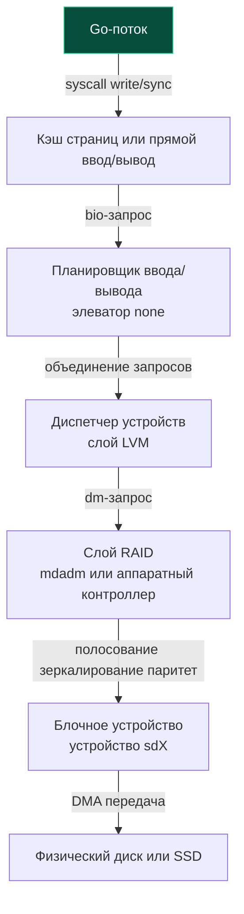

# 46. RAID, LVM и логические тома: Абстракция блочных устройств

> *«Любую проблему в компьютерных науках можно решить добавлением еще одного уровня косвенности — за исключением проблемы избытка этих самых уровней».*    
> — Дэвид Уилер

---

## Фундамент хранения данных: RAID, LVM и абстракция блоков

Для Go-разработчика, проектирующего высоконагруженные сервисы, понимание глубин подсистемы хранения критично ничуть не меньше, чем знание рантайма `netpoller`, планировщика горутин или `sync.Pool`. 

В прикладном коде любая операция фиксации данных — будь то `os.WriteFile`, стриминг через `json.Encoder` или транзакционный `sql.Exec` — выглядит элементарной. Однако за безобидным вызовом скрывается многослойный лабиринт абстракций:



Данные проходят путь: пользовательское пространство -> ядро -> файловая система -> слой логических томов (LVM) -> RAID-контроллер -> физические блочные устройства (`block devices`). Задержки на каждом из этих уровней суммируются. Неверно сконфигурированный дисковый массив способен превратить микросекундный `fsync` в полусекундную блокировку системного потока, заморозив работу десятков горутин.

В этой главе мы детально разберем, как абстракции блочного слоя маскируют физическое железо, какую цену приходится платить за уровни RAID и LVM, и как эти механизмы влияют на производительность Go-рантайма при синхронизации данных на диск.

---

## RAID: От дублирования к полосованию

Физический накопитель смертен. Он страдает от деградации кремниевых ячеек, отказа механики, перегрева и сбоев электропитания. Технология **RAID** (Redundant Array of Independent Disks) была создана для решения двух фундаментальных задач: объединить несколько физических дисков в единый логический том и обеспечить заданный уровень отказоустойчивости и скорости.

В современной серверной инфраструктуре сосуществуют две основные архитектуры RAID:
1. **Аппаратный RAID:** Выделенная плата контроллера (HBA/RAID card) с собственным микропроцессором, аппаратно вычисляющим контрольные суммы (XOR/Galois), и энергонезависимой оперативной памятью — Battery-Backed Write Cache (BBWC) или Flash-Backed Write Cache (FBWC).
2. **Программный RAID:** Реализуется модулем ядра Linux `md` (управляется утилитой `mdadm`). Расчет контрольных сумм возлагается на центральный процессор хоста (с использованием быстрых инструкций AVX-512/NEON), зато стек полностью прозрачен для мониторинга и не привязывает инженеров к проприетарному железу вендора.

---

## Ключевые уровни и их влияние на I/O

Каждый уровень RAID предлагает свой компромисс между полезной емкостью, отказоустойчивостью и накладными расходами на запись:

| Уровень | Архитектурный принцип | Производительность чтения | Производительность записи | Особенности и применимость в Go-стеке |
|:---:|:---|:---:|:---:|:---|
| `0` | Striping (полосование данных блоками) | `N * скорость` | `N * скорость` | **0 отказоустойчивости.** При отказе одного диска теряется весь массив. Применяется только для временных кэшей, скретч-буферов или `tmpfs` на SSD. |
| `1` | Mirroring (полное зеркалирование дисков) | `2x скорость` (зависит от контроллера) | `1x скорость` (ждет оба диска) | Отказоустойчивость `N-1`. Идеально подходит для системных разделов `boot` или критически важных append-only журналов (WAL). |
| `5` | Striping + 1 распределенный Parity-блок | `~1x скорость` | **Высокая задержка** (read-modify-write) | Теряет емкость 1 диска. **Опасен для транзакционных баз данных** и частых вызовов `fsync`. |
| `6` | Striping + 2 независимых Parity-блока | `~1x скорость` | **Еще выше задержка** (двойной расчет четности) | Выдерживает одновременную смерть 2 дисков. Применяется исключительно для холодных архивов и резервных копий. |
| `10` | Зеркалированные пары, объединенные в страйп (RAID 1+0) | `~1x скорость` | `~1x скорость` (на 1 зеркало) | **Золотой стандарт для высоконагруженных Go-сервисов и СУБД.** Сочетает скорость страйпа и надежность зеркала. |



> [!info] Под капотом: Феномен Write Penalty в RAID 5/6
> **Write Penalty** — неизбежная математическая цена записи в массивах с контролем четности.  
> Чтобы обновить один сектор размером 4 КБ в RAID 5, контроллер не может просто записать новые данные: он обязан сохранить математическое равенство `Data1 ⊕ Data2 ⊕ Data3 = Parity`.  
> 
> Поэтому ядро или контроллер выполняют цикл **Read-Modify-Write (RMW)**:
> 1. Считать с диска старые данные (`Read Old Data`).
> 2. Считать с диска старый паритет (`Read Old Parity`).
> 3. Вычислить новый паритет на CPU: `New Parity = (Old Data ⊕ New Data) ⊕ Old Parity`.
> 4. Записать новые данные (`Write New Data`).
> 5. Записать новый паритет (`Write New Parity`).
> 
> **Один логический `write` превращается в 4 физических операции I/O (2 чтения + 2 записи)!** Для RAID 6 штраф возрастает до 6 операций (3 чтения + 3 записи).  
> На уровне операционной системы это проявляется как взрывной рост метрики `iowait` и резкое падение IOPS.  
> В Go-сервисе это выглядит драматично: вызов `file.Sync()` или транзакционный `db.Exec()` с `sync=True` вместо положенных 1–5 мс зависает на 50–200 мс, блокируя системные потоки и вызывая лавинообразное разрастание очереди горутин.

---

## LVM и логические тома: Управление абстракциями

Традиционные дисковые разделы (`/dev/sda1`, `/dev/nvme0n1p1`) статичны: чтобы изменить размер раздела, требуется отмонтировать файловую систему, переразбить таблицу разделов и молиться, чтобы данные не повредились.

**LVM** (Logical Volume Manager) решает эту проблему, внедряя слой виртуализации хранилища между физическими дисками и файловой системой. Он позволяет объединять разные физические накопители в единый пул, на лету расширять тома, выделять место по требованию (thin provisioning) и мгновенно создавать снимки состояния (snapshots).



Архитектура LVM2 базируется на трех китах:
1. **PV (Physical Volume — Физический том):** Блочное устройство или раздел, инициализированный метаданными с меткой `LVM2`. Пространство PV нарезается на равные неделимые блоки — **PE (Physical Extents)**, обычно размером 4 МБ.
2. **VG (Volume Group — Группа томов):** Виртуальный пул, объединяющий один или несколько PV. Свободные экстенты всех PV объединяются в единый распределяемый банк памяти.
3. **LV (Logical Volume — Логический том):** Нарезка экстентов из VG, представляющая собой виртуальный блочный диск. В пространстве ядра Linux он регистрируется через подсистему `device-mapper` и монтируется как `/dev/mapper/...` (или `/dev/vg_name/lv_name`).

> [!tip] Собеседование
> **Вопрос:** В чем разница между прямым монтированием стандартного раздела `/dev/sda1` и логического тома LVM с точки зрения производительности ввода-вывода?
> 
> **Ответ:** LVM реализуется через ядерный драйвер `device-mapper` (`dm`). Для обычного линейного логического тома (linear LV) накладные расходы минимальны: ядро выполняет простую трансляцию логического смещения сектора в физический сектор по таблице отображения в оперативной памяти (O(1) операция, добавляющая доли микросекунды).  
> Однако, если том использует **Thin Provisioning** или активные **Snapshots**, накладные расходы становятся заметными: при записи в новые блоки ядро должно атомарно выделить экстент, обновить метаданные пула и выполнить синхронизацию. При мелких случайных записях (<4KB) это создает оверхед в 2–5% на CPU и может приводить к непрогнозируемым микрозадержкам из-за конкуренции за блокировки метаданных в ядре.

---

## Thin Provisioning и Snapshots

### 1. Тонкое выделение места (Thin Provisioning)
В классическом LVM при создании тома на 1 ТБ все экстенты резервируются сразу. В **Thin Provisioning** (пулы `thin-pool`) том декларирует виртуальный объем (например, 10 ТБ), но физические блоки выделяются из пула строго в момент фактической записи приложением.
- **Плюс:** Экономия дискового пространства и гибкость для виртуализации и контейнеров.
- **Минус (block allocation overhead):** Первая запись в ранее незанятый логический блок требует прерывания ввода-вывода: ядро приостанавливает поток, находит свободный блок в пуле, обновляет b-дерево метаданных `dm-thin` и лишь затем выполняет запись данных.

### 2. Снимки состояния (LVM Snapshots) и Copy-on-Write
Снимки LVM работают по классическому принципу **Copy-On-Write (COW)**:



При первом изменении любого блока оригинального тома ядро сначала считывает оригинальный блок, записывает его копию в пространство снимка, и лишь затем разрешает перезапись блока новыми данными приложения.

Для Go-приложений, интенсивно пишущих в СУБД, наличие активных снимков LVM приводит к явлению **snapshot split** и резкому падению пропускной способности: каждая операция `fsync` удваивает нагрузку на блочный слой из-за сопутствующих фоновых чтений и сохранений снимка!

---

## Под капотом: Путь I/O через блок-слой

Когда приложение на Go вызывает `os.File.Sync()` или осуществляет прямой ввод-вывод через `O_DIRECT`, данные проходят строгую многоуровневую цепочку в ядре Linux:



---

## Как это влияет на производительность Go?

1. **I/O Scheduler:** В современных серверах с NVMe-накопителями планировщик ввода-вывода ядра часто переводят в режим `none`, так как параллельные аппаратные очереди контроллера сами прекрасно справляются с арбитражем. Однако для HDD и составных RAID-массивов выбор планировщика (`mq-deadline`) по-прежнему критичен для предотвращения застревания очередей.
2. **Request Merging:** Ядро непрерывно анализирует поток запросов от горутин и пытается объединить соседние секторы в один агрегированный `bio`. Это колоссально экономит пропускную способность шины, но может незначительно увеличивать задержку одиночных синхронных вызовов `fsync`.
3. **Cache Coherency и надежность контроллера:** Если в сервере установлен аппаратный RAID-контроллер с кэшем BBWC (Battery-Backed Write Cache), вызов `fsync` может возвращаться практически мгновенно: контроллер забирает данные в свою защищенную память и рапортует ядру об успехе. Но здесь кроется опасность: если батарея контроллера исчерпала свой ресурс или неисправна, контроллер аварийно переключается в режим прямой записи без кэша, и производительность сервиса мгновенно обваливается в десятки раз!

> [!warning] Ловушка / Gotcha: Оптимистичный кэш RAID-контроллера и иллюзия сохранности
> Если аппаратный RAID-контроллер настроен в режиме кэширования **WriteBack** (запись с отложенным сбросом), вызов `file.Sync()` или `syscall.Fsync(fd)` в Go возвращает `nil` в тот момент, когда данные легли всего лишь в оперативную память контроллера, но еще не записаны на магнитные блины или флэш-ячейки накопителя.  
> 
> Если на сервере произойдет обесточивание, а батарея контроллера окажется неисправной, данные будут безвозвратно утеряны, несмотря на то, что Go-сервис получил успешное подтверждение синхронизации!  
> Для критически важных транзакционных данных (платежи, биллинг) контроллеры настраивают в режим **WriteThrough**, либо используют флаги `O_SYNC` / `O_DSYNC`. Будьте готовы к тому, что отключение промежуточного кэша контроллера увеличит задержку записи в 10–50 раз.

---

## Влияние на Go-приложения и системный дизайн

### 1. `bufio` и буферизация против LVM/RAID
Использование буферизированного ввода-вывода через `bufio` в Go великолепно снижает число системных вызовов `write`, накапливая байты в памяти пользовательского пространства. 

Однако, если под файловой системой развернут LVM с thin-provisioning или программный массив RAID 5, каждый системный сброс буфера неизбежно попадает под нож драйвера `dm` и алгоритма пересчета паритета.  
**Инженерная рекомендация:** Для высоконагруженных Go-сервисов (хранилища логов, движки баз данных) используйте `O_DIRECT` через вызов `syscall.Open` для полного обхода Page Cache ядра, согласуя размер буфера приложения так, чтобы он был строго кратен размеру физического блока или полосы страйпа RAID (Stripe Unit, обычно 64 КБ – 256 КБ).

### 2. `fsync` и durability
В стандартной библиотеке Go методы `db.Sync()` или `file.Sync()` блокируют горутину и связанный системный поток ОС до полного завершения дисковой транзакции. На дисковом стеке LVM + RAID эта операция может занимать от 1 мс (быстрый NVMe) до 100+ мс (нагруженный массив RAID 5 на HDD).

**Паттерн Group Commit и Write-Ahead Log (WAL):** Никогда не вызывайте `Sync()` атомарно на каждую пользовательскую операцию (HTTP/gRPC-запрос). Реализуйте паттерн периодической групповой синхронизации (Group Commit): горутины складывают транзакции во внутренний буфер в оперативной памяти, а выделенный фоновый воркер сбрасывает накопленный журнал на диск раз в 10–50 мс или по достижении лимита объема (например, 1 МБ). Это позволяет RAID-контроллеру и планировщику слить сотни мелких операций в одну непрерывную последовательную запись.

```go
package main

import (
	"bufio"
	"fmt"
	"os"
	"sync"
	"time"
)

// GroupCommitter реализует периодическую групповую фиксацию транзакций (WAL)
type GroupCommitter struct {
	file   *os.File
	writer *bufio.Writer
	mu     sync.Mutex
	notify chan struct{}
	done   chan struct{}
}

func NewGroupCommitter(path string) (*GroupCommitter, error) {
	f, err := os.OpenFile(path, os.O_CREATE|os.O_APPEND|os.O_WRONLY, 0644)
	if err != nil {
		return nil, err
	}
	gc := &GroupCommitter{
		file:   f,
		writer: bufio.NewWriterSize(f, 256*1024), // Буфер 256 КБ
		notify: make(chan struct{}, 1),
		done:   make(chan struct{}),
	}
	go gc.flusher()
	return gc, nil
}

func (gc *GroupCommitter) Append(data []byte) error {
	gc.mu.Lock()
	defer gc.mu.Unlock()

	if _, err := gc.writer.Write(data); err != nil {
		return err
	}

	// Уведомляем фоновый сбрасыватель
	select {
	case gc.notify <- struct{}{}:
	default:
	}
	return nil
}

func (gc *GroupCommitter) flusher() {
	ticker := time.NewTicker(20 * time.Millisecond) // Сброс каждые 20 мс
	defer ticker.Stop()

	for {
		select {
		case <-gc.done:
			return
		case <-ticker.C:
			gc.flushAndSync()
		case <-gc.notify:
			// Сбрасываем при заполнении или по таймеру
			gc.flushAndSync()
		}
	}
}

func (gc *GroupCommitter) flushAndSync() {
	gc.mu.Lock()
	defer gc.mu.Unlock()

	if gc.writer.Buffered() > 0 {
		_ = gc.writer.Flush()
		// file.Sync() выполняет fsync(fd), гарантируя сброс через LVM и RAID
		_ = gc.file.Sync()
	}
}

func (gc *GroupCommitter) Close() error {
	close(gc.done)
	gc.flushAndSync()
	return gc.file.Close()
}

func main() {
	gc, err := NewGroupCommitter("wal.log")
	if err != nil {
		panic(err)
	}
	defer gc.Close()
	defer os.Remove("wal.log")

	_ = gc.Append([]byte("TX 1: user payment\n"))
	_ = gc.Append([]byte("TX 2: balance update\n"))
	fmt.Println("Транзакции буферизированы и зафиксированы групповым коммитом!")
}
```

### 3. Мониторинг и профилирование

Если задержка ответов Go-сервиса начинает расти, а стандартный профайлер `pprof` указывает на системные вызовы ввода-вывода, необходимо инспектировать здоровье дискового стека на уровне операционной системы:

```bash
# 1. Проверка нагрузки блочных устройств и задержек ожидания (await, %util)
iostat -x 1
# Значения await > 10-15 мс для SSD/NVMe сигнализируют о проблемах в очереди контроллера

# 2. Проверка состояния сопоставления Device Mapper в LVM
dmsetup status

# 3. Диагностика аппаратного RAID (состояние батареи BBWC и кэша WB/WT)
# Для контроллеров LSI / Broadcom MegaRAID:
megacli -LDInfo -Lall -aALL 2>/dev/null || raidstat 2>/dev/null || echo "RAID CLI check"

# 4. Проверка состояния программного RAID в Linux
cat /proc/mdstat
```

---

## Итог

1. **RAID** — это фундаментальный инженерный компромисс между избыточностью, полезным объемом и ценой задержки. Алгоритм Parity в RAID 5/6 накладывает жестокий штраф (Write Penalty), превращающий одну логическую запись в 4–6 физических операций I/O. Для высокопроизводительных Go-сервисов и СУБД стандартом де-факто остается **RAID 10** или прямое зеркалирование NVMe-накопителей.
2. **LVM** добавляет гибкий уровень косвенной адресации через `device-mapper`. Обычные линейные тома практически бесплатны, однако механизмы Thin Provisioning и COW-снимки (Snapshots) могут вызывать непредсказуемые просадки скорости записи из-за аллокации экстентов и эффекта snapshot split.
3. **Путь I/O в ядре Linux** — это конвейер: Page Cache -> I/O Scheduler -> Device Mapper -> RAID -> Physical Storage. На каждом этапе запрос может быть буферизирован, слит с соседними блоками или заблокирован в ожидании синхронизации.
4. **Механическое сочувствие в Go:** Буферизация через `bufio` уменьшает число сисколлов, но не снижает физическую задержку `fsync`. Использование прямого ввода-вывода `O_DIRECT`, пакета `syscall.Open` и архитектурных паттернов вроде **Group Commit (WAL)** позволяет изолировать сервис от задержек блочного слоя.

Мы детально исследовали, как операционная система организует надежное хранение байтов на дисковых накопителях. Теперь настало время поднять взгляд на следующий важнейший уровень архитектуры серверов — сетевой стек ядра Linux. В следующей статье: [[47. Сетевая подсистема ОС.md]], где мы разберем, как пакеты путешествуют от физического порта сетевой карты до пользовательского сокета в Go.
