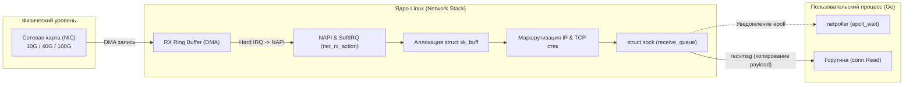
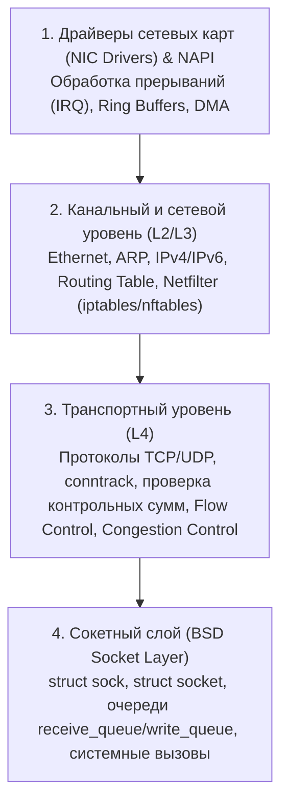
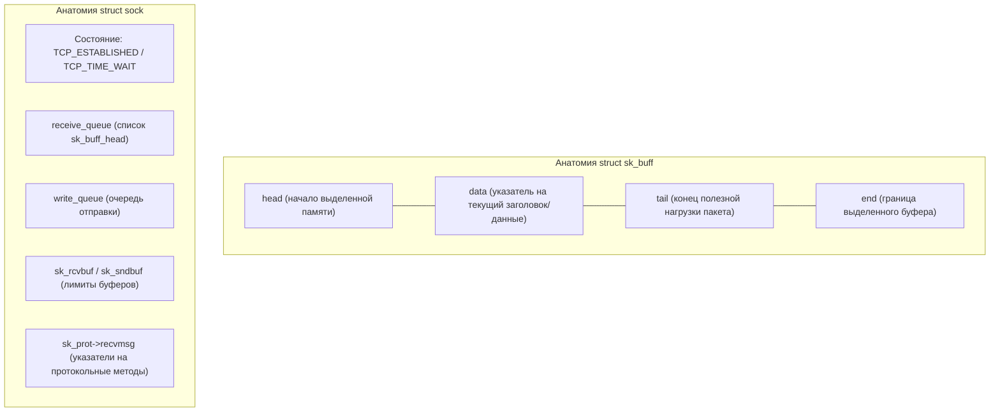
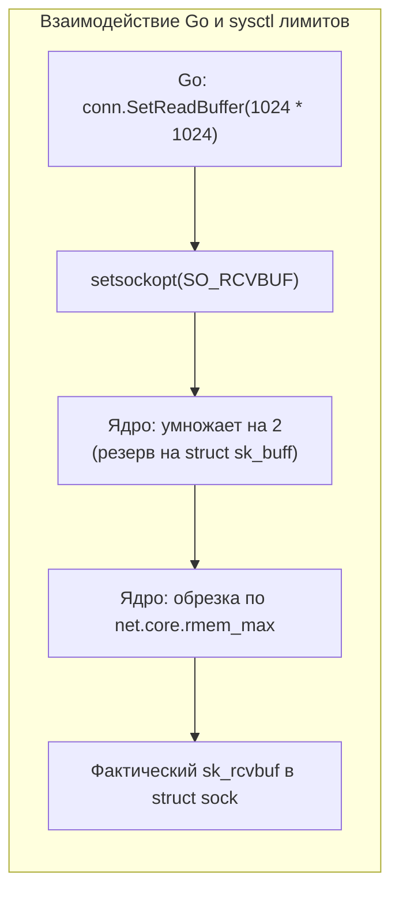

# 47. Сетевая подсистема ОС: Архитектура, sk_buff и путь пакета

> *«Компьютерная сеть — это механизм, позволяющий превратить проблему, которая раньше была локальной, в распределенную — и невидимую».*    
> — Свободная мысль в духе Bell Labs

---

## Введение: Почему Go-разработчику важно знать сеть ОС?

В повседневной разработке на Go сетевое программирование выглядит обманчиво легко и безмятежно. Мы открываем соединение через `grpc.Dial`, настраиваем маршруты в `net/http` или читаем входящие байты из абстракции `net.Conn`. Рантайм Go заботливо скрывает создание потоков ОС, мультиплексирование через `epoll` и передачу буферов.

Однако в реальных высоконагруженных распределенных системах стабильность, пропускная способность и задержки сервиса на 80% определяются не кодом на Go, а тем, как ядро Linux обрабатывает входящие сетевые фреймы, распределяет память под кольцевые буферы и переключает контекст между аппаратными драйверами сетевой карты (NIC) и пользовательским пространством (user space).



Глубокое понимание сетевого стека операционной системы необходимо инженеру для того, чтобы:
- Находить и устранять причины «мистических» сетевых таймаутов, зависаний рукопожатий и внезапных ошибок `ECONNRESET`.
- Грамотно калибровать размеры системных буферов, параметры очереди `backlog` и лимит `somaxconn` под пиковые нагрузки.
- Осознанно выбирать сетевые протоколы и интерфейсы (`TCP`, `UDP`, `io_uring`) под конкретные паттерны трафика.
- Четко отделять накладные расходы рантайма Go от аппаратных и ядерных ограничений Linux.

---

## Архитектура сетевого стека в ядре ОС

Современные Unix-подобные операционные системы реализуют сетевой стек на основе исторического стандарта **BSD Socket API**. Это не монолитный монолит, а строгая многоуровневая модульная прослойка между кремнием сетевой карты и системными вызовами пользовательского приложения.

В архитектуре Linux выделяются четыре ключевых уровня:



1. **Драйверы NIC (Network Interface Card):** Управляют физическим контроллером, настраивают дескрипторы очередей DMA, обрабатывают аппаратные прерывания (IRQ) и используют подсистему **NAPI (New API)** для пакетного сбора кадров (interrupt coalescing), защищающего процессор от «шторма прерываний».
2. **Канальный и сетевой уровень (L2/L3):** Отвечает за демаршализацию Ethernet-кадров, трансляцию адресов ARP, маршрутизацию IPv4/IPv6, дефрагментацию и прогон через хуки подсистемы фильтрации Netfilter (iptables/nftables).
3. **Транспортный уровень (L4):** Реализует протоколы TCP и UDP, отслеживание соединений (conntrack), проверку контрольных сумм, управление окном передачи (Flow Control) и алгоритмы борьбы с перегрузками (BBR, CUBIC).
4. **Сокетный слой (Socket Layer):** Предоставляет абстракцию BSD API, структуры `struct socket` и `struct sock`, организует очереди пакетов и обрабатывает системные вызовы (`bind`, `listen`, `accept`, `recvmsg`, `sendmsg`).

Рантайм Go взаимодействует исключительно с сокетным уровнем ядра через системные вызовы. Когда горутина вызывает `conn.Read()`, она не обращается к сетевому проводу. Она обращается к ядру с просьбой: *«Скопируй в мой слайс байты, которые сетевой стек уже собрал и сложил в очередь этого сокета»*.


---

## Путь пакета: от NIC до User Space и обратно

Чтобы осознать цену каждого байта в сети, проследим пошаговый путь входящего сетевого пакета от физического трансивера до буфера горутины в Go:

1. **Прием кадра сетевой картой:** Физический контроллер NIC принимает Ethernet-кадр из кабеля/оптики. Через механизм Direct Memory Access (DMA) карта записывает сырые байты пакета в заранее выделенную область оперативной памяти хоста — кольцевой буфер приема (RX Ring Buffer).
2. **Аппаратное прерывание и переключение в NAPI:** NIC посылает центральному процессору аппаратный сигнал прерывания (Hard IRQ). Ядро Linux перехватывает сигнал, временно отключает прерывания от этой очереди сетевой карты и планирует программное мягкое прерывание SoftIRQ (`NET_RX_SOFTIRQ`), активируя механизм NAPI (New API).
3. **Аллокация `sk_buff`:** В контексте SoftIRQ функция драйвера `net_rx_action` вычитывает дескрипторы пакетов пачками (бюджет по умолчанию — 64 пакета за проход). Для каждого пакета выделяется структура `struct sk_buff` (или `sk_buff`) из slab-кэша ядра. Размер заголовка определяется константами ядра (например, `SKB_MAX_HEAD`).
4. **Обработка сетевым стеком:** Пакет передается функции ядра `netif_receive_skb`. Проверяется целостность, сверяются правила Netfilter / eBPF, извлекаются заголовки IP и TCP. Если включен conntrack, обновляется таблица состояний. Выполняется реассемблирование (восстановление порядка TCP-сегментов).
5. **Помещение в очередь сокета:** Ядро находит целевой сокет по 4-tuple (src IP, src port, dst IP, dst port). Если сокет находится в состоянии `LISTEN` или `ESTABLISHED`, пакет помещается в конец двусвязного списка `receive_queue` (очередь `sk_buff_head` внутри `struct sock`).
6. **Пробуждение горутины и вызов `recvmsg`:** Механизм `netpoll` рантайма Go (ожидающий событий в системном вызове `epoll_wait`) получает сигнал о готовности сокета к чтению (`EPOLLIN`). Планировщик Go переводит заблокированную горутину в состояние готовности к исполнению. Горутина выполняет системный вызов `recvmsg` (или `read`), и ядро копирует полезную нагрузку (payload) из ядерного `sk_buff` в буфер пользовательского пространства Go. После этого `sk_buff` освобождается.

> [!warning] Ловушка / Gotcha: Проблема двойного копирования памяти
> Обратите внимание: данные сетевого пакета копируются **дважды**:
> 1. Первый раз: сетевая карта через DMA копирует байты в память ядра (RX Ring).
> 2. Второй раз: ядро в сисколле `recvmsg` копирует байты из оперативной памяти ядра в память пользовательского процесса (срез Go).
> 
> На гигабитных скоростях это незаметно. Но на интерфейсах 40G/100G процессор начинает тратить до 60% времени на бессмысленное перекладывание байтов между кэшами L1/L2/L3 и шиной RAM (Memory Wall).  
> Для обхода двойного копирования в высоконагруженных прокси-серверах и файловых серверах используют системные вызовы Zero-Copy: `sendfile`, `splice`, интерфейс `io_uring` с зарегистрированными буферами или технологии ядра AF_XDP. Однако стандартный сетевой пакет `net` в Go пока использует традиционный путь `recvmsg`.

---

## Ключевые структуры ядра Linux

Чтобы говорить со специалистами по сетям и инфраструктуре на одном языке, необходимо представлять ключевые структуры данных, вокруг которых вращается сетевой стек Linux:



### 1. `struct sk_buff` (Socket Buffer)
Это «швейцарский нож» сетевой подсистемы Linux. `sk_buff` представляет отдельный сетевой пакет и сопровождает его на всем пути от драйвера до пользовательского сокета.
- Содержит указатели `head`, `data`, `tail`, `end`. Переход пакета между сетевыми уровнями (L2 -> L3 -> L4) не требует копирования памяти: ядро просто сдвигает указатель `data` вперед, «срезая» разобранный заголовок!
- Для передачи гигантских пакетов (Jumbo Frames, LRO/GRO) ядро использует механизм фрагментации памяти: структура ссылается на массив страниц подкачки `skb_frag`.

### 2. `struct sock` (Ядерное представление сокета)
Хранит полное состояние сетевого соединения:
- Двусвязные списки входящих и исходящих пакетов: `sk_buff_head` (очереди `receive_queue` и `write_queue`).
- Лимиты выделенной памяти под буферы: `sk_rcvbuf` и `sk_sndbuf`.
- Текущий статус соединения конечного автомата TCP (`TCP_ESTABLISHED`, `TCP_TIME_WAIT`, `TCP_CLOSE` и т.д.).
- Таблицу виртуальных методов протокола: `sk_prot->recvmsg`, `sk_prot->sendmsg`.

### 3. `dev_queue` (Очередь сетевого устройства)
Очередь пакетов на отправку (TX Queue) перед физической сетевой картой. Если приложение генерирует трафик быстрее, чем карта способна отправить кадры в кабель, очередь заполняется, приводя к дрожанию задержки (jitter) и сбросу пакетов в дисциплине управления очередями (qdisc).

Когда очередь `receive_queue` на приемном сокете переполняется из-за того, что Go-приложение не успевает вычитывать данные через `conn.Read()`, ядро начинает молча дропать входящие пакеты. Для клиента это выглядит как резкая потеря пакетов и падение окна TCP Window.

---

## Буферы сокетов и системные лимиты

Ядро Linux жестко контролирует потребление памяти сетевыми структурами. Эти лимиты настраиваются через подсистему `sysctl` и напрямую диктуют поведение Go-приложений под нагрузкой:

| Параметр sysctl | Назначение параметра | Влияние на рантайм Go и приложение |
|---|---|---|
| `net.core.rmem_max` | Максимальный абсолютный размер буфера приема сокета (`SO_RCVBUF`) | Жесткий потолок для вызовов `conn.SetReadBuffer()` в Go |
| `net.core.wmem_max` | Максимальный абсолютный размер буфера отправки сокета (`SO_SNDBUF`) | Жесткий потолок для вызовов `conn.SetWriteBuffer()` в Go |
| `net.core.somaxconn` | Максимальная длина очереди полностью установленных соединений (`listen`) | Жесткий потолок для параметра `net.ListenConfig.Backlog` |
| `net.ipv4.tcp_rmem` | Тройка значений (min, default, max) для авто-тюнинга `tcp_rmem` | Определяет динамический размер буфера приема, TCP window size и throughput |



> [!info] Под капотом: Скрытая математика буферов и ловушка `somaxconn`
> Когда вы вызываете в Go метод `conn.SetReadBuffer(1024 * 1024)`, рантайм отправляет системный вызов `setsockopt(SO_RCVBUF, ...)`.  
> 
> Здесь бэкенд-разработчика подстерегают два скрытых механизма ядра:
> 1. **Удвоение памяти:** Ядро автоматически **умножает** запрошенное значение на 2. Зачем? Чтобы зарезервировать память не только под полезную нагрузку пакета, но и под служебные метаданные ядра (`struct sk_buff`).
> 2. **Ограничение сверху:** Полученное значение ядро жестко **обрезает** по лимиту `net.core.rmem_max`. Если в системе `rmem_max` равен 256 КБ, ваш запрос на 1 МБ будет молча урезан!
> 
> Аналогичная ловушка кроется в очереди `listen`. Если системный лимит `somaxconn` по умолчанию равен 128, а вы передали `Backlog: 1024` в структуре `net.ListenConfig`, ядро молча проигнорирует ваше желание и выставит `backlog = 128`.  
> В моменты пикового наплыва клиентов очередь мгновенно переполнится, и ядро начнет отбрасывать входящие пакеты SYN, а клиенты получат таймауты подключения.

---

## Влияние на производительность Go-приложений

### 1. Аппаратный Checksum Offloading и eBPF
Современные сетевые адаптеры берут расчет контрольных сумм IP и TCP на себя на уровне кремния. При приеме пакета NIC проверяет контрольную сумму и сообщает об этом ядру, выставляя флаг `CHECKSUM_UNNECESSARY`.  
Однако, если вы используете фильтрацию трафика через eBPF, iptables или производите модификацию заголовков без пересчета контрольных сумм, ядро забракует пакет. В логах Go-сервиса это проявится как внезапные сбросы соединений или ошибки `checksum error`.

### 2. Мультиплексирование `epoll` и Go `netpoller`
В отличие от классических многопоточных моделей (Java до Loom, PHP-FPM), где каждый сокет привязан к системному потоку ОС, Go использует неблокирующий ввод-вывод:
- Все сокеты создаются с флагом `SOCK_NONBLOCK`.
- При открытии соединения Go регистрирует файловый дескриптор в ядерном механизме `epoll` через системный вызов `epoll_ctl(EPOLL_CTL_ADD)`.
- Если при вызове `conn.Read()` данных в очереди сокета нет, горутина не блокирует тред ОС, а переводится рантаймом в спящий режим через процедуру `runtime.park`. Системный поток ОС освобождается и немедленно берет на исполнение другую горутину.
- Когда в сетевую карту приходят данные и ядро помещает `sk_buff` в сокет, системный вызов `epoll_wait` в фоновом потоке `netpoller` сигнализирует рантайму о готовности данных, и горутина просыпается. Это обеспечивает способность одного сервера на Go играючи удерживать 100 000+ одновременных соединений!

### 3. Кэш-линии процессора и локальность данных
Структура `sk_buff` и дескриптор сокета `struct sock` живут в разных областях памяти. На скоростях 100 Гбит/с постоянные промахи в кэше процессора (`cache misses`) становятся основным фактором замедления. Сетевой поллер Go проектировался с учетом механического сочувствия: дескрипторы сокетов пулятся, чтобы минимизировать мусор и разгрузить L1/L2 кэши CPU.

> [!tip] Собеседование
> **Вопрос:** Почему конструкция `net.ListenConfig{KeepAlive: 30s}` в Go не устанавливает детальные таймауты TCP Keep-Alive на уровне ядра Linux, и как это исправить?
> 
> **Ответ:** Стандартная опция `KeepAlive` в `net.ListenConfig` лишь активирует флаг сокета `SO_KEEPALIVE`. Однако детальные интервалы зондирования мертвого соединения (`tcp_keepalive_time`, `tcp_keepalive_intvl`, `tcp_keepalive_probes`) берутся из глобальных настроек операционной системы (`net.ipv4.tcp_keepalive_time` по умолчанию равен 7200 секундам, то есть 2 часам!). Если клиент отключится без отправки пакета `FIN` (например, оборвался кабель или выключилось питание), сервер будет удерживать сокет открытым целых два часа!
> 
> Чтобы переопределить эти параметры индивидуально для сервиса, необходимо воспользоваться хуком `Control` в `net.ListenConfig` и напрямую вызвать `setsockopt` с флагами `TCP_KEEPIDLE` и `TCP_KEEPINTVL` до того, как будет выполнен системный вызов `listen()`:

```go
package main

import (
	"context"
	"errors"
	"fmt"
	"net"
	"syscall"
	"time"
)

// keepAliveControl настраивает индивидуальные таймауты TCP Keep-Alive на сокете Linux
func keepAliveControl(network, addr string, c syscall.RawConn) error {
	var ctrlErr error
	err := c.Control(func(fd uintptr) {
		// 1. Включаем SO_KEEPALIVE на уровне SOL_SOCKET
		if err := syscall.SetsockoptInt(int(fd), syscall.SOL_SOCKET, syscall.SO_KEEPALIVE, 1); err != nil {
			ctrlErr = fmt.Errorf("ошибка SO_KEEPALIVE: %w", err)
			return
		}
		// 2. Время простоя соединения до первого зонда Keep-Alive: 30 секунд (TCP_KEEPIDLE)
		const tcpKeepIdle = 4 // В Linux syscall.TCP_KEEPIDLE равен 4
		if err := syscall.SetsockoptInt(int(fd), syscall.IPPROTO_TCP, tcpKeepIdle, 30); err != nil {
			ctrlErr = fmt.Errorf("ошибка TCP_KEEPIDLE: %w", err)
			return
		}
		// 3. Интервал между повторными зондами: 10 секунд (TCP_KEEPINTVL)
		const tcpKeepIntvl = 5 // В Linux syscall.TCP_KEEPINTVL равен 5
		if err := syscall.SetsockoptInt(int(fd), syscall.IPPROTO_TCP, tcpKeepIntvl, 10); err != nil {
			ctrlErr = fmt.Errorf("ошибка TCP_KEEPINTVL: %w", err)
			return
		}
	})
	return errors.Join(err, ctrlErr)
}

func main() {
	lc := net.ListenConfig{
		Control: keepAliveControl,
	}

	listener, err := lc.Listen(context.Background(), "tcp", ":8080")
	if err != nil {
		panic(err)
	}
	defer listener.Close()

	fmt.Println("TCP-сервер слушает :8080 с точной настройкой Keep-Alive (30с простой, 10с интервал)")
}
```

---

## Итог

1. **Сетевой стек Linux** — это конвейер: физическая карта NIC -> кольцо DMA -> `sk_buff` -> протоколы IP/TCP -> `struct sock` -> системный вызов `recvmsg` -> пользовательский буфер Go `net.Conn`. Каждое звено этого конвейера вносит свой вклад в задержку и потребление памяти.
2. **Анатомия sk_buff**: Пакеты не копируются между сетевыми уровнями; ядро оперирует единым буфером, динамически передвигая границы заголовков. Однако на границе пользовательского пространства происходит копирование полезной нагрузки, что стимулирует переход на технологии Zero-Copy на сверхвысоких скоростях.
3. **Системные лимиты sysctl**: Вызовы `conn.SetReadBuffer()` и настройки очереди `backlog` в Go жестко лимитируются параметрами ядра `net.core.rmem_max` и `net.core.somaxconn`. Игнорирование этих настроек приводит к невидимым дропам пакетов и таймаутам клиентов.
4. **Симбиоз epoll и Go netpoller**: Неблокирующий ввод-вывод и парковка горутин позволяют Go эффективно обрабатывать сотни тысяч соединений, избегая дорогостоящих блокировок потоков ОС.

Мы изучили общую архитектуру сетевого конвейера операционной системы. Но как именно создаются сокетные дескрипторы, как на уровне ядра протекает трехэтапное рукопожатие TCP (3-way handshake) и какие системные вызовы сопровождают жизнь соединения? В следующей главе: [[48. Socket API и жизненный цикл TCP-соединения.md]].
