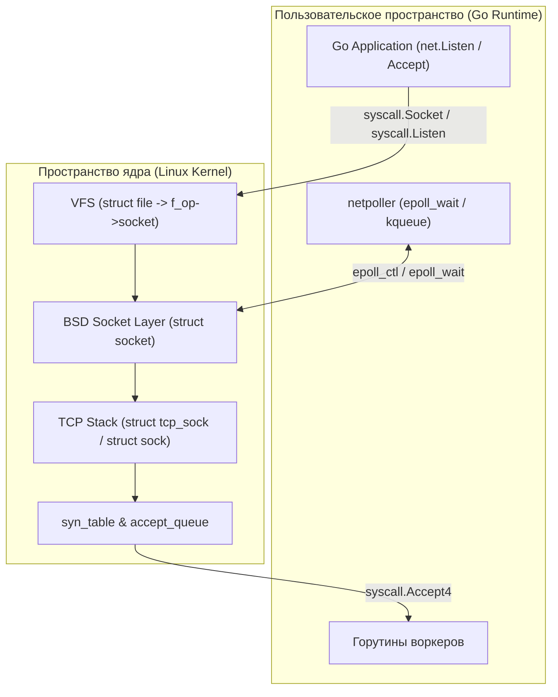
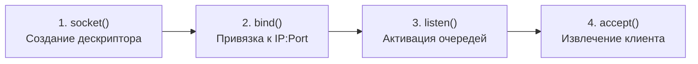
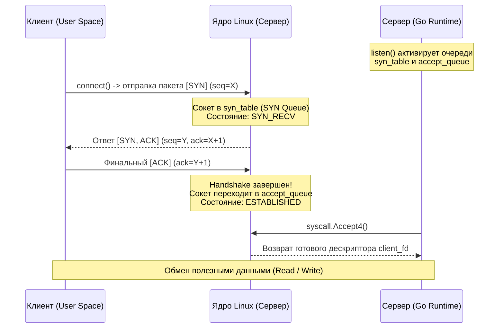
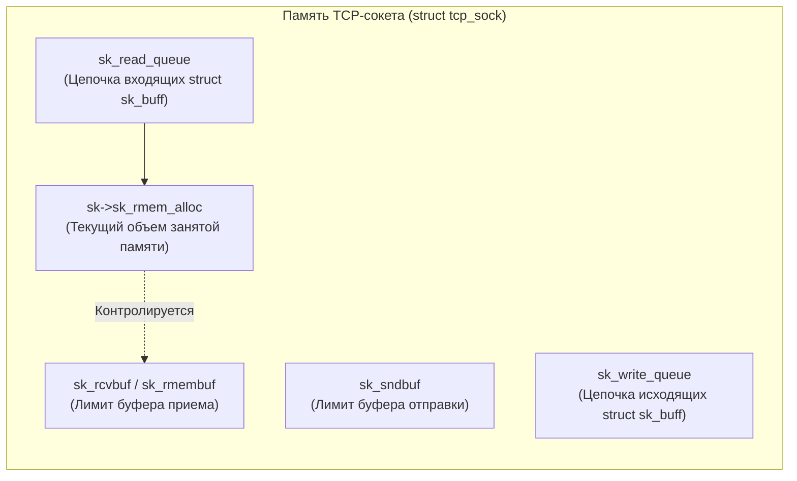

# 48. Socket API и жизненный цикл TCP-соединения в Linux и Go

> *«Сокеты — это универсальный водопровод Интернета: обманчиво простые снаружи, сложнейшие внутри и беспощадные при засорах».*    
> — Свободная мысль в духе классиков Bell Labs

---

## Введение: Сокеты как мост между приложением и сетью

Для разработчика на Go сетевое программирование начинается с предельно лаконичных конструкций: `net.Listen`, `Listener.Accept` или `Conn.Read`. Мы пишем несколько строк кода и получаем работающий HTTP- или gRPC-сервер, способный обслуживать десятки тысяч клиентов. За этой обманчивой простотой скрывается колоссальный айсберг: пакет `[[5. Учебник по Go (Основы и синтаксис)]].net` абстрагирует сложнейшие механизмы взаимодействия с ядром Linux, конечный автомат протокола TCP и планировщик горутин.

Когда ваше Go-приложение вызывает `net.Listen` или читает байты через `conn.Read()`, оно не взаимодействует с физической сетью напрямую. Вы инициируете каскад системных вызовов, аллокаций памяти под ядерные буферы и пробуждений горутин через механизмы мультиплексирования ввода-вывода.



Понимание того, как рождается TCP-соединение, как ядро управляет его жизненным циклом и как рантайм Go извлекает пакеты из очередей сокета, абсолютно необходимо для:
- Диагностики утечек файловых дескрипторов и зависших сокетов в состояниях `TIME_WAIT` и `CLOSE_WAIT`.
- Точного тюнинга пропускной способности серверов под многотысячный RPS.
- Уверенного прохождения хардкорных архитектурных собеседований на позицию Senior Go Developer.

---

## BSD Socket API и файловая система Linux

В операционной системе Linux реализован фундаментальный принцип Unix: **«Всё есть файл»** (или, точнее, «всё доступно через файловые дескрипторы»). Сетевой сокет с точки зрения операционной системы — это полноценный файловый дескриптор в таблице процесса (`fd`). Именно поэтому к сетевым сокетам применимы те же базовые системные вызовы ввода-вывода, что и к дисковым файлам или пайпам: `read`, `write`, `close`, а также селекторы `poll`, `select` и `epoll`. Благодаря этой унификации интерфейс `net.Conn` в Go безупречно реализует стандартные интерфейсы `io.Reader` и `io.Writer`.

Классический процесс создания сетевого слушателя базируется на историческом стандарте **BSD Socket API**:



1. `socket(AF_INET, SOCK_STREAM, IPPROTO_TCP)` — выделяет файловый дескриптор в ядре и привязывает его к сетевому семейству IPv4 и потоковому протоколу TCP.
2. `bind(fd, addr)` — связывает абстрактный сокет с конкретным локальным IP-адресом и сетевым портом.
3. `listen(fd, backlog)` — переводит сокет в пассивный режим прослушивания и инициирует очереди ожидания входящих рукопожатий.
4. `accept(fd, ...)` — блокирует вызывающий поток (или возвращает ошибку в неблокирующем режиме), пока из очереди установленных соединений не будет извлечен готовый сокет клиента.

> [!info] Под капотом: Двойственная природа сокета в ядре
> Внутри ядра Linux системный вызов `socket()` порождает две неразрывно связанные структуры:
> 1. `struct file` — объект виртуальной файловой системы (VFS), обеспечивающий интеграцию сокета в таблицу файловых дескрипторов процесса. Связь между VFS и сетью осуществляется через поле операций `f_op->socket`.
> 2. `struct socket` — высокоуровневое представление BSD-сокета, которое, в свою очередь, указывает на низкоуровневую структуру `struct sock`.
> 
> Для протокола TCP ядро выделяет расширенную структуру `struct tcp_sock`, которая логически наследуется от `struct sock`. Вся динамика жизненного цикла (конечный автомат состояний: `SYN_SENT`, `ESTABLISHED`, `FIN_WAIT` и др.) фиксируется в поле `sk_state` внутри `struct sock`.

---

## Жизненный цикл TCP-соединения (3-way handshake)

Протокол TCP обеспечивает надежную, упорядоченную доставку потока байтов поверх ненадежной пакетной сети IP. Перед тем как приложение сможет передать хотя бы один полезный байт данных, клиент и сервер обязаны выполнить трехэтапное рукопожатие (**3-Way Handshake**), синхронизировав начальные порядковые номера (ISN — Initial Sequence Number) и согласовав параметры окна (Window Scaling, MSS).



Критически важная деталь, о которой часто забывают: системный вызов `listen()` **сам по себе не устанавливает соединений**. Он лишь инструктирует ядро создать для слушающего сокета две внутренние очереди:
1. **SYN Queue (`syn_table`):** Очередь полуоткрытых соединений (half-open connections). Сюда попадают клиенты, приславшие пакет `SYN`, которым сервер ответил `SYN-ACK` и теперь находится в состоянии ожидания финального `ACK` (статус `SYN_RECV`).
2. **Accept Queue (`accept_queue`):** Очередь полностью установленных соединений. Как только ядро получает от клиента финальный `ACK`, рукопожатие считается завершенным, сокет переводится в статус `ESTABLISHED` и перемещается из `syn_table` в `accept_queue`.

Системный вызов `accept()` (или `accept(fd, ...)` / `accept4`) лишь забирает уже готовое соединение из `accept_queue` и возвращает новый файловый дескриптор в пользовательское пространство.

---

## Под капотом: Ядро Linux и структура `struct sock`

Когда 3-way handshake благополучно завершен, в ядре Linux функционирует полноценный полнодуплексный сетевой канал. Где физически живут байты, которыми обмениваются клиенты?



- **`sk_buff`**: Пакет данных. Сетевая карта через DMA помещает кадр в память ядра, заворачивает его в `sk_buff` и помещает в буфер приема сокета `sk->sk_rmem_alloc`.
- **`sk_rcvbuf` и `sk_sndbuf` (или `sk_rmembuf`)**: Границы памяти для приема и отправки данных. По умолчанию в Linux они динамически калибруются механизмом авто-тюнинга (`tcp_rmem` / `tcp_wmem`), но могут жестко задаваться через параметры сокета `SO_RCVBUF` и `SO_SNDBUF`.
- **`sk_read_queue` и `sk_write_queue`**: Очереди пакетов `sk_buff`, ожидающих вычитывания приложением или отправки в физический драйвер NIC.

Когда системный вызов `accept()` возвращает управление в Go, ядро выполняет системную операцию `copy_to_user()` для заполнения структуры сетевого адреса `sockaddr`, создает новый дескриптор `struct file`, инициализирует протокольные таймеры (`TCP_TIMEWAIT`, `TCP_DELACK`, таймер повторной передачи RTO) и вызывает функцию `sk->sk_state_change` для оповещения подсистемы `epoll`.

> [!warning] Ловушка / Gotcha: Переполнение Accept Queue и потерянные клиенты
> Если ваше приложение не успевает вызывать `Accept()` (например, из-за блокировки планировщика или зависания процессора), очередь `accept_queue` быстро заполняется до предела (задаваемого параметром ядра `net.core.somaxconn` или аргументом `backlog`).  
> 
> Когда `accept_queue` переполнена, ядро Linux по умолчанию молча **отбрасывает входящие ACK-пакеты** третьего этапа рукопожатия!  
> В результате клиент считает, что соединение успешно установлено (он уже перешел в `ESTABLISHED`), отправляет первый HTTP-запрос, но сервер о нем ничего не знает. Запрос зависает, клиент получает ошибку по таймауту `ETIMEDOUT` либо при повторной попытке соединения натыкается на `ECONNREFUSED`.  
> В Go для предотвращения этой проблемы передают увеличенный `backlog` через конфигурацию `net.ListenConfig` или явно тюнят системный параметр ядра `somaxconn`.

---

## Go-реализация: `net` пакет и взаимодействие с ядром

Рантайм Go не использует архаичную модель «один тред ОС на одно сетевое соединение» (Thread-per-Connection). Вместо этого встроенный сетевой поллер (`netpoller`), опирающийся на `epoll` в Linux (или `kqueue` в BSD/macOS), регистрирует файловые дескрипторы сокетов в едином пуле ядра.

Ниже приведен эталонный пример production-сервера на Go, демонстрирующий неблокирующий accept-цикл, установку тайм-аутов и корректное завершение работы:

```go
package main

import (
	"context"
	"errors"
	"fmt"
	"io"
	"log"
	"net"
	"os"
	"os/signal"
	"syscall"
	"time"
)

func main() {
	// 1. Создаем TCP-слушатель. Рантайм Go автоматически конфигурирует сокет
	// с флагами неблокирующего ввода-вывода (O_NONBLOCK) и закрытия при execve (O_CLOEXEC).
	addr := ":8080"
	ln, err := net.Listen("tcp", addr)
	if err != nil {
		log.Fatalf("Ошибка создания слушателя: %v", err)
	}
	defer ln.Close()

	ctx, stop := signal.NotifyContext(context.Background(), os.Interrupt, syscall.SIGTERM)
	defer stop()

	// Канал для координации остановки accept-цикла
	serverClosed := make(chan struct{})

	// 2. Фоновый цикл Accept в отдельной горутине
	go func() {
		defer close(serverClosed)
		for {
			conn, err := ln.Accept()
			if err != nil {
				// Если слушатель закрыт преднамеренно (shutdown), выходим без паники
				if errors.Is(err, net.ErrClosed) {
					return
				}
				// Проверяем временные ошибки сети
				var ne net.Error
				if errors.As(err, &ne) && ne.Timeout() {
					time.Sleep(10 * time.Millisecond)
					continue
				}
				log.Printf("Неисправимая ошибка accept: %v", err)
				return
			}

			// 3. Каждое соединение обрабатывается в собственной легковесной горутине (M:N)
			go handleConn(conn)
		}
	}()

	log.Printf("Сервер слушает на %s. Нажмите Ctrl+C для остановки...", addr)
	<-ctx.Done()
	log.Println("Получен сигнал завершения, инициируем graceful shutdown...")

	// Закрытие слушателя прерывает блокирующий ln.Accept() ошибкой net.ErrClosed
	_ = ln.Close()
	<-serverClosed
	log.Println("Сервер успешно остановлен.")
}

func handleConn(conn net.Conn) {
	defer conn.Close()

	// Устанавливаем жесткие дедлайны для защиты от медленных клиентов (Slowloris атаки)
	_ = conn.SetReadDeadline(time.Now().Add(30 * time.Second))
	_ = conn.SetWriteDeadline(time.Now().Add(10 * time.Second))

	buf := make([]byte, 4096)
	for {
		// Чтение из сетевого сокета
		n, err := conn.Read(buf)
		if err != nil {
			if errors.Is(err, io.EOF) {
				return // Клиент аккуратно закрыл соединение (FIN)
			}
			return // Таймаут (os.ErrDeadlineExceeded) или сетевой сброс
		}

		// Эхо-ответ клиенту
		_ = conn.SetWriteDeadline(time.Now().Add(5 * time.Second))
		if _, err := conn.Write(buf[:n]); err != nil {
			return
		}
	}
}
```

### Что происходит под капотом Go-рантайма:
1. Вызов `net.Listen` обращается к `syscall.Socket`, переводит дескриптор в non-blocking режим (`syscall.SetNonblock`), выполняет `syscall.Bind` и активирует очередь через `syscall.Listen`.
2. Метод `Accept()` выполняет неблокирующий системный вызов `syscall.Accept4` с системными флагами `SOCK_CLOEXEC` и `SOCK_NONBLOCK`. Если очередь `accept_queue` пуста, ядро возвращает статус `EAGAIN` (или `EWOULDBLOCK`).
3. Механизм `netpoller` регистрирует файловый дескриптор в ядре через `epoll_ctl(EPOLL_CTL_ADD)`, подписываясь на события входящих данных (`EPOLLIN`) и ошибок (`EPOLLHUP/EPOLLERR`). Горутина усыпляется через процедуру `runtime.park`.
4. Когда сетевой стек Linux получает пакет, ядро вызывает callback `netpollwake`. Сетевой поллер извлекает событие в цикле `epoll_wait` и переводит горутину в очередь выполнения через процедуру `runtime.goready`.
5. Вызов `conn.Read()` обращается к сисколлу `syscall.Read` (или векторному `readv`). Если байты уже присутствуют в ядерном буфере `sk->sk_rmem_alloc`, они немедленно копируются в пользовательский слайс за один проход. Если буфер пуст, горутина снова засыпает на дескрипторе в `netpoll`.

> [!tip] Собеседование
> **Вопрос:** Как метод `SetReadDeadline` реализован внутри рантайма Go? Создает ли он отдельный таймер ядра (`timerfd`) на каждое соединение?
> 
> **Ответ:** Нет! Создание десятков тысяч аппаратных или ядерных таймеров через `timerfd_create` мгновенно исчерпало бы ресурсы операционной системы.  
> Рантайм Go реализует тайм-ауты в пространстве пользователя внутри структуры `poller`:
> 1. При вызове `SetReadDeadline(deadline)` рантайм связывает дескриптор сокета с внутренним таймером рантайма Go (встроенные таймеры на куче, управляемые потоками планировщика).
> 2. Если до наступления дедлайна событие ввода-вывода не произошло, таймер Go срабатывает и переводит сокет в статус ошибки по тайм-ауту.
> 3. Горутина, заблокированная на `conn.Read()`, немедленно пробуждается и получает синтетическую ошибку `os.ErrDeadlineExceeded`.  
> Это элегантное решение, не требующее ни единого лишнего таймера со стороны ядра Linux!

---

## Ловушки, оптимизации и вопросы с собеседований

### 1. `SO_REUSEADDR` vs `SO_REUSEPORT`
При создании сетевых слушателей Go по умолчанию включает флаги сокета:
- **`SO_REUSEADDR`:** Позволяет процессу привязаться (`bind`) к локальному порту, даже если на нем еще висят закрытые сокеты в состоянии `TIME_WAIT` или `CLOSE_WAIT`. Это гарантирует, что перезапуск вашего микросервиса не упадет с фатальной ошибкой `bind: address already in use`.
- **`SO_REUSEPORT`:** Позволяет **нескольким независимым процессам** (или потокам) биндиться на один и тот же порт. Ядро Linux (начиная с версии 3.9) аппаратно балансирует входящие рукопожатия TCP между всеми слушающими сокетами, распределяя соединения по ядрам CPU без единого межпроцессного мьютекса!

### 2. `TCP_NODELAY` и алгоритм Нагла
По умолчанию в стеке TCP включен алгоритм Нагла (Nagle's Algorithm): он задерживает отправку маленьких пакетов, ожидая, пока они не накопятся до размера MSS (Maximum Segment Size) либо пока не придет ACK на предыдущий пакет. В сочетании с механизмом задержанного подтверждения TCP Delayed ACK это порождает чудовищные микрозадержки в 40–200 мс в протоколах RPC (gRPC), чатах и WebSocket.  
В Go для всех TCP-соединений флаг `TCP_NODELAY` включен **по умолчанию** (`conn.SetNoDelay(true)` вызывается неявно в `net.Dial` и `Accept`), что отключает буферизацию Нагла ради минимального latency.

```go
// Ручное управление флагом TCP_NODELAY (в 99% случаев Go включает его сам)
if tcpConn, ok := conn.(*net.TCPConn); ok {
    _ = tcpConn.SetNoDelay(true) // Отключение алгоритма Нагла
}
```

### 3. `TIME_WAIT` и `CLOSE_WAIT`: не путать
- **`TIME_WAIT`:** Нормальное состояние стороны, которая **первой инициировала закрытие соединения** (отправила пакет `FIN`). Сокет удерживается ядром в течение интервала 2MSL (Maximum Segment Lifetime, в Linux жестко зашито 60 секунд), чтобы гарантировать, что финальный пакет `ACK` дошел до удаленной стороны, и блуждающие дубликаты пакетов из старого соединения не повредят новую сессию.
- **`CLOSE_WAIT`:** Пассивное состояние стороны, которая **получила `FIN` от удаленного клиента, но сама не закрыла сокет**. Если в мониторинге вашего Go-сервиса растет счетчик сокетов в состоянии `CLOSE_WAIT` — это 100% утечка файловых дескрипторов в вашем коде! Вы прочитали `io.EOF`, но забыли выполнить `conn.Close()`.

### 4. `accept4` vs `accept`
В ранних версиях Unix системный вызов `accept()` возвращал стандартный блокирующий дескриптор. Чтобы подготовить сокет к работе в асинхронном цикле, программист был вынужден выполнять два дополнительных системных вызова `fcntl`: для установки флагов `O_NONBLOCK` и `FD_CLOEXEC`.  
Это создавало опасное окно гонки (Race Condition): если в промежутке между `accept` и `fcntl` другой поток вызывал `execve`, дескриптор сокета утекал в дочерний процесс.  
Современный системный вызов ядра Linux `accept4` решает проблему атомарно: флаги `SOCK_CLOEXEC` и `SOCK_NONBLOCK` применяются непосредственно в момент извлечения сокета из очереди `accept_queue`.

> [!warning] Ловушка / Gotcha: Ручное закрытие сокетов в `net/http`
> При разработке middleware или обработчиков в пакете `net/http` никогда не пытайтесь закрывать базовый сокет `conn` вручную внутри метода `ServeHTTP` без крайней необходимости (например, реализации протокола WebSocket/Hijacker).  
> Пакет `net/http` самостоятельно управляет пулом постоянных соединений Keep-Alive (через `http.Transport` на клиенте и пул соединений на сервере). Несанкционированное закрытие приведет к гонкам в рантайме, системным ошибкам `EBADF` (Bad file descriptor) и аварийному сбросу живых запросов.

---

## Итог

1. **Сокет — это файловый дескриптор VFS**, за которым скрывается сложнейшая иерархия структур ядра (`struct file` -> `struct socket` -> `struct sock` -> `struct tcp_sock`).
2. **3-way handshake** обслуживается ядром автономно от приложения: сокеты последовательно проходят через очередь полуоткрытых соединений `syn_table` и очередь готовых соединений `accept_queue`. Вызов `Accept()` лишь забирает уже установленное соединение.
3. **Go netpoller** преобразует классические блокирующие вызовы BSD Socket API в грациозный неблокирующий асинхронный цикл на базе `epoll`/`kqueue`, позволяя одному потоку ОС обслуживать тысячи соединений с микросекундными переключениями горутин.
4. **Оптимизации сокетов**: Флаги `SO_REUSEADDR`, `SO_REUSEPORT` и настройка глубины очереди `SO_BACKLOG` обеспечивают бесшовный рестарт и балансировку по ядрам CPU, `TCP_NODELAY` спасает от задержек алгоритма Нагла, а понимание природы `TIME_WAIT` и `CLOSE_WAIT` защищает сервис от исчерпания сетевых портов и дескрипторов.

Мы детально изучили жизненный цикл TCP-сокета от создания до закрытия. Но что происходит, когда на сервер обрушивается лавина одновременных подключений (SYN Flood или Slashdot-эффект)? Как ядро защищает очереди и при чем здесь параметры `somaxconn` и `tcp_max_syn_backlog`? Об этом в следующей главе: [[49. Backlog, SYN Queue и Accept Queue]].
