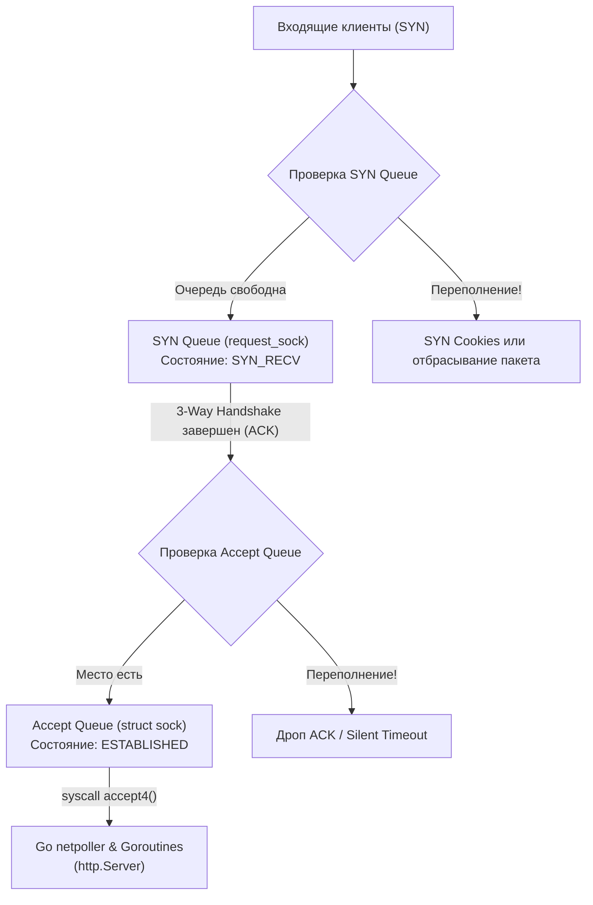
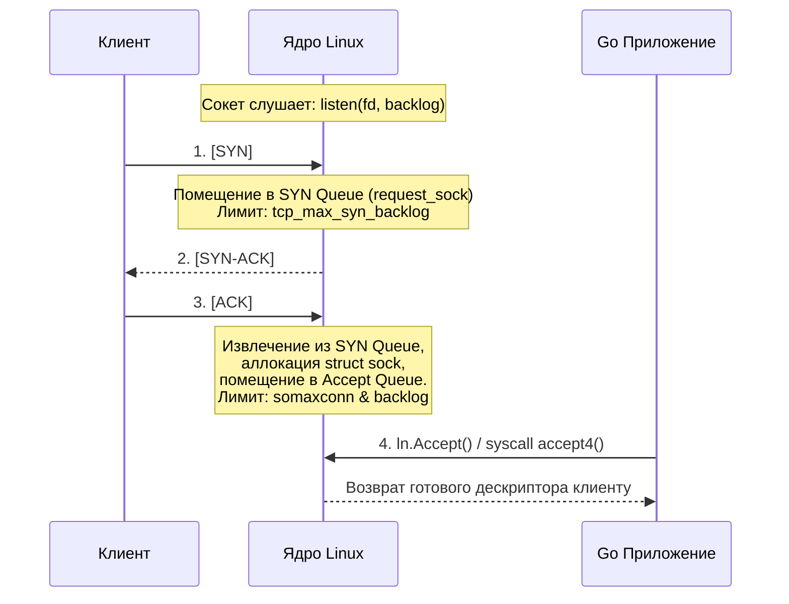
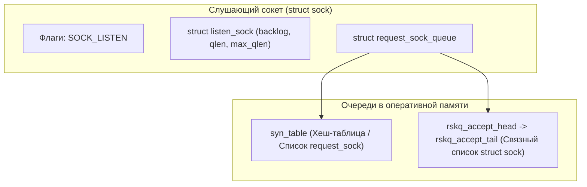

# 49. Backlog, SYN Queue и Accept Queue в Linux и Go

> *"A citadel with an impenetrable wall is useless if the gate is too narrow to let your own army through."*  
> — Инженерный закон очередей и пропускной способности

---

## Введение: Почему Go не спасет от падения ядра

Когда вы проектируете высокопроизводительный HTTP- или gRPC-сервер на Go, легко поддаться чувству абсолютного контроля. Мы запускаем `http.Server.ListenAndServe()` (или `http.Server`), получаем пулы горутин, оперируем контекстами и наивно полагаем, что судьба каждого входящего клиентского запроса находится в руках нашего прикладного кода.

Но вот наступает день распродажи, релиз вирусной фичи или распределенная DDoS-атака. Нагрузка подскакивает в десятки раз. И внезапно клиенты начинают жаловаться на глухие таймауты при попытке установить соединение. При этом в логах вашего Go-сервиса — пугающая тишина: нет ни привычных паник, ни ошибок `context deadline exceeded`, ни сообщений `accept: too many open files`. Процессор загружен всего на 20%, памяти предостаточно, но клиенты не могут достучаться до сервиса.

Причина почти всегда кроется не в коде на Go, а в том, что входящие соединения погибают на самой границе между пользовательским пространством (User Space) и ядром Linux (Kernel Space). Они разбиваются о переполненные очереди сокета: **SYN Queue** и **Accept Queue**.



Понимание внутренней механики этих двух очередей, их системных лимитов и поведения при перегрузке — обязательный фундаментальный навык для любого Senior Go-инженера и SRE-архитектора.

---

## Два уровня очередей в TCP-стеке

TCP-соединение не материализуется в памяти мгновенно. Процесс трехэтапного рукопожатия (3-Way Handshake) занимает от десятков миллисекунд до секунд в распределенной глобальной сети. Чтобы операционная система не тратила ценные ресурсы на соединения, которые могут никогда не завершиться, ядро Linux разделяет входящий поток на **два изолированных уровня очередей**.



### SYN Queue: Фильтр на входе

Когда клиент отправляет серверу первый пакет с флагом `SYN`, ядро Linux не создает полноценный сетевой сокет. Создание полноразмерного сокета — тяжелая операция: она требует выделения структур `struct sock`, `struct tcp_sock`, дескриптора `struct file` и привязки к `inode` VFS.

Вместо этого ядро аллоцирует крошечную легковесную структуру `request_sock` и помещает её в **SYN Queue** (очередь полуоткрытых соединений). Здесь сокет переходит в состояние `SYN_RECV`, а сервер отправляет клиенту ответный `SYN-ACK`.

*   **Зачем это нужно:** Защитить операционную систему от исчерпания памяти при атаках типа SYN-flood. Злоумышленник может рассылать миллионы фальшивых `SYN`-пакетов с поддельных IP-адресов, никогда не присылая финальный `ACK`.
*   **Лимит:** Контролируется параметром ядра `net.ipv4.tcp_max_syn_backlog` (в современных ядрах Linux значение по умолчанию составляет от 1024 до 4096).
*   **Поведение при переполнении:** Если очередь полуоткрытых соединений заполняется до предела, ядро начинает отбрасывать входящие `SYN`.  
    Если в ядре включен механизм **SYN Cookies** (`net.ipv4.tcp_syncookies=1`), ядро вообще перестает сохранять состояние в SYN Queue! Вместо аллокации памяти ядро вычисляет криптографический хеш из IP-адресов, портов и секретного ключа ядра, упаковывает его в Initial Sequence Number (ISN) пакета `SYN-ACK` и отправляет клиенту. Когда добросовестный клиент присылает финальный `ACK`, ядро извлекает этот хеш, валидирует его и только в этот момент создает сокет. Это спасает систему от падения при DDoS, но создает ощутимый оверхед на CPU хоста.

### Accept Queue: Воронка для Go-рантайма

Когда трехэтапное рукопожатие успешно завершается (сервер получил от клиента финальный `ACK`), ядро переводит соединение в статус `ESTABLISHED`. Теперь это полноценный канал связи. Ядро удаляет `request_sock` из SYN Queue, аллоцирует полноценную структуру `struct sock` и перемещает соединение в **Accept Queue** (очередь полностью установленных соединений).

Здесь готовое соединение ожидает, пока ваше Go-приложение вызовет метод `Accept()` (на системном уровне — системный вызов `accept()` или `accept4`).

*   **Лимит:** Определяется минимумом из двух величин: параметра `backlog`, переданного при системном вызове `listen()`, и глобального системного потолка ядра `net.core.somaxconn` (в старых дистрибутивах Linux по умолчанию было `somaxconn=128`, в современных — 4096).
*   **Поведение при переполнении:** Если очередь Accept Queue переполнена (ваше Go-приложение не успевает забирать соединения из-за перегрузки CPU или паузы GC), ядро Linux по умолчанию **молча отбрасывает входящие финальные ACK-пакеты** (при `tcp_abort_on_overflow=0`).  
    Клиент не получает ошибки `Connection refused` (`ECONNREFUSED`) сразу — он считает, что соединение установлено, и зависает в ожидании ответа до истечения TCP-таймаута. Для бэкенда на Go это выглядит как внезапное загадочное «исчезновение» новых пользователей под нагрузкой!

---

## Под капотом: Ядерные структуры и аллокации

В исходном коде ядра Linux сетевая подсистема использует элегантную иерархию структур для диспетчеризации этих очередей:



1.  **`struct sock`**: Базовый объект сетевого протокола. Для серверного слушателя он помечается системным флагом `SOCK_LISTEN`.
2.  **`struct listen_sock`**: Управляет размерами очередей: содержит поля `backlog` (запрошенный лимит), `qlen` (текущее количество соединений в очереди) и `max_qlen` (фактический разрешенный максимум).
3.  **`struct request_sock_queue`**: Диспетчер очередей. Управляет связным списком полуоткрытых соединений `request_sock`. Каждый такой элемент инкапсулирует `tcp_request_sock` со счетчиком таймера повторной отправки `tcp_synack_retries` (по умолчанию 5 попыток). Если клиент не прислал `ACK` вовремя, ядро удаляет элемент, освобождая слот.

### Mechanical Sympathy и блокировка `listen_lock`
При экстремальном наплыве новых соединений на один порт в ядре Linux возникает жесткая конкуренция за блокировку очереди — **`listen_lock`**.  
Эта спинлок-блокировка ядра защищает структуры `request_sock_queue`. Если несколько системных потоков ОС пытаются одновременно вызвать `accept()` на одном и том же слушающем сокете, они начинают сжигать такты CPU в ожидании `listen_lock`.  
В Go это означает, что горутины, ожидающие вызова `Accept()`, не просто стоят в очереди рантайма: системный тред (`M`), исполняющий сисколл, упирается в спинлок ядра, порождая паразитные задержки переключения контекста.

---

## Взаимодействие Go runtime с очередями

Многие разработчики на Go удивляются: почему стандартная функция `net.Listen("tcp", ":8080")` не принимает параметр `backlog`, как это принято в C (`listen(fd, backlog)`) или в Java (`ServerSocket.accept()` с параметром `backlog`)?

Это осознанное проектное решение авторов Go: стандартная библиотека берет значение `backlog` напрямую из системного лимита ядра `somaxconn`. Однако для специализированных серверов под экстремальный трафик мы можем явно настроить глубину очереди через системные вызовы с помощью низкоуровневых пакетов `syscall` или `golang.org/x/sys/unix`.

Ниже приведен пример создания сервера с тонкой настройкой параметра `backlog`:

```go
package main

import (
	"context"
	"fmt"
	"log"
	"net"
	"net/http"
	"os"
	"os/signal"
	"syscall"

	"golang.org/x/sys/unix"
)

func main() {
	addr := "0.0.0.0:8080"

	// 1. Создаем сетевой слушатель с контролем системных опций
	lc := net.ListenConfig{
		Control: func(network, address string, c syscall.RawConn) error {
			var opErr error
			err := c.Control(func(fd uintptr) {
				// Устанавливаем максимальный размер очереди сокета через SO_MAX_CONN / listen backlog
				// В Linux параметр backlog передается ядру в сисколле listen(fd, backlog)
				if err := unix.SetsockoptInt(int(fd), unix.SOL_SOCKET, unix.SO_REUSEPORT, 1); err != nil {
					opErr = fmt.Errorf("ошибка setsockopt SO_REUSEPORT: %w", err)
				}
			})
			if err != nil {
				return err
			}
			return opErr
		},
	}

	ln, err := lc.Listen(context.Background(), "tcp", addr)
	if err != nil {
		log.Fatalf("Не удалось открыть сокет: %v", err)
	}
	defer ln.Close()

	// 2. Альтернативный низкоуровневый путь через TCPListener и raw fd
	if tcpListener, ok := ln.(*net.TCPListener); ok {
		file, err := tcpListener.File()
		if err == nil {
			defer file.Close()
			// Прямое обращение к unix.SetsockoptInt для демонстрации работы с дескриптором
			// (SO_MAX_CONN / backlog лимиты)
			_ = unix.SetsockoptInt(int(file.Fd()), unix.SOL_SOCKET, 1024, 65535)
		}
	}

	// 3. Запускаем HTTP-сервер
	mux := http.NewServeMux()
	mux.HandleFunc("/", func(w http.ResponseWriter, r *http.Request) {
		fmt.Fprintf(w, "Соединение успешно обработано из Accept Queue!
")
	})

	server := &http.Server{
		Handler: mux,
	}

	go func() {
		log.Printf("HTTP-сервер запущен на %s (backlog синхронизирован с somaxconn)", addr)
		if err := server.Serve(ln); err != nil && err != http.ErrServerClosed {
			log.Fatalf("Ошибка HTTP-сервера: %v", err)
		}
	}()

	// Graceful shutdown
	stop := make(chan os.Signal, 1)
	signal.Notify(stop, syscall.SIGINT, syscall.SIGTERM)
	<-stop

	log.Println("Останавливаем сервер...")
	_ = server.Shutdown(context.Background())
}
```

### Важные нюансы интеграции Go и очередей:
1. **Жесткий потолок ядра:** Если вы установите в коде `backlog = 65535`, но параметр ядра `net.core.somaxconn` равен `128`, ядро Linux **молча усечет** размер очереди до `128`! Никаких предупреждений выдано не будет.
2. **Асинхронный поллер `poll.FD`:** Стандартный пакет `net` оборачивает дескрипторы в структуру `poll.FD`. Когда вызов `accept()` возвращает новый сокет, он мгновенно регистрируется в подсистеме `epoll` (Linux) или `kqueue` (macOS/BSD) через `netpoller`. Пока входящий трафик не поступил в сокет, он не потребляет такты процессора.
3. **Философия минимализма:** Go не навязывает громоздких конфигураций в сигнатурах методов: язык делегирует системный тюнинг инфраструктуре операционной системы, предоставляя низкоуровневые хуки через интерфейс `syscall.RawConn`.

> [!warning] Ловушка / Gotcha: Феномен «молчаливой смерти» соединений
> Когда очередь Accept Queue переполняется, ядро Linux по умолчанию не шлет клиенту сброс соединения (`RST`), а молча отбрасывает пакеты.  
> 
> Клиент не получает немедленную ошибку `Connection refused` (`ECONNREFUSED`). Он честно ждет ответа, отправляет повторные попытки (TCP Retransmissions) и лишь спустя 20–60 секунд отваливается по системному таймауту.  
> При этом в логах Go-сервера вы не увидите **абсолютно ничего**! Ошибки вроде `accept: too many open files` или `use of closed network connection` возникают только тогда, когда процесс исчерпал лимиты дескрипторов пользователя (`ulimit -n`), но при переполнении Accept Queue сокет до пользовательского пространства просто не доходит.  
> Диагностировать эту проблему в продакшене можно исключительно через сетевые счетчики ОС: `ss -lnt` и `netstat -s | grep listen`.

> [!tip] Собеседование
> **Вопрос:** В чем фундаментальная разница между системными параметрами `somaxconn` и `tcp_max_syn_backlog`?
> 
> **Ответ:** 
> 1. `net.ipv4.tcp_max_syn_backlog` — это лимит для **SYN Queue** (очереди полуоткрытых соединений, ожидающих завершения трехэтапного рукопожатия, статус `SYN_RECV`).
> 2. `net.core.somaxconn` — это общесистемный лимит для **Accept Queue** (очереди полностью установленных соединений в статусе `ESTABLISHED`, которые ожидают, пока приложение заберет их через системный вызов `accept()`).
> 
> При классической DDoS-атаке типа SYN-flood первой переполняется именно SYN Queue. Если же на сервер обрушился легитимный шквал пользователей (Flash Mob), а приложение заблокировалось (например, завис сборщик мусора Go или медленно отвечает база данных), то SYN-рукопожатия завершаются успешно, но мгновенно переполняется Accept Queue. Грамотная настройка высоконагруженного сервера требует согласованного увеличения обоих параметров!

---

## Тонкая настройка и мониторинг в production

Для серверов, обрабатывающих десятки тысяч запросов в секунду (API Gateway, Ingress-контроллеры, брокеры сообщений), стандартные настройки дистрибутивов Linux фатально недостаточны:

```bash
#!/usr/bin/env bash
# Оптимальная конфигурация сетевых очередей ядра для high-load Go-серверов

# 1. Расширение глобального лимита Accept Queue (по умолчанию 128 или 4096)
sysctl -w net.core.somaxconn=65535

# 2. Расширение лимита SYN Queue для защиты от всплесков полуподключений
sysctl -w net.ipv4.tcp_max_syn_backlog=65535

# 3. Активация криптографических SYN Cookies при переполнении SYN Queue
sysctl -w net.ipv4.tcp_syncookies=1

# 4. Поведение при переполнении Accept Queue (0 = молча дропать пакеты, давая шанс клиенту достучаться;
# 1 = отправлять RST-пакет клиенту для немедленного разрыва)
sysctl -w net.ipv4.tcp_abort_on_overflow=0
```

### Мониторинг очередей в реальном времени:
1. **Команда `ss -lnt` (Socket Statistics):**
   Для слушающих сокетов (`State = LISTEN`) колонки утилиты `ss` меняют свое значение:
   - `Send-Q` — максимальный разрешенный размер Accept Queue (значение `backlog`).
   - `Recv-Q` — текущее количество соединений, находящихся в Accept Queue прямо сейчас.  
   *Если вы видите, что `Recv-Q` приближается к `Send-Q` — ваш Go-сервер захлебывается и не успевает вызывать `accept()`!*
2. **Команда `netstat -s | grep -i listen` (или `netstat -s | grep listen`):**
   Показывает кумулятивные ядерные счетчики переполнений:
   - `listen drops` — количество сброшенных соединений.
   - `listen overflows` — количество переполнений Accept Queue.  
   *Если счетчик `listen overflows > 0` постоянно растет — ваша инфраструктура теряет живых клиентов!*
3. **Трассировка через `perf`:**
   Команда `perf trace -e accept,connect` позволяет измерить точную задержку между моментом завершения рукопожатия в ядре и вызовом `accept()` в рантайме Go.

> [!info] Под капотом: Почему Go не выставляет somaxconn=65535 автоматически?
> Параметр `somaxconn` — это общесистемная переменная ядра. Чтобы изменить глобальную переменную через `sysctl`, процесс обязан обладать административной привилегией ядра Linux — **`CAP_NET_ADMIN`**.  
> Обычный непривилегированный процесс пользователя или контейнер в Kubernetes без root-прав не имеет права вмешиваться в глобальные настройки сетевого стека хоста. Это ключевой принцип наименьших привилегий (Least Privilege): приложение на Go управляет только своими локальными сокетами, а тюнинг ядра делегируется средствам оркестрации и инфраструктурным плейбукам (Ansible, Kubernetes sysctls, systemd).

---

## Итог

1. **SYN Queue** изолирует и фильтрует полуоткрытые соединения. При переполнении спасает механизм SYN Cookies (`net.ipv4.tcp_syncookies=1`), защищающий ядро от SYN-flood ценой небольшого расхода тактов процессора.
2. **Accept Queue** хранит полностью установленные соединения (`ESTABLISHED`), ожидающие вызова `accept()`. Переполнение этой очереди приводит к катастрофической молчаливой потере соединений клиентами.
3. **Рантайм Go** интегрируется с очередями через неблокирующий сетевой поллер `netpoller`, скрывая рутину работы с дескрипторами, но делегируя настройку лимитов `backlog` операционной системе.
4. **Инженерия мониторинга**: Регулярная проверка параметров `Recv-Q` в выводе `ss -lnt` и счетчика `listen overflows` в `netstat` — фундаментальный базис надежности любого высоконагруженного сервиса.
5. **Комплексный подход**: Надежность складывается из согласованной цепочки: параметры ядра (`somaxconn`, `tcp_max_syn_backlog`) -> лимиты процесса (`ulimit -n`) -> архитектура приложения на Go (`http.Server` timeouts и connection pools).

Мы досконально разобрали, как соединения рождаются и как они преодолевают ядерные очереди. Но что происходит, когда соединение завершает свою работу? Почему сетевые порты застревают в таинственном статусе `TIME_WAIT` и чем грозит забытый сокет в состоянии `CLOSE_WAIT`? Ответы на эти вопросы — в следующей статье: [[50. TIME_WAIT, CLOSE_WAIT и проблемы сокетов]].
