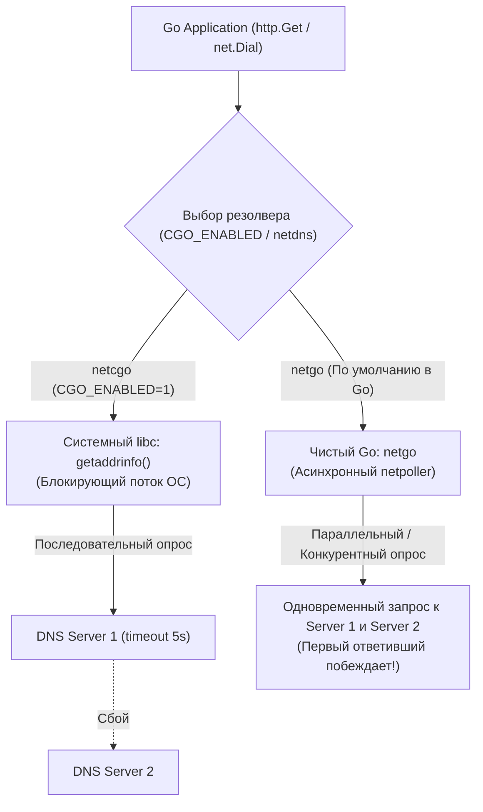
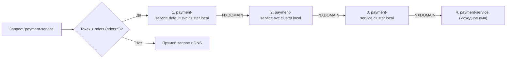
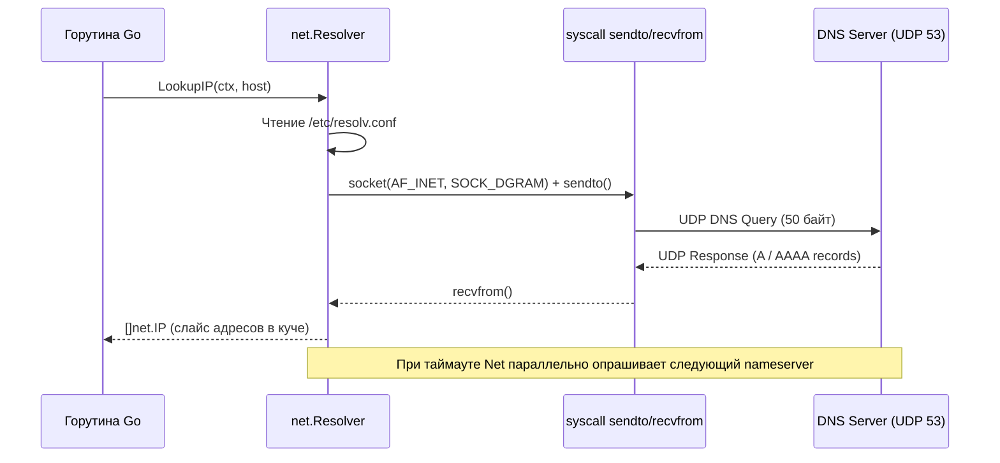

# 51. DNS глазами ОС и libc: netgo, cgo и под капотом резолвера

> *"It's not DNS. There's no way it's DNS. It was DNS."*  
> — Старинная пословица системных администраторов и SRE-инженеров

---

## Введение

В кругах бэкенд-разработчиков и системных администраторов ходит полушутливое, но выстраданное кровью правило: если в распределенной системе происходит странный, трудноуловимый сбой — проверьте DNS. 

Для большинства прикладных программистов разрешение доменных имен (Domain Name System) представляется чем-то элементарным: «превращение строчки `api.example.com` в IP-адрес `93.184.216.34`». Мы пишем `http.Get("https://api.example.com")` и не задумываемся, что DNS — это самый первый, самый незаметный и зачастую самый узкий сетевой этап в жизненном цикле любого запроса.

Задержки DNS, промахи мимо кэша, последовательные тайм-ауты в libc и неочевидные правила подстановки поисковых доменов способны превратить 2-миллисекундный микросервисный вызов в пятисекундную катастрофу (tail-latency).

В классических стеках (C, C++, Java, Python, PHP) разрешение доменов традиционно делегируется библиотеке Си — libc (через функции `getaddrinfo`, `gethostbyname`). Создатели Go пошли на смелый и революционный шаг: они спроектировали собственный автономный резолвер на чистом Go (**`netgo`**), независимый от системных библиотек.

В этой статье мы разберем, как операционная система и рантайм Go на самом деле резолвят доменные имена, где прячутся блокирующие системные вызовы, и как правильно настраивать резолвер для высоконагруженного production.



---

## Архитектура DNS-разрешения в ОС

В операционных системах семейства Linux разрешение символических имен не происходит по волшебству. Это детерминированный конвейер, управляемый конфигурационным файлом `/etc/resolv.conf` и подсистемой переключения служб имен **NSS (Name Service Switch)** через файл `/etc/nsswitch.conf`.

Конфигурационный файл `/etc/resolv.conf` служит единой точкой правды для DNS-клиентов в стандарте POSIX:

| Директива | Назначение параметра | Влияние на производительность и задержки |
|---|---|---|
| `nameserver` | IP-адреса вышестоящих DNS-серверов (стандартно максимум 3) | Определяет, куда направляются UDP-пакеты. Порядок критичен для libc, но параллелизуется в Go. |
| `search` | Список доменных суффиксов для автоматической подстановки | Умножает число запросов! Каждая горутина может выполнить до `len(search)` холостых DNS-запросов. |
| `ndots` | Порог количества точек в запрашиваемом имени (по умолчанию 1) | Если в имени меньше точек, чем `ndots`, к нему сначала принудительно дописываются домены из `search`. |
| `timeout` / `attempts` | Таймаут ожидания ответа и лимит повторных попыток на сервер | Определяет, сколько секунд горутина проведет в блокировке при недоступности DNS. |



> [!info] Под капотом: Кэширование resolv.conf в libc vs рантайм Go
> В стандартной библиотеке Си (glibc) функция `getaddrinfo` считывает содержимое файла `/etc/resolv.conf` ровно **один раз** при первом вызове и кэширует разобранную конфигурацию в статической структуре ядра библиотеки — `struct res_state`.  
> Если файл изменился на лету (например, DHCP обновил шлюз или агент Docker перенастроил сеть контейнера), работающий процесс glibc никогда не узнает об этих изменениях без перезапуска (или ручного вызова `res_init()`).  
> В современных Linux-системах эту проблему маскируют локальными кэширующими демонами (`systemd-resolved`, `dnsmasq`).  
> 
> Рантайм Go со своим резолвером `netgo` парсит `/etc/resolv.conf` самостоятельно. Исторически Go кэшировал конфигурацию, но в современных версиях периодически перепроверяет mtime файла, обеспечивая предсказуемость в контейнерах.

---

## libc и `getaddrinfo`: Классический подход

Когда программа на C/C++, Java или Python выполняет сетевое подключение, она обращается к библиотечной функции libc: `getaddrinfo()`.

### Конвейер выполнения `getaddrinfo()`:
1. Обращается к файлу `/etc/hosts`. Если IP найден локально — поиск завершается без сетевых пакетов.
2. Проверяет настройки `nsswitch.conf` (модули files, dns, mdns4).
3. Парсит домены `search` и параметр `ndots`.
4. Формирует UDP-пакет запроса (стандартный порт 53) и отправляет его на первый адрес `nameserver`.
5. Если ответ DNS-сервера оказывается длиннее 512 байт, в заголовке выставляется флаг усечения **`TC` (Truncation flag = 1)**. В этом случае клиент обязан повторить запрос по протоколу TCP!
6. Аллоцирует связанный список структур `struct addrinfo` (содержащих адреса IPv4 и IPv6) и возвращает результат в память процесса.

**Системные вызовы ядра:**  
Для UDP-запроса libc выполняет сисколлы: `socket(AF_INET, SOCK_DGRAM, IPPROTO_UDP)`, `sendto()`, `recvfrom()`, `close()`.  
Если требуется TCP (при `TC=1` или запросах зон): `socket(AF_INET, SOCK_STREAM, IPPROTO_TCP)`, `connect()`, `write()`, `read()`, `close()`.

> [!warning] Ловушка / Gotcha: Последовательный перебор glibc и каскадный обвал
> В реализации glibc сетевые адреса `nameserver` опрашиваются **строго последовательно**!  
> Если первый DNS-сервер из списка завис или стал недоступен, системный вызов `getaddrinfo` честно ждет ответа в течение таймаута `timeout` (по умолчанию в Linux — **5 секунд**!), прежде чем отправить запрос на второй `nameserver`.  
> В высоконагруженной системе это приводит к мгновенной остановке всех рабочих потоков: пулы тредов исчерпываются, входящие запросы выстраиваются в многотысячные очереди, и сервис терпит крах (эффект домино) при абсолютно здоровом втором DNS-сервере.

---

## Go-резолвер: `netgo`, `netcgo` и `net.Resolver`

Создатели Go стремились к созданию самодостаточных, статически скомпилированных бинарников без динамических связей с libc. Кроме того, блокирующий характер `getaddrinfo()` плохо вязался с легковесной моделью горутин и `netpoller`.

Это решало проблемы с утечками памяти в стандартном `net/http` и блокировками системных потоков при `CGO_ENABLED=1`. Так родился встроенный резолвер **`netgo`** — полноценный DNS-клиент, написанный целиком на Go.

---

### Режимы работы

Поведение рантайма Go контролируется тегами сборки и переменной окружения `GODEBUG=netdns=...`:

| Режим переменной `netdns` | Механика работы | Где и когда используется |
|---|---|---|
| `cgo` (или `netcgo`) | Принудительно делегирует разрешение функции libc `getaddrinfo` через CGO | Используется при сборке `CGO_ENABLED=1` на системах со специфичными модулями NSS (LDAP, Winbind) |
| `go` (или `netgo`, по умолчанию) | Автономный резолвер на чистом Go | Дефолт для всех современных сборок Go на `GOOS=linux`, `darwin`, `windows` |
| `experimentalgo` | Экспериментальный конкурентный резолвер с кэшированием | Прототипы и бенчмарки в свежих версиях компилятора Go |

---

### Как работает `netgo`

Встроенный резолвер `netgo` самостоятельно читает и парсит `/etc/resolv.conf`, но принципиально отличается от классического libc:

1. **Конкурентный параллельный опрос:** Если в конфигурации указано несколько `nameserver`, Go не ждет 5 секунд ответа от первого! Он запускает параллельные DNS-запросы ко всем указанным серверам (или производит быстрый round-robin опрос). Первый корректный ответ немедленно возвращается приложению. Это спасает Go-сервисы от зависаний при сбое одного из серверов инфраструктуры!
2. **Интеллектуальная обработка `ndots` и `search`:** Go точно следует спецификациям RFC, но оптимизирует очевидные случаи: например, Go никогда не станет подставлять суффиксы `search` к адресу `localhost` или литеральным IP-адресам.
3. **Отсутствие встроенного кэширования:** По умолчанию резолвер `netgo` **не кэширует** результаты DNS-запросов в оперативной памяти процесса! Каждый вызов `net.Dial` или `net.LookupIP` производит реальный сетевой обмен по UDP, если в системе не установлен локальный кэширующий DNS-демон.

Ниже приведен практический пример создания изолированного DNS-резолвера в Go с защитой от сбоев системного `/etc/resolv.conf`:

```go
package main

import (
	"context"
	"fmt"
	"log"
	"net"
	"time"
)

func main() {
	// 1. Создаем кастомный net.Resolver, гарантированно работающий на чистом Go (PreferGo: true)
	resolver := &net.Resolver{
		PreferGo: true, // Игнорировать libc getaddrinfo, использовать чистый netgo
		Dial: func(ctx context.Context, network, address string) (net.Conn, error) {
			d := net.Dialer{
				Timeout: 2 * time.Second, // Жесткий тайм-аут на DNS-запрос
			}
			// Направляем запросы на выделенный корпоративный или публичный DNS-сервер
			// в обход потенциально проблемного локального /etc/resolv.conf
			return d.DialContext(ctx, "udp", "1.1.1.1:53")
		},
	}

	// 2. Ограничиваем общее время операции контекстом
	ctx, cancel := context.WithTimeout(context.Background(), 3*time.Second)
	defer cancel()

	// 3. Выполняем поиск только IPv4-адресов (ip4)
	addrs, err := resolver.LookupIP(ctx, "ip4", "example.com")
	if err != nil {
		log.Fatalf("Ошибка DNS-разрешения: %v", err)
	}

	fmt.Println("Успешно получены IP-адреса через netgo:")
	for _, ip := range addrs {
		fmt.Printf(" -> %s
", ip.String())
	}
}
```

> [!tip] Собеседование: musl libc в Alpine Linux против glibc в Debian
> **Вопрос:** Почему скомпилированное Go-приложение при развертывании в минималистичном контейнере на базе Alpine Linux иногда падает с ошибками DNS-резолвинга, в то время как в Debian или Ubuntu работает безупречно?
> 
> **Ответ:** 
> 1. **Особенности musl libc:** Alpine Linux базируется на библиотеке `musl`, реализация резолвера в которой исторически имеет серьезные ограничения: `musl` не поддерживает многие расширенные опции `ndots`, требует строго определенного порядка строк в `/etc/resolv.conf` и по-другому обрабатывает ошибки переполнения UDP.
> 2. **Проблема dynamic linking:** Если Go-бинарник был собран с флагом `CGO_ENABLED=1`, рантайм использует резолвер `netcgo` и вызывает системную функцию `getaddrinfo()` из библиотеки `musl`, натыкаясь на все ее баги.
> 3. **Решение проблемы:** Собирать бинарники со статической линковкой и полным отключением CGO:  
>    `CGO_ENABLED=0 GOOS=linux go build -o app .`  
>    В этом режиме Go использует собственный резолвер `netgo`, который парсит `/etc/resolv.conf` строго и устойчив к специфике локальных дистрибутивов.

---

## Mechanical Sympathy: Сеть, кэш и блокировки

Разрешение DNS с точки зрения системного программирования и ресурсов процессора:

1. **UDP-дейтаграмма (DNS Query):** Размер стандартного запроса составляет всего 50–70 байт. Пакет уходит через сисколл `sendto()`, проходит через подсистему маршрутизации ядра `ip_output()` и летит в сетевую карту. Ответ вычитывается через `recvfrom()`. В Go под капотом создается сокет `net.UDPConn`, а данные читаются методом `ReadFromUDP()`.
2. **Локальный сокет против сети и аппаратные прерывания:** При первом запросе к новому DNS-серверу в ядре может происходить `Page Fault` для подгрузки таблиц маршрутизации и структур сокета. Если в Linux настроен Если в Linux настроен `systemd-resolved` или `dnsmasq`, файл `/etc/resolv.conf` указывает на адрес `127.0.0.53:53` или Unix Domain Socket (`/run/systemd/resolve/resolv.conf`). Это позволяет ядру обработать DNS-запрос локально в оперативной памяти через кольцевой буфер без отправки радиосигналов и фотонов в физическую сеть, предотвращая лишние переключения контекста и аппаратные прерывания.
3. **Блокировки горутин и планировщик:** Базовый вызов `net.Dial("tcp", "host:port")` синхронно паркует горутину до тех пор, пока DNS-резолвер не вернет IP-адрес. В сетевом поллере Go `netgo` не блокирует системный тред ОС (`M`), поскольку дескриптор UDP регистрируется в `epoll`. Однако на прикладном уровне горутина простаивает. Для высоконагруженных микросервисов критически важно использовать `net.Resolver` с жестким `context` тайм-аутом (`DialContext`).
4. **Аллокации памяти и давление на GC:** Каждый вызов `LookupIP` или `LookupHost` аллоцирует в куче срезы `[]net.IP` и `[]string`. Если сервис делает миллион HTTP-запросов к одним и тем же хостам в секунду, это создает гигантскую нагрузку на сборщик мусора Go. В таких архитектурах обязательно внедряют пул буферов `sync.Pool` или локальный LRU-кэш адресов (например, библиотеку `hashicorp/golang-lru`).



> [!warning] Ловушка / Gotcha: Катастрофа ndots:5 в Kubernetes
> Классическая ловушка для Go-микросервисов в облачной инфраструктуре Kubernetes — опция **`ndots:5`** в файле `/etc/resolv.conf` пода.  
> 
> По умолчанию Kubernetes выставляет `options ndots:5`. Это означает: если доменное имя содержит **меньше 5 точек**, резолвер обязан сначала принудительно дописать к нему локальные суффиксы поиска:
> 1. `my-svc.default.svc.cluster.local`
> 2. `my-svc.svc.cluster.local`
> 3. `my-svc.cluster.local`
> 
> Если ваше Go-приложение обращается к внешнему адресу вроде `api.stripe.com` (2 точки), резолвер выполнит **3 холостых сетевых запроса** к CoreDNS, получит три ответа `NXDOMAIN`, и лишь на 4-й попытке сделает запрос к реальному домену!  
> Нагрузка на CoreDNS возрастает в 4 раза, а latency каждого сетевого соединения вырастает на десятки миллисекунд.  
> **Решение:** Добавляйте точку в конец внешних доменов (`api.stripe.com.` — Fully Qualified Domain Name, FQDN) либо понижайте `ndots` в манифесте пода до 1–2.

---

## Итоги

1. **OS vs Go**: Классический libc (`getaddrinfo`) опрашивает серверы последовательно (с 5-секундным ожиданием при сбое), кэширует конфигурацию и блокирует системные потоки. Встроенный резолвер Go (**`netgo`**) опрашивает серверы параллельно, интегрируется с `netpoller` и не зависит от динамических библиотек.
2. **Системный конвейер**: DNS-резолвинг на уровне ядра — это быстрый обмен легковесными UDP-дейтаграммами через `socket`, `sendto`, `recvfrom`. В случае переполнения буфера (флаг `TC`) ядро прозрачно переключается на TCP.
3. **musl против glibc**: Для контейнеризованных Go-приложений золотым правилом остается компиляция с флагом `CGO_ENABLED=0`, исключающая несовместимости с libc хоста.
4. **Механическое сочувствие и оптимизации**: Избегайте аллокаций `[]net.IP` на каждый чих, внедряйте кэширование на базе `hashicorp/golang-lru`, контролируйте параметр `ndots` в Kubernetes и всегда ограничивайте DNS-запросы дедлайнами контекста `context.WithTimeout`.

Мы досконально разобрали, как символические имена превращаются в IP-адреса на уровне операционной системы и рантайма Go. Но как операционная система защищает себя от перегрузки ресурсами, утечек памяти и неконтролируемого открытия сокетов? В следующей статье: [[52. Ограничения ОС. ulimit, cgroups, quotas.md]], где мы исследуем механизмы квот, лимитов `ulimit` и контрольных групп `cgroups v2`, управляющих жизнью Go-сервисов в контейнерах.
