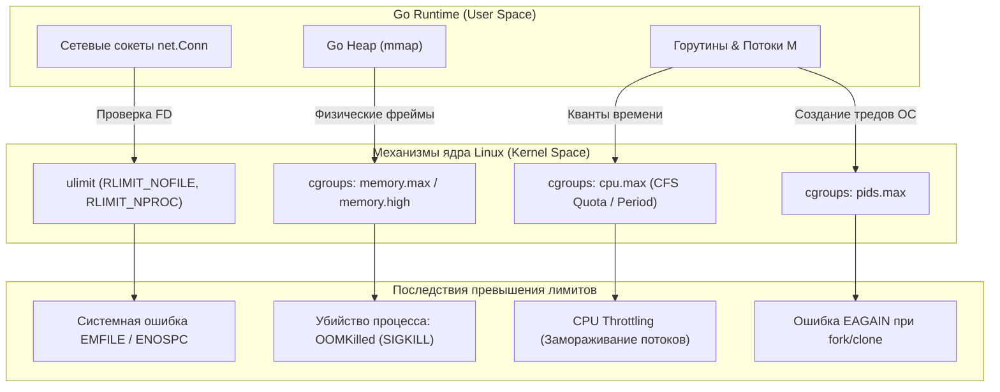
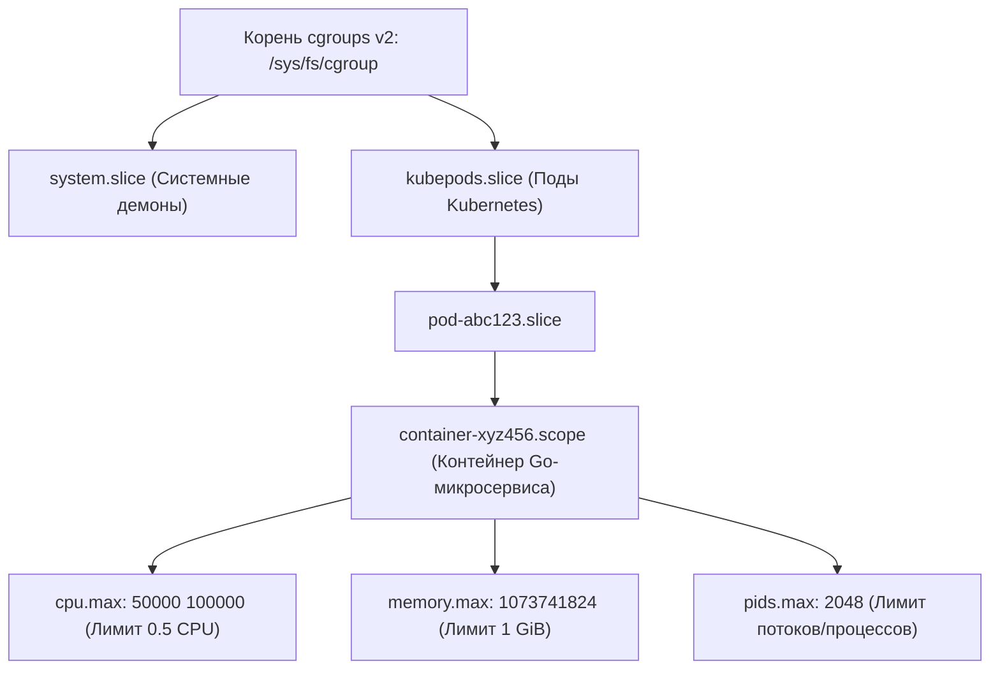

# 52. Ограничения ОС: ulimit, cgroups v2 и дисковые квоты

> *«Свобода внутри программ иллюзорна: процесс свободен ровно настолько, насколько ему позволяют лимиты ресурсов ядра».*    
> — Инженерный закон изоляции и безопасности

---

## Введение: Почему ограничения — это не только про DevOps

В инженерной среде долгое время жил опасный миф: системные лимиты, параметры ядра и изоляция — это исключительно забота коллег из DevOps и SRE. «Наша задача — писать чистый код на Go, а лимиты в Kubernetes настроит инфраструктура».

Однако в операционной системе Linux ваше Go-приложение не живет в бесконечном, идеальном пространстве. Планировщик горутин, сетевой поллер `netpoller`, сборщик мусора (GC) и распределитель кучи непрерывно соприкасаются с невидимыми границами, возведенными ядром. 

Игнорирование системных ограничений оборачивается внезапными катастрофами в production:
- Сетевые сервисы внезапно выкидывают ошибку `EMFILE` («too many open files») посреди промо-акции.
- Контейнеры в Kubernetes таинственно исчезают с кладбищенской меткой `OOMKilled` (Exit Code 137), хотя профилирование в `pprof` не показывает критических утечек памяти.
- Приложение испытывает микрозадержки (latency spikes) из-за незаметного троттлинга CPU (CPU Throttling) на уровне ядра.

Понимание того, где заканчиваются иллюзии пользовательского пространства (User Space) и начинается суровый диктат ядра Linux, позволяет бэкенд-разработчику проектировать по-настоящему надежные сервисы.



---

## Традиционные ограничения: ulimit и limits.conf

Исторически в Unix-системах для предотвращения атак типа «отказ в обслуживании» (fork-бомбы, утечки дескрипторов, бесконечный рост файлов) использовался механизм **Resource Limits** (POSIX rlimits). Эти ограничения зашиты в ядро и проверяются при каждом релевантном системном вызове.

Все лимиты делятся на два уровня:
1. **`soft` (Мягкий лимит):** Текущее действующее ограничение для процесса. Любой непривилегированный процесс может самостоятельно изменять свой soft-лимит, но не может поднять его выше hard-лимита.
2. **`hard` (Жесткий лимит):** Потолок, выше которого soft-лимит не может быть поднят. Увеличить значение hard-лимита имеет право исключительно суперпользователь (`root`).

### Ключевые лимиты для Go-бэкенда:
- **`RLIMIT_NOFILE` (или `nofile`):** Максимальное количество открытых файловых дескрипторов (FD) на процесс. В Go сетевой поллер `netpoller`, каждый входящий сокет `net.Conn`, исходящие пулы к базам данных, лог-файлы и таймеры потребляют файловые дескрипторы. Если лимит исчерпан, сервер больше не может принимать новые TCP-рукопожатия.
- **`RLIMIT_NPROC`:** Максимальное количество процессов и потоков операционной системы, которые разрешено породить данному пользователю (UID).
- **`RLIMIT_AS` (или `maxrss`):** Ограничение на максимальный размер виртуального адресного пространства (Address Space) или физической памяти.
- **`RLIMIT_CPU` и `RLIMIT_FSIZE`:** Максимальное время процессора в секундах и максимальный размер создаваемого файла на диске.

Проверить текущие действующие лимиты в Linux-системе можно из терминала:
```bash
# Посмотреть все лимиты текущей оболочки
ulimit -a

# Посмотреть лимиты конкретного процесса по его PID
cat /proc/$$/limits
cat /proc/<pid>/limits
```

> [!info] Под капотом: Таблица дескрипторов в task_struct ядра
> В ядре Linux каждый процесс и поток описывается структурой `task_struct`. Внутри нее хранится массив лимитов ресурсов: `struct rlimit rlim[RLIM_NLIMITS]`.  
> 
> Когда Go-приложение совершает системные вызовы `open()`, `dup()`, `accept()` или `pipe()`, ядро проверяет текущее число дескрипторов в таблице процесса против значения `rlim[RLIMIT_NOFILE].rlim_cur`.  
> Если счетчик дескрипторов достигает лимита, системный вызов немедленно возвращает ошибку `-1` с кодом ошибки ядра **`EMFILE`** («Too many open files» — слишком много открытых файлов в данном процессе). Если же переполнилась общесистемная таблица открытых файлов ОС, возвращается системная ошибка `ENFILE` или `ENOSPC` (когда закончились индексные дескрипторы inode на диске).

### Где и как настраиваются лимиты `ulimit`:
1. В текущей командной оболочке: `ulimit -n 65535`.
2. На уровне входа пользователей через PAM: конфигурационный файл `/etc/security/limits.conf`.
3. Для системных демонов под управлением systemd: директива `LimitNOFILE` в секции `[Service]` unit-файла (поскольку `systemd` по умолчанию игнорирует `/etc/security/limits.conf`!).

> [!warning] Ловушка / Gotcha: Границы применимости ulimit
> Помните: вызов `ulimit` действует строго в рамках текущей сессии командной оболочки и наследуется только её прямыми дочерними процессами!  
> Он **не оказывает никакого влияния** на демоны, запущенные через `systemd`, фоновые задания `cron` или контейнеры `docker run` (если вы явно не передали флаг `--ulimit nofile=65535:65535`). В современных облачных средах и микросервисах на базе Docker и Kubernetes механизм `ulimit` часто отходит на второй план, уступая место контрольным группам — **cgroups**.

---

## cgroups (control groups): Современный стандарт изоляции

Механизм `ulimit` обладал двумя непреодолимыми архитектурными изъянами:
1. Он не позволял агрегировать ресурсы для группы связанных процессов (например, веб-сервера и его форков).
2. Он не умел плавно дозировать вычислительные мощности процессора (CPU Quotas) и скорость ввода-вывода (I/O bandwidth).

Для решения этой задачи инженеры Google разработали и внедрили в ядро Linux подсистему **cgroups (Control Groups)**.

---

### cgroups v1 vs v2

Эволюция контрольных групп — это классическая история исправления архитектурных ошибок:

- **cgroups v1 (Устаревшая):** Имела раздельные, нескоординированные иерархии для каждого контроллера. Каталог `/sys/fs/cgroup/cpu` жил своей жизнью, `/sys/fs/cgroup/memory` — своей, а подсистемы `pids` и `blkio` не знали друг о друге. Это приводило к конфликтам, взаимным блокировкам и невозможности корректно учитывать буферизированную память дискового кэша (Page Cache).
- **cgroups v2 (Единая унифицированная иерархия):** Все контроллеры ресурсов объединяются в строгое древовидное дерево под единой точкой монтирования `/sys/fs/cgroup`. Каждый процесс принадлежит ровно одной контрольной группе (leaf node). Все современные дистрибутивы Linux (c ядром 5.8+) и современные среды Kubernetes (v1.25+) используют **cgroups v2** как безальтернативный стандарт.



---

### Ключевые контроллеры для Go

1. **`cpu.max` (CFS Bandwidth Control):** Задает квоту и период планировщика CFS: `quota period` (например, строка `20000 100000` означает, что процессу выделяется 20 000 мкс процессора за период 100 000 мкс, то есть ровно 20% одного ядра CPU).  
   Если сервис сжигает квоту быстрее, ядро немедленно ставит все его потоки на паузу (**CPU Throttling**). Для Go это катастрофично: сборщик мусора GC Pacer задерживается, куча раздувается, сетевые сокеты перестают вычитываться, а latency улетает в космос!
2. **`memory.max` (Жесткий потолок оперативной памяти):** Лимит физической памяти. Если суммарное потребление памяти процессами cgroup превысит `memory.max`, ядро попытается сбросить Page Cache, а при неудаче вмешается механизм **OOM Killer** и мгновенно уничтожит процесс сигналом `SIGKILL`!
3. **`pids.max`:** Лимит на общее количество потоков и процессов. Хотя горутины в Go мультиплексируются в пространстве пользователя, вызовы `syscall`, запуск подпроцессов через `os/exec`, интеграция с `Cgo` или блокировки в `netpoller` требуют аллокации новых системных тредов ОС (`M`). При исчерпании лимита системный вызов `clone()` вернет ошибку ядра `EAGAIN`.

> [!tip] Собеседование: Почему рантайм Go не видит лимиты cgroups «из коробки»?
> **Вопрос:** Почему скомпилированный Go-бинарник, запущенный в контейнере Docker или Kubernetes с жестким ограничением памяти 512 МБ на машине с 64 ГБ RAM, может упасть по OOM Killer?
> 
> **Ответ:** 
> Исторически рантайм Go работает в пользовательском пространстве и определяет объем доступной памяти через системный вызов `sysinfo` или чтение `/proc/meminfo`, которые возвращают общий объем памяти **физического хоста** (все 64 ГБ!), абсолютно не подозревая об ограничениях контрольных групп `memory.max`.  
> В результате стандартный сборщик мусора Go ориентировался на гигантскую память хоста, запускал GC слишком поздно (когда куча уже перевалила за 1 ГБ), и ядро Linux безжалостно убивало контейнер через OOM Killer (`OOMKilled`).  
> 
> Начиная с Go 1.19, в язык внедрена переменная окружения **`GOMEMLIMIT`** (мягкий лимит памяти). Она заставляет GC Pacer следить за тем, чтобы суммарное потребление памяти рантаймом приближалось к целевой границе, агрессивно запуская циклы сборки мусора и возвращая свободные страницы ОС через `madvise(MADV_DONTNEED)`.

---

## Quotas (Квоты): Диск и пользователи

Механизм **Quotas** (дисковые квоты) обеспечивает ограничение использования пространства накопителей и количества индексных дескрипторов (inode) на уровне файловых систем (`ext4`, `xfs`).

Квоты управляются утилитами `quota`, `quotaon` и директивами монтирования в файле `/etc/fstab` (опции `usrquota`, `grpquota`). Они позволяют администраторам предотвратить ситуацию, когда один сервис заполняет весь диск логами или временными файлами, парализуя работу всей операционной системы.

Для Go-разработчика это критично, если сервис записывает локальные WAL-журналы, формирует дамп-файлы или кэширует медиаданные на локальный диск:
- При исчерпании лимита байтов системный вызов `write()` возвращает ошибку `ENOSPC` (No space left on device).
- При превышении квоты на конкретного пользователя/группу ядро возвращает специфическую ошибку **`EDQUOT`** (Disk quota exceeded).  
Go не имеет встроенных механизмов обхода дисковых квот: архитектура приложения обязана предусматривать ротацию логов, мониторинг свободного места и корректную обработку ошибок записи.

---

## Go Runtime и ограничения: Что происходит под капотом

В момент инициализации бинарника (до передачи управления функции `main`) рантайм Go производит системный аудит окружения:
- Через системный вызов `getrlimit` проверяется `RLIMIT_NOFILE`. Если лимит файлов оказывается критически низким (менее 1024), сетевой поллер `netpoller` рискует захлебнуться при первых же нагрузках.

---

### Взаимодействие с памятью и GC

Рантайм Go резервирует виртуальные адреса под кучу (Heap) через системный вызов `mmap`.

Если на контейнер наложен жесткий лимит `memory.max` в cgroups, а переменная `GOMEMLIMIT` не выставлена, поведение GC Pacer становится непредсказуемым:
1. Куча растет, виртуальная память процесса раздувается.
2. Когда размер кучи приближается к физическому лимиту cgroups, ядро активирует процедуру сброса страниц (Reclaim).
3. Если памяти не хватает, OOM Killer мгновенно присылает сигнал `SIGKILL`, уничтожая сервис с кодом завершения 137 (`OOMKilled`).

```yaml
# Идеальный манифест развертывания Go-микросервиса в Kubernetes
apiVersion: apps/v1
kind: Deployment
metadata:
  name: payment-service
spec:
  template:
    spec:
      containers:
      - name: app
        image: payment-service:v1.0.0
        env:
        # GOMEMLIMIT должен составлять 80-85% от hard-лимита памяти (memory.max)
        # Оставшиеся 15-20% резервируются под стек горутин, метаданные рантайма и Page Cache
        - name: GOMEMLIMIT
          value: "850MiB"
        # GOMAXPROCS согласуется с квотой CPU во избежание троттлинга
        - name: GOMAXPROCS
          value: "2"
        resources:
          requests:
            memory: "512Mi"
            cpu: "1000m"
          limits:
            memory: "1Gi"      # memory.max в cgroups v2
            cpu: "2000m"        # cpu.max (200000 100000)
```

---

### Взаимодействие с FD и netpoller

Сетевой поллер Go (`netpoller`) базируется на мультиплексировании ввода-вывода `epoll` в Linux или `kqueue` в BSD/macOS. Каждый сетевой сокет, пайп, лог-файл и соединение к пулу PostgreSQL удерживает полноценный файловый дескриптор.

Если сервис упирается в лимит дескрипторов `RLIMIT_NOFILE`:
- Системный вызов `net.Dial` немедленно завершается ошибкой `too many open files` (`EMFILE`).
- Создание файлов через `os.File` терпит крах.
- Внутренний механизм `netpoll` не может зарегистрировать новые события дескрипторов в таблице `epoll`.

> [!warning] Ловушка / Gotcha: Requests против Limits в Kubernetes
> В спецификации Kubernetes многие разработчики путают назначение полей `resources`:
> - `resources.requests.memory` — это **гарантия планирования** для kube-scheduler. На уровне ядра Linux она маппится на параметр `memory.low` или `memory.min` в cgroups v2 (защита от вытеснения).
> - `resources.limits.memory` — это **жесткий физический потолок** (`memory.max` в cgroups v2), превышение которого карается немедленной казнью процесса OOM Killer!
> 
> Если вы выставляете в Go переменную `GOMEMLIMIT`, она обязана быть строго **меньше** `resources.limits.memory` (обычно на 10–20% меньше, то есть при `limits.memory = 1Gi` выставляйте `GOMEMLIMIT = 800MiB-850MiB`). Этот запас жизненно необходим ядру для размещения стеков горутин, структур сетевых буферов, метаданных рантайма и накладных расходов сборщика мусора!

---

## Отладка и мониторинг лимитов

В условиях промышленной эксплуатации для диагностики проблем с лимитами используются следующие инструменты:

```bash
# 1. Просмотр лимитов ресурсов конкретного запущенного процесса
cat /proc/<pid>/limits

# 2. Мониторинг фактического потребления памяти в cgroups v2
cat /sys/fs/cgroup/<path>/memory.current
cat /sys/fs/cgroup/<path>/memory.max

# 3. Подсчет реально открытых файловых дескрипторов процессом
lsof -p <pid> | wc -l
ls -l /proc/<pid>/fd | wc -l

# 4. Мониторинг потребления ресурсов и лимитов в Kubernetes
kubectl top pod
kubectl describe pod <pod-name> # секция Containers -> Limits / Requests
```

---

## Итог

1. **`ulimit`** — проверенная временем POSIX-система ограничений, действующая на уровне процессов и сессий. Критична для управления лимитом дескрипторов `RLIMIT_NOFILE`, но не изолирует контейнеры.
2. **`cgroups v2`** — современный фундамент облачной изоляции. Обеспечивает единое дерево управления CPU (`cpu.max`), памятью (`memory.max`) и процессами (`pids.max`) на уровне ядра Linux.
3. **Рантайм Go и механическое сочувствие:** Go не распознает лимиты cgroups автоматически без явного указания `GOMEMLIMIT` и `GOMAXPROCS`. Пренебрежение настройкой ведет к фатальным ошибкам `OOMKilled` и задержкам из-за троттлинга CPU.
4. **Управление дескрипторами:** Исчерпание `RLIMIT_NOFILE` парализует `netpoller` и сетевой стек Go с системной ошибкой `EMFILE`. На серверах production параметр `LimitNOFILE` обязан быть расширен до 65535 или выше.
5. **Дисковые квоты:** Предотвращают исчерпание пространства на общих разделах (`ENOSPC` / `EDQUOT`), требуя от прикладного кода дисциплины ротации данных.

Мы подробно изучили, как ядро Linux возводит барьеры вокруг ресурсов процесса. Но как операционная система объединяет эти ограничения с механизмами полной изоляции процессов, дискового пространства и сетевых интерфейсов, формируя то, что весь мир называет «контейнерами»? В следующей статье: [[53. Контейнеры под капотом. namespaces и cgroups]].
