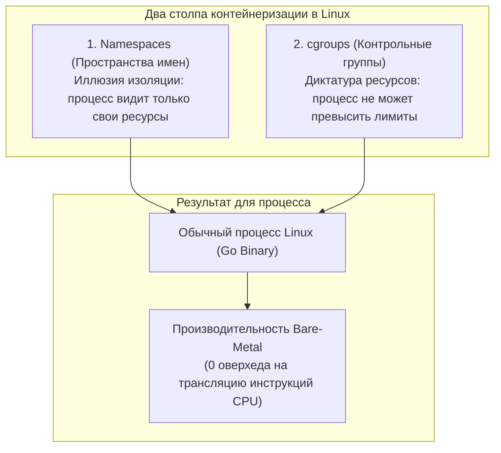
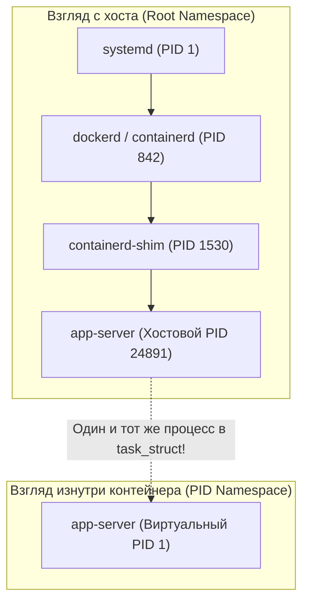
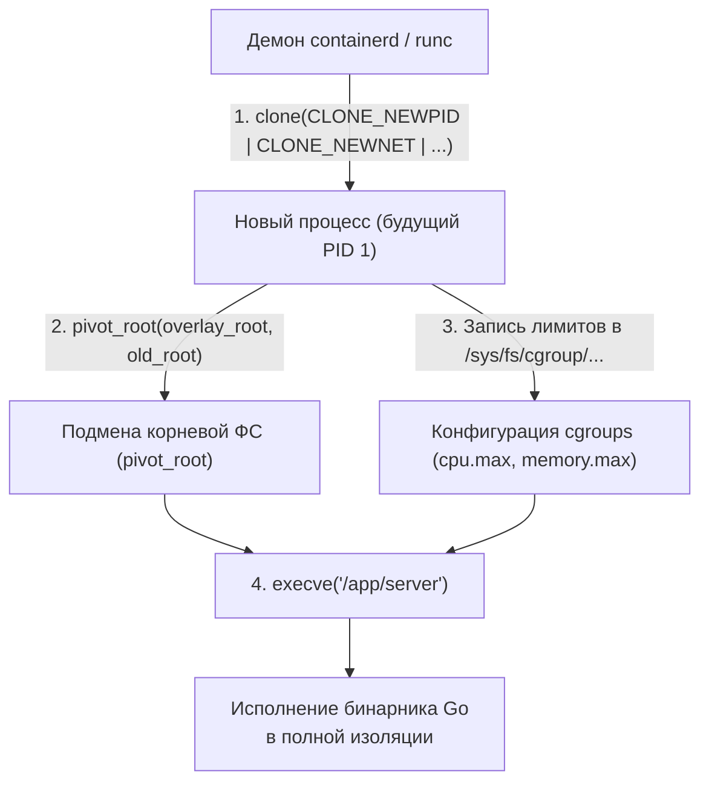

# 53. Контейнеры под капотом: namespaces, cgroups v2 и pivot_root

> *"A container is not a thing. It is an ordinary Linux process wearing a pair of kernel-tinted glasses."*  
> — Фундаментальная истина контейнеризации

---

## Контейнеры: иллюзия виртуализации или реальная изоляция?

Многие разработчики до сих пор пребывают в заблуждении, считая контейнеры «очень легковесными виртуальными машинами». Это фундаментальная ошибка, мешающая понимать реальное поведение бэкенда в облачной инфраструктуре.

Классическая виртуальная машина эмулирует физическое аппаратное обеспечение (материнскую плату, контроллеры шины, сетевую карту), запускает полноценное гостевое ядро операционной системы и требует постоянного посредничества гипервизора (KVM, Xen, ESXi). 

Контейнер — это **самый обычный процесс Linux**. У него нет собственного ядра, нет эмулированного железа и нет виртуальной памяти, отличной от физической памяти хоста. В исходном коде ядра Linux вы не найдете структуры с именем `struct container`. Контейнеризация — это элегантная комбинация двух базовых низкоуровневых механизмов ядра:



1. **Namespaces (Пространства имен):** Обеспечивают **изоляцию видимости**. Ядро ограничивает процесс в том, что он может *видеть* (свои процессы, свои сетевые интерфейсы, свои точки монтирования).
2. **cgroups (Контрольные группы):** Обеспечивают **ограничение аппетита**. Ядро жестко контролирует, сколько ресурсов процесс может *потребить* (квоты CPU, потолок памяти RAM, скорость блочного ввода-вывода IOPS).

Когда вы вызываете команду `docker run` или развертываете под в Kubernetes, вы не создаете новую машину. Вы просто просите ядро Linux породить дочерний процесс с особыми системными флагами изоляции и привязать его к директории в псевдофайловой системе cgroups.

Переключение контекста между процессами разных контейнеров обходится процессору ровно во столько же тактов, сколько переключение между обычными процессами одного пользователя. Нет виртуализации, нет трансляции адресов, нет гипертрейдинга гостевых ОС. Именно поэтому скомпилированный сервис на Go внутри контейнера работает с чистой производительностью **bare-metal**!

---

## Namespaces: виртуальные окна в системные ресурсы

**Namespace** — это механизм ядра Linux, который создает для группы процессов изолированное виртуальное «окно» в глобальные системные таблицы. Процесс, помещенный в namespace, не способен увидеть объекты за пределами своего окна, если только ядро явно не предоставит ему этот мост.

В современном ядре Linux существует 7 фундаментальных типов namespaces:

| Тип Namespace | Флаг системного вызова `clone()` | Что конкретно изолируется от хоста |
|:---:|:---:|:---|
| `PID` | `CLONE_NEWPID` | Пространство идентификаторов процессов. Внутри контейнера ваш главный процесс получает виртуальный PID 1, при этом на хосте он сохраняет свой реальный глобальный PID (например, 24891). |
| `NET` | `CLONE_NEWNET` | Полный сетевой стек: собственные интерфейсы (eth0, lo), таблицы маршрутизации, цепочки iptables/nftables и изолированное пространство TCP/UDP портов. |
| `MNT` | `CLONE_NEWNS` | Таблица точек монтирования файловой системы. Позволяет подменить корневую файловую систему на контейнерный образ через `pivot_root`. |
| `UTS` | `CLONE_NEWUTS` | Имя хоста (hostname) и доменное имя NIS. Позволяет контейнеру иметь собственный сетевой идентификатор. |
| `IPC` | `CLONE_NEWIPC` | Межпроцессное взаимодействие System V и очереди POSIX: изолирует семафоры, очереди сообщений и разделяемую память (shared memory). |
| `USER` | `CLONE_NEWUSER` | Таблица соответствия пользователей и групп (UID/GID). Ключевой фундамент rootless-контейнеров (UID 0 внутри контейнера отображается на безопасный UID 1000 на хосте). |
| `CGROUP` | `CLONE_NEWCGROUP` | Видимость виртуальной файловой системы cgroups. Предотвращает возможность контейнера увидеть пути контрольных групп хостовой машины. |



> [!info] Под капотом: Структура nsproxy в ядре
> В исходном коде ядра Linux каждый процесс (`task_struct`) содержит указатель на структуру **`struct nsproxy`**. Внутри нее хранятся указатели на конкретные экземпляры пространств имен (`pid_ns`, `net`, `mnt_ns` и т.д.).  
> 
> При порождении процесса системным вызовом `clone()` с флагами изоляции ядро выделяет новую структуру `nsproxy`, копирует в нее ссылки на неизмененные пространства имен и создает новые структуры для запрошенных.  
> Когда процесс выполняет системные вызовы `socket`, `stat`, `getpid` или `fork`, ядро достает нужные таблицы прямо из указателя `current->nsproxy`. С точки зрения кэшей процессора L1/L2 и быстродействия регистров здесь нет абсолютно никакой разницы с обычным процессом: это просто чтение по другому адресу памяти ядра!

Управление пространствами имен в Linux реализуется тройкой системных вызовов:
- **`clone()`**: Создание нового дочернего процесса с одновременным выделением указанных namespaces.
- **`unshare()`**: Отсоединение текущего уже работающего процесса от родительских namespaces без создания дочернего процесса.
- **`setns()`**: Присоединение вызывающего процесса к существующему пространству имен другого процесса (именно на этом сисколле построена команда `docker exec` или `kubectl exec`).

---

## Cgroups: жесткие ограничения ресурсов

Если namespaces надевают на процесс «розовые очки», заставляя его верить, что он один на целом сервере, то подсистема **cgroups** не позволяет этому процессу разрушить сервер, бесконтрольно поглощая физические ресурсы.

Современный стандарт **cgroups v2** (ставший стандартом в ядрах Linux 5.3+ и средах Kubernetes 1.25+) полностью устранил хаос раздельных иерархий cgroups v1. Все ресурсы теперь управляются через единое унифицированное дерево каталогов, смонтированное в `/sys/fs/cgroup/`.

---

### Ключевые контроллеры v2:

1. **`cpu.max`**: Жесткое квотирование процессора через CFS (Completely Fair Scheduler). Формат: `quota period`. Например, запись `100000 100000` в контрольный файл выделяет процессу ровно 100 000 мкс за период 100 000 мкс (эквивалент 1 full core CPU). Если процесс расходует квоту раньше, ядро немедленно ставит его потоки на паузу (CPU Throttling).
2. **`memory.max`**: Абсолютный жесткий лимит физической памяти (RAM). При попытке превысить этот порог ядро сначала запускает агрессивный сброс файловых кэшей (Page Cache reclaim), а если свободной памяти не находится — активирует OOM Killer и присылает процессу смертельный сигнал `SIGKILL`.
3. **`memory.high`**: Мягкий лимит памяти (Soft Limit). При его превышении ядро не убивает процесс, но начинает замедлять его аллокации (throttling) и отправляет асинхронные уведомления в epoll, давая приложению шанс штатно освободить кэши.
4. **`pids.max`**: Защита от fork-бомб. Лимитирует суммарное число потоков и подпроцессов внутри группы.
5. **`io.max`**: Дросселирование скорости чтения и записи на блочные устройства: задание лимитов на максимальный IOPS и пропускную способность в байтах/сек (throughput).

> [!warning] Ловушка / Gotcha: Аллокации памяти в Go и реакция на лимиты cgroup
> В рантайме Go аллокатор памяти запрашивает виртуальную память у ядра блоками через системные вызовы `mmap` и `brk`.  
> 
> Если контейнер приближается к границе `memory.max`, очередная попытка расширить кучу через `runtime.Grow` или аллокацию среза `make([]byte, ...)` не вызовет мягкой ошибки.  
> Если ядро не может выделить физический фрейм, вызов `mmap` вернет ошибку `ENOMEM`, которую рантайм Go немедленно преобразует в фатальное падение:  
> `fatal error: out of memory` или панику с разыменованием `nil pointer dereference`.  
> Если же память была выделена виртуально (overcommit), ядро убьет процесс через OOM Killer сигналом `SIGKILL` вообще без генерации stack trace в логах Go! Понимание разницы между утечкой в Go-коде и ограничением cgroup критично для диагностики инцидентов.

---

## Как это работает вместе: от docker run до вашего Go-процесса

Когда демон контейнеризации (Docker, containerd, CRI-O) получает команду на запуск контейнера, под капотом разворачивается филигранная цепочка низкоуровневых операций ядра:



1. **`clone()` с флагами:** Ядро создает новый `task_struct`, связывая его с новым изолированным экземпляром `struct nsproxy`.
2. **`pivot_root()`**: В отличие от устаревшего `chroot`, системный вызов `pivot_root()` атомарно заменяет корень файловой системы текущего процесса на новый смонтированный каталог (слои образа контейнера OverlayFS), надежно предотвращая возможность побега из песочницы через `..`.
3. **Настройка cgroups**: Управляющий рантайм записывает PID процесса в файл `cgroup.procs` в `/sys/fs/cgroup/docker/<id>/cpu.max` и `memory.max`.
4. **`execve()`**: Процесс заменяет свой образ исполняемого файла на скомпилированный бинарник Go. Запускается среда исполнения Go: потоки планировщика `runtime.g`, сетевой поллер `netpoller` и сборщик мусора — абсолютно штатно, но в изолированных границах.

---

## Go и низкоуровневая работа с изоляцией

Хотя стандартная библиотека Go не содержит специализированного пакета `container`, системный пакет `golang.org/x/sys/unix` предоставляет исчерпывающий интерфейс ко всем низкоуровневым системным вызовам Linux.

Ниже приведен практический пример на Go, демонстрирующий проверку наличия контрольных групп cgroups v2 и чтение текущих лимитов памяти прямо из псевдофайловой системы:

```go
package main

import (
	"fmt"
	"os"
	"strconv"
	"strings"

	"golang.org/x/sys/unix"
)

func main() {
	// 1. Проверяем тип файловой системы в точке монтирования /sys/fs/cgroup
	var stat unix.Statfs_t
	if err := unix.Statfs("/sys/fs/cgroup", &stat); err != nil {
		fmt.Fprintf(os.Stderr, "Ошибка чтения файловой системы cgroup: %v
", err)
		os.Exit(1)
	}

	// Магическое число суперблока cgroups v2 (CGROUP2_SUPER_MAGIC = 0x63677270)
	const cgroup2SuperMagic = 0x63677270
	if stat.Type != cgroup2SuperMagic {
		fmt.Println("cgroup v2 не обнаружен: хост использует cgroup v1 или изоляция отключена.")
		return
	}
	fmt.Println("cgroup v2 успешно распознан!")

	// 2. Читаем текущее фактическое потребление памяти процессом (memory.current)
	currentData, err := os.ReadFile("/sys/fs/cgroup/memory.current")
	if err == nil {
		currentBytes, _ := strconv.ParseInt(strings.TrimSpace(string(currentData)), 10, 64)
		fmt.Printf("Текущее потребление RAM в cgroup: %d байт (%.2f MB)
", 
			currentBytes, float64(currentBytes)/1024/1024)
	}

	// 3. Читаем установленный hard-лимит памяти (memory.max)
	maxData, err := os.ReadFile("/sys/fs/cgroup/memory.max")
	if err == nil {
		rawLimit := strings.TrimSpace(string(maxData))
		if rawLimit == "max" {
			fmt.Println("Лимит memory.max: БЕЗ ОГРАНИЧЕНИЙ (max)")
		} else {
			limitBytes, _ := strconv.ParseInt(rawLimit, 10, 64)
			fmt.Printf("Установленный лимит memory.max: %d байт (%.2f MB)
", 
				limitBytes, float64(limitBytes)/1024/1024)
		}
	}
}
```

> [!tip] Собеседование: Реакция Go-приложения на OOM Killer
> **Вопрос:** Как высоконагруженное Go-приложение должно реагировать на угрозу быть уничтоженным OOM Killer внутри контейнера?
> 
> **Ответ:** 
> Напрямую перехватить вызов OOM Killer в Go-коде невозможно: ядро казнит процесс смертельным сигналом **`SIGKILL`**, который принципиально не перехватывается и не игнорируется пользовательскими обработчиками сигналов.  
> 
> Однако грамотный инженер применяет превентивные архитектурные меры:
> 1. **`runtime/debug.SetMemoryLimit()` (или переменная `GOMEMLIMIT`):** Введена в Go 1.19+. Позволяет задать порог памяти на уровне рантайма (на 10–20% ниже `memory.max`). При приближении к нему сборщик мусора Go активирует агрессивную утилизацию и сбрасывает страницы через `madvise`, защищая контейнер от OOM.
> 2. **Мониторинг `memory.high` через inotify/eBPF:** Подписка на события мягкого лимита позволяет сервису заблаговременно сбросить внутренние кэши в оперативной памяти и отключить прием второстепенных фоновых задач.
> 3. **Внешний оркестратор:** Настройка политик перезапуска (Restart Policies) и Healthcheck в `docker` или `systemd` для мгновенного поднятия упавшего экземпляра.

---

## Ловушки и вопросы с собеседований

### 1. Почему `docker run` может работать без прав root?
Благодаря механизму **`USER namespace`**. Ядро выполняет трансляцию идентификаторов: виртуальный пользователь `UID 0` (root) внутри контейнера маппится на непривилегированного пользователя `UID 1000` на физическом хосте. Внутри контейнера процесс считает себя полновластным хозяином, но любая попытка выполнить опасный системный вызов на уровне хостового железа будет мгновенно заблокирована ядром из-за отсутствия реальных capabilities (например, `CAP_NET_RAW` для создания raw-сокетов утилитой `ping`).

### 2. Разница между `clone` и `fork`?
Классический системный вызов `fork` слепо дублирует адресное пространство процесса (через Copy-on-Write) и файловые дескрипторы. Системный вызов `clone` — это мощнейший параметризуемый супер-инструмент ядра. Он позволяет точечно указать, какие ресурсы родительского процесса будут разделяться (shared), а какие изолироваться: виртуальная память (`CLONE_VM`), таблица дескрипторов (`CLONE_FILES`), обработчики сигналов (`CLONE_SIGHAND`) и все виды namespaces! Именно через `clone` в Linux создаются и системные потоки ОС, и изолированные контейнеры.

### 3. Что происходит с горутинами при переключении cgroup CPU?
Если контейнер превысил квоту `cpu.max`, планировщик ядра CFS просто перестает планировать системные потоки `M` процесса на ядра процессора. Ядро может вернуть `EAGAIN` при попытке переключения потока. Для рантайма Go это выглядит как остановка времени: пользовательские горутины (`runtime.g`) не зависают в deadlock, но общее время ответа сервиса резко подскакивает (CPU throttling).

### 4. Как связать Go-сервер с сетью конкретного контейнера?
По умолчанию метод `net.Listen(":8080")` привязывается к адресу `0.0.0.0` текущего `NET namespace`. Чтобы изолировать трафик или направить его через виртуальный сетевой кабель (**`veth`**-пару), контейнерные рантаймы создают пару интерфейсов, один конец которой помещают в `NET namespace` контейнера, а второй — в виртуальный мост (bridge) хоста, либо привязывают сокет к конкретному интерфейсу опцией `SO_BINDTODEVICE` через вызов `syscall.SetsockoptString`.

---

## Итог

1. **Контейнеры — это не виртуальные машины.** Это обычные процессы Linux, исполняющиеся на том же ядре с нулевым оверхедом и скоростью bare-metal.
2. **Архитектура изоляции держится на двух механизмах:**
   - **Namespaces** (`PID`, `NET`, `MNT`, `UTS`, `IPC`, `USER`, `CGROUP`) создают виртуальные изолированные проекции системных ресурсов.
   - **cgroups v2** (`cpu.max`, `memory.max`, `pids.max`, `io.max`) устанавливают жесткие барьеры потребления вычислительных мощностей.
3. **Безопасная смена корня:** Вызов `pivot_root()` надежно герметизирует файловую систему контейнера, предотвращая выход в родительские каталоги хоста.
4. **Механическое сочувствие в Go:** Управление переменной `GOMEMLIMIT`, контроль троттлинга CPU и знание различий между системными ошибками `ENOMEM` и казнями OOM Killer позволяют создавать отказоустойчивые микросервисы в облачных средах Kubernetes.
5. Глубокое понимание низкоуровневых системных вызовов `clone`, `mount` и `syscall` критично для написания кастомных рантаймов, оркестраторов или высоконагруженных сервисов, работающих в изолированных окружениях.

Мы досконально исследовали внутреннюю механику контейнеров. Но как ядро Linux разделяет адресные пространства процессов, почему системный отладчик `ptrace` не может шпионить за чужим namespace, и как устроена изоляция памяти на уровне ядра? Ответы — в следующей статье: [[54. Изоляция процессов в Linux.md]].
