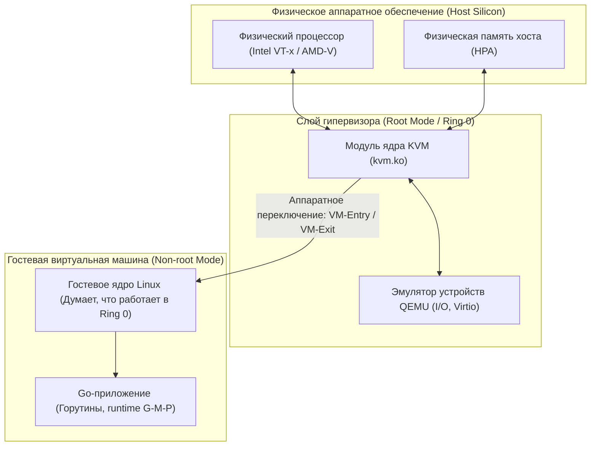
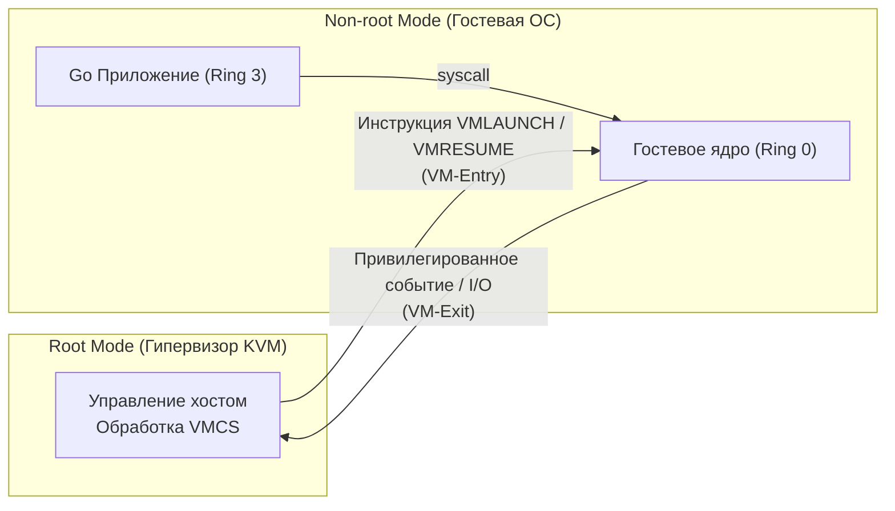

# 55. Виртуальные машины и гипервизоры: KVM, QEMU, VT-x и EPT

> *«Облако — это всего лишь чужой компьютер, а виртуализация — искусство заставить этот компьютер притворяться тысячей других».*    
> — Свободная мысль об архитектуре распределенных вычислений

---

## Введение

В современной индустрии разработки высоконагруженного бэкенда наши Go-сервисы почти никогда не работают напрямую на физическом кремнии. Даже если приложение упаковано в легковесный контейнер, сам этот контейнер в 95% случаев исполняется внутри виртуальной машины (ВМ), арендованной в публичном облаке (AWS EC2, Google Cloud, Yandex Cloud) или развернутой во внутреннем корпоративном кластере (OpenStack, VMware vSphere).

Понимание физики виртуализации на уровне процессора и шины памяти критически необходимо инженеру для:
*   Осознания границ аппаратной изоляции и безопасности (защита от атак класса Spectre/Meltdown и побега из песочницы).
*   Диагностики необъяснимых задержек (джиттера и latency spikes) в транзакционных Go-сервисах.
*   Обоснованного архитектурного выбора между виртуальными машинами и контейнерами ([[53. Контейнеры под капотом. namespaces и cgroups.md]]).
*   Низкоуровневой калибровки ресурсов хоста: привязки ядер (CPU pinning), настройки огромных страниц памяти (Hugepages) и топологии NUMA под рантайм Go.

Гипервизор — это программно-аппаратный слой, позволяющий нескольким изолированным операционным системам безопасно делить один физический процессор, шину и память. Однако за эту иллюзию приходится платить реальными тактами процессора. Давайте разберем, как именно гипервизор взаимодействует с железом, и что это означает для бэкенда на Go.



---

## Типы гипервизоров и архитектура

В компьютерных науках гипервизоры классифицируются на два фундаментальных типа по их расположению относительно физического оборудования:

1. **Type 1 (Bare-metal / Автономный):** Запускается непосредственно на физическом процессоре и контролирует оборудование напрямую, без промежуточной операционной системы общего назначения. Примеры: **KVM** (превращающий ядро Linux в гипервизор 1-го типа), VMware ESXi, Xen, Proxmox VE. Это абсолютный стандарт для высокопроизводительной production-инфраструктуры.
2. **Type 2 (Hosted / Размещенный):** Функционирует как обычный пользовательский процесс поверх стандартной хостовой ОС (Windows, macOS, Linux). Примеры: VirtualBox, VMware Workstation. Идеален для локальной разработки и тестов, но создает двойной оверхед на переключение контекста планировщика хоста.

```mermaid
flowchart TD
    classDef process  fill:#1e293b,stroke:#38bdf8,stroke-width:1px,color:#f8fafc
    classDef success  fill:#064e3b,stroke:#34d399,stroke-width:1px,color:#f8fafc
    classDef error    fill:#7f1d1d,stroke:#f87171,stroke-width:1px,color:#f8fafc
    classDef warning  fill:#78350f,stroke:#fbbf24,stroke-width:1px,color:#f8fafc
    classDef entry    fill:#1e3a5f,stroke:#38bdf8,stroke-width:2px,color:#f8fafc
    classDef aux      fill:#334155,stroke:#64748b,stroke-width:1px,color:#f8fafc
    classDef system   fill:#312e81,stroke:#a78bfa,stroke-width:1px,color:#f8fafc
    classDef data     fill:#132d29,stroke:#2dd4bf,stroke-width:1px,color:#f8fafc
    classDef network  fill:#881337,stroke:#fb7185,stroke-width:1px,color:#f8fafc
    classDef accent   fill:#1e1b4b,stroke:#818cf8,stroke-width:1px,color:#f8fafc
    subgraph Type1["Гипервизор Type 1 (Bare-metal)"]
        H1["Физическое железо (CPU / RAM / NIC):::system"] --> Hyp1["Гипервизор Type 1 (KVM / ESXi)"]
        Hyp1 --> VM1A["Гостевая ОС 1"]
        Hyp1 --> VM1B["Гостевая ОС 2"]
    end

    subgraph Type2["Гипервизор Type 2 (Hosted)"]
        H2["Физическое железо"]:::system --> HostOS["Хостовая ОС (Linux / Windows)"]
        HostOS --> Hyp2["Гипервизор Type 2 (VirtualBox)"]
        Hyp2 --> VM2A["Гостевая ОС 1"]
    end
```



> [!info] Под капотом: Эволюция от Trap-and-Emulate к аппаратному кремнию
> На заре виртуализации на архитектуре x86 гипервизоры были чисто программными. Процессор x86 не был классически виртуализируемым по критериям Попека — Голдберга: некоторые критические инструкции процессора не вызывали прерываний при исполнении в непривилегированном режиме, а просто молча возвращали неверные данные. Гипервизоры были вынуждены динамически переписывать машинный код гостя на лету (Binary Translation). Это работало медленно и требовало колоссальных ресурсов CPU.  
> Революция произошла в 2005–2006 годах, когда Intel и AMD представили аппаратные расширения виртуализации: **Intel VT-x** и **AMD-V**.

---

## Под капотом: Аппаратная виртуализация CPU

В классической архитектуре процессоров x86 существовала кольцевая модель защиты: от привилегированного ядра в **`Ring 0`** до пользовательских приложений в **`Ring 3`**.

С появлением аппаратной виртуализации инженеры кремния разделили мир процессора на два ортогональных измерения:
1. **VMX Root Operation (Root Mode):** Режим гипервизора. Процессор имеет полный доступ к физическому оборудованию, таблицам прерываний и регистрам управления.
2. **VMX Non-root Operation (Non-root Mode):** Режим гостя. Гостевая операционная система уверена, что она монопольно владеет процессором и работает в настоящем `Ring 0`. Но на самом деле процессор жестко контролирует каждый ее шаг!



### Структура управления виртуальной машиной (VMCS)
Связующим звеном между хостом и гостем является **`VMCS` (Virtual Machine Control Structure)** — специальная область физической памяти (размером 4 КБ), выделяемая гипервизором для каждого виртуального ядра (vCPU). `VMCS` содержит:
- **Guest-state area:** Полный снимок состояния гостя (регистры процессора `RIP`, `RSP`, флаги, сегменты).
- **Host-state area:** Снимок регистров гипервизора, куда процессор прыгает при прерывании.
- **VM-execution control fields:** Битовая маска инструкций, которые процессор обязан перехватывать (например, попытка выполнить инструкции ввода-вывода `in`/`out`, запись в регистр управления памятью `CR3` или сброс кэшей).

Жизненный цикл vCPU — это бесконечный цикл:
1. Гипервизор конфигурирует `VMCS` и выполняет процессорную инструкцию `VMLAUNCH` или `VMRESUME`. Происходит **`VM-Entry`** — процессор аппаратно переключается в Non-root режим и начинает выполнять код гостя на полной аппаратной скорости.
2. Как только гостевая ОС пытается сделать что-то запрещенное (например, обратиться к контроллеру диска или физическому порту), процессор мгновенно замораживает исполнение, сохраняет регистры гостя в `VMCS` и переключается в Root-режим гипервизора. Это событие называется **`VM-Exit`**.
3. Гипервизор разбирает причину перехвата в структуре `VMCS`, эмулирует операцию и выполняет следующий `VM-Entry`.

> [!tip] Собеседование: Как гипервизор обрабатывает системный вызов гостевой ОС?
> **Вопрос:** Вызывает ли каждый вызов `syscall` в Go-приложении (например, `write` или `read`) тяжелое переключение `VM-Exit` в гипервизор?
> 
> **Ответ:** **Нет!** Современные процессоры с VT-x/AMD-V спроектированы предельно эффективно. Когда горутина Go вызывает `syscall` через ассемблерную инструкцию `SYSCALL`, процессор переключается из гостевого `Ring 3` в гостевой `Ring 0` **целиком внутри Non-root режима без выполнения `VM-Exit`**!  
> Гостевое ядро Linux перехватывает системный вызов самостоятельно в своей гостевой таблице прерываний (IDT) и обрабатывает его в гостевом Page Cache.  
> Переключение `VM-Exit` в гипервизор происходит только тогда, когда гостевое ядро решает обратиться к реальному виртуализированному оборудованию (например, сбросить буфер на физический диск или передать сетевой кадр через шину PCIe).

---

## Виртуализация памяти и I/O

---

### Память: EPT и NPT

В обычной ОС трансляция памяти одноуровневая: виртуальный адрес (VA) транслируется в физический (PA). В виртуальной машине возникает двухуровневая матрешка:
- **GVA (Guest Virtual Address):** Виртуальный адрес в пространстве Go-процесса.
- **GPA (Guest Physical Address):** «Физический» адрес, который видит гостевое ядро.
- **HPA (Host Physical Address):** Настоящий физический адрес ячейки в чипе оперативной памяти сервера.

В ранних гипервизорах использовались тяжелые теневые таблицы страниц (Shadow Page Tables), требовавшие перехвата каждого Page Fault.  
В современных процессорах трансляция полностью аппаратная: **`EPT` (Extended Page Tables)** у Intel и **`NPT` (Nested Page Tables)** у AMD. Аппаратный блок MMU процессора умеет совершать двумерный проход по таблицам (Two-Dimensional Page Walk), переводя GVA -> GPA -> HPA прямо в кремнии!

```mermaid
flowchart LR
    classDef process  fill:#1e293b,stroke:#38bdf8,stroke-width:1px,color:#f8fafc
    classDef success  fill:#064e3b,stroke:#34d399,stroke-width:1px,color:#f8fafc
    classDef error    fill:#7f1d1d,stroke:#f87171,stroke-width:1px,color:#f8fafc
    classDef warning  fill:#78350f,stroke:#fbbf24,stroke-width:1px,color:#f8fafc
    classDef entry    fill:#1e3a5f,stroke:#38bdf8,stroke-width:2px,color:#f8fafc
    classDef aux      fill:#334155,stroke:#64748b,stroke-width:1px,color:#f8fafc
    classDef system   fill:#312e81,stroke:#a78bfa,stroke-width:1px,color:#f8fafc
    classDef data     fill:#132d29,stroke:#2dd4bf,stroke-width:1px,color:#f8fafc
    classDef network  fill:#881337,stroke:#fb7185,stroke-width:1px,color:#f8fafc
    classDef accent   fill:#1e1b4b,stroke:#818cf8,stroke-width:1px,color:#f8fafc
    GVA["Гостевой виртуальный адрес
(GVA в Go Heap)"] -->|"Таблицы страниц гостя (CR3)"| GPA["Гостевой физический адрес
(GPA)"]
    GPA -->|"Аппаратные таблицы EPT / NPT"| HPA["Хостовый физический адрес
(HPA в чипе RAM)"]
```



> [!warning] Ловушка / Gotcha: Двойная цена промаха TLB и штраф за EPT
> Если при обычном доступе к памяти на 64-битном процессоре 4-уровневый обход дерева страниц требует максимум 4 обращений к памяти, то при использовании EPT аппаратный блок MMU для трансляции каждого гостевого уровня обязан транслировать и хостовые адреса!  
> В худшем случае один промах в кэше трансляции TLB может потребовать **до 24 последовательных обращений к памяти** вместо 4!  
> Кроме того, изменение маппингов на одном виртуальном ядре порождает межпроцессорные прерывания (IPI) и синхронизацию — **TLB Shootdowns**, вызывая микрофризы.  
> **Решение:** Включение Hugepages (`transparent_hugepages` или `hugetlbfs`) размером 2 МБ или 1 ГБ сокращает глубину дерева страниц и снижает число промахов TLB в десятки раз!

---

### I/O: Virtio и Paravirtualization

Если эмулировать старое железо (например, эмулировать регистры древней сетевой карты `Intel e1000` или IDE-диска), гипервизору придется обрабатывать сотни тысяч `VM-Exit` на каждый переданный мегабайт трафика.

Решение проблемы — **Paravirtualization (Паравиртуализация)** и открытый промышленный стандарт **`virtio`**.  
Гостевая ОС использует специализированные драйверы (`virtio-net`, `virtio-blk`), которые осознают, что работают в виртуальной среде. Обмен данными происходит не через эмуляцию портов `in`/`out`, а через быстрые кольцевые буферы в разделяемой памяти — **`virtqueues`**. Гость просто складывает дескрипторы пакетов в очередь памяти и один раз уведомляет гипервизор через дверной звонок (Doorbell/hypercall), разгоняя сетевой трафик до десятков гигабит в секунду!

---

## Mechanical Sympathy: Стоимость виртуализации

Для бэкенд-инженера на Go виртуальная машина — это не бесплатная абстракция. Нагрузка ложится на следующие физические узлы:

1. **Оверхед VM-Exit / VM-Entry:** Каждое переключение контекста между гостем и гипервизором требует сотен процессорных тактов на сохранение регистров, переключение указателей `VMCS` и сброс конвейера инструкций.
2. **Конкуренция планировщиков (Scheduler Contention):** Планировщик горутин Go (`G-M-P`) оперирует виртуальными ядрами (`P`). Но сами виртуальные ядра vCPU распределяются планировщиком хостовой ОС (Linux CFS). Если хост перегружен (Oversubscription), виртуальное ядро может внезапно встать на паузу на несколько миллисекунд прямо посреди выполнения критической транзакции!
3. **Разрушение кэш-линий CPU (Cache Locality):** Если гипервизор мигрирует vCPU между разными физическими ядрами или NUMA-нодами сокета, процессорные кэши L1/L2/L3 оказываются холодными, вызывая лавину **cache misses** и деградацию производительности сервиса на 15–30%.
4. **Сетевой путь:** Сетевые пакеты преодолевают сложный маршрут: `Go Runtime -> Гостевой сокет -> virtio-net -> Драйвер хоста KVM/QEMU -> Сетевой стек хоста (OVS/Bridge) -> Физическая сетевая карта`.

> [!info] Под капотом: Ловушка GOMAXPROCS на виртуальных машинах
> Планировщик Go ничего не знает об архитектуре гипервизора. Он считает, что все ядра, возвращенные системным вызовом, являются равноправными физическими ядрами.  
> Если в облачной ВМ сконфигурировано 32 виртуальных vCPU, но физически сервер работает с коэффициентом переподписки (например, 2 vCPU на 1 физическое ядро), установка **`GOMAXPROCS=32`** приведет к катастрофической конкуренции на уровне хоста. Горутины будут блокироваться, а фаза STW (Stop-The-World) сборщика мусора Go будет разлетаться по времени из-за джиттера vCPU.

---

## Влияние на Go-приложения и бэкенд-архитектуру

### 1. Архитектурная стратегия: ВМ против Контейнеров
- **Виртуальные машины:** Обеспечивают максимальную изоляцию (аппаратный уровень защиты, собственное независимое ядро, собственные сетевые стеки и драйверы). Необходимы для мультиарендных систем (Multi-tenancy), строгих требований безопасности PCI-DSS/HIPAA и изоляции потенциально опасного кода.
- **Контейнеры ([[53. Контейнеры под капотом. namespaces и cgroups.md]]):** Обеспечивают скорость bare-metal и мгновенный запуск за счет единого ядра хоста.

### 2. Observability и мониторинг:
При профилировании Go-сервиса через `pprof` или системный трассировщик `perf` внутри виртуальной машины важно уметь отделять реальные узкие места кода от системных фреймов гипервизора (`kvm`, `qemu`, `containerd`).

### 3. Системный тюнинг инфраструктуры под Go:
- **CPU Pinning (Привязка ядер):** Закрепление виртуальных vCPU за конкретными физическими ядрами процессора (через утилиту `numactl` или параметры гипервизора `cpuset`) исключает миграции между ядрами и сохраняет горячие кэши L3.
- **Hugepages:** Включение страниц памяти 2 МБ (`transparent_hugepages` или `hugetlbfs`) снижает нагрузку на двумерный обход EPT/NPT и ускоряет управление огромной кучей Go.
- **Сетевой offloading:** Использование драйвера `virtio-net` с поддержкой аппаратной разгрузки (TSO, GSO, Checksum Offloading) делегирует сборку сегментов гипервизору, освобождая драгоценные такты процессора для бизнес-логики.

Ниже приведен пример на Go для проверки и управления маской сродства процессора (CPU Affinity) через системный пакет `golang.org/x/sys/unix`:

```go
package main

import (
	"fmt"
	"log"
	"runtime"

	"golang.org/x/sys/unix"
)

func main() {
	// Фиксируем количество логических процессоров Go
	runtime.GOMAXPROCS(4)

	// Блокируем текущую горутину на системном потоке ОС (M)
	runtime.LockOSThread()
	defer runtime.UnlockOSThread()

	// Настраиваем маску сродства: привязываем текущий поток к ядру 0
	var cpuSet unix.CPUSet
	cpuSet.Zero()
	cpuSet.Set(0) // Привязка к физическому ядру 0

	// Применяем маску через системный вызов sched_setaffinity
	if err := unix.SchedSetaffinity(0, &cpuSet); err != nil {
		log.Printf("Не удалось привязать CPU affinity: %v", err)
	} else {
		fmt.Println("Поток успешно зафиксирован на физическом ядре 0 (защита от миграции vCPU)!")
	}
}
```

---

## Ловушки и вопросы на собеседованиях

> [!warning] Ловушка / Gotcha: Live Migration и паузы сборщика мусора Go
> При выполнении «горячей миграции» виртуальной машины (Live Migration в KVM/QEMU или vMotion в VMware) гипервизор итеративно копирует страницы памяти на целевой сервер. На финальном этапе гипервизор **полностью замораживает гостевую ОС** (на 50–300 мс) для переноса последних грязных страниц и регистров.  
> Если в этот момент рантайм Go проводит фазу разметки GC или ожидает сетевого подтверждения, время отклика сервиса внезапно возрастает на сотни миллисекунд, порождая ложные срабатывания таймаутов у вышестоящих балансировщиков!

### 5 ключевых вопросов для проверки Senior-уровня:
1. **В чем принципиальная разница между гипервизорами Type 1 и Type 2?**  
   *Ответ:* Type 1 работает напрямую на физическом оборудовании (KVM/ESXi) без посредничества хостовой ОС, обеспечивая минимальный оверхед I/O. Type 2 работает как обычный пользовательский процесс поверх ОС, создавая двойной слой контекстных переключений.
2. **Как устроен аппаратный механизм EPT/NPT и чем он превосходит Shadow Page Tables?**  
   *Ответ:* EPT позволяет аппаратному блоку MMU процессора автоматически транслировать гостевую физическую память в хостовую физическую (двумерный обход), полностью исключая программные `VM-Exit` на каждый промах страницы памяти.
3. **Почему контейнеры легче и быстрее виртуальных машин?**  
   *Ответ:* Контейнеры не эмулируют оборудование и не исполняют второе ядро ОС: они работают на общем ядре Linux, используя пространства имен (Namespaces) и cgroups.
4. **Что происходит на уровне процессора при системном вызове `syscall` внутри ВМ?**  
   *Ответ:* Процессор переключается из гостевого Ring 3 в гостевой Ring 0 локально внутри Non-root режима без `VM-Exit`. Переход в гипервизор (`VM-Exit`) инициируется только при обращении к аппаратным ресурсам или портам I/O.
5. **Что такое TLB Shootdown в виртуализированной среде?**  
   *Ответ:* Механизм принудительной инвалидации кэшей трансляции TLB на других ядрах процессора через межпроцессорные прерывания (IPI) при изменении таблиц страниц EPT.

---

## Итог

1. **Виртуализация — это аппаратный компромисс:** Гипервизоры Type 1 используют аппаратные расширения кремния (Intel VT-x / AMD-V) и структуры `VMCS` для безопасного переключения между режимами Root и Non-root.
2. **Трансляция памяти:** Механизмы EPT/NPT обеспечивают двумерную трансляцию страниц на уровне MMU, а использование Hugepages является обязательным условием для минимизации штрафа промахов TLB в базах данных и высоконагруженных Go-сервисах.
3. **Паравиртуализация virtio:** Ликвидирует тяжелые накладные расходы эмуляции старых устройств, организуя обмен сетевыми пакетами и дисковыми блоками через кольцевые буферы разделяемой памяти `virtqueues`.
4. **Механическое сочувствие в облаках:** Настройка `GOMAXPROCS`, контроль переподписки vCPU и изоляция через CPU Pinning защищают распределенные Go-сервисы от джиттера и микрозадержек виртуализации.

Мы исследовали виртуализацию железа и ядер. Но как операционная система защищает ресурсы и разграничивает полномочия между пользователями и процессами на логическом уровне? В следующей главе: [[56. Безопасность ОС. Права доступа, users, groups.md]].
