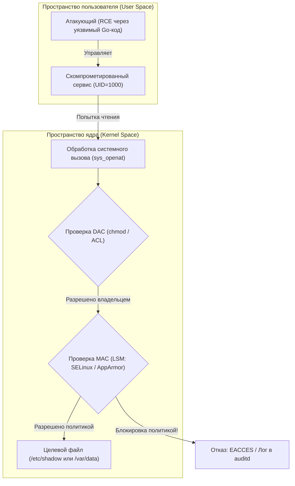
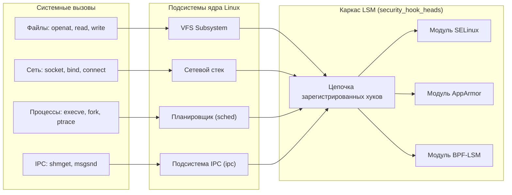
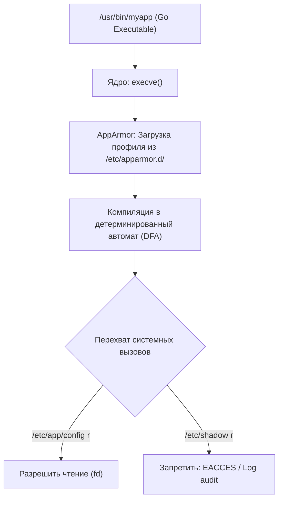
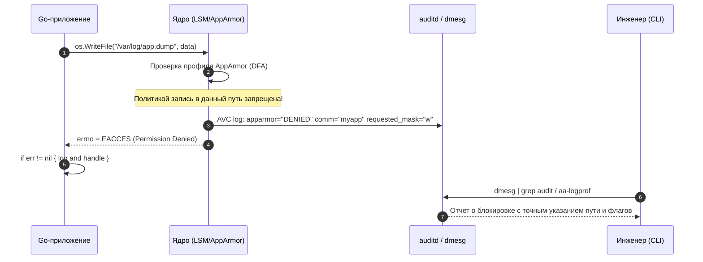

## Mandatory Access Control: Почему `chmod` больше не достаточно

В предыдущих разделах ([[56. Безопасность ОС. Права доступа, users, groups.md]], [[57. ACL, capabilities и привилегии процессов.md]]) мы изучили механизмы, управляющие правами доступа в UNIX-системах. Все они опираются на классическую модель **DAC (Discretionary Access Control — избирательное управление доступом)**. В парадигме DAC владелец ресурса сам решает («по своему усмотрению»), кому доверить чтение или модификацию своих файлов через команду `chmod` или списки ACL.

Увы, в суровых реалиях современного бэкенда модель DAC обладает фатальной уязвимостью. Представьте популярный веб-сервер `nginx` или микросервис на Go, обрабатывающий входящий HTTP-трафик от имени непривилегированного пользователя `www-data`. Если в коде сторонней библиотеки или парсера протокола обнаружится уязвимость удаленного исполнения кода (RCE), злоумышленник захватит контроль над процессом. И в этот момент он получит абсолютно все полномочия пользователя `www-data`! Злоумышленник сможет прочитать ключи сессий, модифицировать исходные файлы приложения, внедрить бэкдор в базу SQLite или запустить криптомайнер во временном каталоге `/tmp`. В модели DAC операционная система даже не шелохнется, ведь с точки зрения `chmod` процесс делает то, на что у него есть формальные файловые права.

Чтобы разорвать эту порочную связь между скомпрометированным процессом и доступными ему ресурсами, в компьютерных науках была создана концепция **MAC (Mandatory Access Control — принудительное управление доступом)**. В системе MAC ни владелец файла, ни даже всемогущий суперпользователь `root` не могут произвольно раздавать права. Безопасность регулируется централизованной политикой операционной системы: даже если процесс запущен от `root`, ядро жестко запретит ему открывать сокеты, писать в системные каталоги или читать закрытые файлы, если такое действие не прописано в утвержденном правиле безопасности.

В мире Linux главными бастионами принудительного контроля доступа являются системы **SELinux** и **AppArmor** ([[58. SELinux и AppArmor.md]]), построенные поверх архитектурного каркаса **LSM (Linux Security Modules)**.



Для Go-разработчика понимание MAC — не абстрактная теория, а насущная производственная необходимость: именно правила AppArmor и SELinux диктуют, какие системные вызовы может выполнять Docker-контейнер, почему вызов `os.Open` неожиданно падает с ошибкой `EACCES` при корректных файловых правах, и какие `capabilities` требуются сервису для нормальной работы.

## LSM: Архитектура безопасности ядра

До начала 2000-х годов попытки внедрить принудительный контроль доступа в Linux приводили к появлению несовместимых между собой патчей ядра. Архитектурное спасение пришло с созданием каркаса **LSM (Linux Security Modules)**. LSM не реализует конкретных политик безопасности, а предоставляет универсальную систему перехвата операций в ядре.



> [!info] Под капотом
> LSM работает через **хуки (hooks)**, встроенные в критические пути ядра: VFS (файлы), сетевой стек, `ptrace`, `sched`, `ipc`. Когда программа делает системный вызов, ядро не просто проверяет DAC-биты. Оно проходит по цепочке LSM-хуков. Если хотя бы один модуль возвращает ошибку, операция блокируется.
> 
> В исходниках ядра это выглядит как массив структур `security_hook_heads`. При инициализации ядра каждый загруженный модуль (SELinux, AppArmor, YAMA и др.) регистрирует свои функции в этих хуках. Проверка происходит на уровне C-указателей, что дает минимальные накладные расходы (~5-10 ns на хук при пропуске).

Принцип работы предельно прост и надежен: ядро сначала выполняет стандартную проверку DAC (права пользователя, группы и биты `rwx`). Если DAC запрещает операцию, ядро сразу возвращает ошибку, экономя такты процессора. Но если DAC дает добро, управление передается LSM-хуку. LSM вызывает функции зарегистрированных модулей безопасности, и только при единогласном одобрении системный вызов получает доступ к «железу».

## SELinux: Контексты, xattrs и политика

Разработанный Агентством национальной безопасности США (NSA), **SELinux (Security-Enhanced Linux)** представляет собой реализацию механизмов Type Enforcement (управление типами), RBAC (ролевой доступ) и MLS/MCS (многоуровневая безопасность).

В парадигме SELinux все элементы операционной системы делятся на **субъекты** (процессы) и **объекты** (файлы, сокеты, каталоги, дескрипторы). Каждому субъекту и объекту присваивается обязательная метка безопасности — **контекст безопасности**:

`user:role:type:level`

*   `user` — логическая личность SELinux (не путать с Linux UID).
*   `role` — роль, определяющая допустимый набор типов (например, `system_r`).
*   `type` (или домен для процессов) — сердце Type Enforcement. Определяет функциональное назначение объекта (например, процесс `httpd_t` или файлы `var_log_t`).
*   `level` — диапазон секретности и категории (MLS/MCS), активно используемый в защищенных кластерах и контейнерах (s0:c1,c2).

Политика SELinux состоит из миллионов декларативных правил, явно разрешающих конкретные действия между типами:

```text
allow httpd_t var_log_t :file { write };
```

Это правило гласит: процесс, работающий в домене типа `httpd_t`, имеет право производить операцию записи (`write`) в файлы, помеченные типом `var_log_t`. Если процесс попытается прочитать `/etc/shadow`, для которого нет разрешающего правила `allow`, ядро заблокирует операцию с ошибкой доступа, даже если процесс запущен от привилегированного пользователя `root`!

```mermaid
flowchart LR
    subgraph Subject ["Субъект (Процесс)"]
        Process["Go-бинарник / Nginx
Контекст: system_u:system_r:httpd_t:s0"]
    end

    subgraph AVC_Engine ["SELinux Engine & AVC Cache"]
        AVC{"Access Vector Cache (AVC)"}
        PolicyRule["Политика: allow httpd_t var_log_t :file { write };"]
    end

    subgraph Object ["Объект (Файл)"]
        LogFile["Файл лога: /var/log/app.log
Контекст: system_u:object_r:var_log_t:s0"]
        ShadowFile["Файл паролей: /etc/shadow
Контекст: system_u:object_r:shadow_t:s0"]
    end

    Process -->|write()| AVC
    AVC -->|Проверка правила| PolicyRule
    PolicyRule -->|Разрешено| LogFile
    Process -.->|Попытка read()| ShadowFile
    AVC -.->|Правило отсутствует: BLOCK!| ShadowFile
```

**Как это работает на уровне файловой системы:**  
SELinux хранит контексты безопасности файлов в **расширенных атрибутах (xattrs)** инодов под системным именем `security.selinux`. При каждом обращении к файлу VFS вызывает функцию ядра `getxattr()`, извлекает контекст и сверяет его с правилами через кэш решений **AVC (Access Vector Cache)**. Это добавляет накладные расходы на каждый syscall доступа к файлу, поэтому политики тщательно оптимизируются, а AVC кэширует результаты проверок в оперативной памяти процессора.

Режимы работы SELinux:
*   `Enforcing` — штатный режим: все запрещенные политикой действия жестко блокируются ядром, а факты нарушений протоколируются в журнал аудита.
*   `Permissive` — режим отладки: ядро не блокирует подозрительные операции, но заносит подробные предупреждения в системный лог. Идеально подходит для профилирования и разработки новых правил без риска сломать прод.
*   `Disabled` — полное отключение подсистемы SELinux и деактивация соответствующих LSM-хуков.

## AppArmor: Профильно-ориентированный подход

Если SELinux ориентирован на глобальные метки файловой системы, то **AppArmor (Application Armor)** предлагает более интуитивный и прагматичный подход, основанный на пути к исполняемому файлу (Path-based MAC).

В AppArmor безопасность настраивается через **профили**, которые привязываются не к абстрактным инодам или типам, а к конкретным абсолютным путям бинарных файлов на диске или профилям в подсистеме [[53. Контейнеры под капотом. namespaces и cgroups.md]].

Рассмотрим типичный профиль безопасности для веб-приложения:

```text
/usr/bin/myapp {
  #include <abstractions/base>
  /etc/app/config r,
  /var/log/myapp w,
  network inet tcp,
  deny /etc/shadow r,
}
```

В этом профиле декларативно зафиксировано: бинарнику `/usr/bin/myapp` разрешено читать конфигурационный файл `/etc/app/config`, писать в директорию логов `/var/log/myapp`, открывать сетевые TCP-сокеты (`network inet tcp`), а любая попытка прочитать системную базу паролей `/etc/shadow` принудительно пресекается правилом `deny`.



AppArmor хранит профили в каталоге `/etc/apparmor.d/`. Перед загрузкой в ядро утилита `apparmor_parser` компилирует текстовый профиль в компактный двоичный детерминированный конечный автомат (DFA — Deterministic Finite Automaton). Это позволяет ядру молниеносно проверять пути файлов при системных вызовах без накладных расходов на чтение расширенных дисковых атрибутов xattr. Именно поэтому AppArmor стал стандартом по умолчанию в дистрибутивах семейства Debian/Ubuntu и средах оркестрации контейнеров вроде Kubernetes.

> [!tip] Собеседование
> **Вопрос:** SELinux vs AppArmor: в чем архитектурные различия, что выбрать и почему?  
> **Ответ:** SELinux оперирует контекстами `inode` (`xattr`), что обеспечивает наивысшую устойчивость: даже если файл переместить, переименовать или сделать на него жесткую ссылку, контекст сохранится. Однако SELinux требует сложной компиляции меток и глубоких знаний политики. AppArmor опирается на пути в VFS и структуру каталогов, что делает профили предельно простыми для аудита человеком. Для Go-микросервисов и контейнеров (Docker/K8s) AppArmor часто предпочтительнее благодаря простоте отладки и прозрачной изоляции на уровне путей.

## Влияние на Go-разработку и контейнеризацию

По умолчанию компилятор Go создает **статически скомпонованные исполняемые бинарники** (без зависимостей от внешних `.so`-библиотек C). Это создает специфические нюансы при работе с MAC-системами:

1.  **Дрейф путей запуска в AppArmor:** Если путь к бинарнику динамически меняется (например, сервис запускается из временного каталога CI/CD или хэшированного пути `/app/releases/v1.2/myapp`), жесткий профиль AppArmor может проигнорировать исполнение или заблокировать дочерние процессы. Решения:
    *   Явная фиксация путей запуска в профиле: `profile /usr/bin/myapp { ... }`.
    *   Использование профилирования по криптографическому хэшу бинарника (`profile /usr/bin/myapp sha256:abc123 { ... }` или хэширование через `sha256`).
2.  **Метки SELinux при развертывании:** Если вы скопируете новый Go-бинарник на RedHat/CentOS через `scp` или соберете его локально через `go build`, файл получит контекст пользователя (`user_home_t`). Попытка службы `systemd` запустить такой сервис завершится мгновенным падением с ошибкой permission denied. Необходимо выполнить перемаркировку меток с помощью утилит `semanage fcontext` и `restorecon`.
3.  **Минимизация привилегий через Capabilities:** Вместо запуска сервиса от имени всемогущего `root`, современная архитектура требует дробить полномочия процесса через `CAPABILITIES` (см. [[57. ACL, capabilities и привилегии процессов.md]]).

В языке Go низкоуровневое управление привилегиями и флагами ядра реализуется через официальный пакет расширений `golang.org/x/sys/unix`:

```go
package main

import (
	"fmt"
	"log"
	"os"

	"golang.org/x/sys/unix"
)

func dropPrivileges() error {
	// 1. Убираем все capabilities
	header := unix.CapHeader{Version: unix.LINUX_CAPABILITY_VERSION_3}
	data := unix.CapData{Permitted: 0, Effective: 0, Inheritable: 0}
	if err := unix.Capset(&header, &data); err != nil {
		return fmt.Errorf("capset drop: %w", err)
	}

	// 2. Оставляем только CAP_NET_BIND_SERVICE для прослушивания <1024 портов
	dataPermitted := unix.CapData{
		Permitted:   1 << unix.CAP_NET_BIND_SERVICE,
		Effective:   1 << unix.CAP_NET_BIND_SERVICE,
		Inheritable: 0,
	}
	if err := unix.Capset(&header, &dataPermitted); err != nil {
		return fmt.Errorf("capset set: %w", err)
	}

	// 3. Переключаемся на non-root пользователя
	return os.Chown(".", 1000, 1000) // Пример смены владельца
}

func main() {
	if err := dropPrivileges(); err != nil {
		log.Fatal(err)
	}
	// Инициализация HTTP-сервера и т.д.
}
```

> [!warning] Ловушка / Gotcha
> **Базовый профиль AppArmor в Docker (`docker-default`):**  
> В контейнерах Docker и Kubernetes по умолчанию применяется стандартный профиль безопасности `docker-default`. Он блокирует около 44 опасных системных вызовов ядра, включая вызовы монтирования `mount`, отладки памяти через `ptrace` и доступ к виртуальной директории параметров ядра `/proc/sys`. Если ваше Go-приложение пытается инспектировать статус собственных потоков через `os.Open("/proc/self/status")`, собирает низкоуровневые метрики или использует профилировщик `debug/pprof` для трассировки системных вызовов, в режиме Enforcing вы мгновенно получите ошибку `EACCES`.  
> **Инженерные решения:**  
> 1. Для тестов и локальной отладки запускайте контейнер без профиля: `docker run --security-opt apparmor=unconfined`.  
> 2. В продакшене используйте декларативный манифест с точечным добавлением capabilities через `--cap-add=SYS_PTRACE` или напишите кастомный целевой профиль AppArmor с явным доступом к нужным псевдофайлам в `/proc`.

## Отладка и мониторинг MAC

Когда подсистема безопасности ядра блокирует операцию вашего приложения, это может выглядеть как необъяснимый сбой в прикладном коде: функция возвращает стандартную ошибку `EACCES` («Permission Denied»), хотя утилита `ls -l` подтверждает полные права `777` на файл.

Для диагностики необходимо обращаться к журналу аудита операционной системы и буферу ядра `dmesg` или демону `auditd`:

*   **Диагностика SELinux:**
    *   Поиск недавних отказов в доступе (AVC denials): `ausearch -m avc -ts recent`.
    *   Анализ журнала и генерация рекомендаций на человеческом языке: `sealert -a /var/log/audit/audit.log`.
    *   Автоматическая генерация недостающих разрешающих правил на основе зафиксированных инцидентов: `audit2allow`.
*   **Диагностика AppArmor:**
    *   Просмотр системного буфера на предмет блокировок: `dmesg | grep audit`.
    *   Проверка статуса загруженных профилей и активных режимов: `aa-status`.
    *   Интерактивный анализ журнала аудита для дообучения профилей приложения: `aa-logprof`.

В устойчивых Go-приложениях крайне важно реализовывать корректное завершение (graceful shutdown) с обработкой сигналов `SIGTERM` и `SIGKILL`, поскольку MAC-блокировки не влияют на маршрутизацию сигналов от диспетчера процессов systemd. Однако если во время сброса буферов на диск сервис попытается сохранить аварийный дамп в файл, заблокированный политикой безопасности, системный вызов `os.WriteFile` вернет ошибку `EACCES`. Если в коде отсутствует паттерн `if err != nil { log and handle }`, приложение упадет с паникой, потеряв несохраненные транзакции пользователей.



> [!tip] Собеседование
> **Вопрос:** Какое реальное влияние на задержку (latency) и производительность Go-сервера оказывает включенный принудительный контроль доступа (MAC)?  
> **Ответ:** В режиме `Permissive` накладные расходы пренебрежимо малы: ядро просто форматирует и сбрасывает строку лога в буфер кольцевой очереди. В боевом режиме `Enforcing` каждая проверка прав внутри системного вызова добавляет порядка 10–50 наносекунд процессорного времени на прохождение LSM-хуков и чтение xattr. Для приложений, обрабатывающих сетевой ввод-вывод в памяти, эта задержка незаметна на фоне сетевого RTT. Однако для дискоинтенсивных сервисов, совершающих сотни тысяч системных вызовов к мелким файлам в секунду, оптимизация правил (минимизация правил с ключевым словом `deny`, группировка прав через `include` в профилях AppArmor) критически важна для исключения деградации SLA.

## Итог

1.  **MAC против DAC:** В отличие от избирательной модели DAC (`chmod`), системы принудительного контроля доступа (SELinux и AppArmor) действуют на уровне ядра через хуки LSM, изолируя даже процессы с полномочиями суперпользователя `root`.
2.  **SELinux:** Опирается на жесткую типизацию (Type Enforcement), контексты безопасности формата `user:role:type:level` и расширенные атрибуты инодов (`security.selinux`), обеспечивая максимальный уровень защиты enterprise-систем.
3.  **AppArmor:** Использует путь-ориентированный подход (Path-based MAC), компилирует профили из `/etc/apparmor.d/` в детерминированные автоматы (DFA) и является стандартом де-факто в контейнерных экосистемах Kubernetes и Ubuntu.
4.  **Статические бинарники Go:** Требуют аккуратной настройки политик (фиксация путей запуска, хэширование через `sha256`, перемаркировка меток через `restorecon` и `semanage fcontext`).
5.  **Контейнерная безопасность:** Стандартный профиль `docker-default` блокирует вызовы `ptrace` и доступ к `/proc/sys`. При необходимости тонкой отладки pprof следует расширять возможности через `--cap-add=SYS_PTRACE` или кастомные профили.
6.  **Наблюдаемость и аудит:** Блокировки MAC проявляются в ошибке `EACCES` и отслеживаются с помощью системных утилит `auditd`, `dmesg`, `ausearch -m avc -ts recent`, `aa-status` и `aa-logprof`.

Мы подробно изучили, как ядро операционной системы осуществляет многослойную фильтрацию и блокировку нелегитимных действий процессов. Но что происходит, когда процесс все же терпит крах — будь то из-за критической ошибки сегментации (SIGSEGV), аппаратного сбоя памяти или неисправности драйвера? В следующей статье мы исследуем механизмы посмертной диагностики: разберем генерацию дампов памяти и научимся находить причину падения сервиса в [[59. Crash Dump, Core Dump и анализ падений.md]].
