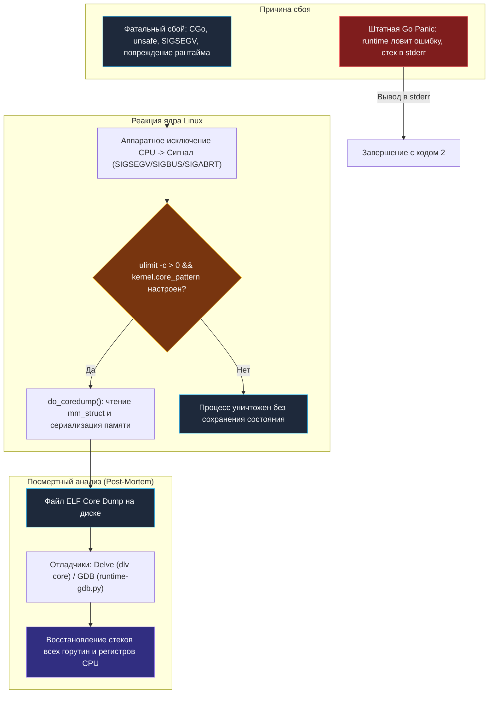
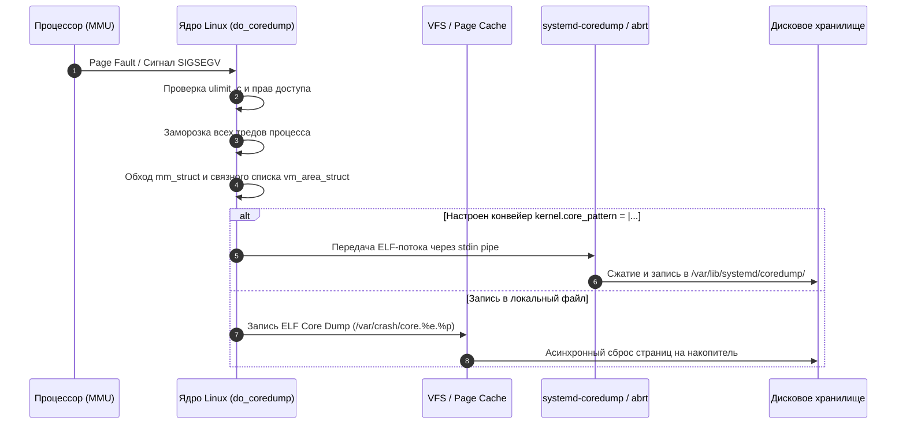
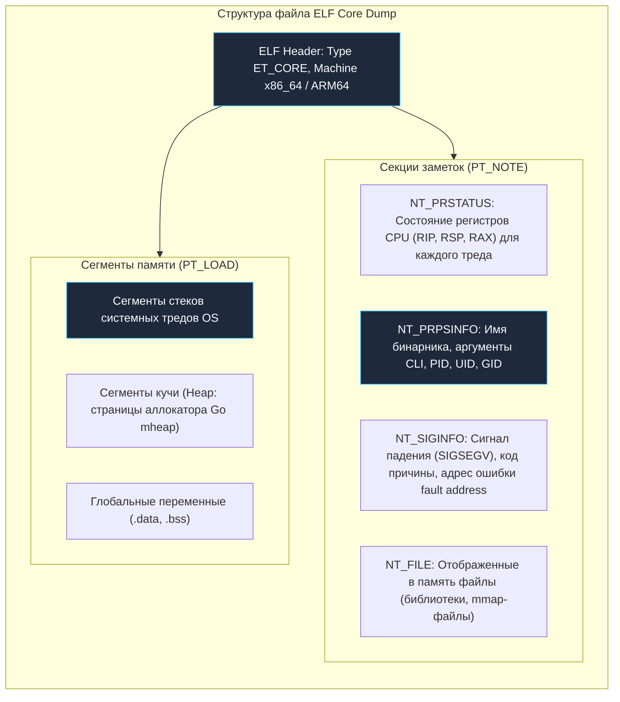
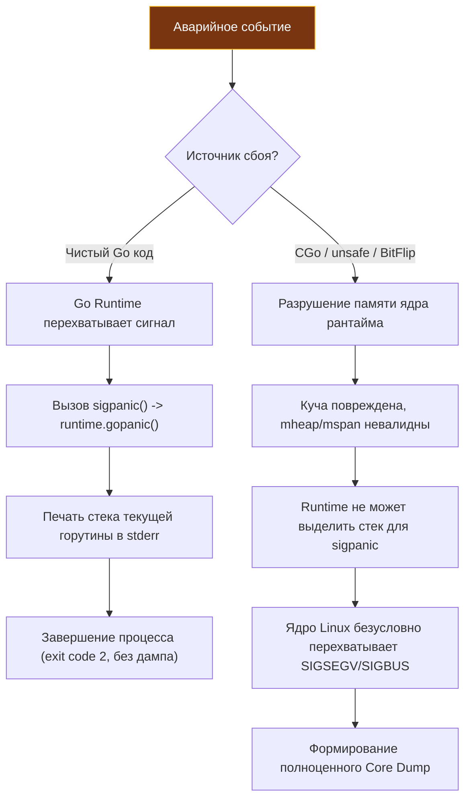

## Что такое Core Dump и зачем он Go-разработчику

Каждый бэкенд-инженер хотя бы раз в карьере сталкивался с леденящей душу ситуацией: высоконагруженный сервис в продакшене внезапно перестает отвечать, процесс мгновенно и бесследно исчезает из таблицы процессов, а в стандартном журнале `stderr` зияет абсолютная пустота. Никаких привычных логов, никаких удобных трассировок Go-паники. Процесс испарился, унеся причину катастрофы с собой в небытие.

В подобных инцидентах единственным надежным инструментом расследования (post-mortem debugging) становится **Core Dump** (дамп памяти процесса) — точный снимок всего виртуального адресного пространства программы в момент ее аварийной гибели. Это своеобразный «черный ящик» самолета: дамп сохраняет полный срез оперативной памяти процесса, регистры всех физических ядер CPU, отображенные библиотеки, открытые файловые дескрипторы и состояние всех системных потоков операционной системы.

Многие разработчики ошибочно полагают, что встроенного механизма паники в Go (`panic`) вполне достаточно для диагностики любых сбоев. Однако стандартный `panic-стек` языка Go выводит в консоль информацию только о *текущей* упавшей горутине. Он бессилен, если сбой вызван:
*   Разрушением памяти (memory corruption) в CGo-библиотеке или коде на C/C++.
*   Некорректным использованием низкоуровневых операций с пакетом `unsafe` (разыменование битых указателей).
*   Аппаратными прерываниями процессора (`SIGBUS`, `SIGSEGV`).
*   Сложнейшими гонками данных (Data Race), которые повреждают внутренние управляющие структуры самого Go Runtime (`runtime.mheap`, списки горутин).

В продакшене без централизованно настроенного сбора дампов памяти вы теряете до 80% критической информации, необходимой для фундаментального анализа первопричин (Root Cause Analysis).



## Как ОС создаёт Core Dump (Под капотом)

Когда процесс сталкивается с неисправимой ошибкой адресации памяти или получает сигналы терминации по умолчанию (`SIGSEGV`, `SIGBUS`, `SIGABRT` или `SIGQUIT`), аппаратный процессор генерирует прерывание, и управление перехватывает ядро Linux.

Если для процесса активирована генерация дампа памяти (параметр `ulimit -c` больше нуля), ядро инициирует процедуру посмертного сохранения данных через внутреннюю функцию `do_coredump()`.

### Маршрутизация дампа: `sysctl kernel.core_pattern`

Ключевым механизмом ядра, определяющим судьбу аварийного снимка, является системная переменная `sysctl kernel.core_pattern`. Она может принимать два принципиально разных формата:

1.  **Прямая запись в локальный файл:**  
    Например, `kernel.core_pattern = /var/crash/core.%e.%p`, где `%e` — имя исполняемого файла, а `%p` — PID упавшего процесса. В этом случае ядро самостоятельно создает файл на диске и последовательно сбрасывает страницы памяти через слой VFS.
2.  **Перенаправление в конвейер (Piped Core Dump):**  
    Если значение начинается с символа конвейера `|`, ядро запускает указанный системный демон и передает ему поток байтов дампа через стандартный ввод (stdin). В современных дистрибутивах Linux с `systemd` используется конвейер вида:  
    `|/usr/lib/systemd/systemd-coredump %p %u %s %t %c %h %E`.  
    Демон `systemd-coredump` сжимает дамп алгоритмом zstd/lz4, регистрирует метаданные в системном журнале и сохраняет сжатый архив в `/var/lib/systemd/coredump/`.



### Анатомия сохранения памяти в ядре

Внутри функции `do_coredump()` ядро Linux выполняет филигранную работу:
1.  **Блокировка и обход адресного пространства:** Ядро обращается к дескриптору памяти процесса `mm_struct`.
2.  **Считывание областей памяти:** Проходит по древовидной структуре (красно-черному дереву и связному списку) `vm_area_struct` (VMA) — структурам, описывающим каждый выделенный виртуальный регион (пользовательский стек, кучу brk/mmap, анонимные страницы, разделяемую память).
3.  **Формирование структуры ELF:** Ядро формирует стандартный исполняемый файл формата `ELF Core Dump`, содержащий сегменты `PT_LOAD` и информационные секции `PT_NOTE`.

**Важный нюанс производительности и безопасности:**  
Запись дампа выполняется в контексте пространства ядра. Если процесс занимал десятки гигабайт в оперативной памяти, а диск перегружен или работает по медленной сети (NFS), операция сброса дампа может затянуться на десятки секунд. Все это время физические страницы памяти остаются занятыми, что может спровоцировать системный OOM-killer (`OOM`) для соседних сервисов, если память сервера исчерпана.

> [!warning] Ловушка / Gotcha
> **Опасность потери дампа в конвейере:**  
> Если переменная `kernel.core_pattern` настроена на конвейерную обработку, а системный сервис-приемник (`systemd-coredump` или `abrt`) дал сбой, перегружен по памяти или не имеет свободного места на диске, ядро молча оборвет пайп, и дамп будет потерян навсегда. В продакшене регулярно проверяйте статус системных журналов `coredumpctl`. Вторая по распространенности причина отсутствия дампов — жесткий лимит окружения: если в конфигурации systemd-юнита не задано `LimitCORE=infinity`, значение `ulimit -c` по умолчанию равно `0`, что полностью блокирует создание дампов ядром.

## Что внутри Core Dump файла?

Файл дампа памяти представляет собой стандартный бинарный контейнер формата ELF (Executable and Linkable Format) с типом `ET_CORE`. В отличие от обычных бинарников, в нем отсутствуют секции исходного машинного кода `.text` (они подгружаются отладчиком из самого бинарного файла сервиса), но присутствуют служебные блоки `PT_NOTE` и срезы страниц оперативной памяти `PT_LOAD`.



Основные информационные блоки `PT_NOTE`:
*   `NT_PRSTATUS`: Содержит моментальный снимок аппаратных регистров процессора (RIP — указатель инструкций, RSP — указатель вершины стека, RAX, RBX и др.) индивидуально для *каждого* системного потока ОС. Именно отсюда отладчик извлекает адрес места падения.
*   `NT_PRPSINFO`: Содержит сводную информацию о процессе: имя исполняемого файла, параметры командной строки, состояние зомби/сна, эффективные UID и GID.
*   `NT_SIGINFO`: Хранит детальную причину крушения: номер сигнала (`SIGSEGV`, `SIGBUS`, `SIGABRT`), код причины (например, `SEGV_MAPERR` — обращение по немаппированному адресу) и сам сбойный адрес памяти (fault address).
*   `NT_FILE`: Таблица маппинга адресов виртуальной памяти на физические файлы на диске (для сегментов памяти, разделяемых библиотек и файлов, открытых через системный вызов `mmap`).
*   **Срезы тредов ОС:** Включают все системные потоки ядра. В контексте среды исполнения Go это системные потоки `M` (Machine), привязанные к логическим процессорам `P` (Processor), и их системные стеки.

> [!important] Важнейший нюанс Go-разработки
> Файл Core Dump сохраняет физическую память системных потоков ОС и их машинные стеки. Но горутины в Go — это структуры уровня пространства пользователя! Стеки горутин (`stacks`) динамически размещаются рантаймом в общей куче (`heap`). В дампе памяти **нет готовой таблицы горутин** в понятном для ядра виде. Чтобы превратить набор байтов дампа в осмысленный список горутин `G`, отладчик должен обладать логикой парсинга внутренних структур Go Runtime.

## Go Runtime vs Core Dump

В нормальных условиях среда исполнения Go бережно изолирует программиста от сурового мира системных прерываний. Когда в коде происходит деление на ноль или разыменование нулевого указателя на уровне языка, Go Runtime перехватывает системное исключение, превращает его в штатную панику (`panic`) и выполняет контролируемое завершение:

```text
panic: runtime error: invalid memory address or nil pointer dereference
[signal SIGSEGV: code=0x1 addr=0x0 pc=0x45a1b2]

goroutine 1 [running]:
main.processData(...)
    /app/main.go:42 +0x22
```

Это поведение обрабатывается внутренним планировщиком: функция `sigpanic` вызывает `runtime.gopanic`, раскручивает стек вызвавшей горутины, выводит читаемый отчет в консоль и завершает процесс с кодом `2`. Это так называемая `fatal error` или штатная паника — она **не создает Core Dump**.

Однако наступают ситуации, когда сам защитный каркас Go Runtime оказывается бессилен:



> [!info] Под капотом
> Начиная с версии Go 1.11, рантайм хранит дескрипторы горутин в управляемой куче. При возникновении `SIGSEGV` диспетчер сигналов рантайма пытается инициализировать специальную процедуру `sigpanic`, которая раскручивает стек через `runtime.gopanic`. Но если повреждена куча, стек системного потока `g0` или глобальная таблица дескрипторов горутин, сам рантайм мгновенно терпит крах. В этот момент управление возвращается ядру Linux, и Core Dump становится единственным в мире источником истины, способным показать истинную картину катастрофы.

## Анализ падений: Практика и инструменты

Имея на руках бинарный файл с отладочной информацией (скомпилированный без усечения символов `-w -s`) и файл дампа памяти, инженер может приступить к детальному расследованию.

Для анализа дампов процессов Go применяются три основных инструмента:

### 1. Delve (`dlv core`) — Нативный выбор для Go

Delve изначально проектировался с глубоким пониманием структур рантайма Go. Он нативно умеет находить структуры `G`, читать стек горутин из кучи и сопоставлять локальные переменные:

```bash
# Запуск анализа дампа: dlv core <путь_к_бинарнику> <путь_к_дампу>
dlv core ./bin/myapp /var/crash/core.myapp.12345

# Внутри интерактивной консоли Delve:
(dlv) goroutines              # Показать список ВСЕХ горутин и их статусы
(dlv) goroutine 42            # Переключиться на контекст конкретной горутины
(dlv) stack                   # Распечатать трассировку вызовов (backtrace)
(dlv) locals                  # Распечатать значения локальных переменных в кадре
(dlv) registers               # Посмотреть регистры процессора на момент падения
```

### 2. GDB с плагином Go Runtime

Классический отладчик GNU Debugger (`gdb core` / `gdb -c core`) работает на уровне машинного кода процессора. Чтобы GDB научился понимать горутины, необходимо подключить специальный python-скрипт отладки, поставляемый в составе дистрибутива Go:

```bash
# Запуск классического отладчика GDB
gdb -c core.myapp.12345 ./bin/myapp

# В консоли GDB загружаем плагин рантайма Go:
(gdb) source /usr/lib/golang/go/src/runtime/runtime-gdb.py
(gdb) info goroutines         # Список всех горутин в памяти
(gdb) goroutine 1 bt          # Раскрутить бэктрейс для горутины номер 1
(gdb) bt                      # Машинный стек системного потока (thread backtrace)
```

### 3. Быстрая консольная диагностика: `pstack` и `crash`

*   `pstack <pid>` или извлечение `bt` из дампа: утилита `pstack core` позволяет моментально распечатать стеки всех физических потоков без запуска интерактивной сессии отладчика.
*   `crash`: системный отладчик ядра, используемый в ситуациях, когда упал не прикладной сервис, а само ядро Linux (генерация аварийного дампа ядра `vmcore`).

> [!tip] Собеседование
> **Вопрос:** Возможно ли обнаружить утечку памяти (Memory Leak) или состояние гонки (Race Condition) исключительно по файлу Core Dump?  
> **Ответ:**  
> 1. **Состояние гонки (Data Race):** Дамп памяти фиксирует статический моментальный снимок одного такта времени. Состояние гонки — это динамическая временная аномалия (нарушение порядка доступа к памяти во времени). Дамп не покажет последовательность событий, приведшую к сбою, хотя может зафиксировать разрушенные указатели. Для ловли гонок необходимо использовать флаг компиляции `go run -race` (ThreadSanitizer) или динамический анализ через `valgrind` в CGo.  
> 2. **Утечка памяти (Memory Leak):** Дамп позволяет обнаружить утечку памяти. Отладчик Delve (`dlv core core`, команда `heap`) или GDB позволяют инспектировать глобальную кучу `runtime.mheap`. Анализируя распределение блоков `mspan` и центральных кэшей `mcentral`, можно вычислить, какие именно структуры занимают гигабайты адресного пространства (например, бесконечно растущий срез или неудаленные записи в `map`).

## Ловушки и особенности в продакшене

Эксплуатация механизмов сбора дампов в высоконагруженных распределенных системах сопряжена с рядом серьезных инженерных вызовов:

1.  **Ловушка нулевого размера (Пустые дампы):**  
    В подавляющем большинстве дистрибутивов Linux размер дампа по умолчанию ограничен нулем (`ulimit -c 0`). Если не переопределить это значение через команду оболочки `ulimit -c unlimited` или директиву `LimitCORE=infinity` в конфигурационном файле systemd, ядро проигнорирует падение, и файл не появится. Также проверьте параметры ядра `kernel.core_uses_pid` и `sysctl vm.core_uses_pid=0` (рекомендуется выставлять в `1` для добавления PID к имени файла, чтобы дампы нескольких падений не перезаписывали друг друга).
2.  **Гигантские дампы и дисковый коллапс:**  
    Дамп включает все страницы анонимной памяти процесса. Если Go-сервис хранил в памяти in-memory кэш на 32 ГБ, файл дампа займет ровно 32 ГБ дискового пространства! Падение десятка реплик такого сервиса мгновенно забьет дисковый накопитель сервера, спровоцировав каскадный отказ других служб.  
    **Решение:** Настраивайте конвейерную компрессию на лету через `kernel.core_pattern` с вызовом архиватора (`|/usr/bin/bzip2 > /var/crash/core.%e.%p.bz2`) или используйте менеджер `systemd-coredump`, в конфигурации которого (`/etc/systemd/coredump.conf`) заданы жесткие лимиты `MaxUse` и `KeepFree`.
3.  **Асинхронный сброс и блокировки ввода-вывода (I/O hang):**  
    Если сервис завис в блокирующем системном вызове ввода-вывода (`write` в перегруженный сетевой сокет или медленную сетевую файловую систему NFS), ядро попытается перевести процесс в состояние генерации дампа, но не сможет завершить операцию до ответа от драйвера файловой системы. В результате процесс надолго зависает в состоянии D (Uninterruptible Sleep).
4.  **Управление дампами через `coredumpctl`:**  
    В современных дистрибутивах Linux с systemd ручной поиск дампов по файловой системе не требуется. Используйте стандартные инструменты:
    *   `coredumpctl list` — вывод таблицы всех недавних падений сервисов с указанием PID, сигналов и времени.
    *   `coredumpctl dump <pid>` — безопасное извлечение и распаковка дампа конкретного процесса в локальный файл для последующего анализа в Delve.
    *   `coredumpctl debug <pid>` — мгновенный запуск gdb на сохраненном дампе в одну команду.

## Итог

1.  **Core Dump** — это полный слепок виртуального адресного пространства процесса в момент аварии. Он незаменим для post-mortem расследования падений, вызванных сбоями CGo, `unsafe`-указателей или разрушением внутренних структур самого Go Runtime.
2.  **Архитектура ядра Linux:** Генерация дампа выполняется функцией `do_coredump()`, которая обходит `mm_struct` и структуры `vm_area_struct`, формируя файл формата `ELF Core Dump` с информационными блоками `PT_NOTE` (`NT_PRSTATUS`, `NT_PRPSINFO`, `NT_SIGINFO`).
3.  **Go Runtime и дампы:** Встроенная паника Go (`panic`) защищает процесс от простых ошибок, но бессильна перед повреждением кучи и системными сигналами `SIGSEGV`/`SIGBUS`. Дамп памяти позволяет восстановить полную картину состояния всех горутин `G`, потоков `M` и структур аллокатора (`mheap`, `mcentral`, `mspan`).
4.  **Инструментарий расследования:** Delve (`dlv core`) предоставляет нативную поддержку структур данных Go и горутин. Классический GDB (`gdb -c core`) требует подключения скрипта `runtime-gdb.py`.
5.  **Надежность продакшена:** Всегда следите за лимитами `ulimit -c`, настраивайте сжатие дампов через `systemd-coredump` и применяйте утилиты `coredumpctl list` и `coredumpctl dump <pid>` для оперативной локализации инцидентов.

Мы подробно разобрали, как спасти и расшифровать последние мгновения жизни упавшего процесса. Однако высшее инженерное мастерство заключается в том, чтобы диагностировать проблемы производительности, деградацию задержек и утечки ресурсов задолго до того, как сервис упадет в Core Dump. В следующей лекции мы освоим фундаментальный арсенал профилирования и мониторинга живой Linux-системы: встречайте [[60. perf, top, vmstat, iostat и другие инструменты Linux]].
