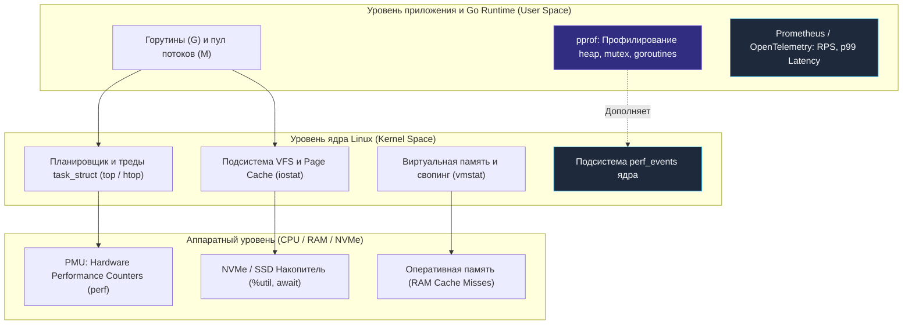
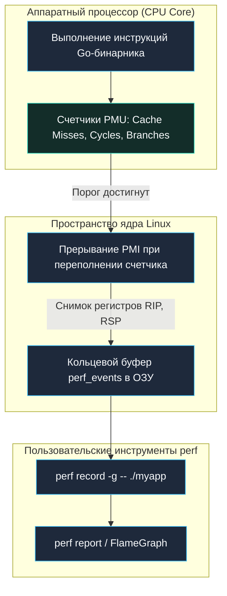
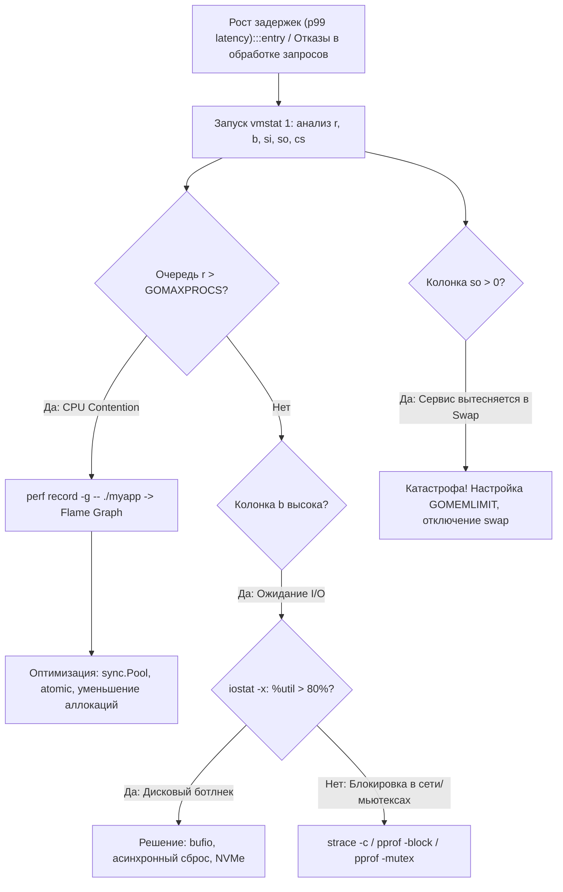

## Введение: От локального дебага к production-наблюдаемости

В экосистемах виртуальных машин (Java, C#) или интерпретируемых языков (PHP, Python, Ruby) инженеры исторически привыкли опираться на тяжелые встроенные агенты телеметрии и виртуальные счетчики: VisualVM, Xdebug, jstat, dotnet-counters или async-profiler. В мире Go философия принципиально иная — **Minimalism + Mechanical Sympathy**. Язык Go не пытается переизобрести операционную систему: скомпилированный бинарник взаимодействует напрямую с ядром Linux, а рантайм делегирует учет системных ресурсов стандартным механизмам ядра.

Для Senior и Lead бэкенд-разработчика умение читать вывод классических утилит `top`, `vmstat`, `iostat` и низкоуровневого профилировщика `perf` — это базовый навык «механического сочувствия» к серверу. Когда в часы пиковой нагрузки 99-й процентиль задержки (p99 latency) внезапно взлетает с 5 миллисекунд до 3 секунд, прикладные метрики Prometheus констатируют пожар, но бессильны объяснить его физическую причину.

Вы должны уметь с первого взгляда на терминал отличить:
*   паузу сборщика мусора (GC pause) от катастрофического вытеснения страниц в дисковый swap (`si`/`so`);
*   конкуренцию за мьютекс (`sync.Mutex`) в пространстве пользователя от яростных переключений контекста в планировщике ядра Linux;
*   асинхронный неблокирующий сетевой ввод-вывод (netpoller) от скрытых блокирующих системных вызовов в синхронном режиме I/O.



В этом разделе мы глубоко разберем стандартный арсенал Linux-наблюдаемости, внутреннее устройство ядра, стоящее за каждой метрикой, и специфику интерпретации этих данных для высоконагруженных сервисов на Go.

## top / htop / btop: Глаза поверх процесса

Утилиты семейства `top` (`htop`, `btop`) — это первая линия визуальной диагностики, предоставляющая динамическую картину состояния физических ядер процессора, оперативной памяти и запущенных процессов.

В традиционных языках с моделью 1:1 (где одному потоку приложения строго соответствует один поток ОС, как в Java до прихода Virtual Threads) утилита вроде `jstack` легко отображает каждый тред. Однако язык Go использует **модель планировщика M:N**: миллионы легковесных горутин (`G`) мультиплексируются средой выполнения на сравнительно небольшое число потоков операционной системы (`M`). Поэтому утилиты `top` видят не горутины, а исключительно системные потоки ядра Linux (`task_struct`).

### Под капотом

Утилита `top` не вторгается в память процессов и не использует отладчик `ptrace`. Она периодически считывает псевдофайлы ядра в виртуальной файловой системе `/proc`:
*   `/proc/[pid]/stat` — время процессора, проведенное процессом в пространстве пользователя (utime) и ядра (stime), приоритет nice, состояние (R, S, D, Z).
*   `/proc/[pid]/status` — объем виртуальной (VmSize) и резидентной физической памяти (VmRSS), лимиты дескрипторов, количество потоков (Threads).
*   Системные вызовы `getrusage()` и вызов `sysconf()` для расчета тиков процессорного таймера (clock ticks, `USER_HZ`).

### Go-специфика

```bash
# Показать потоки (M) конкретного Go-процесса в реальном времени
top -p $(pgrep myapp) -H -o %CPU

# Отфильтровать вывод только по пользовательскому времени (без системных вызовов)
top -p $(pgrep myapp) -H -o %us
```

> [!info] Под капотом
> В Go количество системных потоков (`M`) меняется динамически. Количество одновременно исполняемых логических процессоров рантайма определяется параметром `GOMAXPROCS`, который по умолчанию равен числу логических ядер CPU. Если на 4-ядерном сервере вы видите, что Go-процесс утилизирует `400% CPU`, не пугайтесь: это абсолютно нормально. Go полноценно нагружает все физические ядра для параллельных математических вычислений, конкурентного парсинга JSON, сжатия или криптографии TLS.

> [!warning] Ловушка / Gotcha
> **Высокий показатель `%sy` (system time) в `top` для Go-приложения:**  
> Если в строке состояния CPU значение `%us` (user space) составляет 70%, а `%sy` (system space) — 5%, сервис работает эффективно. Но если показатель `%sy` превышает 20–30% от `%us`, это верный индикатор серьезных архитектурных проблем:  
> 1. Лавина системных вызовов: например, микросервис построчно пишет логи в файл через небуферизованный системный вызов `write`.  
> 2. Блокирующие сетевые вызовы в пакетах `net/http` или `database/sql`, приводящие к частому переводу потоков в спящий режим и обратно.  
> 3. Избыточное давление на память, заставляющее Go Runtime и сборщик мусора GC непрерывно дергать системные вызовы ядра `madvise`, `mmap` и `munmap` для возврата страниц операционной системе.  
> В такой ситуации необходимо немедленно провести трассировку через [[24. strace, ltrace и чтение поведения процесса.md]] или `perf`.

## vmstat: Пульс виртуальной памяти и контекстных переключений

Утилита `vmstat` (Virtual Memory Statistics) — пожалуй, самый компактный и информативный инструмент для мгновенной оценки общего здоровья Linux-сервера. Она объединяет в одной строке статистику очереди планировщика (runqueue), активности памяти, подкачки (swapping), блочного ввода-вывода и аппаратных прерываний.

### Ключевые колонки и их интерпретация для Go

Запуск с интервалом обновления в 1 секунду:

```bash
vmstat 1 10
```

```text
procs -----------memory---------- ---swap-- -----io---- -system-- ------cpu-----
 r  b   swpd   free   buff  cache   si   so    bi    bo   in   cs us sy id wa st
 4  0      0 1024340  45212 4312890    0    0     2    34  540 1200 45 12 42  1  0
```

| Колонка | Описание подсистемы ядра | Интерпретация для архитектуры Go-приложения |
| :---: | :--- | :--- |
| **`r`** | **Runnable processes** (длина очереди планировщика CFS/EEVDF). | Количество тредов ОС, готовых к выполнению прямо сейчас. В Go горутины переходят из `Gwaiting` в состояние `runnable` (состояние `block` -> `runnable`). Если значение `r` устойчиво превышает значение `GOMAXPROCS`, на сервере возникла жестокая конкуренция за CPU (CPU contention): процессоры перегружены. |
| **`b`** | **Blocked processes** (потоки в состоянии Uninterruptible Sleep `D`). | Потоки ОС, заблокированные в ожидании дискового ввода-вывода (IO), захвата тяжелых блокировок мьютексов в ядре или медленных синхронных каналов. |
| **`si` / `so`** | **Swap in / Swap out** (подкачка страниц памяти с диска). | **Критический маркер аварии!** Если значение `so > 0`, операционная система выталкивает страницы оперативной памяти на диск. Сборщик мусора Go (GC) периодически обходит всю кучу (heap). Если куча находится в swap, каждый цикл GC приводит к миллионам обращений к диску, вызывая catastrophic latency spikes (секундные зависания сервиса). |
| **`cs`** | **Context switches** (переключения контекста процессора). | Частота переключения регистров CPU между потоками ядра. Высокий показатель `cs` указывает на частую смену системных тредов `M` либо на постоянный переход процессора между Ring 3 (user space) и Ring 0 (ядро). |
| **`wa`** | **IO wait** (простой процессора в ожидании ответа диска). | Доля времени CPU, когда ядра простаивали, потому что все готовые потоки ждали завершения дисковых операций. В Go скрывает блокирующие системные вызовы `read`/`write`. |

> [!tip] Собеседование
> **Вопрос:** Как с помощью `vmstat` быстро диагностировать причину деградации Go-приложения: тормозит ли сервис из-за пауз сборщика мусора GC или из-за банальной нехватки ресурсов CPU?  
> **Ответ:**  
> 1. Если очередь `r` близка к нулю, а показатель `b` (blocked) высокий — приложение заблокировано в ожидании ответа диска, сети или тяжелого системного мьютекса.  
> 2. Если очередь `r` значительно больше количества ядер, а `wa` (iowait) около нуля — имеет место классическая нехватка CPU (CPU saturation).  
> 3. Если в логах приложения с флагом `GODEBUG=gctrace=1` видны длинные паузы STW (Stop-the-World), но показатели `si/so` в `vmstat` равны `0`, а `%sy` минимален — узким местом является неэффективная структура данных в Go (миллионы мелких указателей в куче).  
> 4. Однако если показатель `so > 0`, сервис стал жертвой свопинга: память вытеснена на диск, и сборщик мусора задыхается в дисковых задержках. В продакшене для Go-сервисов свопинг должен быть отключен либо ограничен через `GOMEMLIMIT`.

## iostat: Пульс дисковой подсистемы

Современные бэкенды на Go активно взаимодействуют с блочными накопителями: запись журналов (structured logging), локальное кэширование, загрузка пользовательских файлов, работа с встроенными базами (Badger, BoltDB) и классическими реляционными СУБД (транзакционные журналы WAL, таблицы и индексы).

Утилита `iostat` (из пакета `sysstat`) детально визуализирует производительность дисковых контроллеров и виртуальных устройств.

```bash
# Расширенная статистика по дискам с шагом в 1 секунду (5 итераций)
iostat -x 1 5
```

### Ключевые метрики

```text
Device            r/s     w/s     rkB/s     wkB/s   await  %util
nvme0n1         12.00  450.00    128.00  18450.00    0.85  82.40
```

*   **`%util` (Утилизация устройства):** Процент времени, в течение которого контроллер устройства обрабатывал хотя бы один активный запрос. Значение свыше **`80%`** означает, что накопитель близок к насыщению своей пропускной способности.
*   **`await` (Среднее время ожидания, мс):** Полное время выполнения одного запроса на чтение/запись. Включает как время нахождения запроса в системной очереди диспетчера ввода-вывода (I/O scheduler), так и физическое исполнение контроллером SSD/NVMe.
*   **`r/s` и `w/s`:** Количество завершенных операций чтения и записи в секунду (IOPS).
*   **`rkB/s` и `wkB/s`:** Объем прочитанных и записанных данных в килобайтах в секунду (пропускная способность / throughput).

### Go-специфика

По умолчанию стандартная библиотека Go использует **Page Cache** ядра Linux для всех операций с файлами (`os.File`). Это означает, что при записи данные копируются из пользовательского буфера `[]byte` в оперативную память ядра (страничный кэш). Системный вызов завершается практически мгновенно, но позже ядро сбрасывает «грязные» страницы на диск через фоновые потоки `flusher/kworker`.

```mermaid
flowchart LR
    classDef process  fill:#1e293b,stroke:#38bdf8,stroke-width:1px,color:#f8fafc
    classDef success  fill:#064e3b,stroke:#34d399,stroke-width:1px,color:#f8fafc
    classDef error    fill:#7f1d1d,stroke:#f87171,stroke-width:1px,color:#f8fafc
    classDef warning  fill:#78350f,stroke:#fbbf24,stroke-width:1px,color:#f8fafc
    classDef entry    fill:#1e3a5f,stroke:#38bdf8,stroke-width:2px,color:#f8fafc
    classDef aux      fill:#334155,stroke:#64748b,stroke-width:1px,color:#f8fafc
    classDef system   fill:#312e81,stroke:#a78bfa,stroke-width:1px,color:#f8fafc
    classDef data     fill:#132d29,stroke:#2dd4bf,stroke-width:1px,color:#f8fafc
    classDef network  fill:#881337,stroke:#fb7185,stroke-width:1px,color:#f8fafc
    classDef accent   fill:#1e1b4b,stroke:#818cf8,stroke-width:1px,color:#f8fafc
    subgraph GoApp ["Go-приложение"]
        Buffer["Буфер памяти ([]byte)"]
    end

    subgraph KernelVFS ["Ядро Linux: Page Cache"]
        PageCache["Страничный кэш (Dirty Pages)"]
        IOScheduler["Планировщик ввода-вывода (I/O Queue)"]
    end

    subgraph StorageHardware ["Накопитель (NVMe / SSD)"]
        DiskController["Контроллер (%util, await)"]
    end

    Buffer -->|os.File.Write()| PageCache
    PageCache -.->|Фоновый сброс (writeback)| IOScheduler
    IOScheduler -->|r/s, w/s, rkB/s, wkB/s| DiskController
```

> [!info] Под капотом
> Если Go-приложению требуется обойти страничный кэш ядра (Direct I/O) для предотвращения двойного кэширования или реализации высокопроизводительного журнала WAL, используются вызовы `mmap` или новейший интерфейс `io_uring` (поддерживаемый в современных ядрах Linux 5.1+ и библиотеках Go).  
> Если вы наблюдаете тревожную картину: показатель `%util` зашкаливает за 90%, а пропускная способность `wkB/s` мала, значит, накопитель захлебывается в миллионах мелких синхронных записей. В Go это лечится:
> 1. Обязательным оборачиванием дисковых дескрипторов в буферизованный писатель `bufio.NewWriterSize()`.
> 2. Использованием асинхронного пакетного сброса (batching / group commit).
> 3. Переходом на `io_uring` для параллельной отправки дисковых запросов без блокировки тредов `M`.

## perf: Hardware counters и профилирование

Если стандартный профайлер Go `pprof` — это взгляд на программу «изнутри» (с точки зрения структур рантайма), то **`perf`** — это тяжелая артиллерия низкоуровневого анализа, позволяющая исследовать программу «снаружи», со стороны кремниевого кристалла и ядра Linux.

Инструмент `perf` опирается на подсистему ядра `perf_events` и аппаратные счетчики производительности процессора (**PMU — Performance Monitoring Unit**). Он позволяет с абсолютной точностью замерять: такты процессора, промахи мимо кэша L1/L2/L3 (Cache Misses), количество неверно предсказанных ветвлений (Branch Mispredictions), межъядерную инвалидацию строк кэша (False Sharing) и скрытые микропаузы на системных вызовах.

### Как работает perf

1.  **Конфигурация счетчиков:** Ядро программирует регистры PMU процессора на генерацию прерывания при наступлении заданного числа аппаратных событий (например, каждые 100 000 выполненных инструкций или промахов кэша L3).
2.  **Аппаратное прерывание:** Процессор генерирует прерывание PMI (Performance Monitoring Interrupt), и ядро Linux перехватывает управление.
3.  **Запись в кольцевой буфер:** Ядро считывает текущий указатель команд (Instruction Pointer, RIP) и стек вызовов, записывая срез события в разделяемый кольцевой буфер (ring buffer).
4.  **Анализ:** Пользовательская утилита `perf` считывает ring buffer и формирует детализированную статистическую картину выполнения кода.



### Профилирование Go-приложения

```bash
# Запись профиля работы Go-приложения с частотой сэмплирования 99 Hz и раскруткой стеков
perf record -g -F 99 -- ./myapp

# Интерактивный отчет по самым горячим символам и динамическим библиотекам
perf report --sort=dso,symbol

# Построение векторного Flame Graph (используя утилиты Брендана Грегга)
perf script | stackcollapse-perf.pl | flamegraph.pl > flame.svg
```

> [!warning] Ловушка / Gotcha
> **Раскрутка стеков вызовов Go в `perf`:**  
> Исторически утилита `perf` не могла корректно раскручивать стеки Go-приложений, поскольку Go использовал нестандартные соглашения о вызовах и сегментированные стеки горутин, динамически перемещаемые в куче.  
> Чтобы `perf` безошибочно отображал имена функций и иерархию вызовов Go-кода:  
> 1. Никогда не компилируйте бинарники для нагрузочного профилирования с флагами усечения отладочных символов `-ldflags="-s -w"`. Флаги `-s -w` удаляют таблицу символов и DWARF-информацию.  
> 2. В современных версиях Go (1.18+) компилятор формирует полноценную раскрутку кадров стека на базе регистров (frame pointers включены по умолчанию).  
> 3. При сборе профиля явно указывайте отладчику использовать информацию DWARF: `perf record --call-graph dwarf` или собирайте с флагом `-buildmode=pie`. Для точечной отладки рантайма можно активировать экспериментальные флаги вроде `GOEXPERIMENT=strictfipsruntime` или диагностические переменные `GODEBUG=gctrace=1,asyncpreempt=1`.

> [!tip] Собеседование
> **Вопрос:** В чем фундаментальная разница между профилированием через встроенный инструмент Go `pprof` и системным профилировщиком Linux `perf`? Когда какой инструмент выбирать?  
> **Ответ:**  
> *   **`pprof`** — это высокоуровневый профилировщик пространства пользователя (User Space), встроенный в Go Runtime. Он глубоко понимает внутренние сущности языка: логические горутины, каналы, планировщик, структуру кучи (heap), аллокации памяти и точки блокировки мьютексов (`sync.Mutex`, `sync.RWMutex`). Но он не видит того, что происходит внутри ядра Linux или на аппаратных шинах CPU.  
> *   **`perf`** — это низкоуровневый системный инструмент ядра и железа (Kernel & Hardware Space). Он оперирует физическими тактами CPU, кэш-промахами (L1/L2/L3 miss), сбросами конвейера, задержками системных вызовов и межъядерными транзакциями.  
> **Идеальный инженерный пайплайн:** сначала запускаем `pprof`, чтобы локализовать узкое место в алгоритмах Go; если код чист, но процессор перегружен — подключаем `perf`, чтобы выявить промахи кэша, ложное разделение строк памяти (false sharing) или накладные расходы системных вызовов в ядре.

## Go-специфика: Как читать эти инструменты для бэкенда

Ниже представлена проверенная архитектурная схема расследования деградации производительности в высоконагруженных распределенных сервисах:



### Практические сценарии

1.  **Паузы сборщика мусора вызывают всплески латентности (Latency Spikes):**
    *   *Симптомы:* В `top` наблюдаются резкие цикличные провалы `%us`, в `vmstat` кратковременно растет колонка `b`, внешние HTTP-клиенты получают таймаут.
    *   *Проверка:* Запуск сервиса с флагом `GODEBUG=gctrace=1 | grep gcwait` или снятие профиля аллокаций `pprof -alloc_objects`.
    *   *Лечение:* Временная корректировка `GOGC=50`, радикальное снижение аллокаций в горячих циклах через повторное использование буферов с помощью пула `sync.Pool`, замена динамических срезов `[]byte` на `mmap`.
2.  **Утечка горутин (Goroutine Leak):**
    *   *Симптомы:* В `top` показатель RSS (физическая память процесса) монотонно растет линейно вверх; со временем в `vmstat` начинает расти колонка подкачки `si`/`so`.
    *   *Проверка:* Снятие дампов памяти `pprof -inuse_space` или профилирование общего объема аллокаций `pprof -alloc_space`, а также проверка эндпоинта `/debug/pprof/goroutine?debug=1`.
    *   *Лечение:* Поиск горутин, заблокированных на незакрытых каналах, зависших контекстах `context.Context` или сетевых клиентах `net/http` без выставленных таймаутов `Timeout`.
3.  **Яростная конкуренция за процессор на мьютексах (Lock Contention):**
    *   *Симптомы:* В `top` фиксируется аномально высокий системный процент времени `%sy`, в `vmstat` число переключений контекста `cs` достигает сотен тысяч в секунду.
    *   *Проверка:* Запуск `perf sched` для анализа переключений контекста планировщика или вызов `perf c2c` для выявления ложного разделения кэш-линий (Last Cache Miss).
    *   *Лечение:* Замена тяжелого эксклюзивного `sync.Mutex` на разделяемый `sync.RWMutex`, шардирование глобальных структур данных (sharded map), максимальное сокращение критических секций и переход на атомарные операции `atomic`.

## Сравнение с другими языками

| Аспект наблюдаемости | Экосистема Java (JVM) | Экосистема .NET (CLR) | Язык Go |
| :--- | :--- | :--- | :--- |
| **Мониторинг процессов** | `jcmd`, `VisualVM` | `dotnet-counters` | Стандартные системные утилиты Linux: `top`, `htop`, `btop` |
| **Анализ памяти и GC** | `jstat`, `jmap` | `dotnet-gcdump` | Переменные рантайма `GODEBUG=gctrace=1`, встроенный эндпоинт `pprof` |
| **Низкоуровневое профилирование** | `async-profiler` | `dotnet-trace` | Аппаратный `perf`, встроенный `pprof` |
| **Трассировка системных вызовов** | `strace`, `ltrace` | `dotnet-trace` | Нативные утилиты ядра: `strace`, `iostat`, eBPF |

Ключевое преимущество философии Go заключается в **глубокой гармонии со стандартными системными утилитами Linux**. Инженеру DevOps или SRE не нужно настраивать тяжелые проприетарные агенты или открывать отдельные отладочные порты: достаточно подключиться к производственному серверу через SSH и за считанные секунды развернуть полную картину происходящего на уровне ядер, шин памяти и контроллеров дисков.

## Итог

1.  **Фундамент наблюдаемости:** Инструменты `top`, `vmstat`, `iostat` и `perf` образуют незаменимый базис системной диагностики Go-приложений, отображая реальное поведение сервиса на стыке пространства ядра и аппаратного обеспечения.
2.  **Потоки M:N:** Утилита `top` показывает физические потоки операционной системы (`M`), а не прикладные горутины (`G`). Высокий системный процент времени `%sy` — верный маркер избыточных системных вызовов (`write`, `madvise`).
3.  **Метрики памяти:** В утилите `vmstat` появление любых ненулевых значений в колонке сброса подкачки `so > 0` означает катастрофу для Go-сервиса: циклы сборщика мусора GC в сочетании со свопингом парализуют время отклика системы.
4.  **Дисковая подсистема:** Утилита `iostat` отражает эффективность страничного кэша ядра (Page Cache) и насыщение диска (`%util`, `await`). Высокая нагрузка устраняется буферизацией в `bufio` или интерфейсом `io_uring`.
5.  **Аппаратное профилирование:** Системный инструмент `perf` использует аппаратные счетчики PMU для поиска промахов кэша и узких мест в коде без искажений рантайма, идеально дополняя прикладной профайлер `pprof`.

Мы научились всесторонне оценивать состояние операционной системы и железа с помощью классических утилит Linux. Но что делать, если вам требуется проводить непрерывный, сверхглубокий и безопасный аудит системных вызовов, сетевых сокетов и скрытых утечек без малейших накладных расходов на переключение контекста и без перезапуска сервисов? В следующей лекции мы откроем революционную технологию современной инженерии: добро пожаловать в мир [[61. eBPF. Современный способ наблюдать за ОС.md]].
