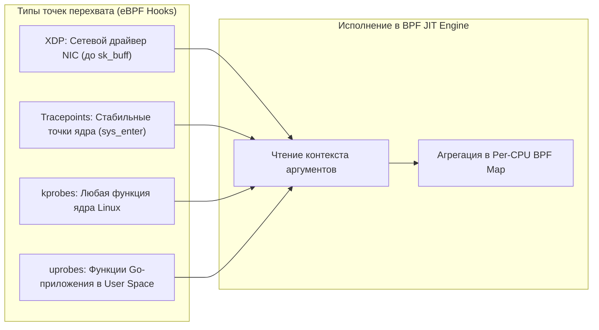
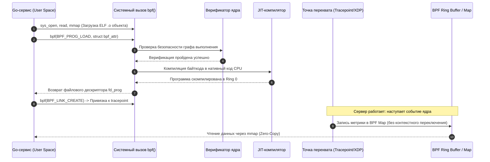

## eBPF: Расширяемый фильтр пакетов как универсальный инструмент наблюдения

В истории операционных систем долгое время существовала фундаментальная дилемма: как безопасно расширить возможности ядра Linux или получить глубокую телеметрию без риска обрушить всю систему? Исторически существовало два пути:
1.  **Изменение исходного кода ядра:** наложить патчи, перекомпилировать ядро и перезагрузить сервера. Для промышленной эксплуатации и облачных кластеров этот путь неприемлем из-за колоссальной инерции и риска простоя.
2.  **Загружаемые модули ядра (LKM — Loadable Kernel Modules):** написать драйвер на C и загрузить его в память ядра. Но модуль ядра исполняется в Ring 0 с неограниченными привилегиями: малейшая ошибка в арифметике указателей, разыменование NULL или бесконечный цикл немедленно приводят к фатальной панике ядра (`panic`) и падению всей физической машины.

Традиционные агенты мониторинга пользовательского пространства (`node_exporter`, `telegraf`, `sysdig`) вынуждены постоянно сканировать файловую систему `/proc` и `/sys`, выполнять тысячи тяжелых системных вызовов `stat` и тратить до 10–15% ресурсов CPU исключительно на сбор телеметрии.

Революционным прорывом, изменившим ландшафт системного программирования, стала технология **eBPF (extended Berkeley Packet Filter)**. Подобно тому как язык JavaScript превратил статичные веб-страницы в динамические интерактивные приложения, eBPF превратил статическое монолитное ядро Linux в программируемую платформу. eBPF позволяет разработчикам загружать и исполнять произвольный пользовательский байткод прямо в контексте ядра Linux — безопасно, динамически, без перезагрузки системы и с околонулевыми накладными расходами.

Для Go-разработчика eBPF — это суперсила нового поколения: возможность отслеживать системные вызовы, исследовать сетевые задержки на уровне драйвера сетевой карты, замерять время блокировки мьютексов `sync.Mutex` и профилировать вызовы функций Go с помощью пользовательских зондов (uprobes) без малейшей модификации исходного кода сервиса.

```mermaid
flowchart TD
    subgraph UserSpace ["Пространство пользователя (User Space)"]
        GoApp["Go-сервис / Агент наблюдения (cilium/ebpf)"]
        TradAgent["Традиционные агенты: node_exporter, telegraf"]
        ProcFS["/proc и /sys: непрерывный опрос (polling)"]
    end

    subgraph KernelSpace ["Пространство ядра (Kernel Space)"]
        subgraph eBPF_Subsystem ["Подсистема eBPF в ядре Linux"]
            Verifier["Статический верификатор (Verifier)"]
            JIT["JIT-компилятор (Машинный код CPU)"]
            BPFVM["Исполняемая среда eBPF"]
            BPFMaps["BPF Maps & Ring Buffer (Разделяемая память)"]
        end
        
        Hooks["Точки перехвата: kprobes, tracepoints, XDP, cgroups"]
        Syscalls["Обработчики syscalls (read, write, epoll_wait)"]
    end

    TradAgent -->|Периодический опрос (stat, open)| ProcFS
    ProcFS -.->|Высокий оверхед CPU| Syscalls

    GoApp -->|Загрузка байткода bpf()| Verifier
    Verifier -->|Гарантия безопасности| JIT
    JIT --> BPFVM
    Hooks -->|Срабатывание события| BPFVM
    BPFVM -->|Запись метрик| BPFMaps
    BPFMaps -->|mmap (Zero-Copy)| GoApp
```

## Как eBPF работает под капотом

Архитектура eBPF представляет собой полноценную регистровую виртуальную машину (11 регистров общего назначения по 64 бита, счетчик команд и стек), встроенную непосредственно в ядро Linux. Безопасность и феноменальная скорость технологии гарантируются четырьмя взаимосвязанными подсистемами:

### 1. Верификатор (Verifier)

Перед тем как любая программа eBPF будет допущена к выполнению в ядре, она проходит через жесточайший статический анализ со стороны Верификатора ядра. Верификатор моделирует все возможные пути выполнения инструкций (граф потока управления) и гарантирует:
*   **Защита от зависаний:** отсутствие бесконечных циклов. В современных версиях ядра (Linux 5.3+) циклы разрешены, но они обязаны иметь статически доказанную верхнюю границу итераций (лимит сложности до 1 миллиона инструкций).
*   **Фиксированный стек:** размер стека жестко ограничен **512 байтами** на кадр вызова. Стек не может динамически расти, предотвращая переполнение стека ядра (kernel stack overflow).
*   **Абсолютная безопасность памяти:** запрещены произвольные разыменования сырых указателей и косвенные вызовы функций. Чтение и запись разрешены только в строго валидированные структуры контекста ядра или специальные BPF-карты памяти.
*   **Чистота ресурсов:** невозможность утечки системных дескрипторов.

Благодаря верификатору, программа eBPF в принципе не способна вызвать панику ядра (`panic`) или нарушить целостность структур памяти соседних процессов, что делает ее несравнимо надежнее классических перехватов через `kprobes` или инъекций библиотек через `LD_PRELOAD`.

### 2. JIT-компилятор (Just-In-Time)

После того как верификатор подтвердил абсолютную безопасность байткода, встроенный JIT-компилятор ядра компилирует инструкции eBPF непосредственно в нативный машинный код физического процессора (x86-64, ARM64 или RISC-V). Трансляция выполняется ровно один раз при загрузке. В дальнейшем программа исполняется процессором на предельной скорости кремния, идентично нативному C-коду ядра Linux.

### 3. BPF Maps (Карты)

Пользовательское приложение на Go и программа eBPF внутри ядра работают в совершенно разных адресных пространствах и не могут обращаться к переменным друг друга напрямую. Для мгновенного и безопасного обмена состоянием используются **BPF Maps (карты памяти BPF)** — специализированные структуры данных в памяти ядра:
*   Хэш-таблицы (`BPF_MAP_TYPE_HASH`) и плоские массивы (`BPF_MAP_TYPE_ARRAY`).
*   Per-CPU структуры: независимые копии структур под каждое ядро процессора, исключающие блокировки и ложное разделение кэш-линий (False Sharing).
*   Кольцевые буферы (`BPF_MAP_TYPE_RINGBUF`): высокопроизводительные каналы передачи потоков событий из ядра в user space.

Карты BPF проецируются в адресное пространство Go-процесса через системный вызов `mmap`, обеспечивая чтение метрик без накладных расходов (Zero-Copy) и без системных вызовов на горячем пути.

### 4. Точки входа (Hooks)

Программа eBPF не исполняется сама по себе — она пассивно ожидает наступления зарегистрированного системного события:
*   **kprobes / kretprobes:** динамическая установка точек перехвата на вход или возврат из любой функции ядра Linux.
*   **uprobes / uretprobes:** динамический перехват функций в пространстве пользователя (включая методы внутри скомпилированного Go-бинарника!).
*   **tracepoints:** стабильные статические точки трассировки, гарантируемые разработчиками ядра от релиза к релизу (например, `syscalls/sys_enter_write`).
*   **cgroup hooks:** изоляция и мониторинг активности процессов внутри конкретного контейнера Docker или Pod Kubernetes.
*   **XDP (eXpress Data Path) и TC (Traffic Control):** обработка входящих сетевых пакетов на самом низком уровне — прямо в драйвере сетевого адаптера, до того как ядро потратит ресурсы на аллокацию сетевого буфера `sk_buff` или обработку правил iptables.



## Жизненный цикл eBPF-программы

Взаимодействие программы на Go и ядра Linux при развертывании eBPF-наблюдаемости подчиняется строгому конвейеру:



## eBPF в Go: Практика и `cilium/ebpf`

В экосистеме Go безусловным лидером и стандартом де-факто для работы с подсистемой eBPF является библиотека с открытым исходным кодом **`github.com/cilium/ebpf`** (разрабатываемая создателями сетевого проекта Cilium). Она написана на чистом Go, не требует CGO и абстрагирует сложные структуры системного вызова `bpf_attr`.

Рассмотрим практический пример: создание Go-демона, который на лету перехватывает системный вызов `sys_enter_write` во всей операционной системе и агрегирует статистику:

```go
package main

import (
	"bytes"
	"fmt"
	"log"
	"os"
	"time"

	"github.com/cilium/ebpf"
	"github.com/cilium/ebpf/link"
)

// Встраиваем скомпилированный Clang/LLVM объектный файл eBPF прямо в бинарник
//go:embed ebpf_program.bpf.o
var ebpfBytes []byte

// Структура данных, передаваемая из ядра в пользовательское пространство
type MetricEvent struct {
	Timestamp uint64
	Pid       uint32
	Syscall   uint32
	Duration  uint64
}

func main() {
	// 1. Загрузка eBPF-программы из байтов
	collectionSpec, err := ebpf.LoadCollectionSpecFromReader(bytes.NewReader(ebpfBytes))
	if err != nil {
		log.Fatalf("Ошибка загрузки spec: %v", err)
	}

	collection, err := ebpf.NewCollection(collectionSpec)
	if err != nil {
		log.Fatalf("Ошибка создания collection: %v", err)
	}
	defer collection.Close()

	// 2. Привязка карты для передачи данных
	var metricsMap ebpf.Map
	if err := collection.Maps.Lookup("metrics_map").Lookup(&metricsMap); err != nil {
		log.Fatalf("Ошибка поиска карты: %v", err)
	}

	// 3. Подключение к tracepoint (например, syscalls:sys_enter_write)
	prog, ok := collection.Programs["tracepoint__syscalls__sys_enter_write"]
	if !ok {
		log.Fatal("Программа tracepoint__syscalls__sys_enter_write не найдена")
	}

	lk, err := link.Tracepoint("syscalls", "sys_enter_write", prog, nil)
	if err != nil {
		log.Fatalf("Ошибка привязки к tracepoint: %v", err)
	}
	defer lk.Close()

	// 4. Чтение метрик в реальном времени
	events := make(chan MetricEvent)
	go func() {
		for {
			var val MetricEvent
			// Чтение из карты (первый ключ всегда 0 для простых случаев)
			if err := metricsMap.Lookup(uint32(0), &val); err != nil {
				continue
			}
			events <- val
		}
	}()

	fmt.Println("Наблюдение за sys_enter_write... Нажмите Ctrl+C для выхода")
	for ev := range events {
		fmt.Printf("PID: %d, Длительность: %d ns
", ev.Pid, ev.Duration)
	}
}
```

> [!info] Под капотом
> При вызове `ebpf.NewCollection` Go-программа выполняет серию системных вызовов: `open` для загрузки `.o` файла, `mmap` для маппинга секций `.rodata` и `.data`, и `bpf(BPF_PROG_LOAD)` для передачи байткода в ядро. Верификатор анализирует программу, JIT-компилятор генерирует машинный код, и ядро возвращает файловый дескриптор программы.

## Mechanical Sympathy и стоимость наблюдения

Для высоконагруженной бэкенд-инженерии критически важно избавиться от иллюзии «абсолютно бесплатной магии». Технология eBPF феноменально эффективна, но она **не является бесплатной**. Она переносит вычисления из пользовательского пространства непосредственно в ядро операционной системы.

Факторы аппаратного воздействия и архитектурные нюансы:

1.  **Контекст исполнения прерываний и L1/L2 кэш:** Код eBPF запускается на том же самом ядре CPU, которое обрабатывает прерывание сетевой карты или исполняет системный вызов сервиса. Это означает, что структуры eBPF вытесняют данные прикладного сервиса из L1d/L1i кэшей CPU. Небрежно написанная программа с тяжелыми хэш-таблицами может вызвать паразитное вымывание кэшей (**`cache thrashing`**) и ухудшить p99 latency самого приложения.
2.  **Привилегии и изоляция:** Загрузка eBPF требует полномочий `CAP_BPF` (введенного в Linux 5.8) или полных прав системного администратора `CAP_SYS_ADMIN`. В контейнеризованных кластерах Kubernetes подам требуется настраивать фильтры `seccomp` и профили безопасности `apparmor`, чтобы разрешить системный вызов `bpf`.
3.  **Zero-Copy архитектура:** Отображение BPF Maps в оперативную память приложения через `mmap` исключает накладные расходы на постоянный контекстный опрос через `stat` или `/proc`, превосходя классические утилиты мониторинга на порядки.
4.  **Взаимодействие с Go Runtime:** Планировщик Go и подсистема ввода-вывода netpoller не знают о существовании eBPF. Однако eBPF-зонды позволяют инженеру заглянуть в самые сокровенные глубины рантайма Go: измерять латентность захвата внутренних спинлоков ядра рантайма `runtime.lock`, исследовать время ожидания в сетевом селекторе `epoll_wait` и обнаруживать подвисания горутин без необходимости перекомпиляции компилятора Go.

> [!warning] Ловушка / Gotcha
> **Ограничения Верификатора и переполнение стека:**  
> Хотя современные ядра Linux увеличили лимит сложности программ до 1 миллиона инструкций, жесткий лимит размера стека в **512 байт** остается фундаментальным правилом. Если ваша eBPF-программа завершается ошибкой загрузки вида `verifier error: invalid mem stack`, обратите внимание на следующие причины:  
> *   Попытка объявить массив или большую структуру локально на стеке функции eBPF. Решение: выносите объемные структуры в глобальные секции памяти `.rodata` или карты BPF Per-CPU.  
> *   Глубокая рекурсия или циклы без директивы принудительного разворачивания `#pragma unroll`.  
> *   Попытки доступа к памяти за границами зарегистрированного размера BPF-карты.

> [!tip] Собеседование
> **Вопрос:** Каким образом eBPF обеспечивает гарантированную безопасность исполнения стороннего кода в пространстве ядра, и какие ограничения накладывает верификатор?  
> **Ответ:** eBPF исключает возможность сбоя ядра благодаря статическому верификатору (Verifier), который перед загрузкой программы строит граф потока управления. Он доказывает: завершимость всех циклов (отсутствие бесконечных зависаний), строгий лимит стека в 512 байт, невозможность выхода за границы памяти и запрет на разыменование произвольных указателей. Данные обмениваются исключительно через изолированные структуры BPF maps. В отличие от `kprobes` или `LD_PRELOAD`, программная ошибка в eBPF гарантированно отсекается до старта и не может вызвать kernel panic.  
> 
> **Вопрос:** Почему eBPF радикально превосходит классические агенты мониторинга по производительности?  
> **Ответ:** Традиционные демоны мониторинга работают по принципу периодического опроса (polling): раз в секунду они открывают тысячи файлов в `/proc` и `/sys`, выполняя дорогостоящие системные вызовы `open`, `read`, `stat`, вызывая постоянные переключения контекста между User и Kernel space. Подход eBPF полностью событийный (event-driven): код отрабатывает только при наступлении реального системного события непосредственно в Ring 0, агрегирует метрики в Per-CPU массивах и отдает их Go-агенту через разделяемую память `mmap` (Zero-Copy) без единого лишнего системного вызова на горячем пути.

## Итог

1.  **Революция программируемости ядра:** eBPF превратил Linux в гибкую платформу, позволяющую запускать верифицированный безопасный байткод внутри ядра без перезагрузки и риска падения системы.
2.  **Архитектурный квадрант:** Технология объединяет статический Верификатор (Verifier), JIT-компилятор в нативный код CPU, разделяемые структуры памяти BPF Maps и обширную сеть точек перехвата (tracepoints, kprobes, uprobes, XDP).
3.  **Go и eBPF:** С помощью нативной библиотеки `github.com/cilium/ebpf` разработчики создают сверхпроизводительные агенты телеметрии, сетевые балансировщики и инструменты безопасности, собирая метрики через каналы Ring Buffer.
4.  **Mechanical Sympathy:** eBPF устраняет оверхед на контекстные переключения классических агентов, но требует аккуратности с L1/L2 кэшами ядер и строгого соблюдения ограничений стека в 512 байт (`#pragma unroll`).
5.  **Глубокая наблюдаемость:** eBPF открывает возможность инспектировать поведение рантайма Go — от внутренних спинлоков `runtime.lock` до сетевого ожидания `epoll_wait` — на уровне физических наносекунд.

Мы рассмотрели, как заглянуть в самые сокровенные уголки ядра операционной системы с помощью eBPF. Теперь пришло время замкнуть круг фундаментальных знаний и объединить операционную систему с языком Go: в следующей лекции мы детально исследуем, как сам рантайм Go выстраивает симбиоз с системными вызовами, памятью и сигналами ядра Linux в [[62. Как Go runtime взаимодействует с ОС.md]].
