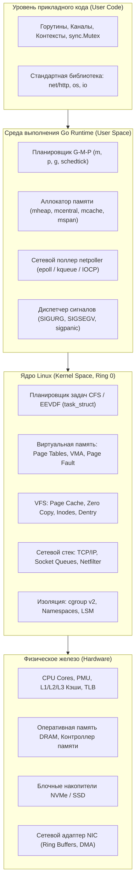
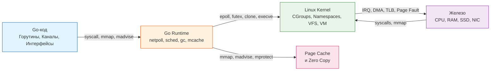
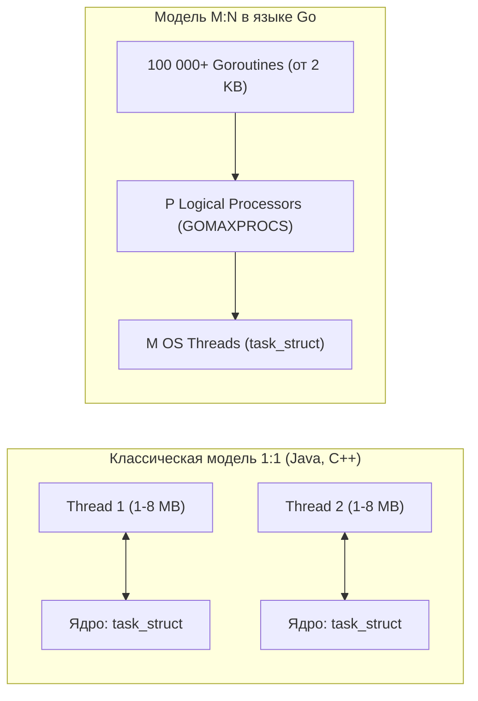
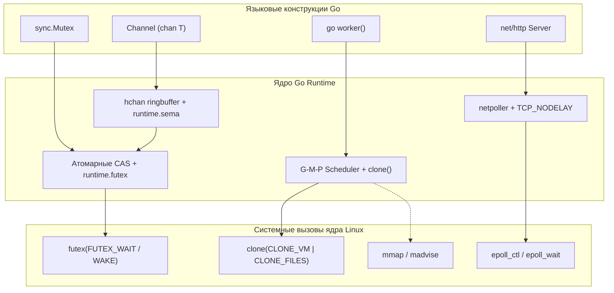

## Философия раздела: OS как со-исполнитель, а не абстракция

На протяжении шестидесяти двух предшествующих глав мы методично разбирали операционную систему Linux по винтикам: от колец защиты процессора и аппаратуры виртуальной памяти до сетевых очередей сокетов, механизмов изоляции контейнеров и eBPF. Завершая этот фундаментальный модуль, критически важно сделать шаг назад и окинуть взглядом всю архитектурную картину целиком.

Среди прикладных программистов широко распространена опасная иллюзия: относиться к операционной системе как к загадочному «черному ящику», чья единственная задача — загрузить бинарник в память и предоставить системные интерфейсы ввода-вывода. Для инженера уровней Senior, Staff и Lead — это фатальная ментальная ловушка.

Язык Go не пытается абстрагироваться от операционной системы и не строит вокруг приложения тяжеловесных изолирующих прослоек, как это исторически делала платформа Java. Напротив, философия Go — это **симбиоз и глубокое партнерство (Mechanical Sympathy)**. Среда выполнения Go Runtime не конкурирует с ядром Linux, а ведет с ним непрерывный, филигранно выверенный диалог на языке системных вызовов, разделяемых страниц памяти и асинхронных событий:
*   Планировщик Go мультиплексирует миллионы горутин поверх скромного пула системных потоков ядра, избегая переключений контекста процессора.
*   Аллокатор памяти Go резервирует гигабайты виртуальных адресов через `mmap`, отдавая неиспользуемые страницы обратно ядру с помощью `madvise`, не нарушая структуры страничных таблиц.
*   Сетевой поллер Go превращает асинхронный событийный мультиплексор `epoll` в элегантный синхронный прикладной код, читаемый сверху вниз.

Понимание того, как ядро выделяет физические фреймы ОЗУ, сбрасывает кэш страниц, планирует очереди потоков и обрабатывает прерывания от сетевого адаптера, превращает разработчика из «пользователя фреймворков» в настоящего системного архитектора.

## Единая ментальная модель: Слои взаимодействия

Go-приложение функционирует на стыке трех пересекающихся пространств: пространства пользователя (User Space), пространства встроенной среды выполнения (Go Runtime) и пространства ядра (Kernel Space). Границы между ними размыты благодаря интеллектуальному слою `runtime`.

В этой модели каждый слой решает строго определенную инженерную задачу:
1.  **Прикладной код Go:** выражает чистую бизнес-логику в терминах конкурентных каналов и процедурного синхронного кода.
2.  **Go Runtime:** берет на себя тяжелую логистику — утилизирует память через собственный быстрый аллокатор, мультиплексирует сокеты и управляет жизненным циклом горутин.
3.  **Ядро Linux:** гарантирует аппаратную защиту памяти (Ring 0 / Ring 3), взаимодействует с контроллерами накопителей и сетевыми картами через механизм прямого доступа к памяти (DMA), распределяет процессорные кванты и изолирует процессы.
4.  **Аппаратное обеспечение:** исполняет машинные инструкции, кэширует трансляции адресов в буферах ассоциативной трансляции (TLB) и удерживает горячие строки данных в кэшах L1/L2/L3.

## Ключевые инсайты по основным подсистемам

### 1. Память и аллокации

Виртуальная память ([[12. Виртуальная память. Почему процессу кажется, что у него своя память.md]]) дарит каждому процессу изолированное, непрерывное 64-битное адресное пространство. Рантайм Go виртуозно использует эту иллюзию:
*   **Стек горутин (Goroutine Stack):** В классических языках (C, C++, Java) под каждый поток ОС выделяется массивный фиксированный стек размером от 1 до 8 МБ. Попытка создать 50 000 таких потоков мгновенно исчерпает физическую память сервера. В Go стек горутины стартует всего с **2 КБ** и динамически растет или сжимается в куче по мере необходимости. Это позволяет безболезненно удерживать миллионы горутин в памяти без риска падения по ошибке сегментации (`SIGSEGV`).
*   **Куча (Heap) и отказ от `brk`/`sbrk`:** Go полностью игнорирует устаревшие системные вызовы изменения сегмента данных `brk`/`sbrk`. Вся память запрашивается у ядра через системный вызов `mmap` с флагом `MAP_ANONYMOUS` огромными блоками, которые затем делятся на арены, центральные пулы `mspan` и локальные поточные кэши `mcache`.
*   **Page Cache и бескомпромиссный Zero Copy:** Чтение файлов через `os.File` проходит через системный страничный кэш ядра (`Page Cache`). Используя стандартные интерфейсы `io.Copy`, `io.ReaderFrom` и `io.WriterTo`, Go активирует системные вызовы `sendfile` или `copy_file_range`, передавая данные между сокетами и файлами полностью силами ядра Linux, вообще не копируя байты в пространство пользователя.

> [!info] Под капотом
> Начиная с версии Go 1.19, рантайм Go получил революционный механизм **мягкого лимита памяти `GOMEMLIMIT`**. Исторически сборщик мусора GC ориентировался исключительно на коэффициент роста кучи (`GOGC=100`). В облачных контейнерах Kubernetes это приводило к тому, что под внезапным наплывом трафика сервис выходил за лимиты пода и беспощадно уничтожался системным демоном `OOM Killer`.  
> С параметром `GOMEMLIMIT` сборщик мусора Go динамически регулирует частоту циклов сборки, а рантайм лениво отдает неиспользуемые страницы операционной системе через системный вызов `madvise(MADV_DONTNEED)`, предотвращая аварийное уничтожение процесса.

### 2. Планирование и конкурентность

Планировщик операционной системы Linux оперирует физическими системными потоками (`OS Thread`), а планировщик Go оперирует горутинами (`Goroutine`). Это совершенно разные уровни абстракции с кардинально различающейся физической стоимостью:
*   **Тяжеловесный системный Context Switch:** Переключение между системными потоками ОС (`Thread`) требует перехода процессора в Ring 0, сохранения полного контекста регистров, инвалидации таблицы трансляции адресов (`TLB miss`) и кэшей процессора. Это обходится процессору в тысячи тактов (от 1 до 5 микросекунд).
*   **Сверхлегковесный рантайм Context Switch:** Переключение между горутинами выполняется средой Go в пространстве пользователя (User Space) через связку структур `runtime.m` (поток ОС) и `runtime.p` (логический процессор). Рантайм сохраняет только минимальный набор регистров процессора (`rip`, `rsp`, `r12-r15`) и указатели на локальные кэши. Это занимает всего 10–20 наносекунд и обходится без системных вызовов в ядро.
*   **Архитектурная модель `M:N`:** Вместо тяжелой модели 1:1, язык Go реализует мультиплексирование `M:N`, распределяя миллионы горутин по числу физических ядер, заданному переменной `GOMAXPROCS`.

> [!warning] Ловушка
> **Истинное значение переменной `GOMAXPROCS`:**  
> Переменная `GOMAXPROCS` задает вовсе не предел «количества одновременно запущенных горутин». Она определяет количество потоков ОС (`M`), способных одновременно выполнять пользовательский байткод Go на разных ядрах CPU.  
> Если по ошибке выставить `GOMAXPROCS = 1`, все горутины сервиса будут вынуждены исполняться на единственном ядре процессора. При возникновении тяжелых математических расчетов или невытесняемых циклов все параллельные задачи сервиса мгновенно выстроятся в очередь, даже если остальные 63 ядра мощного сервера будут абсолютно простаивать!

### 3. IO и сеть

Сетевая подсистема Go полностью построена на неблокирующем вводе-выводе и событийно-ориентированном мультиплексировании:
*   В ядре Linux рантайм взаимодействует с системным вызовом `epoll`, в BSD/macOS — с `kqueue`, в Windows — с `IOCP`.
*   Когда горутина вызывает `conn.Read()`, рантайм регистрирует сетевой файловый дескриптор в поллере `netpoller` и усыпляет горутину с помощью вызова `gopark`. Поток ОС `m` не засыпает, а немедленно берет следующую задачу!
*   Когда сетевая карта принимает пакеты и ядро помещает их в сокетный буфер, системный вызов `epoll_wait` пробуждает сетевой поллер, и горутина переводится в статус готовой к исполнению (`runnable`).
*   Для программиста код выглядит абсолютно синхронным и линейным, но под капотом он исполняется с максимальной производительностью асинхронного event loop.

> [!tip] Собеседование
> **Вопрос:** Что произойдет на уровне ядра Linux и рантайма Go, если одна горутина закроет сокет (`conn.Close()`), пока вторая горутина заблокирована на чтении из него (`conn.Read()`)?  
> **Ответ:** Системный селектор `epoll` мгновенно зафиксирует закрытие дескриптора и сгенерирует ядровые флаги событий `EPOLLHUP` или `EPOLLERR`. Фоновый поток `netpoll` немедленно разбудит спящую горутину, переведя ее в очередь исполнения. Горутина завершит системный вызов и получит ошибку `io.EOF` или системный код `syscall.EBADF` («Bad file descriptor»). В отличие от устаревшего вызова POSIX `select`, требующего перебора всех дескрипторов, `epoll` работает по эффективной push-модели событий.

### 4. Архитектура и изоляция

В эпоху микросервисов практически каждый бэкенд на Go функционирует внутри легковесных контейнеров. Глубокое понимание фундаментальных механизмов пространства имен и групп управления ([[53. Контейнеры под капотом. namespaces и cgroups.md]]) критично для безаварийной эксплуатации:
*   **Namespaces (Пространства имен):** Дарят процессу иллюзию единоличного владения системой (изоляция PID, сетевого стека NET, файловой системы MNT, межпроцессного взаимодействия IPC). Рантайм Go видит локальный PID 1 и изолированные сетевые интерфейсы `eth0`.
*   **Cgroups v2 (Группы управления):** Задают жесткие границы системных ресурсов (память, процессорное время, лимиты дискового ввода-вывода). Если параметры контейнера `memory.limit_in_bytes` или лимиты памяти в `cgroup v2` настроены без учета буферов ОС, ядро активирует системный `OOM Killer` и уничтожит сервис до того, как сборщик мусора Go успеет отреагировать.
*   **CPU Affinity и топология NUMA:** В кластерах Kubernetes потоки ОС Go-процесса могут хаотично мигрировать между ядрами процессора. Это вызывает деградацию L1/L2 кэшей и промахи мимо шины памяти (NUMA latency). Нагруженные высокочастотные сервисы требуют тонкой настройки политик Kubernetes `CPU Manager` и выделения гарантированного класса обслуживания `Guaranteed` (Static CPU Pinning).

## Go-рантайм: Мост между абстракцией и железом

Среда исполнения Go — это не изолирующий барьер, а высокоточный переходник к системным интерфейсам ядра Linux. В таблице ниже сведена полная картина сопоставления высокоуровневых конструкций Go и низкоуровневых примитивов ядра:

| Абстракция в языке Go | Системный примитив / Механизм ядра Linux | Архитектурное назначение и преимущество |
| :--- | :--- | :--- |
| **`sync.Mutex`** | **`futex` (Fast Userspace Mutex)** | Быстрая блокировка в пространстве пользователя через атомарные инструкции процессора. Только при возникновении жесткой конкуренции за ресурс вызывается системный вызов `futex(LOCK|WAIT)`. |
| **`Channel`** | **`runtime.sema` + `epoll` / `futex`** | Потокобезопасная очередь сообщений в памяти рантайма. Блокировка и пробуждение горутин выполняются через вызовы `gopark` и `goready`. |
| **`goroutine`** | **`clone(CLONE_VM \| CLONE_FS \| CLONE_FILES)`** | Порождение системных потоков ядра с общим виртуальным адресным пространством и таблицей дескрипторов, но изолированными регистрами CPU. |
| **`mmap`** | **`mmap(MAP_PRIVATE \| MAP_ANONYMOUS)`** | Анонимное выделение виртуальных страниц для кучи и динамических стеков. Директива `madvise` управляет возвратом физической памяти ядру. |
| **`net/http`** | **`epoll` / `kqueue` + `setsockopt(TCP_NODELAY)`** | Неблокирующий сетевой ввод-вывод в сочетании с обязательным отключением алгоритма Нейгла для обеспечения минимальной задержки сетевых пакетов. |
| **`runtime.GC`** | **`madvise(MADV_DONTNEED)` / `mprotect`** | Ленивый возврат освобожденной памяти ядру Linux без разрушения виртуальных диапазонов и сброса таблиц `Page Table`. |

> [!info] Под капотом
> Внутренняя структура ядра рантайма `runtime.m` хранит прямую ссылку на дескриптор системного потока ОС (`sys`), указатель на текущую исполняемую горутину (`curg`) и счетчик тиков планировщика `schedtick` для вытеснения долгих задач. Логический процессор `runtime.p` динамически отцепляется от системного потока при входе в блокирующий системный вызов (`handoff`). Этот механизм гарантирует, что блокировка отдельного потока на дисковом I/O никогда не заблокирует глобальный пул задач `GOMAXPROCS`.

## Практические паттерны и оптимизации

На основе глубокого знания подсистем операционной системы выстраивается свод лучших инженерных практик разработки высоконагруженных сервисов:

1.  **Контроль аллокаций памяти:**  
    Избегайте динамического перевыделения срезов в горячих циклах. Всегда используйте предвыделение `make([]T, 0, capacity)` или повторно используйте тяжелые буферы через пул **`sync.Pool`**. Каждая лишняя аллокация в куче создает дополнительное давление на страничный кэш, увеличивает нагрузку на сборщик мусора GC и провоцирует системные `Page Fault`.
2.  **Буферизация ввода-вывода (Buffered I/O):**  
    Использование оберток **`bufio.Reader`** и **`bufio.Writer`** сокращает число системных вызовов `read`/`write` на порядки. Буфер накапливает данные в пользовательском пространстве, обращаясь к ядру только при полном заполнении или опустошении, экономя такты процессора на смене контекста Ring 3 -> Ring 0.
3.  **Неблокирующий сетевой стек:**  
    Для низкоуровневых сервисов и самописных протоколов используйте возможности пакета `golang.org/x/sys/unix` и переводите дескрипторы в неблокирующий режим через **`syscall.SetNonblock`**. Это позволяет одному потоку ОС обслуживать тысячи одновременных сетевых соединений без блокировок ядра.
4.  **Культура обработки системных сигналов:**  
    Служба `os/signal` позволяет перехватывать системные сигналы завершения **`SIGTERM`** и **`SIGINT`**. Канал приема сигналов (`signal channel`) никогда не должен блокироваться. Используйте конструкцию `select` с таймаутом. Процедура плавного завершения (Graceful Shutdown) обязана укладываться в отведенный таймаут оркестратора Kubernetes (по умолчанию 30 секунд), иначе процесс будет принудительно и жестко уничтожен сигналом **`SIGKILL`**.

> [!warning] Ловушка
> **Утечка горутин при конкурентной синхронизации:**  
> Использование счетчика `sync.WaitGroup` внутри порожденных горутин без жесткого контроля времени жизни через контекст **`context.WithTimeout`** или координатор **`errgroup`** гарантированно приведет к утечке горутин (Goroutine Leak) при отмене клиентского HTTP-запроса. В Go горутины не завершаются автоматически операционной системой: забытая в бесконечном чтении горутина навсегда останется в памяти, удерживая стек и сетевые дескрипторы сокета.

> [!tip] Собеседование
> **Вопрос:** Каким образом рантайм Go обрабатывает тяжелые блокирующие системные вызовы (например, синхронный `fsync`, вызов `connect` или работу с криптографическим устройством), не парализуя работу всего приложения?  
> **Ответ:** При входе в потенциально блокирующий системный вызов рантайм Go фиксирует, что системный поток `m` переходит в сон на уровне ядра. Планировщик немедленно отсоединяет логический процессор `p` от этого потока (процедура Hand-off) и передает его свободным системным потокам из пула `sched` или создает новый поток ОС с помощью фонового демона `sysmon`. Сама горутина переводится в статус ожидания `waiting` и временно покидает локальную очередь. Когда операция в ядре завершается, поток `m` просыпается, рантайм возвращает горутине статус `runnable` и отправляет ее на свободный процессор `p`.

## Итог

Операционная система Linux и среда выполнения Go — это не изолированные миры, а гармоничный тандем двух инженерных шедевров. Ядро операционной системы берет на себя физический контроль над кристаллами CPU, физическими планками RAM, блочными накопителями и сетевыми контроллерами. Язык Go предоставляет инженеру выразительные высокоуровневые инструменты, превращая сложные системные примитивы в лаконичный, надежный и невероятно быстрый код.

Глубокое понимание физического смысла таких явлений, как `Page Fault`, промахи кэша `TLB miss`, системные блокировки `futex`, мультиплексирование `epoll` и сегментация `mmap`, бесповоротно переводит разработчика на высший уровень инженерного мастерства. Вы перестаете блуждать в догадках при возникновении сбоев в продакшене и начинаете читать системные дампы памяти, профили `pprof`, трассировки `strace` и системные метрики `vmstat` как открытую, кристально ясную географическую карту местности.

---

### 🎉 Модуль 2 полностью завершен!

Мы прошли грандиозный путь: от архитектуры ядер операционных систем и управления виртуальной памятью до сокетов, изоляции контейнеров, eBPF и рантайма Go. 

В следующем фундаментальном разделе энциклопедии мы развернем масштабы еще шире: выйдем за пределы одного сервера и исследуем, как данные путешествуют по оптоволоконным магистралям, маршрутизируются коммутаторами и балансируются в глобальной паутине. 

Встречайте следующий том: **Раздел 3. Компьютерные сети и сетевой стек**!
