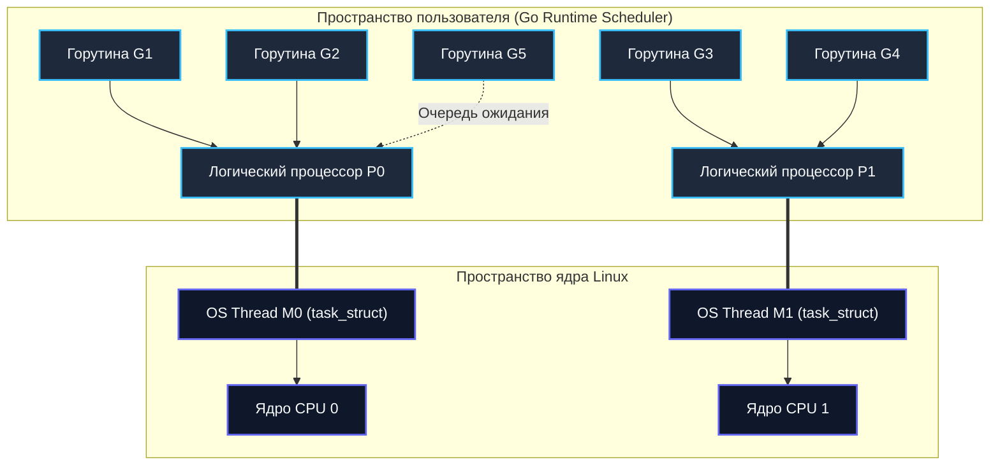

## Процесс и Поток: Границы и Контекст

> *«Поток — это траектория исполнения сквозь программу. Процесс — это среда, в которой эта траектория разворачивается».*    
> — Классическое определение системного программирования

В многозадачных операционных системах процессы и потоки (threads) — это два фундаментальных строительных блока, на которых держится весь современный вычислительный мир. Для бэкенд-разработчика, проектирующего сервисы на Go, понимание границы между ними — это не академическая забава, а повседневный инструмент: от него зависят потребление оперативной памяти, задержки (latency) при обработке сетевых пакетов и накладные расходы на переключение контекста процессора.

Представьте себе большую столярную мастерскую. 
- **Процесс** — это само изолированное здание мастерской. У него есть договор аренды помещения (виртуальное адресное пространство), счет за электричество и доступ к инструментам в шкафах (файловые дескрипторы, открытые TCP-сокеты), пропускная карточка на двери (права доступа UID/GID) и пожарная сигнализация (обработчики сигналов).
- **Поток выполнения** — это столяр внутри этой мастерской. Если столяр один, он выполняет задачи строго по очереди. Если нанять четырех столяров (четыре системных потока), они могут работать одновременно.

```
                   ОДИН ПРОЦЕСС (МАСТЕРСКАЯ)
 ┌─────────────────────────────────────────────────────────────┐
 │  Виртуальная память (mm_struct): Текст, Куча (Heap), Данные  │
 │  Файловые дескрипторы (files_struct): Сокеты, Файлы, Пайпы  │
 │                                                             │
 │   Поток 1 (m0)            Поток 2 (m1)           Поток 3 (m2)
 │ ┌──────────────┐        ┌──────────────┐       ┌──────────────┐
 │ │ Регистры CPU │        │ Регистры CPU │       │ Регистры CPU │
 │ │ Стек (~8 МБ) │        │ Стек (~8 МБ) │       │ Стек (~8 МБ) │
 │ └──────────────┘        └──────────────┘       └──────────────┘
 └─────────────────────────────────────────────────────────────┘
                               ▲
               Свободный доступ к общей куче (Heap)
                               ▼
 ┌─────────────────────────────────────────────────────────────┐
 │    ДРУГОЙ ПРОЦЕСС (Изолированное здание со своей памятью)   │
 └─────────────────────────────────────────────────────────────┘
```

Столяры в одной мастерской делят всё общее пространство: они свободно берут доски с одного стеллажа (общая память кучи) и пользуются общими станками. Им не нужно выходить на улицу, чтобы перекинуться словом. 

Но в этой свободе кроется и смертельная опасность:
1. **Гонка данных (Data Race):** Если два столяра одновременно схватятся за одну доску на циркулярной пиле без согласования, случится авария.
2. **Крах процесса:** Если один из столяров случайно уронит несущую балку (вызовет разыменование нулевого указателя `SIGSEGV` в C/C++ или неустранимую панику рантайма), разрушится всё здание — погибнут все потоки этого процесса.

Если же вы арендуете две независимые мастерские (два **процесса**), авария в первой никак не повредит второй. Но чтобы передать готовое изделие из мастерской А в мастерскую Б, вам придется организовать полноценную транспортную службу (IPC: сокеты, пайпы или разделяемую память).

---

## Под капотом: Как ОС представляет процессы и потоки

С точки зрения классической теории операционных систем процесс и поток — совершенно разные сущности. Но ядро Linux подошло к этому вопросу с гениальным минимализмом, достойным создателей Unix.

> [!info] Под капотом: В Linux всё является задачей (task)
> В современных ядрах Linux (начиная с ветки 2.6 и появления NPTL — Native POSIX Thread Library) **в ядре нет отдельной структуры для потока**. И независимый процесс, и легковесный поток внутри процесса представлены одной и той же структурой — `task_struct`.
> 
> Разница заключается исключительно в **указателях на разделяемые ресурсы**:
> - Если несколько `task_struct` указывают на **один и тот же экземпляр `mm_struct`** (дескриптор виртуальной памяти), они являются потоками одного процесса и делят адресное пространство.
> - Если у `task_struct` указатель `mm_struct` уникален (или получен с флагом Copy-on-Write) — это независимый процесс.
> - Если указатель `mm` равен `NULL` — перед нами тред самого ядра Linux (kernel thread, например, `kcompactd` или `ksoftirqd`), работающий исключительно в адресном пространстве ядра.

Когда вы запускаете приложение, ядро выделяет ему адресное пространство. В Linux оно управляется через **VMA (Virtual Memory Areas)** и таблицы страниц (**Page Tables**).

Процесс объединяет:
*   **Text segment**: скомпилированный исполняемый машинный код (только для чтения, Read-Only).
*   **Data segment**: глобальные и статические инициализированные переменные.
*   **BSS**: неинициализированные глобальные данные.
*   **Heap**: динамически выделяемая память приложения (через системные вызовы `brk` или `mmap`).
*   **Stack**: стек вызовов функций (у каждого потока он свой!).
*   **File descriptors**: таблица дескрипторов открытых файлов, сетевых сокетов, пайпов и таймеров.

Поток же в представлении ОС — это просто уникальный набор регистров процессора и изолированный стек вызовов внутри этого общего адресного пространства. При создании системного потока ядро:
1. Выделяет новый дескриптор `task_struct`.
2. Резервирует виртуальную память под собственный стек потока (обычно **8 МБ** в Linux по умолчанию согласно лимиту `ulimit -s`).
3. Добавляет новый стек в структуру VMA родительского процесса.
4. Включает новый `task_struct` в очередь планировщика CPU наравне с другими процессами.

Поскольку потоки делят всю память процесса, передача указателя между ними стоит 0 наносекунд: достаточно записать адрес объекта в общую переменную. Однако это удобство требует безупречной и явной синхронизации.

---

## Стоимость создания и переключения

Здесь кроется главная инженерная дилемма системного программирования: чем легче сущность, тем дешевле ее создание и переключение, но тем выше цена синхронизации общего состояния.

### Создание (Fork vs pthread_create)

Запуск нового процесса через системный вызов `fork()` требует дублирования дескрипторов и структур виртуальной памяти. Исторически это делало `fork()` очень дорогой операцией. 

Современные ОС используют механизм **Copy On Write (CoW)**: физические страницы оперативной памяти не копируются, а помечаются как доступные только для чтения. При первой же попытке записи ядро ловит прерывание `Page Fault`, выделяет новый физический фрейм 4 КБ и копирует данные. Это ускоряет `fork()` в сотни раз, но ядру всё равно приходится скопировать записи таблиц страниц (PTE — Page Table Entry) и синхронизировать TLB.

Создание потока через библиотеку POSIX (`pthread_create` в Linux) или WinAPI (`CreateThread` в Windows) обходится значительно дешевле:
1. Ядро не трогает таблицы страниц — они остаются общими.
2. Не нужно настраивать новые маппинги VMA для бинарного кода и кучи.
3. Достаточно выделить стек, заполнить `task_struct` с флагами `CLONE_VM | CLONE_FS | CLONE_FILES | CLONE_SIGHAND | CLONE_THREAD` и добавить задачу в `runqueue`.

### Context Switch

Переключение процессора между потоками одного и того же процесса происходит ощутимо быстрее, чем между двумя независимыми процессами:

1. **Сохранение регистрового состояния**: Текущие значения регистров CPU, программного счетчика (`RIP` / PC), флагов и указателя стека (`RSP`) сохраняются в дескриптор `task_struct`.
2. **Смена стека**: Регистр `RSP` перенаправляется на вершину стека нового потока.
3. **TLB Flush (Критический фактор!):** 
   - При переключении между **процессами** ядро обязано переключить корневую таблицу страниц, записав новый адрес в регистр процессора `CR3`. Это приводит к сбросу или инвалидации аппаратного кэша трансляции адресов (**TLB**). Если этого не сделать, процессор обратится по чужим физическим адресам, что мгновенно вызовет аварийный `Segmentation Fault` или приведет к повреждению данных. Запись в `CR3` и промахи по холодному TLB стоят сотни и тысячи процессорных тактов.
   - При переключении **между потоками одного процесса** виртуальное адресное пространство остается абсолютно прежним! Регистр `CR3` не меняется, MMU продолжает работать со старыми таблицами страниц, а кэш TLB сохраняет свою актуальность. Это экономит от 50 до 200 тактов чистой аппаратной работы на каждое переключение.

```
  ПЕРЕКЛЮЧЕНИЕ ПРОЦЕССОВ              ПЕРЕКЛЮЧЕНИЕ ПОТОКОВ (ОДИН ПРОЦЕСС)
 ┌─────────────────────────┐         ┌─────────────────────────┐
 │ Процесс A  ──>  Ядро    │         │ Поток 1    ──>  Ядро    │
 │ Сохранить регистры      │         │ Сохранить регистры      │
 │ СМЕНИТЬ РЕГИСТР CR3!    │         │ CR3 НЕ ТРОГАЕМ!         │
 │ СБРОСИТЬ КЭШ TLB!       │         │ TLB ОСТАЕТСЯ ГОРЯЧИМ!   │
 │ Ядро       ──>  Процесс B│        │ Ядро       ──>  Поток 2 │
 └─────────────────────────┘         └─────────────────────────┘
  Тяжело (~2-5 мкс)                   Быстрее (~1-2 мкс)
```

> [!warning] Ловушка / Gotcha: Иллюзия легковесности OS-потоков
> Хотя поток дешевле процесса, системные потоки ОС остаются **очень тяжелыми сущностями** для масштабного бэкенда.
> Попытка создать 100 000 системных потоков убьет ваш сервер тремя ударами:
> 1. **Катастрофа по памяти:** 100 000 потоков со стеком 8 МБ потребуют около **800 ГБ виртуальной памяти**! Даже если физическая память будет выделяться страницами по мере касания, стек потока потребляет минимум десятки килобайт реальной памяти ядра и RAM.
> 2. **Паралич планировщика:** Бесконечный Context Switch между 100 000 задач заставит процессор тратить 90% времени не на исполнение полезного кода, а на перекладывание регистров туда-обратно.
> 3. **Разрушение кэшей процессора (`cache thrashing`):** Кэши CPU (L1/L2) разбиты на 64-байтные строки (cache lines). Хаотичное переключение десятков тысяч потоков, работающих с разными областями памяти, приводит к тому, что данные непрерывно вымываются из кэша еще до того, как поток успеет ими воспользоваться.

---

## Go-подход: Горутины против OS-потоков

Язык Go совершил настоящую революцию в серверной разработке именно потому, что отказался от классической модели многопоточности 1:1.

Вместо привязки одного потока приложения к одному системному потоку ОС (как это исторически делалось в Java, C# или Python), среда выполнения Go использует **M:N планировщик (M:N scheduler)**: миллионы легковесных сущностей языка (горутин, $M$) мультиплексируются поверх небольшого пула реальных системных потоков ОС ($N$).



```go
package main

import (
	"fmt"
	"runtime"
	"time"
)

func worker(id int) {
	// Каждая горутина исполняется предельно легковесно
	// При блокировке на сети поток ОС не блокируется!
	fmt.Printf("Горутина %d: успешно отработала
", id)
}

func main() {
	// Ограничиваем количество физических процессоров рантайма
	runtime.GOMAXPROCS(4)

	// Создаем 1000 горутин без малейшей нагрузки на ядро Linux
	for i := 0; i < 1000; i++ {
		go worker(i)
	}

	// Даем время горутинам завершить работу
	time.Sleep(100 * time.Millisecond)

	fmt.Printf("Физических процессоров (GOMAXPROCS): %d
", runtime.GOMAXPROCS(0))
	fmt.Printf("Активных горутин в памяти: %d
", runtime.NumGoroutine())
}
```

### Ключевые отличия Go от классических языков:

| Характеристика | Системные потоки (Java / C# / C++) | Горутины языка Go |
|---|---|---|
| **Модель маппинга** | **1:1** (Один программный поток = один системный тред ядра) | **M:N** (Тысячи горутин маппятся на горсть системных потоков) |
| **Размер стека** | Фиксированный и огромный (**1–8 МБ**) | Динамический: стартует всего с **2 КБ**, растет при необходимости до 1 ГБ |
| **Создание сущности** | Медленно и дорого (системный вызов ядра, выделение страниц) | Наносекунды (простая аллокация структуры `g` в куче) |
| **Планировщик** | Ядро операционной системы (Kernel Scheduler) | Рантайм языка в пользовательском пространстве (`runtime.scheduler`) |
| **Стоимость переключения** | Тяжело: **1–2 мкс** с переходом в Ring 0 | Мгновенно: **10–200 нс** без выхода из User Space |
| **Блокировка на I/O** | Блокирует весь системный тред, требуя вытеснения | Блокирует только горутину; поток `m` сразу забирает другую задачу! |

Планировщик рантайма Go хранит состояние горутин в компактных структурах `g`. При создании задачи через ключевое слово `go func()` рантайм выделяет дескриптор `g`, инициализирует стек размером всего 2 КБ и помещает его в локальную очередь выполнения (`runqueue`) контекста `p`.

Если системный поток `m` сталкивается с блокирующей операцией ввода-вывода (сетевой запрос через `netpoller` или ожидание данных из канала `channel`), горутина плавно усыпляется вызовом `gopark`. Ее контекст сохраняется, а освободившийся поток `m` немедленно забирает на исполнение другую готовую горутину из очереди. 

Если в локальной очереди работы больше нет, рантайм использует элегантный алгоритм **Work Stealing**: системный поток обращается к очередям других процессоров и «крадет» у них половину готовых горутин, обеспечивая стопроцентную загрузку всех ядер CPU без участия ядра ОС!

> [!tip] Собеседование
> **Вопрос 1:** Почему `GOMAXPROCS` по умолчанию равен количеству логических ядер CPU? Что произойдет, если установить `GOMAXPROCS=1`?  
> **Ответ:** Переменная `GOMAXPROCS` задает количество сущностей `P` (логических процессоров рантайма), которые могут одновременно исполнять пользовательский Go-код в потоках ОС. По умолчанию значение равно количеству аппаратных ядер (с учетом Hyper-Threading), чтобы задействовать все физические мощности процессора.  
> Если задать `GOMAXPROCS=1`, Go сможет параллельно исполнять пользовательский код только на одном ядре. Это устранит конкуренцию за разделяемые структуры между системными потоками, но уничтожит аппаратный параллелизм: многопоточные CPU-bound вычисления замедлятся в $N$ раз. Однако сетевая конкурентность (I/O) останется эффективной, так как неблокирующий `netpoller` продолжит работать в фоновом режиме.
> 
> **Вопрос 2:** Как Go справляется с состоянием гонки (Race Condition), если горутины работают в общей памяти?  
> **Ответ:** Рантайм Go сознательно **не накладывает неявных блокировок** на доступ к памяти. Память кучи является полностью разделяемой. Вся ответственность за корректную синхронизацию возложена на инженера.  
> В отличие от языков с тяжеловесными встроенными мониторами (такими как `synchronized` в Java или `lock` в C#), Go предлагает два пути:
> 1. Классические примитивы синхронизации: пакет `sync` (`sync.Mutex`, `sync.RWMutex`, `sync.WaitGroup`) и низкоуровневый пакет `atomic`.
> 2. Парадигма CSP (Communicating Sequential Processes): коммуникация через типизированные каналы (`channel`), следуя золотому правилу Go: *«Не общайтесь, деля память; делите память, общаясь»*.

---

## Сравнение с C++/C#/PHP

Чтобы в полной мере оценить инженерную красоту подхода Go, взглянем на то, как с этой дилеммой справляются другие экосистемы:

*   **PHP (Классический подход):** Исторически PHP фундаментально однопоточен. В классической связке Nginx + PHP-FPM для параллельной обработки входящих запросов запускается пул независимых процессов ОС через системный вызов `fork`. На каждый HTTP-запрос выделяется отдельный процесс! Это гарантирует абсолютную изоляцию памяти (утечка в одном запросе не повредит соседнему), но порождает колоссальный оверхед по оперативной памяти и переключению контекста. Go позволяет обрабатывать сотни тысяч соединений в рамках **одного-единственного процесса**, расходуя в сотни раз меньше ресурсов.
*   **C# и Java:** Исторически используют модель пула потоков (`ThreadPool`) поверх системных тредов 1:1. Для решения проблемы блокировок на вводе-выводе была внедрена концепция `async/await`. Под капотом компилятор превращает асинхронную функцию в сложный конечный автомат (State Machine), который освобождает поток из пула на время ожидания ответа от базы данных или сети. Недостаток — так называемая проблема «цветных функций» (Function Coloring): синхронный код нельзя просто так вызывать из асинхронного и наоборот. В Go никакого `async/await` нет: код пишется просто и линейно, а рантайм делает его неблокирующим сам.
*   **C++:** Стандартная библиотека предоставляет низкоуровневые системные потоки `std::thread`. C++ дает максимальную скорость и контроль над железом, но требует ручного контроля жизненного цикла, явного управления памятью и жесткой синхронизации. Любая ошибка — и вы получаете повреждение памяти (Memory Corruption) или Data Race с непредсказуемым Undefined Behavior. Go берет заботу о памяти на себя через GC, защищая программиста от Segfault при работе со стеком и ссылками.

---

## Итог

1. **Процесс** — это высшая граница изоляции ресурсов в ОС: собственная виртуальная память (`mm_struct`), таблица файлов (`files_struct`) и права доступа.
2. **Поток** — это единица планирования внутри процесса. В ядре Linux поток представлен той же структурой `task_struct`, но делит виртуальную память и файловые дескрипторы с собратьями по процессу.
3. **Стоимость переключения контекста:** Переключение между потоками одного процесса быстрее переключения между процессами, так как не требует смены регистра `CR3` и сброса кэша трансляции страниц (**TLB**).
4. **Легковесность горутин:** Go не использует модель 1:1. Благодаря M:N планировщику, динамическому стеку размером **2 КБ** и переключению в пространстве пользователя за **наносекунды**, Go позволяет держать миллионы конкурентных задач на скромном железе.
5. **Цена общей памяти:** Разделяемая память горутин требует строгой дисциплины. Используйте каналы (`channel`), примитивы пакета `sync` (`sync.Mutex`, `sync.RWMutex`) или атомики (`atomic`), и всегда проверяйте код детектором гонок: `go test -race`!

Мы детально изучили, как устроены потоки исполнения. Но как процессор решает, какому потоку или горутине отдать драгоценные такты прямо в этот квант времени? В следующей статье мы разберем мозг операционной системы: [[8. Планировщик ОС. Как CPU выбирает, что исполнять]].
