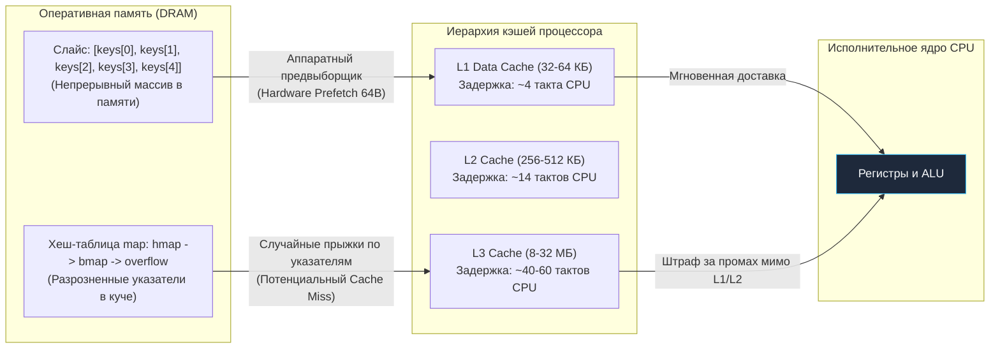
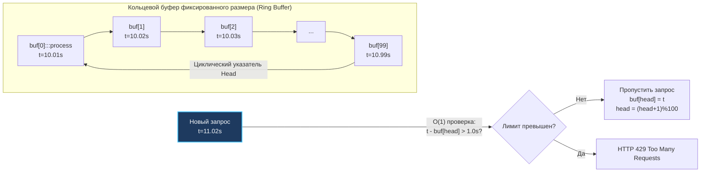
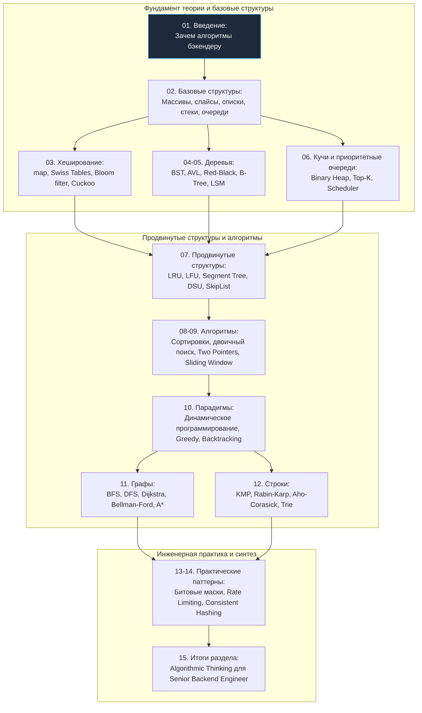

# 1. Обзор раздела: Зачем алгоритмы и структуры данных backend-разработчику

> *«Плохие программисты беспокоятся о коде. Хорошие программисты заботятся о структурах данных и связях между ними».*    
> — Линус Торвальдс

## Почему это важно именно для бэкенд-разработчика

В индустрии широко распространено заблуждение, будто алгоритмы и структуры данных (DSA — Data Structures and Algorithms) — это изолированная академическая забава для олимпиадников, завсегдатаев Codeforces и кандидатов, штурмующих скрининг-интервью в FAANG. В повседневных кулуарах нередко можно услышать: «В реальном проде я просто беру `map` и `slice`, а об остальном позаботится умный компилятор Go».

Для инженера, стремящегося к уровню Senior или Lead Go Architect, такая позиция не просто ошибочна — она профессионально опасна. 

В высоконагруженных серверных системах грань между глубоким пониманием структур данных и наивным кодингом измеряется не академическими оценками, а суровыми производственными метриками:
* **Латентность (p99 Latency):** 5 миллисекунд стабильного ответа против 500 миллисекунд деградации на хвостах распределения.
* **Потребление оперативной памяти:** 200 МБ на контейнер против 2 ГБ раздутой кучи (heap), что напрямую определяет частоту пауз [[7. Глубокий Go (Внутреннее устройство)|сборщика мусора]] (GC).
* **Масштабируемость:** сервис, пропускная способность которого растет линейно с добавлением серверов, против архитектуры, которая схлопывается в каскадный отказ при увеличении объема данных всего в 5–10 раз.
* **Стоимость инфраструктуры:** тысячи долларов экономии в месяц на счетах от облачных провайдеров за виртуальные машины и кэширующие инстансы.

Этот раздел — не сборник готовых рецептов для механического заучивания перед [[21. Задачи с LeetCode и собеседований на Go|собеседованиями]]. Наша цель — развить **инженерную интуицию** и фундаментальное понимание механического сочувствия к оборудованию: способность мгновенно сопоставлять бизнес-требование с паттерном доступа к памяти процессора, объемом входного потока и топологией кэшей современного кремния.

> [!tip] Собеседование
> **Вопрос:** «У вас есть сервис, который хранит метрики по пользователям. Нужно быстро проверять, был ли пользователь активен за последние 24 часа. Предложите решение».
>
> **Слабый ответ:** «Буду хранить в `map[userID]bool`».
>
> **Сильный ответ:** «Зависит от масштаба. Если пользователей до 100к — `map` подойдёт. Если миллионы — нужно учитывать, что `map` в Go не упорядочен и при росте вызывает реаллокации. Лучше рассмотреть:
> 1. [[6. Кучи и приоритетные очереди|Min-heap]] с таймстемпами для эффективного удаления устаревших записей.
> 2. [[3. Хеширование/7. Cuckoo hashing|Cuckoo hashing]] для детерминированного времени доступа и экономии памяти.
> 3. [[3. Хеширование/6. Bloom filter - вероятностная структура данных|Bloom filter]] если допустимы ложные срабатывания, но критична экономия памяти.
> 4. [[14. Практические паттерны/2. Rate limiting алгоритмы|Sliding window log]] если нужна точность и учёт временных окон».

---

## От абстракции к железу: Mechanical Sympathy в действии

Изучать алгоритмическую сложность $O(N)$ в отрыве от физического железа — тупиковый путь. Процессор x86-64 или ARM64 не оперирует абстрактными графами: он оперирует 64-байтными кэш-линиями, аппаратным предвыборщиком (Hardware Prefetcher), конвейером инструкций и буферами трансляции адресов (TLB).

В этом разделе мы будем непрерывно соединять элегантные математические формулы с физической реальностью кремневой пластины.

### Пример: Почему `map` не всегда быстрее `slice`

Классический парадокс начинающего разработчика: «Поиск в хеш-таблице `map` работает за $O(1)$, а линейный перебор в `slice` — за $O(N)$. Следовательно, `map` обязан быть быстрее всегда и везде».

В реальном мире это утверждение ложно. Представим типовой микросервисный сценарий: у нас есть небольшой набор из 5–10 конфигурационных ключей или заголовков (например, `auth`, `db`, `cache`, `log`, `metrics`), и нам нужно непрерывно проверять входящие токены на принадлежность этому списку.

```go
// Вариант 1: Поиск в slice
func hasKeySlice(keys []string, target string) bool {
    for _, k := range keys {
        if k == target {
            return true
        }
    }
    return false
}

// Вариант 2: Поиск в map
func hasKeyMap(lookup map[string]struct{}, target string) bool {
    _, exists := lookup[target]
    return exists
}
```

Сравним физику выполнения обоих подходов на современном CPU:

> [!info] Под капотом
> **Slice-поиск для малых N:**
> * Данные хранятся в непрерывном блоке памяти.
> * Процессор предзагружает кэш-линии (обычно 64 байта) при последовательном обходе — это **аппаратная префетчинг-оптимизация**.
> * Нет аллокаций в куче, нет косвенных обращений через указатели.
> * Компилятор Go может применить оптимизации: loop unrolling, векторизацию (в будущем).
>
> **Map-поиск:**
> * Внутренняя структура `hmap` (описана в [[5. Внутреннее устройство map в Go]]) — это массив бакетов с цепочками.
> * Доступ к ключу требует: вычисления хеша, маскирования, доступа к бакету, возможного перехода по указателю на overflow-бакет.
> * Каждый шаг — это потенциальный **cache miss**, так как данные разбросаны по куче.
> * При создании `map` происходит аллокация в куче, что создаёт давление на [[7. Глубокий Go (Внутреннее устройство)|гарбедж-коллектор]].

Проверим эту механику честным бенчмарком Go:

```go
//go:build ignore

package main

import (
    "testing"
)

var sink bool

func BenchmarkHasKeySlice(b *testing.B) {
    keys := []string{"auth", "db", "cache", "log", "metrics"}
    target := "cache"
    b.ResetTimer()
    for i := 0; i < b.N; i++ {
        sink = hasKeySlice(keys, target)
    }
}

func BenchmarkHasKeyMap(b *testing.B) {
    lookup := map[string]struct{}{
        "auth": {}, "db": {}, "cache": {}, "log": {}, "metrics": {},
    }
    target := "cache"
    b.ResetTimer()
    for i := 0; i < b.N; i++ {
        sink = hasKeyMap(lookup, target)
    }
}
```

Результаты выполнения на процессоре с частотой 3.5 ГГц:
```bash
$ go test -bench=. -benchmem
goos: linux
goarch: amd64
BenchmarkHasKeySlice-8    284519234    4.21 ns/op    0 B/op    0 allocs/op
BenchmarkHasKeyMap-8       45678912   26.43 ns/op    0 B/op    0 allocs/op
```

**Инженерный вывод:** Для малых наборов данных линейный последовательный перебор слайса оказывается **более чем в 6 раз быстрее**, чем теоретический $O(1)$ поиск в `map`! 

Причина кроется в латентности кэшей процессора: последовательный доступ к непрерывному массиву укладывается в 1–4 такта L1-кэша, тогда как случайный прыжок по указателям в хеш-таблице выбивает данные в L3-кэш или оперативную память (40–200 тактов).



---

## Go-специфика: ваши инструменты уже оптимизированы, но не бесконечно

Язык Go славится своей практичной и высокопроизводительной стандартной библиотекой. Однако встроенные механизмы оптимизированы под общий случай. Слепое доверие дефолтным типам без знания их внутренней анатомии порождает утечки и деградацию.

### Слайсы: не просто динамический массив
Как мы разберем в [[2. Слайсы в Go как структура данных]], слайс в Go — это легковесный 24-байтный заголовок (`SliceHeader`): указатель на массив `Data uintptr`, длина `Len int` и емкость `Cap int`.
* Передача слайса в функцию — это дешевое копирование 24 байт дескриптора, а не содержимого массива.
* При вызове `append` рантайм удваивает емкость (или масштабирует с коэффициентом 1.25 для больших размеров). Амортизированная сложность добавления составляет $O(1)$, но редкие реаллокации вызывают пиковые всплески задержек из-за выделения нового буфера в куче и вызова `runtime.memmove`.
* **Классическая ловушка удержания памяти:** выражение `s := large[:0]` создает новый слайс с нулевой длиной, но этот дескриптор продолжает удерживать в памяти гигантский базовый массив `large`, препятствуя его освобождению сборщиком мусора до тех пор, пока на подмассив существует хотя бы одна живая ссылка.

### Map: хеш-таблица с открытой адресацией
Внутреннее устройство `map` в Go существенно отличается от классических хэш-таблиц с цепочками на связных списках:
* Внутри бакета `bmap` размещается массив из 8 слотов с однобайтовыми хэшами `tophash` и непрерывными массивами ключей и значений, что радикально повышает плотность упаковки в кэш-линиях.
* **Случайный порядок обхода:** порядок итерации по `map` намеренно рандомизируется рандомизатором со смещением `fastrand()`, чтобы разработчики не полагались на детерминированность порядка ключей.
* **Память не сжимается:** операция `delete(m, key)` помечает слот пустым, но **не освобождает выделенные бакеты в куче**. Если вы заполнили мапу миллионом элементов, а затем удалили 999 999 из них, `map` продолжит занимать в RAM десятки мегабайт, пока не будет собрана сборщиком мусора целиком.

### Каналы и горутины: структуры данных для конкурентности
[[5. Учебник по Go (Основы и синтаксис)|Горутины]] и каналы часто воспринимаются начинающими как «легкие потоки и очереди сообщений». На самом деле канал `hchan` — это классическая конкретная структура данных:
* Кольцевой буфер фиксированной емкости с защитой через внутренний мьютекс (`sync.Mutex` и переменные ожидания `sync.Cond`).
* Когда буфер канала заполнен, пишущая горутина паркуется планировщиком Go (`gopark`) в очередь ожидания `sudog` без вовлечения дорогостоящих системных вызовов ядра ОС.

> [!warning] Ловушка / Gotcha
> **Канал не является потокобезопасным хранилищем произвольного доступа.**
> Вы не можете «заглянуть» в канал без извлечения элемента. Если вам нужен приоритетный доступ или произвольный поиск — канал не подходит. Используйте [[6. Кучи и приоритетные очереди|кучу]] с мьютексом или специализированную структуру.

---

## Когда алгоритмы спасают продакшен: реальные кейсы

### Кейс 1: Rate Limiter для высоконагруженного API

**Бизнес-задача:** Ограничить интенсивность запросов от каждого пользователя до 100 запросов в секунду на IP-адрес.

**Наивное решение:** Хранить временные метки всех запросов каждого клиента в слайсе `[]time.Time`. При каждом входящем запросе отфильтровывать события старше 1 секунды и проверять `len(slice) < 100`.
* **Катастрофа:** Сложность фильтрации $O(N)$ на каждый входящий запрос.
* При нагрузке в 10 000 клиентов и 100 RPS система будет ежесекундно совершать миллионы аллокаций слайсов, загоняя GC в кому.

**Оптимальное решение:** [[14. Практические паттерны/2. Rate limiting алгоритмы|Sliding window log]] с кольцевым буфером или алгоритм Token Bucket:
* Используем [[2. Базовые структуры данных/7. Кольцевой буфер|ring buffer]] строго фиксированного размера на 100 элементов.
* Сложность вставки и проверки — гарантированные $O(1)$ без единой аллокации в куче.
* Индексы сдвигаются атомарными операциями `sync/atomic`, устраняя конкурентные блокировки мьютексов в критическом горячем пути.



### Кейс 2: Кэширование результатов запросов к БД

**Бизнес-задача:** Кэшировать тяжелые аналитические запросы к базе данных по параметрам запроса с автоматической инвалидацией при превышении лимита памяти.

**Наивное решение:** `map[Query]Result` с индивидуальным таймером `time.AfterFunc` на каждый сохраненный ключ.
* **Катастрофа:** При десятках тысяч ключей рантайм Go порождает десятки тысяч системных таймеров. Это приводит к раздуванию внутренних очередей таймеров рантайма, колоссальной нагрузке на процессор и фрагментации памяти.

**Оптимальное решение:** [[7. Продвинутые структуры данных/7. LRU кэш|LRU-кэш]] (Least Recently Used) на стыке двусвязного списка и хэш-таблицы:
* Добавление, поиск и вытеснение самого старого элемента выполняются за строгое $O(1)$.
* Вместо таймеров на каждый элемент очистка происходит либо детерминированно при переполнении емкости, либо единой фоновой горутиной.
* Для исключения накладных расходов сборщика мусора узлы списка переиспользуются через `sync.Pool`.

```go
// Упрощённая структура узла для LRU
type cacheNode struct {
    key   string
    value any
    prev  *cacheNode // nil если голова
    next  *cacheNode // nil если хвост
}

// Пул для переиспользования узлов, снижаем аллокации
var nodePool = sync.Pool{
    New: func() any { return new(cacheNode) },
}
```

---

## Как мы будем изучать: дорожная карта раздела

Курс построен по принципу восхождения от фундаментального кремниевого базиса к сложнейшим практическим алгоритмам распределенных хранилищ.



Каждая тема модуля включает:
1. **Теорию и математику:** Асимптотическая сложность по времени и памяти в нотациях Big O, $\Omega$, $\Theta$.
2. **Анатомию Go:** Идиоматичные реализации на чистом Go с использованием дженериков (Go 1.18+), учет модели памяти и оптимизаций компилятора.
3. **Бенчмарки и механическое сочувствие:** Анализ аллокаций `B/op`, `allocs/op`, влияния на кэш-линии процессора и задержки сборщика мусора.
4. **Реальные кейсы и ловушки:** Где конкретная структура применяется в боевых базах данных (PostgreSQL, Redis, etcd, Kafka) и как не провалить собеседование на типичных подводных камнях.

---

## Что вы получите в итоге

По завершении этого раздела вы приобретете:
* **Инженерное зрение:** Способность безошибочно определять узкие места алгоритмов еще на этапе проектирования интерфейсов до написания первой строчки кода.
* **Предсказуемость систем:** Понимание того, как ваше приложение поведет себя под 10-кратной и 100-кратной пиковой нагрузкой.
* **Профессиональную аргументацию:** Железобетонные доводы на архитектурных комитетах и код-ревью, подкрепленные оценками временной сложности и профилем аллокаций.
* **Уверенность на собеседованиях:** Умение не просто выдать шаблонный ответ, а объяснить компромиссы (trade-offs) выбранного решения от уровня алгоритма до уровня машинных инструкций.
* **Культуру чистого кода:** Привычку писать надежные, масштабируемые и элегантные алгоритмы, которыми гордились бы создатели Unix и языка Go.

> [!tip] Собеседование
> **Вопрос:** «В чём разница между `sync.Map` и обычной `map` с `Mutex`? Когда что использовать?»
>
> **Ответ:** `sync.Map` оптимизирован под два сценария: 1) когда ключи только добавляются и не удаляются, 2) когда несколько горутин читают одни и те же ключи, а пишут в разные. Внутри он использует разделение на «read» и «dirty» части с атомарными операциями, чтобы минимизировать блокировки. Но для общего случая (произвольные чтения/записи) обычная `map` + `RWMutex` часто проще и быстрее из-за меньшего оверхеда. Всегда профилируйте!

---

## С чего начнём

Следующая статья — фундаментальный базис всего раздела. Мы разберём, как измерять и сравнивать эффективность алгоритмов, не полагаясь на интуицию или случайные замеры. Вы научитесь различать `O(1)`, `O(log n)` и `O(n²)` не как абстрактные математические значки, а как реальные паттерны масштабирования времени выполнения и потребления памяти в распределенных системах.

Поймете, почему амортизированная сложность `slice` — это не магия, а результат геометрического роста ёмкости, и как это связано с аллокациями в куче и поведением сборщика мусора.

Переходим к изучению: [[2. Асимптотическая сложность. Big O, Big Theta, Big Omega]].