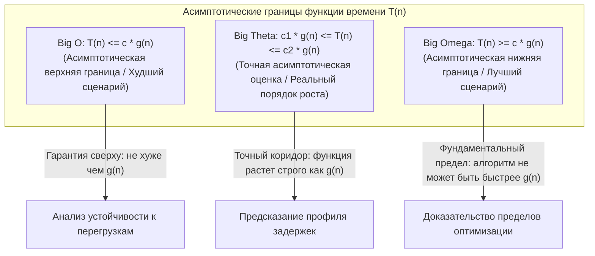
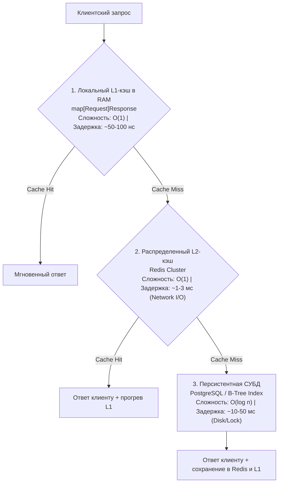

# 2. Асимптотическая сложность: Big O, Big Theta, Big Omega и реалии рантайма Go

> *"Premature optimization is the root of all evil. Yet we should not pass up our opportunities in that critical 3%."*  
> — Дональд Кнут

## Зачем бэкенд-разработчику асимптотическая сложность

В инженерных беседах нередко можно услышать скептический вопрос: «Зачем мне забивать голову математическими пределами $O(n)$ и $O(n \log n)$, если в продакшене у меня всегда под рукой профайлер `pprof`?». 

Ответ прост: профайлер хладнокровно констатирует факт — **что именно тормозит в данную секунду на текущем стенде**. Но он не способен объяснить, **почему** это происходит и **как система поведет себя завтра**, когда число активных пользователей вырастет со ста до ста тысяч.

Асимптотический анализ — это не сухая вузовская теория. Это **инструмент инженерного предсказания будущего**. Проектируя сервис с пропускной способностью 1 000 RPS, вы обязаны заранее знать, переживет ли выбранная архитектура Черную Пятницу на 100 000 RPS. Проводить натурные эксперименты на живом бизнесе — непозволительная роскошь.

> [!tip] Собеседование
> **Вопрос:** «У вас есть функция, которая работает быстро на 100 элементах, но «падает» на 100 000. С чего начнёте диагностику?»
>
> **Сильный ответ:** «Сначала оценю асимптотическую сложность ключевых операций. Если вижу вложенные циклы — O(n²) — это первый кандидат. Затем посмотрю на аллокации памяти: возможно, каждый шаг создаёт новый слайс или мапу, что даёт нагрузку на GC. Проверю, нет ли блокировок на мьютексах при росте числа горутин. И только потом запущу pprof, чтобы подтвердить гипотезы».

---

## Три нотации: не только Big O

В разговорной речи программисты часто обобщают: «сложность этого алгоритма — $O(n)$». Однако строгое математическое моделирование, введенное Дональдом Кнутом на базе трудов Пола Бахмана и Эдмунда Ландау, оперирует тремя фундаментальными границами функции времени $T(n)$:



### 1. Big O (O) — верхняя граница («не хуже чем»)

Математически $O(g(n))$ описывает множество функций, скорость роста которых при $n \to \infty$ ограничена сверху функцией $g(n)$ с точностью до константного множителя $c$:
$$\exists c > 0, n_0 > 0 : \forall n \ge n_0, \quad 0 \le T(n) \le c \cdot g(n)$$

```go
// Пример: линейный поиск в слайсе
func LinearSearch(slice []int, target int) bool {
    for _, v := range slice { // O(n) итераций
        if v == target {
            return true
        }
    }
    return false
}
```

Здесь $T(n) \le c \cdot n$. Мы говорим: «линейный поиск работает за $O(n)$», гарантируя, что даже при самом неблагоприятном расположении элементов время выполнения не превысит линейную функцию.

> [!info] Под капотом
> В Go линейный проход по слайсу — это не просто «n шагов». Каждый шаг:
> * Читает 8 байт (int на amd64) из памяти.
> * При последовательном доступе работает аппаратный префетчинг: процессор заранее подгружает следующие кэш-линии (64 байта) в L1.
> * Поэтому реальное время — не просто c·n, а c·n / k, где k — эффективность кэширования.
> * Но асимптотика остаётся O(n): удвоение n удвоит время, если данные не помещаются в кэш.

### 2. Big Omega (Ω) — нижняя граница («не лучше чем»)

Математически $\Omega(g(n))$ описывает нижнюю границу: функция растет **не медленнее**, чем $g(n)$:
$$\exists c > 0, n_0 > 0 : \forall n \ge n_0, \quad 0 \le c \cdot g(n) \le T(n)$$

```go
// Пример: доступ к элементу слайса по индексу
func GetByIndex(slice []int, i int) (int, error) {
    if i < 0 || i >= len(slice) {
        return 0, errors.New("index out of range") // O(1) проверка
    }
    return slice[i], nil // O(1) доступ
}
```

Доступ по индексу в массиве — это $\Omega(1)$: операция физически не способна завершиться быстрее одного обращения к оперативной памяти или кэшу.

### 3. Big Theta (Θ) — точная оценка («растет в точности как»)

Когда верхняя и нижняя границы совпадают, то есть функция зажата в коридоре между $c_1 \cdot g(n)$ и $c_2 \cdot g(n)$, мы получаем точную оценку:
$$\Theta(g(n)) = O(g(n)) \cap \Omega(g(n))$$

```go
// Пример: суммирование элементов слайса
func Sum(slice []int) int {
    total := 0
    for _, v := range slice { // Ровно n итераций
        total += v
    }
    return total
}
```

Здесь $T(n) = c \cdot n + d$, что дает честную асимптотику $\Theta(n)$. Цикл обязан прочитать каждый элемент без ранних выходов.

> [!warning] Ловушка / Gotcha: Big O — это не скорость, это скорость роста
> Распространенная ошибка — путать низкую асимптотику с абсолютной быстротой в наносекундах. 
> Алгоритм с теоретической сложностью $O(n)$ на малых размерах выборки ($n < 20$) может в разы проигрывать наивному алгоритму $O(n^2)$ из-за тяжелых константных множителей и ветвлений. 
> 
> Создатели стандартной библиотеки Go учитывают это в модуле [[8. Сортировки/9. Внутренности пакета sort в Go]]: для коротких срезов быстрая сортировка $O(n \log n)$ намеренно переключается на тривиальную сортировку вставками (Insertion Sort) $O(n^2)$, выигрывая за счет прогрева кэша L1 и отсутствия накладных расходов рекурсивных вызовов.

---

## Практическая таблица сложностей для бэкенда

| Сложность | Название | Пример в бэкенде | Реальное влияние в Go |
|:---|:---|:---|:---|
| **O(1)** | Константная | Доступ к `map` по ключу, атомарная операция `sync/atomic` | 1 обращение к кэшу L1/L3, 0 аллокаций в куче, нулевое давление на GC |
| **O(log n)** | Логарифмическая | Поиск в [[4. Деревья. Основы/3. Двоичное дерево поиска|BST]], бинарный поиск | ~20 итераций для 1 миллиона записей; каждый шаг по указателям — потенциальный cache miss |
| **O(n)** | Линейная | Сериализация JSON, проход по слайсу, фильтрация | Время строго пропорционально объему данных; непрерывные массивы идеально утилизируют префетчер |
| **O(n log n)** | Линейно-логарифмическая | Сортировка (`slices.Sort`), группировка логов | Золотой стандарт эффективной сортировки; требует внимания к аллокациям временных буферов |
| **O(n²)** | Квадратичная | Вложенные циклы, наивное сравнение всех пар | Критическая опасность: 1 000 элементов $\to$ 1 млн операций; 100 000 элементов $\to$ 10 млрд операций |
| **O(2ⁿ)** | Экспоненциальная | Полный перебор подмножеств, наивная рекурсия Фибоначчи | Гарантированный коллапс сервиса в проде при $n > 35$ |

---

## Go-специфика: как сложность проявляется в рантайме

В распределенных Go-микросервисах абстрактное процессорное время неразрывно связано с **аллокациями памяти**. Каждая аллокация в кучу (heap) порождает двойной удар по производительности:
1. Затраты на выделение чанка в `mcache` / `mcentral`.
2. Будущие накладные расходы [[7. Глубокий Go (Внутреннее устройство)|сборщика мусора]] (GC Pacer), сканирующего указатели кучи пропорционально ее совокупному объему.

### 1. Катастрофа конкатенации строк
Классический антипаттерн, порождающий квадратичную сложность по времени и памяти:

```go
// Плохо: создаём новый слайс на каждой итерации — O(n²) аллокаций
func BadConcat(strings []string) string {
    result := ""
    for _, s := range strings { // n итераций
        result += s // Создаёт новый string каждый раз!
    }
    return result
}

// Хорошо: используем strings.Builder — O(n) аллокаций
func GoodConcat(strings []string) string {
    var b strings.Builder
    b.Grow(estimateSize(strings)) // Предварительное выделение, избегает реаллокаций
    for _, s := range strings {
        b.WriteString(s)
    }
    return b.String()
}
```

> [!info] Под капотом
> Строки в Go неизменяемы (`immutable`). Выражение `result += s` не модифицирует существующую память, а выделяет в куче новый байтовый буфер размера $\text{len}(result) + \text{len}(s)$, копируя в него все предыдущие данные.
> 
> Для $n$ строк длиной $m$:
> * Суммарное время: $O(n^2 \cdot m)$ из-за бесконечного перекопирования байт.
> * Объем мусора в куче: $O(n^2 \cdot m)$, что вызывает удушающие задержки GC Stop-The-World и сжигает гигабайты RAM.
> * Использование `strings.Builder` с предварительным резервированием `Grow()` снижает сложность до линейных $O(n \cdot m)$ с ровно **одной** аллокацией.

### 2. Конкурентность не спасает от плохой асимптотики
Часто начинающие инженеры пытаются маскировать неэффективные алгоритмы параллелизмом: «У меня здесь $O(n^2)$, но я разбросаю вычисления на 100 горутин!».

```go
// Не делайте так: параллелизм не меняет асимптотику
func ParallelBad(data [][]int) []int {
    results := make([]int, len(data))
    var wg sync.WaitGroup
    for i, row := range data { // n строк
        wg.Add(1)
        go func(idx int, r []int) {
            defer wg.Done()
            // O(n) на строку → общая сложность O(n²)
            results[idx] = expensiveOp(r) 
        }(i, row)
    }
    wg.Wait()
    return results
}
```

Запуск горутин распределяет нагрузку по доступным ядрам ОС (`GOMAXPROCS`), но **суммарный объем вычислений остается строго $O(n^2)$**. Более того, к квадратичной сложности добавляются накладные расходы планировщика Go на создание структур `runtime.g`, синхронизацию очередей `work-stealing` и переключение контекста.

> [!tip] Собеседование
> **Вопрос:** «Может ли параллельный алгоритм иметь меньшую асимптотическую сложность, чем последовательный?»
>
> **Ответ:** В модели с неограниченным числом процессоров — теоретически да (например, параллельное суммирование за O(log n)). Но в реальности с фиксированным числом ядер сложность по времени не может стать лучше, чем работа / ядра. Для бэкенда важнее **пропускная способность** (через параллелизм), а не латентность одного запроса.

---

## Бенчмарки: когда теория встречается с практикой

Продемонстрируем на живом коде Go драматическую разницу между квадратичным поиском дубликатов $O(n^2)$ и линейным алгоритмом с хеш-таблицей $O(n)$.

```go
// O(n²): наивное сравнение всех пар
func HasDuplicatesNaive(slice []int) bool {
    for i := 0; i < len(slice); i++ {
        for j := i + 1; j < len(slice); j++ {
            if slice[i] == slice[j] {
                return true
            }
        }
    }
    return false
}

// O(n): использование map для отслеживания увиденных значений
func HasDuplicatesMap(slice []int) bool {
    seen := make(map[int]struct{}, len(slice))
    for _, v := range slice {
        if _, exists := seen[v]; exists {
            return true
        }
        seen[v] = struct{}{}
    }
    return false
}
```

Запустим бенчмарки на срезе из 1 000 целых чисел:

```go
//go:build ignore

package main

import "testing"

func BenchmarkDuplicatesNaive(b *testing.B) {
    data := make([]int, 1000)
    for i := range data {
        data[i] = i % 500 // Гарантируем дубликаты
    }
    b.ResetTimer()
    for i := 0; i < b.N; i++ {
        _ = HasDuplicatesNaive(data)
    }
}

func BenchmarkDuplicatesMap(b *testing.B) {
    data := make([]int, 1000)
    for i := range data {
        data[i] = i % 500
    }
    b.ResetTimer()
    for i := 0; i < b.N; i++ {
        _ = HasDuplicatesMap(data)
    }
}
```

```bash
$ go test -bench=. -benchmem
goos: linux
goarch: amd64
BenchmarkDuplicatesNaive-8      12543    95234 ns/op        0 B/op    0 allocs/op
BenchmarkDuplicatesMap-8       187654     6421 ns/op     8192 B/op    1 allocs/op
```

**Анализ результатов:**
1. Алгоритм $O(n)$ выполнился за **6.4 мкс**, обогнав квадратичный алгоритм (**95.2 мкс**) почти в **15 раз** всего на 1 000 элементов.
2. Однако обратите внимание на аллокации: `HasDuplicatesMap` выделил 8 192 байта в куче под бакеты `map`. При интенсивности в 10 000 запросов в секунду такой код будет генерировать более 80 МБ мусора в секунду.
3. Если бы размер входного массива составлял всего 8 элементов, квадратичный поиск без единой аллокации опередил бы `map` за счет идеальной кэш-локальности.

> [!warning] Ловушка / Gotcha
> **Не оптимизируйте сложность в ущерб простоте без профилирования.**
> Если слайс гарантированно мал (например, ≤ 10 элементов), наивный O(n²) код может быть быстрее из-за отсутствия аллокаций и лучшего предсказания ветвлений. Всегда измеряйте на реальных данных!

---

## Сложность и системный дизайн: масштабирование архитектур

Понятие асимптотической сложности выходит далеко за рамки отдельных циклов `for` в коде Go — оно напрямую определяет архитектуру многоуровневых распределенных хранилищ.

Рассмотрим трехуровневое кэширование в соответствии с паттерном [[14. Практические паттерны/1. Проектирование кэшей]]:



Хотя и чтение из локальной `map[Request]Response`, и сетевой вызов в Redis формально имеют алгоритмическую сложность $O(1)$, их **физическая стоимость различается на 4 порядка** (100 наносекунд против 2 миллисекунд). Асимптотический анализ дает нам первый грубый фильтр, но окончательное решение всегда сверяется с законами распространения сигналов в сети и задержками устройств ввода-вывода.

---

## Чеклист для код-ревью: оценка сложности алгоритмов

1. **Идентифицируйте входной параметр $n$:** Что выступает в роли масштабируемого аргумента? Число записей в HTTP-запросе? Размер передаваемого файла? Глубина дерева JSON?
2. **Найдите доминирующую операцию:** Какой блок кода выполняется максимальное число раз? Вложенный цикл? Рекурсивный спуск? Ожидание блокировки в `sync.Mutex`?
3. **Оцените профиль аллокаций памяти:** Создаются ли срезы или буферы внутри циклов? Превратится ли временная сложность $O(n)$ в скрытую утечку по памяти с деградацией GC?
4. **Проанализируйте краевые случаи (Worst Case):** Что произойдет при вырожденных данных? Например, падение QuickSort до $O(n^2)$ при неудачном выборе опорного элемента или деградация хеш-таблицы при коллизиях.
5. **Мысленный эксперимент масштабирования:** Спросите себя: «Что произойдет, если объем данных увеличится в 10 раз?». Если время выполнения вырастет в 10 раз — перед вами честный $O(n)$. Если в 100 раз — это $O(n^2)$, требующий немедленного рефакторинга.

> [!tip] Собеседование
> **Вопрос:** «Какова сложность этой функции?» (показывают код с `sort.Slice` внутри цикла)
>
> **Подход к ответу:**
> 1. Внешний цикл: O(m) итераций.
> 2. `sort.Slice` внутри: O(k log k), где k — размер слайса.
> 3. Если k зависит от m (например, k = m), то общая сложность: O(m · m log m) = O(m² log m).
> 4. Уточните: «Зависит ли размер слайса от числа итераций? Если k константно, то сложность O(m)».

---

## Резюме

1. **Big O** — ваш главный инженерный щит против деградации систем при масштабировании данных.
2. **Big Omega и Big Theta** — математические инструменты для строгой фиксации нижней границы и точного коридора поведения алгоритмов.
3. **В рантайме Go память эквивалентна времени:** Каждая небрежная аллокация в кучу увеличивает латентность за счет работы планировщика сборщика мусора.
4. **Параллелизм не исправляет неэффективные алгоритмы:** Запуск горутин увеличивает утилизацию ядер CPU, но не сокращает суммарное число операций $O(n^2)$.
5. **Многоуровневый анализ:** Алгоритмическая сложность должна всегда сопоставляться с физическими характеристиками иерархии памяти.

В следующей лекции мы погрузимся в один из самых изящных разделов теории алгоритмов: разберем, почему встроенная функция `append` для срезов Go считается работающей за константное время $O(1)$, несмотря на периодические дорогие реаллокации и копирование массивов. 

Переходим к изучению: [[3. Амортизированный анализ]].