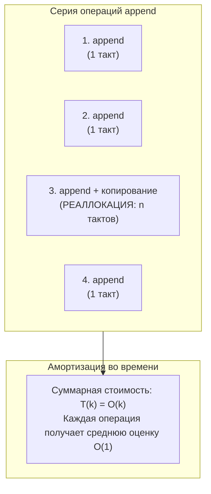
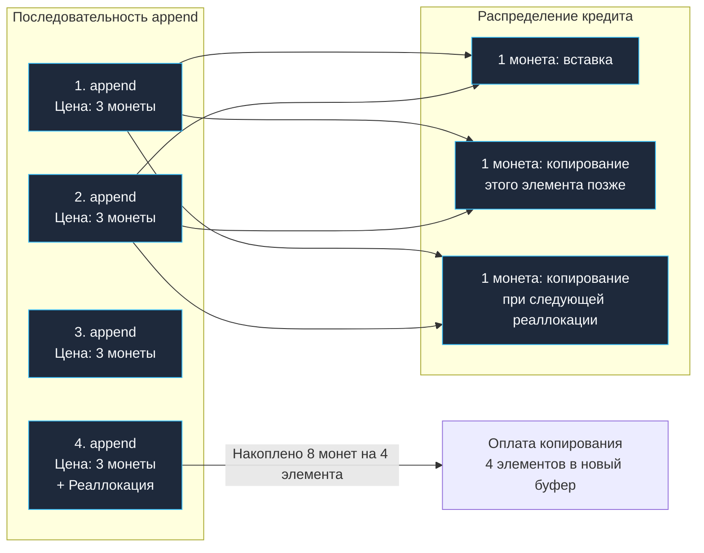
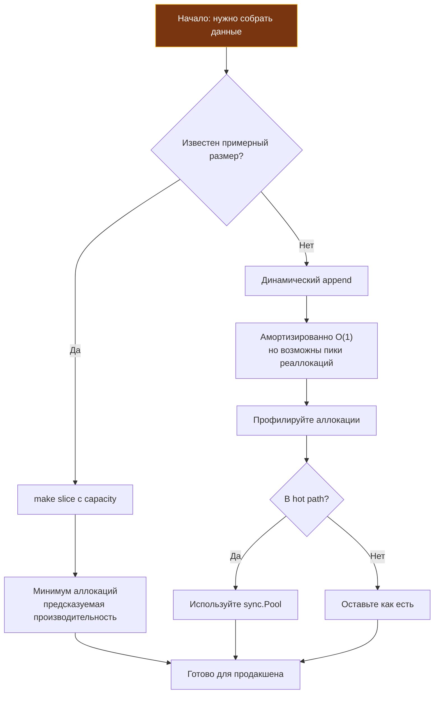

## Почему амортизация важнее худшего случая для бэкенда

В предыдущей статье мы разобрали асимптотические нотации и увидели, как `O(n²)` может убить производительность сервиса. Но жизнь инженера полна полутонов: не каждая операция в алгоритме одинаково «дорогая». Иногда редкая, чудовищно тяжелая операция распределяется по длинной цепочке дешевых и быстрых действий, так что **средняя стоимость** каждого шага оказывается микроскопической.

Это и есть суть **амортизированного анализа** (amortized analysis) — метода оценки сложности непрерывной последовательности операций, где во главу угла ставится не единичный худший случай, а **совокупная стоимость всей серии**.

В повседневной разработке бэкенда на Go амортизация встречается на каждом шагу: от встроенных слайсов (`append`) и хэш-таблиц (`map[K]V`) до очередей задач, кольцевых буферов и LSM-деревьев в хранилищах данных вроде Badger или RocksDB.

> [!tip] Собеседование
> **Вопрос:** «Почему `append` к слайсу в Go считается O(1), хотя периодически он выполняет реаллокацию и копирует весь массив — что очевидно требует O(n) времени и памяти?»
>
> **Ответ:** Потому что асимптотическая оценка дается не изолированному единичному вызову, а последовательности из n операций `append`. Дорогая реаллокация с аллокацией новой памяти и копированием старых элементов происходит относительно редко (по геометрической прогрессии). Ее накладные расходы математически «размазываются» (амортизируются) по всем предшествующим дешевым вставкам. В результате **амортизированная** сложность одной операции добавления составляет строго O(1).

---

## Что такое амортизированная сложность

**Амортизированная сложность** — это строгая математическая гарантия на **среднюю стоимость операции в худшей возможной последовательности**. 

Подчеркнем фундаментальное различие: это **не** «средний случай» (average-case) в вероятностном смысле. Вероятностный анализ предполагает случайное распределение входных данных (например, случайный порядок ключей в Quicksort). Амортизированный анализ гарантирует, что даже если коварный противник специально сформирует наихудшую последовательность запросов, среднее время операции на длинной дистанции гарантированно не превысит заявленного предела.

Формально: если последовательность из `k` операций имеет общую сложность `T(k)`, то амортизированная стоимость одной операции — это `T(k) / k`.

$$\text{Amortized Cost} = \frac{T(k)}{k}$$



---

### Три метода анализа

В теоретической информатике и классическом труде Кормена, Лейзерсона, Ривеста и Штайна выделяют три метода доказательства амортизированной сложности.

#### 1. Метод агрегации (Aggregate Method)

Самый наглядный и практичный метод: мы вычисляем суммарную стоимость последовательности из `n` операций «в лоб», суммируя фактические затраты, а затем делим результат на `n`.

**Пример: `append` к слайсу с геометрическим ростом**

Представим идеализированный динамический массив:

```go
// Псевдокод роста слайса
func appendSlice(slice []T, elem T) []T {
    if len(slice) < cap(slice) {
        // Дешёвый случай: есть место в буфере, просто записываем
        slice = slice[:len(slice)+1]
        slice[len(slice)-1] = elem
        return slice
    }
    // Дорогой случай: реаллокация
    newCap := growCapacity(cap(slice)) // например, удваиваем
    newSlice := make([]T, len(slice)+1, newCap)
    copy(newSlice, slice) // O(n) копирование элементов в новый буфер!
    newSlice[len(slice)] = elem
    return newSlice
}
```

Пусть мы начинаем с пустого слайса (`cap = 0`) и последовательно добавляем `n` элементов с удвоением емкости при каждом исчерпании (`cap: 1 -> 2 -> 4 -> 8 -> ...`).

Реаллокация и копирование элементов произойдут при размерах: $1, 2, 4, 8, \dots, 2^{\lfloor \log_2 n \rfloor}$.

Суммарное число операций копирования:

$$1 + 2 + 4 + 8 + \dots + 2^{\lfloor \log_2 n \rfloor} < 2n$$

К этим копированиям добавляются ровно `n` дешевых вставок элементов в свободные ячейки. Суммарная стоимость всех `n` операций:
```
T(n) < 3n
```

Итоговая амортизированная стоимость:
```
T(n)/n < 3 = O(1)
```

Амортизированная стоимость одной операции `append` составляет константу (не более 3 условных шагов).

---

#### 2. Метод учёта (Accounting Method)

Метод бухгалтерского учета («виртуальные монеты»): каждой элементарной операции приписывается фиктивная учетная стоимость (amortized charge), которая может быть как выше, так и ниже ее реальной стоимости.

Если учетная стоимость операции превышает ее фактическую стоимость, разница («сдача» или прибыль) зачисляется на виртуальный депозит соответствующего элемента структуры данных. Впоследствии эти накопленные кредиты тратятся на оплату редких и дорогих операций.

Для операции `append` при росте с удвоением:
*   Назначаем цену 3 монеты за операцию.
*   1 монета платит за текущую вставку.
*   1 монета откладывается на будущее копирование **этого** элемента.
*   1 монета откладывается на копирование элемента **при следующей реаллокации**.

Когда емкость массива заполняется и требуется выделить вдвое больший блок памяти, у каждого элемента в текущем массиве на счете лежит ровно по 1 монете. Этого в точности хватает, чтобы оплатить копирование всех `n` элементов в новый блок! Депозит никогда не уходит в минус, что доказывает корректность границы `O(1)`.



---

#### 3. Метод потенциала (Potential Method)

Самый строгий математический аппарат. Вместо распределения виртуальных монет по элементам мы вводим глобальную **функцию потенциала** $\Phi(D)$, которая отображает текущее состояние структуры данных $D$ в действительное неотрицательное число («накопленная энергия»).

Амортизированная стоимость $i$-й операции $a_i$ выражается через фактическую стоимость $c_i$ и изменение потенциала:

$$a_i = \text{actual\_cost}_i + \Phi(D_i) - \Phi(D_{i-1})$$

Где $D_i$ — состояние после $i$-й операции, $D_{i-1}$ — до нее.

Для динамического слайса с текущей длиной `len` и емкостью `cap` можно выбрать функцию потенциала:

$$\Phi = 2 \cdot \text{len} - \text{cap}$$

Разберем оба сценария:
*   Когда `len` растёт без реаллокации: `Φ` увеличивается на 2, фактическая стоимость 1 → амортизированная: `1 + 2 = 3`.
*   При реаллокации: `cap` удваивается, `Φ` резко падает, компенсируя высокую фактическую стоимость копирования.

Суммируя по всем операциям, «потенциал» в конце неотрицателен → сумма амортизированных стоимостей $\ge$ сумме фактических.

---

## Рост ёмкости слайсов в Go: не просто «умножить на два»

В академической теории принято рассматривать удвоение емкости ($k = 2$). В реальном рантайме Go инженеры столкнулись с дилеммой: при коэффициенте 2 для слайса размером 1 ГБ следующая реаллокация запросит 2 ГБ памяти, оставив 1 ГБ в «воздухе», что приведет к катастрофическому перерасходу оперативной памяти и OOM-киллеру.

> [!info] Под капотом
> Исходный код функции роста ёмкости находится в `runtime/slice.go` (`growslice`).
> До версии Go 1.18 граница переключения составляла 1024 элемента:
> ```go
> func growslice(et *_type, old slice, cap int) slice {
>     // ...
>     newcap := old.cap
>     doublecap := newcap + newcap
>     if cap > doublecap {
>         newcap = cap
>     } else {
>         if old.cap < 1024 {
>             newcap = doublecap // *2 для малых слайсов
>         } else {
>             // Для больших слайсов рост на ~25% для экономии памяти
>             for 0 < newcap && newcap < cap {
>                 newcap += newcap / 4
>             }
>             if newcap <= 0 {
>                 newcap = cap
>             }
>         }
>     }
>     // ...
> }
> ```
>
> Начиная с **Go 1.18+ (и актуально в 1.22–1.24)**, формула стала адаптивнее: граница снижена до 256 (`threshold = 256`), а рост вычисляется по формуле `newcap += (newcap + 3*threshold) / 4`, плавно переводя коэффициент от $\times 2.0$ к $\times 1.25$.
> 
> **Почему так?**
> *   Для малых слайсов (<256) частые реаллокации дороже, чем перерасход памяти → рост в 2 раза.
> *   Для больших слайсов копирование сотен мегабайт — дорого, а «лишние» 25% ёмкости — разумный компромисс.
> *   После вычисления `newcap` рантайм вызывает `roundupsize`, округляя размер до стандартного сайз-класса аллокатора Go.

Это означает, что амортизированная сложность `append` остается `O(1)`, но **константа** зависит от размера данных. Для бэкенда это критично: если вы агрегируете мегабайты логов в слайс байт, вы можете неожиданно получить всплеск аллокаций и паузу GC.

```go
// Пример: агрегация больших данных
func AggregateLogs(logs [][]byte) []byte {
    var result []byte
    for _, log := range logs {
        result = append(result, log...) // Может вызывать реаллокации
    }
    return result
}

// Оптимизация: предварительное выделение ёмкости
func AggregateLogsOptimized(logs [][]byte) []byte {
    // Оцениваем общий размер за один проход
    total := 0
    for _, log := range logs {
        total += len(log)
    }
    // Выделяем память сразу — избегаем реаллокаций
    result := make([]byte, 0, total)
    for _, log := range logs {
        result = append(result, log...)
    }
    return result
}
```

---

## Escape Analysis и аллокации: скрытая цена амортизации

Амортизированный анализ в Go должен учитывать не только CPU-время, но и **аллокации в куче**, потому что они влияют на работу [[7. Глубокий Go (Внутреннее устройство)|сборщика мусора]].

```go
func AmortizedAppend() []int {
    var s []int
    for i := 0; i < 1000; i++ {
        s = append(s, i) // s "escape"-ит в кучу, если возвращается
    }
    return s // Возврат → аллокация в куче
}
```

> [!info] Под капотом
> Компилятор Go выполняет **Escape Analysis** на этапе компиляции:
> *   Если слайс не «убегает» из функции (не возвращается, не передаётся в другую горутину), он может быть размещён на стеке — это почти бесплатно.
> *   Если слайс «убегает» — аллокация в куче, что создаёт работу для GC.
> *   Реаллокация при `append` всегда происходит в куче, даже если исходный слайс был на стеке.
>
> Проверить, где размещается переменная:
> ```bash
> go build -gcflags="-m" your_file.go 2>&1 | grep "moved to heap"
> ```

**Влияние на производительность:**
*   Стек: аллокация — сдвиг указателя, освобождение — сдвиг обратно. Около 1-2 тактов.
*   Куча: аллокатор рантайма (tcmalloc-like), поиск свободного блока, возможная синхронизация. 50-100 тактов + будущая работа GC.

Поэтому амортизированная сложность `O(1)` по времени может скрывать `O(1)` аллокаций в кучу, что при высокой частоте операций создаёт значительное давление на GC.

---

## Бенчмарки: амортизация в действии

Сравним два подхода к построению большого слайса:

```go
//go:build ignore

package main

import "testing"

const N = 100000

func BenchmarkAppendNaive(b *testing.B) {
    b.ResetTimer()
    for i := 0; i < b.N; i++ {
        var s []int
        for j := 0; j < N; j++ {
            s = append(s, j) // Амортизированно O(1), но с реаллокациями
        }
    }
}

func BenchmarkAppendPreallocated(b *testing.B) {
    b.ResetTimer()
    for i := 0; i < b.N; i++ {
        s := make([]int, 0, N) // Предварительное выделение
        for j := 0; j < N; j++ {
            s = append(s, j) // Только дешёвые вставки
        }
    }
}
```

```bash
$ go test -bench=. -benchmem
goos: linux
goarch: amd64
BenchmarkAppendNaive-8             1234    952341 ns/op    409600 B/op    17 allocs/op
BenchmarkAppendPreallocated-8      4567    264123 ns/op    409600 B/op     1 allocs/op
```

**Анализ:**
*   Оба варианта аллоцируют одинаковый объём памяти (~400 КБ для 100к int).
*   Но в наивном варианте происходит **17 аллокаций** из-за реаллокаций при росте ёмкости.
*   Предварительное выделение сокращает число аллокаций до 1 → меньше работы для аллокатора и GC.
*   Разница во времени: **в 3.6 раза** быстрее.

> [!warning] Ловушка / Gotcha
> **Амортизированная гарантия не означает «нет пиков»**.
> В реальном времени реаллокация слайса из 1 млн элементов потребует:
> *   Выделения 8 МБ непрерывной памяти (для `[]int64`).
> *   Копирования 8 МБ данных.
> *   Это может занять 1-2 мс — что критично для low-latency сервисов.
>
> Если ваша система чувствительна к хвостам распределения (p99, p99.9), **избегайте непредсказуемых реаллокаций в hot path**. Используйте `sync.Pool` для переиспользования буферов или предварительное выделение.

---

## Когда амортизированные гарантии «ломаются»

Амортизированный анализ предполагает, что вы выполняете **произвольную последовательность** операций. Но в реальности паттерны доступа могут быть враждебными.

### Паттерн 1: Чередование append и truncate

```go
var s []int
for i := 0; i < 1000000; i++ {
    s = append(s, i)      // Иногда реаллокация
    s = s[:0]             // Сброс длины, но ёмкость сохраняется
    // На следующей итерации снова может потребоваться реаллокация,
    // если данные не помещаются в старую ёмкость
}
```

Если данные растут, а вы периодически сбрасываете слайс, но не освобождаете память, вы можете «застрять» в цикле реаллокаций.

### Паттерн 2: Множество мелких слайсов

```go
func ProcessMany(items []Item) {
    for _, item := range items {
        var buf []byte // Новый слайс на каждой итерации
        for i := 0; i < 100; i++ {
            buf = append(buf, item.Data[i])
        }
        send(buf)
    }
}
```

Здесь амортизация работает **внутри** одной итерации (100 `append`), но **между** итерациями вы создаёте новый слайс каждый раз → много мелких аллокаций в куче, фрагментация, нагрузка на GC.

**Решение: Использовать `sync.Pool` для переиспользования буферов:**

```go
var bufPool = sync.Pool{
    New: func() any { return make([]byte, 0, 128) },
}

func ProcessMany(items []Item) {
    for _, item := range items {
        buf := bufPool.Get().([]byte)
        buf = buf[:0] // Сброс длины, сохранение ёмкости
        for i := 0; i < 100; i++ {
            buf = append(buf, item.Data[i])
        }
        send(buf)
        bufPool.Put(buf) // Возврат в пул
    }
}
```

---

## Интервью: вопросы на амортизированный анализ

> [!tip] Собеседование
> **Вопрос 1:** «Почему вставка в конец `std::vector` в C++ или `ArrayList` в Java тоже O(1) амортизированно?»
>
> **Ответ:** Потому что все они используют стратегию геометрического роста ёмкости при реаллокации. Конкретный коэффициент (2, 1.5, 1.25) влияет на константу, но не на асимптотику.
>
> **Вопрос 2:** «Может ли амортизированная сложность быть хуже, чем худший случай одной операции?»
>
> **Ответ:** Нет, по определению. Амортизированная оценка — это верхняя граница на среднюю стоимость в последовательности. Но важно помнить: отдельная операция может быть дороже амортизированной оценки.
>
> **Вопрос 3:** «Как доказать, что `append` к слайсу — O(1) амортизированно, используя метод потенциала?»
>
> **Ответ:** Выбрать функцию потенциала Φ = 2·len - cap. Показать, что для дешёвой вставки: `a = 1 + (2·(len+1) - cap) - (2·len - cap) = 3`. Для реаллокации: `cap` удваивается, Φ резко падает, компенсируя стоимость копирования. Сумма амортизированных стоимостей ≥ сумме фактических.

---

## Практические рекомендации для бэкенд-разработчика

1.  **Используйте `make` с ёмкостью**, когда известен примерный размер результата. Это не меняет асимптотику, но сокращает константу и число аллокаций.
2.  **Профилируйте аллокации**, а не только время: `go test -bench=. -benchmem` или `pprof --alloc_objects`.
3.  **Избегайте `append` в циклах с неизвестным числом итераций**, если данные могут быть большими. Лучше собрать данные в `chan` или использовать `io.Writer`.
4.  **Помните про `sync.Pool`** для переиспользования буферов в высоконагруженных сервисах.
5.  **Документируйте предположения** о размере данных. Если функция предполагает «малый вход», но получает большой — амортизация может не спасти.



---

## Итог

*   **Амортизированный анализ** — это инструмент оценки средней стоимости операции в последовательности, а не отдельного вызова.
*   Три метода (агрегация, учёт, потенциал) дают разные способы доказательства, но ведут к одному выводу для динамических массивов: **O(1) на `append`**.
*   В Go рост ёмкости слайсов оптимизирован: *2 для малых, +25% для больших, чтобы балансировать между частотой реаллокаций и перерасходом памяти.
*   **Аллокации в кучу** — скрытая цена амортизации: даже если время O(1), давление на GC может быть значительным.
*   **Пики реаллокаций** существуют: для low-latency систем используйте предварительное выделение или пулы буферов.
*   **Амортизация не спасает от плохих паттернов**: чередование `append`/`truncate` или множество мелких слайсов могут свести выгоды на нет.

Следующая статья переносит фокус с времени на **память**. Мы разберём, как **пространственная сложность** и **cache locality** влияют на реальную производительность кода в Go, почему непрерывные структуры данных (слайсы, массивы) часто быстрее «умных» указательных структур, и как это связано с иерархией кэшей процессора.

[[4. Пространственная сложность и cache locality]]